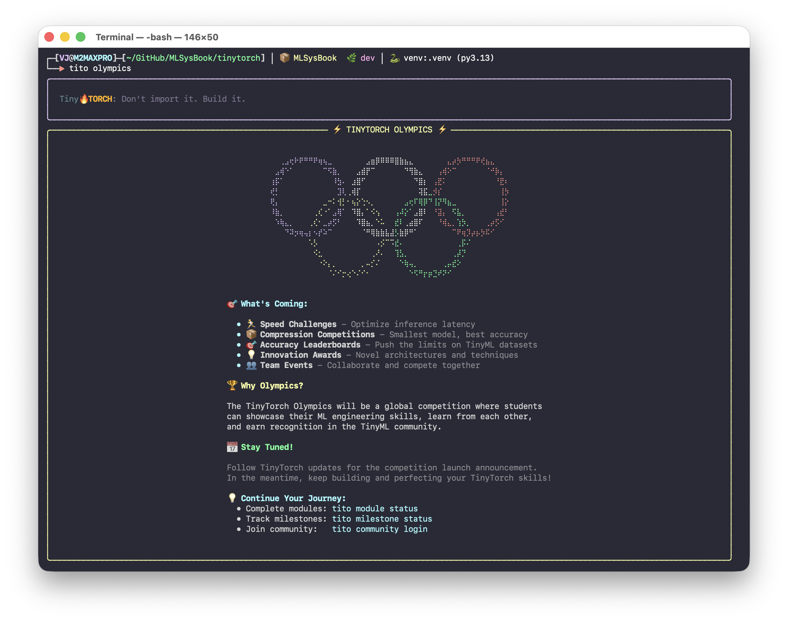

{fig-alt="TinyTorch Olympics" fig-align="center" width="600px"}

The TinyTorch Olympics is the **capstone competition** (Module 20) of the TinyTorch curriculum. You have spent 19 modules building an entire machine learning systems stack from scratch—from tensors and automatic differentiation to transformers and performance measurement.

Now, you put your engineering to the test. In the TinyTorch Olympics, you take your custom framework and compare models through five classroom events and a common benchmark report.

---

## The Five Classroom Events

Module 20 defines these event names and eligibility checks in `OlympicEvent` and `qualifies_event()`:

| Event | Identifier | Eligibility |
|:---|:---|:---|
| **Latency Sprint** | `LATENCY_SPRINT` | Accuracy at least 85% |
| **Memory Challenge** | `MEMORY_CHALLENGE` | Accuracy at least 85% |
| **Accuracy Contest** | `ACCURACY_CONTEST` | Median latency below 100 ms and reported model size below 10 MiB |
| **All-Around** | `ALL_AROUND` | Valid measurements; compare accuracy, latency, and storage separately |
| **Extreme Push** | `EXTREME_PUSH` | Accuracy at least 80% |

: **Classroom event eligibility implemented in Module 20.** {#tbl-olympic-events}

Every event requires finite accuracy in [0, 1], positive median latency, and positive model storage. The `model_size_mb` field stores array bytes divided by $1024^2$; use that same field when checking the size threshold. The report also measures batch throughput, separately from single-sample latency.

---

## The Rules of Competition

Use the following practices to make classroom comparisons reproducible:

### 1. Record the Dataset and Check Event Eligibility
A model that runs in zero milliseconds but predicts randomly is useless. For a TinyDigits classroom challenge, evaluate on the **200-example test split** shipped in `datasets/tinydigits/test.pkl`. The separate training split contains 1,000 examples. Both contain $8 \times 8$ grayscale digits with float32 pixel values already normalized to [0, 1].

`BenchmarkReport.benchmark_model()` evaluates the `X_test` and `y_test` arrays you supply; it does not load a fixed dataset. Record the dataset, split, and preprocessing alongside your results. Module 20's introductory benchmark uses 100 synthetic samples to demonstrate the API, so its results are not TinyDigits accuracy measurements.

### 2. Build-From-Scratch Invariant
Run your models on the TinyTorch components you built. Use the same evaluation inputs for the baseline and candidate, and document each transformation. Schema validation checks the report structure; it does not inspect model implementations or enforce a classroom policy.

### 3. Repeatability & Warmup Invariant
`BenchmarkReport` runs untimed warmup forwards before recording single-sample latency. The default is 100 timed runs, with mean, standard deviation, and median latency reported. Batch throughput is timed separately. Keep the model in evaluation mode and compare runs on the same machine; `num_runs` is configurable and must be positive.

---

## Compare the Measurements

All-Around keeps accuracy, latency, storage, and throughput separate. There is no built-in composite efficiency formula or automatic ranking. When you provide baseline and optimized reports, `generate_submission()` records the latency ratio, storage ratio, and accuracy change. Inspect all three before choosing a candidate.

---

## TITO CLI Status

The competition CLI is still under development. `tito olympics logo` prints the logo; every other subcommand, `status` included, prints a "coming soon" panel:

```bash
tito olympics logo
tito olympics status
```

CLI commands for running events, submitting results, and viewing a leaderboard are not implemented. Use the Python API below to create a local benchmark report.

---

## Python API Integration

Use your trained baseline model and evaluation arrays. For TinyDigits, load the shipped test split described in the [datasets guide](../datasets.qmd), flatten each image to 64 features for an MLP, or add a channel axis for a CNN. The pixel values are already in [0, 1].

```python
from tinytorch.olympics import (
    BenchmarkReport,
    OlympicEvent,
    qualifies_event,
    generate_submission,
    validate_submission_schema,
    save_submission,
)
from tinytorch.core.tensor import Tensor

# Supply your trained model, a Tensor of test inputs, and integer test labels.
# Example for an MLP: X_test = Tensor(test_images.reshape(-1, 64))
if hasattr(model, "eval"):
    model.eval()
report = BenchmarkReport(model_name="baseline")
metrics = report.benchmark_model(model, X_test, y_test, num_runs=100)

print(f"Accuracy: {metrics['accuracy'] * 100:.2f}%")
print(f"Median latency: {metrics['latency_ms_median']:.2f} ms")
print(f"Storage field: {metrics['model_size_mb']:.3f}")
print(f"Latency Sprint eligible: {qualifies_event(metrics, OlympicEvent.LATENCY_SPRINT)}")

# Schema validity and event eligibility are separate checks.
submission = generate_submission(
    baseline_report=report,
    student_name="Ada Lovelace",
)
assert validate_submission_schema(submission)
save_submission(submission, "submission.json")
```

To compare an optimized candidate, benchmark it on the same inputs and pass its report as `optimized_report`, along with a `techniques_applied` list. Saving a JSON file is a local operation; it does not upload the results.

---

## Ready to Compete?

Complete the curriculum tiers to build the tools required for victory:

- **[Foundation Tier](foundation.qmd)** (Modules 01–08): Tensors, autograd, and training loops.
- **[Architecture Tier](architecture.qmd)** (Modules 09–13): Convolutions, tokenization, and transformers.
- **[Optimization Tier](optimization.qmd)** (Modules 14–19): Profiling, INT8 quantization, pruning, kernel acceleration, and KV caching.
- **[Capstone Module 20](../modules/20_capstone.qmd)**: The TinyTorch Olympics competition harness.

[← Back to Home](../index.qmd)
