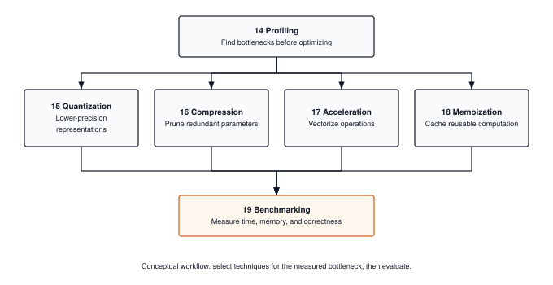
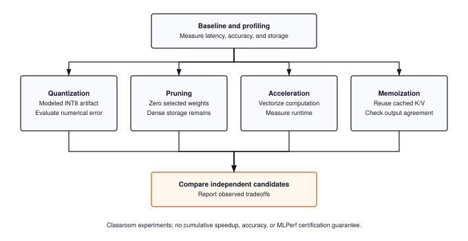

**Measure the trade-offs behind faster, smaller ML systems.**


## What You'll Learn

The Optimization tier teaches you how to make ML systems fast, small, and deployable. You'll learn systematic profiling, model compression through quantization and pruning, inference acceleration with caching and batching, and comprehensive benchmarking methodologies.

**By the end of this tier, you'll understand:**

- How to identify performance bottlenecks through profiling
- How quantization trades precision for storage, and how to measure accuracy changes
- How pruning creates zeros, and why storage savings require a suitable representation
- What KV-caching does to accelerate transformer inference
- How to compare optimization candidates on your hardware


## Module Progression

::: {#fig-optimization-deps}
{fig-alt="Profiling guides experiments in quantization, compression, acceleration, and memoization. Benchmarking compares their measured outcomes."}

**Optimization Module Flow.** Starting from profiling, two parallel tracks: model-level (quantization, compression) and runtime (acceleration, memoization), converging at benchmarking.
:::


## Module Details

### 14. Profiling - Measure Before Optimizing

**What it is**: Tools and techniques to identify computational bottlenecks in ML systems.

**Why it matters**: "Premature optimization is the root of all evil." Profiling tells you WHERE to optimize—which operations consume the most time, memory, or energy. Without profiling, you're guessing.

**What you'll build**: Memory profilers, timing utilities, and FLOPs counters to analyze model performance.

**Systems focus**: Time complexity, space complexity, computational graphs, hotspot identification

**Key insight**: Don't optimize blindly. Profile first, then optimize the bottlenecks.


### 15. Quantization - Smaller Models, Similar Accuracy

**What it is**: Converting FP32 weights to INT8 to reduce model size and speed up inference.

**Why it matters**: Packed INT8 weights use one byte per value versus four for FP32, excluding metadata. TinyTorch demonstrates rounding and reconstruction in dense tensors; actual storage, latency, and accuracy must be measured separately.

**What you'll build**: Post-training quantization (PTQ) for weights and activations with calibration.

**Systems focus**: Numerical precision, scale/zero-point calculation, quantization-aware operations

**Impact**: Compare quantization error and held-out accuracy against the original model, and distinguish modeled packed bytes from actual array bytes.


### 16. Compression - Pruning Unnecessary Parameters

**What it is**: Removing unimportant weights and neurons through structured pruning.

**Why it matters**: Pruning reveals which weights a model can lose while preserving accuracy. Zeroing weights in a dense array preserves its allocation and dense arithmetic; sparse storage or structural changes are needed to reduce those costs.

**What you'll build**: Magnitude-based pruning, structured pruning (entire channels/layers), and fine-tuning after pruning.

**Systems focus**: Sparsity patterns, memory layout, retraining strategies

**Impact**: Measure sparsity and accuracy independently of dense storage size and latency.


### 17. Acceleration - Vectorization and Fusion

**What it is**: BLAS-backed matrix multiplication, explicit block reuse, and grouped NumPy expressions as a bridge to production kernel fusion.

**Why it matters**: Python loop overhead and memory access patterns can dominate runtime. Comparing implementations exposes these costs; gains depend on the operation, input size, and hardware.

**What you'll build**: Vectorized and explicitly tiled matrix multiplication, plus grouped and staged GELU implementations. The NumPy function named `fused_gelu` still allocates intermediate arrays.

**Systems focus**: Cache locality, SIMD utilization, memory bandwidth optimization, loop tiling

**Impact**: Measure matrix multiplication and activation runtimes against their baselines.


### 18. Memoization - KV-Cache for Fast Generation

**What it is**: Caching key-value pairs in transformers to avoid recomputing attention for previously generated tokens.

**Why it matters**: For a prefix of length n, full-prefix attention computes O(n²) scores per generation step. With cached keys and values, the new token needs O(n) scores. Cache management adds overhead, so small workloads can be slower.

**What you'll build**: KV-cache implementation for transformer inference with proper memory management.

**Systems focus**: Cache management, memory vs speed trade-offs, incremental computation

**Impact**: Compare cached and uncached outputs, then measure their speed ratio and cache memory use.


### 19. Benchmarking - Systematic Measurement

**What it is**: Rigorous methodology for measuring model performance across multiple dimensions.

**Why it matters**: "What gets measured gets managed." Benchmarking provides apples-to-apples comparisons of accuracy, speed, memory, and energy—essential for production decisions.

**What you'll build**: Comprehensive benchmarking suite measuring accuracy, latency, throughput, memory, and FLOPs.

**Systems focus**: Measurement methodology, statistical significance, performance metrics

**Historical context**: MLCommons' MLPerf (founded 2018) established systematic benchmarking as AI systems grew too complex for ad-hoc evaluation.


## What You Can Build After This Tier

::: {#fig-optimization-milestones fig-env="figure" fig-pos="htb" fig-cap="**Optimization experiments share a baseline.** Profile the baseline, evaluate quantization, pruning, acceleration, and memoization as independent candidates, and compare observed trade-offs. No cumulative speedup, accuracy floor, or MLPerf certification is guaranteed." fig-alt="Profile the baseline, evaluate quantization, pruning, acceleration, and memoization as independent candidates, and compare observed trade-offs. No cumulative speedup, accuracy floor, or MLPerf certification is guaranteed."}



:::

After completing the Optimization tier, you'll be able to:

- **Milestone 06 (2018)**: Evaluate optimization candidates:
 - Compare rounded and pruned weights independently against the baseline
 - Distinguish modeled packed storage from actual dense bytes
 - Validate cached generation and measure its speed ratio

- Use measurements to reason about deployment constraints on:
 - Edge devices (Raspberry Pi, mobile phones)
 - Cloud infrastructure (cost-effective serving)
 - Real-time applications (low-latency requirements)


## Prerequisites

**Required**:
- ** Architecture Tier** (Modules 09-13) completed
- Understanding of CNNs and/or transformers
- Experience training models on real datasets
- Basic understanding of systems concepts (memory, CPU/GPU, throughput)

**Helpful but not required**:
- Production ML experience
- Systems programming background
- Understanding of hardware constraints


## Time Commitment

**Per module**: 4-6 hours (implementation + profiling + benchmarking)

**Total tier**: ~30-40 hours for complete mastery

**Recommended pace**: 1 module per week (this tier is dense!)


## Learning Approach

Each module follows **Measure → Optimize → Validate**:

1. **Measure**: Profile baseline performance (time, memory, accuracy)
2. **Optimize**: Implement optimization technique (quantize, prune, cache)
3. **Validate**: Benchmark improvements and understand trade-offs

This mirrors production ML workflows where optimization is an iterative, data-driven process.


## Key Achievement: MLPerf Torch Olympics

**After Module 19**, you'll complete the **MLPerf Torch Olympics Milestone (2018)**:

```bash
cd milestones/06_2018_mlperf
python3 01_optimization_olympics.py # Compare baseline, rounded, and pruned models
python3 02_generation_speedup.py # Validate and time cached prefix replay
```

**What makes this special**: You'll have built the entire optimization pipeline from scratch—profiling tools, quantization engine, pruning algorithms, caching systems, and benchmarking infrastructure.


## Two Optimization Categories

The Optimization tier follows a deliberate pedagogical structure: **Measure → Model-Level → Runtime → Validate**.

### Model-Level Optimizations (Modules 15-16)

These techniques **change the model itself**—they permanently modify weights and architecture:

- **Quantization (15)**: Round weights and model their packed INT8 storage
- **Compression (16)**: Zero selected weights and measure sparsity and accuracy

After model-level optimization, measure the changed model. Dense tensors retain their allocation even when values are rounded or zeroed.

### Runtime Optimizations (Modules 17-18)

These techniques **change how execution happens** without modifying model weights:

- **Acceleration (17)**: Vectorization reduces Python overhead, and tiling exposes block reuse. Grouped NumPy expressions introduce the comparison with production kernel fusion.
- **Memoization (18)**: KV-cache stores past keys and values. For a prefix of length n, attention scores for a new token require O(n) work per step rather than O(n²) full-prefix recomputation.

Note the progression: general-purpose optimization (acceleration) comes before domain-specific optimization (KV-cache). This matches the pedagogical principle of teaching foundational concepts before specialized applications.

### Why This Order?

The Optimization tier follows **Measure → Transform → Execute → Validate**:

```
Profile (14) → Model-Level (15-16) → Runtime (17-18) → Benchmark (19)
   ↓              ↓                      ↓                ↓
 "What's slow?"  "Shrink the model"   "Speed up execution"  "Did it work?"
```

**Why Model-Level before Runtime?**

Model-level optimizations (quantization, pruning) are *one-time transformations* you apply before deployment. Runtime optimizations (acceleration, memoization) are *ongoing techniques* applied during every inference. It makes sense to first prepare the model, then optimize how it runs.

**Why Acceleration (17) before Memoization (18)?**

- **Acceleration** teaches general-purpose optimization: vectorization, cache locality, kernel fusion. These techniques apply to *any* numerical computation—matrix multiplication, convolutions, attention, everything.
- **Memoization** (KV-cache) is domain-specific optimization for transformer autoregressive generation. It only applies to transformers generating sequences.

The pedagogical principle: **general before specific**. Once you understand how to make any code fast (acceleration), you can appreciate the specialized optimization that makes LLM inference economically viable (KV-cache).

Both tracks start from **Module 14 (Profiling)** and converge at **Module 19 (Benchmarking)**.

**Recommendation**: Complete modules in order (14→15→16→17→18→19) to build a complete understanding of the optimization landscape.


## Real-World Impact

The techniques in this tier are used by every production ML system:

- **Quantization**: TensorFlow Lite, ONNX Runtime, Apple Neural Engine
- **Pruning**: Mobile ML, edge AI, efficient transformers
- **KV-Cache**: All transformer inference engines (vLLM, TGI, llama.cpp)
- **Batching**: Cloud serving (AWS SageMaker, GCP Vertex AI)
- **Benchmarking**: MLPerf industry standard for AI performance

After this tier, you'll understand how real ML systems achieve production performance.


## Next Steps

**Ready to optimize?**

```bash
# Start the Optimization tier
tito module start 14_profiling

# Follow the measure → optimize → validate cycle
```

**Or explore other tiers:**

- **[Foundation Tier](foundation.qmd)** (Modules 01-08): Mathematical foundations
- **[Architecture Tier](architecture.qmd)** (Modules 09-13): CNNs and transformers
- **[ Torch Olympics](olympics.qmd)** (Module 20): Final integration challenge


**[← Back to Home](../index.qmd)** | **[Milestone System](../tito/milestones.qmd)**
