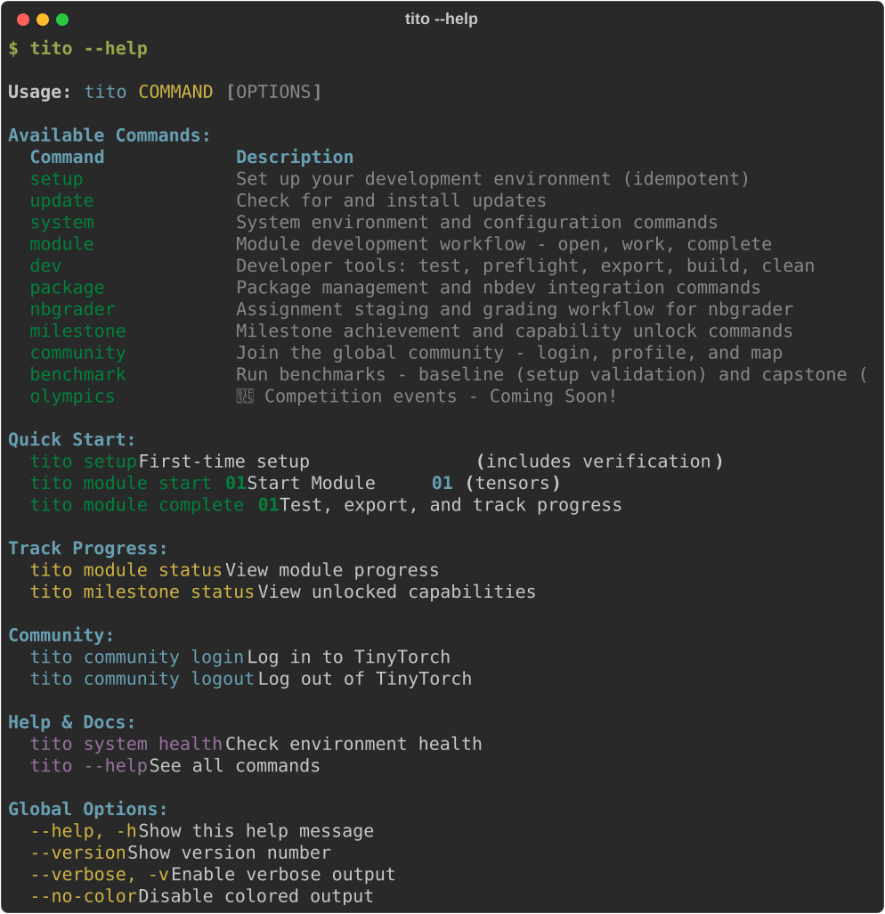
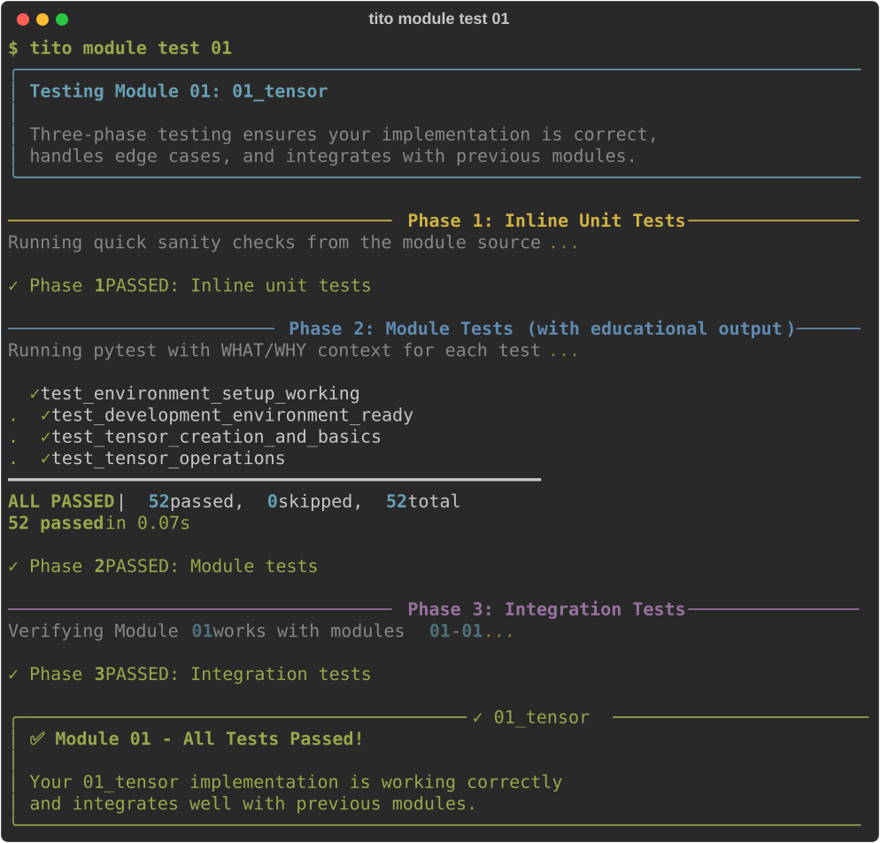
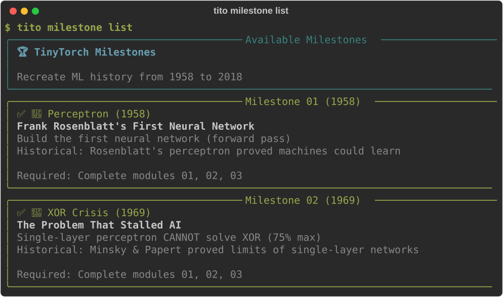
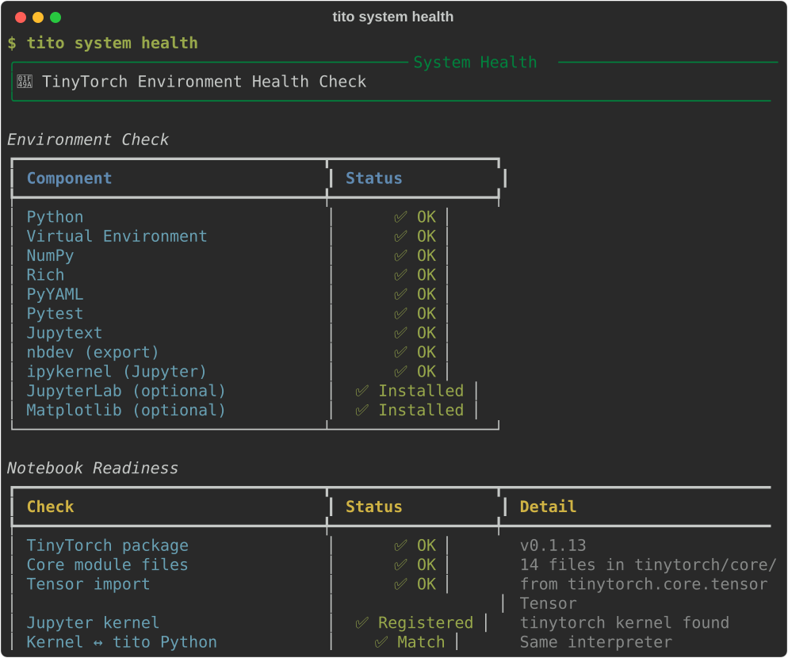
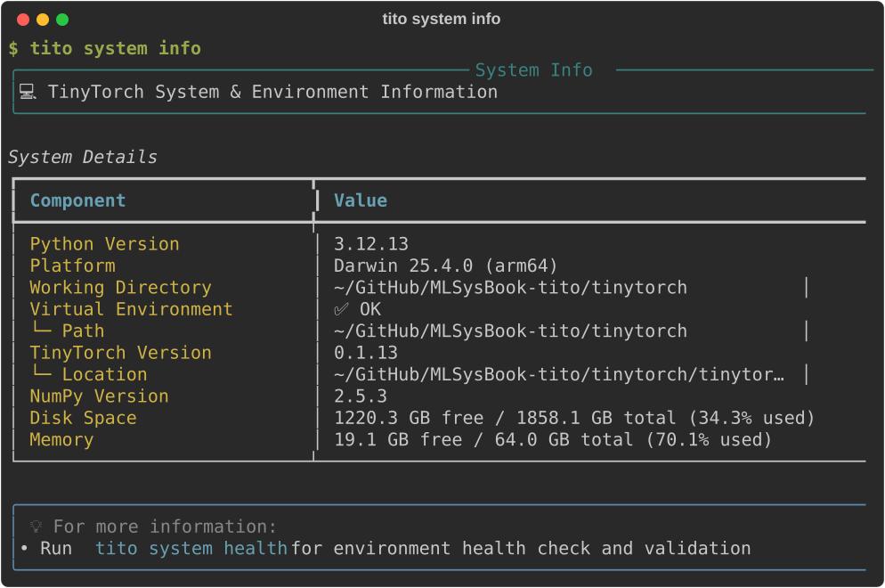

A reference for the `tito` commands a student uses. The developer and instructor groups (`dev`, `package`, `nbgrader`, `benchmark`, `olympics`) are listed by `tito --help`. For a practical walkthrough of the daily student routine, see the [Student Workflow](workflow.qmd).

::: {#fig-tito-help fig-env="figure" fig-pos="htb" fig-cap="**The `tito --help` command catalog**. Shows the top-level command groups, quick start commands, and global options." fig-alt="Terminal screenshot of tito --help displaying available command groups and descriptions."}



:::

---

## Global Options

These options apply to every `tito` command:

| Option | Shorthand | Description |
| :--- | :--- | :--- |
| `--help` | `-h` | Display help text and available options for the command. |
| `--version` | | Display the current installed version of TinyTorch. |
| `--verbose` | `-v` | Enable detailed diagnostic output and stack traces. |
| `--no-color` | | Disable ANSI terminal colors and rich markup formatting. |

---

## Essential Commands

### `tito setup`

Initializes and verifies your local TinyTorch workspace.

```bash
tito setup [OPTIONS]
```

- **What it does**: Checks that Python 3.10+ and the virtual environment are active, validates package dependencies, registers the `tinytorch` Jupyter kernel, and sets up `.tito/config.json`.
- **Options**:
  - `--force`: Prompt to recreate existing components (venv, profile).
  - `--skip-venv`: Skip virtual environment creation.
  - `--skip-packages`: Skip package installation.
  - `--skip-profile`: Skip user profile creation.
- **Idempotency**: Safe to run at any time; will never overwrite notebooks in `modules/`.

### `tito update`

Checks for updates and updates your TinyTorch workspace non-destructively.

```bash
tito update [OPTIONS]
# Alias: tito system update
```

- **What it does**: Pulls updated test suites, starter templates, and CLI tools.
- **Data safety**: Automatically creates a timestamped snapshot in `.tito/backups/`. Leaves `modules/`, exported code in `tinytorch/core/`, and `.tito/progress.json` completely untouched.
- **Options**:
  - `--check`: Only check if a new release or branch update is available without installing.
  - `--yes`, `-y`: Automatically confirm prompts (useful for unattended scripts).

---

## Module Workflow (`tito module`)

Commands for managing your 20 progressive curriculum modules.

```bash
tito module SUBCOMMAND [MODULE_ID] [OPTIONS]
```

### `tito module start <N>`
Creates your working notebook from the source curriculum and launches Jupyter Lab.
- Example: `tito module start 01` creates `modules/01_tensor/tensor.ipynb`.
- **Options**:
  - `--no-jupyter`: Create the notebook but skip opening Jupyter (for CI or testing).

### `tito module resume <N>`
Reopens an already started notebook in Jupyter Lab where you left off.
- Example: `tito module resume 03`

### `tito module test <N>`
Runs unit and integration tests against your notebook and implementation directly from the terminal without exporting.
- Example: `tito module test 01`
- **Options**:
  - `--verbose`, `-v`: Show full per-assertion test details and pytest logs.

::: {#fig-cmd-module-test fig-env="figure" fig-pos="htb" fig-cap="**The three-phase module test.** `tito module test` runs inline checks, module pytest suites with educational feedback, and progressive integration tests without modifying exported code." fig-alt="Terminal output of tito module test 01 showing all three phases passing."}



:::

### `tito module complete <N>`
Finalizes a module. Re-runs unit tests, exports implementations into `tinytorch/`, runs integration tests, and marks the module as completed.
- Example: `tito module complete 01`
- **Options**:
  - `--skip-tests`: Skip integration test suite.
  - `--skip-export`: Skip automatic package export.
  - `--all`: Complete all modules in batch.

### `tito module status`
Displays the learning journey dashboard, showing completed, ready, and locked modules along with your next action.
- Example: `tito module status`

### `tito module view <N>`
Opens the module notebook in read-only view mode without altering its status.

### `tito module reset <N>`
Replaces your working notebook with a fresh copy from the curriculum source, clearing all solutions.
- **Warning**: Destructive to the specified module notebook. Save backup copies first if needed.

---

## Milestones (`tito milestone`)

Commands for running landmark experiments in machine learning history using your code.

```bash
tito milestone SUBCOMMAND [MILESTONE_ID] [OPTIONS]
```

### `tito milestone list`
Lists all 6 historical milestones, their historical context, and their required prerequisite modules.

::: {#fig-cmd-milestone-list fig-env="figure" fig-pos="htb" fig-cap="**The milestone catalog.** `tito milestone list` details the historical era, breakthrough problem, prerequisite modules, and unlocked status for each milestone." fig-alt="Terminal output of tito milestone list showing milestone cards."}



:::

### `tito milestone info <name|N>`
Shows detailed metadata, expected outputs, and historical context for a specific milestone.
- Example: `tito milestone info perceptron` or `tito milestone info 01`

### `tito milestone run <name|N>`
Executes a milestone recreation using your exported `tinytorch` implementations.
- Example: `tito milestone run perceptron`
- Example: `tito milestone run mlp`
- **Options**:
  - `--part <N>`: Run a specific part of a multi-script milestone (e.g. `--part 2`).
  - `--skip-checks`: Skip prerequisite checks (not recommended).

### `tito milestone status`
Displays your unlocked milestone capabilities and overall history achievements.

---

## System Diagnostics (`tito system`)

Commands for inspecting and maintaining your environment.

```bash
tito system SUBCOMMAND [OPTIONS]
```

### `tito system health`
Runs comprehensive diagnostics on your Python environment, virtual environment activation, required packages, Jupyter kernel registration, and directory structure.

::: {#fig-cmd-system-health fig-env="figure" fig-pos="htb" fig-cap="**System health diagnostic.** `tito system health` verifies environment readiness across all ten system components and notebook packages." fig-alt="Terminal output of tito system health."}



:::

### `tito system info`
Displays detailed environment and hardware diagnostic metadata: OS version, Python path, NumPy version, CPU architecture, and available accelerators (MPS on Apple Silicon, CUDA on Linux).

::: {#fig-cmd-system-info fig-env="figure" fig-pos="htb" fig-cap="**Hardware and environment metadata.** `tito system info` reports Python versions, virtual environment locations, disk space, and memory capacity." fig-alt="Terminal output of tito system info."}



:::

### `tito system jupyter`
Starts the Jupyter server:
- `--lab`: Start JupyterLab.
- `--notebook`: Start the classic notebook.
- `--port <PORT>`: Port to run on (default 8888).

There are no `start`, `stop` or `status` subcommands. Stop the server with Ctrl-C
in the terminal that started it.

### `tito system reset`
Resets local student implementations or progress history. Prompts for explicit confirmation.
- **Options**:
  - `--keep-progress`: Clears code but preserves `.tito/progress.json`.
  - `--force`: Skips confirmation prompt.

---

## Community (`tito community`)

Optional commands for joining the global TinyTorch learning community.

```bash
tito community SUBCOMMAND [OPTIONS]
```

- `tito community login`: Authenticate through browser to link your local progress.
- `tito community sync`: Upload module and milestone completion records to your profile (never uploads code).
- `tito community status`: Show current signed-in user and synchronized progress.
- `tito community logout`: Disconnect local workspace from profile.

---

## Environment Variables

You can configure `tito` behavior via environment variables:

| Variable | Default | Purpose |
| :--- | :--- | :--- |
| `TITO_ALLOW_SYSTEM` | `0` | Set to `1` to bypass the virtual environment check (useful for Docker containers or custom Conda environments). |
| `TINYTORCH_QUIET` | `1` | Suppresses verbose autograd and debug messages during command execution. |
| `TINYTORCH_DEV` | `0` | Set to `1` when developing TinyTorch itself to enable additional debug assertions. |
| `FORCE_COLOR` | `1` | Forces ANSI color output even when stdout is redirected or piped. |

---

## See Also

- [Student Workflow](workflow.qmd) — The daily four-step cycle for completing modules.
- [Troubleshooting](troubleshooting.qmd) — Diagnosing and fixing common environment snags.
