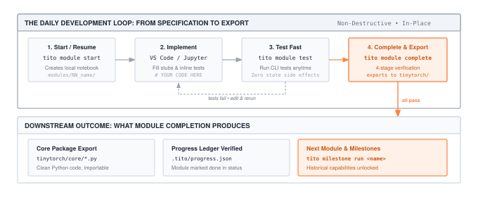

`tito` is your companion command-line tool throughout TinyTorch. It creates your notebooks, validates your environment, runs progressive tests, exports your implementations into the `tinytorch` Python package, and tracks your learning journey.

This page guides you through the daily rhythm of working with `tito`. For a complete catalog of every command and option, see the [Command Reference](commands.qmd).

---

## 1. Set Up and Verify Once

After installing TinyTorch with the one-line installer from the [Quick Start](../getting-started.qmd), initialize your profile and verify your environment:

```bash
cd tinytorch
source .venv/bin/activate       # Windows (Git Bash): source .venv/Scripts/activate
tito setup                     # First-time profile & kernel setup
tito system health             # Verify that all components are green
```

`tito system health` verifies Python, the virtual environment, required dependencies (NumPy, Rich, Pytest, Jupytext), and your Jupyter kernel (@fig-tito-health).

::: {#fig-tito-health fig-env="figure" fig-pos="htb" fig-cap="**Environment verification with `tito system health`**. A healthy setup shows green checkmarks across the environment, package readiness, and module directory structure." fig-alt="Terminal screenshot of tito system health showing green checkmarks for Python, virtual environment, NumPy, Rich, PyYAML, Pytest, and registered tinytorch Jupyter kernel."}


:::

:::{.callout-important title="Every new terminal: activate first"}
The virtual environment is active only in the terminal where you activated it. Each time you open a new terminal, run `cd tinytorch` and `source .venv/bin/activate` (Windows: `source .venv/Scripts/activate`) before running any `tito` commands.
:::

---

## 2. The Daily Module Loop

Working through a module follows four intuitive steps:

::: {#fig-workflow-loop fig-env="figure" fig-pos="htb" fig-cap="**The daily student workflow loop.** Starting a module initializes the workspace notebook, iterative test commands verify implementations in place, and completing a module runs four-stage verification before exporting to the core package and recording ledger progress." fig-alt="Four-step development loop: start module, implement in notebook, test fast, complete and export to tinytorch core."}



:::

### Step 1: Start or Resume a Module

```bash
tito module start 01      # First time: generates notebook and opens Jupyter Lab
tito module resume 01     # Later sessions: reopen where you left off
```

`start` creates your active notebook at `modules/01_tensor/tensor.ipynb` from the curriculum source. It enforces prerequisites in order: `tito module start 05` will remind you to complete Module 04 first.

:::{.callout-note title="Prefer VS Code or Cursor?"}
You do not have to use the browser-based Jupyter Lab interface. Open the `tinytorch/` folder in VS Code or Cursor, open `modules/01_tensor/tensor.ipynb`, and select the `.venv` Python kernel (*Select Kernel → Python Environments → .venv*).
:::

### Step 2: Implement Your Code

In the notebook, read the explanation and find the functions marked with:

```python
# YOUR CODE HERE
raise NotImplementedError()
```

Replace the stub with your implementation. Each exercise cell is followed immediately by an inline unit test cell that verifies correctness with immediate feedback.

### Step 3: Test Incrementally

You can verify your progress at any time directly from the command line without modifying package exports or status:

```bash
tito module test 01       # runs unit and integration tests from the CLI
```

### Step 4: Complete and Export

When all tests pass in your notebook:

```bash
tito module complete 01
```

`complete` performs a rigorous four-stage verification:

1. **Notebook Unit Tests**: Re-runs all test cells inside your notebook.
2. **Package Export**: Extracts your code into the `tinytorch/` package (e.g. `tinytorch/core/tensor.py`).
3. **Integration Tests**: Tests your exported implementation together with all earlier completed modules.
4. **Progress Ledger**: Records the module as completed in `.tito/progress.json`.

After completion, your implementation is directly importable like real PyTorch:

```python
from tinytorch.core.tensor import Tensor
x = Tensor([1, 2, 3])
```

---

## 3. Tracking Your Learning Journey

Check your completion status and see what module or milestone comes next:

```bash
tito module status
```

`tito module status` displays an interactive progress bar, showing which modules are completed (✅), ready to start (⏳), or locked (🔒) pending earlier modules (@fig-tito-status).

::: {#fig-tito-status fig-env="figure" fig-pos="htb" fig-cap="**The learning journey dashboard with `tito module status`**. Shows overall curriculum completion percentage, locked/ready states, and your immediate next action." fig-alt="Terminal screenshot of tito module status displaying a 20-module status table with progress bar and next action recommendation."}


:::

---

## 4. Recreating Historical Milestones

TinyTorch modules are not abstract homework exercises; they directly power landmark moments in deep learning history. Once you complete the required modules, run the milestone recreation:

```bash
tito milestone list       # see all 6 milestones and unlock requirements
tito milestone run 01     # run Rosenblatt's 1958 Perceptron
```

::: {#fig-tito-milestones fig-env="figure" fig-pos="htb" fig-cap="**Historical milestones checklist with `tito milestone list`**. Displays landmark recreations from Frank Rosenblatt's 1958 Perceptron to modern MLPerf benchmarks, showing required modules for each." fig-alt="Terminal screenshot of tito milestone list displaying milestone cards with historical descriptions and required module lists."}


:::

| Milestone | Historical Event | Required Modules | What You Recreate |
| :--- | :--- | :--- | :--- |
| **01 (1958)** | Frank Rosenblatt's Perceptron | 01, 02, 03 | First neural network forward pass |
| **02 (1969)** | The XOR Crisis (Minsky & Papert) | 01, 02, 03 | Exposing single-layer limits |
| **03 (1986)** | MLP Revival (Rumelhart et al.) | 01 to 08 | Backprop training on handwritten digits |
| **04 (1998)** | CNN Revolution (LeCun et al.) | 01 to 09 | LeNet image classification |
| **05 (2017)** | Transformer Era (Vaswani et al.) | 01–08, 11–13 | Scaled dot-product attention & sequence models |
| **06 (2018)** | MLPerf Benchmarks | 01–08, 11–19 | Quantitative optimization and acceleration |

---

## 5. Where Your Work Lives (and Safe Updates)

TinyTorch enforces a strict boundary between curriculum records and your code:

| Location | Purpose | Behavior During `tito update` |
| :--- | :--- | :--- |
| `modules/` | Your active working notebooks (`01_tensor/tensor.ipynb`, etc.) | 🛑 **Never touched** |
| `tinytorch/core/*.py` | Your exported implementations | 🛑 **Never touched** |
| `.tito/progress.json` | Your completed module and milestone ledger | 🛑 **Never touched** |
| `tests/` & `tito/` | Test suites, autograders, and CLI tool | 🟢 **Updated safely** |

### Safe In-Place Updates

If your instructor announces updates or new bug fixes are published, **never delete your directory**. Simply run:

```bash
tito update          # or: tito system update
```

`tito` automatically creates a timestamped safety backup in `.tito/backups/pre_update_<timestamp>/` before updating upstream tests or CLI commands. Your notebooks and implementations remain completely untouched.

---

## 6. Next Steps

- Explore the complete list of options in the [Command Reference](commands.qmd).
- If you encounter unexpected errors or environment issues, see the [Troubleshooting Guide](troubleshooting.qmd).
