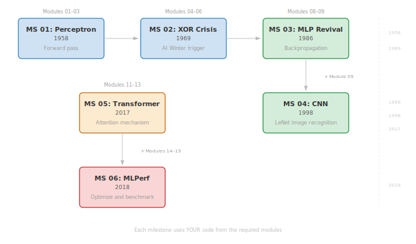

# TinyTorch Milestones

Milestones are capstone experiences that bring together everything you've built in the TinyTorch modules. Each milestone recreates a pivotal moment in ML history using YOUR implementations.

## How Milestones Work

After completing a set of modules, you unlock the ability to run a milestone. Each milestone:

1. **Uses YOUR code** - Every tensor operation, gradient computation, and layer runs on code YOU wrote
2. **Recreates history** - Experience the same breakthroughs researchers achieved decades ago
3. **Proves understanding** - If it works, you truly understand how these systems function

## Available Milestones

<table width="100%">
    <thead>
    <tr>
      <th width="5%">ID</th>
      <th width="15%">Name</th>
      <th width="8%">Year</th>
      <th width="20%">Required Modules</th>
      <th width="52%">What You'll Do</th>
    </tr>
  </thead>
  <tbody>
    <tr>
      <td>01</td>
      <td><b>Perceptron</b></td>
      <td>1958</td>
      <td>01-03</td>
      <td>Build Rosenblatt's first neural network (forward pass)</td>
    </tr>
    <tr>
      <td>02</td>
      <td><b>XOR Crisis</b></td>
      <td>1969</td>
      <td>01-03</td>
      <td>Experience the XOR limitation that triggered AI Winter</td>
    </tr>
    <tr>
      <td>03</td>
      <td><b>MLP Revival</b></td>
      <td>1986</td>
      <td>01-08</td>
      <td>Train MLPs to solve XOR + recognize digits</td>
    </tr>
    <tr>
      <td>04</td>
      <td><b>CNN Revolution</b></td>
      <td>1998</td>
      <td>01-09</td>
      <td>Build LeNet for image recognition</td>
    </tr>
    <tr>
      <td>05</td>
      <td><b>Transformer Era</b></td>
      <td>2017</td>
      <td>01-08, 11-13</td>
      <td>Prove attention with reversal, copy, and mixed sequence tasks</td>
    </tr>
    <tr>
      <td>06</td>
      <td><b>MLPerf Benchmarks</b></td>
      <td>2018</td>
      <td>01-08, 14-19</td>
      <td>Optimize and benchmark your neural networks</td>
    </tr>
  </tbody>
</table>

## Running Milestones

```bash
# List available milestones and your progress
tito milestone list

# Run a specific milestone (all parts)
tito milestone run 03

# Run a specific part of a multi-part milestone
tito milestone run 03 --part 1  # Part 1: XOR Solved
tito milestone run 03 --part 2  # Part 2: TinyDigits

# Get detailed info about a milestone
tito milestone info 05
```

## Directory Structure

```
milestones/
├── 01_1958_perceptron/     # Milestone 01: Rosenblatt's Perceptron
├── 02_1969_xor/            # Milestone 02: XOR Problem
├── 03_1986_mlp/            # Milestone 03: Backpropagation MLP
├── 04_1998_cnn/            # Milestone 04: LeNet CNN
├── 05_2017_transformer/    # Milestone 05: Attention Mechanism
├── 06_2018_mlperf/         # Milestone 06: Optimization Olympics
└── data_manager.py         # Shared dataset management utility
```

## The Journey

<p align="center">
  
</p>

## Success Criteria

Each milestone has specific success criteria. Passing means your implementation is correct:

- **Milestone 01**: Forward pass produces reasonable outputs
- **Milestone 02**: Demonstrates XOR is unsolvable with single layer (75% max accuracy)
- **Milestone 03**: Part 1 solves XOR (100% accuracy), Part 2 achieves 85%+ on TinyDigits
- **Milestone 04**: TinyDigits achieves 90%+ accuracy with CNN
- **Milestone 05**: Pass all three attention challenges (95%+ accuracy)
- **Milestone 06**: Part 1 completes optimization pipeline, Part 2 shows KV cache speedup

## Troubleshooting

If a milestone fails:

1. Check that all required modules are completed: `tito module status`
2. Run the module tests: `tito test <module_number>`
3. Look at the specific error message for debugging hints
4. Review the milestone's docstring for implementation requirements
