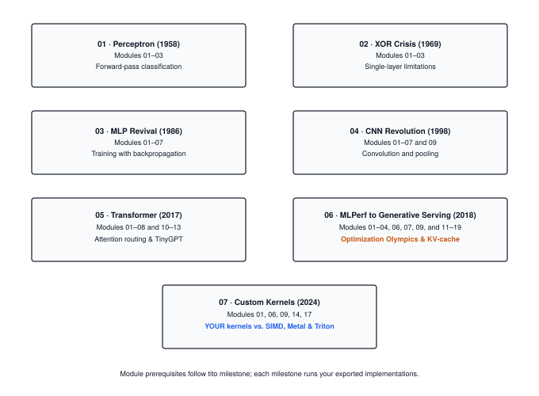

# TinyTorch Milestones

Milestones are capstone experiences that bring together everything you've built in the TinyTorch modules. Each milestone recreates a pivotal moment in ML history using YOUR implementations.

## How Milestones Work

After completing a set of modules, you unlock the ability to run a milestone. Each milestone:

1. **Uses YOUR code**: Every tensor operation, gradient computation, and layer runs on code YOU wrote
2. **Recreates history**: Experience the same breakthroughs researchers achieved decades ago
3. **Proves understanding**: If it works, you truly understand how these systems function

## Available Milestones

<table width="100%">
    <thead>
    <tr>
      <th width="5%">ID</th>
      <th width="15%">Name</th>
      <th width="8%">Year</th>
      <th width="20%">Required Modules</th>
      <th width="52%">What You'll Do</th>
    </tr>
  </thead>
  <tbody>
    <tr>
      <td>01</td>
      <td><b>Perceptron</b></td>
      <td>1958</td>
      <td>01-03</td>
      <td>Build Rosenblatt's first neural network (forward pass)</td>
    </tr>
    <tr>
      <td>02</td>
      <td><b>XOR Crisis</b></td>
      <td>1969</td>
      <td>01-03</td>
      <td>Experience the XOR limitation that triggered AI Winter</td>
    </tr>
    <tr>
      <td>03</td>
      <td><b>MLP Revival</b></td>
      <td>1986</td>
      <td>01-07</td>
      <td>Train MLPs to solve XOR + recognize digits</td>
    </tr>
    <tr>
      <td>04</td>
      <td><b>CNN Revolution</b></td>
      <td>1998</td>
      <td>01-07, 09</td>
      <td>Build LeNet for image recognition</td>
    </tr>
    <tr>
      <td>05</td>
      <td><b>Transformer</b></td>
      <td>2017</td>
      <td>01-08, 10-13</td>
      <td>Train TinyGPT on Shakespeare and Python code (TinyPy) for text and TinyCopilot code generation</td>
    </tr>
    <tr>
      <td>06</td>
      <td><b>MLPerf to Generative Serving</b></td>
      <td>2018</td>
      <td>01-04, 06, 07, 09, 11-19</td>
      <td>Optimize, quantize, and serve TinyGPT with KV-cache &amp; Pareto frontier</td>
    </tr>
    <tr>
      <td>07</td>
      <td><b>Custom Kernels</b></td>
      <td>2024</td>
      <td>01, 06, 09, 14, 17</td>
      <td>Verify YOUR Module 17 kernels on ragged shapes, then time them against bundled C++ SIMD, Apple Metal MPS, and Triton kernels</td>
    </tr>
  </tbody>
</table>

## Running Milestones

```bash
# List available milestones and your progress
tito milestone list

# Run a milestone: runs every required part in order (05: Parts 1 and 2)
tito milestone run 05

# Run and record one part (the milestone completes once every required part has passed)
tito milestone run 05 --part 1  # Part 1: TinyGPT (Shakespeare)
tito milestone run 05 --part 2  # Part 2: Attention Sequence Routing
tito milestone run 05 --part 3  # Part 3: TinyCopilot Code Generation (optional)
tito milestone run 05 --part 4  # Part 4: Conversational Q&A & Overfitting Detective (optional)

# Run every part, including optional extensions
tito milestone run 05 --all

# Run Milestone 07 (Custom Kernels)
tito milestone run 07

# Get detailed info about a milestone
tito milestone info 07
```

## Directory Structure

```
milestones/
├── 01_1958_perceptron/     # Milestone 01: Perceptron
├── 02_1969_xor/            # Milestone 02: XOR Crisis
├── 03_1986_mlp/            # Milestone 03: Multilayer Perceptron
├── 04_1998_cnn/            # Milestone 04: Convolutional Networks
├── 05_2017_transformer/    # Milestone 05: The Transformer (TinyGPT, Attention, TinyCopilot & Chat)
├── 06_2018_mlperf/         # Milestone 06: MLPerf to Generative Serving
├── 07_2024_kernels/        # Milestone 07: Custom Kernels (YOUR Module 17 kernels vs. SIMD, Metal & Triton)
└── data_manager.py         # Shared dataset management utility
```

## The Journey

<p align="center">
  
</p>

## Success Criteria

Each milestone has specific success criteria, and each script exits with status 1 when they are not met. A milestone is recorded as complete only when every required part has passed: Parts 1 and 2 for Milestones 03, 05, and 06, and Part 1 for the others. Milestone 04's CIFAR-10 part and Milestone 05's Parts 3 and 4 are optional extensions. Completions of Milestones 03 to 06 recorded before this rule have to be earned again.

- **Milestone 01**: YOUR forward pass matches sigmoid(XW + b) computed in NumPy from the model's own weights (accuracy is random and not graded)
- **Milestone 02**: Every forward pass matches NumPy, and no single-layer line beats 75% on XOR (a 100% "solution" means broken code and fails)
- **Milestone 03**: Both parts first check YOUR loss forward against NumPy on one batch; Part 1 solves XOR (all 4 rows right, a non-zero hidden-layer gradient, hidden weights moved at least 0.25× their initial norm); Part 2 reaches at least 75% on TinyDigits
- **Milestone 04**: Part 1 checks YOUR `CrossEntropyLoss` against NumPy on one batch, reaches at least 75% on TinyDigits, and YOUR conv filters receive gradient and move at least 25% of their initial norm; optional Part 2 (CIFAR-10) needs every layer to move and at least 25% test accuracy (20% with `--quick-test`)
- **Milestone 05**: Part 1 trains TinyGPT on Shakespeare (training loss < 1.20, best held-out loss at least 0.35 below a counted bigram, causality probe); Part 2 passes sequence challenges; optional Part 3 trains TinyCopilot (loss < 1.0, causality probe, at least 1 of 7 unseen prompts parses on greedy completion); optional Part 4 trains conversational TinyTorch Q&A (loss < 0.60, lowest held-out loss at least 0.50 below the untrained model's, causality probe) and reports the overfitting gap. Before training, Parts 1, 3, and 4 check YOUR `CrossEntropyLoss` against NumPy on one batch and check that a repeated token gets different predictions at different positions; every gated loss is computed in NumPy from the model's logits after training
- **Milestone 06**: Part 1 gates YOUR loss against NumPy, YOUR Profiler counts against the layer shapes, YOUR `BenchmarkResult` and `pareto_frontier` against hand-worked fixtures, and GPT behavior, then each optimization (baseline at least 80%, real INT8 codes within 3 points, 50% ± 2% sparsity, cached logits within 1e-4 of recomputed); Part 2 checks GPT behavior, then verifies cached generation logits, then times it
- **Milestone 07**: YOUR `tiled_matmul`, `fused_gelu`, `im2col_conv2d`, and `col2im` match NumPy on 30 cases, including ragged shapes and tile sizes; bundled C++ SIMD, Metal, and Triton kernels are timed for comparison but never decide the result

## Troubleshooting

If a milestone fails:

1. Check that all required modules are completed: `tito module status`
2. Run the module tests: `tito module test <module_number>`
3. Look at the specific error message for debugging hints
4. Review the milestone's docstring for implementation requirements
