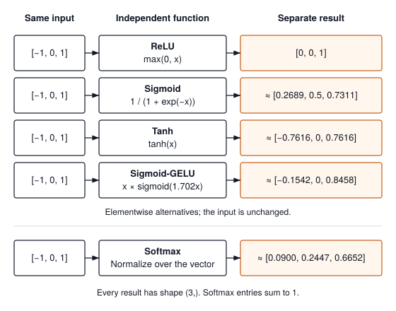

# Activation Functions {#sec-activations}

Chapter 1 gave us a `Tensor`: a flat buffer of numbers plus the shape and strides that let us read it as a matrix. The next chapter builds the linear layer, $\mathbf{y} = \mathbf{x}\mathbf{W} + \mathbf{b}$, the multiply-and-add that does most of the arithmetic in a neural network. Between those two sits a question every practitioner meets the first time they write `nn.Sequential`. Why does each linear layer get a `ReLU()` or a `GELU()` right after it, and what would go wrong if we left it out?

The short answer is that a stack of linear layers with nothing between them is one linear layer in a costume. This chapter shows why, in two lines of algebra and one small program, and then teaches the function we insert to break the collapse. We meet the four activations TinyTorch implements (Sigmoid, Tanh, ReLU, GELU), see what each one does to a gradient on its way back through a deep network, and build all four in about forty lines of Python. The chapter closes with why these tiny functions get so much engineering attention in production frameworks, which has little to do with their math and everything to do with memory traffic.

{#fig-activation-zoo}

---

## The Problem

A linear layer maps an input row vector $\mathbf{x}$ to $\mathbf{x}\mathbf{W} + \mathbf{b}$, where $\mathbf{W}$ is a matrix of weights and $\mathbf{b}$ is a vector of biases. Stack two of them, feeding the output of the first into the second:

$$\mathbf{h} = \mathbf{x}\mathbf{W}_1 + \mathbf{b}_1, \qquad \mathbf{y} = \mathbf{h}\mathbf{W}_2 + \mathbf{b}_2$$

Substitute the first equation into the second and multiply out:

$$\mathbf{y} = (\mathbf{x}\mathbf{W}_1 + \mathbf{b}_1)\mathbf{W}_2 + \mathbf{b}_2 = \mathbf{x}\,(\mathbf{W}_1\mathbf{W}_2) + (\mathbf{b}_1\mathbf{W}_2 + \mathbf{b}_2)$$

The right-hand side has the form $\mathbf{x}\mathbf{W}_{\text{eff}} + \mathbf{b}_{\text{eff}}$ with $\mathbf{W}_{\text{eff}} = \mathbf{W}_1\mathbf{W}_2$ and $\mathbf{b}_{\text{eff}} = \mathbf{b}_1\mathbf{W}_2 + \mathbf{b}_2$. That is a single linear layer. Nothing in the argument depends on there being exactly two layers. Apply it again and a third layer folds into the same form, and so on for a hundred. Matrix multiplication is associative, so the product of any number of weight matrices is just another weight matrix.

Here is the collapse in code, using the `Tensor` from Chapter 1 with its `@` and `+`, and two-element vectors so that every number can be checked by hand. The input and the biases are written as $1 \times 2$ matrices (one row) so that `@` applies to them directly.

```python
from tinytorch.core.tensor import Tensor

x = Tensor([[1.0, 2.0]])
W1, b1 = Tensor([[2.0, 0.0], [1.0, 3.0]]), Tensor([[0.5, -0.5]])
W2, b2 = Tensor([[1.0, 2.0], [3.0, 1.0]]), Tensor([[1.0, 0.0]])

# Two layers, one after the other.
h = x @ W1 + b1
y_deep = h @ W2 + b2

# One layer, with the weights folded together ahead of time.
W_eff = W1 @ W2
b_eff = b1 @ W2 + b2
y_folded = x @ W_eff + b_eff

print("two layers:", y_deep.data.tolist())    # [[22.0, 14.5]]
print("one layer: ", y_folded.data.tolist())  # [[22.0, 14.5]]
print("W_eff:", W_eff.data.tolist(), " b_eff:", b_eff.data.tolist())
```

The two paths agree to the last digit, for this input and for every other input, at any depth. In @tbl-linear-collapse-trace the intermediate values sit side by side so you can confirm the fold by hand. The middle row shows what the second layer receives; the last row shows that the folded weights $\mathbf{W}_{\text{eff}} = \begin{bmatrix} 2 & 4 \\ 10 & 5 \end{bmatrix}$ and $\mathbf{b}_{\text{eff}} = [0, 0.5]$ land on the same answer in one step.

| Path | Input | Weights, bias | Output |
| :--- | :--- | :--- | :--- |
| Layer 1 | $\mathbf{x} = [1, 2]$ | $\mathbf{W}_1, \mathbf{b}_1$ | $\mathbf{h} = [4.5, 5.5]$ |
| Layer 2 | $\mathbf{h} = [4.5, 5.5]$ | $\mathbf{W}_2, \mathbf{b}_2$ | $\mathbf{y} = [22, 14.5]$ |
| Folded | $\mathbf{x} = [1, 2]$ | $\mathbf{W}_1\mathbf{W}_2,\ \mathbf{b}_1\mathbf{W}_2 + \mathbf{b}_2$ | $\mathbf{y} = [22, 14.5]$ |

: Two linear layers in sequence versus the single layer they fold into, on the input $\mathbf{x} = [1, 2]$. {#tbl-linear-collapse-trace tbl-colwidths="[15,25,35,25]"}

The reason this hurts is what a single linear layer cannot do. Take the four points of the XOR truth table, $(0,0)$ and $(1,1)$ labeled 0, $(0,1)$ and $(1,0)$ labeled 1, and ask a linear function $f(x_1, x_2) = a x_1 + b x_2 + c$ to score the 1s above some threshold $t$ and the 0s below it. Adding the two "below" conditions gives $a + b + 2c < 2t$; adding the two "above" conditions gives $a + b + 2c > 2t$. Both cannot hold, so no linear function separates the points, and by the collapse above no *stack* of linear functions can either. A hundred layers and a million weights are no better than a single line through the plane. Milestone I revisits this example with a two-layer network that solves it, once we have the missing piece.

---

## The Idea

The missing piece is a function $\sigma$ that is applied to every element of a layer's output and is not linear. With it between the layers,

$$\mathbf{h} = \sigma(\mathbf{x}\mathbf{W}_1 + \mathbf{b}_1), \qquad \mathbf{y} = \mathbf{h}\mathbf{W}_2 + \mathbf{b}_2$$

and the substitution trick fails, because $\sigma(\mathbf{x}\mathbf{W}_1)\mathbf{W}_2$ cannot be rewritten as $\mathbf{x}$ times some matrix. A one-element example makes the point. With ReLU, the function that replaces negatives by zero, $\text{ReLU}(-3 \times -2) = 6$ while $\text{ReLU}(-3) \times (-2) = 0$. The function does not commute with multiplication, so it cannot be pushed through the weights and absorbed. Each layer now bends the space it receives before the next layer draws a line through it, which is how a network of straight lines ends up carving curved regions (@fig-activation-zoo).

Almost any non-linear $\sigma$ breaks the collapse. Choosing a good one is a separate question, and it comes down to three requirements.

1. **Cheap.** The function runs once per element of every hidden layer's output, for every example, on every training step. A few arithmetic operations per element is the budget.
2. **Well-behaved derivative.** Training adjusts weights by following the derivative of the loss with respect to each weight. For a weight in an early layer, that derivative is a product, by the chain rule, of one local derivative per layer between the weight and the loss, and every activation on the path contributes its own $\sigma'(z)$ as a factor.[^fn-backpropagation-activation-derivative] Ten activations whose derivatives are each $0.25$ shrink the signal by $0.25^{10} \approx 10^{-6}$. The derivative of $\sigma$ therefore needs to stay near 1 over the range of inputs the layer actually sees.
3. **Non-linear**, which is the whole point, but only mildly. A function that is linear on most of its domain and bends in one place is enough.

[^fn-backpropagation-activation-derivative]: **Backpropagation**: the procedure that computes how much each weight contributed to the loss by applying the chain rule backward from the output, one layer at a time. Chapter 6 builds it. What matters here is that it multiplies the local derivative of every activation on the path, so those derivatives compound.

The four functions in @tbl-activation-zoo are the ones that survived. The table gives the formula, the derivative, and the one thing that goes wrong with each; the paragraphs after it walk through them in the order the field adopted them.

| Activation | $\sigma(x)$ | $\sigma'(x)$ | Largest $\sigma'$ | What goes wrong |
| :--- | :--- | :--- | :---: | :--- |
| Sigmoid | $\dfrac{1}{1 + e^{-x}}$, range $(0, 1)$ | $\sigma(x)\,(1 - \sigma(x))$ | $0.25$ at $x = 0$ | Derivative below $0.02$ once $\lvert x \rvert > 4$; products of it vanish |
| Tanh | $\dfrac{e^x - e^{-x}}{e^x + e^{-x}}$, range $(-1, 1)$ | $1 - \tanh^2(x)$ | $1$ at $x = 0$ | Saturates for large absolute inputs |
| ReLU | $\max(0, x)$ | $1$ if $x > 0$, else $0$ | $1$ | A unit whose input is always negative stops learning |
| GELU | $x\,\Phi(x)$ | $\Phi(x) + x\,\phi(x)$ | $\approx 1.13$ near $x = 1.4$ | Costs an error function per element |

: The four activation functions TinyTorch implements. $\Phi$ is the cumulative distribution function of the standard normal and $\phi$ its density. {#tbl-activation-zoo tbl-colwidths="[13,28,22,15,22]"}

### Sigmoid and the vanishing gradient

The **sigmoid** squashes any real number into $(0, 1)$, which made it the natural first choice when a unit's output was read as a firing probability. Differentiating $\sigma(x) = (1 + e^{-x})^{-1}$ gives the tidy identity $\sigma'(x) = \sigma(x)(1 - \sigma(x))$, and since $\sigma(x)$ lives in $(0, 1)$, that product peaks at $\sigma = 0.5$, where it equals $0.25$. That is the best case. At $x = 3$ the derivative is already $0.045$, and at $x = 5$ it is $0.007$. The function has *saturated*. Its output is nearly flat there, so its derivative is nearly zero.

Now put ten sigmoid layers in a row. Even if every input happens to sit at the sweet spot $x = 0$, the product of the ten local derivatives is $0.25^{10} \approx 9.5 \times 10^{-7}$. Realistic inputs are worse. This is the **vanishing gradient** problem, and it is why networks built from sigmoids stalled at a handful of layers for two decades. The weights near the input barely move, because the signal telling them which way to move has been multiplied by something tiny at every layer on the way back.

### Tanh

Rescaling the same curve to $(-1, 1)$ gives the **hyperbolic tangent**, since $\tanh(x) = 2\sigma(2x) - 1$. Its derivative $1 - \tanh^2(x)$ reaches $1$ at the origin instead of $0.25$, which helps, and its outputs are centered on zero, which keeps the next layer's inputs balanced. It still saturates. At $x = 3$ its derivative is about $0.01$, smaller than sigmoid's derivative there. Centering the output and having slope 1 at the origin help near zero; they do not remove the small slopes in the tails.

### ReLU

The **rectified linear unit**, $\text{ReLU}(x) = \max(0, x)$, gives up on squashing altogether. Positive inputs pass through unchanged and negative inputs become zero. Its derivative is $1$ for any positive input and $0$ for any negative one, and that $1$ is the reason deep networks became trainable. A path through a hundred active ReLU units multiplies the gradient by $1^{100} = 1$. The function is also as cheap as a function can be, one comparison per element.

The price is the other branch. A unit whose input is negative for every example in the dataset outputs $0$, has derivative $0$, receives no gradient, and therefore never changes. It is a **dead unit**, and a large enough bad update (or a bad initialization) can kill a noticeable fraction of a layer at once. One more property matters for the next chapter. If a layer's inputs are spread symmetrically around zero, ReLU sets about half of them to zero and halves their second moment, the average of their squares. The initialization discussion in @sec-layers uses that quantity to explain the gain needed for a deep ReLU stack; the module's default initializer itself uses a gain of 1.

### GELU

GELU, the **Gaussian error linear unit**, keeps ReLU's shape and smooths the corner. Where ReLU multiplies $x$ by a hard gate (1 if $x > 0$, else 0), GELU multiplies $x$ by $\Phi(x)$, the probability that a standard normal random variable falls below $x$:

$$\text{GELU}(x) = x\,\Phi(x) = x \cdot \tfrac{1}{2}\left[1 + \text{erf}\!\left(\tfrac{x}{\sqrt{2}}\right)\right]$$

The **error function** $\text{erf}$ is the integral of the Gaussian bell curve, available as `math.erf` in Python. For $x = 3$, $\Phi(x) = 0.9987$ and GELU is essentially $x$; for $x = -3$, $\Phi(x) = 0.0013$ and GELU is essentially $0$. The interesting region is near the origin. An input of $-1$ is not zeroed but passed at 16 percent weight, giving $-0.16$, and the curve dips to a minimum of about $-0.17$ near $x = -0.75$ before rising back to $0$. Unlike ReLU, GELU has no entire negative half-line on which the output and derivative are zero. Its derivative does vanish at its minimum, and becomes very small in the negative tail, so smoothness does not guarantee a useful gradient everywhere. The mechanism to retain is the soft gate: a negative input can still affect the next layer. The transformer implementation in @sec-transformers uses this activation.

---

## The Code

::: {.callout-note title="Source Code Mapping"}
The listings in this section are extracted from Module 02 (`src/02_activations/02_activations.py`) by name when the book is built, so a renamed class in the module fails the build instead of drifting from the chapter. Module 02 also implements `Softmax`; this book meets the softmax it needs in Chapter 4, as `log_softmax`, alongside the loss it belongs with.
:::

### Two classes per activation

Here is where an activation sits in a real network. Chapter 3 builds a linear layer that turns a batch of 256 inputs into a $256 \times 4096$ output, and `nn.Sequential` hands that output straight to a `ReLU()` and then on to the next linear layer. The activation runs once per element, for every example, on every training step, and it has to accept whatever the layer before it produced: a $256 \times 4096$ matrix in Chapter 3, a four-dimensional batch of images in Chapter 9, a three-dimensional batch of token sequences in Chapter 13. Nothing about the function depends on the shape.

Module 02 writes each activation as a pair of classes, and the pair is the pattern every later module follows. The first is an *operation*, a subclass of Chapter 1's `Function` whose `forward` takes a NumPy array and returns one. It is the object that Chapter 6 will record in the graph and complete with a `backward`. The second is a *layer*, a plain class that Chapter 3's containers can hold: it reports no parameters, its `forward` takes a `Tensor` and hands it to the operation through `apply`, and `__call__` makes `y = f(x)` work. Here is the sigmoid pair, the layer first.



Three things to notice. `parameters()` returns an empty list because Chapter 3's containers will ask every component for its learnable parameters, and an activation has none. `forward` contains no arithmetic at all; `SigmoidFunction.apply` unwraps the tensor, runs the operation on the array, and wraps the result in a fresh `Tensor`, exactly as Chapter 1 showed for `Add`. And nothing in either class looks at a shape. An elementwise function does not care whether the array is a vector or a four-dimensional batch of images, and NumPy walks whatever strides the array has, so a transposed input needs no special handling. PyTorch files all four activations under elementwise (it also says pointwise) operations and runs every one of them through a single shared iterator.

### The four operations

With the wrapping settled, each operation's `forward` is its formula written on an array. ReLU and tanh are one NumPy call each.





Sigmoid is the one that needs its why before you see the code. The formula $1 / (1 + e^{-v})$ asks for $e^{-v}$, and a hidden unit's input can be any size at all, especially early in training when the weights are still wild. Feed it $v = -1000$ and the naive transcription computes $e^{1000}$, far beyond the largest number a 64-bit float can hold. Python's `math.exp` raises `OverflowError` on the spot. NumPy returns `inf` with a warning and then evaluates $1 / (1 + \infty) = 0$, which is the right answer arriving by accident, and a network that trains on accidents is one you cannot debug. Here is the trick. The same function has a second form, $e^{v} / (1 + e^{v})$, whose exponent is $+v$, so it overflows for large positive $v$ instead. Choose whichever form keeps the exponent non-positive, the first when $v \ge 0$ and the second when $v < 0$, and neither branch can overflow for any input.



The `np.where` selects per element, so one call handles a whole array with both signs in it. It also evaluates both branches for every element before selecting, which is why the overflow that the discarded branch produces has to be silenced with `errstate`; the value it overflows to is thrown away. For $v < 0$, $e^v$ sits between $0$ and $1$, so the chosen division is safe, and both branches compute the same value wherever they overlap. This is the stability strategy used by the reference implementation; another implementation can choose a different equivalent formula.

GELU is defined as $x\,\Phi(x)$, and the Idea section computed it from the error function. Module 02 does not. It uses the approximation $x\,\sigma(1.702x)$, the sigmoid form, because it reuses the operation just written and costs one exponential per element instead of an `erf`.



This is a different numerical function from the exact GELU. Its approximation error and derivative must therefore be checked against the sigmoid form actually implemented; the final exercise compares the forms on a grid. Notice that the call is `SigmoidFunction().forward`, the array-level method, not `Sigmoid()` on a tensor. Inside an operation everything is NumPy; tensor wrapping happens at the boundary that `apply` guards. In the forward-only implementation, the temporary operation object is not yet retained as a graph record.

For `y = Sigmoid()(x)`, read the calls in order: `Sigmoid.__call__` delegates to `Sigmoid.forward`, which selects `SigmoidFunction.apply`; `apply` passes `x.data` to the operation and constructs `y` from its result. The wrapper decides which operation runs, the operation decides the numerical formula, and `apply` decides how arrays cross the tensor boundary. A test can check the formula directly on an array, then check shape preservation and unchanged input through the public wrapper. These are different failure points, so one test should not stand in for both.

### Calling one

Chapter 3's `Sequential` will call an activation exactly the way it calls a layer, `y = f(x)`, without knowing or caring which one it is holding. There is one more case I want to see work before Chapter 3 depends on it. The tensor that reaches an activation is not always laid out in buffer order. Chapter 1's `transpose()` returns a tensor whose buffer holds the values in column order, and the attention code in Chapter 12 transposes constantly. A loop that walked the buffer from slot 0 to the end and wrote each value to the same slot of a row-major output would return a tensor whose shape said $(3, 2)$ but whose elements were arranged for the $(2, 3)$ original, a silent bug that shows up three layers later as a wrong number with no traceback. NumPy walks the strides, so `np.maximum` reads the transposed buffer in its own order and the result lands where the shape says it should.

The example builds a $2 \times 3$ tensor, applies `ReLU`, and then applies it again to the transpose.

```python
from tinytorch.core.tensor import Tensor
from tinytorch.core.activations import ReLU

x = Tensor([[-3.0, -1.0, -0.75],
            [ 0.0,  1.0,  3.0]])

relu = ReLU()
y = relu(x)
print(y.shape, y.data.tolist())           # (2, 3) [[0.0, 0.0, 0.0], [0.0, 1.0, 3.0]]

yt = relu(x.transpose())                  # column-order input is fine
print(yt.shape, yt.data.tolist())         # (3, 2) [[0.0, 0.0], [0.0, 1.0], [0.0, 3.0]]
print(x.data.tolist())                    # input untouched
```

On my machine that prints exactly the three lines in the comments. The transposed call's output is the transpose of the first, because the strides did the bookkeeping, and the input buffer is never modified. Notice one more thing. Each call produces a new array the size of the input, because `apply` wraps the operation's result in a fresh `Tensor`. On a $2 \times 3$ tensor that is six floats and nobody cares. On a transformer's hidden layer it is a couple of hundred megabytes written and then read back by the next layer, on every step, and that allocation, harmless here, turns out to be the whole story in the production section.

---

## A Worked Trace

Chapter 6 builds the backward pass, and for an activation the backward pass is nothing but a per-element multiply by $\sigma'(x)$ at the value the forward pass saw. So before I trust any of these four inside a deep network, I want to see the derivative numbers, not just the curves. The trace runs six inputs through three of the four operations and records both the output and the local derivative that backpropagation will multiply by. I picked the inputs to hit the interesting spots: deep in each tail, the origin, and the point near $-0.75$ where GELU bottoms out. Tanh is left out to keep the trace narrow; its formula above can be checked by the same method. The operations are called on a plain array, the way `apply` calls them, and the derivatives come from the formulas: $\sigma' = \sigma(1 - \sigma)$, a step for ReLU, and for the sigmoid-form GELU $\sigma(1.702x) + 1.702\,x\,\sigma'(1.702x)$.

```python
import numpy as np
from tinytorch.core.activations import SigmoidFunction, ReLUFunction, GELUFunction

v = np.array([-3.0, -1.0, -0.75, 0.0, 1.0, 3.0])
s = SigmoidFunction().forward(v)
r = ReLUFunction().forward(v)
g = GELUFunction().forward(v)
s_in = SigmoidFunction().forward(1.702 * v)            # the sigmoid inside GELU
g_prime = s_in + 1.702 * v * s_in * (1 - s_in)

print("    x   sig   sig'  relu relu'    gelu   gelu'")
for i in range(len(v)):
    print(f"{v[i]:5.2f} {s[i]:.4f} {s[i] * (1 - s[i]):.4f}"
          f" {r[i]:5.2f} {1.0 if v[i] > 0 else 0.0:5.1f}"
          f" {g[i]:7.4f} {g_prime[i]:7.4f}")
```

The same numbers, rounded to four places, appear in @tbl-activation-numerical-trace with the cells that matter most set in bold: the sigmoid derivative's peak, GELU's minimum, and the ReLU derivatives that are exactly one.

| Input $x$ | $\sigma(x)$ | $\sigma'(x)$ | $\text{ReLU}(x)$ | $\text{ReLU}'(x)$ | $\text{GELU}(x)$ | $\text{GELU}'(x)$ |
| :---: | :---: | :---: | :---: | :---: | :---: | :---: |
| $-3.00$ | $0.0474$ | $0.0452$ | $0$ | $0$ | $-0.0181$ | $-0.0245$ |
| $-1.00$ | $0.2689$ | $0.1966$ | $0$ | $0$ | $-0.1542$ | $-0.0678$ |
| $-0.75$ | $0.3208$ | $0.2179$ | $0$ | $0$ | $\mathbf{-0.1636}$ (minimum) | $0.0004$ |
| $0.00$ | $0.5000$ | $\mathbf{0.2500}$ (peak) | $0$ | $0$ | $0.0000$ | $0.5000$ |
| $1.00$ | $0.7311$ | $0.1966$ | $1$ | $\mathbf{1}$ | $0.8458$ | $1.0678$ |
| $3.00$ | $0.9526$ | $0.0452$ | $3$ | $\mathbf{1}$ | $2.9819$ | $1.0245$ |

: Outputs and local derivatives of sigmoid, ReLU, and Module 02's sigmoid-form GELU on six inputs. {#tbl-activation-numerical-trace tbl-colwidths="[12,14,16,14,14,16,14]"}

Read the derivative columns as "how much of the gradient gets through this element." The sigmoid column never exceeds $0.25$ and is under $0.05$ at $\pm 3$, so a signal crossing several such elements is attenuated at each one. The ReLU column holds only $1$ and $0$, full pass-through for the two positive inputs and nothing at all for the four non-positive ones, including the input at exactly $0$. The GELU column looks like ReLU's for $\lvert x \rvert \ge 3$ and fills in the corner smoothly between, and its nonzero slopes at the sampled negative inputs allow a local change to affect the output where ReLU would block it. The negative derivative at $-1$ also shows that GELU is not monotone everywhere. Set the GELU column against the exact values from the Idea section, $-0.1587$ at $-1$ and a minimum of $-0.1700$, and you can see the approximation's error with your own eyes: the formulas agree approximately, not identically, including in the tails.

One last hand computation ties the table to the depth argument. Take the best-case sigmoid derivative $0.25$ from the table and a best-case ReLU derivative of $1$, and imagine ten layers of each in series. The activation factors alone multiply to $0.25^{10} \approx 9.5 \times 10^{-7}$ on the sigmoid path and to 1 on the active ReLU path. A full network also multiplies by weight-dependent factors, which @sec-autograd will track. This calculation isolates what the activations contribute; it does not predict the complete network gradient.

---

## From TinyTorch to Production

Production activations preserve the elementwise interface, but matching the function's name does not guarantee matching its approximation. PyTorch's `GELU` defaults to the Gaussian-CDF form and offers a tanh approximation; neither is Module 02's sigmoid approximation. [PyTorch GELU documentation](https://docs.pytorch.org/docs/2.14/generated/torch.nn.GELU.html). The other implementation question is how the elements are visited. Our `forward` is one NumPy call, a loop in C over every element that returns a new array; PyTorch dispatches one kernel (the GPU term for a single function launched across many threads at once) that assigns every element to its own thread, or on a CPU a vectorized loop that handles several elements per instruction. PyTorch also never calls `contiguous()` first. Its iterator walks the input's strides directly, so a transposed view is processed as it is, without a copy. Our NumPy expressions also respect strides. The extra copy comes from `Tensor(...)` in `apply`, not from a requirement that activation inputs be row-major.

The reason activations get outsized attention in production, given how little arithmetic they do, is that they do so little arithmetic. A ReLU reads a 4-byte float, does one comparison, and writes a 4-byte float, which is one FLOP[^fn-flop-activation-intensity] per 8 bytes moved. A GPU can do roughly twenty floating-point operations in the time it takes to bring one byte in from memory, so an operation that does one FLOP per eight bytes leaves the arithmetic units idle more than 99 percent of the time. Operations like this are **memory-bound**: their cost is the bytes they touch, not the math they do. The callout works the number for a realistic tensor.

[^fn-flop-activation-intensity]: **FLOP** (floating-point operation): one add, multiply, or compare on floating-point numbers; the plural is FLOPs and a rate is FLOPS, floating-point operations per second. A matrix multiply can do hundreds of FLOPs per byte it reads, because each value loaded is reused across a whole row or column, while an activation does one FLOP per eight bytes, which is why the same GPU that is busy during the first is nearly idle during the second.

::: {#nbk-activations-inplace-sram-footprint .callout-notebook title="Napkin math: what an activation costs on a GPU"}
Take a hidden layer in a transformer block with batch size $32$, sequence length $512$, and width $3072$, stored as 32-bit floats.

- **Tensor size**: $32 \times 512 \times 3072 = 50{,}331{,}648$ elements, about $201\text{ MB}$.
- **Memory traffic for one activation pass**, read the input and write the output: $2 \times 201\text{ MB} \approx 403\text{ MB}$.
- **Time to move it** at the roughly $3.35\text{ TB/s}$ an H100's HBM[^fn-hbm-activation-napkin] delivers: $403\text{ MB} / 3.35\text{ TB/s} \approx 0.12\text{ ms}$.
- **Time for the arithmetic** at a round $60$ trillion FP32 FLOPS: $50\text{ M FLOPs} / 60\text{ TFLOPS} \approx 0.001\text{ ms}$.

The pass is about a hundred times more expensive to move than to compute. Every activation in the network pays this, on every forward step, and the derivatives pay it again on the way back. An in-place implementation saves a separate output allocation, but still reads each input and writes each result. Fusion can avoid the intermediate write and the next operation's read.
:::

[^fn-hbm-activation-napkin]: **HBM** (high-bandwidth memory): the stacked memory chips packaged next to a GPU die, the GPU's equivalent of system RAM. An H100 carries 80 GB of it and reads it at about 3.35 TB/s, roughly forty times faster than a laptop reads its DRAM, and still the bottleneck for elementwise work.

Frameworks respond to that arithmetic in two ways, both visible from Python. The first is to skip the allocation. `nn.ReLU(inplace=True)` and `torch.relu_(x)` overwrite the input buffer instead of allocating a new one, at the cost of destroying `x`, which backpropagation may still need. The second is to skip the separate pass entirely by computing the activation inside the matrix multiply that produced its input, in the kernel's epilogue,[^fn-epilogue-gemm-fusion] while each result is still in a register and before it is written out. cuBLASLt exposes ReLU and GELU epilogues for exactly this, and `torch.compile` fuses chains of elementwise operations into single kernels as a matter of course. When someone says "fused GELU," this is what got fused, and Chapter 21 writes one by hand.

[^fn-epilogue-gemm-fusion]: **Epilogue**: the last stage of a matrix-multiply kernel, after the sums are complete but before results are written to memory. Anything computed there, a bias add or a ReLU, costs no extra memory traffic, which is why libraries expose it as a hook.

The GELU story has one more production wrinkle. `nn.GELU()` uses the exact error function by default, and `nn.GELU(approximate='tanh')` uses $0.5x\left(1 + \tanh\left(\sqrt{2/\pi}\,(x + 0.044715x^3)\right)\right)$, the form GPT-2 and BERT trained with, which matches the exact function to within about $5 \times 10^{-4}$. Module 02's `GELUFunction` uses a third form, $x\,\sigma(1.702x)$, chosen because it reuses `SigmoidFunction`. All three exist because exp, tanh, and erf are not built from adds and multiplies; a GPU routes them to a smaller pool of special function units, so they cost several times what a comparison costs. That still leaves them far cheaper than the memory traffic, which is why the exact form is now the default.

What carries over from TinyTorch unchanged is everything about the function itself. An activation is elementwise, shape-preserving, and parameter-free; its derivative is a per-element lookup; sigmoid and tanh saturate, ReLU units can die, GELU leaks a little on the negative side. Those facts decide which one a model uses, and none of them change on hardware. What changes is the cost model, summarized in @tbl-activation-tinytorch-vs-pytorch.

| Concern | TinyTorch (this chapter) | PyTorch on a GPU |
| :--- | :--- | :--- |
| Visiting elements | One NumPy call per operation, a C loop over the array | One thread per element in a single kernel launch |
| Non-contiguous input | NumPy walks the strides; `apply` copies the result into a new tensor | Walk the strides directly, no copy |
| Output buffer | Always a fresh array, wrapped by `apply` | New tensor by default; in-place or fused into the producing kernel when asked |
| What the time goes to | One full pass over memory per operation, plus a second for each branch `np.where` evaluates | Memory bandwidth (about $100\times$ the arithmetic) |
| GELU formula | Sigmoid form $x\,\sigma(1.702x)$, reusing `SigmoidFunction` | Exact by default, tanh approximation on request |
| Sigmoid overflow | Two branches selected by `np.where`, the discarded one silenced | Same two branches, inside the kernel |

: The activation design carried from TinyTorch to PyTorch, and where the cost model diverges. {#tbl-activation-tinytorch-vs-pytorch tbl-colwidths="[24,36,40]"}

Two habits follow for a practitioner. When a profiler shows an activation taking longer than its arithmetic could possibly justify, read the number as bytes, not FLOPs, and look for the fusion that should have absorbed it. And when a ReLU network trains poorly, count the units that are zero for every input in a batch before touching anything else; dead units are cheap to detect and expensive to leave alone.

---

## Summary

Module 02 builds each activation as a pair, an operation class whose `forward` is one NumPy expression on an array and a layer class that Chapter 3's containers can hold, and you saw why the sigmoid needs a two-branch implementation to avoid overflow. The principle behind all of it is that a stack of linear layers folds into a single linear layer by associativity, and an elementwise non-linear function between them is what prevents the fold. The choice among non-linear functions is governed by their derivatives, because training multiplies one local derivative per layer along the path from the loss to each weight. A derivative capped at $0.25$ vanishes in ten layers, a derivative of $1$ does not, and GELU avoids ReLU's identically zero negative branch without guaranteeing a large derivative everywhere. In production the same four functions become memory-bound kernels whose cost is the bytes they move, which is why frameworks compute them in place or fuse them into the matrix multiply that feeds them. Chapter 3 takes for granted that an activation is a shape-preserving, parameter-free function that can be dropped between any two linear layers, and asks how those linear layers should be built and initialized so the signal passing through them neither explodes nor vanishes.

---

## Exercises

1. **Leaky ReLU.** Implement `LeakyReLUFunction` with `forward` returning `np.where(x > 0, x, 0.01 * x)`, plus its `LeakyReLU` layer class, and write down its derivative. Explain, in terms of the derivative columns of @tbl-activation-numerical-trace, why a unit with this activation cannot die, and what it costs compared with plain ReLU (count the operations per element).
2. **Depth and the gradient.** Using the operation classes from this chapter on a one-element array, feed the input $x = 0.5$ through a chain of $L$ identical activations (each output becomes the next input) and multiply the local derivatives along the way. Tabulate the product for $L = 1, 5, 10, 20$ with sigmoid, tanh, and ReLU. At what depth does each drop below $10^{-3}$, and which never does?
3. **GELU approximations.** The exact GELU uses `math.erf`. Two cheaper forms are in use: the tanh form from the production section, and the $x\,\sigma(1.702x)$ form that `GELUFunction` implements. Evaluate all three on a grid of inputs from $-4$ to $4$ in steps of $0.01$, report the largest absolute error of each approximation, and say where on the axis the worst error occurs.
