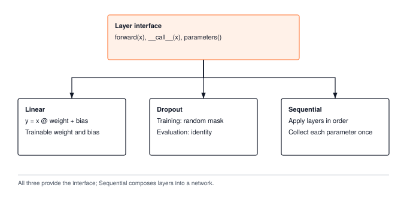

# Layers, Parameters, and Initialization {#sec-layers}

After Chapter 2 you can multiply a batch of inputs by a weight matrix, add a bias, and pass the result through a non-linearity, and you know why the non-linearity has to be there. That is one layer. A network is many of them, and the question this chapter answers is the one a practitioner asks the first time they write `model.parameters()` and it just works: how does the framework know which tensors are the weights, what numbers were put in them before training started, and why does `model.eval()` change what the network computes?

The answer is a small piece of software design. A **layer** groups the parameters it owns with the forward rule that uses them. TinyTorch keeps the third concern, training versus evaluation, as an explicit argument to the call. A container collects parameter lists from its children and passes that argument only to children that accept it. We can therefore read the whole mechanism in `parameters()` and `forward()` before considering the automatic registration and stored mode flags of production frameworks.

Two of the three pieces carry real mathematics. The parameters need starting values, and the wrong scale makes a deep network's activations blow up or die before the first gradient step. And one common layer, dropout, behaves differently in the two modes on purpose, which is the whole reason the mode flag exists. We take the three in turn, build `Layer`, `Linear`, `Dropout`, and `Sequential`, and trace a small network through them by hand.

{#fig-layers-container}

---

## The Problem

Write a three-layer network with nothing but tensors. You allocate `W1`, `b1`, `W2`, `b2`, `W3`, `b3`, write the forward pass as three matrix multiplies with a ReLU between each, and the code runs. Then three things go wrong.

First, the numbers. The weights need starting values, and the obvious choice is standard normal noise, `randn`. Try it with a hidden width of 1024 and watch what the activations do as depth grows.

```python
import numpy as np

rng = np.random.default_rng(0)
D = 1024
h = rng.standard_normal((256, D)).astype(np.float32)   # a batch of 256 inputs
for layer in range(1, 16):
    W = rng.standard_normal((D, D)).astype(np.float32)  # "just use randn"
    z = h @ W
    h = np.maximum(0.0, z)                              # ReLU from Chapter 2
    if layer in (1, 5, 10, 15):
        print(f"layer {layer:2d}: variance of z = {np.var(z, dtype=np.float64):.2e}")
```

On my machine, with seed 0, that prints the following.

```
layer  1: variance of z = 1.03e+03
layer  5: variance of z = 6.78e+13
layer 10: variance of z = 2.34e+27
layer 15: variance of z = 8.50e+40
```

Every layer multiplies the spread of the signal by about 500. By layer 15 the pre-activations are around $10^{20}$ in size, and at that rate they pass the largest number float32 can hold ($3.4 \times 10^{38}$) near layer 29 and turn into `inf`, then `NaN`. Shrink the weights instead, say `randn * 0.001`, and the same table runs the other way, toward zero. There is a correct scale, it depends on the layer's width, and a bare tensor does not know it.

Second, bookkeeping. When you hand the network to an optimizer (Chapter 7) it needs every trainable tensor and nothing else. With six loose variables you pass a list by hand. With sixty you forget one, and that layer silently never learns.

Third, mode. Some layers do one thing while training and another when the trained network is used. If that switch is a global flag you set by hand, you will forget it, and the deployed model will behave like a noisy training run.

All three are the same gap. A tensor holds numbers; it does not hold the knowledge of how it is meant to be used. A layer does.

---

## The Idea

### A layer is parameters, a forward rule, and a mode

The design is a tree. A `Layer` object holds its trainable tensors and knows how to run its forward pass. A container is a layer whose children are other layers. Asking the root for its parameters means asking each layer for the short list it owns and concatenating the lists up the tree; telling the network whether it is training means passing one argument down the same tree with the call. Each layer answers for itself.

That one picture, a tree whose leaves are tensors and whose inner nodes are layers, is the whole chapter. Initialization decides what numbers go into the leaves. The `training` argument decides what some nodes do with them. Everything else is walking the tree.

### The right starting scale

Take one output of a linear layer, $y = \sum_{j=1}^{D_{\text{in}}} x_j w_j$, where $D_{\text{in}}$ is the layer's **fan-in**,[^fn-fan-in-layer-width] the number of inputs each output reads. If the inputs $x_j$ and the weights $w_j$ are independent with mean zero, the variance (the average squared distance from the mean) of each product is the product of the variances, and the variance of a sum of independent terms is the sum of their variances. So

$$\text{Var}(y) = D_{\text{in}} \cdot \text{Var}(x) \cdot \text{Var}(w).$$

[^fn-fan-in-layer-width]: **Fan-in**: the number of inputs feeding one output of a layer, which for `Linear(in_features, out_features)` is `in_features`; **fan-out** is the number of outputs each input feeds. A 1024-wide layer sums 1024 products per output, and that count, not the weight values, is what decides how much the signal grows.

With $\text{Var}(w) = 1$ and $D_{\text{in}} = 1024$, each layer multiplies the variance by 1024. For a symmetric input distribution, ReLU halves the second moment, $\mathbb{E}[x^2]$, rather than exactly halving the variance: its output no longer has mean zero. With independent zero-mean weights in the next layer, that second moment determines the next pre-activation variance. This gives the approximate factor of 512 seen in the loop.

To hold the variance steady, set $D_{\text{in}} \cdot \text{Var}(w) = 1$, or $\text{Var}(w) = 1 / D_{\text{in}}$. This is LeCun's rule and it is what the TinyTorch course module uses. Kaiming He's 2015 refinement accounts for the ReLU halving by doubling the weight variance:

$$\text{Var}(w) = \frac{2}{D_{\text{in}}}, \qquad \sigma_w = \sqrt{\frac{2}{D_{\text{in}}}}.$$

Here we call the multiplier on weight *variance* the **gain**, matching the first exercise; a gain on standard deviation would be its square root. The appropriate multiplier depends on the activation and its input distribution. Gain 1 preserves the linear case and is the module's default, rather than a universal prescription for tanh. Xavier Glorot's earlier rule, $\text{Var}(w) = 2 / (D_{\text{in}} + D_{\text{out}})$, splits the difference between keeping the forward signal steady (which wants $1/D_{\text{in}}$) and keeping the backward gradient steady (which wants $1/D_{\text{out}}$). Any of these rules can be realized with a normal distribution of the right standard deviation or a uniform one on $[-a, a]$, whose variance is $a^2/3$. The choices in @tbl-init-schemes differ by small constants; what they share is the $1/\sqrt{D_{\text{in}}}$ scaling, and that is the part that matters.

| Scheme | Meant for | Weight variance | Uniform bound $a$ |
| :--- | :--- | :---: | :---: |
| LeCun | linear, tanh (course module default) | $1 / D_{\text{in}}$ | $\sqrt{3 / D_{\text{in}}}$ |
| Xavier (Glorot) | sigmoid, tanh | $2 / (D_{\text{in}} + D_{\text{out}})$ | $\sqrt{6 / (D_{\text{in}} + D_{\text{out}})}$ |
| Kaiming (He) | ReLU, GELU | $2 / D_{\text{in}}$ | $\sqrt{6 / D_{\text{in}}}$ |

: Weight initialization rules. Each keeps the signal's variance roughly constant across layers for the non-linearity it was designed around. {#tbl-init-schemes tbl-colwidths="[18,34,24,24]"}

Rerunning the loop from The Problem with the weights scaled three ways gives @tbl-variance-evolution. The two bad columns march off toward overflow and underflow at a fixed rate per layer. The Kaiming column holds a flat line. Its level is 2 rather than 1 because the raw input to layer 1 was not a ReLU output, so the first layer doubles once and every later layer preserves what it receives.

| Layer | `randn` | `randn * 0.001` | Kaiming, `randn * sqrt(2/1024)` |
| :---: | :---: | :---: | :---: |
| 1 | $1.0 \times 10^{3}$ | $1.0 \times 10^{-3}$ | $2.0$ |
| 5 | $6.8 \times 10^{13}$ | $7.0 \times 10^{-17}$ | $1.8$ |
| 10 | $2.3 \times 10^{27}$ | $3.0 \times 10^{-33}$ | $2.0$ |
| 15 | $8.5 \times 10^{40}$ | $1.1 \times 10^{-49}$ | $2.0$ |

: Variance of the pre-activation $z$ at four depths for a 1024-wide ReLU network under three weight scales, from one run of the loop in The Problem with seed 0. The exact values vary run to run; the exponents do not. {#tbl-variance-evolution tbl-colwidths="[12,26,28,34]"}

### Dropout, and why a layer needs a mode

Dropout is a training trick against overfitting.[^fn-overfitting-dropout-motive] On every forward pass during training, each activation is independently zeroed with probability $p$, so no output can lean on one particular input always being present. At use time nothing is dropped.

[^fn-overfitting-dropout-motive]: **Overfitting**: a model that fits its training examples so closely, including their noise, that it does worse on new examples. Dropout was introduced by Srivastava and Hinton in 2014 as a cheap way to fight it; a network that survives losing half its activations at random cannot memorize a training set through any single one.

That creates a mismatch. If a fraction $1 - p$ of the activations survive training, the next layer learns to expect a sum that is $1 - p$ as large as it will be at use time, when everything survives. The original fix multiplied every activation by $1 - p$ at use time. The modern fix, **inverted dropout**, moves the correction into training instead. Each surviving activation is divided by $1 - p$:

$$y_{\text{train}} = \frac{x \cdot m}{1 - p}, \quad m \in \{0, 1\} \text{ with } P(m = 1) = 1 - p, \qquad y_{\text{eval}} = x.$$

The expected value of $m$ is $1 - p$, so the expected value of $y_{\text{train}}$ is exactly $x$. Training sees a noisy version of what eval sees, with the same average, and the eval path is the identity. The price is that `Dropout` must know which of the two it is doing, and that is the `training` argument it is called with.

---

## The Code

::: {.callout-note title="Source Code Mapping"}
The listings in this section are extracted from Module 03 (`src/03_layers/03_layers.py`) by name when the book is built, so a renamed class in the module fails the build instead of drifting from the chapter. Only `__repr__` methods are elided.
:::

Module 03 builds on two things from earlier chapters. From Chapter 1 it takes the `Tensor` and its operators, and from Chapter 2 it takes the rule that every piece of arithmetic goes through an operation object. A layer never touches `.data` in its forward pass; it calls `matmul`, `+`, and `*` on tensors, which is what lets Chapter 6 trace gradients back through a layer that knows nothing about gradients.

### The base class

Everything later in the book that touches a model goes through two calls. Chapter 7's optimizer takes `model.parameters()` and updates every tensor in the list; Chapter 8's trainer walks the same list to flag the tensors as trainable, zero their gradients, clip them, and write a checkpoint. And every layer is run the same way, `y = layer(x)`, so that a container can hold a `Linear` and a `Dropout` and a `ReLU` from Chapter 2 without knowing which is which. `Layer` is that contract and nothing more.



`forward` is abstract, `__call__` turns a layer into something you can call and passes any extra arguments through, and `parameters()` returns an empty list until a subclass says otherwise. Notice what is not here. There is no registry of parameters and no mode flag. Module 03 takes the direct route on both. Each layer that owns trainable tensors lists them in its own `parameters()`, right next to the code that allocated them, and a container concatenates its children's lists. Milestone I's XOR network does exactly this; its `parameters()` returns `self.hidden.parameters() + self.output.parameters()`. The list lives where the tensors live, so it stays short and readable, and the price is that a forgotten entry fails silently: the layer keeps its random weights, the loss may still fall because other layers change, and nothing raises. That silence is the reason PyTorch automates the registration, and the production section shows how. The mode question, which layers need to know whether the network is training, is answered the same direct way: the caller passes `training` as an argument, and `__call__` forwards it.

### Linear

`Linear` is the layer every network in this book is made of. Milestone I's digit classifier is two of them, 64 inputs to 32 hidden units to 10 classes, and every block of Chapter 13's transformer holds several more. Each one is born with random weights, because nobody hand-picks the starting values of a 4096 by 4096 matrix, and the layer has to pick the scale of that randomness itself.

The naive scale is `randn`, and The Problem showed what it costs. At width 1024 the variance grows about 500-fold per layer, the pre-activations cross float32's ceiling near layer 29, and in a network that deep the first forward pass returns `NaN` before any gradient has been computed. The other naive scale, `randn * 0.001`, drives the same signal toward zero, and the gradients that come back through it in Chapter 6 vanish the same way. Both look like a broken network when the only thing wrong is one constant.

The fix is to let the layer derive the constant from its own width. Module 03 uses LeCun's rule from @tbl-init-schemes, $\text{Var}(w) = 1 / D_{\text{in}}$, so `Linear` draws its weight with standard deviation $\sqrt{1 / D_{\text{in}}}$ (the module's `INIT_SCALE_FACTOR` is 1) and applies $y = xW + b$. The weight is stored as `(in_features, out_features)`, so a batch `x` of shape `(B, in_features)` multiplies it directly. The bias starts at zero; it adds nothing to the initial weighted sum. `rng` is the module's NumPy generator, created once with seed 7, and `INIT_SCALE_FACTOR` is 1. Each constructor consumes the next draw from that generator. Repeated calls therefore create different weights; constructing a new layer does not reset the random sequence.



Notice that `scale` comes from `in_features` alone. With a ReLU after every layer, LeCun's scale lets the next pre-activation variance shrink rather than hold steady, which is the gap Kaiming's gain of 2 closes. The module implements one simple default; the first exercise changes the gain and measures its effect instead of assuming that one initializer suits every network. PyTorch's `nn.Linear` stores the weight the other way around, as `(out_features, in_features)`, and defaults to a smaller scale than any rule in the table; the bridge section takes up both. Notice also that the weights are created without `requires_grad`. A layer does not decide whether it is being trained; Chapter 8's trainer flags every parameter it is given, and until then a `Linear` is just a function with some numbers in it.

The forward pass is two tensor operations, `matmul` and `+`, and that choice is doing quiet work. Each returns a fresh `Tensor` built by an operation object, so once Chapter 6 teaches `apply` to record what it did, this exact code will produce a gradient for `weight` and `bias` with no change. The addition of `self.bias` relies on the broadcasting from Chapter 1: the bias has shape `(out_features,)`, the product has shape `(B, out_features)`, and NumPy reads the same bias values for all $B$ rows without allocating a repeated bias matrix. The addition still allocates its output, and `apply` wraps it in a copied tensor. That forward efficiency creates an obligation for Chapter 6. Because the bias influenced every row in the batch, the backward engine will have to sum those gradients across the batch to keep the parameter's shape.

### Dropout

`Dropout` is the layer that gives the `training` argument its job. GPT-2 applies it during training to the embeddings, the attention weights, and both residual updates in every block, and a trained model is used far more often than it is trained. A deployed classifier runs its forward pass on every request, and the generation loop in Chapter 18 runs it once per token.

The Idea mentioned the original fix, multiplying every activation by $1 - p$ at use time. Count what that costs. It is one extra pass over every activation at every dropout site on every request, forever, to correct for something that happened during training. On a hidden layer of width 4096 with a batch of 16 it is 65,536 multiplies per site per call, 256 KB read and written again, and it never stops.

Inverted dropout moves the correction to training, where we are already drawing a mask and touching every element anyway. Divide each surviving activation by $1 - p$ then, and the use-time path has nothing left to do. So `Dropout` owns no parameters, only the probability `p`. The mask is drawn fresh on every training call and folded together with the $1 / (1 - p)$ scale, so each mask entry is either 0 or $1 / (1 - p)$ and one multiply does both jobs.



Read the branches before the random draw. Evaluation and `p=0` return `x` itself: no mask, scaling, or allocation. Training with `p=1` returns zeros directly, avoiding division by `1-p`; only `0<p<1` reaches `_generate_dropout_mask`. These cases define the output contract even at the endpoints. The helpers separate `_should_apply_dropout`, which chooses whether to transform the input, from `_generate_dropout_mask`, which draws and scales the mask. On the training path the multiply is `x * mask`, a tensor operation rather than an array one, so the mask becomes part of the graph that Chapter 6 walks and the gradient of a dropped element is zero the way it should be. PyTorch's dropout takes the same identity shortcut when the model is in eval mode, and its compiler drops the layer from the graph altogether.

### Sequential

Milestone I's digit classifier is `Linear`, `ReLU`, `Linear`. Chapter 13's `TinyGPT` is an embedding, a list of blocks, a final norm, and an output projection, and each block is itself a small stack. A framework needs a container that turns a list of layers into one layer, so that the trainer can call `parameters()` on the root and never learn what is inside.



`Sequential` runs its children in order and concatenates their parameter lists. Follow the assignment `x = layer.forward(...)`: after each iteration, `x` holds the previous child's output, so the next child must accept that shape. The container does not reshape or repair it.

The `inspect.signature` test handles a second contract. `Dropout.forward` accepts `training`, while `Linear.forward` does not, so the container inspects the signature before making one call. It does not catch a `TypeError` from inside the layer and retry: a genuine layer error must reach the caller. This makes a failing child visible at the point where composition breaks. The tradeoff is signature inspection during every forward pass, which keeps dispatch explicit in this teaching implementation. Building a small model shows the container doing its two jobs.

```python
from tinytorch.core.layers import Linear, Dropout, Sequential

model = Sequential(Linear(4, 3), Dropout(0.5), Linear(3, 2))
print([p.shape for p in model.parameters()])
print(model)
```

```
[(4, 3), (3,), (3, 2), (2,)]
Sequential(Linear(in_features=4, out_features=3, bias=True), Dropout(p=0.5), Linear(in_features=3, out_features=2, bias=True))
```

Four parameter tensors came back, weight before bias within each layer and layer order within the container, and `Dropout` contributed none. In practice a `ReLU` from Chapter 2 sits between the two `Linear` layers; it is left out here so the trace below stays short, and Milestone I builds the full version.

---

## A Worked Trace

We trace that same model with weights chosen by hand so every number can be checked on paper. Parameter discovery first. @tbl-parameter-ledger lists what `model.parameters()` returns and what it costs in memory at four bytes per float32 value.

| Layer | Attribute | Shape | Values | Trainable | Bytes |
| :--- | :--- | :---: | :---: | :---: | :---: |
| `Linear(4, 3)` | `weight` | $(4, 3)$ | 12 | yes | 48 |
| `Linear(4, 3)` | `bias` | $(3,)$ | 3 | yes | 12 |
| `Dropout(0.5)` | none | | 0 | | 0 |
| `Linear(3, 2)` | `weight` | $(3, 2)$ | 6 | yes | 24 |
| `Linear(3, 2)` | `bias` | $(2,)$ | 2 | yes | 8 |
| **Total** | 4 tensors | | **23** | | **92** |

: Parameter ledger for `Sequential(Linear(4, 3), Dropout(0.5), Linear(3, 2))`. {#tbl-parameter-ledger tbl-colwidths="[20,16,14,14,16,14]"}

Now the forward pass. We overwrite the random weights with small integers and halves, feed one input row, and assume a particular dropout draw, keep-drop-keep, so the training path is deterministic.

```python
from tinytorch.core.tensor import Tensor

lin1, drop, lin2 = model.layers
lin1.weight.data[:] = [[0.5, -1.0,  0.0],
                       [0.5,  0.5,  1.0],
                       [1.0,  0.0, -1.0],
                       [0.0,  2.0,  2.0]]
lin1.bias.data[:]   = [0.5, 1.0, -1.0]
lin2.weight.data[:] = [[1.0, -1.0],
                       [1.0,  1.0],
                       [0.5,  0.5]]
lin2.bias.data[:]   = [0.0, 1.0]

x = Tensor([[1.0, 2.0, -1.0, 0.5]])
h1 = lin1(x)
print("h1      ", h1.data)

mask = Tensor([[2.0, 0.0, 2.0]])            # the draw we assume: keep, drop, keep
h_drop = h1 * mask
print("h_drop  ", h_drop.data)
print("y_train ", lin2(h_drop).data)

print("y_eval  ", model(x, training=False).data)
```

```
h1       [[1. 2. 3.]]
h_drop   [[2. 0. 6.]]
y_train  [[5. 2.]]
y_eval   [[4.5 3.5]]
```

Check the first hidden unit by hand. Its column of `W1` is $[0.5, 0.5, 1.0, 0.0]$, so $x W_1$ gives $0.5 + 1.0 - 1.0 + 0 = 0.5$, and adding the bias $0.5$ makes $1.0$. The other two columns give $2.0$ and $3.0$ the same way. The mask keeps the first and third units and doubles them, since $1 / (1 - 0.5) = 2$. @tbl-dropout-trace follows both paths through the second layer.

| Stage | `training=True` | `training=False` |
| :--- | :--- | :--- |
| Input $x$ | $[1.0, 2.0, -1.0, 0.5]$ | $[1.0, 2.0, -1.0, 0.5]$ |
| $h_1 = xW_1 + b_1$ | $[1.0, 2.0, 3.0]$ | $[1.0, 2.0, 3.0]$ |
| Dropout, $p = 0.5$ | mask $[2, 0, 2]$ gives $[2.0, 0.0, 6.0]$ | identity, $[1.0, 2.0, 3.0]$ |
| $y = h W_2 + b_2$ | $[5.0, 2.0]$ | $[4.5, 3.5]$ |

: The same input through the same weights on the two paths. The training output depends on the mask; the use-time output does not. {#tbl-dropout-trace tbl-colwidths="[24,40,36]"}

The two outputs differ, as they should; training saw a noisy version of the network. The claim from The Idea is that they agree on average. With three units and $p = 0.5$ there are only eight equally likely masks, so we can average over all of them rather than trust the algebra.

```python
import itertools
import numpy as np

outputs = []
for bits in itertools.product([0.0, 2.0], repeat=3):   # all 8 masks, equally likely
    outputs.append(lin2(h1 * Tensor([list(bits)])).data)
print("mean of y_train over all masks:", np.mean(outputs, axis=0))
```

```
mean of y_train over all masks: [[4.5 3.5]]
```

The average equals the evaluation output here because the operation after dropout is affine: averaging commutes with multiplication by `W2` and addition of `b2`. Inverted dropout guarantees the expected activation entering that layer, not equality between the expected training output and evaluation output of an arbitrary nonlinear network. Its local guarantee is enough to remove a separate rescaling step during evaluation.

---

## From TinyTorch to Production

PyTorch's `nn.Module` automates the two things Module 03 does by hand. Assigning an `nn.Parameter` or a child module to an attribute goes through `Module.__setattr__`, which files it into one of two ordered dictionaries, `_parameters` and `_modules`, so no layer writes a `parameters()` list and the silent failure of a forgotten entry cannot happen. `parameters()`, `named_parameters()`, `state_dict()` (the dictionary of named tensors you save to disk), and `train()`/`eval()` all walk those two dictionaries recursively, and the mode lives on the module as `self.training` rather than traveling with the call. The automation has an edge worth knowing. A plain Python list of modules is *not* registered, because `__setattr__` only inspects the object being assigned, not its contents. That is why `nn.ModuleList` and `nn.Sequential` exist, and why a model that stores its blocks in a bare list trains only the parameters it happened to register elsewhere. Module 03's explicit lists have no such edge, because nothing is inferred; the cost is the one The Problem named.

`nn.Linear` computes the same $xW + b$ but stores the weight as `(out_features, in_features)` and calls `F.linear`, which evaluates $x W^{T} + b$. The transposed layout puts each output unit's weights next to each other in memory, and the matrix library underneath, cuBLAS on NVIDIA GPUs and a CPU BLAS library otherwise, accepts a transpose flag on its GEMM call, so no copy is made. Whichever layout a framework picks, the number of multiply-adds is identical; the choice is about which dimension is contiguous. The default initializer is also worth knowing. `nn.Linear` calls `kaiming_uniform_` with an argument that works out to a uniform bound of $1 / \sqrt{D_{\text{in}}}$, a weight variance of $1 / (3 D_{\text{in}})$, which is a third of the LeCun scale in @tbl-init-schemes and a sixth of the ReLU gain. It is a documented historical accident, and it is why serious training code often re-initializes its layers explicitly with `torch.nn.init`.

Dropout in PyTorch reads the module's `self.training` flag, flipped by `model.eval()`, where Module 03 reads the argument the caller passed, and it takes the same identity shortcut. On a GPU the training path is one fused kernel that draws the mask, scales, and multiplies in a single pass over the tensor, and the mask is kept as one byte per element for the backward pass. In eval mode `torch.compile` removes the layer from the graph entirely, so a deployed model pays nothing for the dropout it trained with, which is the payoff of putting the $1/(1-p)$ on the training side.

JAX and Flax make the opposite design choice about where parameters live. A Flax module holds no tensors at all. `model.init(key, x)` returns the parameters as a nested dictionary (a **pytree**, a tree of arrays that JAX functions can walk), and every forward call is `model.apply(params, x)` with the parameters passed in. Randomness is explicit too. Initialization takes a random key, and dropout requires both a key and a `deterministic` flag at call time, which is Module 03's `training` argument under another name. The parameter tree is the same idea as ours, but carried as data rather than held by objects, which is what lets JAX transform whole training steps as pure functions.

::: {#nbk-layers-parameter-memory-budget .callout-notebook title="What one production-sized Linear layer weighs"}
Napkin math, not a measurement. A `Linear(4096, 4096)` in float32 holds $4096 \times 4096 \times 4 = 67.1\text{ MB}$ of weights and $16\text{ KB}$ of bias, so the bias is under $0.03\%$ of the layer's memory. Its Kaiming standard deviation is $\sqrt{2 / 4096} \approx 0.022$; initializing at $\sigma = 0.05$ instead inflates the variance by $(0.05/0.022)^2 \approx 5\times$ per layer, and twenty such layers compound to about $10^{14}$. A forward pass on a batch of 16 costs $2 \times 16 \times 4096 \times 4096 \approx 537$ million multiply-adds, but streams the full 67 MB of weights through the processor once per batch regardless of batch size, which is why small-batch inference is limited by memory traffic rather than arithmetic.
:::

What carries over unchanged is the mental model. Parameters are collected by asking each layer for its own list and letting containers concatenate, initialization scale goes as $1 / \sqrt{\text{fan-in}}$ with a gain for the non-linearity, and dropout's scaling lives on the training side so eval is free. What to look for in your own work follows directly. A model whose loss never moves for one block often has that block in a bare list. `NaN` on the first batch usually means the wrong initialization scale, or a gain that does not match the activation. Worse scores in deployment than in validation usually mean the model is still being called with `training=True`.

---

## Summary

Module 03 builds the layer abstraction: a `Layer` base class that fixes the calling contract, a `Linear` that lists its own two parameters and allocates its weight at the $\sqrt{1 / D_{\text{in}}}$ scale to set the initial scale from fan-in, an inverted `Dropout` whose use-time path is the identity, and a `Sequential` that concatenates its children's lists and passes `training` down to the layers that want it. The invariant to keep is the variance rule, $\text{Var}(y) = D_{\text{in}} \, \text{Var}(x) \, \text{Var}(w)$, because every initialization scheme is a way of setting that product to 1, and the trace showed that inverted dropout preserves the expected input to the following affine layer. Chapter 4 takes for granted that a `Sequential` model turns a batch of inputs into a row of raw, unbounded scores per example and asks how to turn those scores into one number that says how wrong they are.

---

## Exercises

1. **Kaiming gain.** `Linear` uses LeCun's scale. Add a `gain` argument so that `Linear(4, 3, gain=2.0)` draws at the Kaiming scale from @tbl-init-schemes, rerun the variance loop from The Problem with a 15-layer ReLU stack under both scales, and report the variance at layer 15 for each.
2. **Layer normalization.** Implement `LayerNorm(features, eps=1e-5)` as a `Layer` that, for each row of its input, subtracts the row's mean and divides by the square root of its variance plus `eps`, then multiplies by a learned per-feature scale and adds a learned per-feature shift. What are its parameters, and what does `model.parameters()` return for `Sequential(Linear(4, 3), LayerNorm(3))`?
3. **Fan-out initialization.** Some networks scale weights by $2 / D_{\text{out}}$ instead of $2 / D_{\text{in}}$. Using the variance rule from The Idea, say what each choice holds constant, the forward signal or the backward gradient, and explain why for a square layer ($D_{\text{in}} = D_{\text{out}}$) the two agree.
4. **Weight memory.** A language model's feed-forward block contains `Linear(4096, 16384)`. Compute its parameter memory in float32, then the memory of the activations it produces for a batch of 16 rows. Which of the two dominates, and by how much?
