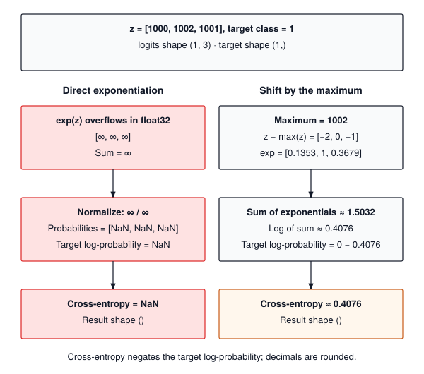

# Loss Functions and Numerical Stability {#sec-losses}

Chapter 3 ended with a `Sequential` model that turns a batch of inputs into a row of raw, unbounded scores per example, one score per class. Those scores are not yet an answer, and they are not yet something a training loop can act on. The question this chapter answers is the one every practitioner asks the first time a run prints `loss: nan`: how do we turn the model's output and the correct label into a single number that says how wrong the model is, and why does the textbook formula for that number fall apart on real hardware?

The single number is the **loss**. It has to be one scalar rather than a vector because a scalar has an unambiguous "down," and the chapters on gradients and optimizers (6 and 7) need a direction to push. This chapter builds two losses. `MSELoss` handles regression, where the target is a number. `CrossEntropyLoss` handles classification, where the target is a class index, and it is the one with the numerical trap. Along the way we build `log_softmax`, the helper that defuses the trap.

The fix itself is three lines: subtract the largest logit before exponentiating. The reason those three lines are needed, and why the order of two subtractions inside them matters, is the rest of the chapter.

{#fig-loss-stability}

---

## The Problem

A classifier with three classes produces three numbers. Suppose, early in training, they come out as `[100.0, 101.0, 99.0]`. The standard recipe for turning them into probabilities is to exponentiate each one and divide by the sum. Here is that recipe, verbatim, in float32.

```python
import numpy as np

z = np.array([100.0, 101.0, 99.0], dtype=np.float32)
e = np.exp(z)                # [inf, inf, inf]
print(e / np.sum(e))         # [nan nan nan]
```

NumPy prints an overflow warning and carries on, and every probability comes out as `nan`. The reason is the range of a 32-bit float. The largest finite float32 is about $3.4 \times 10^{38}$, which is $e^{88.72}$, so `exp` of anything above 88.72 returns `inf`. The sigmoid in @sec-activations met the same wall and selected the branch whose exponent was nonpositive; this chapter applies the same idea to a whole row of numbers at once. Once one term is `inf`, the sum is `inf`, and `inf / inf` is not a number. The other direction fails just as quietly. Below about $-104$, `exp` returns an exact `0.0`, so logits of `[-1000, -1002, -1001]` give a sum of zero and `0 / 0`, which is also `nan`.

Logits of 100 are not exotic. Chapter 3 showed how fast badly scaled weights inflate activations; a few layers of that and the outputs are in the hundreds. Nor is a `nan` a local event. Every arithmetic operation on `nan` returns `nan`, so once the loss is `nan`, the gradients Chapter 6 computes from it are `nan`, and the update Chapter 7 applies writes `nan` into every weight. One overflow in one row of one batch ends the run.

So the need is concrete. We want a loss for classification that avoids preventable overflow when the input logits and their differences are representable. Stable algebra cannot recover a value that was already converted to `inf` before the loss received it.

---

## The Idea

### A loss is one number, and lower is better

A loss function takes the model's predictions and the true targets and returns one scalar that is zero when the predictions are perfect and grows as they get worse. For regression, where the target is a number, the natural choice is **mean squared error**:

$$\mathcal{L}_{\text{MSE}} = \frac{1}{N} \sum_{i=1}^{N} (\hat{y}_i - y_i)^2$$

Here $N$ is the number of predictions, $\hat{y}_i$ is the model's $i$-th prediction, and $y_i$ is the true value. Squaring makes the error positive and punishes large misses more than small ones. Dividing by $N$ makes the value independent of batch size, so a loss of 0.18 means the same thing whether it came from three examples or three thousand. `MSELoss` will be a few lines, although very large differences can still overflow when squared. Averaging also fixes the meaning of the returned number: duplicating a batch leaves its mean loss unchanged.

### Cross-entropy scores the probability of the right answer

For classification the model outputs a vector $\mathbf{z} = [z_1, \dots, z_C]$ of $C$ raw scores, one per class. These are the **logits**, and they can be any real numbers. To read them as probabilities we apply the **softmax** function:

$$p_i = \frac{e^{z_i}}{\sum_{j=1}^{C} e^{z_j}}$$

Exponentiating makes every entry positive, and dividing by the total makes them sum to one. The largest logit gets the largest probability, and the gap between logits controls how confident the distribution is; that is the "soft" in softmax.

Given the true class $t$, **cross-entropy** is the negative logarithm of the probability the model assigned to it:

$$\mathcal{L}_{\text{CE}} = -\log p_t$$

A few values make the shape of this function clear. If the model gives the right class probability 0.99, the loss is 0.01. At 0.5 it is 0.69. At 0.1 it is 2.30, and at 0.01 it is 4.61. The loss is near zero for a confident correct answer and grows without bound for a confident wrong one, which is exactly the pressure we want training to apply. Statisticians call this quantity the negative log-likelihood,[^fn-nll-cross-entropy] and over a batch of $N$ examples we average it, for the same reason MSE divides by $N$.

[^fn-nll-cross-entropy]: **Negative log-likelihood** (NLL): the negative logarithm of the probability a model assigns to the outcome that actually occurred. PyTorch exposes it directly as `nll_loss`, which expects log-probabilities as input, and its `cross_entropy` is exactly `nll_loss(log_softmax(logits))`.

### The fix: shift before you exponentiate

Softmax has a property that saves it. Multiply the numerator and denominator by the same constant $e^{-c}$ and nothing changes:

$$p_i = \frac{e^{z_i}}{\sum_j e^{z_j}} = \frac{e^{-c} \, e^{z_i}}{e^{-c} \sum_j e^{z_j}} = \frac{e^{z_i - c}}{\sum_j e^{z_j - c}}$$

So we may subtract any constant $c$ from every logit before exponentiating, and the probabilities are identical on paper. On hardware they are not identical, and the choice $c = \max(\mathbf{z})$ is the one that makes the computation safe. After the shift, every logit is at most zero, so every $e^{z_i - c}$ is at most $e^0 = 1$ and nothing can overflow. And the largest logit becomes exactly zero, so the sum contains at least one term equal to 1 and can never be zero. Tiny terms may still underflow to `0.0`, but a term that small was contributing nothing next to a 1 anyway. Both failures in the previous section are gone.

### Take the logarithm before you divide

The loss never needs the probabilities themselves; it needs $\log p_t$. Taking the logarithm of the shifted softmax turns the division into a subtraction:

$$\log p_i = (z_i - c) - \log \sum_{j=1}^{C} e^{z_j - c}$$

The vector of all $C$ values of $\log p_i$ is the **log-softmax** of $\mathbf{z}$, and the scalar $c + \log \sum_j e^{z_j - c}$ is called the **log-sum-exp** of $\mathbf{z}$. It is a safe way to compute $\log \sum_j e^{z_j}$, and the cross-entropy loss is simply the log-sum-exp minus the target logit. That rearrangement is the algebra. The code keeps one more detail straight, which is that $z_t - c$ must be computed first, as its own small number, before the log of the sum is subtracted. The worked trace shows why, with a case where the other order is wrong in the second decimal place.

---

## The Code

::: {.callout-note title="Source Code Mapping"}
The listings in this section are extracted from Module 04 (`src/04_losses/04_losses.py`) by name when the book is built, so a renamed class in the module fails the build instead of drifting from the chapter. The module also ships a `BinaryCrossEntropyLoss` that works on probabilities rather than logits; the first exercise asks you to improve on it.
:::

Module 04 follows the pattern Chapter 2 set. Each loss is a pair of classes: an operation, a `Function` subclass whose `forward` takes NumPy arrays and returns one, and a thin wrapper that takes tensors and hands them to the operation through `apply`. The operation is what Chapter 6 records and completes with a `backward`; the wrapper is what the training loop calls.

### A loss is one scalar in a `Tensor`

The loss is the boundary between scoring predictions and deciding how to improve them. This module chooses a scalar mean as the objective. A vector of per-example losses could also be useful, but a caller would then have to specify how to combine or weight its entries. Returning the mean makes that choice explicit once and gives the later training loop a consistent starting point. No call to `backward()` is needed to inspect that contract here.

The cheaper thing to return would be a bare Python float, and for this chapter a float would work. It stops working in Chapter 6, where `backward()` walks from the loss back through every operation that produced it, and a float has no place to record where it came from. So every loss returns a `Tensor` holding a single value, and `apply` guarantees it: whatever the operation's `forward` returns, even a NumPy scalar, comes back wrapped. `MSELoss` is the smallest pair that satisfies the contract.





The output is a `Tensor` holding a single float and nothing else. For now it is a number in a box; Chapter 6 makes that box the root of the backward pass, the one node every gradient is measured against. Notice that `np.mean` averages *all elements*. For predictions and targets of shape `(B, D)`, it divides by `B * D`, not just by `B`. The intended contract is matching shapes; a target of shape `(B,)` against predictions `(B, 1)` would broadcast into `(B, B)` before the mean and score the wrong pairs. The function rejects mismatched or empty shapes before subtraction, so NumPy cannot silently turn this mistake into a different objective. PyTorch's `nn.MSELoss` exposes that choice as `reduction="mean"`, its default, with `"sum"` and `"none"` as the alternatives.

### `LogSoftmax`, the max shift in code

Every classifier in this book ends here. Chapter 3's ten-class network hands the loss a `[64, 10]` block of logits for a batch of 64. Chapter 13's language model hands it one row of $V$ logits per position, one entry per word in a vocabulary of tens of thousands, for every position in every sequence. Chapter 12's attention runs the same softmax over every row of a score matrix. Each row needs its own log-probabilities, there may be thousands of rows a step, and the operation has to be correct on any row and cheap on all of them.

The naive way is to write the textbook down as `np.log(np.exp(z) / np.sum(np.exp(z)))`. The Problem showed the loud failure, `nan` for any logit past 88.7. There is a quiet one too. Even when nothing overflows, a probability that underflows to `0.0` goes into `log` and comes out `-inf`. On my machine `log(softmax([-110, 0]))` prints `[-inf, 0.]`, where the right answer is `[-110, 0]`; the naive form has thrown away a perfectly finite number. And it makes four passes over the row (exponentiate, sum, divide, log) to do it.

The fix is The Idea's two moves, in that order. Subtract each row's maximum, so every exponential is at most 1 and every sum is at least 1. Then take the log of the sum and subtract it from the shifted logits, so no probability is ever formed and nothing is ever divided. The operation takes an array of logits, one row per example along `dim`, and returns log-probabilities of the same shape; a one-line function wraps it for callers holding a `Tensor`.





Notice two things. The `keepdims=True` keeps the per-row maximum as a column of shape `[N, 1]` rather than a flat vector of length `N`, so that subtracting it from the `[N, C]` logits lines up one maximum with each row; that is the broadcasting rule from Chapter 1 doing the work. And the last line is `x - max_vals - log_sum_exp`, which Python evaluates left to right, so the shift happens first and the log of the sum is subtracted from a number that is already small. Written as `x - (max_vals + log_sum_exp)` it would be equal on paper and wrong in float32, for the reason the trace makes visible. PyTorch ships this same function as `torch.log_softmax`, and its scalar half, $c + \log \sum_j e^{z_j - c}$, as `torch.logsumexp`.

### `CrossEntropyLoss` gathers instead of multiplying

Labels arrive as integers. Chapter 5's loader hands over a batch of class indices alongside the batch of inputs, and Chapter 13's target for each position is the id of the next token. With log-probabilities in hand, the loss has to pick, for row `i`, the entry in column `target[i]`, negate it, and average over the batch.

The textbook formula does not say "pick." It says $-\sum_i y_i \log p_i$ with a one-hot[^fn-one-hot-targets] $y$, and the obvious code follows the formula. Build an `[N, C]` matrix of zeros with a single 1 per row, multiply it into the log-probabilities elementwise, and sum across columns. That is $N \times C$ multiplications to keep $N$ numbers. For 64 examples and 10 classes it is 640 multiplies and a 2.5 KB matrix of mostly zeros, which nobody would notice. For the language-model logits the production bridge works through, 8,192 positions over a 32,000-word vocabulary, it is a 1 GB matrix of zeros, built and multiplied through on every step, to recover 8,192 numbers. Can we read those 8,192 numbers without touching the other 262 million?

NumPy can. Indexing an array with two integer arrays of the same length pairs them up elementwise, so `log_probs[np.arange(N), target_idx]` pairs row `i` with column `target_idx[i]`, reads exactly `N` entries, and touches nothing else.





Targets represent integer class IDs, but their storage is float32: `Tensor([0, 1])` contains `[0.0, 1.0]`. `targets.astype(int)` creates the integer array required by the gather. The expected shape is `(N,)`, paired with logits of shape `(N, C)`. The operation checks that the original labels are finite whole numbers before conversion, then rejects IDs outside the class range. Nothing builds a one-hot matrix merely to multiply most of it by zero. The range check exists because NumPy treats a negative index as counting from the end, so a corrupted label of `-1` would silently select the last class instead of failing. Notice also that the first line calls `LogSoftmax().forward` on the array directly rather than `log_softmax` on a tensor. Inside an operation everything is NumPy, and Chapter 6 will want the log-probabilities as an array anyway, because its backward formula uses the probabilities obtained by exponentiating them. PyTorch calls the gather, negate, and average step `nll_loss`, and its `cross_entropy` is `nll_loss` applied to the output of `log_softmax`, the same two functions in the same order.

[^fn-one-hot-targets]: **One-hot**: a vector with a 1 in the position of the correct class and 0 everywhere else, so a label of class 2 among 5 classes becomes `[0, 0, 1, 0, 0]`. For a batch of $N$ examples it takes $N \times C$ numbers to store what $N$ integers already say, which is why the code indexes with the integers instead.

Here is a short run of both, on numbers small enough to check by hand. I keep a run like this next to every loss I write, because a loss that returns a plausible-looking wrong number is the kind of bug that trains for a week before anyone notices.

```python
import numpy as np
from tinytorch.core.tensor import Tensor
from tinytorch.core.losses import MSELoss, CrossEntropyLoss

logits = Tensor(np.array([[2.0, 1.0, 0.1],
                          [0.5, 1.5, 0.8]], dtype=np.float32))
targets = Tensor(np.array([0, 1]))
loss = CrossEntropyLoss()(logits, targets)
print(f"cross-entropy: {loss.data:.4f}")   # 0.5200
print("shapes:", logits.shape, targets.shape, loss.shape)  # (2, 3) (2,) ()
repeated = CrossEntropyLoss()(
    Tensor(np.concatenate([logits.data, logits.data])),
    Tensor(np.concatenate([targets.data, targets.data])),
)
assert np.allclose(repeated.data, loss.data)  # the objective is a mean

preds = Tensor(np.array([1.0, 2.0, 3.0], dtype=np.float32))
truth = Tensor(np.array([1.5, 2.5, 2.8], dtype=np.float32))
print(f"mse: {MSELoss()(preds, truth).data:.4f}")  # 0.1800
```

The shape print follows the interface through the call: two rows of class scores and two IDs become a scalar with shape `()`. Duplicating both inputs leaves that scalar unchanged, checking the reduction independently of the softmax arithmetic. The MSE value is $(0.5^2 + 0.5^2 + 0.2^2) / 3 = 0.18$. The cross-entropy value comes from the row-by-row trace that follows.

---

## A Worked Trace

Take the first row of the batch above, logits $\mathbf{z} = [2.0, 1.0, 0.1]$ with target $t = 0$, and follow it through `LogSoftmax.forward` one line at a time.

| Step | Computation | Value |
| :--- | :--- | :--- |
| 1. Row maximum | $c = \max(\mathbf{z})$ | $2.0$ |
| 2. Shift | $\mathbf{z} - c$ | $[0.0, -1.0, -1.9]$ |
| 3. Exponentiate | $e^{\mathbf{z} - c}$ | $[1.0000, 0.3679, 0.1496]$ |
| 4. Sum | $\sum_j e^{z_j - c}$ | $1.5174$ |
| 5. Log of the sum | $\log 1.5174$ | $0.4170$ |
| 6. Log-probabilities | $(\mathbf{z} - c) - 0.4170$ | $[-0.4170, -1.4170, -2.3170]$ |
| 7. Pick target, negate | $-\log p_0$ | $0.4170$ |

: Hand trace of `log_softmax` and `CrossEntropyLoss` on one row of logits $[2.0, 1.0, 0.1]$ with target class 0. {#tbl-losses-ce-trace tbl-colwidths="[24,36,40]"}

Exponentiating the log-probabilities gives the probabilities themselves, $[0.659, 0.242, 0.099]$, which sum to one as they must. The model puts 66 percent on the right class and pays a loss of 0.417 for its remaining doubt. The second row, $[0.5, 1.5, 0.8]$ with target 1, works through the same steps to a loss of 0.623, and the batch mean is $(0.417 + 0.623) / 2 = 0.520$, which matches the printed value.

The same seven steps on the logits that broke the naive formula show the shift doing its job. With $\mathbf{z} = [1000, 1002, 1001]$ and $t = 1$, the naive and stable paths diverge at the very first exponential.

| Step | Naive softmax | Max-shifted log-softmax |
| :--- | :--- | :--- |
| Exponentiate | $e^{1000}, e^{1002}, e^{1001} \to$ `inf` | $c = 1002$, shifted $[-2, 0, -1]$, $e^{\cdot} = [0.1353, 1.0, 0.3679]$ |
| Sum | `inf` | $1.5032$ |
| Normalize or take log | `inf / inf` $=$ `nan` | $\log 1.5032 = 0.4076$ |
| Loss | $-\log($`nan`$) =$ `nan` | $-(0 - 0.4076) = 0.4076$ |

: The naive and max-shifted paths on the extreme logits $[1000, 1002, 1001]$ with target class 1. {#tbl-lse-trace tbl-colwidths="[22,34,44]"}

The shifted exponential stage handles only values between 0.1353 and 1, and the answer, 0.4076, is the same loss the row would have if all three logits were 998 smaller. That is the shift invariance from The Idea, now visible as arithmetic.

One last detail hides in the final row. The loss can be written as $\text{LSE}(\mathbf{z}) - z_t = 1002.4076 - 1002$, or as $-((z_t - c) - \log\text{sum}) = -(0 - 0.4076)$. On paper these are equal. In float32 they are not, because a float32 carries about seven significant digits, and $1002.4076$ has already spent four of them on the integer part. Adding $1002$ to $0.4076$ and then subtracting $1002$ throws away the digits that matter.

```python
import numpy as np

for base in (1e3, 1e6):
    z = np.array([base, base + 2.0, base + 1.0], dtype=np.float32)
    c = np.max(z)
    log_sum = np.log(np.sum(np.exp(z - c)))     # 0.40760596 in every case
    lse_first = (c + log_sum) - z[1]            # big numbers first
    shift_first = log_sum - (z[1] - c)          # small numbers first
    print(f"logits near {base:.0e}: {lse_first:.6f} vs {shift_first:.6f}")
# logits near 1e+03: 0.407593 vs 0.407606
# logits near 1e+06: 0.437500 vs 0.407606
```

On my machine that prints the two lines in the comments. At logits near a thousand the error sits in the fifth decimal place. At logits near a million, where float32 can only represent multiples of 0.0625, the "big numbers first" form is off by 0.03, a 7 percent error in the loss, while the form the code uses is unchanged. This is why `LogSoftmax` subtracts the maximum before the log of the sum and why `CrossEntropyFunction` gathers from that array rather than computing the log-sum-exp as a separate scalar. Overflow is the loud failure; loss of precision is the quiet one, and the same subtraction order fixes both.

---

## From TinyTorch to Production

PyTorch's `nn.CrossEntropyLoss` is the same design as the listing above. It takes logits, not probabilities, applies the max shift inside `log_softmax`, gathers the target entries with `nll_loss`, and averages over the batch by default. The mental model carries over unchanged, and so does the most common mistake built on it. Because the loss applies softmax internally, feeding it the output of a softmax layer squashes the logits into $[0, 1]$ before they are shifted and exponentiated again; the network still trains, but slowly and to a worse answer, and nothing warns you. The PyTorch version adds options the TinyTorch one lacks, such as `ignore_index` for padding tokens, `label_smoothing`, per-class weights, and targets given as class probabilities instead of indices, but each is a small variation on the gather-and-average step.

What production changes is not the math but the number of passes over memory. Module 04's `LogSoftmax` walks the logits half a dozen times, once for the maximum, once for the shift, once each for the exponentials and their sum, and twice for the final subtraction, while the elementwise steps allocate full-size temporaries and the reductions produce smaller arrays of row statistics. The operation does almost no arithmetic per element, one `exp` and a couple of subtractions, so its cost is set by how many bytes move rather than how many operations run; it is memory bound, in the sense Chapter 2 introduced. A fused GPU kernel can keep row data local across several of these steps. Each thread holds a few logits of one row in registers, the threads of a warp[^fn-warp-softmax-reduction] exchange partial maximums and partial sums among themselves without writing to memory, reducing repeated trips to device memory. Whether an entire row fits locally depends on its length and the chosen kernel. PyTorch keeps a family of such kernels in `aten/src/ATen/native/cuda/SoftMax.cu`, chosen by row length.

[^fn-warp-softmax-reduction]: **Warp**: a group of 32 GPU threads that execute the same instruction at the same moment. Threads in a warp can pass values to one another directly through registers, without touching memory, which is what makes a 32-way maximum or sum nearly free compared with the cost of reading the row.

Fusion matters most where the logits are largest, which is language modeling. A language model picks each piece of output text, called a token, from a fixed vocabulary, and every token is one class. With a vocabulary of 32,000 and a batch that scores 8,192 positions, the logits number $8{,}192 \times 32{,}000 \approx 262$ million, which is about 1 GB in float32; that is napkin math, and a modern vocabulary of 128,000 tokens quadruples it. The naive `log(softmax(x))` composition creates up to three temporaries of that size before the loss is a single number, and the fused kernel creates none. Kernels such as Liger's fused linear cross-entropy go one step further and compute the final `Linear` layer and the loss together in chunks, so the full logits array is never materialized at all. Chapter 17 returns to kernel fusion as a general technique; the loss is simply the place where it pays off first.

Precision is the other production concern. The max shift controls the exponential arguments, but it does not restore precision lost before the loss received its logits or make every reduction accurate in a narrow format. Within CUDA autocast regions, PyTorch promotes eligible `softmax`, `log_softmax`, and `cross_entropy` calls to float32. This is a policy for those operations in that execution context, not a promise that every backend or explicitly typed call uses float32. [PyTorch autocast operation reference](https://docs.pytorch.org/docs/2.14/amp.html#cuda-ops-that-can-autocast-to-float32). TinyTorch keeps the numerical path visible by using float32 tensors throughout.

| | TinyTorch | PyTorch |
| :--- | :--- | :--- |
| Input | Logits, shape `[N, C]` | Logits, shape `(N, C)` or with extra spatial dimensions |
| Targets | Integer class indices | Indices or class probabilities; `ignore_index`, `label_smoothing`, class weights |
| Stability | Max shift inside `log_softmax` | Same |
| Passes over the logits | Separate reductions and elementwise passes; several full-size temporaries | Specialized kernels reduce memory traffic; some libraries fuse the final `Linear` |
| Precision | float32 throughout | Eligible loss calls promoted under CUDA autocast |

: What carries over from the TinyTorch loss to `torch.nn.CrossEntropyLoss` and what production adds. {#tbl-losses-tinytorch-vs-pytorch tbl-colwidths="[22,34,44]"}

For the practitioner, three habits follow. Pass logits to the loss and let it do the softmax; if a model has a `Softmax` as its last layer and a `CrossEntropyLoss` after it, one of them is a bug. Use the library's `log_softmax` or `logsumexp` rather than composing `log` and `softmax` by hand, because `log(softmax(x))` returns `-inf` the moment a probability underflows to zero, and it runs as two kernels instead of one. And check the loss at initialization. A freshly initialized classifier should be close to guessing uniformly, which puts its cross-entropy near $\log C$, about 2.30 for ten classes. A first loss near 2.3 is a useful scale check, not proof that labels and predictions are paired correctly. A large or nonfinite loss calls for inspecting both the logits and the target contract before changing the optimizer.

---

## Summary

Module 04 builds `MSELoss` and `CrossEntropyLoss` as operation-plus-wrapper pairs, and the `LogSoftmax` operation that makes the second one safe. Cross-entropy is the negative log of the probability the model gives the right class, and the textbook softmax that produces that probability overflows float32 as soon as a logit passes 88.7. Subtracting the row maximum before exponentiating leaves the probabilities unchanged on paper and makes every exponential at most 1 and every denominator at least 1, so nothing overflows and nothing divides by zero. The invariant to carry forward is that softmax is shift invariant, and the shift by the maximum is the one that fits in a float. Inside that fix, subtract the maximum from the target logit before subtracting the log of the sum, or precision leaks in the last digits. Production systems keep exactly this math and change how many times the logits cross memory, reducing separate memory passes and using a suitable accumulation precision, such as float32 for eligible loss calls under CUDA autocast. Chapter 5 takes for granted that a batch of logits and a batch of integer targets collapse to one scalar loss, and asks where those batches come from and how to keep the model fed with them.

---

## Exercises

1. **Binary cross-entropy with logits**: For a single logit $z$ and label $y \in \{0, 1\}$, the loss $-y \log \sigma(z) - (1 - y) \log(1 - \sigma(z))$ overflows for the same reason softmax does. Rewrite it in terms of $\text{softplus}(z) = \log(1 + e^z)$, then make softplus itself safe using the same max-shift idea. Compare with the real module's `BinaryCrossEntropyLoss`, which instead clips probabilities to $[10^{-7}, 1 - 10^{-7}]$. What is the largest loss that version can ever report for a confidently wrong prediction, and why is that a problem for training?
2. **Label smoothing**: Label smoothing replaces the hard target ($y_t = 1$, all others 0) with $y_i^{\text{smooth}} = (1 - \epsilon) y_i + \epsilon / C$. Extend `CrossEntropyLoss` to accept a `label_smoothing` argument. Since the target is now a full probability vector, the gather in the listing no longer applies; write the loss as a weighted sum of log-probabilities. Then explain why the smoothed loss stops the logits from growing without bound.
3. **Temperature**: In text generation, logits are divided by a temperature $T > 0$ before softmax. Work out the limiting probabilities as $T \to 0$ and $T \to \infty$, including a tie for the largest logit. Compare `log_softmax(z / T)` with shifting `z` before dividing by `T`. Construct a float32 example in which `z / T` overflows before `log_softmax` begins. Explain why subtracting the maximum inside the loss cannot repair an input that is already infinite.
