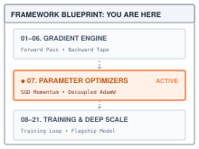
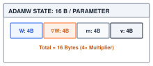
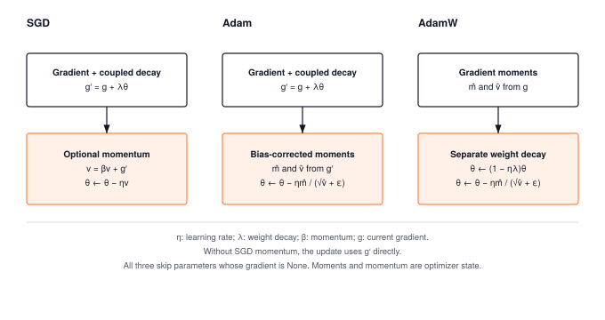
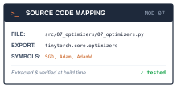

# Optimizers: Momentum, AdamW, and Decoupled Weight Decay {#sec-optimizers}

::: {.column-margin}
{width="100%" fig-alt="TinyTorch execution datapath blueprint highlighting Module 07 Optimizers as the active subsystem."}

*Framework Blueprint: Module 07 translates raw backward gradients into parameter trajectory updates through momentum and adaptive moments.*
:::


Gradient descent is the engine that drives neural learning, but raw gradients alone are often insufficient to train deep models effectively. High-dimensional loss landscapes are characterized by ill-conditioned ravines, saddle points, and extreme curvature variations where gradients are steep in some directions and nearly flat in others. Plain gradient descent oscillates uncontrollably across canyon walls while making glacial progress along the valley floor toward the optimum.

From a systems and framework perspective, an optimizer is an in-place stateful memory manager. While automatic differentiation (@sec-autograd) computes raw gradient vectors, the optimizer must translate those derivatives into stable parameter trajectories:
1. **State buffer allocation**: Track persistent auxiliary moment buffers for each parameter. Momentum stores velocity vectors ($m_t$), while adaptive algorithms like Adam and AdamW maintain running estimates of both first and uncentered second moments ($v_t$), doubling or tripling the runtime memory footprint of model parameters.
2. **Decoupled weight decay (AdamW)**: Separate $L_2$ regularization weight shrinkage from adaptive gradient moment scaling, preventing weights with large historical gradients from evading regularization.
3. **In-place memory mutation**: Apply trajectory updates directly to parameter memory buffers without allocating new tensors or breaking existing references.

This chapter builds TinyTorch's optimization suite—SGD with momentum, Adam, and AdamW—providing the parameter update engine that drives the unified training loop in @sec-training.

---

## The Problem

Take the smallest loss that has the shape of a real one. Two weights, $x$ and $y$, and

$$L(x, y) = \tfrac{1}{2}\left(100\,x^2 + y^2\right).$$

The minimum is at the origin. The loss is a bowl, but a stretched one, a hundred times steeper in $x$ than in $y$. Its gradient is $(100x,\; y)$, so at the same distance from the bottom the $x$ component is a hundred times larger than the $y$ component.

The simplest update subtracts a fixed fraction $\eta$ of the gradient from each weight. Run that on the ravine with $\eta = 0.03$ in @lst-optimizers-ravine.

::: {#lst-optimizers-ravine lst-cap="**Ravine divergence**: A shared learning rate destabilizes the steep coordinate."}
```python
def grad(x, y):
    """Gradient of L(x, y) = 0.5 * (100 x^2 + y^2)."""
    return 100.0 * x, y

x, y, lr = 1.0, 1.0, 0.03
for step in range(6):
    gx, gy = grad(x, y)
    x, y = x - lr * gx, y - lr * gy
    print(f"step {step + 1}: x = {x:9.3f}   y = {y:.4f}")
```
:::

The $y$ coordinate behaves. It shrinks by three percent a step, from $1.0$ to $0.833$ after six steps. The $x$ coordinate explodes: $-2$, $4$, $-8$, $16$, $-32$, $64$. Each step multiplies $x$ by $1 - 0.03 \times 100 = -2$, so it flips sign and doubles. Any $\eta$ above $0.02$ makes the magnitude grow, because $|1 - 100\eta|$ exceeds one. At exactly $0.02$, $x$ alternates between $1$ and $-1$ without approaching zero.

Lower the learning rate to $\eta = 0.019$ and $x$ is tamed. It still flips sign every step, but each flip shrinks it by ten percent, and after fifty steps it is $0.005$. Now $y$ is the problem. It shrinks by $1.9$ percent per step, so after 100 steps it is still $0.147$ and after 250 steps it is $0.008$. One knob serves two masters. The steep direction sets a ceiling on $\eta$, and the flat direction wants a floor a hundred times higher.

The two-coordinate example isolates a problem that also arises in networks: one shared learning rate must serve directions with different curvature, meaning different rates of change of the gradient. The optimizers below use gradient history to respond to that mismatch. None guarantees convergence for an arbitrary loss or learning rate.

---

## The Idea

### Gradient descent, and why it is called stochastic

Write the parameters as one long vector $\theta$ and the gradient of the loss with respect to them as $g$. Plain gradient descent is

$$\theta \leftarrow \theta - \eta\, g,$$

where $\eta$ is the **learning rate**, the fraction of the gradient applied per step. In training, $g$ is computed on one mini-batch rather than the whole dataset, so it is a noisy estimate of the true gradient. That noise is why the method is called **stochastic gradient descent** (SGD). The noise is a second reason, besides the ravine, to average gradients over several steps instead of trusting each one alone.

### Momentum: let consistent gradients add up

Suppose two successive gradients are both $2$, the learning rate is $0.1$, and the retained fraction of the previous update is $0.9$. Starting with velocity zero, the first velocity is $2$ and the second is $0.9\times2+2=3.8$. The weight moves by $0.2$, then $0.38$. If the second gradient were $-2$, the second velocity would instead be $-0.2$, giving a much smaller reversal. **Momentum** implements this memory with a velocity $v$:

$$v \leftarrow \beta\, v + g, \qquad \theta \leftarrow \theta - \eta\, v.$$

The coefficient $\beta$, usually $0.9$, is the fraction of the previous velocity that survives into the next step. Unrolling the recurrence shows what $v$ holds after $t$ steps:

$$v_t = g_t + \beta\, g_{t-1} + \beta^2 g_{t-2} + \cdots$$

For a constant gradient $g$, the terms reinforce and $v$ approaches $g/(1-\beta)$, ten times $g$ at $\beta=0.9$. For an alternating gradient of fixed magnitude, they partly cancel and the velocity's eventual magnitude is $|g|/(1+\beta)$. Those two idealized sequences explain how momentum can reinforce a consistent direction and soften reversals. In a real optimization run the gradient changes with the weights, so the factors are not universal speedups or guarantees against oscillation.

### Adam: a step size for every parameter

Consider a two-element gradient $[100,1]$. Plain SGD at learning rate $0.1$ would move the coordinates by $[10,0.1]$. Adam's first bias-corrected estimates are $\hat m=[100,1]$ and $\hat v=[10000,1]$, so division by $\sqrt{\hat v}$ gives $[1,1]$. Ignoring the small numerical-stability term, both coordinates move by $0.1$. Adam obtains these scales from two running averages, one of the gradient and one of its square:

$$m \leftarrow \beta_1 m + (1 - \beta_1)\, g, \qquad v \leftarrow \beta_2 v + (1 - \beta_2)\, g^2.$$

The first, $m$, tracks the direction. The second, $v$, tracks the scale. Both are averages, so $\beta_1$ and $\beta_2$ are the fractions of history retained, with defaults $0.9$ and $0.999$. The squaring in $v$ is elementwise, so each parameter gets its own scale.

Both averages start at zero, which biases them low at first. At the very first step, $m = 0.1\, g$, a tenth of the true gradient. Adam corrects this by dividing by $1 - \beta^t$, where $t$ counts updates of this parameter from one:

$$\hat{m} = \frac{m}{1 - \beta_1^t}, \qquad \hat{v} = \frac{v}{1 - \beta_2^t}.$$

At $t = 1$ the denominator for $m$ is $1 - 0.9 = 0.1$, which restores the full gradient. As $t$ grows the denominators approach one and the correction fades. The update is then

$$\theta \leftarrow \theta - \eta\, \frac{\hat{m}}{\sqrt{\hat{v}} + \epsilon},$$

with $\epsilon$ a tiny constant, $10^{-8}$ by default, that prevents division by zero when the squared-gradient estimate is zero. A missing gradient, `None`, skips the update altogether; a present array of zeros still runs the update.

The thing to see in that formula is the ratio. For a parameter whose gradient is steady, $\hat{m} \approx g$ and $\sqrt{\hat{v}} \approx |g|$, so the ratio is about $\pm 1$ and the parameter moves by about $\eta$ per step regardless of how large its gradient is. On the ravine, this normalization makes the first movements of $x$ and $y$ nearly equal despite their different gradient magnitudes. Later movements depend on the histories stored in both averages. The price is two extra numbers per parameter, $m$ and $v$, kept alive between steps.

::: {.column-margin}
{width="100%" fig-alt="AdamW 16-byte parameter memory breakdown showing 4 bytes each for weights, gradients, first moments, and second moments."}

*AdamW quadruples parameter memory footprint: 16 bytes per scalar weight in FP32.*
:::

{#fig-ravine-optimization fig-alt="Contour plot of an elongated loss ravine comparing three optimization trajectories: SGD zig-zagging between steep walls, Momentum accelerating along the ravine axis, and AdamW taking an efficient direct path to the center."}

### Weight decay and adaptive scaling

With weight $1.0$, learning rate $0.1$, and decay coefficient $0.01$, a shrinkage step gives $0.999$. **Weight decay** uses this small movement toward zero to discourage large weights. Its rule is

$$\theta \leftarrow (1 - \eta\lambda)\, \theta,$$

so a weight stays large only if the gradient keeps pushing it there. The coefficient $\lambda$ defaults to $0.01$ in TinyTorch's AdamW. For plain gradient descent this shrink is identical to adding $\lambda\theta$ to the gradient, because $\eta(g + \lambda\theta) = \eta g + \eta\lambda\theta$. The added term is the gradient of $\tfrac{\lambda}{2}\|\theta\|^2$, so this form is called an **L2 penalty**, and it is the form TinyTorch's SGD uses. The equivalence to an independent shrinkage step holds for plain SGD; with momentum, the L2 term also enters the velocity buffer.

Under Adam they are not the same. Adding $\lambda\theta$ to the gradient changes both running averages, then the result passes through the adaptive division. The amount of shrinkage can no longer be read as $\eta\lambda\theta$ independently of gradient history. AdamW keeps the L2 term out of $m$ and $v$ and applies the shrink to the old weight before subtracting the adaptive update:

$$\theta \leftarrow (1 - \eta\lambda)\, \theta - \eta\, \frac{\hat{m}}{\sqrt{\hat{v}} + \epsilon}.$$

For the weight above, an adaptive update of $0.1$ therefore gives $0.999-0.1=0.899$. Reversing the operations would give $(1-0.1)\times0.999=0.8991$, a different algorithm. The update paths in @fig-optimizers-landscape make the placement of decay explicit.

::: {#fig-optimizers-landscape fig-env="figure" fig-pos="htb" fig-cap="**Where decay enters the update**: SGD and Adam add decay to the gradient before updating their history. AdamW forms moments from the unmodified gradient, shrinks the old weight, and then subtracts the adaptive update." fig-alt="Three columns show SGD, Adam, and AdamW update flows. SGD adds decay before optional momentum. Adam adds decay before moment estimation. AdamW estimates moments from the gradient and separately shrinks the weight before its adaptive update."}

:::

---

## The Code

::: {.column-margin}
{width="100%" fig-alt="Source code mapping card for Module 07 Optimizers showing file path, exported package, and tested primitives."}

*Source Code Mapping: Module 07 extracts SGD with momentum, Adam moment trackers, and AdamW decoupled weight decay directly from the working repository.*
:::

### The base class, and why `zero_grad()` sets `None`

An optimizer separates the update rule from the loop that obtains gradients. The loop clears old gradients with `zero_grad()`, computes the next loss, calls `backward()`, and then calls `step()`. It can change optimizer classes without changing this sequence. The base class owns a list of parameter references and supplies gradient clearing; each subclass supplies the update rule.

::: {#chk-optimizer-zero-grad-subtle-bug .callout-check title="Sanity Check: The silent accumulation trap of missing zero_grad()"}
Because `backward()` accumulates gradients via `+=`, omitting `optimizer.zero_grad()` before backward causes gradients to sum continuously across consecutive mini-batches. Step 1 computes $\nabla L_1$; step 2 updates with $\nabla L_1 + \nabla L_2$; step $k$ updates with $\sum_{i=1}^k \nabla L_i$. The model diverges exponentially without raising any runtime errors.
:::

Clearing must remove the previous objective's gradient without removing the optimizer's history. The `backward()` traversal from @sec-autograd accumulates into `.grad`, so a second batch otherwise adds to the previous batch's gradient. Assigning `None` releases the parameter's reference to its gradient array instead of filling it with zeros. TinyTorch's backward traversal allocates a zero buffer when it first reaches the parameter, then adds the incoming contribution. The avoided work is the explicit clearing pass; the next backward pass still initializes storage.

The constructor copies the supplied parameter list, retains the original tensors, and rejects duplicates so the same tensor cannot be updated twice in one step. It enables gradient recording on these tensors without clearing any gradients already present. `zero_grad()` clears the gradients. `step()` is left for each subclass to define.



Parameters must require gradients before the forward pass that will be differentiated. Constructing an optimizer enables that flag; explicitly setting `requires_grad=True` earlier works too. `Optimizer.__init__` stores references to the original parameter tensors and sets their `requires_grad` flags. `Function.apply` reads those flags while each operation executes; setting them after the loss has already been computed cannot reconstruct missing records. The optimizer does not discover parameters by traversing the graph, either. A weight omitted from `parameters()` will not be updated, even if a separate path computed its gradient. @Lst-optimizers-recording isolates the recording requirement with one weight.

::: {#lst-optimizers-recording lst-pos="H" lst-cap="**Enable recording before forward**: Constructing an optimizer cannot recover an earlier unrecorded graph."}
```python
from tinytorch.core.tensor import Tensor
from tinytorch.core.optimizers import SGD
import tinytorch.core.autograd

w = Tensor([1.0])
old_loss = (w * w).sum()             # no input requests recording yet
opt = SGD([w], lr=0.1)              # marks this same w as trainable
old_loss.backward()
print(w.grad)                       # None: the old forward recorded no graph

opt.zero_grad()
loss = (w * w).sum()                # recompute after enabling recording
loss.backward()
print(w.grad)                       # [2.]
opt.step()
print(w.data)                       # [0.8]
```
:::

The final assignment inside `step()` changes the array on `w`, while the model and optimizer still refer to the same `Tensor` object. Constructing a new parameter tensor and leaving the optimizer's list unchanged would break that connection. Parameter identity, gradient lifetime, and optimizer state together determine whether the next forward pass observes the update.

The optimizer keeps a global `step_count` for calls to `step()`, while Adam and AdamW keep `update_counts` beside their moment buffers. Each parameter ages only when it has a gradient and its moments are updated. A parameter skipped with `grad=None` therefore uses the right bias correction when it next participates. These counters survive gradient clearing along with the moments. One helper is attached to the base class from its own cell. The backward traversal leaves gradients as arrays, while manually assigned gradients may be tensors, so the helper accepts either representation.



A zero gradient and a missing gradient have different meanings. All three optimizers skip `None`. A zero array still permits stored momentum to move the weight, and AdamW still applies decay. Clearing gradients preserves the buffers and their ages; it does not reset the optimizer.

### SGD with momentum

SGD's loop adds one array to the state we already know. For a parameter tensor of shape $(2,3)$, its gradient and optional momentum buffer also have shape $(2,3)$. The scalar learning rate and momentum coefficient apply elementwise across those arrays. The list index associates each parameter with its own history.

The constructor checks the learning rate, momentum coefficient, and decay coefficient before enabling gradients on the parameters. Invalid negative or nonfinite values raise an error before any parameter is changed. The buffer list starts with `None` entries; a tensor receives a velocity array only when it first has a gradient.



The order inside the loop is the order of The Idea. Weight decay folds into the gradient first (the coupled L2 form), momentum accumulates second, and the parameter moves last. The momentum buffers are allocated on the first step rather than in the constructor, so a parameter that never receives a gradient needs no velocity array. Once allocated, a buffer persists across steps, which is the whole point. It is state that outlives a batch, and the three elided helpers exist so that the training engine's checkpoints can save and restore it. A parameter with `grad=None` is skipped. This describes an unused parameter only if the caller cleared stale gradients before the batch. Whole-array NumPy expressions perform the arithmetic and may allocate intermediate arrays. The final assignment replaces `param.data`, preserving the Tensor object that the model owns.

Run SGD on the ravine from $(1,1)$ with $\eta=0.019$ and `momentum=0.9`, supplying $(100x,y)$ as a float32 gradient on each step. After 100 steps, $(x,y)\approx(0.005154,0.005234)$; plain SGD at the same rate gives $(0.000027,0.146859)$. Momentum has reduced the slowly changing $y$ coordinate much further, although its $x$ coordinate is farther from zero at that particular step. For this quadratic, eliminating velocity gives $x_{t+1}=(1+\beta-100\eta)x_t-\beta x_{t-1}$. Its stability condition is $0<100\eta<2(1+\beta)$, so with $\beta=0.9$ the upper boundary is $0.038$. At that boundary the coefficient is $-1.9$, and substituting $x_t=(-1)^t$ satisfies the recurrence. An alternating component can therefore persist without decay; this is not a convergent run.

### AdamW

AdamW replaces SGD's one velocity buffer with a pair of arrays per parameter tensor. A $(2,3)$ weight therefore has $(2,3)$ first- and second-moment arrays, but only one integer update count: all entries of that tensor receive a gradient together. The elementwise arithmetic supplies a different scale for each scalar weight without requiring a separate learning-rate setting for each one.

On the same ravine, start AdamW at $(1,1)$ with $\eta=0.1$ and `weight_decay=0.0` to isolate adaptive scaling. After 100 steps, both coordinates are approximately $0.002937$. This is a reproducible result for this loss and these settings, not evidence that AdamW permits an arbitrary learning rate. The gradient history and the numerical-stability term still affect the trajectory.

With nonzero decay, `step()` must keep the two paths separate. It extracts the gradient, calls `_update_moments`, shrinks the old parameter, and subtracts the adaptive update. The constructor creates empty buffer slots and zero update counts; the helper fills the slots lazily and advances their ages only for tensors that participate.







The call chain preserves three useful invariants. The per-parameter update count advances before bias correction, which divides by $1 - \beta^t$ and would divide by zero at $t = 0$. The gradient handed to `_update_moments` is the raw gradient, with no weight decay mixed in, so $m$ and $v$ never see the L2 term. The decay is a separate multiply on `param.data` before the adaptive step, exactly the decoupled formula. The bias-corrected values are computed fresh each step and discarded; only the raw `m_buffers` and `v_buffers` are stored, along with their update counts.

### The original Adam, for contrast

TinyTorch's `Adam` uses the same moment equations, but it adds $\lambda\theta$ before calling the helper. To isolate the role of the denominator, first hold the normalization fixed in @lst-optimizers-decay-scaling.

::: {#lst-optimizers-decay-scaling lst-pos="H" lst-cap="**Fixed-normalization comparison**: This arithmetic illustration holds the denominator fixed."}
```python
import math

theta, lr, wd = 10.0, 0.001, 0.01
m_hat, v_hat = 1.0, 100.0          # a weight whose gradients have been large

# Adam with L2: the decay term rides inside the normalized step
decay_adam = lr * (wd * theta) / math.sqrt(v_hat)
# AdamW: the decay term is applied to the weight directly
decay_adamw = lr * wd * theta

print(f"shrinkage from decay, Adam+L2: {decay_adam:.6f}")
print(f"shrinkage from decay, AdamW:   {decay_adamw:.6f}")
```
:::

Holding the normalization fixed in this arithmetic example gives a decay contribution of $0.00001$ through the normalized path and $0.0001$ through direct shrinkage. This is an illustration of the scaling, not a simulation of an Adam step. In the actual coupled update the decay term also changes both running moments, so its cumulative effect cannot be isolated by this division alone. Here is Module 07's `Adam.step`, the method that does it. It folds the decay into the gradient before the moments, and it has no separate shrink step.



With `weight_decay=0.0` the two optimizers are identical, and their `_update_moments` methods are the same code. With nonzero decay, `Adam` feeds $\lambda\theta$ into both moment updates, whereas `AdamW` keeps the moment estimates independent of decay. Module 07 keeps `Adam` and `AdamW` as two separate classes with the moment code repeated rather than a subclass pair, so that a student building either one sees the whole rule in one place.

---

## A Worked Trace

Take a single weight, $\theta_0 = 1.0$, that receives the same gradient $g = 0.5$ on two consecutive steps. Use $\beta_1 = 0.9$, $\beta_2 = 0.999$, $\eta = 0.1$, $\lambda = 0.01$, and $\epsilon = 10^{-8}$. Every number below can be checked by hand.

At the first step, $m_1=0.1\times0.5=0.05$ and $v_1=0.001\times0.5^2=0.00025$. At the second, $m_2=0.9\times0.05+0.05=0.095$ and $v_2=0.999\times0.00025+0.00025=0.00049975$. Dividing by $1-\beta_1^t$ and $1-\beta_2^t$ gives $\hat m=0.5$ and $\hat v=0.25$ on both steps. The adaptive subtraction is approximately $0.1$; the small $\epsilon$ prevents it from being exactly $0.1$ in real arithmetic. @Tbl-adamw-trace follows the state in execution order.

| Update $t$ | Stored $m_t$ | Stored $v_t$ | Old weight | After decay | After update |
| :---: | :---: | :---: | :---: | :---: | :---: |
| 1 | $0.05000$ | $0.00025000$ | $1.000000$ | $0.999000$ | $0.899000$ |
| 2 | $0.09500$ | $0.00049975$ | $0.899000$ | $0.898101$ | $0.798101$ |

: **Two AdamW updates**: Decay multiplies the old weight by $0.999$ before the adaptive subtraction. Displayed values are rounded. {#tbl-adamw-trace tbl-colwidths="[10,16,20,18,18,18]"}

@Lst-optimizers-adamw-run executes the same updates through Module 07's `AdamW`, with the gradient set by hand to stand in for `backward()`. The one-element weight, gradient, and moment arrays all have shape `(1,)`.

::: {#lst-optimizers-adamw-run lst-pos="H" lst-cap="**Execute the AdamW trace**: The printed weight includes decay before the adaptive subtraction."}
```python
from tinytorch.core.tensor import Tensor
from tinytorch.core.optimizers import AdamW

w = Tensor([1.0])
opt = AdamW([w], lr=0.1, betas=(0.9, 0.999),
            eps=1e-8, weight_decay=0.01)
for t in (1, 2):
    w.grad = Tensor([0.5])              # manually wrapped; backward() stores an array
    opt.step()
    m, v = opt.m_buffers[0][0], opt.v_buffers[0][0]
    print(f"t={t}: m={m:.5f} v={v:.8f} theta={w.data[0]:.4f}")
    opt.zero_grad()
```
:::

In @lst-optimizers-adamw-run, line 4 initializes weight `w = Tensor([1.0])`, and lines 5--6 configure `AdamW` with learning rate $\eta = 0.1$, $\beta = (0.9, 0.999)$, and weight decay $\lambda = 0.01$. The loop in lines 7--12 executes two consecutive update cycles. In line 8, a synthetic gradient `w.grad = Tensor([0.5])` is assigned. Line 9 executes `opt.step()`, which updates the first and second moment estimates, applies weight decay ($0.999\theta$), and adjusts the parameter. Line 10 extracts the internal moment values `m` and `v`, and line 11 prints the state (`t=1: m=0.05000 v=0.00025000 theta=0.8990` and `t=2: m=0.09500 v=0.00049975 theta=0.7981`). Finally, line 12 calls `opt.zero_grad()` to wipe `w.grad` before the next iteration.

After either call, the weight has changed, the two raw moment arrays and their age remain available for the next call, and the assigned gradient is still present until `zero_grad()` clears it in line 12. The normalized update and the decayed intermediate weight are temporary values. The model continues to hold the same `Tensor`; its next forward pass reads the new array.

A checkpoint must preserve the age together with the moments. Suppose another parameter is unused for the first three calls and receives its first gradient on call four. Its global optimizer count is four, but its moment age is one, so it divides by $1-\beta$, not $1-\beta^4$. `get_momentum_state()` copies only the buffers; it is not a complete checkpoint. The Trainer introduced in @sec-training will also save `update_counts`, `step_count`, and hyperparameters. Restoring those fields together makes the next update match an uninterrupted run. The buffer restore helpers check all shapes before replacing any state, preventing a mismatched array from broadcasting into a different parameter shape.

---

## From TinyTorch to Production

A pair of moments and an update count is enough to recognize the same algorithm in a production framework. PyTorch's [AdamW documentation](https://docs.pytorch.org/docs/stable/generated/torch.optim.AdamW.html) describes decoupled decay and the same default learning rate, moment coefficients, and epsilon as TinyTorch. Its [SGD documentation](https://docs.pytorch.org/docs/stable/generated/torch.optim.SGD.html) uses the same velocity recurrence when dampening and Nesterov momentum are disabled. PyTorch's [Adam](https://docs.pytorch.org/docs/stable/generated/torch.optim.Adam.html) defaults to coupled decay but also exposes a decoupled option; the class name alone is therefore insufficient to identify a production configuration's rule.

Gradient clearing carries the same semantic distinction. PyTorch's [`zero_grad()`](https://docs.pytorch.org/docs/stable/generated/torch.optim.Optimizer.zero_grad.html), with `set_to_none=True`, leaves unused parameters with no gradient, allowing their updates to be skipped. A zero gradient tensor still enters the optimizer's update path. TinyTorch makes that distinction visible in the first `if` of each loop.

Memory provides a reason to change execution while retaining the equations. Count one float32 weight, its gradient, and two float32 moments: $4+4+4+4=16$ bytes per scalar weight. The moments alone account for 8 bytes. This is an array-storage model for a point in training when all gradients and moments exist, not a universal training-memory requirement. Activations, temporary expressions, counters, and Python objects add storage; clearing gradients removes one of the counted arrays until backward recreates it.

::: {#nbk-optimizers-adamw-16byte-law .callout-notebook title="Napkin Math: The 16-byte optimizer memory law"}

**Problem**: For a 7-billion parameter language model ($N = 7 \times 10^9$) trained with AdamW in FP32, what is the static memory required for model parameters, gradients, and optimizer state?

**Per-parameter memory ledger**:
$$\begin{aligned}
\text{Weights } (\theta) &: 1 \times 4\text{ bytes} = 4\text{ bytes} \\
\text{Gradients } (g) &: 1 \times 4\text{ bytes} = 4\text{ bytes} \\
\text{First moment } (m) &: 1 \times 4\text{ bytes} = 4\text{ bytes} \\
\text{Second moment } (v) &: 1 \times 4\text{ bytes} = 4\text{ bytes} \\
\hline
\textbf{Total static footprint} &: \mathbf{16\text{ bytes per parameter}}
\end{aligned}$$

**Total model footprint**:
$$\text{Memory} = 7 \times 10^9 \times 16\text{ bytes} = 112\text{ GB}$$

**Systems insight**: Weights and gradients require $28\text{ GB} + 28\text{ GB} = 56\text{ GB}$, but AdamW's momentum buffers double that requirement to $112\text{ GB}$. A single 80 GB NVIDIA A100 cannot even hold the static training state of a 7B model without optimizer offloading or ZeRO state sharding.

:::

NumPy evaluates the update as several array expressions, with temporary arrays between operations. Production implementations can combine work across tensors or fuse several operations into one device program, reducing intermediate storage and launch overhead. PyTorch exposes `foreach` and `fused` implementations in its [AdamW interface](https://docs.pytorch.org/docs/stable/generated/torch.optim.AdamW.html). Their performance depends on the workload and device; neither changes the intended update equation. @Sec-acceleration will examine how execution choices affect repeated array operations.

::: {#psp-fused-adamw-kernel .callout-perspective title="Production Bridge: Fused AdamW GPU kernels and multi-tensor launches"}
In standard PyTorch, an unfused optimizer executes up to 10 discrete CUDA kernels per parameter (scaling, decay, momentum updates, square root, division). For a 70-layer model with hundreds of weight matrices, launching thousands of small kernels saturates the CPU-GPU command queue.

Production systems use `torch.optim.AdamW(..., fused=True)`, which compiles the entire weight update into a single fused GPU kernel per parameter group. This reduces DRAM memory round-trips by $4\times$ and eliminates kernel launch latency entirely.
:::

The mapping in @tbl-optimizers-production separates the mathematical state from the implementation that holds it.

| Contract | TinyTorch | PyTorch |
| :--- | :--- | :--- |
| Moment state | `m_buffers`, `v_buffers` | `exp_avg`, `exp_avg_sq` |
| Moment age | per-tensor `update_counts` | per-tensor `step` |
| Array storage | NumPy arrays in host memory | tensors on CPU or an accelerator |
| Missing gradient | skip the parameter | skip the parameter |
| Learning rate | one mutable `lr` attribute | settings for parameter groups |

: **Optimizer correspondence**: The same state and missing-gradient contract appear behind different storage and execution choices. {#tbl-optimizers-production tbl-colwidths="[25,38,37]"}

When comparing configurations, record where decay enters the rule and which arrays the memory estimate includes. In AdamW, the shrink factor is $1-\eta\lambda$, so changing the learning rate also changes the shrinkage applied per update. That consequence follows directly from the multiplication in `step()`.

---

## Summary

An optimizer reads each parameter's gradient and changes the array held by that same Tensor. SGD may retain a velocity; Adam and AdamW retain two moments and an update count for each parameter tensor. Adam couples decay to those moments, while AdamW shrinks the old weight separately before the adaptive subtraction. `grad=None` skips the entire parameter update, whereas `zero_grad()` clears gradients without clearing history. These are the contracts the training loop can rely on. @Sec-training will arrange forward computation, gradient clearing, backward, and stepping, then preserve the optimizer's history when a run is saved and resumed.

---

## Exercises

1. **Ravine race.** Start three independent two-element Tensors at $(1,1)$. Use SGD at $\eta=0.019$, SGD with momentum $0.9$ at the same rate, and AdamW at $\eta=0.1$ with `weight_decay=0.0`. Supply $(100x,y)$ as a new float32 gradient on each step. Reproduce the 100-step values in the chapter, then record loss throughout the runs. Explain why a smaller final value in one coordinate does not establish that an optimizer is better at every step. Test momentum at $\eta=0.038$ and just above it, distinguishing a nondecaying oscillation from growing magnitude.

2. **Missing vs. zero gradient.** Give AdamW two separate scalar parameter tensors starting at $1.0$, and step once with gradient $0.5$ on both. On the next call, set one gradient to `None` and the other to a zero array. Predict the weights, moment arrays, and update counts that can change, then check your prediction. Repeat with `weight_decay=0.0` to isolate motion caused by moment history.

3. **Checkpoint continuation.** Run AdamW for three updates, save copies of the weight, moment buffers, counts, and hyperparameters, and compute a fourth update. Restore those fields into a fresh optimizer and reproduce the fourth result. Then repeat while restoring only the buffers and global `step_count`. Explain the discrepancy using the per-parameter bias-correction denominator.

4. **Decay through the moments.** Starting from weight $1.0$, use `betas=(0.0,0.0)`, `lr=0.1`, `eps=1e-8`, and `weight_decay=0.01`. Predict one update with gradient $0.5$ under Adam and AdamW. Check the stored second moments as well as the new weights. Explain why adding decay before `_update_moments` changes more than the final subtraction.
