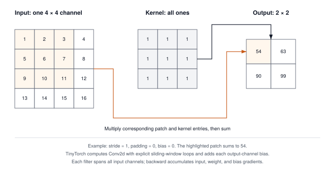

# Convolutions: Sliding Windows and the im2col Trick {#sec-convolutions}

Milestone I ended with a multi-layer perceptron reading handwritten digits. To feed each $8 \times 8$ image to the first `Linear` layer, we flattened it into a vector of 64 numbers and never told the network which pixels sat next to which. The dense layer can learn from these inputs, but its parameter count grows with the number of pixels, and its weights do not encode their neighborhoods.

A call to `Conv2d` must preserve those neighborhoods while still fitting the layer, autograd, and optimizer contracts from the previous chapters. We follow that call through Module 09’s shape calculation, padding, and sliding-window loops, then follow a gradient back to the image and shared weights. Pooling reduces the resulting feature maps, and batch normalization introduces state that changes between training and evaluation. Once these mechanisms are explicit, a separate NumPy model shows how im2col rearranges convolution into a matrix multiply. That model explains an optimization; the module itself executes the direct loops.

{#fig-conv-topology}

---

## The Problem

Take a modest color photo, $224 \times 224$ pixels with three color channels. Flattened, that is $224 \times 224 \times 3 = 150{,}528$ input numbers. A `Linear` layer from those inputs to 1,024 hidden units needs a weight for every (input, output) pair, so its weight matrix has $150{,}528 \times 1{,}024 \approx 154$ million entries. In float32 that is about 617 MB for the first layer alone, before a single deeper layer or a single gradient buffer. Napkin math, but the conclusion holds at any reasonable image size. A dense first layer on raw pixels is enormous.

Size is the smaller of the two problems. The larger one is that a `Linear` layer has no idea the input was ever a picture. Every input index is just a column of $W$. If you shuffled the pixels of every training image with the same fixed permutation, the layer would learn exactly as well, because nothing in $XW^T + b$ knows that pixel $(3, 4)$ is next to pixel $(3, 5)$. The layer has to discover neighborhoods from data, and it has to discover them separately at every location. A vertical edge in the top-left corner and the same edge shifted ten pixels right touch disjoint sets of weights, so the network learns the detector twice, or as many times as there are places an edge can appear.

We want a layer that spends its weights on *what* a pattern looks like, not on *where* it is.

---

## The Idea

### A filter that slides

A **convolution** replaces the giant weight matrix with a small grid of weights, called a **filter** (or kernel), typically $3 \times 3$ or $5 \times 5$. The filter is placed over the top-left corner of the image, the overlapping pixels are multiplied by the matching filter weights, the products are summed, and the sum becomes one output pixel. Then the filter slides one step to the right and the same weights produce the next output pixel, and so on across and down the image.

With input $X$ of height $H$ and width $W$, a $K \times K$ filter $w$, and a scalar bias $b$, the output at row $h$ and column $c$ is

$$Y[h, c] = b + \sum_{i=0}^{K-1} \sum_{j=0}^{K-1} X[h + i,\; c + j] \cdot w[i, j].$$

Each output pixel sees only a $K \times K$ neighborhood of the input, its **receptive field**, and every output pixel is computed with the same $K^2 + 1$ numbers. That sharing is the whole point. At stride 1, shifting the input shifts the output correspondingly wherever the compared windows do not encounter a changed boundary. Finite-image padding and larger strides limit this correspondence. This property is called **translation equivariance**, and it means a filter that learns to detect a vertical edge detects it everywhere at no extra cost in parameters.

### Channels, padding, stride

Real images have several channels (red, green, blue), and a useful layer produces several output planes, called **feature maps**, one per filter. TinyTorch, like PyTorch, stores an image batch as a 4D tensor with shape $[N, C, H, W]$, meaning $N$ images, each with $C$ channels of $H \times W$ pixels. A filter then spans all input channels, so a layer with $C_{\text{in}}$ input channels and $C_{\text{out}}$ filters holds a weight tensor of shape $[C_{\text{out}}, C_{\text{in}}, K, K]$ plus one bias per filter. Output pixel $(h, c)$ of filter $o$ sums over the input channels too:

$$Y[n, o, h, c] = b[o] + \sum_{\text{ch}=0}^{C_{\text{in}}-1} \sum_{i=0}^{K-1} \sum_{j=0}^{K-1} X[n, \text{ch}, h S + i,\; c S + j] \cdot W[o, \text{ch}, i, j].$$

The channel formula indexes the padded input when padding is enabled. Two choices determine which windows it visits. **Padding** $P$ adds a border of $P$ zero pixels around each input plane, so that the filter can be centered on edge pixels and the output does not shrink. **Stride** $S$ is how far the filter jumps between output pixels; a stride of 2 visits every other position and halves the output width. The number of filter positions that fit along one axis, and therefore the output size, is

$$H_{\text{out}} = \left\lfloor \frac{H + 2P - K}{S} \right\rfloor + 1,$$

and the same for width. The formula is worth memorizing, because it is the source of most shape errors in convolutional networks. For a $3 \times 3$ filter, padding 1 and stride 1 keep the size ($32 \to 32$), padding 0 shrinks it by two ($32 \to 30$), and stride 2 roughly halves it ($32 \to 15$).

Count the parameters. A $3 \times 3$ layer taking 3 channels to 64 filters holds $64 \times 3 \times 3 \times 3 + 64 = 1{,}792$ numbers, and it works on a $224 \times 224$ photo or a $2000 \times 2000$ one without changing. The dense layer from The Problem needed 154 million and was tied to one image size.

### Max pooling

**Max pooling** is the second layer we build, and it shrinks the planes a convolution produces. A $2 \times 2$ window with stride 2 slides over each channel independently and keeps only the largest value in each window, halving both height and width. It has no weights. It also makes the network a little tolerant to small shifts, since moving a strong activation one pixel within its window does not change the pooled output. The output-size formula is the same one as for convolution.

### The im2col trick

Look again at the single-output formula. Each output pixel is a dot product between two lists of $C_{\text{in}} K^2$ numbers, the flattened patch under the filter and the flattened filter. That means the entire layer is a matrix multiply in disguise. Write every patch the filter visits as one row of a matrix, with $N \cdot H_{\text{out}} \cdot W_{\text{out}}$ rows of length $C_{\text{in}} K^2$, and write every filter as one column of a second matrix, with $C_{\text{in}} K^2$ rows and $C_{\text{out}}$ columns. Their product has one row per output position and one column per filter, and reshaping it gives the $[N, C_{\text{out}}, H_{\text{out}}, W_{\text{out}}]$ output. Building the patch matrix is called **im2col** ("image to column"), and the four steps are

1. unroll every $K \times K \times C_{\text{in}}$ patch into a row of $X_{\text{col}}$, shape $[N H_{\text{out}} W_{\text{out}},\; C_{\text{in}} K^2]$;
2. flatten every filter into a column of $W_{\text{col}}$, shape $[C_{\text{in}} K^2,\; C_{\text{out}}]$;
3. compute $Y_{\text{col}} = X_{\text{col}} W_{\text{col}}$, shape $[N H_{\text{out}} W_{\text{out}},\; C_{\text{out}}]$;
4. add the bias and reshape to $[N, C_{\text{out}}, H_{\text{out}}, W_{\text{out}}]$.

That is the whole trick. What it buys, and what it costs, is measured where the code is.

### The backward pass

Convolution is linear in the input and linear in the weights, so its gradients are sliding-window sums as well. Call the incoming gradient $G = \partial \mathcal{L} / \partial Y$, with the same shape as the output. Since $Y$ is a sum of terms $X[\ldots] \cdot W[\ldots]$, each output pixel contributes its gradient value times the input pixel it multiplied to the weight's gradient, and its gradient value times the weight to the input pixel's gradient:

$$\frac{\partial \mathcal{L}}{\partial W[o, \text{ch}, i, j]} = \sum_{n, h, c} G[n, o, h, c] \cdot X[n, \text{ch}, hS + i, cS + j], \qquad \frac{\partial \mathcal{L}}{\partial b[o]} = \sum_{n, h, c} G[n, o, h, c].$$

The input gradient is the mirror image, scattering $G[n, o, h, c] \cdot W[o, \text{ch}, i, j]$ back onto input pixel $(hS + i, cS + j)$. The window loops accumulate input and weight gradients; a separate reduction sums the bias gradient. Max pooling has no weights, and its gradient goes entirely to the one input pixel that won each window; the others receive zero.

---

## The Code

::: {.callout-note title="Source Code Mapping"}
The listings in this section are extracted from Module 09 (`src/09_convolutions/09_convolutions.py`) by name when the book is built, so a renamed method in the module fails the build instead of drifting from the chapter. Module 09 computes `Conv2d` and `MaxPool2d` with explicit loops and gets their gradients from `Conv2dFunction.backward` and `MaxPool2dFunction.backward`; it does not implement im2col, so that section's listing is a model, marked as such, and the worked trace checks it against the module.
:::

Consider `conv = Conv2d(1, 2, 3, stride=2, padding=1)` applied to an input of shape `(1, 1, 4, 4)`. Calling `conv(x)` enters `Conv2d.__call__`, then `forward`. The layer validates the four axes and computes the spatial output size before calling `Conv2dFunction.apply(x, weight, bias, layer=self)`. The two filters have shape `(2, 1, 3, 3)`, and the result will have shape `(1, 2, 2, 2)`. The batch axis survives; the output-channel axis counts filters; the final two axes count valid window positions.

`apply` is the boundary established in Chapter 6. It gives `Conv2dFunction.forward` NumPy arrays for the arithmetic while retaining the input tensors as the parents of the output. The operation calls the layer’s shape, padding, and convolution helpers through `self.layer`. Each helper can therefore be tested independently, yet the complete call produces a tensor whose gradient record still points to the image, weights, and bias. Calling a helper directly and wrapping its array in a new `Tensor` would preserve the output values but omit that record.

### Output size and padding

Before any filter slides, two things have to be settled. How big will the output be, and what happens at the border?

The size question comes first because every layer allocates its output before it computes a single value, and the layer after it needs that shape to allocate its own. Get it wrong by one and the network fails three layers later with an error that names the wrong layer. `_compute_output_shape` is the formula from The Idea, and it is the only place in this chapter the formula is written in code.



The border question is what padding is for. A $3 \times 3$ filter with no padding shrinks the image by two pixels per layer, so a $32 \times 32$ input is $12 \times 12$ after ten layers, and the pixels near the edge get less attention than the ones in the middle (a corner pixel is covered by exactly one filter position, a center pixel by nine). A border of zeros fixes both. The naive way to handle a border is a bounds check inside the innermost loop, an `if` on every one of the roughly 87 million multiplies a $224 \times 224$ color photo needs from a single 64-filter layer. The better way is to build the padded image once, before the loops, and then let every loop run as if there were no edge at all.



Only the two spatial axes get padded; batch and channel are untouched. Pad once, then treat the padded image as if there were no padding, which is why the loops below never check a bound. PyTorch takes `padding=1` as an argument to `nn.Conv2d` the same way, and the GPU routines in the bridge treat the border as index arithmetic rather than a copy.

### The direct convolution

Why build the slow version at all? Because it is the formula and nothing else, and everything faster in this chapter is checked against it. The im2col model below, the gradient routine, and PyTorch's `nn.Conv2d` in the bridge all have to reproduce its numbers, so this is the reference. It is also where you can see what the arithmetic costs. The 87 million multiply-adds for one photo through one modest layer come out of these loops, four to pick the output pixel and three to form its dot product. On my machine the loops manage about 6.6 million multiplies a second, which puts that one layer at about thirteen seconds per image. Nobody trains at that rate. The point of writing it out is to see exactly where the time goes, so the im2col section can move it.



For the example above, `_apply_padding` makes a `(1, 1, 6, 6)` array. At output position `(oh=1, ow=0)`, the window starts at padded position `(2, 0)`, because each output index is multiplied by stride 2. Kernel position `(k_h=1, k_w=2)` then reads padded position `(3, 2)`, which is original image position `(2, 1)` after subtracting the one-pixel border. The outer `out_ch` loop changes the filter used with that same window. Every visit adds a product into `conv_sum`; only after the window is complete does the helper write one output value.

The operation that Chapter 6 records is a thin wrapper around the helpers. Its `forward` receives the arrays, asks the layer for the output shape, pads, convolves, and adds the bias to each output channel.



The `self.layer` it reaches for is a parameter of the operation, passed as `layer=self` when the layer calls `apply`, which is how a `Function` that works on bare arrays can borrow the stride, padding, and helpers that live on the layer.

### Pooling

With padding, a convolution hands the next layer a plane the same size as the one it received, and that gets expensive to keep doing. Run the numbers for the first layer of a photo network. The $224 \times 224$ color input holds 150,528 numbers. After `Conv2d(3, 64, 3, padding=1)` there are $64 \times 224 \times 224 = 3{,}211{,}264$ of them, 12.8 MB in float32 for a single image, and a second $3 \times 3$ layer with 64 input channels does about 1.85 billion multiplies per image, 21 times what the first layer did, because its dot products are 576 long instead of 27. Left at full resolution, every later layer pays that. There is a second problem. A $3 \times 3$ filter widens what one output pixel can see by only two pixels per layer, so at full resolution it takes over a hundred layers before any output has seen the whole 224-wide picture.

The cheap fix is to shrink the planes between convolutions. Max pooling slides a $2 \times 2$ window with stride 2 over each channel and keeps the largest value in each window. That quarters the numbers, costs no weights, and doubles the field of view of every layer after it, because each pooled pixel now stands for four. In code it replaces the dot product with a running `max` and runs per channel, so it has no channel loop inside the window.



`MaxPool2d(2)` defaults its stride to the kernel size, so the windows tile the plane without overlap, and its operation object, `MaxPool2dFunction`, wraps this helper the same way `Conv2dFunction` wrapped the convolution.

The module retains the input through `Function.apply`; its backward method scans each window again to recover the winning position. The strict `val > max_val` comparison chooses the first maximum in row-major order when values tie. `+=` matters when windows overlap, since the same input position can win more than once. Padding uses negative infinity rather than zero, so the border cannot defeat a negative activation. `AvgPool2d` uses the same window geometry but divides each incoming gradient among all kernel positions; it discards the part assigned to padding when it crops the input gradient.

### im2col

::: {.callout-warning title="Model, not module code"}
Module 09 stops at the loops. The two functions in this section are the chapter's own NumPy model of the trick GPU libraries use, and the worked trace checks that they reproduce the module's numbers.
:::

Now the fast version. The seven loops in `_convolve_loops` spend almost nothing on arithmetic. Each innermost iteration does one multiply and one add, wrapped in two array indexings, a loop-counter update, and Python bytecode dispatch for every one of those. The hardware never sees a run of arithmetic long enough to feed its vector units, and the memory system never sees a predictable stream of addresses. That is the old complaint about nested loops, and it is why no framework runs a convolution this way.

Look at the direct routine again. The three innermost loops form a dot product between two lists of $C_{\text{in}} K^2$ numbers, the flattened patch under the filter and the flattened filter, and every output pixel is one of those dot products. So the question is whether we can stop paying the loop overhead per multiply and pay it once per matrix instead. Copy each patch the filter visits into the row of a matrix, flatten each filter into a column, and let one `matmul` do every dot product at once. Chapter 1 already gave us `matmul`, and it is the one routine every numerical library has spent decades making fast.

I timed the trade on a $32 \times 32$ color image with sixteen $3 \times 3$ filters and padding 1, 442,368 multiplies. Module 09's loops took 67 ms. The im2col version below took 0.5 ms, and 0.4 of those were spent building the patch matrix. The copying is now the cost, and that is the price of the trick. Neighboring patches overlap, so every input pixel is copied into up to $K^2$ rows of the patch matrix; for a $3 \times 3$ filter the matrix is about nine times the input, 27,648 numbers here against 3,072. The bridge at the end of the chapter is about what production libraries do with that bill.

`im2col` walks the same output positions as the loops, but instead of multiplying it copies the patch into a row. The order inside a row (channel, then filter row, then filter column) is the order `ravel` produces and the order `reshape` gives the flattened filters, so the dot products pair the right numbers.

```python
import numpy as np

def im2col(x, K, stride=1, padding=0):
    """Return (patches, H_out, W_out). patches has one row per output position."""
    x = np.pad(x, ((0, 0), (0, 0), (padding, padding), (padding, padding)))
    N, C, H, W = x.shape
    H_out = (H - K) // stride + 1
    W_out = (W - K) // stride + 1
    patches = np.empty((N * H_out * W_out, C * K * K), dtype=x.dtype)
    r = 0
    for n in range(N):
        for oh in range(H_out):
            for ow in range(W_out):
                patches[r] = x[n, :, oh * stride:oh * stride + K, ow * stride:ow * stride + K].ravel()
                r += 1
    return patches, H_out, W_out

def conv2d_im2col(x, weight, bias, stride=1, padding=0):
    """x: (N, C_in, H, W); weight: (C_out, C_in, K, K); bias: (C_out,)."""
    N, C_out, K = x.shape[0], weight.shape[0], weight.shape[2]
    patches, H_out, W_out = im2col(x, K, stride, padding)
    product = patches @ weight.reshape(C_out, -1).T + bias   # (N*H_out*W_out, C_out)
    return product.reshape(N, H_out, W_out, C_out).transpose(0, 3, 1, 2)
```

The multiplies all happen inside the `@`. Everything around it is copying and reshaping. `patches` holds $N H_{\text{out}} W_{\text{out}} C_{\text{in}} K^2$ numbers where the input held $N C_{\text{in}} H W$, which is the nine-times bill from the timing above. The last line uses NumPy views to arrange the output axes: the product comes out with the output channel as its last axis, and a `reshape` plus a `transpose` present it as $[N, C_{\text{out}}, H_{\text{out}}, W_{\text{out}}]$ without moving a number. PyTorch exposes the same patch matrix as `torch.nn.functional.unfold`.

### The gradients

Chapter 8's training loop calls `backward()` every step, and Chapter 6's tape can only route a gradient through an operation that knows its own derivative, so `Conv2dFunction` needs one. The cheap way to get it would be a disaster. Nudging each of the 1,792 weights in `Conv2d(3, 64, 3)` and rerunning the forward pass, the finite-difference idea Chapter 6 set aside, costs 1,792 forward passes per gradient, and each of them is the thirteen-second layer from above, hours for one image. The Idea already did the calculus instead. A convolution is linear in both the input and the weights, so its gradients are the same sliding-window sums with the accumulation targets swapped, with input and weight gradients accumulated in the window loops and bias gradients summed separately. The operation returns one gradient per tensor input it consumed: the image, the weights, and, when there is one, the bias.



Where the forward pass read `input_val * weight_val` and wrote to `output`, the backward pass reads `grad_val` and writes to two places. Notice the bias gradient. Because the bias vector of shape `[C_out]` was broadcast across the batch dimension $N$ and both spatial dimensions $(H_{\text{out}}, W_{\text{out}})$ during the forward pass, backward automatic differentiation is mathematically bound by the multivariable chain rule to sum upstream gradients over all three broadcast axes, which is the one line `grad_output[:, out_ch, :, :].sum()`. It is the exact same forward-backward broadcast contract from Chapters 1 and 6, reappearing inside 2D spatial convolution. Notice also the last few lines, which strip the padding border off the input gradient, because the zeros we added have no owner to receive a gradient. Chapter 6's `backward()` reaches this method through the record that `apply` made, without the caller knowing, and PyTorch's `convolution_backward` returns the same three gradients.

### The layer

Finally the layer object, because the routines above are helpers and operations and the rest of TinyTorch works with layers. The optimizer from Chapter 7 asks each layer for `parameters()`, and `Sequential` from Chapter 3 calls `forward`, so `Conv2d` needs the same two methods `Linear` has. The one decision hiding in the constructor is the initial scale of the weights, and the wrong choice here produces a wrong number, not a slow one. The rule from Chapter 3 is a normal distribution with standard deviation $\sqrt{2 / \text{fan\_in}}$, Kaiming's gain of 2 for the ReLU that follows, and the trap is what fan-in means for a filter. It is not the number of pixels in the image. Each output pixel sums $C_{\text{in}} K^2$ products, 27 for the first layer of a color network, so that is the fan-in. Use the image size instead, 150,528 for a $224 \times 224$ photo, and the weights come out about 75 times too small; the activations then shrink by that factor at every layer until nothing useful reaches the loss.







`Conv2d(3, 64, 3)` has exactly the 1,792 numbers counted earlier, and `parameters()` hands them to an optimizer the same way `Linear` did. `forward` validates the input, computes the output shape, and then does nothing itself; it hands the tensors and itself to `Conv2dFunction.apply`, which is the moment Chapter 6 records the operation so that a later `backward()` can find the gradient method above. The fan-in counts the same local connections used by the forward loop, so changing image size does not change the initialization scale.

### Batch normalization and layer state

A convolution can produce channels with different activation scales. `BatchNorm2d` adjusts each channel using statistics over the batch and both spatial axes, so its input and output have the same shape. For a tensor `(N, C, H, W)`, `_get_stats` reduces axes `(0, 2, 3)` and leaves one mean and variance per channel. `BatchNorm2dFunction.forward` reshapes those arrays to `(1, C, 1, 1)`, normalizes each activation, and applies the learned scale `gamma` and shift `beta`. This is the broadcasting contract from Chapter 1 applied to image planes.

There are two kinds of persistent state on the layer. `gamma` and `beta` are tensors returned by `parameters()`, so the optimizer updates them from gradients. `running_mean` and `running_var` are NumPy arrays updated by `_get_stats` during each training forward call. With the default momentum 0.1, the new running value combines 0.9 of the old value and 0.1 of the current batch statistic. These arrays do not belong in the optimizer’s parameter list. A training forward changes them even if no backward or optimizer step follows.

Calling `bn.eval()` changes which statistics the next forward uses. It reads the running arrays and leaves them unchanged; `bn.train()` restores batch statistics and running updates. Evaluation mode does not disable autograd. The operation receives the mode as an argument to `apply` and still has a backward rule, but that rule treats the running statistics as constants. A model containing BatchNorm must propagate its mode changes to these layers before validation, or validation data will change the statistics and each prediction will depend on the other examples in its batch.

The backward calculation explains why the mode is part of the operation record. In training, changing one activation changes its channel’s mean and variance, which changes every normalized activation in that channel. `BatchNorm2dFunction.backward` therefore combines the direct gradient with two reductions, `sum_grad` and `sum_grad_norm`, that account for those dependencies. In evaluation only the direct scale by `gamma * inv_std` remains. Both modes sum over `(0, 2, 3)` for `grad_beta` and sum `grad_output * normalized` over those axes for `grad_gamma`. The saved `normalized_data` and `inv_std` let backward use the quantities from this particular forward call.

These spatial layers connect to the existing training loop through their tensor outputs and parameter lists. A classifier can pass `conv(x)` through normalization, activation, and pooling, then call `pooled.reshape(batch_size, -1)` before a `Linear` layer. Using `Tensor(pooled.data.reshape(...))` instead would detach the features; the classifier could still receive gradients while the convolution stopped learning. After a complete forward, the loss traverses the recorded operations backward, and the optimizer updates the parameters returned by the convolution, normalization, and classifier layers.

---

## A Worked Trace

One image, one channel, $3 \times 3$ pixels, one $2 \times 2$ filter with bias $1$, no padding, stride 1:

$$X = \begin{bmatrix} 1 & 2 & 0 \\ 0 & 1 & 3 \\ 2 & 1 & 0 \end{bmatrix}, \qquad w = \begin{bmatrix} 1 & 0 \\ -1 & 1 \end{bmatrix}, \qquad b = 1.$$

The output is $\lfloor (3 - 2)/1 \rfloor + 1 = 2$ pixels on each side. The filter visits four positions, and each row of the trace in @tbl-im2col-trace is also one row of the im2col matrix.

| Output $(h, c)$ | Input slice | Patch as a row | Dot product plus bias | $Y[h, c]$ |
| :--- | :---: | :--- | :--- | :---: |
| $(0, 0)$ | $[0{:}2,\, 0{:}2]$ | $[1, 2, 0, 1]$ | $1(1) + 2(0) + 0(-1) + 1(1) + 1$ | $3$ |
| $(0, 1)$ | $[0{:}2,\, 1{:}3]$ | $[2, 0, 1, 3]$ | $2(1) + 0(0) + 1(-1) + 3(1) + 1$ | $5$ |
| $(1, 0)$ | $[1{:}3,\, 0{:}2]$ | $[0, 1, 2, 1]$ | $0(1) + 1(0) + 2(-1) + 1(1) + 1$ | $0$ |
| $(1, 1)$ | $[1{:}3,\, 1{:}3]$ | $[1, 3, 1, 0]$ | $1(1) + 3(0) + 1(-1) + 0(1) + 1$ | $1$ |

: Each output pixel as a dot product between the flattened patch and the flattened filter $[1, 0, -1, 1]$. The four patch rows stacked are exactly $X_{\text{col}}$. {#tbl-im2col-trace tbl-colwidths="[16,16,22,34,12]"}

So $Y = \begin{bmatrix} 3 & 5 \\ 0 & 1 \end{bmatrix}$, and a $2 \times 2$ max pool over it keeps the single value $5$.

The backward pass is just as checkable. Send back a gradient of 1 at every output pixel. Weight $w[0, 0]$ multiplied the top-left pixel of each of the four patches, so its gradient is $1 + 2 + 0 + 1 = 4$. Weight $w[0, 1]$ saw the top-right pixel of each patch, $2 + 0 + 1 + 3 = 6$. The bias gradient is the sum of the four incoming ones. For the input, the center pixel $X[1, 1]$ was touched by all four filter positions, once under each weight, so its gradient is $1 + 0 + (-1) + 1 = 1$; the corner $X[2, 0]$ was touched only by $w[1, 0]$ and gets $-1$. The script runs the module's layer, checks the im2col model against it, and lets Chapter 6's `backward()` reach the gradient method through the tape.

```python
import numpy as np
from tinytorch.core.tensor import Tensor
from tinytorch.core.spatial import Conv2d, MaxPool2d
import tinytorch.core.autograd

X = Tensor(np.array([[[[1.0, 2.0, 0.0],
                       [0.0, 1.0, 3.0],
                       [2.0, 1.0, 0.0]]]]), requires_grad=True)   # (N=1, C_in=1, H=3, W=3)
conv = Conv2d(1, 1, 2)
conv.weight.data[:] = [[[[1.0, 0.0], [-1.0, 1.0]]]]              # (C_out=1, C_in=1, K=2, K=2)
conv.bias.data[:] = [1.0]

Y = conv(X)
print(Y.data[0, 0].tolist())                                     # [[3.0, 5.0], [0.0, 1.0]]
print(conv2d_im2col(X.data, conv.weight.data, conv.bias.data)[0, 0].tolist())   # same
print(MaxPool2d(2)(Y).data[0, 0].tolist())                       # [[5.0]]

Y.backward(Tensor(np.ones_like(Y.data)))
print(conv.weight.grad[0, 0].tolist())   # [[4.0, 6.0], [4.0, 5.0]]
print(conv.bias.grad.tolist())           # [4.0]
print(X.grad[0, 0].tolist())             # [[1.0, 1.0, 0.0], [0.0, 1.0, 1.0], [-1.0, 0.0, 1.0]]
```

The preceding backward call differentiated the sum of the four convolution outputs. Pooling defines a different scalar objective. For `MaxPool2d(2)(conv(X)).sum()`, only the top-right convolution output, value 5, wins. Its incoming gradient is 1 and the other three receive zero, so the weight gradient is exactly that winning patch, `[[2, 0], [1, 3]]`, and the bias gradient is 1.

```python
# Build a fresh graph after the preceding backward released its records.
X.grad = None
for parameter in conv.parameters():
    parameter.grad = None
pooled = MaxPool2d(2)(conv(X))
pooled.sum().backward()
assert np.allclose(conv.weight.grad[0, 0], [[2, 0], [1, 3]])
assert np.allclose(conv.bias.grad, [1])
assert np.allclose(X.grad[0, 0], [[0, 1, 0], [0, -1, 1], [0, 0, 0]])
```

Clearing parameter gradients prevents the two objectives from accumulating into the same buffers. Recomputing `conv(X)` is separately necessary because the earlier `Y.backward(...)` released its operation records. This distinction is the graph-lifetime rule from Chapter 6 in a complete spatial chain. The array-only im2col model can check forward values, but it does not create a TinyTorch graph and cannot replace this training path.

---

## From TinyTorch to Production

On a GPU, `torch.nn.Conv2d` hands the work to cuDNN, NVIDIA's library of convolution routines, and cuDNN does not commit to one algorithm. It keeps several and picks per layer shape, because each one is the right answer under different pressure. The pressures are the two we have already met, the number of multiplies and the memory the patch matrix costs, plus one we have not met. GPUs contain hardware built specifically for matrix multiplies (Tensor Cores), so any formulation that ends in one big matrix multiply (a GEMM, in library jargon) gets to use the fastest unit on the chip.

| Algorithm | Where it wins | What it does |
| :--- | :--- | :--- |
| Explicit im2col + GEMM | Odd shapes, small inputs | Exactly the chapter's `conv2d_im2col` model: build the patch matrix, then one matrix multiply. |
| Implicit GEMM | Most layers on modern GPUs | Same matrix multiply, but each thread computes which input pixel it needs on the fly; the patch matrix is never stored. |
| Winograd | $3 \times 3$ filters, stride 1 | Trades multiplies for additions through a fixed change of basis, about 2.25 times fewer multiplies. |
| FFT | Large filters ($7 \times 7$ and up) | Converts convolution to elementwise multiplication in the frequency domain. |

: The convolution algorithms cuDNN chooses among. `torch.backends.cudnn.benchmark = True` makes it time each candidate on your actual shapes and keep the fastest. {#tbl-cudnn-conv-algorithms tbl-colwidths="[24,26,50]"}

Winograd reduces the multiplication count for small filters by changing the basis in which the computation runs.[^fn-winograd-conv-algos] FFT methods also transform the computation, but their transform cost needs a sufficiently large filter to pay off.[^fn-fft-conv-algos]

[^fn-winograd-conv-algos]: **Winograd convolution**: a 1980 minimal-filtering result, applied to CNNs by Lavin and Gray in 2016, that computes a $2 \times 2$ block of outputs from a $3 \times 3$ filter with 16 multiplies instead of 36. The saving is real only when multiplies dominate, which is why it is chosen for small stride-1 filters and not for the rest.

[^fn-fft-conv-algos]: **FFT convolution**: uses the fast Fourier transform to turn a sliding-window sum into a pointwise product, so cost grows with the image size rather than with the image size times the filter size. Transforming the image costs enough that it only pays off for large filters.

The memory pressure decides more than the arithmetic. Recall that im2col copies every input pixel up to $K^2$ times. A mid-network feature map of 32 images, 64 channels, $112 \times 112$ pixels, occupies about 103 MB in float32; its $3 \times 3$ patch matrix would be nine times that, about 925 MB, allocated and freed for one layer of one forward pass. Napkin math, but it explains why implicit GEMM exists. Instead of writing the patch matrix to memory and reading it back, each GPU thread runs the index expression `oh * stride + i` at the moment it needs the value, which is exactly the arithmetic our `im2col` loop does before assigning a patch row. The multiply still happens in the Tensor Core; only the copy is gone.

What carries over from TinyTorch unchanged is everything the practitioner has to reason about. The output-size formula, the weight shape $[C_{\text{out}}, C_{\text{in}}, K, K]$, the parameter count, and the gradient formulas are the same in PyTorch, and `nn.Conv2d(1, 1, 2)` loaded with our filter returns our $[[3, 5], [0, 1]]$. The FLOP count is easiest to read off the im2col view, $2 \cdot N H_{\text{out}} W_{\text{out}} \cdot C_{\text{out}} \cdot C_{\text{in}} K^2$ (one multiply and one add per matrix entry), and it lets you predict which layers of a network dominate its cost before you run it. Max pooling still routes each gradient to one winning pixel.

```python
# If PyTorch is installed, the trace numbers reproduce exactly.
import torch, torch.nn as nn

conv = nn.Conv2d(in_channels=1, out_channels=1, kernel_size=2)
with torch.no_grad():
    conv.weight.copy_(torch.tensor([[[[1.0, 0.0], [-1.0, 1.0]]]]))
    conv.bias.copy_(torch.tensor([1.0]))

x = torch.tensor([[[[1.0, 2.0, 0.0], [0.0, 1.0, 3.0], [2.0, 1.0, 0.0]]]])
print(conv(x).squeeze())          # tensor([[3., 5.], [0., 1.]])
```

Two things change in how you should read your own code. First, memory layout matters. Module 09's arrays and PyTorch's default both store an image as $[N, C, H, W]$, but the GPU routines are fastest when the channel index moves fastest in memory, the $[N, H, W, C]$ order that PyTorch calls `channels_last`, because then the $C_{\text{in}} K^2$ numbers of one patch sit closer together and one memory fetch serves more of the dot product. Second, the first convolution of a network usually has few input channels, so its dot products are short and the layer spends more time fetching pixels than multiplying them; deeper layers with hundreds of channels are the reverse. Chapter 14 gives that intuition a number, the arithmetic intensity, and shows how to measure which regime a layer is in. Until then, expect the algorithm cuDNN picks, and the time a layer takes, to change with $C_{\text{in}}$ and image size in ways a parameter count does not predict.

---

## Summary

Module 09 builds the direct convolution, which slides a small filter across an image and computes one dot product per output pixel with seven loops, and the chapter's im2col model shows the other shape, which copies each visited patch into the row of a matrix and computes every output pixel with one matrix multiply. Both give identical numbers, and the second is the shape that GPU libraries use, with implicit GEMM removing the copy that makes im2col expensive. The principle to keep is that a convolution is a dot product repeated at every position with shared weights, which is why its parameter count depends on the filter and not on the image, why shifting the input shifts the output, and why its gradient is another sliding-window sum. Max pooling shrinks the planes and sends each gradient to the pixel that won. Batch normalization preserves their shape while separating learned scale and shift from running statistics; its mode determines both the statistics used and the input derivative. All three layers compose through the same recorded-operation contract, so a correct value is only half the check: the gradient must reach the earlier parameters too. Chapter 10 takes for granted that a network consumes a tensor of numbers and asks how raw text becomes such a tensor in the first place.

---

## Exercises

1. **Same-size output.** For a $K \times K$ filter with stride 1, show from the output-size formula that padding $P = (K - 1)/2$ keeps $H_{\text{out}} = H$ whenever $K$ is odd. Then run `Conv2d(1, 1, 3, padding=1)` on a $5 \times 5$ input and confirm the output shape, and explain why the same trick, with equal padding on both sides, cannot give an exact match for an even $K$.

2. **Check the gradient.** Write a loss that sums every output of a `Conv2d`, use a centered finite difference with a step of $10^{-3}$ for one weight, and compare the difference in the two losses divided by twice the step to the corresponding entry of the weight gradient that `backward()` leaves. Use a small input and explain why float32 rounding makes an arbitrarily tiny step unreliable. Repeat for one input pixel. Try it with `padding=1` and `stride=2` to confirm the border stripping and the stride arithmetic in the backward pass.

3. **Count before you run.** Take a $224 \times 224$ color image through `Conv2d(3, 64, 3, padding=1)`, a $2 \times 2$ max pool, `Conv2d(64, 128, 3, padding=1)`, another max pool, and `Conv2d(128, 256, 3, padding=1)`. For each convolution compute the parameter count, the FLOPs using the im2col view, and the size of its patch matrix in float32. Which layer holds the most parameters, and which would need the largest im2col buffer? They are not the same layer, and the FLOP counts of the second and third layers tell a third story.
