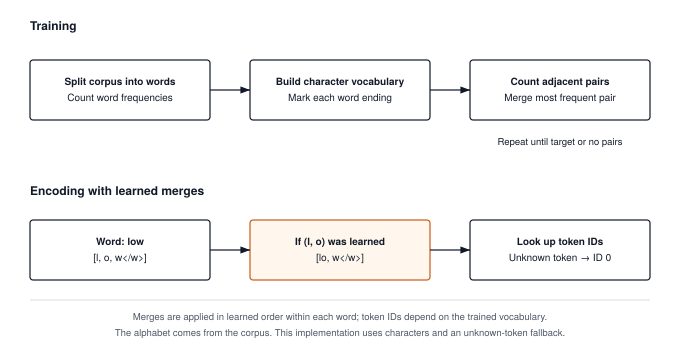

# Byte-Pair Encoding: Compressing Language into Subword Tokens {#sec-tokenization}

After Chapter 9, TinyTorch can take a grid of pixels, slide a kernel across it, and hand the result to the same `Linear` layers and training loop it already had. Every input so far has arrived as numbers. Text does not. A sentence is a string of characters, and a network can only multiply and add. The question this chapter answers is the one a practitioner asks the first time they call a language model. What integers does the model actually see when I type a sentence, and who decides where one integer ends and the next begins?

A tokenizer assigns those integers. Module 10 implements **Byte-Pair Encoding (BPE)**, which learns a vocabulary by repeatedly merging the most common adjacent pair of symbols. Its state is an ordered merge list and two dictionaries; no tensor or gradient is involved. We follow one word through that state, then hand its IDs to the embedding table in Chapter 11. The distinction between the character alphabet used here and a byte alphabet will determine which text the tokenizer can preserve.

{#fig-tokenization-spectrum}

---

## The Problem

There are two obvious ways to turn text into integers, and both fail, in opposite directions.

The first is to number the characters. Every observed character gets an ID, but unseen characters remain a problem. A byte tokenizer can instead reserve an ID for each of the 256 byte values and represent any UTF-8 input as bytes. The cost is length. An English word averages about five letters plus a space, so a 1,000-word essay becomes roughly 6,000 tokens. Every layer downstream does work proportional to the number of tokens, and the attention layers of Chapter 12 do work proportional to its square, so a sequence six times longer is not six times more expensive there but thirty-six times.

The second is to number the words. Split on spaces, give each distinct word an ID, and a 1,000-word essay is 1,000 tokens. Now the vocabulary is the problem. The listing below builds a word vocabulary from one sentence and then encodes three others. Any word the vocabulary has not seen maps to a reserved ID, conventionally written `<unk>` for "unknown".

```python
train_words = "the cat sat on the mat".split()
vocab = {word: i + 1 for i, word in enumerate(sorted(set(train_words)))}  # id 0 is <unk>

def encode_words(text):
    return [vocab.get(word, 0) for word in text.split()]

print(encode_words("the cat sat"))     # [5, 1, 4]
print(encode_words("the cats sat"))    # [5, 0, 4]   one extra letter and the word is gone
print(encode_words("The cat sat."))    # [0, 1, 0]   a capital and a period lose two words
```

One plural and the model reads nothing where "cats" was. A capital letter and a period erase two of three words. Real text is full of plurals, capitals, typos, names, code, and words coined last week, so a word vocabulary large enough to be safe runs to hundreds of thousands of entries and still leaks. Size has its own cost. Chapter 11 turns each token ID into a row of a lookup table with one entry per vocabulary word and $D$ numbers per row, so as napkin math, a vocabulary of one million words at $D = 4{,}096$ in 32-bit floats is $10^6 \times 4{,}096 \times 4$ bytes, about 16 GB, before the model has read a single word.

The two extremes trade one cost for the other. Characters give a tiny table and long sequences; words give short sequences and an enormous, leaky table. What we want is in between. Common words should be single tokens, so sequences stay short. Rare words should split into pieces the vocabulary does know, so nothing is ever unknown. The split itself should be learned from data rather than written by hand, because no one can list the useful pieces of every language.

---

## The Idea

BPE was invented by Philip Gage in 1994 as a file compressor, adapted to translation by Sennrich, Haddow, and Birch in 2016, and made byte-level by OpenAI for GPT-2 in 2019. The compression origin is the right way to think about it. A compressor looks for repeated patterns and gives them short codes. BPE looks for the most repeated adjacent pair of symbols and gives it a new symbol.

Start with an alphabet. Module 10 uses the characters that occur in the training words, with a marker glued onto each word's last character so that a letter ending a word is a different symbol from the same letter inside one; GPT-2 uses the 256 possible byte values instead, and the production section says why. Write the training text as a sequence of those symbols. Then repeat one step. Count how often every adjacent pair occurs, pick the pair with the highest count, invent a new symbol for it, and replace every occurrence of the pair with that symbol. In symbols, with $\text{count}(a, b)$ the number of times symbol $a$ is immediately followed by symbol $b$ anywhere in the corpus,

$$(a^*, b^*) = \arg\max_{(a, b)} \text{count}(a, b), \qquad \text{new symbol } c = a^* b^*.$$

Each step shrinks the corpus by about $\text{count}(a^*, b^*)$ symbols in exchange for one new vocabulary entry. The vocabulary ends up holding "es", "est", and so on up to whole common words, each earned by frequency, and the merges are recorded in the order they were made. That ordered list is the tokenizer. Training runs once, over a large corpus, and produces the list; each new vocabulary entry adds to the initial alphabet and reserved symbols. The requested `vocab_size` is a target for that total, not a count of merges; training may stop sooner when no pairs remain.

Encoding new text replays the list. Split the text into its base symbols and apply the merges in the order they were learned, each rule rewriting every place it matches, so that a pair learned earlier is always merged before one learned later. Because the merge list is fixed and the order is fixed, the same string always encodes to the same IDs, and a word the tokenizer never saw still encodes, because at worst it stays as single symbols. That is most of the guarantee that word vocabularies could not give. The remainder depends on the alphabet: with characters, a character the corpus never contained still has nowhere to go and becomes `<UNK>`; with bytes there is nothing left to be unknown.

Decoding is trivial by comparison. Each ID names a string of symbols, so concatenate them and turn each end-of-word marker back into a space. Two choices in this design, the alphabet and the learned order as the replay rule, are the ones the guarantees rest on, and I explain each beside the code that makes it.

---

## The Code

::: {.callout-note title="Source Code Mapping"}
The listings in this section are extracted from Module 10 (`src/10_tokenization/10_tokenization.py`) by name when the book is built, so a renamed method in the module fails the build instead of drifting from the chapter. Module 10 is character-level: its alphabet is the characters the corpus contains, it marks the end of each word with a `</w>` symbol, it splits text into words on whitespace before merging, and it keeps an `<UNK>` ID for characters it never saw. GPT-2's byte-level variant is the production section's subject, and the first exercise asks you to make the conversion.
:::

The tokenizer is a base class fixing the two-method interface, a character tokenizer that is The Problem's first extreme in code, and the BPE tokenizer, which is where the chapter lives. The BPE class holds a vocabulary in both directions (token to ID and ID to token) and the list of merges in the order they were learned. We call a merge's position in that list its **rank**; rank 0 is the first merge made.

### The contract, and the character baseline

Everything after this chapter works on integers. Chapter 11 turns each ID into a row of a lookup table, and the model's final layer produces one score per ID, so a tokenizer's job is a fixed two-way mapping between strings and IDs that must not change once the model starts training. The base class says only that much: `encode` and `decode`, each of which a subclass must supply.



The two class attributes are the module's two reserved symbols. `<UNK>` is the ID handed to anything the vocabulary cannot represent, and `</w>` is the end-of-word marker the BPE tokenizer glues onto a word's last character. The character tokenizer is the simplest thing that satisfies the contract, and it is worth twenty lines because it makes the trade in The Problem concrete: one ID per character, `<UNK>` at ID 0, and a `build_vocab` that sorts the characters it saw so that two runs on the same corpus agree.



`encode` is a dictionary lookup per character with `<UNK>` as the default, and `decode` is the reverse lookup joined into a string. A known character survives the round trip, while an unknown character becomes the literal `<UNK>`. No merging occurs, so encoding preserves the character count rather than shortening the sequence. The BPE tokenizer starts from the same alphabet and earns its shorter sequences by merging.

### Words and the end-of-word marker

Training has exactly one step, repeated, and before the first step the corpus has to be written as symbols. Module 10 works on words. Its `train` takes a list of text strings, splits each with `str.split()`, counts how often each word occurs, and turns each distinct word into a list of characters once; every pair count from then on is weighted by the word's frequency rather than recounted per occurrence, which is the same table Hugging Face's trainer keeps. Two consequences follow. No merge can ever cross a space, because no pair does. And the tokenizer needs a way to tell the `w` that ends `low` from the `w` in the middle of `lower`, because when `decode` glues tokens back together it has to know where to put the spaces. That is the marker's job.





`_get_word_tokens("low")` is `['l', 'o', 'w</w>']`. The last character carries the marker as part of the symbol, so `w</w>` and `w` are two different entries of the alphabet from the start, and every merge that reaches the end of a word produces a symbol that says so. The price shows up in the worked trace: `low</w>` is a whole-word token that `lowest` can never reuse, because inside `lowest` the `w` has no marker.

### Counting and merging pairs

Both halves of the step have a tempting shortcut that breaks. For counting, we could ask each candidate pair how often it occurs with a search over the corpus, but that is one full pass per candidate, and a corpus of a few hundred kilobytes has thousands of candidates. For merging, we could join each word back into a string and call `str.replace`. That is wrong, not slow. After the first merge the symbols are no longer single characters, and a string search cannot see where one symbol ends. Once `es` has been merged, `widest` is the five symbols `w i d es t</w>`; there is no `(s, t</w>)` pair in it, but the letters still read `widest`, and a `replace` on the joined string would happily glue the `s` inside `es` to the `t`. We count in a single pass over the word table with a `Counter`, weighting each pair by its word's frequency, and we merge by walking the list of symbols, where the boundaries are explicit.





Notice that `_merge_pair` walks left to right and skips two positions after a match. On the symbols `a a a` with the pair `(a, a)`, that yields `aa a`, not `a aa` and not an overlapping double match. The rule is arbitrary, but the same rule has to apply during training and encoding, or the two will disagree about how a word splits, and `_apply_merges` below uses the identical loop. The helper's name says "byte pairs" because BPE's name does; the symbols it counts here are characters. Hugging Face's `tokenizers` library runs the same two operations over the same kind of word table.

### Training

A framework trains its tokenizer once, before the model exists, and the number you pass as `vocab_size` is the decision that sizes the model afterward. Chapter 11's lookup table has one row of $D$ numbers per ID, and the output layer has one score per ID, so every entry we add here is a set of weights the model has to learn; at $D = 4{,}096$ in 32-bit floats that is 16 KB of table per entry, before the output layer. An entry that never fires on real text is that memory spent on nothing.



Each pass through the loop re-counts every pair over the word table, picks the winner, registers it under the next free ID, records the pair in the merge list, and rewrites the table. Three things to notice. The loop runs until the vocabulary is full or no pair is left; it does not stop when the best pair occurs only once, so on a small corpus the last merges each glue together two symbols that meet in a single word and nowhere else, one vocabulary entry bought to shorten a single occurrence, with little opportunity for reuse. Hugging Face's trainer exposes the stopping test as `min_frequency`, and the second exercise asks you to add it. When two pairs tie, `most_common` returns the one the `Counter` met first, which depends on corpus order; ties are common in small corpora and harmless, but they are why two BPE trainers given the same data can produce slightly different vocabularies. And the re-count is the whole cost, a full pass over the table per merge, which is the $N \times M$ scaling the production bridge has to fix.

### Encoding and decoding

Every prompt a user sends passes through `encode`, and every ID the model generates passes through `decode`, one at a time as the model produces them. These two methods are the ones that run on every request for the life of the model, and the encoder has one hard requirement. New text must split the way the training text split, because the model only knows the tokens it saw during training.

The tempting encoder is greedy: at each position, take the longest string that is in the vocabulary. It gives fewer tokens on average, and it is wrong, because it does not reproduce what the trainer saw. The merges were learned on words that already had the earlier merges applied; `st</w>` was learned from words containing `s` and `t</w>` as separate symbols after three earlier merges had run. A greedy encoder can grab a long vocabulary entry that the trainer would never have assembled at that position, and hand the model a token sequence it never saw in training. Replaying the merges in the order they were learned recreates the trainer's conditions exactly, so training text encodes exactly as it did during training, and the result is deterministic.





`_apply_merges` takes the rules in rank order and, for each one, walks the word with the same skip-two loop as `_merge_pair`. `encode` splits the text into words on whitespace, converts each to characters with the marker, replays the rules, and looks the symbols up, with `<UNK>` for any symbol the vocabulary lacks. Notice what each word costs. Every rule walks the whole word whether or not it applies, so encoding is one pass per merge per word; with the four merges of the worked trace that is nothing, and with GPT-2's 50,000 it is 50,000 passes over the ten-thousandth "the". On my machine a 5,500-character text encodes in under 2 ms against a 16-merge vocabulary, and the production section says what keeps the real thing fast at 50,000. Notice also the two ways a symbol can be unknown. A character the corpus never contained is one; a familiar character at the end of a word, where it carries the marker, is another, and the trace shows both.



`decode` is concatenation plus two cleanups: every `</w>` becomes a space, and `' '.join(text.split())` collapses the runs of spaces that adjacent markers produce and drops the trailing one. Unknown IDs decode to the literal `<UNK>`, which is not the text the user typed. Whitespace also changes even when every symbol is known. Encoding `"low  lower\n"` and `"low lower"` produces identical IDs because `str.split()` discards the separators. The round-trip contract here is therefore normalized words with known symbols, not arbitrary text. A byte alphabet addresses unknown symbols, but preserving whitespace also requires changing the split and decode rules.

---

## A Worked Trace

We train on the five-word corpus `low`, `low`, `lower`, `newest`, `widest`. The alphabet is every symbol those words contain once the markers are added, sorted, with `<UNK>` in front: twelve entries, IDs 0 through 11. Asking for a vocabulary of 16 leaves room for exactly four merges. The table follows the loop in `train`, one row per merge, with the word table rewritten after each; the counts are weighted by word frequency, so `low` counts twice.

| Merge | Most frequent pair | Count | New token | New ID | Word table after the merge |
| :--- | :--- | :--- | :--- | :--- | :--- |
| start | | | | 0..11 | `low: l o w</w>` `lower: l o w e r</w>` `newest: n e w e s t</w>` `widest: w i d e s t</w>` |
| rank 0 | `(l, o)` | 3 | `lo` | 12 | `low: lo w</w>` `lower: lo w e r</w>` `newest: n e w e s t</w>` `widest: w i d e s t</w>` |
| rank 1 | `(lo, w</w>)` | 2 | `low</w>` | 13 | `low: low</w>` `lower: lo w e r</w>` `newest: n e w e s t</w>` `widest: w i d e s t</w>` |
| rank 2 | `(w, e)` | 2 | `we` | 14 | `low: low</w>` `lower: lo we r</w>` `newest: n e we s t</w>` `widest: w i d e s t</w>` |
| rank 3 | `(s, t</w>)` | 2 | `st</w>` | 15 | `low: low</w>` `lower: lo we r</w>` `newest: n e we st</w>` `widest: w i d e st</w>` |

: BPE training on a five-word corpus, one merge per row. At ranks 1, 2, and 3 several pairs tied at two; `most_common` picked the one the `Counter` met first, which follows corpus order. {#tbl-bpe-merge-trace tbl-colwidths="[10,18,8,12,10,42]"}

After rank 3 the vocabulary is full and the loop stops. Had we asked for more, it would have kept going; every remaining pair occurs once, and the module merges those too.

Now encode the unseen word `lowest`. Its symbols are `l o w e s t</w>`. `_apply_merges` replays the four rules in rank order, and each row below shows the word after that rule has walked it.

1. Rule 0, `(l, o)`: `lo w e s t</w>`.
2. Rule 1, `(lo, w</w>)`: no match, because the `w` in `lowest` carries no marker; `lo w e s t</w>`.
3. Rule 2, `(w, e)`: `lo we s t</w>`.
4. Rule 3, `(s, t</w>)`: `lo we st</w>`.

Six characters became three IDs, `[12, 14, 15]`, and neither `lowest` nor `est` as a standalone word was in the training corpus. Notice what the marker did at rule 1. The whole-word token `low</w>` exists in the vocabulary, but `lowest` cannot use it, so the tokenizer splits the word as `lo we st</w>` rather than `low est`; removing the marker would change the candidate pairs, so a byte-level trainer would need its own trace before we could predict its split. The listing below runs the trace and then encodes a string with a non-ASCII letter to show the leak the module keeps.

```python
from tinytorch.core.tokenization import BPETokenizer

corpus = ["low", "low", "lower", "newest", "widest"]
tok = BPETokenizer(vocab_size=16)           # 12 base symbols + 4 merges
tok.train(corpus)

for rank, pair in enumerate(tok.merges):
    print(rank, pair, "->", pair[0] + pair[1], tok.token_to_id[pair[0] + pair[1]])

ids = tok.encode("lowest")
print(ids, [tok.id_to_token[i] for i in ids])   # [12, 14, 15] ['lo', 'we', 'st</w>']
assert tok.decode(ids) == "lowest"

ids = tok.encode("naïve widest")
print(ids, [tok.id_to_token[i] for i in ids])
# [5, 0, 0, 0, 0, 10, 3, 1, 2, 15]
# ['n', '<UNK>', '<UNK>', '<UNK>', '<UNK>', 'w', 'i', 'd', 'e', 'st</w>']
print(tok.decode(ids))                          # n<UNK><UNK><UNK><UNK>widest
```

The second string is instructive. `a`, `ï`, and `v` never appeared in the corpus, so they are unknown, and so is the final `e</w>`: the letter `e` is in the vocabulary, but `e` at the end of a word is the symbol `e</w>`, and no training word ended in `e`. Four of the five characters of `naïve` are gone before the model sees them, and `decode` cannot bring them back. `widest` splits as `w i d e st</w>` because `wid` never repeated in training but `st</w>` did. That is the whole case for the byte alphabet in the section that follows: same merges, same replay, and nothing the user typed can ever be unknown.

---

## From TinyTorch to Production

The tokenizer inside GPT-2 (`tiktoken`), Hugging Face's `tokenizers` library, and the tokenizer that ships with Llama all run the same two loops you just traced. The differences fall into three groups: one preprocessing step, several speed tricks, and a set of conventions around the vocabulary file.

The preprocessing step is the one that changes results. Module 10 cuts text into words with `str.split()` before it does anything, so a merge can never straddle a space, and it glues punctuation to the word it touches, so `is.` and `is,` are different words with different symbols at their ends. Production tokenizers cut with a regular expression[^fn-regex-pretokenize] that separates words, numbers, punctuation, and English contractions (`'s`, `'ll`, `'ve`), and then run BPE inside each chunk only. No merge can cross a chunk boundary. This is why GPT-style tokens usually begin with a space (" the" is one token, "the" without the leading space is a different one), why long numbers split into short digit groups, and why runs of spaces in code cost so many tokens. The leading space plays the role Module 10's `</w>` marker plays, telling the model where words begin instead of where they end.

The speed tricks do not change the output at all. Module 10 already counts each distinct word once and weights its pairs by how often the word occurs, the table a production trainer keeps, but it re-counts the whole table after every merge, so a table of $N$ symbols and $M$ merges costs about $N \times M$ operations, hopeless at the scale of GPT-2's training text and 50,000 merges; production trainers update the counts incrementally after a merge rather than re-scanning. Module 10's `encode` walks every word once per merge rule, so a 50,000-merge vocabulary would make 50,000 passes over every word of every prompt. Production encoders look up the rank of each adjacent pair instead and merge the lowest, which visits only the rules a word can use, keep a cache from word to token IDs so the ten-thousandth "the" costs a dictionary lookup, and are written in Rust or C++ so the loop that remains runs without Python overhead. The gap is several orders of magnitude, and it matters because tokenization runs in the data-loading workers of Chapter 5 and must keep ahead of the GPU.

The conventions are the part that bites in practice. A trained tokenizer is a vocabulary file plus an ordered merge list, and a model is only meaningful with the exact tokenizer it was trained with, because ID 13 means `low</w>` to one tokenizer and something unrelated to another. GPT-2 stores its 256 base bytes remapped onto printable characters so that the vocabulary file is readable text, which is why you will see tokens like `Ġthe` (the `Ġ` is a space) when you open one. Special tokens sit at the end of the vocabulary rather than the start, each model family reserves its own, and each family picks its own vocabulary size.

| | TinyTorch `BPETokenizer` | GPT-2 `tiktoken`, Hugging Face `tokenizers` |
| :--- | :--- | :--- |
| Base alphabet | Characters seen in training, plus `</w>` forms and `<UNK>` | 256 bytes, remapped to printable characters |
| Before merging | `str.split()` into words; `</w>` marks word ends | regex pre-split into words, numbers, punctuation |
| Training cost per merge | re-count the word table, weighted by frequency | update the same counts incrementally |
| Encoding | replay every merge rule over each word | look up pair ranks, merge the lowest, with a per-word cache |
| Implementation | About 150 lines of Python | Rust or C++ behind a Python wrapper |
| Vocabulary size | whatever you pass; `<UNK>` for unseen characters | 50,257 (GPT-2), 100,277 (GPT-4), 128,256 (Llama 3); no unknowns |

: What stays the same and what changes between the chapter's tokenizer and the ones in deployed models. {#tbl-bpe-production-comparison tbl-colwidths="[24,34,42]"}

What carries over unchanged is everything that matters for reasoning about a model. Tokens are byte strings chosen by frequency, not by meaning; the merge list is fixed after training and never updated by gradient descent; encoding is deterministic; decoding is concatenation. When a model behaves strangely on a rare word, a misspelling, or a string of digits, the first thing to check is how the tokenizer split it, and you now know exactly how to find out.

Two practical expectations follow. First, tokens are the unit that everything downstream is priced in. A model's context window[^fn-context-window-token-budget] is a token count, and so is an API bill. OpenAI's published rule of thumb for English is roughly four characters, or three quarters of a word, per token. Text in languages the training corpus underrepresented compresses far worse; a 2023 study by Petrov and colleagues, "Language Model Tokenizers Introduce Unfairness Between Languages," measured that some languages cost several times as many tokens as English for the same content, so the same context window holds less of them. Second, the tokenizer and the model travel together. Continuing to train a model with a different tokenizer, adding a special token without resizing the model's lookup table, or decoding one model's IDs with another's vocabulary are all silent failures that produce fluent garbage rather than an error.

[^fn-regex-pretokenize]: **Regular expression** (regex): a pattern language for matching text, built into Python as the `re` module. GPT-2's pre-tokenizer is one short regex that matches, in order, contractions, words with an optional leading space, numbers, punctuation runs, and whitespace, and every model in the GPT family since has shipped a variant of it.

[^fn-context-window-token-budget]: **Context window**: the maximum number of tokens a model can read and write in one pass, fixed by how it was trained and by memory. GPT-2's was 1,024 tokens; current models advertise 128,000 or more, and because the limit is in tokens rather than words, the same window holds fewer words of a language the tokenizer compresses poorly.

---

## Summary

Module 10 builds a character-level BPE tokenizer with a training loop that merges the most frequent adjacent pair, weighted by word frequency, until the vocabulary is full, and an encoder that replays those merges in learned order on each word of new text. Common words collapse into single IDs, rare ones split into pieces the vocabulary does know, and the end-of-word marker lets `decode` put the spaces back. Unseen characters and unseen word-final forms become `<UNK>`, and whitespace is normalized. Those limits belong to this implementation; a byte alphabet and whitespace-preserving preprocessing address different parts of them. The invariant to keep is that the alphabet, reserved symbols, preprocessing rules, ID mappings, and ordered merges form one tokenizer state. The same list, applied by the same earliest-first rule, gives the same IDs every time, and a model is only meaningful together with the list it was trained on. Production tokenizers replace the whitespace split with a regex, the character alphabet with bytes, and the per-rule replay with a rank lookup and a cache, but the merges themselves and the replay rule are what you traced by hand. Chapter 11 takes the integer token IDs for granted and asks how a bare index like 262 becomes a vector the network can do arithmetic on, and how the network is told which position in the sequence each token came from.

---

## Exercises

1. **Bytes instead of characters.** Replace the observed-character alphabet with all 256 byte values. Treat the end-of-word marker as a separate symbol so that every byte remains representable at every position, and reconstruct UTF-8 bytes before decoding. Retrain on the five-word corpus and verify a round trip for `naïve widest`. Then test `"naïve  widest\n"`. Explain why preserving that second input also requires replacing the whitespace split, even though every byte has an ID.

2. **Stopping and ties.** Add a `min_frequency` argument to `train` that stops merging when the best pair occurs fewer times than it, and count how many of the thirteen merges the five-word corpus can produce survive `min_frequency=2`. Then change the tie-breaking rule so that among equally frequent pairs the lexicographically smallest wins, retrain, and encode `lowest` again. Does the ID sequence change? Does the decoded string? State in one sentence what BPE guarantees and what it does not.

3. **Compression by corpus.** Train a tokenizer with `vocab_size=600` on a few paragraphs of English (any public-domain text will do), then encode the same paragraphs, a paragraph in another language, and a block of Python source. For each, compute characters per token. Explain the ranking you observe in terms of which pairs the training corpus contained.
