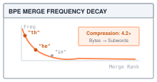

# Byte-Pair Encoding: Compressing Language into Subword Tokens {#sec-tokenization}

A vocabulary that knows `cat` can still lose `cats`: one extra letter can turn a familiar word into an unknown ID. The network cannot recover letters that its input representation has already discarded. After @sec-convolutions, TinyTorch can take a grid of pixels, slide a kernel across it, and hand the result to the same `Linear` layers and training loop it already had. Every input so far has arrived as numbers. Text does not. A sentence is a string of characters, and a network can only multiply and add. The question this chapter answers is the one a practitioner asks the first time they call a language model. What integers does the model actually see when I type a sentence, and who decides where one integer ends and the next begins?

A tokenizer assigns those integers. Module 10 implements **Byte-Pair Encoding (BPE)**, which learns a vocabulary by repeatedly merging the most common adjacent pair of symbols. Its learned state is a vocabulary, an ordered merge list, and two lookup dictionaries; no tensor or gradient is involved. We follow one word through that state, then hand its IDs to the embedding table in @sec-embeddings. The distinction between the character alphabet used here and a byte alphabet will determine which text the tokenizer can preserve.

---

## The Problem

There are two obvious ways to turn text into integers, and both fail, in opposite directions.

The first is to number the characters. Every observed character gets an ID, but unseen characters remain a problem. A byte tokenizer can instead reserve an ID for each of the 256 byte values and represent any UTF-8 input as bytes. The cost is length. For the text `"the cat sat"`, character tokenization needs eleven IDs, including the spaces; word tokenization needs three. A longer sequence requires more positions to process. In @sec-attention, attention will introduce a table with one entry for every pair of token positions, making sequence length especially consequential.

The second is to number the words. Split on spaces, give each distinct word an ID, and a 1,000-word essay is 1,000 tokens. Now the vocabulary is the problem. The listing below builds a word vocabulary from one sentence and then encodes three others. Any word the vocabulary has not seen maps to a reserved ID, conventionally written `<unk>` for "unknown".

```python
train_words = "the cat sat on the mat".split()
vocab = {word: i + 1 for i, word in enumerate(sorted(set(train_words)))}  # id 0 is <unk>

def encode_words(text):
    return [vocab.get(word, 0) for word in text.split()]

print(encode_words("the cat sat"))     # [5, 1, 4]
print(encode_words("the cats sat"))    # [5, 0, 4]   one extra letter and the word is gone
print(encode_words("The cat sat."))    # [0, 1, 0]   a capital and a period lose two words
```

One plural and the model reads nothing where "cats" was. A capital letter and a period erase two of three words. Real text is full of plurals, capitals, typos, names, code, and words coined last week, so increasing a word vocabulary cannot guarantee that the next word is present. Size has its own cost. The lookup operation in @sec-embeddings turns each token ID into a row of a lookup table with one entry per vocabulary word and $D$ numbers per row, so, for example, a hypothetical vocabulary of one million words at $D = 4{,}096$ in 32-bit floats is $10^6 \times 4{,}096 \times 4$ bytes, about 16 GB, before the model has read a single word.

The two extremes trade one cost for the other. Characters give a tiny table and long sequences; words give short sequences and an enormous, leaky table. What we want is in between. Common words should be single tokens, so sequences stay short. Rare words should split into pieces the vocabulary does know, so an unseen word can still retain its known characters. The split itself should be learned from data rather than written by hand, because no one can list the useful pieces of every language.

---

## The Idea

::: {.column-margin}
{width="100%"}
*BPE pair frequency decay across merge ranks.*
:::

BPE began as a compression technique; [Sennrich, Haddow, and Birch applied it to translation](https://aclanthology.org/P16-1162/) to represent rare words through subword units. The compression origin is the right way to think about it. A compressor looks for repeated patterns and gives them short codes. BPE looks for the most repeated adjacent pair of symbols and gives it a new symbol.

Start with an alphabet. Module 10 uses the characters that occur in the training words, with a marker glued onto each word's last character so that a letter ending a word is a different symbol from the same letter inside one; GPT-2 uses the 256 possible byte values instead, and the production section says why. Write the training text as a sequence of those symbols. Then repeat one step. Count how often every adjacent pair occurs, pick the pair with the highest count, invent a new symbol for it, and replace every occurrence of the pair with that symbol. In symbols, with $\text{count}(a, b)$ the number of times symbol $a$ is immediately followed by symbol $b$ anywhere in the corpus,

$$(a^*, b^*) = \arg\max_{(a, b)} \text{count}(a, b), \qquad \text{new symbol } c = a^* b^*.$$

A new vocabulary entry can replace many occurrences of its pair; each nonoverlapping replacement shrinks a word by one symbol. The vocabulary ends up holding "es", "est", and so on up to whole common words, each earned by frequency, and the merges are recorded in the order they were made. That ordered list, together with the alphabet and ID mappings, specifies how text is represented. Training runs once, over a large corpus, and produces the list; each new vocabulary entry adds to the initial alphabet and reserved symbols. The requested `vocab_size` is a target for that total, not a count of merges; training may stop sooner when no pairs remain. It also retains the complete base alphabet when that alphabet alone exceeds the target. The public `vocab_size` reports the actual number of entries.

Encoding new text replays the list. Split the text into its base symbols and apply the merges in the order they were learned, each rule rewriting every place it matches, so that a pair learned earlier is always merged before one learned later. Because the merge list is fixed and the order is fixed, the same string always encodes to the same IDs, and a word the tokenizer never saw still encodes, because at worst it stays as single known-character symbols. That is most of the guarantee that word vocabularies could not give. The remainder depends on the alphabet: with characters, a character the corpus never contained still has nowhere to go and becomes `<UNK>`; with bytes there is nothing left to be unknown.

Decoding is trivial by comparison. Each ID names a string, so concatenate the strings and normalize whitespace. Word-final tokens already contain a trailing space. The pipeline in @fig-tokenization-spectrum separates the state-changing training loop from encoding with fixed rules. The alphabet decides which characters survive; the merge order decides how they group.

{#fig-tokenization-spectrum fig-alt="Two rows show training from word counts through vocabulary construction to pair merges, and encoding low from individual symbols through a learned merge to integer IDs."}

---

## The Code

::: {.column-margin}
**Source Code Mapping:**
The listings in this section are extracted from Module 10 (`src/10_tokenization/10_tokenization.py`) by name when the book is built. Module 10 is character-level: its alphabet is the characters the corpus contains, it marks each word ending with a trailing space, it splits text on whitespace before merging, and it keeps an `<UNK>` ID for characters it never saw.
:::

The tokenizer is a base class fixing the two-method interface, a character tokenizer that is The Problem's first extreme in code, and the BPE tokenizer, which is where the chapter lives. The BPE class holds a vocabulary in both directions (token to ID and ID to token) and the list of merges in the order they were learned. We call a merge's position in that list its **rank**; rank 0 is the first merge made.

### The contract, and the character baseline

The language-model input pipeline begins with these integers. In @sec-embeddings, each ID selects a row of a lookup table, and the model's final layer produces one score per ID, so a tokenizer's job is a fixed two-way mapping between strings and IDs that must not change once the model starts training. The base class says only that much: `encode` and `decode`, each of which a subclass must supply.



The class attributes name the unknown token and the word boundary. `<UNK>` occupies ID 0. `TOK_EOW` is the string `" "`, a single space, appended to the last character of each word. Since `str.split()` removes whitespace before creating words, the boundary cannot collide with their contents. The notation `</w>` makes that invisible suffix visible on the page; the implementation does not replace literal `</w>` text. The character tokenizer is the simplest thing that satisfies the contract, and it makes the trade in The Problem concrete: one ID per character, `<UNK>` at ID 0, and a `build_vocab` that sorts the characters it saw so that two runs on the same corpus agree.



`encode` is a dictionary lookup per character with `<UNK>` as the default, and `decode` is the reverse lookup joined into a string. A known character survives the round trip, while an unknown character becomes the literal `<UNK>`. No merging occurs, so encoding preserves the character count rather than shortening the sequence. The BPE tokenizer starts from the same alphabet and earns its shorter sequences by merging.

### Words and the end-of-word marker

Training has exactly one step, repeated, and before the first step the corpus has to be written as symbols. Module 10 works on words. Its `train` takes a list of text strings, splits each with `str.split()`, counts how often each word occurs, and turns each distinct word into a list of characters once; every pair count from then on is weighted by the word's frequency rather than recounted per occurrence. Two consequences follow. No merge can ever cross a space, because no pair does. And the tokenizer needs a way to tell the `w` that ends `low` from the `w` in the middle of `lower`, because when `decode` glues tokens back together it has to know where to put the spaces. That is the marker's job.





Initialization stores the requested target and empty learned state. The property above counts actual entries, so it starts at zero and changes when training replaces or extends `self.vocab`. Callers need not infer that count from the target.



`_get_word_tokens("low")` returns `['l', 'o', 'w ']`, written `l o w</w>` below. The last character carries the marker as part of the symbol, so `w</w>` and `w` are two different entries of the alphabet from the start, and every merge that reaches the end of a word produces a symbol that says so. Training adds both forms of every observed character, even if a form never occurs in the corpus: after seeing only `ab`, it can still represent `ba`, `a`, and `b`. The boundary nevertheless constrains larger tokens, as the worked trace shows: `low</w>` is a whole-word token that `lowest` can never reuse, because inside `lowest` the `w` has no marker.

### Counting and merging pairs

Both halves of the step have a tempting shortcut that breaks. For counting, we could ask each candidate pair how often it occurs with a search over the corpus, but that is one full pass per candidate, even though one walk over the symbols can count all candidates. For merging, we could join each word back into a string and call `str.replace`. That is wrong, not slow. After the first merge the symbols are no longer single characters, and a string search cannot see where one symbol ends. Once `es` has been merged, `widest` is the five symbols `w i d es t</w>`; there is no `(s, t</w>)` pair in it, but the letters still read `widest`, and a `replace` on the joined string would happily glue the `s` inside `es` to the `t`. We count in a single pass over the word table with a `Counter`, weighting each pair by its word's frequency, and we merge by walking the list of symbols, where the boundaries are explicit.





Notice that `_merge_pair` walks left to right and skips two positions after a match. On the symbols `a a a` with the pair `(a, a)`, that yields `aa a`, not `a aa` and not an overlapping double match. The left-to-right choice fixes how overlapping matches are resolved, but the same rule has to apply during training and encoding, or the two will disagree about how a word splits, and `_apply_merges` below uses the identical loop. The helper's name says "byte pairs" because BPE's name does; the symbols it counts here are characters.

{#fig-bpe-merge-collapse fig-alt="Diagram showing frequency counting of symbol pairs in dictionary words, selection of highest-frequency pair, and token collapse into subword units."}

### Training

A language-model workflow normally trains its tokenizer before allocating the model. The requested `vocab_size` is stored as `target_vocab_size`; it is a training limit, not a promise about the resulting table. The read-only `vocab_size` property returns `len(self.vocab)`, the actual count that must size the model afterward. The lookup table in @sec-embeddings has one row of $D$ numbers per ID, and the output layer has one score per ID, so every entry we add here is a set of weights the model has to learn; at $D = 4{,}096$ in 32-bit floats that is 16 KiB of table per entry, before the output layer. Some base entries are deliberately retained for words absent from the training corpus; larger merged entries earn their storage by shortening sequences.



Before the loop, `train` builds a local word-frequency table and local lists of symbols. It replaces the tokenizer's old vocabulary and clears its old merges, so calling it again retrains rather than extending the previous state. Each pass counts pairs, picks the winner, and calls `_merge_pair`, which rewrites those local symbol lists in place. The merged string receives the next ID if it is new, and the pair is appended to `self.merges`. Finally, `_build_mappings` creates both lookup dictionaries. The caller's corpus strings remain unchanged; the tokenizer retains the vocabulary and rules, not the temporary word table.

Three things to notice. The loop runs until the vocabulary is full or no pair is left; it does not stop when the best pair occurs only once, so on a small corpus the last merges each glue together two symbols that meet in a single word and nowhere else, one vocabulary entry bought to shorten a single occurrence, with little opportunity for reuse. Hugging Face's [BPE trainer](https://huggingface.co/docs/tokenizers/api/trainers) exposes a `min_frequency` setting, and the stopping-and-ties exercise asks you to add it. When two pairs tie, `most_common` returns the one the `Counter` met first, which depends on corpus order; ties are common in small corpora and harmless, but they are why two BPE trainers given the same data can produce slightly different vocabularies. Both counting and rewriting scan the word table on every merge. With $N$ initial symbols across distinct words and $M$ merges, these scans give an $O(NM)$ upper bound; the lists shrink as training proceeds.

### Encoding and decoding

Text enters through `encode`; a list of predicted IDs can later return through `decode`. Decoding a complete list matters here: the final whitespace normalization means separately decoded tokens cannot simply be concatenated to reproduce whole-sequence decoding. These two methods are the ones that run on every request for the life of the model, and the encoder has one hard requirement. New text must split the way the training text split, because the model only knows the tokens it saw during training.

The tempting encoder is greedy: at each position, take the longest string that is in the vocabulary. That is a different segmentation rule and need not reproduce what the trainer saw. The merges were learned on words that already had the earlier merges applied; `st</w>` was learned from words containing `s` and `t</w>` as separate symbols after three earlier merges had run. A greedy encoder can grab a long vocabulary entry that the trainer would never have assembled at that position, and hand the model a token sequence it never saw in training. Replaying the merges in the order they were learned recreates the trainer's conditions exactly, so training text encodes exactly as it did during training, and the result is deterministic.





`_apply_merges` takes the rules in rank order and, for each one, walks the word with the same skip-two loop as `_merge_pair`. `encode` calls `str.split()`, then `_get_word_tokens` and `_apply_merges` for each word, then maps the resulting strings to IDs. Each helper constructs lists for this call; encoding does not alter the learned vocabulary or merge list. Every returned ID lies between zero and `vocab_size - 1` once the tokenizer has been trained.

Every rule walks the current word whether or not it applies. Four learned rules therefore mean four scans per word, and adding rules increases that work even when a particular word cannot use them. An unseen character falls back to `<UNK>`. A known character in a new position does not: both its internal and word-final forms were reserved during training. The returned Python list has one entry per final token; the dataset and batching machinery of @sec-dataloader can later collect compatible sequences for a model.



`decode` looks each ID up and joins the token strings. It then uses `split()` and `join()` to normalize whitespace and remove the final boundary space. An invalid ID becomes literal `<UNK>`. Whitespace changes even when every character is known: `"low  lower\n"` and `"low lower"` encode identically because `str.split()` discards their separators. The round-trip contract is therefore normalized words over the observed character alphabet. Literal marker text such as `</w>` survives when its characters are known; only actual spaces serve as boundaries. A byte alphabet addresses unseen characters, while preserving original whitespace requires changing the preprocessing and decoding rules.

---

## A Worked Trace

We train on the five-word corpus `low`, `low`, `lower`, `newest`, `widest`. It contains ten distinct characters. Training reserves two forms per character, internal and word-final, plus `<UNK>`: twenty-one entries, IDs 0 through 20. Sorting places `d` at ID 1, `d</w>` at ID 2, `e` at ID 3, and so on through `w</w>` at ID 20. A target of 25 leaves room for four merges.

The local word table starts as follows; `low` has frequency two, and every other row has frequency one.

```text
low:     l o w</w>
lower:   l o w e r</w>
newest:  n e w e s t</w>
widest:  w i d e s t</w>
```

| Rank | Most frequent pair | Count | New ID | Words changed |
| :--- | :--- | :--- | :--- | :--- |
| 0 | `(l, o)` | 3 | 21 | `low`, `lower` |
| 1 | `(lo, w</w>)` | 2 | 22 | `low` |
| 2 | `(w, e)` | 2 | 23 | `lower`, `newest` |
| 3 | `(s, t</w>)` | 2 | 24 | `newest`, `widest` |

: Four BPE merges after the twenty-one-entry base vocabulary. Counts include word frequency; tied pairs are selected in the order first encountered. {#tbl-bpe-merge-trace tbl-colwidths="[10,30,10,12,38]"}

After rank 0, both `low` and `lower` start with the single symbol `lo`. Rank 1 completes `low`, but cannot merge `lo w` inside `lower`, where `w` has no boundary suffix. Rank 2 creates `we` in two words, and rank 3 creates `st</w>` in two words. The resulting table is:

```text
low:     low</w>
lower:   lo we r</w>
newest:  n e we st</w>
widest:  w i d e st</w>
```

After rank 3 the vocabulary is full and the loop stops. Had we asked for more, it would have kept going; every remaining pair occurs once, and the module merges those too.

Now encode the unseen word `lowest`. Its symbols are `l o w e s t</w>`. `_apply_merges` replays the four rules in rank order, and each row below shows the word after that rule has walked it.

1. Rule 0, `(l, o)`: `lo w e s t</w>`.
2. Rule 1, `(lo, w</w>)`: no match, because the `w` in `lowest` carries no marker; `lo w e s t</w>`.
3. Rule 2, `(w, e)`: `lo we s t</w>`.
4. Rule 3, `(s, t</w>)`: `lo we st</w>`.

Six characters became three IDs, `[21, 23, 24]`, and neither `lowest` nor `est` as a standalone word was in the training corpus. Notice what the marker did at rule 1. The whole-word token `low</w>` exists in the vocabulary, but `lowest` cannot use it, so the tokenizer splits the word as `lo we st</w>` rather than `low est`; removing the marker would change the candidate pairs, so a byte-level trainer would need its own trace before we could predict its split. The listing below runs the trace and then encodes a string with a non-ASCII letter to distinguish unseen characters from unseen word positions.

```python
from tinytorch.core.tokenization import BPETokenizer

corpus = ["low", "low", "lower", "newest", "widest"]
tok = BPETokenizer(vocab_size=25)           # 21 base symbols + 4 merges
tok.train(corpus)

for rank, pair in enumerate(tok.merges):
    print(rank, pair, "->", pair[0] + pair[1], tok.token_to_id[pair[0] + pair[1]])

ids = tok.encode("lowest")
print(ids, [tok.id_to_token[i] for i in ids])   # [21, 23, 24] ['lo', 'we', 'st ']
assert tok.decode(ids) == "lowest"

ids = tok.encode("naïve widest")
print(ids, [tok.id_to_token[i] for i in ids])
# [9, 0, 0, 0, 4, 19, 5, 1, 3, 24]
# ['n', '<UNK>', '<UNK>', '<UNK>', 'e ', 'w', 'i', 'd', 'e', 'st ']
print(tok.decode(ids))                          # n<UNK><UNK><UNK>e widest
```

In lines 4--6, `BPETokenizer(vocab_size=25)` trains on the five-word corpus, establishing 21 base symbols and 4 learned merges. The loop in lines 8--9 prints the ranked merge rules corresponding to @tbl-bpe-merge-trace. In lines 11--13, encoding the unseen word `'lowest'` applies the merge chain to yield token IDs `[21, 23, 24]` (`['lo', 'we', 'st ']`), which decode back losslessly to `'lowest'`.

In lines 15--19, encoding `'naïve widest'` separates two cases. As printed by lines 16--18, `a`, `ï`, and `v` never appeared in the corpus, so they are mapped to `<UNK>` (ID 0). The final `e</w>` survives even though no training word ended in `e`, because training reserved both forms of every observed character. Three of the five characters of `naïve` are replaced by `<UNK>`, while its known ending preserves the word boundary. In line 19, `widest` splits as `w i d e st</w>` because `st</w>` was learned but `wid` was not. A tokenizer with a complete byte alphabet can represent the missing characters too, provided decoding reconstructs their bytes before interpreting them as text.

::: {#chk-tokenization-byte-fallback .callout-check title="Sanity Check: Byte-Level Fallback Eliminates OOV"}
Why do modern LLM tokenizers (such as GPT-2, LLaMA, and TinyGPT) use byte-level BPE instead of raw character vocabularies? A raw character vocabulary must map every unseen character, emoji, or non-ASCII code point to an out-of-vocabulary (`<UNK>`) token. Once an input character collapses into `<UNK>`, all semantic information is permanently lost. By seeding the base vocabulary with all 256 individual byte values ($0\text{x}00$ through $0\text{xFF}$), any UTF-8 encoded string can be losslessly represented as a sequence of base bytes if no learned subword token matches. The vocabulary never encounters an out-of-vocabulary token.
:::

The training target is not the output size. With `BPETokenizer(vocab_size=2)` and corpus `["ab"]`, the five base entries already exceed the target; no merge runs, `vocab_size` is 5, and `encode("ba")` returns `[3, 2]`. Conversely, a target of 100 on the five-word corpus stops at 34 entries after thirteen merges exhaust the available pairs. In both cases, allocate the embedding table in @sec-embeddings from the actual `vocab_size`.

---

## From TinyTorch to Production

The reference mechanism makes two production questions concrete. How can a tokenizer preserve text outside its training alphabet? How can it avoid scanning thousands of irrelevant rules for every word? Different tokenizers answer these questions differently, so it is useful to compare specific implementations rather than assume every deployed model uses one scheme.

The [released GPT-2 encoder](https://github.com/openai/gpt-2/blob/master/src/encoder.py) begins with UTF-8 bytes, remapped reversibly onto printable characters for its internal string operations. Its base alphabet covers all 256 byte values. It uses a regular expression, a pattern describing groups of characters, to split text into chunks while retaining whitespace. Within each chunk, it selects the lowest-ranked available pair and repeats; a cache stores earlier chunk results. Its decoder reconstructs the bytes before interpreting them as UTF-8. These choices preserve the distinction between `"low  lower\n"` and `"low lower"`, which TinyTorch intentionally discards. They also explain why a single token's bytes need not form a complete Unicode character: decoding an entire sequence is different from decoding each ID separately.

Hugging Face's [BPE model interface](https://huggingface.co/docs/tokenizers/api/models) exposes a vocabulary, ranked merges, and cache capacity, along with choices such as unknown-token handling and a word-ending suffix. Its [trainer](https://huggingface.co/docs/tokenizers/api/trainers) exposes the requested vocabulary size, minimum pair frequency, and initial alphabet. Those settings are part of the tokenizer's behavior, not interchangeable performance switches. A BPE model configured over observed characters does not acquire complete byte coverage merely because the library also supports byte-based preprocessing.

| Mechanism | TinyTorch | A production alternative |
| :--- | :--- | :--- |
| Base alphabet | Both forms of each observed character, plus `<UNK>` | GPT-2 uses all byte values |
| Boundaries | Split on whitespace; append a space to each word | GPT-2 retains separators during pattern-based splitting |
| Encoding work | Scan each word once per learned rule | GPT-2 chooses among available pair ranks and caches chunks |
| Training limits | Target size, complete base alphabet, exhausted pairs | Hugging Face additionally exposes minimum frequency |
| Model interface | IDs range from 0 to actual `vocab_size - 1` | Vocabulary and preprocessing must match the model |

: Production alternatives address coverage and repeated work while retaining an explicit vocabulary and merge rules. {#tbl-bpe-production-comparison tbl-colwidths="[22,39,39]"}

The comparison suggests where to reduce repeated work. Our encoder does repeated work on repeated words; caching could remove it while leaving the IDs unchanged. A trainer can track which words contain a pair and update affected counts rather than scan every word again. Such changes need tests against the simple reference, because an altered tie-break or preprocessing rule can change the learned vocabulary even when the new loop is faster.

::: {#psp-tokenization-rust-huggingface .callout-production title="Production Bridge: Fast Multi-Threaded Rust Tokenizers"}
In production systems, tokenizing gigabytes of training data in Python with string loops is a major bottleneck. Modern libraries such as HuggingFace `tokenizers` are implemented in Rust: they memory-map the input text files, use lock-free trie structures or hash tables for fast merge rank lookups, and tokenize across all available CPU cores in parallel via Rayon. During autoregressive inference, the tokenizer also handles incremental streaming decoding without reparsing the entire historical token sequence.
:::

The invariant that reaches the model is more important than either optimization. ID 22 denotes `low</w>` in our trace; another tokenizer can assign that same number to unrelated text. Keeping all IDs in range prevents an indexing error, but it does not detect a mismatched vocabulary. The alphabet, preprocessing, reserved tokens, ID mappings, and ordered merges must travel together with the model. Likewise, changing the vocabulary requires reconsidering the model's input and output dimensions. A model's context limit counts tokens rather than words, so the same amount of text can occupy different fractions of that limit under different segmentations.

---

## Summary

Module 10 turns strings into stable integer sequences without tensors or gradients. `train` splits the corpus into words, counts frequencies, reserves internal and word-final forms of every observed character, and repeatedly merges the most frequent adjacent pair. It mutates the tokenizer's vocabulary and ordered merge list while leaving the caller's text unchanged. The actual `vocab_size` counts the resulting entries, which can be above or below the requested target.

`encode` uses that fixed state: split, mark word endings, replay merges, then look up IDs. `decode` joins their strings and normalizes whitespace. Known characters survive in new words and new word positions; unseen characters become `<UNK>`. The alphabet determines coverage, while the learned rules determine segmentation. A byte alphabet and whitespace-preserving preprocessing address separate limitations of this reference. @sec-embeddings accepts the resulting IDs and builds the missing numerical operation: selecting a learned vector for each ID, then representing where that token occurs in the sequence.

---

## Exercises

1. **Trace and size the vocabulary.** Train on `["ab"]` with targets 2 and 20. Predict the base IDs, learned merges, actual `vocab_size`, and the encodings of `ab` and `ba`; then check them. Explain why allocating an embedding table from the requested target is unsafe. Retrain the same tokenizer on `["xy"]` and show which earlier state has been replaced.

2. **Bytes instead of characters.** Replace the observed-character alphabet with all 256 byte values. Treat the end-of-word marker as a separate symbol so that every byte remains representable at every position, and reconstruct UTF-8 bytes before decoding. Retrain on the five-word corpus and verify a round trip for `naïve widest`. Then test `"naïve  widest\n"` and literal `"</w>"`. Explain why preserving the repeated spaces and newline also requires replacing the whitespace split, even though every byte has an ID.

3. **Stopping and ties.** Add a `min_frequency` argument to `train` that stops merging when the best pair occurs fewer times than it, and count how many of the thirteen merges the five-word corpus can produce survive `min_frequency=2`. Then change the tie-breaking rule so that among equally frequent pairs the lexicographically smallest wins, retrain, and encode `lowest` again. Does the ID sequence change? Does the decoded string? State in one sentence what BPE guarantees and what it does not.

4. **Compression by corpus.** Train a tokenizer with `vocab_size=600` on a few paragraphs of English (any public-domain text will do), then encode the same paragraphs, a paragraph in another language, and a block of Python source. For each, compute characters per token. Explain the ranking you observe in terms of which pairs the training corpus contained.
