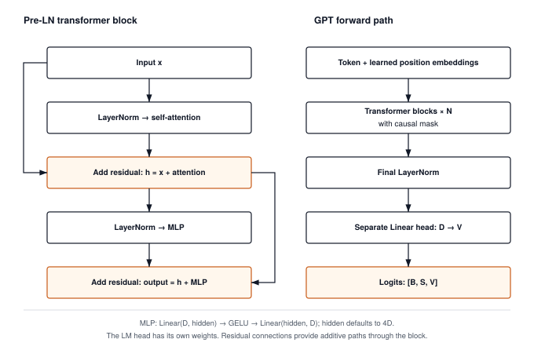

# The Transformer: Assembling GPT from Attention Blocks {#sec-transformers}

After Chapter 12 you have `MultiHeadAttention`, a layer that lets each token gather context from the tokens before it. It is one layer. The question this chapter answers is the one a practitioner asks on first opening a GPT configuration file and seeing `n_layer: 12`. How do you stack attention into a deep model that predicts the next token, and what keeps a stack that deep from falling apart when you train it?

The answer is a repeating unit called the transformer block, built from attention plus two pieces you have not written yet. Layer normalization gives each sub-layer a standardized view of the token's vector while the residual stream itself can change scale. A small two-layer network, the MLP, lets each token transform its own features after attention has mixed features across tokens. Wrap both in residual connections, stack $N$ copies, put embeddings underneath and a vocabulary projection on top, and the result is GPT.

{#fig-transformer-arch}

By the end of the chapter you will have `GPT` (Module 13 also names it `TinyGPT`), which takes a sequence of $S$ token IDs and returns an $S \times V$ matrix of logits, one row of next-token scores for every position. Milestone 2 trains it and samples text from it.

---

## The Problem

Two things go wrong if you simply stack attention layers.

The first is the lack of a dedicated transformation of each token's features after mixing. Attention is already nonlinear because its softmax weights depend on the input. Its output, however, is organized as a weighted mixture of projected values. A separate MLP lets every token transform that mixture through a nonlinear hidden layer without constructing another matrix of interactions between positions. It reuses the linear-activation-linear pattern from Part I at every position.

The second problem is depth. Each layer that computes $y = f(x)$ and passes only $y$ forward multiplies the signal's scale by roughly the layer's gain. A gain of $1.2$ across 24 layers is $1.2^{24} \approx 79$; a gain of $0.8$ is $0.8^{24} \approx 0.005$. The chain rule does the same multiplication to the gradient on the way back. Chapter 2 met this as the vanishing gradient of stacked sigmoids, and Chapter 3's Kaiming initialization sets the gain to $1$ at the start of training, but training moves the weights and the gain drifts. Twenty-four layers of drift is enough to see:

```python
import math, random
rng = random.Random(0)
D, L = 64, 24

def rms(v):
    """Root-mean-square scale of a vector."""
    return math.sqrt(sum(x * x for x in v) / len(v))

def apply(W, v):
    """Multiply a D x D matrix by a length-D vector."""
    return [sum(w * x for w, x in zip(row, v)) for row in W]

x = [rng.gauss(0.0, 1.0) for _ in range(D)]
plain, stream = list(x), list(x)
for layer in range(1, L + 1):
    W = [[rng.gauss(0.0, 1.0) * 1.2 / math.sqrt(D) for _ in range(D)] for _ in range(D)]  # gain ~1.2
    plain = apply(W, plain)                                        # replace the signal
    stream = [s + u for s, u in zip(stream, apply(W, [s / rms(stream) for s in stream]))]  # normalize, add
    if layer in (1, 6, 12, 24):
        print(f"layer {layer:2d}   plain rms = {rms(plain):6.2f}   stream rms = {rms(stream):5.2f}")
```

```
layer  1   plain rms =   1.18   stream rms =  1.58
layer  6   plain rms =   2.66   stream rms =  3.10
layer 12   plain rms =   9.15   stream rms =  3.65
layer 24   plain rms =  83.96   stream rms =  5.88
```

On my machine the `plain` column grows by a factor of roughly $1.2$ per layer and ends 84 times its starting scale after 24 layers; the generator is seeded, so you will see the same numbers. The `stream` column grows too, but slowly, because each layer adds a unit-scale update to a running total instead of multiplying the total. That second line of the loop is a transformer block in miniature. Normalize the input, compute an update, add the update to the stream. The rest of the chapter makes each of those three steps precise.

---

## The Idea

### The residual stream

A **residual connection** passes a layer's input around the layer and adds it to the layer's output:

$$x_{l+1} = x_l + f_l(x_l)$$

Here $x_l$ is the vector a token carries into layer $l$, $f_l$ is whatever the layer computes, and $x_{l+1}$ is what the token carries out. The layer's job changes from "produce the next representation" to "produce a correction to the current one."

The gradient shows why this fixes the depth problem. Differentiating the equation above,

$$\frac{\partial \mathcal{L}}{\partial x_l} = \frac{\partial \mathcal{L}}{\partial x_{l+1}} \left( I + \frac{\partial f_l}{\partial x_l} \right)$$

where $\mathcal{L}$ is the loss and $I$ is the identity matrix. The identity term means the gradient arriving at layer $l+1$ reaches layer $l$ unchanged, with the layer's own contribution added on. Across $N$ layers the chain rule still multiplies $N$ Jacobians, but each has the form $I + J_l$. Expanding that product reveals a direct identity contribution as well as paths through the learned updates. This route makes gradient propagation easier; it does not guarantee that gradients cannot grow, shrink, or cancel. In code this needs nothing new. Chapter 6's autograd already sums the gradients of a tensor that is used on two paths, and $x_l$ is used on two paths: once into $f_l$, once straight into the addition.

A useful picture is to think of the residual path as a **stream**, a $D$-dimensional scratchpad that each token carries through the whole network. Each sub-layer reads the stream, computes a delta, and writes the delta back by addition. An update can cancel an earlier value by adding its negative, so the stream is not an immutable record. The useful guarantee is structural: the old vector reaches the addition directly instead of having to pass through the learned transformation. A 12-block GPT has 24 sub-layers reading and writing the same stream.

### Layer normalization

Residual additions preserve a direct route through the stack, but they do not bound its scale. Each sub-layer still benefits from inputs at a known scale, for the same reason Chapter 3 initialized weights carefully. **Layer normalization** standardizes each token's vector across its $D$ features. For one token with features $x_1, \dots, x_D$,

$$\mu = \frac{1}{D} \sum_{i=1}^{D} x_i, \qquad \sigma^2 = \frac{1}{D} \sum_{i=1}^{D} (x_i - \mu)^2$$

$$\hat{x}_i = \frac{x_i - \mu}{\sqrt{\sigma^2 + \epsilon}}, \qquad y_i = \gamma_i \hat{x}_i + \beta_i$$

where $\mu$ and $\sigma^2$ are the mean and variance of that one token's features, $\epsilon$ is a small constant (typically $10^{-5}$) that keeps the division safe when the variance is near zero, and $\gamma$ and $\beta$ are learned vectors of length $D$ that let the network scale and shift the result. They start at $\gamma = 1$ and $\beta = 0$, so a fresh LayerNorm is pure standardization, and training can undo as much of it as turns out to be useful. Everything here is computed from one token's own $D$ numbers; why that matters is the first thing The Code section takes up.

### Where the normalization goes

The original 2017 transformer normalized the stream itself after each addition, an arrangement now called **Post-LN**:

$$x_{l+1} = \text{LN}(x_l + f_l(x_l))$$

GPT-2 and nearly every model since move the normalization to the input of the sub-layer, called **Pre-LN**:

$$x_{l+1} = x_l + f_l(\text{LN}(x_l))$$

The difference looks small and is not. In Post-LN, the identity path of the residual runs through a LayerNorm at every block, so the clean gradient highway from the previous section has $N$ rescalings on it. In Pre-LN the stream is never normalized; each sub-layer normalizes its own copy of the input, and only one final LayerNorm, just before the vocabulary projection, touches the stream. Every equation and listing in this chapter uses Pre-LN, and the block listing says what the choice buys in training.

### The MLP

The second sub-layer is the nonlinearity the first problem asked for. The **MLP** (multi-layer perceptron, the transformer literature's name for a two-layer feed-forward network) widens each token's vector from $D$ to $4D$, applies GELU from Chapter 2, and projects back to $D$:

$$\text{MLP}(x) = \text{GELU}(x W_1 + b_1)\, W_2 + b_2, \qquad W_1 \in \mathbb{R}^{D \times 4D},\; W_2 \in \mathbb{R}^{4D \times D}$$

Here $x$ is one token's row vector, as in Chapter 12's $q_t = x_t W_q$. The same $W_1, W_2$ apply to every position, and no position sees any other. The division of labor inside a block is therefore clean. Attention decides which tokens' information to gather; the MLP decides what to do with what was gathered, one token at a time.

### Assembling the model

With the block defined, the whole model is a short list. Tokens $t_1, \dots, t_S$ enter as embedding rows plus position vectors from Chapter 11, pass through $N$ blocks, get normalized once more, and project onto the vocabulary:

$$h_0 = E_{\text{tok}}[t] + P, \qquad h_l = \text{Block}_l(h_{l-1}) \;\text{ for } l = 1, \dots, N, \qquad \text{logits} = \text{LN}_{\text{final}}(h_N)\, W_{\text{head}}$$

Here $E_{\text{tok}}$ is the $V \times D$ embedding table, $P$ the position vectors, and $W_{\text{head}}$ a $D \times V$ matrix that turns a $D$-dimensional hidden state into one score per vocabulary entry, the logits of Chapter 4. The output has one row of $V$ scores per position, and the `GPT` listing explains why one row per position, rather than one row per pass, is the whole point.

---

## The Code

::: {.callout-note title="Source Code Mapping"}
The listings in this section are extracted from Module 13 (`src/13_transformers/13_transformers.py`) by name when the book is built, so a renamed class in the module fails the build instead of drifting from the chapter. Module 13 exposes `LayerNorm` with its operation `LayerNormFunction`, `MLP`, `TransformerBlock`, and `GPT` with `forward`, `generate`, and `parameters`; `generate` and its sampling helper belong to Milestone 2 and are elided here.
:::

The listings continue Chapter 12's conventions. A batch is a tensor of shape $(B, S, D)$, `MultiHeadAttention` comes from Chapter 12 unchanged, and every weight matrix is a Chapter 3 `Linear`, so it arrives at the $1/\sqrt{D_{\text{in}}}$ scale that keeps a fresh layer from inflating or shrinking what passes through it. What this chapter adds that Chapter 12 never needed is elementwise work. A block adds a $(B, S, D)$ update into the stream twice, and the MLP pushes every one of its $B \times S \times 4D$ hidden values through a nonlinearity. Neither needs new code. The residual addition is Chapter 1's `+`, and the nonlinearity is Chapter 2's `GELU`, in the sigmoid form that module implements.

Start with `LayerNorm`, and with what a model needs it for. Every sub-layer in the stack, twelve blocks deep in GPT-2 small and forty-eight in GPT-2 XL, reads the stream as its input, and the Problem section showed what the stream's scale does when nothing holds it. At a gain of only $1.2$ per layer it reached 84 times the starting scale by layer 24. A weight matrix that Chapter 3 initialized for unit-scale inputs is then fed values eighty times too large, and the softmax inside attention saturates on scores that big. So each sub-layer has to standardize its input, and the question is what statistics to standardize with. The obvious choice, pooling the mean and variance across the batch the way many vision networks do, breaks exactly where a language model lives. Milestone 2 trains on batches of sequences and then generates with a batch of one, a single token at a time. A layer whose numbers depend on which other examples share the batch behaves differently in those two settings and needs separate training and evaluation modes to paper over the gap. Can we normalize a token using nothing but its own $D$ numbers? That is layer normalization. The statistics come from one row, so nothing depends on the batch or on the other positions in the sequence, and the layer gives the same answer for a batch of one and for a single token as it does mid-training. That property is what lets Milestone 2 generate text with the same code it trained on.





Every statistic is taken along the last axis with `keepdims=True`, so `mean_data` has shape $(B, S, 1)$ and broadcasts back across the $D$ features of its own row; nothing computed for one token touches any other. The layer owns exactly $2D$ parameters, `gamma` and `beta`, however long the sequence. Notice what is absent: no running averages, no dependence on other rows, nothing that behaves differently in training and evaluation. Notice also what the operation keeps. It stores the standardized rows and the per-row standard deviation on itself, because the module writes `LayerNormFunction.backward` by hand as one closed-form step rather than letting Chapter 6's tape route the gradient through a mean, a subtraction, a square, another mean, and a division; the formula is in the module, and it returns the three gradients for `x`, `gamma`, and `beta` in one pass. PyTorch's `nn.LayerNorm` is the same arithmetic, and its `normalized_shape` argument is our `normalized_shape`.

`MLP` transforms the features attention has gathered, independently at each position. Its `linear1` widens the last axis from $D$ to $4D$, `gelu` changes the hidden features nonlinearly, and `linear2` returns the last axis to $D$ so the result can be added to the stream. No operation in this path mixes sequence positions. The default hidden width allocates $8D^2$ matrix weights to the MLP, compared with attention's $4D^2$ projection weights; changing it is a capacity choice rather than a requirement of residual addition.



Because `Linear` multiplies every row of $X$ by the same matrix, every position is handled by the same weights without any per-token loop. The hidden tensor has $4D$ columns, four times the width of the stream. It is four times wider than the stream. For longer sequences the attention score tensor can be larger still, so Chapter 14 must count both rather than infer the largest allocation from feature width alone. The constructor defaults `dropout_prob` to zero and rejects nonzero values because this compact implementation omits dropout; GPT-2 applied dropout of $0.1$ here, and the production section says where. GPT-2's released code names the same two layers `c_fc` and `c_proj`.

`TransformerBlock` is the unit a framework repeats, and the repetition is what it has to survive. GPT-2 small stacks 12 of these, GPT-2 XL 48, Llama 2 7B 32, and every one of them must pass a token's vector along without wrecking its scale on the way forward or its gradient on the way back. The Problem section priced the naive stack, where each layer replaces the signal. The forward scale reached 84 times its start after 24 layers, and the chain rule multiplies 24 Jacobians together for the gradient on the way back. The 2017 arrangement, Post-LN, repairs the forward scale by normalizing the stream after each addition, but that leaves $N$ rescalings sitting on the gradient path. Xiong et al. (2020) showed that Post-LN transformers need a learning-rate warmup (a few thousand early steps at a tiny learning rate) to avoid diverging, and that Pre-LN transformers train without one. So the block does what The Idea's equation says. Normalize a copy of the stream, run the sub-layer on the copy, add the result back. The stream itself is never touched by a LayerNorm, and the gradient reaching the block's input is the gradient at its output plus a correction. The two additions are `Tensor` additions that Chapter 6 records, so the input reaches the output by two paths and their gradients accumulate as that chapter described.



Two additions do the work. Read them against the Problem section's loop: `ln1` is the `s / rms(stream)`, the sub-layer is the `apply(W, ...)`, and `x + attention_out` is the running total. The input and output have the same shape, which is what lets blocks stack without any adapter between them. PyTorch's `nn.TransformerEncoderLayer` selects this same arrangement with `norm_first=True`.

`GPT` exists to give Milestone 2 a training signal. The label at every position of a text is the next token, so a sequence of $S$ tokens holds $S$ training examples. The naive way to collect them is one forward pass per example. Feed tokens $1$ through $s$, read one prediction, advance $s$, repeat. A window of 1,024 tokens, GPT-2's context length, would cost 1,024 forward passes, and every early prefix would be recomputed inside every later one. The causal mask from Chapter 12 collapses this to a single pass. Because the mask lets position $s$ see only tokens $1$ through $s$, the logits at position $s$ are a prediction of token $s+1$ made without peeking, and one forward pass returns all $S$ predictions as an $S \times V$ matrix per sequence. Every position of every sequence is a training example, all computed at once. So the model stacks the blocks and adds the two ends. The front end is Chapter 11's `EmbeddingLayer`, with its default learned position table, the form GPT-2 uses (the sinusoidal table works equally well here, and the block does not care which). The mask is built once per forward pass from the actual sequence length and handed to every block, since causality belongs to the sequence and not to any block.



Three things to notice. The loop over `self.blocks` is the entire depth of the model; making GPT deeper is a change to one integer, and Chapter 14 walks this same list when it counts what the model costs. The final `LayerNorm` is the only normalization applied to the stream itself, in keeping with Pre-LN. And `lm_head` is a bias-free `Linear(D, V)`, which for a real vocabulary is a large matrix. With $D = 768$ and $V = 50{,}257$ it holds 38.6 million weights, close to a third of a GPT-2 small model on its own. The production bridge returns to that number. `start_pos` already selects which position rows `embedding_layer` adds; ordinary full-sequence calls use zero. It does not supply preceding tokens to attention. Calling `forward` on one token with a nonzero offset therefore supplies its position but no past context. Chapter 18 must add cached keys and values to provide that missing context. GPT-2's code calls these five pieces `wte`, `wpe`, `h`, `ln_f`, and `lm_head`, and the mapping to ours is one to one.

---

## A Worked Trace

Take one token whose stream vector is $\mathbf{x} = [1, 2, 3, 4]$ with $D = 4$, and follow it through one block with $\gamma = 1$, $\beta = 0$. The first LayerNorm is fully hand-checkable:

$$\mu = \frac{1 + 2 + 3 + 4}{4} = 2.5, \qquad \sigma^2 = \frac{2.25 + 0.25 + 0.25 + 2.25}{4} = 1.25, \qquad \sqrt{\sigma^2 + \epsilon} \approx 1.1180$$

$$\hat{\mathbf{x}} = \frac{[1, 2, 3, 4] - 2.5}{1.1180} = [-1.3416, -0.4472, +0.4472, +1.3416]$$

The attention and MLP outputs depend on random weights and, for attention, on the other tokens in the sequence, so they are not hand-checkable. I substitute two fixed small vectors for them, which is enough to see the only thing the block does with them, namely add them to the stream.

| Stage | Computes | Input | Output |
| :--- | :--- | :--- | :--- |
| Stream in | | | $[1.000, 2.000, 3.000, 4.000]$ |
| 1. `ln1` | $\text{LN}(\mathbf{x})$ | $[1.000, 2.000, 3.000, 4.000]$ | $[-1.342, -0.447, +0.447, +1.342]$ |
| 2. `attention` | $\text{Attn}(\text{LN}(\mathbf{x}))$ (fixed) | $[-1.342, -0.447, +0.447, +1.342]$ | $[+0.100, +0.200, +0.100, +0.200]$ |
| 3. add | $\mathbf{x}_1 = \mathbf{x} + \text{Attn}$ | $[1.000, 2.000, 3.000, 4.000]$ | $[1.100, 2.200, 3.100, 4.200]$ |
| 4. `ln2` | $\text{LN}(\mathbf{x}_1)$ | $[1.100, 2.200, 3.100, 4.200]$ | $[-1.358, -0.394, +0.394, +1.358]$ |
| 5. `mlp` | $\text{MLP}(\text{LN}(\mathbf{x}_1))$ (fixed) | $[-1.358, -0.394, +0.394, +1.358]$ | $[+0.050, +0.100, -0.050, +0.050]$ |
| 6. add | $\mathbf{x}_2 = \mathbf{x}_1 + \text{MLP}$ | $[1.100, 2.200, 3.100, 4.200]$ | $[1.150, 2.300, 3.050, 4.250]$ |

: One token's stream vector through a Pre-LN transformer block, with the two sub-layer outputs fixed by hand. {#tbl-transformer-block-trace tbl-colwidths="[14,28,29,29]"}

Two details in the table carry the lesson. The stream ($1.0 \to 1.1 \to 1.15$ in the first feature) is never normalized; only the copies fed to the sub-layers are. And the second normalization is not a repeat of the first: $\mathbf{x}_1$ has mean $2.65$ and variance $1.3025$, so its standardized form differs in every entry from $\hat{\mathbf{x}}$. Each sub-layer standardizes whatever the stream holds at that moment.

Running the module's `LayerNorm` on the same numbers, with the stream held as a batch of one sequence of one token, reproduces the table. On my machine it prints the following.

```python
import numpy as np
from tinytorch.core.tensor import Tensor
from tinytorch.core.transformers import LayerNorm

ln = LayerNorm(4)
x = Tensor([[[1.0, 2.0, 3.0, 4.0]]])                 # (B=1, S=1, D=4)
attn_out = Tensor([[[0.10, 0.20, 0.10, 0.20]]])      # stands in for attention(ln1(x))
mlp_out = Tensor([[[0.05, 0.10, -0.05, 0.05]]])      # stands in for mlp(ln2(x1))

n1 = ln(x)
x1 = x + attn_out
n2 = ln(x1)
x2 = x1 + mlp_out
for name, M in [("ln1", n1), ("x1 ", x1), ("ln2", n2), ("x2 ", x2)]:
    print(name + ":", np.round(M.data[0, 0], 4).tolist())
```

```
ln1: [-1.3416, -0.4472, 0.4472, 1.3416]
x1 : [1.1, 2.2, 3.1, 4.2]
ln2: [-1.3581, -0.3943, 0.3943, 1.3581]
x2 : [1.15, 2.3, 3.05, 4.25]
```

The same block, seen from the point of view of shapes rather than values, is the second half of the trace. A `GPT` with $D = 8$, two heads, two blocks, and a vocabulary of 16 tokens, given one sequence of three token IDs, moves the following tensors; the leading batch axis of 1 is left off.

| Stage | Tensor | Shape (rows $\times$ columns) |
| :--- | :--- | :--- |
| Input | token IDs | $3$ integers |
| `embedding_layer` | stream $h_0$ | $3 \times 8$ |
| Block 1, `ln1` output | normalized copy | $3 \times 8$ |
| Block 1, `attention`, per head | $Q, K, V$ | $3 \times 4$ each, 2 heads |
| Block 1, `attention`, per head | scores $QK^{\top}/\sqrt{4}$ + mask | $3 \times 3$ |
| Block 1, `mlp` hidden | after `linear1` and `gelu` | $3 \times 32$ |
| Block 1 output, Block 2 output | stream $h_1$, $h_2$ | $3 \times 8$ |
| `ln_f`, `lm_head` | logits | $3 \times 16$ |

: Tensor shapes through a two-block `GPT` on a three-token input. {#tbl-tinygpt-shapes tbl-colwidths="[36,34,30]"}

The prefix assertion checks the complete path: positions stay fixed, attention cannot read the new suffix, and the MLP and LayerNorm cannot move information between positions. It requires no trained weights. The backward assertion then checks that a next-token loss reaches both the vocabulary head and the input table through the same graph.

The parameter count is the other number worth having. Chapter 14 charges every generated token for reading every weight in the model, and the production bridge below does this arithmetic for GPT-2 small by hand. Reading a count off a configuration file is guesswork until you have totaled one yourself, so here is a helper that walks `parameters()` and sums the shapes, run on the same two-block model.

```python
from tinytorch.core.transformers import GPT

def count_parameters(model):
    """Total scalars across every tensor in parameters()."""
    return sum(int(np.prod(p.shape)) for p in model.parameters())

model = GPT(vocab_size=16, embed_dim=8, num_layers=2, num_heads=2, max_seq_len=8)
logits = model(Tensor([[3, 7, 1]]))
print(logits.shape)                       # (1, 3, 16): one row of 16 scores per position
print(count_parameters(model))            # 2080

# Appending a token must preserve every earlier logit row.
longer = model(Tensor([[3, 7, 1, 5]]))
assert np.allclose(logits.data, longer.data[:, :3], atol=1e-5)

# The loss at the last position reaches parameters on both ends of the stack.
from tinytorch.core.losses import CrossEntropyLoss
loss = CrossEntropyLoss()(logits[:, -1, :], Tensor([5]))
loss.backward()
assert np.isfinite(model.embedding_layer.token_embedding.weight.grad).all()
assert np.any(model.embedding_layer.token_embedding.weight.grad != 0)
assert np.any(model.lm_head.weight.grad != 0)
```

Of the 2,080 parameters, 1,744 sit in the two blocks (872 each, of which 552 are the MLP's, 288 attention's including its four biases, and 32 the two LayerNorms'), matching the roughly two-thirds MLP share I quoted beside the `MLP` listing. The rest are the embeddings (128 in the token table and 64 in the learned position table), the final LayerNorm's 16, and the head's 128. The stream keeps shape $3 \times 8$ from the embeddings to the final normalization. Everything that changes shape (the per-head split, the $3 \times 3$ score matrix, the $4\times$ hidden layer) lives inside a sub-layer and is folded back before the addition. The final row, at zero-based position 2, contains 16 scores for a fourth token the model has not seen.

---

## From TinyTorch to Production

GPT-2 (Radford et al., 2019) is this chapter's block almost line for line: Pre-LN, GELU, a $4\times$ MLP, a final LayerNorm, learned positional embeddings, and a bias-free head. Its differences are small and each has a reason. It applies dropout of $0.1$ to embeddings, attention weights, and residual updates during training, and ties the head to the embedding table. The models that followed changed more, and the changes cluster around the two cheap-looking operations in the block, normalization and activation. Llama (Touvron et al., 2023) replaces LayerNorm with **RMSNorm** (Zhang and Sennrich, 2019), which drops the mean subtraction and divides by $\sqrt{\frac{1}{D}\sum_i x_i^2 + \epsilon}$ alone, saving one pass over each vector; experiments showed the centering step was not what made LayerNorm work. It replaces the GELU MLP with a gated variant, SwiGLU,[^fn-swiglu-mlp-gate] and the added position table with RoPE, (the rotary scheme introduced in Chapter 11) which rotates $Q$ and $K$ inside attention instead of adding anything to the stream. The block structure, the stream, and the Pre-LN placement are untouched.

[^fn-swiglu-mlp-gate]: **SwiGLU**: an MLP whose hidden layer is the elementwise product of two linear projections, one passed through a smooth activation (Swish), so the network learns which hidden features to switch on. Llama uses a hidden width of about $2.7D$ rather than $4D$ to keep the parameter count of the three matrices equal to the two-matrix $4\times$ MLP.


Weight tying is the change with the biggest number attached. The embedding table is $V \times D$ and the head is $D \times V$; both map between token identity and the model's hidden space, in opposite directions. Press and Wolf (2016) showed that sharing one matrix for both costs nothing in accuracy. The napkin math for GPT-2 small ($D = 768$, $N = 12$, $V = 50{,}257$, 1,024 positions) makes the case. Each block holds $4D^2$ attention weights plus $8D^2$ MLP weights plus biases and two LayerNorms, about 7.09 million parameters; twelve blocks are 85.1 million. The token embedding is $50{,}257 \times 768 = 38.6$ million, and the positional table is 0.8 million. Tied, the total is 124.4 million, the figure GPT-2 small is known by. Untied, a second 38.6 million for the head would push it to 163 million. Roughly a quarter of the model's memory was on the table.

::: {#nbk-transformers-flop-parameter-accounting .callout-notebook title="Parameter accounting for a transformer block"}
For any transformer in the GPT family, the per-block count is close to $12D^2$ (attention $4D^2$, MLP $8D^2$), and the model total is close to $12 N D^2 + V D$ with tied embeddings. Checking a published model against this formula is a good way to find out which of the changes above it made. Llama 2 7B, with $D = 4{,}096$, $N = 32$, and $V = 32{,}000$, gives $12 \times 32 \times 4096^2 + 32000 \times 4096 = 6.57$ billion from the formula against 6.74 billion in reality. Most of the gap is a second $V \times D$ matrix, because Llama does not tie its head to the embedding; the gated MLP, sized to match the $4\times$ MLP's parameter count, adds only a few percent more.
:::

Where the time goes is the other thing production changes. The two MLP matrix multiplications and attention's four projections are dense GEMMs, the operation GPUs are built for, and they account for nearly all of the arithmetic. LayerNorm, GELU, and the residual additions are the opposite kind of work. Each does a handful of operations per element, but every element of the activation (all $B \times S \times D$ of them for a batch of $B$ sequences) must be read and written. Run one kernel at a time, as our listings do and as PyTorch does by default, each of those passes moves the whole tensor through memory and back for almost no arithmetic in return. PyTorch's `nn.LayerNorm` is therefore a single fused kernel that computes the mean, the variance, and the normalized output in one read of the data, and `torch.compile` goes further, folding GELU and the residual add into the tail of the neighboring matrix multiplication so the intermediate tensors are never written out at all. One more production detail follows from the arithmetic in this chapter. When the model runs in 16-bit floating point to halve its memory, frameworks still compute LayerNorm's sum of squares in 32 bits, because a sum of $D$ squared values loses precision or overflows in the narrower format.

What carries over unchanged is nearly everything you built. The block is the same two lines in every GPT-family model; the stream has the same width $D$ from embeddings to head; the per-token statistics of LayerNorm and RMSNorm are what let the same code train on full sequences and then generate one token at a time; and the parameter formula in the callout holds to within the choices listed in @tbl-tinygpt-vs-production. When you read a model configuration, `n_embd`, `n_layer`, and `n_head` are $D$, $N$, and $H$; `norm_type`, `activation`, and `tie_word_embeddings` are the three switches this section described. When a training run's loss spikes in its first few hundred steps, normalization placement and warmup are the first suspects. When you profile a transformer, expect the GEMMs to dominate the arithmetic and the normalization and activation kernels to dominate the kernel count, which is why fusing them is the first optimization every compiler applies.

| Design choice | Module 13 `GPT` | GPT-2 (2019) | Llama 2 (2023) |
| :--- | :--- | :--- | :--- |
| Normalization | LayerNorm, Pre-LN | LayerNorm, Pre-LN | RMSNorm, Pre-LN |
| Position | learned table, added | learned table, added | RoPE, inside attention |
| MLP | $D \to 4D \to D$, GELU (sigmoid form) | $D \to 4D \to D$, GELU | gated, $D \to 2.7D \to D$, SwiGLU |
| Head | separate $D \times V$ | tied to embedding | separate $D \times V$ |
| Dropout | none | $0.1$ | none |

: The transformer block across three generations. Every row changes a component; no row changes the block. {#tbl-tinygpt-vs-production tbl-colwidths="[22,26,26,26]"}

Milestone 2 runs this model one token at a time, and recomputing attention over the whole prefix for every new token is a cost that Chapter 18 removes.

---

## Summary

Module 13 builds the three pieces that turn one attention layer into a language model: `LayerNorm`, which standardizes each token's vector across its own features; `MLP`, which widens each token to $4D$, applies GELU, and projects back; and `TransformerBlock`, which wraps attention and the MLP in Pre-LN residual connections. `GPT` stacks $N$ blocks between embeddings and a vocabulary projection and returns an $S \times V$ matrix of logits, one row of next-token scores per position, in a single forward pass. The principle to keep is the residual stream. A sub-layer never replaces the token's vector; it normalizes a copy, computes a correction, and adds the correction back, so every block has a direct identity route for gradients alongside its learned route. The chain rule still composes the block Jacobians; the residual structure changes what those Jacobians contain. Milestone 2 takes `GPT(vocab_size, embed_dim, num_layers, num_heads)` and its $S \times V$ logits for granted and asks how to train it on text and sample the next token from those logits.

---

## Exercises

1. **Post-LN block.** Write `PostLNBlock`, which computes `ln1(x + attn(x))` and then `ln2(x + mlp(x))`, and build a 12-block stack of each kind with $D = 64$. Feed both stacks the same random sequence and print the `rms` of the stream after every block. Then explain, using the residual-gradient equation in The Idea, why the Post-LN stack's gradient at block 1 would pass through twelve rescalings that the Pre-LN stack's would not.

2. **RMSNorm.** Implement `RMSNorm` as described in the production bridge and count, for one row of length $D$, how many passes over the row `LayerNorm.forward` makes and how many `RMSNorm.forward` makes. Verify that on the trace vector $[1, 2, 3, 4]$ the two produce different outputs, and say why a network that only ever sees the normalized copy through a weight matrix can compensate for the missing mean subtraction.

3. **Weight tying.** Modify `GPT` so that the head reuses the token table, `embedding_layer.token_embedding.weight`, instead of allocating `lm_head` (multiply by the transpose of the table), then use `count_parameters` from the worked trace to confirm the tied and untied totals for the GPT-2 small configuration match the 124.4 million and 163 million figures in the production bridge.
