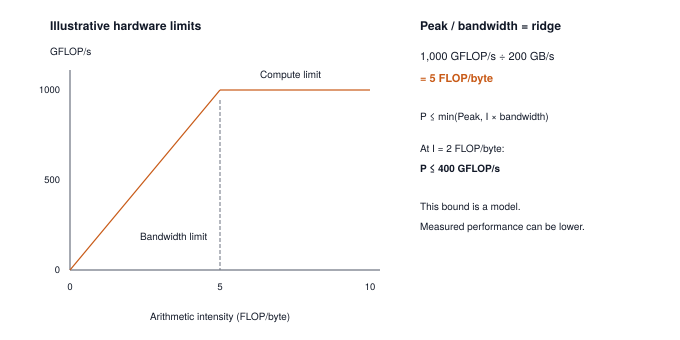

# Profiling: The Roofline Model {#sec-profiling}

Milestone II left you with a working language model. TinyGPT trains, the generation loop produces text one token at a time, and each of those tokens is slow. The milestone closed on the observation that every generated token reads every weight in the model to do almost no arithmetic, without saying what that costs or how to measure it. This chapter answers the question every practitioner asks at that moment. Where does the time go, and which change would actually make it faster: a faster processor, fewer floating-point operations, or fewer bytes moved?

The answer needs two things that Parts I and II never built. The first is a **profiler**, a small tool that counts what a forward pass does (parameters, floating-point operations, bytes) and times how long it takes. The second is a way to turn those counts into a diagnosis. That is the roofline model, a one-line formula that says how fast a given operation could possibly run on a given machine, and which of two ceilings it is hitting. Once you can place an operation on the roofline, the rest of Part III becomes a set of deliberate moves. Quantization, fusion, and caching each attack one ceiling, and this chapter tells you which one you are under.

{#fig-roofline-model}

---

## The Problem

The natural way to estimate how long a computation takes is to count its arithmetic. A Linear layer with $n$ inputs and $m$ outputs, applied to $R$ rows, does $2Rnm$ floating-point operations, or FLOPs, counting one for each multiply and one for each add. Double the rows and you double the FLOPs, so you expect to double the time.

Try it. Take one weight matrix the size of a real model's layer and push two rows through it, then sixteen. The second call does eight times the arithmetic.

```python
import time
import numpy as np

rng = np.random.default_rng(0)
W = rng.standard_normal((4096, 4096), dtype=np.float32)   # one Linear weight, 64 MB

def time_ms(rows):
    x = rng.standard_normal((rows, 4096), dtype=np.float32)
    for _ in range(5):                      # warmup, explained below
        x @ W.T
    t0 = time.perf_counter()
    for _ in range(20):
        x @ W.T
    return (time.perf_counter() - t0) / 20 * 1000.0

print(f"2 rows:  {time_ms(2):.2f} ms")
print(f"16 rows: {time_ms(16):.2f} ms")
```

On my laptop (an Apple M5 Max running NumPy 2.5 with Apple's Accelerate library), one run printed `1.50 ms` and `1.50 ms`. Eight times the FLOPs, and the clock did not move. This recorded run illustrates the pattern the experiment is designed to test. Results depend on cache capacity, threading, and the matrix-multiply routine selected for each shape; another machine need not produce a flat pair of timings.

The FLOP count was not wrong. It was measuring the wrong thing. Both calls have to pull the same 64 MB weight matrix out of memory, and on my machine that transfer, not the arithmetic, is what the millisecond and a half is spent on. The sixteen-row call does its extra multiplications in the shadow of a memory transfer that was going to happen anyway. Any optimization that only trims arithmetic here, however clever, saves nothing. Counting FLOPs without counting bytes is the trap this chapter exists to remove.

---

## The Idea

### Two costs, two rates

Every operation a model performs has two costs. It does some number of floating-point operations, call it $F$. It also moves some number of bytes, $Q$, between memory and the processor: weights read in, activations read in, results written out. The machine, in turn, has two rates. It can perform at most $P_{\text{peak}}$ FLOPs per second, and it can move at most $B_{\text{peak}}$ bytes per second between memory and the processor, its memory bandwidth.

The arithmetic alone needs at least $F / P_{\text{peak}}$ seconds. The bytes alone need at least $Q / B_{\text{peak}}$ seconds. Hardware overlaps the two as far as it can, issuing the next loads while the current arithmetic runs, so the time is bounded by the slower of the two, not their sum:

$$T \;\ge\; \max\!\left(\frac{F}{P_{\text{peak}}},\; \frac{Q}{B_{\text{peak}}}\right)$$

This one line already explains the experiment. For the 64 MB weight, $Q$ is the same in both calls, and $Q / B_{\text{peak}}$ is the larger term. Growing $F$ by eight times moves the smaller term and leaves the maximum alone.

### Arithmetic intensity and the roofline

Divide the two costs and you get the number that decides everything. **Arithmetic intensity** is the FLOPs an operation performs per byte it moves:

$$I = \frac{F}{Q} \quad \text{(FLOPs per byte)}$$

An operation with high intensity does a lot of work on each byte it fetches; an operation with low intensity fetches a byte, touches it once or twice, and throws it away. Rewrite the time bound as achieved performance, $F / T$, and it becomes the **roofline**:

$$\frac{F}{T} \;\le\; \min\!\left(P_{\text{peak}},\; I \times B_{\text{peak}}\right)$$

Plotted against $I$ on log axes, as in @fig-roofline-model, the right-hand side is a slanted line that rises with intensity until it hits a flat ceiling at $P_{\text{peak}}$. The corner is the **ridge point**, the intensity at which the two ceilings meet:

$$I_{\text{ridge}} = \frac{P_{\text{peak}}}{B_{\text{peak}}}$$

An operation whose intensity sits left of the ridge is **memory bound**. It cannot run faster than $I \times B_{\text{peak}}$, no matter how fast the arithmetic units are; the only lever is moving fewer bytes. An operation right of the ridge is **compute bound**. Its bytes arrive faster than it can use them, and the lever is arithmetic: fewer FLOPs, or a faster way to do them. The two-ceiling model omits overhead such as Python dispatch and kernel launches; a small operation can spend most of its time there even when neither ceiling is reached. Suppose a machine does 1,000 GFLOP/s and moves 50 GB/s; its ridge is 20 FLOPs per byte. An operation at 0.5 FLOPs per byte on that machine can reach at most 25 GFLOP/s, one fortieth of what the silicon can do. The rest of the chip idles, waiting for bytes.

### Why a Linear layer's intensity is its row count

Apply the definition to the layer that dominates every model in this book. A Linear layer with $n$ inputs, $m$ outputs, and $R$ rows does $F = 2Rnm$ FLOPs. It reads $4nm$ bytes of weights (four per float32), reads $4Rn$ bytes of input, and writes $4Rm$ bytes of output. When $R$ is small compared to $n$ and $m$, the weights dominate the bytes:

$$I \;\approx\; \frac{2Rnm}{4nm} \;=\; \frac{R}{2}$$

The intensity of a Linear layer is roughly half its row count, and nothing else about the layer matters. This is the fact behind Milestone II's complaint. Generating one token at a time means $R = 1$ (one batch element, one new position), so every Linear layer in the model runs at about 0.5 FLOPs per byte. Processing a 64-token prompt in one pass means $R = 64$ and about 32 FLOPs per byte, from the same weights. The weights have to cross from memory to the processor either way; the row count decides how much work gets done per crossing.

### Measuring instead of assuming

The roofline is a model of the machine, and every model needs its numbers checked. Three things are cheap to obtain and together tell you where an operation sits. The first two are counts: $F$ from the layer shapes, and $Q$ from the parameter bytes plus the activations that enter and leave. The third is a clock, and the clock is the part people get wrong. The timer in The Code builds in two rules for that reason, and they get their explanation beside the code.

The machine's two ceilings can be measured with the same timer, without a datasheet. A matrix multiply with very many rows sits far right of the ridge, and its achieved FLOP/s approximates $P_{\text{peak}}$. One with very few rows sits far left, and its achieved bytes per second approximates $B_{\text{peak}}$. The worked trace does exactly this.

---

## The Code

::: {.callout-note title="Source Code Mapping"}
The listings in this chapter are extracted from Module 14 (`src/14_profiling/14_profiling.py`), which the package exports as `tinytorch.perf.profiling`. Its `Profiler` counts parameters and FLOPs from layer shapes, tracks peak memory during a forward pass with `tracemalloc`, times with warmup and a median, and classifies a bottleneck with a bandwidth-versus-throughput heuristic. The one piece of code below that is not in the module is the short `Roofline` class at the end of this section, which holds a machine's two measured ceilings; the module classifies against a fixed ridge instead, and the text says where the two differ.
:::

Begin at `Profiler.profile_forward_pass(model, input_tensor)`, the entry point that joins the counters to execution. It reads the parameter count and a per-sample FLOP estimate, probes memory using a separate dummy input, then times repeated calls on the supplied input. The returned dictionary mixes those sources, so reading it requires keeping their meanings separate. We follow each helper below, then return to the entry point to check how it combines a per-sample count with a whole-batch time.

### Counting parameters and bytes

The first number a framework needs about a model is its size in bytes, and it needs it twice. The number decides whether the model fits at all. A seven-billion-parameter model in 16-bit floats is 14 GB, which will not load on a GPU with 12 GB of memory, and knowing that before loading is better than finding out during. And for the workload that closed Milestone II, the number is $Q$. A decode step of TinyGPT reads every weight once and does almost nothing with it, so the weight bytes divided by the memory bandwidth is the floor on that step's time, whatever the arithmetic.

The tempting shortcut is to work the count out from the architecture. The worked trace below does exactly that for TinyGPT and needs an eight-row table to reach 1,082,112, for a model with only four blocks; a production model has dozens, plus the bias vectors, normalization gains, and embedding tables that a back-of-envelope count leaves out. The other shortcut is to trust the parameter count printed beside the model, which someone else's counter produced. We want our own, and it should not be work. Every parameter is already a `Tensor` around a NumPy array, and a NumPy array knows its own element count, so the count is one sum over the list Chapter 3's `parameters()` already builds.



The three branches are three ways a model can present itself. A `Sequential` is a bare list of layers, so the first branch sums each layer's parameters; anything with a `parameters()` method, which is every `Layer` since Chapter 3 and Chapter 13's `GPT`, takes the second; and a single layer handed in on its own, with a `weight` and maybe a `bias`, takes the third. PyTorch's idiom is the same sum, `p.numel()` over `model.parameters()`. Bytes follow from the count.



The byte calculation assumes float32 storage and multiplies the element count by `BYTES_PER_FLOAT32`, which is four. That remains the physical dtype of TinyTorch's simulated quantized tensors in Chapter 15; their separate analytical INT8 report describes a proposed packed representation. A container that really stores several dtypes would instead sum each array's `nbytes`. The module divides by `MB_TO_BYTES = 1024 * 1024`, so its `memory_mb` fields use binary scaling: TinyGPT's 4,328,448 parameter bytes print as 4.13. Parameter storage can approximate traffic for a dense layer whose weights must all be fetched, but it does not count how many times a pass reads each byte or whether a cache serves those reads.

### Counting FLOPs

$F$ is the other half of the intensity, and a framework wants it before it runs anything. It wants to know which regime an operation will land in, how large a batch has to be before the arithmetic starts to matter, and whether one architecture is cheaper than another at the same size, and every one of those is a question about $F$ that should not require paying for the forward pass it is trying to predict. For TinyGPT the two cases that matter come out to about 1.8 million FLOPs for one decoding step and about 125 million for a 64-token prompt, and the trace derives both.

The naive way to get $F$ is to count it while it happens, with a counter inside every multiply that ticks on every element. That slows the pass it is measuring, it produces the number only after the pass is over, and it counts the same thing every time, because FLOPs do not depend on the values. They depend on the shapes. A Linear layer does one multiply and one add per weight per row, $2 \times \text{rows} \times \text{in} \times \text{out}$, and the attention score and weighting products inside each transformer block cost $4 \times B \times S^2 \times D$ for batch $B$, sequence length $S$, and embedding width $D$ (the two matrix products inside Chapter 12's attention). Everything else in the models of this book (embeddings, LayerNorm, GELU, softmax, residual adds) is a few operations per element and is left out; it is below the precision of the estimate. So the counter never runs the model. It reads shapes.

The module's convention, which every number in this chapter follows, is that a count is for one sample. A Linear layer is counted for one row, and the caller multiplies by however many rows it plans to push through.



The input width comes from the input shape and the output width from the weight, which is stored as `[in, out]` since Chapter 3. `count_flops` dispatches on what it is handed.



A `Sequential` sums its layers in order, threading the shape from one layer's output width into the next layer's input; an activation, which has no weights, falls to the last branch and is charged one operation per element. A GPT is recognized by the two attributes Chapter 13 gave it, `blocks` and `embed_dim`, and counted for one sequence.



Each block holds six Linear layers, the four attention projections and the two halves of the MLP, and each is a one-row count multiplied by the sequence length; the attention products add their $4 S^2 D$; the head is one more Linear. Twenty-four projections and a head is twenty-five Linear layers, and the trace checks the sum against a hand count. PyTorch's `FlopCounterMode` reaches the same numbers by intercepting each operator call instead of reading attributes.

One more word on the operations the counter leaves out, because they come back. A GELU reads one float and writes one float, 8 bytes, and does about ten operations in between, which is 1.25 FLOPs per byte. Leaving its arithmetic out of $F$ costs the estimate nothing. What it moves through memory is another matter, and it is the reason a clever rewrite of GELU that halves its arithmetic speeds up nothing; Chapter 17 is about those bytes.

### Timing

Two counts are a prediction. The clock is the check, and the difference between them is the diagnosis, so the timer has to be honest about a call that takes a millisecond and a half. That is harder than it sounds. The naive timer, `time.time()` around one call, gets it wrong in two ways. The first call of anything pays costs that never recur (memory pages being mapped, library code being loaded, caches being filled). On my machine, in a fresh process, the very first two-row multiply against the 64 MB weight took 1.56 ms and the second 1.47 ms; a six percent tax here, and far larger the first time a library is loaded or a GPU is touched. And a single reading can land on a bad moment. Fifty repeats of the same call on my quiet laptop had a median of 1.49 ms and a slowest of 1.54 ms, a narrow spread, and on a shared machine the slowest of fifty is routinely double the median because something else wanted the memory for a moment.

So the timer follows two rules, and they are the two rules the experiment in The Problem followed without saying so. Run the operation a few times before you start the clock; that is the **warmup**. Then run it many times, time each call on its own, and report a statistic that one bad moment cannot drag, which for the module is the median.



`time.perf_counter` is the right clock for this job. It has sub-microsecond resolution and is not affected by the system clock being adjusted. Each call is timed on its own rather than timing the whole loop and dividing, which is what makes the median possible, and the same list would give you the p99[^fn-p99-latency-tail] with one more line, `np.percentile(times, 99)`; the module returns only the median, and adding the tail is the last exercise. PyTorch's `torch.utils.benchmark.Timer` is this function with the warmup and the median built in, plus the GPU synchronization the production bridge explains.

[^fn-p99-latency-tail]: **p99 latency**: the time under which 99 of every 100 runs finish; p50, the median, is the time under which half finish. A p99 far above the p50 means something outside the code (another process, a cache eviction, the operating system) intruded on one run in a hundred, which is why serving systems state their guarantees at p99 rather than at the mean.

### Memory during a pass

A forward pass can allocate many temporaries even when its parameter arrays already exist. `measure_memory` asks how much allocation occurs while a dummy forward pass runs. This is a different question from how many bytes cross the memory bus. An array reused many times contributes once to live storage and many times to traffic; an embedding table may occupy memory while a lookup touches only one row.



Read the lifecycle in order. `tracemalloc.start()` begins tracking allocations, the code records a baseline, constructs a dummy input, and executes `model.forward(dummy_input)`. The measured peak covers allocations visible to Python's tracing machinery during that interval; it is neither total process memory nor a hardware traffic counter. Parameters allocated before tracing are absent from that increment. The final `max` therefore prevents the reported peak from falling below counted parameter storage plus an activation estimate of twice the input bytes. A peak equal to that floor tells us the floor won, not that the pass allocated no intermediates. `memory_efficiency` compares the same estimated useful storage with this combined peak. The report is useful for comparisons under the same assumptions, but none of these fields measures DRAM bytes.

### The roofline and the profiler

Now there is a measured time, and the question is what to compare it with. Measured alone, 1.5 ms is just a number. Compared with the wrong reference it is worse than nothing. The two-row multiply in The Problem runs at 46 GFLOP/s on my laptop, and the same chip reaches about 1.7 TFLOP/s when the rows are plentiful (the trace measures both), so a report that divides one by the other says the code is running at 3 percent of peak. A practitioner who reads that goes looking for a bug in the arithmetic and finds none, because the operation is memory bound and is already at its ceiling. The 3 percent is the roofline's prediction, not a defect.

What a framework needs, then, is the two counts and the time turned into rates, and the rates compared. The module does that in two helpers.



The first rate divides estimated batch FLOPs by measured batch time. The second divides reported peak storage by that time and names the result `memory_bandwidth_mbs`. It is a storage-over-time proxy, not observed bandwidth. Its interpretation assumes that the live bytes stand in for bytes transferred once, an assumption that reuse, temporary arrays, and caches can violate. The `theoretical_peak_gflops` default of 100 is also a model input, not a measured property of the current machine. We can use the helper to learn the arithmetic of a diagnosis, but the roofline experiment below supplies its own traffic model and effective ceilings.



Read the inequality in units. Megabytes per second exceeds a hundred times gigaflops per second exactly when the pass moves more than one byte for every 10 FLOPs, so this is the ridge test from The Idea with the ridge fixed at 10 FLOPs per byte. That is a fair round number for a CPU reading from main memory, and it is wrong for any particular machine; mine measures near 37, an A100 near 156. A workload at 20 FLOPs per byte is compute bound by the module's test and memory bound on both of those machines. The lesson is not that the module is wrong but that a ridge is a property of the machine, and a profiler that ships one constant is asking you to replace it. `profile_forward_pass` strings the pieces together.



The key join occurs at `batch_flops = flops * batch_size`. `count_flops` reports one sample, whereas `measure_latency` times the whole input tensor. Omitting the multiplier makes a larger batch appear artificially inefficient. For `Linear(3, 2)` and an input of shape `(4, 3)`, the parameter count is eight including bias, the per-sample matrix-product count is twelve, and `batch_flops` is forty-eight. A GPT sample is a whole sequence, so its sequence-length cost is already inside `flops`; only the outer batch dimension is multiplied here. The entry point also chooses five warmup calls and twenty timed calls rather than the timer's defaults.

The returned fields retain those distinctions instead of collapsing them into one score. `profile_backward_pass`, despite its name, estimates backward cost from the forward report; it does not execute `backward()`. For the roofline calculation below we need explicit compute and bandwidth ceilings. The following book-only class holds those assumptions and applies the bound from The Idea.

```python
class Roofline:
    """A machine described by two measured ceilings: peak compute and peak bandwidth."""
    def __init__(self, peak_gflops, bandwidth_gbs):
        self.peak_gflops = peak_gflops
        self.bandwidth_gbs = bandwidth_gbs
        self.ridge = peak_gflops / bandwidth_gbs   # FLOPs per byte

    def bound_ms(self, flops, nbytes):
        """Fastest the machine could possibly run this operation."""
        compute_ms = flops / (self.peak_gflops * 1e9) * 1e3
        memory_ms = nbytes / (self.bandwidth_gbs * 1e9) * 1e3
        return max(compute_ms, memory_ms)

    def regime(self, intensity):
        return "memory-bound" if intensity < self.ridge else "compute-bound"
```

`bound_ms` is the time inequality from The Idea, in milliseconds. `regime` is the ridge test, taken against the ridge of the machine in hand rather than a fixed threshold. The gap between `bound_ms` and the measured latency is the most useful number a profiler produces. It says how far the implementation is from what the hardware permits, which is a different question from which ceiling it is under, and the trace ends on it.

---

## A Worked Trace

The trace has two halves. The first counts a TinyGPT by hand and checks the module's counters against it. The second measures a real machine's ceilings with the module's timer and reads the roofline off the result.

### Counting TinyGPT

Take the `TinyGPT` that Milestone II trained, which is Module 13's NumPy `GPT` under the name the milestone gave it, at `GPT(vocab_size=1000, embed_dim=128, num_layers=4, num_heads=4, max_seq_len=256)`. Its parameters live in two lookup tables, four identical blocks, a final LayerNorm, and the head, and each entry is a product of shapes plus a bias where the layer has one.

| Component | Shape arithmetic | Parameters |
| :--- | :--- | ---: |
| Token embedding | $1000 \times 128$ | 128,000 |
| Position table | $256 \times 128$ | 32,768 |
| Per block: two LayerNorms | $2 \times (128 + 128)$ | 512 |
| Per block: Q, K, V, output projections | $4 \times (128 \times 128 + 128)$ | 66,048 |
| Per block: MLP expand and contract | $(128 \times 512 + 512) + (512 \times 128 + 128)$ | 131,712 |
| Four blocks | $4 \times 198{,}272$ | 793,088 |
| Final LayerNorm | $128 + 128$ | 256 |
| Output head | $128 \times 1000$, no bias | 128,000 |
| **Total** | | **1,082,112** |

: Parameter count of a four-block TinyGPT with $D = 128$, a 1,000-token vocabulary, and a 256-position table, counted as Module 13 builds it, with a learned position table, biases on the four projections, and none on the head. {#tbl-tinygpt-params tbl-colwidths="[34,44,22]"}

At four bytes per parameter that is 4,328,448 bytes, which the profiler reports as 4.13 MB, and this is $Q$ up to the small activation terms.

FLOPs depend on the row count. Each block has six Linear layers whose in-times-out products sum to $4 \times 128^2 + 2 \times 128 \times 512 = 196{,}608$, so one row through one block costs $2 \times 196{,}608 = 393{,}216$ FLOPs in Linear layers, plus the attention products. One row through the head costs $2 \times 128 \times 1000 = 256{,}000$. The two cases that matter are one token of decoding ($B = 1$, $S = 1$) and a 64-token prompt ($B = 1$, $S = 64$).

| Quantity | Decode, $S = 1$ | Prompt, $S = 64$ |
| :--- | ---: | ---: |
| Linear FLOPs, four blocks | 1,572,864 | 100,663,296 |
| Attention products, $4 \times 4 \times S^2 \times 128$ | 2,048 | 8,388,608 |
| Head FLOPs | 256,000 | 16,384,000 |
| **Total FLOPs** | **1,830,912** | **125,435,904** |
| Bytes (weights + input + logits) | 4,332,452 | 4,584,704 |
| **Arithmetic intensity** | **0.42** | **27.4** |

: FLOPs, bytes, and arithmetic intensity for one forward pass of the same TinyGPT at two sequence lengths. {#tbl-tinygpt-intensity tbl-colwidths="[46,27,27]"}

The prompt pass does 68 times the arithmetic of the decode step and moves six percent more bytes. Its intensity is about 64 times higher, the row-count rule from The Idea. Decoding sits at 0.42 FLOPs per byte, which is below the ridge of every machine you will meet in this book; the byte count even flatters it slightly, since each lookup reads one row of its table rather than all of it, and the token table alone is 512 KB. The following check confirms the hand arithmetic without needing the model itself.

```python
D, V, L, P = 128, 1000, 4, 256
per_block_linear = 2 * (4 * D * D + 2 * D * 4 * D)     # six Linear layers, one row
head = 2 * D * V
params = V * D + P * D + L * (4 * D + 4 * (D * D + D) + (D * 4 * D + 4 * D) + (4 * D * D + D)) + 2 * D + D * V
assert params == 1_082_112

for S in (1, 64):
    flops = L * S * per_block_linear + L * 4 * S * S * D + S * head
    nbytes = 4 * params + 4 * S + 4 * S * V           # float32 ids in, float32 logits out
    print(f"S={S:3d}  FLOPs={flops:>12,}  bytes={nbytes:>10,}  I={flops / nbytes:5.2f}")
```

```
S=  1  FLOPs=   1,830,912  bytes= 4,332,452  I= 0.42
S= 64  FLOPs= 125,435,904  bytes= 4,584,704  I=27.36
```

Now the module's counters on the model itself. `count_flops` takes the input shape and, for a GPT, counts one sequence of that length.

```python
from tinytorch.core.transformers import GPT
from tinytorch.perf.profiling import Profiler

model = GPT(vocab_size=1000, embed_dim=128, num_layers=4, num_heads=4, max_seq_len=256)
profiler = Profiler()
print(profiler.count_parameters(model))
print(profiler.count_flops(model, (1, 1)), profiler.count_flops(model, (1, 64)))
```

```
1082112
1830912 125435904
```

The same three numbers. The input term in the byte count above is four bytes per token rather than eight because Chapter 6's `Tensor` stores token IDs as float32 like everything else, which is also why the profiler's activation estimate for the decode step rounds to zero. The arithmetic above is the version you can check on paper.

### Measuring a machine's ceilings

The second half returns to the 64 MB weight matrix from The Problem and sweeps the row count with `measure_latency`. The timer wants an object with a `forward` method and a `Tensor`, so the multiply is wrapped in three lines. Every row count moves the same weights, so the sweep is the roofline traced from left to right on one machine.

```python
import numpy as np
from tinytorch.core.tensor import Tensor

rng = np.random.default_rng(0)
N = 4096
W = rng.standard_normal((N, N), dtype=np.float32)

class MatMul:
    def forward(self, x):
        return np.matmul(x.data, W.T)

for rows in (1, 2, 8, 16, 64, 256, 1024):
    X = Tensor(rng.standard_normal((rows, N), dtype=np.float32))
    ms = profiler.measure_latency(MatMul(), X, warmup=5, iterations=50)
    flops = 2 * rows * N * N
    nbytes = W.nbytes + X.data.nbytes + rows * N * 4
    print(f"rows={rows:5d}  I={flops / nbytes:6.1f}  p50={ms:6.2f} ms  "
          f"GFLOP/s={flops / 1e9 / (ms / 1e3):6.0f}  GB/s={nbytes / 1e9 / (ms / 1e3):5.1f}")
```

The following table preserves an illustrative run reported in the September 2026 draft, using the machine and software named in its caption. It is a worked example of interpreting a sweep, not a performance expectation for the current reader's machine. Rerunning the script supplies the local measurements needed for an optimization decision.

| Rows | Intensity (FLOPs/byte) | p50 (ms) | Achieved GFLOP/s | Achieved GB/s |
| ---: | ---: | ---: | ---: | ---: |
| 1 | 0.5 | 0.45 | 75 | 150 |
| 2 | 1.0 | 1.45 | 46 | 46 |
| 8 | 4.0 | 1.47 | 183 | 46 |
| 16 | 7.9 | 1.48 | 363 | 46 |
| 64 | 31.0 | 2.09 | 1,029 | 33 |
| 256 | 113.8 | 5.47 | 1,571 | 14 |
| 1,024 | 341.3 | 19.83 | 1,733 | 5.1 |

: Row-count sweep through a $4096 \times 4096$ float32 weight on one laptop (Apple M5 Max, NumPy 2.5, Accelerate). Achieved rates are FLOPs and bytes divided by the median time. {#tbl-roofline-sweep tbl-colwidths="[12,24,16,24,24]"}

Read the table from the top. From 2 to 16 rows the time is flat at about 1.5 ms while the achieved FLOP/s climbs eightfold. This is the slanted part of the roofline, where bytes set the pace and arithmetic is free. From 64 rows on, the time grows with the rows and the FLOP/s flattens toward 1.7 TFLOP/s. That is the compute ceiling, $P_{\text{peak}}$ for this routine on this chip. The flat 46 GB/s from the memory-bound rows is the effective $B_{\text{peak}}$ for the same routine, and their ratio puts my machine's ridge near 37 FLOPs per byte. The 64-row call, at 31 FLOPs per byte, is just left of the knee, which is where the time first begins to rise.

Two caveats on the data. The single-row case is faster than the two-row case because NumPy hands a single row to a dedicated matrix-vector routine that streams the weights at more than three times the rate of the general routine; that difference is a property of the library, not the hardware, and it is exactly the kind of thing a profiler exists to surface. And the 46 GB/s ceiling is what this routine achieves, not what the memory system can deliver; the one-row case shows the chip can do at least 150 GB/s. A roofline built from measured ceilings describes the machine as your code sees it, which is the one that matters.

Now put TinyGPT on this roofline, first with the module's own verdict and then with the measured one.

```python
ids = Tensor(rng.integers(0, 1000, size=(1, 1)))
step = profiler.profile_forward_pass(model, ids)
print(f"{step['latency_ms']:.2f} ms  {step['gflops_per_second']:.1f} GFLOP/s  "
      f"{step['memory_bandwidth_mbs']:.0f} MB/s  peak {step['peak_memory_mb']:.2f} MB  {step['bottleneck']}")

prompt = profiler.profile_forward_pass(model, Tensor(rng.integers(0, 1000, size=(1, 64))))
print(f"{prompt['latency_ms']:.2f} ms  {prompt['gflops_per_second']:.1f} GFLOP/s  "
      f"{prompt['memory_bandwidth_mbs']:.0f} MB/s  peak {prompt['peak_memory_mb']:.2f} MB  {prompt['bottleneck']}")
```

```
0.40 ms  4.5 GFLOP/s  10200 MB/s  peak 4.13 MB  memory
1.60 ms  78.4 GFLOP/s  4101 MB/s  peak 6.56 MB  compute
```

The module labels the one-token pass `memory` and the prompt `compute`. Those labels follow its fixed threshold and its peak-storage proxy; they are not measurements of the hardware bottleneck. The hand-derived traffic estimate gives prompt intensity 27.4, which falls below the example machine's effective ridge of 37. The disagreement identifies assumptions to inspect: the byte estimate, the applicable library ceiling, and overhead outside the arithmetic. Changing a threshold alone cannot establish which resource limited this execution.

```python
laptop = Roofline(peak_gflops=1700, bandwidth_gbs=46)
print(laptop.regime(0.42), laptop.regime(27.4))
print(f"{laptop.bound_ms(1_830_912, 4_332_452):.3f} ms  {laptop.bound_ms(125_435_904, 4_584_704):.3f} ms")
```

```
memory-bound memory-bound
0.094 ms  0.100 ms
```

Under the assumed dense-weight traffic model, decoding at 0.42 FLOPs per byte lies far left of the example ridge. The reported times exceed the corresponding roofline estimates, leaving room for costs the two-term model omits. TinyTorch dispatches NumPy operations through Python, and its temporary allocations and library calls can contribute to that gap. The roofline alone cannot assign the excess time to one cause; an operator-level measurement is needed. For the next chapters, the useful result is a testable hypothesis: reducing weight traffic should help when those transfers dominate, while fusion can target the allocations and dispatch between operations.

---

## From TinyTorch to Production

The profiler you built reads two counts off shapes and one time off a clock. Production profilers do the same three things, and the differences are about where the numbers come from and how much the hardware hides.

PyTorch's `torch.profiler` (built on a tracing library called Kineto) records every operator the model runs, with its shapes, its time on the CPU, and its time on the GPU, and exports a timeline that Chrome's `chrome://tracing` page or Perfetto can display. `torch.utils.flop_counter.FlopCounterMode` does what `count_flops` does, but for every operator PyTorch knows, by intercepting the calls rather than by walking attributes. What forces the extra machinery is that a GPU runs asynchronously from the CPU that drives it. The CPU queues up work, called kernels, and returns immediately; wrap `time.perf_counter` around a GPU call and you time the queueing, not the work. Production timers use events recorded on the GPU's own stream, or call `torch.cuda.synchronize()` before reading the clock.

NVIDIA's Nsight Compute reads the hardware's own counters and reports, per kernel, how much of the memory bandwidth and how much of the arithmetic throughput the kernel used, and it draws the kernel on a roofline for you. The ceilings it uses are steep. An A100 delivers 312 TFLOP/s of FP16 matrix arithmetic from its Tensor Cores against 2.0 TB/s from its HBM (the high-bandwidth memory stacked beside the GPU die), for a ridge near 156 FLOPs per byte; an H100 delivers 989 TFLOP/s against 3.35 TB/s, a ridge near 295 (both from NVIDIA's datasheets). At 0.42 FLOPs per byte, a single-token decode step can use less than one percent of either chip. That is the arithmetic behind Milestone II's observation that decoding starves the GPU, and it is why every production serving system batches many requests into one forward pass. Batching raises the row count, and the row count is the intensity.

What carries over unchanged is the whole model. The time bound is a maximum of two terms; intensity is FLOPs per byte; the ridge is the ratio of two peaks; warmup and percentiles are how you time anything. Production rooflines add rows to the table rather than replacing it. A GPU has a separate compute ceiling for each precision (FP32, FP16 on Tensor Cores, INT8), so a chip has several roofs and quantization moves an operation to a higher one as well as cutting its bytes. Caches complicate $Q$. Bytes that are reused from on-chip memory never cross the bus, so a fused sequence of operations can move far fewer bytes than the sum of its parts. And for small operations a third floor appears below both ceilings. Each kernel costs a few microseconds just to launch, so a model made of thousands of tiny kernels is bound by launch overhead rather than by either roofline term. Chapters 15, 17, and 18 are each a way of attacking one of those three: fewer bytes per weight, fewer separate kernels, and fewer bytes recomputed.

| | TinyTorch `Profiler` | `torch.profiler` and Nsight Compute |
| :--- | :--- | :--- |
| FLOPs | Formula from layer shapes | Counted per operator (`FlopCounterMode`) or from hardware counters |
| Bytes | Counted storage, estimated activations, and a traced allocation peak; no traffic counter | Measured DRAM traffic, cache hits excluded |
| Time | `perf_counter` around `forward`, median of many calls | GPU-side events; CPU and GPU timelines aligned |
| Regime | Achieved rates against a fixed ridge of 10 FLOPs per byte | Achieved bandwidth and throughput against measured peaks |

: The same three measurements in this chapter's profiler and in production tools. {#tbl-profiler-comparison tbl-colwidths="[14,38,48]"}

For your own work, the habit to take away is the order of operations. Compute the intensity of your workload before you optimize anything, because it tells you which half of the optimization literature applies. Find the row count, which for inference is batch size times new tokens, since that single number moves most workloads across the ridge. Profile before and after any change, with warmup and a median or percentiles, and treat a p99 that drifts away from the p50 as a signal about the system rather than the model. And when a measured time sits far above the roofline bound, suspect the software path first; the single-row anomaly in the sweep was the library, not the silicon.

---

## Summary

You built a profiler that counts parameters, bytes, and FLOPs from a model's shapes and times a forward pass with warmup and a median, and you placed its output on the roofline. The principle to keep is the time bound $T \ge \max(F / P_{\text{peak}},\, Q / B_{\text{peak}})$: an operation is limited by whichever of its two costs the machine finishes last, and arithmetic intensity, $F / Q$, compared with the machine's ridge point tells you which. For a Linear layer the intensity is about half the row count, which puts single-token decoding at roughly 0.5 FLOPs per byte and far below the ridge of any modern processor, so the 64 MB weight that took 1.5 ms would take 1.5 ms with an eighth of the arithmetic. Everything in the rest of Part III is a way of lowering $Q$ or raising $I$ for that case. Chapter 15 takes for granted that a batch-1 Linear layer runs at about 0.5 FLOPs per byte, far below any ridge point, and asks how to move fewer bytes per weight without retraining the model.

---

## Exercises

1. **Batched decoding.** Generate for eight prompts at once, so that the decode step has $B = 8$ and $S = 1$. Count its FLOPs, bytes, and intensity by hand for the TinyGPT of @tbl-tinygpt-params, then confirm with `count_flops`, remembering that it counts one sequence and leaves the batch to you. On the machine of @tbl-roofline-sweep, how many prompts would have to be batched before decoding crosses the ridge?

2. **Convolutions.** `count_flops` already handles Chapter 9's `Conv2d` through `_count_conv_flops`. Read that helper and check it against the formula. A convolution with $C_{\text{in}}$ input channels, $C_{\text{out}}$ output channels, a $K \times K$ kernel, and an output of $H_{\text{out}} \times W_{\text{out}}$ costs $2 \times C_{\text{out}} \times C_{\text{in}} \times K^2 \times H_{\text{out}} \times W_{\text{out}}$ FLOPs per image. Compute the intensity of a `Conv2d` with 3 input channels, 16 output channels, and a $3 \times 3$ kernel on a $32 \times 32$ image, at batch 1 and at batch 64, and confirm the FLOPs with the profiler. Why does a convolution reach the ridge at a far smaller batch than a Linear layer does?

3. **When the weights fit in cache.** Rerun the sweep of @tbl-roofline-sweep with $N = 512$, so that the weight matrix is 1 MB instead of 64 MB. The flat region should shrink or vanish. Explain what happened to $Q$, and why a roofline drawn from main-memory bandwidth no longer describes this operation.

4. **The tail.** `measure_latency` returns only the median. Change it to return the median and the p99 of the same per-call list, then time a decode step of TinyGPT while something else on your machine is busy (a browser reloading, a file copying). How far does the p99 move, and how far does the median?
