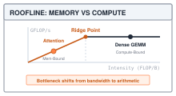

# Profiling: The Roofline Model {#sec-profiling}

A `Linear(3, 2)` layer holds eight parameters: six weights and two biases. Passing four rows through it still uses those same eight parameters, but the matrix product performs forty-eight floating-point operations instead of twelve. Storage stayed fixed while work grew. Elapsed time is a third quantity, and neither count determines it on its own.

@sec-milestone-2 assembled a language model that predicts the next token from a prefix. The next task is to understand the cost of that prediction before changing the implementation. A **profiler** combines counts from shapes with measurements from execution. This chapter builds that combination and introduces the **roofline model**, which compares the cost of arithmetic with the cost of moving data.

The distinction matters throughout the optimization chapters. Smaller integer representations can reduce stored bytes; combining operations can avoid intermediate arrays; caching can reuse earlier results. Each change needs a correctness check and a timing comparison. The profiler supplies those comparisons, while the roofline supplies a hypothesis about the limiting resource. A hypothesis becomes a diagnosis only when its byte counts and hardware assumptions describe the computation being measured.

{#fig-roofline-model}

---

## The Problem

The natural way to estimate how long a computation takes is to count its arithmetic. A Linear layer with $n$ inputs and $m$ outputs, applied to $R$ rows, does $2Rnm$ floating-point operations, or FLOPs, counting one for each multiply and one for each add. Doubling the rows doubles the FLOPs, which suggests doubling the time.

Try it. Take one weight matrix the size of a real model's layer and push two rows through it, then sixteen. The second call does eight times the arithmetic.

```python
import time
import numpy as np

rng = np.random.default_rng(0)
# One Linear weight occupies 67,108,864 bytes.
W = rng.standard_normal((4096, 4096), dtype=np.float32)

def time_ms(rows):
    x = rng.standard_normal((rows, 4096), dtype=np.float32)
    for _ in range(5):                      # warmup, explained below
        x @ W
    t0 = time.perf_counter()
    for _ in range(20):
        x @ W
    return (time.perf_counter() - t0) / 20 * 1000.0

print(f"2 rows:  {time_ms(2):.2f} ms")
print(f"16 rows: {time_ms(16):.2f} ms")
```

This experiment deliberately has no expected pair of timings. The second call does eight times as much arithmetic, but it need not take eight times as long. Both calls reuse the same weight matrix, and the numerical library can choose different matrix-multiply routines for different shapes. Record the measurements on the machine that will run the workload.

A nearly flat pair would be evidence against predicting time from FLOPs alone. One possible explanation is that fetching the weights costs more than the arithmetic, allowing additional rows to reuse data already fetched. Another is a change in the library's execution path. The timer alone does not distinguish them. Counting both operations and bytes gives a model against which to test those explanations.

---

## The Idea

### Two costs, two rates

Every operation a model performs has two costs. It does some number of floating-point operations, call it $F$. It also moves some number of bytes, $Q$, between memory and the processor: weights read in, activations read in, results written out. The machine, in turn, has two rates. It can perform at most $P_{\text{peak}}$ FLOPs per second, and it can move at most $B_{\text{peak}}$ bytes per second between memory and the processor, its memory bandwidth.

The arithmetic alone needs at least $F / P_{\text{peak}}$ seconds. Moving the bytes needs at least $Q / B_{\text{peak}}$ seconds. Both must finish, so elapsed time cannot be less than the larger of those lower bounds. The idealized model allows arithmetic and transfers to overlap; incomplete overlap or extra work makes execution slower:

$$T \;\ge\; \max\!\left(\frac{F}{P_{\text{peak}}},\; \frac{Q}{B_{\text{peak}}}\right)$$

For a large weight matrix and a small number of rows, the weight reads can dominate $Q$. Increasing the rows then raises the arithmetic term much faster than the transfer term. If transfer remains the larger term, the model predicts little change in the lower bound. This is a conditional explanation for flat timings, not proof that the experiment reached the bound.

### Arithmetic intensity and the roofline

Their ratio summarizes the balance between these costs. **Arithmetic intensity** is the FLOPs an operation performs per byte it moves:

$$I = \frac{F}{Q} \quad \text{(FLOPs per byte)}$$

An operation with high intensity does a lot of work on each byte it fetches; an operation with low intensity fetches a byte, touches it once or twice, and throws it away. Rewrite the time bound as achieved performance, $F / T$, and it becomes the **roofline**:

$$\frac{F}{T} \;\le\; \min\!\left(P_{\text{peak}},\; I \times B_{\text{peak}}\right)$$

::: {.column-margin}
{width="100%"}
*The Roofline model: operational intensity separates the memory-bound bandwidth slope from the compute-bound peak ceiling.*
:::

Plotted against $I$, as in @fig-roofline-model, the right-hand side is a slanted line that rises with intensity until it hits a flat ceiling at $P_{\text{peak}}$. The corner is the **ridge point**, the intensity at which the two ceilings meet:

$$I_{\text{ridge}} = \frac{P_{\text{peak}}}{B_{\text{peak}}}$$

Left of the ridge, the model's lower ceiling comes from memory bandwidth; this is its **memory-bound** region. Reducing transferred bytes or increasing available bandwidth raises that ceiling. Right of the ridge, peak arithmetic throughput supplies the lower ceiling; this is its **compute-bound** region. Fewer FLOPs or faster arithmetic can then reduce the time bound. Real operations can run below both ceilings because of costs such as Python calls, allocation, or incomplete use of the processor.

The illustrative machine in @fig-roofline-model has a peak of 1,000 GFLOP/s and bandwidth of 200 GB/s. Here a GFLOP is a billion floating-point operations, and a GB is a billion bytes. Its ridge is $1000 / 200 = 5$ FLOPs per byte. An operation at 2 FLOPs per byte has a ceiling of $2 \times 200 = 400$ GFLOP/s. These are chosen numbers that make the relationship visible, not specifications for the reader's computer.

### Why a Linear layer's intensity grows with its row count

Apply the definition to the layer that dominates every model in this book. A Linear layer with $n$ inputs, $m$ outputs, and $R$ rows does $F = 2Rnm$ FLOPs. It reads $4nm$ bytes of weights (four per float32), reads $4Rn$ bytes of input, and writes $4Rm$ bytes of output. When $R$ is small compared to $n$ and $m$, the weights dominate the bytes:

$$I \;\approx\; \frac{2Rnm}{4nm} \;=\; \frac{R}{2}$$

Under this traffic model, a Linear layer's intensity is roughly half its row count. The approximation assumes float32 weights, one transfer of each weight, and small input and output arrays relative to the weight matrix. One row gives about 0.5 FLOPs per byte; sixty-four rows give about 32. Rows can come from several examples in a batch or several positions in a sequence.

This explains why the generation algorithm matters. @sec-transformers's ordinary `GPT.generate` recomputes the supplied prefix, so a prefix of length $S$ sends $S$ rows through each projection. Processing only the newest position requires the cache introduced in @sec-memoization, and even then attention must read earlier keys and values. An `S = 1` forward pass here is a one-token input, not a cached decoding step with a long history.

{#fig-weight-streaming-reuse fig-alt="Diagram contrasting memory bandwidth starvation at batch size 1 with compute-bound weight reuse at batch size 64."}

::: {#nbk-profiling-tinygpt-intensity .callout-notebook title="Napkin math: TinyGPT operational intensity across prefill and decode"}
Consider the reference `TinyGPT` configuration ($d_{\text{model}}=128$, $n_{\text{layers}}=4$, context $S$, vocabulary $V=1000$). Each Transformer block contains $4 d^2$ projection parameters in attention ($W_Q, W_K, W_V, W_O$) and $8 d^2$ parameters in the two-layer MLP ($W_1, W_2$).

Across $L=4$ layers, parameter weights total approximately $12 L d^2 \approx 786\text{ KB}$ in FP32 ($196,608$ floats $\times 4$ bytes), dominating activation traffic when batch size is 1:

- **Autoregressive Decode ($S=1$)**: A single new token processes each weight matrix once. Arithmetic is $2 \times 1 \times 196,608 \approx 3.93 \times 10^5$ FLOPs. Memory traffic is dominated by reading the $786\text{ KB}$ of weights.
  $$I_{\text{decode}} \approx \frac{3.93 \times 10^5\text{ FLOPs}}{7.86 \times 10^5\text{ Bytes}} \approx 0.50\text{ FLOP/B}$$
  At $0.50\text{ FLOP/B}$, execution sits deeply in the memory-bound slope of the roofline.

- **Prompt Prefill ($S=16$)**: The entire prompt of 16 tokens passes through simultaneously. Arithmetic scales linearly to $2 \times 16 \times 196,608 \approx 6.29 \times 10^6$ FLOPs, while weight reads remain $786\text{ KB}$:
  $$I_{\text{prefill}} \approx \frac{6.29 \times 10^6\text{ FLOPs}}{7.86 \times 10^5\text{ Bytes}} \approx 8.0\text{ FLOP/B}$$
  Arithmetic intensity increases $16\times$, pushing execution toward or past the ridge point of typical desktop processors.
:::

### Measuring instead of assuming

The roofline needs an operation count $F$, a traffic estimate $Q$, and applicable machine ceilings. Layer shapes supply the first. For an isolated matrix multiply, counting each input and weight read once and each output write once gives a useful traffic model. For a whole model, parameter storage plus boundary activations does not suffice: intermediate arrays add transfers, embedding lookups touch selected rows, and caches, smaller and faster storage levels that retain recently used data, may serve repeated reads without accessing main memory.

A timer supplies elapsed time $T$, from which $F/T$ is an achieved compute rate. Dividing the modeled $Q$ by $T$ gives a rate under that traffic assumption. A row-count sweep can reveal patterns consistent with bandwidth or compute limits, but it does not automatically measure either hardware peak. The worked trace keeps the observed times and the assumed roofline separate.

---

## The Code

::: {.column-margin}
**Source Code Mapping**
The listings in this chapter are extracted from Module 14 (`src/14_profiling/14_profiling.py`), exported as `tinytorch.perf.profiling`. `Profiler` counts parameters and FLOPs, estimates live storage with allocation tracing, and times repeated forward calls. Its bottleneck label is a heuristic computed from those results. The short `Roofline` class later in this section is book-only code; it applies explicitly supplied compute and bandwidth assumptions.
:::

Begin at `Profiler.profile_forward_pass(model, input_tensor)`, the entry point that joins the counters to execution. It reads the parameter count and a per-sample FLOP estimate, probes memory using a separate dummy input, then times repeated calls on the supplied input. The returned dictionary mixes those sources, so reading it requires keeping their meanings separate. We follow each helper below, then return to the entry point to check how it combines a per-sample count with a whole-batch time.

### Counting parameters and bytes

Parameter storage determines whether a model can fit in memory before any input is processed. For the opening `Linear(3, 2)`, eight float32 parameters occupy $8 \times 4 = 32$ bytes. Counting the arrays also avoids omissions when a model contains biases, normalization parameters, or lookup tables in addition to weight matrices.

The architecture provides a useful independent check, but the framework can count the arrays it already owns. Each parameter is a `Tensor` around a NumPy array, and `.data.size` gives its element count. The model's `parameters()` method collects those tensors, so the main path is a sum over that list.



A model with `parameters()` takes the first branch, which sums the sizes of the tensors that method returns. This includes both `Sequential` and `GPT`; their own parameter methods collect the child layers. Without that method, an object with a `weight` takes the fallback helper, which counts its weight and optional bias. An object exposing neither contributes zero. The profiler relies on the model to provide the parameter list; it does not discover arbitrary arrays hidden inside a custom object.



The byte calculation assumes float32 storage and multiplies the element count by `BYTES_PER_FLOAT32`, which is four. That remains the physical dtype of TinyTorch's simulated quantized tensors in @sec-quantization; their separate analytical INT8 report describes a proposed packed representation. A container that really stores several dtypes would instead sum each array's `nbytes`. The module divides by `MB_TO_BYTES = 1024 * 1024`, so its `memory_mb` fields use binary scaling: TinyGPT's 4,328,448 parameter bytes print as 4.13. Parameter storage can approximate traffic for a dense layer whose weights must all be fetched, but it does not count how many times a pass reads each byte or whether a cache serves those reads.

### Counting FLOPs

Operation counts answer a different question from parameter counts. The opening layer has six weights whether the input contains one row or four, but its matrix-product work grows from twelve FLOPs to forty-eight. A count computed before execution makes that distinction visible without paying for a timed forward pass.

Counting each multiplication as it executes would add work to the operation under study. Instead, the profiler reads shapes. A Linear matrix product costs $2 \times \text{rows} \times \text{in} \times \text{out}$ under the multiply-plus-add convention. This is a conventional estimate: it omits the bias addition and treats every dot-product term as one multiplication plus one addition. In a transformer block, the two attention matrix products add $4 B S^2 D$ FLOPs for batch $B$, sequence length $S$, and embedding width $D$. The GPT counter omits embeddings, normalization, activations, softmax, and residual additions; these can still consume time and memory.

The module counts per sample, with the outer batch dimension excluded. For Linear input `(B, n)`, one sample is one row. For `(B, S, n)`, one sample contains $S$ rows, so `_count_linear_flops` includes that sequence-length factor. Only the outer batch factor remains for the caller.



The input width comes from the input shape and the output width from the weight, which is stored as `[in, out]` since @sec-layers. `count_flops` dispatches on what it is handed.



A flat `Sequential` sums its layers in order and propagates the shape after each Linear, convolution, or pooling layer. The shape update matters: a convolution after pooling must be counted on the smaller image. Pooling and other fallback layers receive an estimate of one operation per input element, not an exact operation count. A GPT is recognized by `blocks` and `embed_dim`, and uses a separate sequence-level rule.



Each block holds six Linear layers: four attention projections and two MLP projections. The helper obtains a one-row count for each and multiplies by $S$, then adds $4 S^2 D$ for attention. The output head contributes one more Linear count. Four blocks therefore contain twenty-four projections plus the head, and the worked trace checks their sum.

Omitting an operation from this FLOP estimate does not make it free. An activation that reads one array and produces another still allocates and moves data. TinyTorch also implements compound activations with several NumPy operations. This is why a shape counter and a timer complement each other, and why later fusion experiments must measure the whole changed computation.

### Timing a forward pass

A single call supplies one sample of elapsed time. It can include one-time initialization or contend with another process for the processor. `measure_latency` first runs **warmup** calls whose times it discards, then records repeated calls individually. Warmup targets steady execution; it deliberately does not measure the first-call cost.



The method rejects zero measurement iterations and negative warmup counts. Each timed iteration reads `time.perf_counter()` immediately before and after `model.forward(input_tensor)` and converts the difference from seconds to milliseconds. The clock is intended for elapsed-time intervals. Storing each difference allows the method to return their median, or **p50**, rather than letting one unusually slow call determine the result. For times `[1, 1, 1, 1, 9]` milliseconds, the median is 1 while the mean is 2.6.

A **p99** reports the 99th percentile of the measured times and describes their slow tail. A wide gap between p50 and p99 is a reason to investigate variability, not evidence for one particular cause. Module 14 returns only p50. It also calls the model repeatedly without resetting its state or switching its mode, so comparisons must use the same model configuration. A stateful generation loop needs an explicit reset protocol before this timer can make its runs comparable.

### Memory during a pass

A forward pass can allocate many temporaries even when its parameter arrays already exist. `measure_memory` asks how much allocation occurs while a dummy forward pass runs. This is a different question from how many bytes cross the memory bus. An array reused many times contributes once to live storage and many times to traffic; an embedding table may occupy memory while a lookup touches only one row.



Read the ownership rule first. The method starts `tracemalloc` only if no caller-owned tracing session exists. It records the current allocated-byte baseline, counts parameter storage, creates a dummy input, and calls `forward`. `_dummy_input` produces token IDs for a model exposing `vocab_size`, otherwise floating-point activations. The separate dummy pass has the supplied input's shape, but not its values.

The activation estimate uses the actual input and output array sizes. If the output shares the input buffer, `np.shares_memory` prevents counting that buffer twice. The traced peak minus the baseline estimates newly allocated bytes. Existing parameter storage is then added, because those weights remain live during the pass. Subtracting the baseline first also avoids counting already-traced parameters twice when a caller started tracing earlier.

For example, 16 MB of existing parameters and a new 4 MB output require at least 20 MB of live storage, even if the input is tiny. Taking the larger of 16 and 4 would miss their simultaneous lifetime. The method instead adds existing parameters to new allocations, then uses `max` to keep the result at least as large as the known parameters plus boundary activations. All these MB values use the profiler's binary scaling.

The `finally` block stops only a tracing session this call started, including when `forward` raises. A caller's earlier allocation peak can still inflate the result because the method preserves that session's history. The report is an estimate of model-related live storage, not total process memory or a count of bytes transferred from main memory. `memory_efficiency` divides the estimated useful storage by that peak; it is not hardware utilization.

### The roofline and the profiler

The entry point must keep the origins of its numbers visible. FLOPs come from shapes, latency comes from execution, and peak memory combines counted storage with traced allocations. The next helpers turn them into rates and a classification, but arithmetic on a measurement does not remove its assumptions.



The first rate divides estimated batch FLOPs by measured batch time. The second divides reported peak storage by that time and calls the result `memory_bandwidth_mbs`. Its units resemble bandwidth, but its numerator is footprint rather than transferred bytes. The helper also divides achieved GFLOP/s by an assumed 100 GFLOP/s and clamps the result to one. That `computational_efficiency` field is a comparison with a constant, not a measured percentage of this machine's capacity.



The classifier compares `memory_bandwidth_mbs` with `100 * gflops_per_second`. Both rates divide by the same elapsed time, so time cancels from the comparison. The label is therefore determined by footprint relative to counted operations. Because the footprint field uses $2^{20}$ bytes per MB, the threshold corresponds to approximately 9.54 FLOPs per footprint byte. It would be 10 with decimal megabytes. Neither version uses a measured machine ceiling or actual traffic, so `memory` and `compute` are heuristic labels. `profile_forward_pass` returns them alongside the underlying numbers.



The key join occurs at `batch_flops = flops * batch_size`. `count_flops` reports one sample, whereas `measure_latency` times the whole input tensor. Omitting the multiplier makes a larger batch appear artificially inefficient. For `Linear(3, 2)` and an input of shape `(4, 3)`, the parameter count is eight including bias, the per-sample matrix-product count is twelve, and `batch_flops` is forty-eight. A GPT sample is a whole sequence, so its sequence-length cost is already inside `flops`; only the outer batch dimension is multiplied here. The entry point also chooses five warmup calls and twenty timed calls rather than the timer's defaults.

The returned fields retain those distinctions instead of collapsing them into one score. `profile_backward_pass`, despite its name, estimates backward cost from the forward report; it does not execute `backward()`. For the roofline calculation below we need explicit compute and bandwidth ceilings. The following book-only class holds those assumptions and applies the bound from The Idea.

```python
class Roofline:
    """A roofline with explicitly supplied compute and bandwidth ceilings."""
    def __init__(self, peak_gflops, bandwidth_gbs):
        self.peak_gflops = peak_gflops
        self.bandwidth_gbs = bandwidth_gbs
        self.ridge = peak_gflops / bandwidth_gbs   # FLOPs per byte

    def bound_ms(self, flops, nbytes):
        """Lower time bound under the supplied ceilings and traffic model."""
        compute_ms = flops / (self.peak_gflops * 1e9) * 1e3
        memory_ms = nbytes / (self.bandwidth_gbs * 1e9) * 1e3
        return max(compute_ms, memory_ms)

    def regime(self, intensity):
        return "memory-bound" if intensity < self.ridge else "compute-bound"
```

`bound_ms` is the inequality from The Idea in milliseconds; `regime` compares intensity with the assumed ridge. Changing either ceiling changes the prediction without changing the program. A measured time above this bound can reflect overhead, extra traffic, or incomplete use of the machine. A time below it indicates that the chosen ceilings or traffic assumptions did not apply. The bound is a reference for checking a model, not a substitute for the timer.

---

## A Worked Trace

The trace first checks deterministic counts against TinyGPT. It then times an isolated matrix multiply and compares its modeled work with an explicitly hypothetical roofline. Keeping these steps separate prevents a correct parameter count from being mistaken for a measurement of memory traffic.

### Counting TinyGPT

Take the `TinyGPT` that @sec-milestone-2 trained, which is @sec-transformers's NumPy `GPT` under the name the milestone gave it, at `GPT(vocab_size=1000, embed_dim=128, num_layers=4, num_heads=4, max_seq_len=256)`. Its parameters live in two lookup tables, four identical blocks, a final LayerNorm, and the head, and each entry is a product of shapes plus a bias where the layer has one.

| Component | Shape arithmetic | Parameters |
| :--- | :--- | ---: |
| Token embedding | $1000 \times 128$ | 128,000 |
| Position table | $256 \times 128$ | 32,768 |
| Per block: two LayerNorms | $2 \times (128 + 128)$ | 512 |
| Per block: Q, K, V, output projections | $4 \times (128 \times 128 + 128)$ | 66,048 |
| Per block: MLP expand and contract | $(128 \times 512 + 512) + (512 \times 128 + 128)$ | 131,712 |
| Four blocks | $4 \times 198{,}272$ | 793,088 |
| Final LayerNorm | $128 + 128$ | 256 |
| Output head | $128 \times 1000$, no bias | 128,000 |
| **Total** | | **1,082,112** |

: Parameter count of a four-block TinyGPT with $D = 128$, a 1,000-token vocabulary, and a 256-position table, counted as @sec-transformers builds it, with a learned position table, biases on the four projections, and none on the head. {#tbl-tinygpt-params tbl-colwidths="[34,44,22]"}

At four bytes per parameter that is 4,328,448 bytes, which the profiler reports as 4.13 MB. This is storage, not $Q$: a lookup need not read its whole table, while temporary activations can be read and written several times.

FLOPs depend on the row count. Each block has six Linear layers whose in-times-out products sum to $4 \times 128^2 + 2 \times 128 \times 512 = 196{,}608$, so one row through one block costs $2 \times 196{,}608 = 393{,}216$ FLOPs in Linear layers, plus the attention products. One row through the head costs $2 \times 128 \times 1000 = 256{,}000$. Compare a one-token input ($B = 1$, $S = 1$) with a 64-token prompt ($B = 1$, $S = 64$). Both are ordinary uncached forward passes.

| Quantity | One token, $S = 1$ | Prompt, $S = 64$ |
| :--- | ---: | ---: |
| Linear FLOPs, four blocks | 1,572,864 | 100,663,296 |
| Attention products, $4 \times 4 \times S^2 \times 128$ | 2,048 | 8,388,608 |
| Head FLOPs | 256,000 | 16,384,000 |
| **Total FLOPs** | **1,830,912** | **125,435,904** |
| Storage bytes (parameters + input + logits) | 4,332,452 | 4,584,704 |
| **FLOPs per storage byte** | **0.42** | **27.4** |

: FLOP counts and boundary-storage accounting for TinyGPT at two sequence lengths. The last row is a footprint ratio, not measured arithmetic intensity. {#tbl-tinygpt-intensity tbl-colwidths="[46,27,27]"}

The longer input increases counted arithmetic by about 68.5 times, while this storage total increases by about 5.8 percent. The table deliberately excludes intermediate activations. Its last row checks the ratio of two known counts; it cannot place the model on a main-memory roofline. That would require a traffic estimate accounting for lookup rows, intermediate arrays, and reuse. The arithmetic in the listing below verifies the table without executing a forward pass. In line 1, dimensions `D, V, L, P = 128, 1000, 4, 256` define the TinyGPT configuration. Lines 2--6 express the analytical parameter formulas, verified by `assert params == 1_082_112` in line 7. The loop in lines 9--14 evaluates total FLOPs and storage footprint across prompt lengths $S=1$ and $S=64$, printing the ratios $0.42$ and $27.42$ matching @tbl-tinygpt-intensity.

```python
D, V, L, P = 128, 1000, 4, 256
per_block_linear = 2 * (4 * D * D + 2 * D * 4 * D)     # six Linear layers, one row
head = 2 * D * V
block_params = (4 * D + 4 * (D * D + D)
                + D * 4 * D + 4 * D + 4 * D * D + D)
params = V * D + P * D + L * block_params + 2 * D + D * V
assert params == 1_082_112

for S in (1, 64):
    flops = L * S * per_block_linear + L * 4 * S * S * D + S * head
    # Float32 parameters, token IDs, and output logits.
    nbytes = 4 * params + 4 * S + 4 * S * V
    print(f"S={S:3d}  FLOPs={flops:>12,}  bytes={nbytes:>10,}  "
          f"F/storage={flops / nbytes:5.2f}")
```

```
S=  1  FLOPs=   1,830,912  bytes= 4,332,452  F/storage= 0.42
S= 64  FLOPs= 125,435,904  bytes= 4,584,704  F/storage=27.36
```

Now the module's counters on the model itself. `count_flops` takes the input shape and, for a GPT, counts one sequence of that length.

```python
from tinytorch.core.transformers import GPT
from tinytorch.perf.profiling import Profiler

model = GPT(vocab_size=1000, embed_dim=128, num_layers=4,
            num_heads=4, max_seq_len=256)
profiler = Profiler()
print(profiler.count_parameters(model))
print(profiler.count_flops(model, (1, 1)), profiler.count_flops(model, (1, 64)))
```

```
1082112
1830912 125435904
```

The counters return the same three numbers as the hand calculation. The input term is four bytes per token because the reference `Tensor` stores float32 arrays, including token IDs. GPT returns `(B, S, V)` logits, so a 64-token input produces $64 \times 1000 \times 4 = 256{,}000$ output bytes. The memory probe counts those actual boundary arrays; its peak can be larger because it also traces intermediate allocations.

### Comparing a measured sweep with a model

The second half returns to the $4096 \times 4096$ weight matrix from The Problem. Its float32 storage is 67,108,864 bytes. For the traffic model, assume the multiplication reads each weight and input once and writes each output once. This gives $Q = 4(N^2 + 2RN)$ for a square weight of width $N$ and $R$ rows. The assumption describes an ideal transfer count at a chosen memory boundary; it does not count NumPy's internal traffic.

The timer expects a `forward` method and an input object. This wrapper deliberately returns the NumPy result directly to isolate the matrix multiplication rather than add a Tensor construction. Input and weight allocation happen before timing. The sweep prints actual local times alongside achieved FLOP/s and a transfer-rate estimate under the stated $Q$ model.

```python
import numpy as np
from tinytorch.core.tensor import Tensor

rng = np.random.default_rng(0)
N = 4096
W = rng.standard_normal((N, N), dtype=np.float32)

class MatMul:
    def forward(self, x):
        return np.matmul(x.data, W)

for rows in (1, 2, 8, 16, 64, 256, 1024):
    X = Tensor(rng.standard_normal((rows, N), dtype=np.float32))
    ms = profiler.measure_latency(MatMul(), X, warmup=5, iterations=50)
    flops = 2 * rows * N * N
    nbytes = W.nbytes + X.data.nbytes + rows * N * 4
    seconds = ms / 1000
    print(f"rows={rows:4d}  I_model={flops / nbytes:6.1f}  "
          f"p50={ms:7.3f} ms  GFLOP/s={flops / 1e9 / seconds:7.1f}  "
          f"modeled GB/s={nbytes / 1e9 / seconds:6.1f}")
```

A flat region in measured time suggests that additional arithmetic is reusing a cost already paid. A region where FLOP/s levels off suggests a limit on arithmetic throughput. These patterns guide investigation, but neither establishes the machine's peak by itself. Cache reuse, changes in the library routine, and other processes can change the curve. Record the matrix size, dtype, library configuration, and timing protocol with any result intended for comparison.

For a calculation independent of a particular machine, use the illustrative ceilings from @fig-roofline-model: 1,000 GFLOP/s and 200 GB/s. The resulting ridge is 5 FLOPs per byte. @Tbl-roofline-sweep shows the two time terms and their maximum; every entry is calculated, not measured.

| Rows | Modeled intensity | Compute term (ms) | Transfer term (ms) | Bound (ms) |
| ---: | ---: | ---: | ---: | ---: |
| 1 | 0.50 | 0.034 | 0.336 | 0.336 |
| 2 | 1.00 | 0.067 | 0.336 | 0.336 |
| 8 | 3.98 | 0.268 | 0.337 | 0.337 |
| 16 | 7.94 | 0.537 | 0.338 | 0.537 |
| 64 | 31.03 | 2.147 | 0.346 | 2.147 |
| 256 | 113.78 | 8.590 | 0.377 | 8.590 |
| 1,024 | 341.33 | 34.360 | 0.503 | 34.360 |

: Calculated roofline bounds for a $4096 \times 4096$ float32 multiplication, using hypothetical 1,000 GFLOP/s compute and 200 GB/s bandwidth ceilings. Intensity is in FLOPs per modeled byte. These are lower bounds under the stated assumptions, not benchmark results. {#tbl-roofline-sweep tbl-colwidths="[12,23,23,23,19]"}

At eight rows, the transfer term of 0.337 ms exceeds the compute term of 0.268 ms. At sixteen rows, arithmetic becomes the larger term. The corresponding intensities, 3.98 and 7.94, lie on opposite sides of the assumed ridge of 5. The following checks reproduce those two rows using the book-only class.

```python
roof = Roofline(peak_gflops=1000, bandwidth_gbs=200)
assert roof.ridge == 5
for rows in (8, 16):
    flops = 2 * rows * N * N
    nbytes = 4 * (N * N + 2 * rows * N)
    intensity = flops / nbytes
    print(rows, roof.regime(intensity),
          f"{roof.bound_ms(flops, nbytes):.3f} ms")
```

```text
8 memory-bound 0.337 ms
16 compute-bound 0.537 ms
```

This calculation explains how row count changes the limiting term. It does not predict the reader's timings unless both ceilings and the transfer model apply to that machine and routine. A measured time above the bound leaves several possible causes; a time below it is a reason to revise the assumptions. The useful next experiment changes one factor, such as matrix size or row count, and checks whether the explanation still fits.

### Reading a complete forward report

The TinyGPT counter checks did not execute the model. `profile_forward_pass` does: once for its dummy memory probe, five times for warmup, and twenty times for timing. The following call measures a 64-token input and checks the report's accounting without promising any particular latency or allocation peak.

```python
ids = Tensor(rng.integers(0, 1000, size=(1, 64)))
report = profiler.profile_forward_pass(model, ids)
assert report['parameters'] == 1_082_112
assert report['flops'] == 125_435_904
assert report['batch_flops'] == report['flops']  # batch size is one
seconds = max(report['latency_ms'] / 1000, 1e-6)
expected = report['batch_flops'] / 1e9 / seconds
assert np.isclose(report['gflops_per_second'], expected)
print(f"p50: {report['latency_ms']:.3f} ms")
print(f"peak footprint estimate: {report['peak_memory_mb']:.3f} MB")
print(f"heuristic label: {report['bottleneck']}")
```

The assertions pin down what can be predicted from shapes and the report's own convention. The printed values require execution. In particular, the heuristic label uses a storage-over-work ratio; it is not the result of placing TinyGPT on the hypothetical roofline above. A defensible optimization experiment preserves this distinction when comparing the original model with a changed one.

---

## From TinyTorch to Production

TinyTorch exposes the accounting in ordinary Python. Production profiling adds finer observation points so that a slow forward pass can be traced to particular operations. PyTorch's `torch.profiler` can record CPU and accelerator activities, input shapes, and tensor allocation information. Its optional FLOP estimate uses formulas for selected operations, including matrix multiplication and two-dimensional convolution; even a production report requires checking which operations it counts. These capabilities are described in the [PyTorch profiler documentation](https://docs.pytorch.org/docs/stable/profiler.html).

Timing requires another distinction on a GPU. The CPU can queue an operation and return before the GPU finishes it. Timing only that call measures submission, not completion. An accurate device measurement uses timing events on the GPU or waits for queued work to finish before reading the host clock. PyTorch documents both methods in its [CUDA timing guidance](https://docs.pytorch.org/docs/stable/notes/cuda.html#asynchronous-execution). TinyTorch's NumPy timer measures the synchronous CPU forward call used in this module.

Allocation tracking still does not reveal memory traffic. NVIDIA's Nsight Compute collects hardware metrics for GPU kernels, the individual device computations, and offers roofline analysis using compute and memory information. Its [profiling guide](https://docs.nvidia.com/nsight-compute/ProfilingGuide/index.html#roofline-charts) distinguishes traffic at different cache and memory levels. A weight read served from cache does not have the same cost as fetching that weight from main memory. The chosen memory boundary therefore belongs in the definition of $Q$.

The comparison in @tbl-profiler-comparison separates the three kinds of evidence. A framework trace locates operations; an allocation report describes storage lifetime; hardware traffic metrics test transfer assumptions. These tools answer related questions, but their byte fields are not interchangeable.

::: {#psp-profiling-nsight-profiler .callout-production title="Production bridge: PyTorch Profiler and NVIDIA Nsight Systems"}
TinyTorch uses analytical FLOP accounting and Python's `time.perf_counter` to estimate compute rates and memory bottlenecks on the host CPU. In production GPU environments, profiling requires visibility into hardware execution pipelines:

1. **PyTorch Profiler (`torch.profiler`)**: Records operator execution timelines, CPU-to-GPU kernel dispatch latency, memory allocation/free events (`record_shapes=True`, `profile_memory=True`), and exports execution traces viewable in Chrome (`chrome://tracing`) or Perfetto.
2. **NVIDIA Nsight Systems (`nsys`)**: Traces system-wide execution, correlating host CPU threads, CUDA runtime calls, PCIe memory transfers, and GPU kernel execution on a unified microsecond timeline to detect CPU starvation and pipeline bubbles.
3. **NVIDIA Nsight Compute (`ncu`)**: Profiles individual CUDA kernels at the hardware instruction level, measuring streaming multiprocessor (SM) occupancy, warp stall reasons, Tensor Core utilization, and cache hit rates against hardware roofline limits.
:::

| Quantity | TinyTorch `Profiler` | Production observation |
| :--- | :--- | :--- |
| FLOPs | Shape formulas plus fallback estimates | Operator formulas with documented coverage |
| Storage | Parameter count, boundary arrays, traced allocation peak | Framework allocation and lifetime records |
| Traffic | No hardware traffic counter | Hardware metrics at a specified memory level |
| Time | Host clock around synchronous `forward` | Host/device events and operation timelines |
| Bottleneck | Fixed footprint-to-work heuristic | Workload evidence compared with applicable ceilings |

: Measurement sources in the reference profiler and production tools. Storage, traffic, and time remain separate quantities. {#tbl-profiler-comparison tbl-colwidths="[16,40,44]"}

The transferable habit is to make each optimization claim match its evidence. Reducing parameter bytes establishes a storage change. Reducing modeled transfers establishes a prediction under stated assumptions. A repeatable timing improvement on the same workload establishes an execution result. Subsequent chapters need all three distinctions because a numerically faithful simulation of a smaller representation can still allocate and execute in float32.

---

## Summary

`profile_forward_pass` joins shape-based counts, a separate memory probe, and repeated timed calls. Its central accounting invariant is that FLOPs per sample must be multiplied by batch size before division by whole-batch time. Its memory probe adds existing parameters to new traced allocations, preserves a caller's tracing session, and reports a footprint estimate. Neither that footprint nor the heuristic bottleneck label measures memory traffic.

The roofline adds an explicit model of transferred bytes and machine ceilings. Its bound, $T \ge \max(F/P_{\text{peak}}, Q/B_{\text{peak}})$, explains why more arithmetic need not increase time proportionally. For a float32 Linear layer with few rows and one transfer per weight, intensity is approximately half the row count. That gives a reason to investigate weight traffic, while the timer determines whether a proposed change helps the actual workload. @sec-quantization follows one such proposal: represent weights with integer codes, check reconstruction error, and distinguish modeled packed storage from the NumPy arrays that execute the reference.

---

## Exercises

1. **Follow the batch factor.** Profile `Linear(3, 2)` on inputs of shapes `(1, 3)` and `(4, 3)`. Predict the parameter count, per-sample FLOPs, and `batch_flops` before running either call. Then try `(4, 5, 3)`. Which factor belongs inside `count_flops`, and which belongs in `profile_forward_pass`? Check the throughput identity using the measured latency without assuming the larger input is faster per row.

2. **Propagate a pooling shape.** Count FLOPs for `Sequential(Conv2d(1, 2, 3), MaxPool2d(2), Conv2d(2, 3, 3))` on shape `(5, 1, 10, 10)`. Write the spatial dimensions after every layer and check each convolution's count with `_count_conv_flops`. The profiler charges pooling one operation per input element. How does forgetting its output-shape change corrupt the second convolution's count?

3. **Separate storage from traffic.** Use @tbl-tinygpt-params to count the full token embedding table's bytes and the bytes in one selected row. Explain why adding the full table to $Q$ for one lookup overstates that lookup's required data. Then name one intermediate array in a transformer block that the boundary-storage total in @tbl-tinygpt-intensity leaves out.

4. **Check the roofline assumptions.** Reproduce the calculated bounds in @tbl-roofline-sweep, then rerun the timing sweep with $N = 512$. The smaller weight contains 1,048,576 bytes. If cache reuse changes the timing pattern, which part of the main-memory traffic model needs revision? Do the timings alone prove that cache reuse caused the change?

5. **Measure the tail.** Return median and p99 from the same `measure_latency` samples. Compare one model under two machine loads; report repetitions, warmup, and both percentiles. Explain why variability alone cannot identify its cause.
