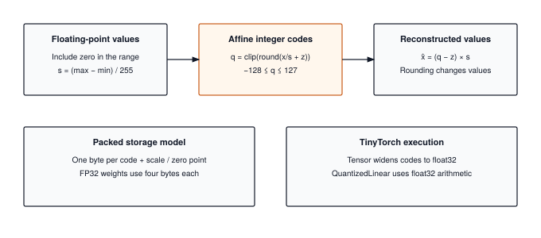

# INT8 Quantization: Compressing Floats into 8-Bit Integers {#sec-quantization}

Chapter 14 ended with a diagnosis. When our transformer generates one token at a time, every weight is read from memory once and used for two arithmetic operations, so the processor spends nearly all of its time waiting for weights to arrive rather than computing with them. The question a practitioner asks next is blunt. Can we make the weights smaller without retraining the model, and what does that cost in accuracy?

We build `quantize_int8`, `dequantize_int8`, and `QuantizedLinear` by following a weight from its float value to an integer code and back. A scale and zero point describe the grid. TinyTorch simulates that grid inside its existing float32 `Tensor`, so its tests expose rounding and saturation while its memory report calculates the storage a packed INT8 container would need. A separate book-only integer multiply makes the rescaling rule visible. This distinction lets us check the mechanism without mistaking a smaller set of possible values for a smaller allocation.

{#fig-quantization-geometry}

---

## The Problem

A 32-bit float costs 4 bytes. That is the whole problem, and a napkin shows how much it hurts. A single square linear layer with 4096 inputs and 4096 outputs holds $4096 \times 4096 = 16{,}777{,}216$ weights, which is 67 MB in FP32. Generating one token multiplies one activation vector by that matrix, so the processor must stream all 67 MB through memory to do $2 \times 4096 \times 4096 \approx 33.5$ million arithmetic operations. That is 0.5 operations per byte, the arithmetic intensity Chapter 14 taught us to compute, and it sits far below the ridge point of any processor built in the last decade. At a memory bandwidth of 100 GB/s, streaming the weights alone takes 0.67 ms per token per layer. No amount of faster arithmetic changes that number. The only lever left is the byte count.


::: {#nbk-quantization-int8-memory-compute-gains .callout-notebook title="Napkin math for a 4096 by 4096 layer"}
- Weights: $16{,}777{,}216$. FP32 storage: $67.1$ MB. INT8 storage: $16.8$ MB.
- Bytes streamed per generated token drop by $4\times$; at $100$ GB/s the streaming time drops from $671\ \mu\text{s}$ to $168\ \mu\text{s}$.
- Arithmetic operations per token are unchanged at $33.5$ million. The intensity rises from $0.5$ to $2.0$ operations per byte, still memory-bound, but four times less so.
:::

The obvious first attempt fails immediately. Weights in a trained network are small numbers; Kaiming initialization (Chapter 3) puts them within a few tenths of zero, and training rarely moves them past $\pm 1$. Cast them to integers and they vanish:

```python
weights = [0.0123, -0.0871, 0.0456, -0.0012]
print([int(w) for w in weights])   # every weight becomes 0
```

The integers $-128$ through $127$ are perfectly good for counting, but the weights do not live on that grid. Quantization is the trick of moving them onto it.

---

## The Idea

### One scale and one zero point

Take a tensor whose values lie between $x_{\min}$ and $x_{\max}$. Stretch that interval so that it includes $0.0$ (if the values are all positive, as the output of a ReLU is, the interval grows down to zero), and then spread it evenly over the 256 codes a signed byte can hold. The width of one step is the **scale**:

$$S = \frac{x_{\max} - x_{\min}}{255}$$

Divide every value by $S$ and the tensor spans 255 steps. Shifting it so that $x_{\min}$ lands on $-128$ takes one integer offset, the **zero point** $Z$, which is the code that represents $0.0$:

$$Z = \text{round}\!\left(-128 - \frac{x_{\min}}{S}\right), \qquad q = \text{clamp}\!\left(\text{round}\!\left(\frac{x}{S}\right) + Z,\; -128,\; 127\right)$$

Here $x$ is the original float and $q$ is its 8-bit code; the clamp is a safety net, since nothing escapes the byte by construction when $S$ and $Z$ come from the tensor itself, but a scale chosen from other data might let something through. Stretching the interval to include zero keeps $Z$ inside the byte, but it can enlarge the step substantially for a narrow interval far from zero. The reconstruction bound must use that enlarged interval. To get a float back, undo the shift and the division:

$$\hat{x} = (q - Z) \times S$$

The hat marks that $\hat{x}$ is a reconstruction, not the original. Because $q$ was rounded, $\hat{x}$ differs from $x$ by at most half a step:

$$|x - \hat{x}| \le \frac{S}{2} = \frac{x_{\max} - x_{\min}}{510}$$

That bound is the entire accuracy story of this chapter. Every value is reconstructed to within $0.2\%$ of the tensor's range, regardless of the tensor's size. The bound is also the warning. It is relative to the range, not to $x$. A weight of $0.001$ in a tensor whose values span $[-1, 1]$ is rounded to the grid step $S \approx 0.0078$, and comes back as $0$. Small values in a tensor with one large outlier are where quantization loses information.

This mapping is called **asymmetric** because the grid does not have to be centered on zero; it is the form Module 15 uses, the form PyTorch and TFLite default to, and the one every listing in this chapter carries. The **symmetric** special case takes $x_{\min} = -x_{\max}$, so that $Z = 0$ and the formulas lose a term; it wastes codes when a tensor is all positive, which is why the general form earns its extra integer. A tensor of all one value has no range at all, and the module handles it with a separate branch that encodes every element as code $0$ and lets $Z$ and $S$ carry the constant.

### Multiplying integers instead of floats

The scale does more than shrink storage, and this is the half of the model that makes the chapter worth a layer rather than a storage format. Write the activation row $x$ and the weight matrix $W$ in terms of their codes, $x = S_x (Q_x - Z_x)$ and $W = S_W (Q_W - Z_W)$, and the linear layer's product factors:

$$y = x W^{T} = (S_x S_W)\,\big((Q_x - Z_x)(Q_W - Z_W)^{T}\big)$$

Everything inside the last parentheses is integer arithmetic: subtract each zero point from its codes, which is still an integer, then take the dot products. The two scales are ordinary floats, and they multiply the result exactly once per output value. That is the whole reason for insisting on a single scale per tensor. Because the scale is one number, it can be pulled out of an entire matrix multiply and applied at the end, so the dot products, which are all the work, run on 1-byte operands.

Everything in this chapter happens after training, with no gradient in sight. It is **post-training quantization**, the version a practitioner reaches for first because it needs nothing but the finished weights.

---

## The Code

::: {.callout-note title="Source Code Mapping"}
The listings in this chapter are extracted from Module 15 (`src/15_quantization/15_quantization.py`), which the package exports as `tinytorch.perf.quantization`. Its `quantize_int8` and `dequantize_int8` work on the NumPy-backed `Tensor` from Chapter 6, and `QuantizedLinear` wraps a Chapter 3 `Linear`. The one piece of code below that is not in the module is `int8_forward`, a short book function that runs the layer's multiply on the integer codes; the module's own `forward` dequantizes the weights and multiplies in float, and the text says why.
:::

### Quantize and dequantize

Start with the weights, because they are the bytes we are trying to shrink. The 4096 by 4096 layer from The Problem holds 16.8 million floats, and I want each of them stored as one byte, with a way to get a float back whenever the arithmetic needs one. Everything else in the chapter sits on this pair of functions, and Chapter 16 takes the bytes they produce as its starting point.

The Problem already showed the naive version. Cast each weight to an integer and every one of them, being smaller than 1 in magnitude, becomes 0. The layer would still occupy 16.8 MB and would compute nothing but its bias. So the real question is whether 16.8 million small floats can be moved onto the integer grid and still be told apart afterward. The scale is the answer. Measure the tensor's range, divide everything by the step that spreads that range across the byte, shift so the smallest value lands on $-128$, and round. The weights now spread across the whole byte, and each one comes back to within $S/2$ of where it started.

`quantize_int8` does the measuring, dividing, shifting, rounding, and clamping.



Steps 3 through 6 are the formulas from The Idea, in order. Step 2 is the case the formulas cannot handle, a tensor with no range, which the module encodes as all zeros and lets the scale and zero point reconstruct. Step 3 is the one that is easy to skip and wrong to skip: without it, an all-positive tensor puts $Z$ below $-128$, the clamp on the next line silently moves it, and every value comes back shifted. The comments say so because a student who removes the line sees no error, only worse accuracy. The constant branch has a different invariant. For a positive constant `c`, it chooses `scale = abs(c)`, `zero_point = -1`, and all-zero codes, so reconstruction gives `(0 - (-1)) * abs(c) = c`. A negative constant uses zero point `+1`; zero itself uses scale one and zero point zero. Putting the magnitude in the scale preserves fractional constants such as `0.25`. Testing exact equality of the extrema also matters: a tiny nonconstant interval still needs a grid, not a branch that discards its variation. Getting the float back is one line.



Run the pair on three numbers.

```python
import numpy as np
from tinytorch.core.tensor import Tensor
from tinytorch.perf.quantization import quantize_int8, dequantize_int8

x = Tensor(np.array([0.5, -0.3, 0.1], dtype=np.float32))
q, scale, zero_point = quantize_int8(x)
print(q.data, scale, zero_point)          # [127. -128.    0.] 0.003137... -32
print(dequantize_int8(q, scale, zero_point).data)   # [0.4988 -0.3012  0.1004]
```

The range is $[-0.3, 0.5]$, so the scale is $0.8 / 255 = 0.003137$ and the zero point is $\text{round}(-128 + 0.3 / 0.003137) = -32$. The code for $0.1$ is $\text{round}(31.9) - 32 = 0$, which is the zero point doing its job: $0.1$ is not zero, but it sits 32 steps above the value represented by the zero point, and the grid records that. Every reconstruction is within $S/2 \approx 0.0016$ of its original, as the bound promised. One thing to notice about the printout is that the codes print as `127.` with a decimal point. `quantize_int8` does produce an `int8` array, but it hands the array to `Tensor`, and Chapter 6's `Tensor` stores everything as float32. So in this NumPy framework the codes occupy four bytes each the moment they are wrapped, and the memory saving is accounted for by `memory_usage` below rather than realized in RAM. The arithmetic of quantization is all here; the byte saving needs a container that keeps int8, which is what PyTorch's quantized tensors are. PyTorch's names for this pair are `torch.quantize_per_tensor` and `.dequantize()`, and the "per tensor" says what ours does too, one scale and one zero point for the whole array.

The constant case can be checked independently of the general rounding bound:

```python
for value in (0.0, 0.25, -0.5):
    original = Tensor([value, value])
    codes, scale, zero = quantize_int8(original)
    restored = dequantize_int8(codes, scale, zero)
    assert np.array_equal(restored.data, original.data)
    assert np.all(codes.data == 0)
    print(value, scale, zero)
# 0.0 1.0 0
# 0.25 0.25 -1
# -0.5 0.5 1
```

`calibrate` widens the observed input range to include zero before checking equality, so its constant branch applies only to all-zero samples. A constant positive calibration set uses the ordinary grid from zero to that value. Both routes must preserve small nonzero magnitudes; replacing their equality test with a broad absolute tolerance would erase valid inputs.

### The quantized layer

A packed integer layer would keep its weight codes in one byte each and consume them directly. TinyTorch keeps float32 arrays for compatibility with the Tensor implemented earlier, so `QuantizedLinear` cannot provide that storage reduction. Reading the class is still useful because it separates three moments that an inference implementation must handle: choosing the weight grid at construction, choosing an input grid during calibration, and applying those grids during each forward pass.

The tempting way to hand it back is to call `dequantize_int8` on the weights, write the float matrix somewhere, and run the ordinary float multiply. Count the traffic. Reading the codes moves 16.8 MB, writing the float matrix moves 67 MB, and the multiply reads those 67 MB again, so the layer moves about 150 MB per token where the unquantized layer moved 67 MB. At 100 GB/s that is 1.5 ms per token per layer, more than twice as slow as what we started with. Storing the weights small and expanding them in memory before use is worse than never quantizing.

The factored product from The Idea is the way out. Run the multiply on the codes themselves, so a suitable kernel can read packed 1-byte operands, and let the float work shrink to one multiply by $S_x S_W$ per output value. The weights never become floats at all.

That leaves the activations, which have a scale of their own in the product and no obvious place to get it from. For weights, the range is known the moment training ends; look at the matrix and take its minimum and maximum. Activations depend on the input, so their range is not known until the input arrives. There are two honest options. **Dynamic quantization** computes $S_x$ and $Z_x$ from each input as it comes, which measures the current range but still rounds values and costs a pass over the activations before every multiply. **Static quantization** runs a few representative inputs through the model offline, records the range the layer sees, and freezes that as the layer's input grid. This offline step is called **calibration**, and the recorded range is only as good as the samples were representative.

`QuantizedLinear` is built from an existing `Linear`. It quantizes the weights once, at construction, and the bias too, each with its own scale and zero point, and keeps the codes.



Read `forward` against the traffic argument above. It dequantizes the weights on every call and multiplies in float, which is exactly the path The Problem warned against, and the comment says why: NumPy has no integer matrix multiply worth calling, and `Tensor` would widen the codes to float32 anyway. What this `forward` reproduces faithfully is the arithmetic of the rounding. The weights carry their grid error, and if `calibrate` has run, the input is rounded onto the calibrated grid and back before the multiply, so an input that falls outside the calibrated range saturates at the edge of the byte exactly as it would on integer hardware. That saturation is the price of skipping the per-input scan, and the last exercise makes it visible. `memory_usage` estimates one byte per weight and bias code plus eight metadata bytes per quantized array: a float32 scale and a four-byte zero point. A layer with a bias needs two such pairs. This models a packed format; it does not measure the Python object or the float32 arrays, including the retained `original_layer`.

The integer path is what production hardware runs, and it is the version worth having in your head, so here it is as book code against the same layer. It quantizes the input on the fly, subtracts both zero points, takes the dot products in 32-bit integers, and rescales once per output.

```python
def int8_forward(layer: QuantizedLinear, x: Tensor) -> np.ndarray:
    """The integer path: codes in, one rescale out. Not in Module 15."""
    q_x, x_scale, x_zero = quantize_int8(x)
    lhs = q_x.data.astype(np.int32) - x_zero                              # [rows, in]
    rhs = layer.q_weight.data.astype(np.int32) - layer.weight_zero_point  # [in, out]
    acc = lhs @ rhs                                                       # int32 dot products
    y = acc * (x_scale * layer.weight_scale)                              # one float multiply per output
    if layer.q_bias is not None:
        y = y + dequantize_int8(layer.q_bias, layer.bias_scale, layer.bias_zero_point).data
    return y
```

One detail matters for the accumulator. After the zero points are subtracted each operand spans up to 255, so one product can reach $255 \times 255 = 65{,}025$, and a dot product over $K$ inputs sums $K$ of them. A 32-bit accumulator holds up to $2{,}147{,}483{,}647$, enough for $K$ up to about $33{,}000$ inputs at the worst case; a 16-bit accumulator cannot hold even one worst-case product. This book function uses 32-bit accumulation, as does the integer-kernel design it models. NumPy's `int32` does it here, and the trace checks that the sums stay far from the edge. PyTorch's `torch.ao.nn.quantized.dynamic.Linear` is `int8_forward` with the dot products done on vector instructions.

### Quantizing a whole model

One layer is not a model. Every block of Chapter 13's transformer has six linear layers, four projections in attention and two in the MLP, and a model of any real size has dozens of blocks. Nobody is going to construct a `QuantizedLinear` for each one by hand, and doing it by hand invites a specific mistake. Calibrate every layer against the activations of the original float model, then swap the quantized layers in, and layer 3 ends up with a grid measured on inputs it will never see, because its inputs are now the outputs of a quantized layer 2. That is a wrong number rather than a slow one, and it shows up as lost accuracy with no error message.

So the loop has two jobs. Walk the model, swapping every `Linear` for its integer twin and passing everything else through untouched; and, when there is calibration data, measure each layer's inputs only after the layers before it have already been quantized. `quantize_model` does both, in place on a `Sequential`.



The ordering is in the loop itself. Layer `i` is replaced before the loop reaches layer `i + 1`, so when the helper below runs calibration data forward through layers `0` to `i - 1`, it runs through the quantized versions, and layer `i` is calibrated on the activations it will actually receive.



`_quantize_single_layer` is the two lines you would expect, construct and calibrate. The `max_samples` cap of ten keeps calibration cheap for a demo and is far too few for a real model, where the range of a layer's inputs is measured over hundreds of batches; the trace shows what ten samples cost. PyTorch's `quantize_dynamic(model, {nn.Linear})` is the same loop with a set of layer types where we wrote `isinstance`, and its static variant attaches an observer to each layer that plays the part of `_collect_layer_inputs`.

---

## A Worked Trace

A 2 by 2 weight matrix and a 2-element input are enough to check every step by hand.

$$W = \begin{bmatrix} 1.27 & -0.638 \\ 0.253 & -1.019 \end{bmatrix}, \qquad x = \begin{bmatrix} 0.5 & -0.3 \end{bmatrix}$$

**Weight grid.** The weights range from $-1.019$ to $1.27$, so $S_W = 2.289 / 255 = 0.008976$ and $Z_W = \text{round}(-128 + 1.019 / 0.008976) = \text{round}(-14.48) = -14$.

**Weight codes.** Dividing by the scale, adding the zero point, and rounding: $1.27 / 0.008976 - 14 = 127.48 \to 127$, $-0.638 / 0.008976 - 14 = -85.08 \to -85$, $0.253 / 0.008976 - 14 = 14.18 \to 14$, and $-1.019 / 0.008976 - 14 = -127.52 \to -128$.

**Input grid and codes.** The input ranges from $-0.3$ to $0.5$, so $S_x = 0.8 / 255 = 0.003137$ and $Z_x = \text{round}(-128 + 0.3 / 0.003137) = -32$. Then $0.5 / 0.003137 - 32 = 127.4 \to 127$ and $-0.3 / 0.003137 - 32 = -127.6 \to -128$.

$$Q_W = \begin{bmatrix} 127 & -85 \\ 14 & -128 \end{bmatrix}, \qquad Q_x = \begin{bmatrix} 127 & -128 \end{bmatrix}$$

**Products.** Subtracting the zero points gives the integer operands, $Q_x - Z_x = [159, -96]$ and, row by row, $Q_W - Z_W = [141, -71]$ and $[28, -114]$. The accumulators and the rescale by $S_x S_W = 2.816 \times 10^{-5}$ give the two outputs in @tbl-int8-quant-trace, alongside the exact float result.

| Output | Exact FP32 | Integer accumulator | Rescaled INT8 result | Error |
| :--- | :--- | :--- | :--- | :--- |
| $y_0$ | $0.5(1.27) + (-0.3)(-0.638) = 0.8264$ | $159(141) + (-96)(-71) = 29{,}235$ | $29{,}235 \times 2.816 \times 10^{-5} = 0.8233$ | $-0.0031$ |
| $y_1$ | $0.5(0.253) + (-0.3)(-1.019) = 0.4322$ | $159(28) + (-96)(-114) = 15{,}396$ | $15{,}396 \times 2.816 \times 10^{-5} = 0.4336$ | $+0.0014$ |

: One INT8 linear layer traced against exact FP32 arithmetic. {#tbl-int8-quant-trace tbl-colwidths="[10,30,26,26,8]"}

The first output is off by $0.003$, about a third of a percent, and the trace shows where it came from. The reconstructions are $\hat{x} = [0.4988, -0.3012]$ and, for the first row of $W$, $[1.2657, -0.6373]$; multiply those out and you get $0.8233$ exactly. Each is within its $S/2$ bound, $0.0016$ for the input and $0.0045$ for the weights, and on this row their errors pushed the same direction. Four weights that took 16 bytes now take 4 bytes plus a 4-byte scale and a zero point, and for a matrix of any real size that overhead is noise; `memory_usage` on the 4096 by 4096 layer from The Problem reports 67,125,248 bytes against 16,781,328, a ratio of 4.0.

Before trusting the class on 16 million weights, I want it to agree with the four I traced by hand. The codes, the scale, and the zero point should match the arithmetic above digit for digit, and the two forwards should land within a few thousandths of the exact product. Chapter 3's `Linear` stores its weight as inputs by outputs, so $W$ goes in transposed.

```python
from tinytorch.core.layers import Linear
from tinytorch.perf.quantization import QuantizedLinear

W = np.array([[1.27, -0.638], [0.253, -1.019]], dtype=np.float32)   # rows are outputs
linear = Linear(2, 2)
linear.weight.data[:] = W.T
linear.bias.data[:] = 0.0

layer = QuantizedLinear(linear)
print(layer.q_weight.data.T, layer.weight_scale, layer.weight_zero_point)
# [[ 127.  -85.]
#  [  14. -128.]] 0.008976... -14

x = Tensor(np.array([[0.5, -0.3]], dtype=np.float32))
print(x.data @ W.T)                 # [[0.8264 0.4322]]  exact
print(layer.forward(x).data)        # [[0.824  0.4327]]  module: weights rounded, float multiply
print(int8_forward(layer, x))       # [[0.8233 0.4336]]  integer path: both operands rounded
```

The module's uncalibrated `forward` rounds only the weights, so it lands closer to the exact answer on this example than `int8_forward`, which rounds both operands. The two functions model different inference paths. After `calibrate`, the module also rounds its inputs, but onto the stored grid rather than a grid measured from each new input. Comparisons must state which of these paths they used; otherwise an apparent improvement can come from changing the experiment.

A calibration comparison must hold the weights fixed. The following experiment builds one model and copies it for both paths, so the only changed condition is whether the input grid was calibrated. The explicit generator initializes the weight arrays as well as the inputs; the constructor's separate random state cannot change the experiment.

```python
import copy
from tinytorch.core.layers import Sequential
from tinytorch.core.activations import ReLU
from tinytorch.perf.quantization import quantize_model

rng = np.random.default_rng(0)
inputs = Tensor(rng.standard_normal((16, 4)).astype(np.float32))
calibration = [Tensor(rng.standard_normal((1, 4)).astype(np.float32)) for _ in range(8)]
original = Sequential(Linear(4, 8), ReLU(), Linear(8, 2))
for parameter in original.parameters():
    parameter.data[:] = rng.standard_normal(parameter.shape) * 0.1
reference = original(inputs).data.copy()
for name, data in (("weights only", None), ("calibrated inputs", calibration)):
    model = copy.deepcopy(original)
    quantize_model(model, data)
    error = np.abs(model(inputs).data - reference).max()
    print(name, float(error))
```

The first run isolates weight rounding. The second includes rounding and possible saturation of the inputs to each layer. `_collect_layer_inputs` runs the calibration samples through the already converted prefix, so the second layer observes the output of the quantized first layer. Neither path promises a universal error ordering. To explain a larger calibrated error, inspect which inference activations fall outside the recorded ranges instead of attributing every difference to weight precision.

---

## From TinyTorch to Production

PyTorch 2.9 provides a direct comparison through its eager-mode `torch.ao.quantization` API. The following version-specific example selects dynamic quantization for `Linear` layers. PyTorch's documentation directs new development toward torchao; the older API remains useful here because its conversion closely matches the layer replacement we just read. [PyTorch 2.9 quantization documentation](https://docs.pytorch.org/docs/2.9/quantization.html).

```python
import torch
import torch.ao.quantization as tq

model_fp32 = torch.nn.Sequential(torch.nn.Linear(4096, 4096))
model_int8 = tq.quantize_dynamic(model_fp32, {torch.nn.Linear}, dtype=torch.qint8)
```

The default in this exact call is per-tensor weight quantization. In the PyTorch 2.9 source, a set of layer types with `dtype=torch.qint8` selects `default_dynamic_qconfig`, whose weight observer uses `torch.per_tensor_symmetric`. Per-channel weights are a separate configuration, `per_channel_dynamic_qconfig`, which assigns a scale per output channel. That option limits the influence of an outlier to its own channel; it is not the default selected by the example. [Conversion selection](https://github.com/pytorch/pytorch/blob/v2.9.0/torch/ao/quantization/quantize.py#L497-L510), [weight observer](https://github.com/pytorch/pytorch/blob/v2.9.0/torch/ao/quantization/observer.py#L1908-L1910), and [configuration definitions](https://github.com/pytorch/pytorch/blob/v2.9.0/torch/ao/quantization/qconfig.py#L157-L188) make the distinction explicit.

The storage and execution changes remain the important contrast with TinyTorch. The converted layer passes packed quantized weights to a quantized backend rather than dequantizing a full float32 weight array before every multiply, as its [forward method](https://github.com/pytorch/pytorch/blob/v2.9.0/torch/ao/nn/quantized/dynamic/modules/linear.py#L44-L61) shows. Static quantization adds an offline calibration pass to choose activation grids. As in `QuantizedLinear.calibrate`, those grids describe the data observed during calibration; they cannot guarantee that future inputs stay within the same range.

On GPUs the picture splits by workload. For large batches, where the matrix multiply is compute-bound, INT8 tensor cores execute the integer products at about twice the rate of the same chip's FP16 units, and the full path we traced (integer inputs, integer weights, 32-bit accumulation, one rescale) is what runs. For batch-1 language model decoding, the workload Chapter 14 diagnosed, the multiply is memory-bound, so the activations are usually left in floating point. The weights are stored at 8 or even 4 bits, streamed from memory in that form, and expanded back to 16-bit floats in registers immediately before the multiply. This **weight-only** quantization (written W8A16 or W4A16: 8- or 4-bit weights, 16-bit activations) gets the entire bandwidth win, since the bytes crossing the memory bus are the compressed ones, while paying nothing in activation precision. The dequantize step is exactly our `dequantize_int8`, run inside the kernel instead of ahead of it.

Going to 4 bits is where the $S/2$ bound starts to bite, because a 4-bit grid has 16 codes instead of 256. Production methods fight this on two fronts. They shrink the group that shares a scale, from a whole tensor down to 64 or 128 consecutive weights, so that one outlier coarsens only its own small group. And they spend a small calibration set to decide how to round. GPTQ rounds each weight so as to minimize the error in the layer's *output* rather than in the weight itself, compensating for one weight's rounding when it rounds the next; AWQ rescales the few weight channels that the activations hit hardest so they land on finer grid points. Both are post-training methods that start from the same scale-and-round idea as this chapter. When even that is not enough, the model can be fine-tuned with the rounding simulated in the forward pass, a procedure called quantization-aware training.[^fn-ste-qat]

| | TinyTorch `QuantizedLinear` | PyTorch 2.9 `quantize_dynamic` (CPU) | LLM weight-only (GPU decode) |
| :--- | :--- | :--- | :--- |
| Weight storage | INT8-range codes in float32 arrays, one scale and zero point per tensor | int8, per-tensor weights by default in this example | int4 or int8, one scale per group of 64 to 128 |
| Activations | float, rounded onto a calibrated grid when one is set | int8, scale per input | 16-bit float, never quantized |
| Multiply | weights dequantized, float multiply; integer path as book code | integer vector instructions, then rescale | weights expanded to 16-bit in registers, float multiply |
| What it wins | the mental model | CPU throughput | memory bandwidth per token |

: The same scale-round-clamp mechanism in three settings. {#tbl-quantization-production-comparison tbl-colwidths="[18,27,27,28]"}

What carries over unchanged is the arithmetic. A scale, a rounding, a clamp, a wide accumulator, and one rescale at the end describe every quantization scheme in the table; the differences are how many scales there are, which tensors get them, and whether the integer products run on integer hardware or are undone in registers first. The $S/2$ error bound and the outlier problem it implies are the same everywhere too.

Three things are worth looking for in your own work. When a quantized model loses accuracy, find the tensor whose largest magnitude is far from its typical magnitude, because that is where the grid is too coarse, and ask whether per-row or per-group scales fix it before reaching for training. When a quantized model is not faster, check whether the kernel actually consumes integers or dequantizes first, and whether the workload was memory-bound to begin with; a compute-bound matrix multiply does not care that its weights were stored small. And treat a calibration set with suspicion until you have seen how far the activations at inference wander outside it.

[^fn-ste-qat]: **Straight-through estimator**: the rule that lets gradients flow through a rounding step during training. Rounding has zero derivative almost everywhere, so backpropagation would stop at it; the estimator pretends the derivative is one, so the weights learn to sit near grid points. It is the standard trick behind quantization-aware training.

---

## Summary

You built a quantizer that maps a tensor of floats onto 8-bit integers with a single scale and zero point, and a `QuantizedLinear` layer that stores its weights as those codes and reports the bytes they would occupy. The invariant to keep is the factored product, $y = (S_x S_W)(Q_x - Z_x)(Q_W - Z_W)^{T}$, with the integer sums accumulated in 32 bits; it is why the bytes shrink by $4\times$ while the arithmetic stays exact up to rounding, and `int8_forward` is that product in eight lines. The rounding itself is bounded by half a grid step, $S/2$, and that bound is relative to the tensor's range, which is why outliers, not typical weights, decide whether a quantized model keeps its accuracy. Weights can be quantized the moment training ends; activations need either a per-input scan or an offline calibration pass, and a calibration set that misses the range saturates every input outside it. Chapter 16 changes the other factor in the storage calculation: the number of entries that a layer needs, rather than the representation of each entry.

---

## Exercises

1. **Outliers.** Quantize `Tensor(np.array([0.01, 0.02, -0.015, 0.03, 8.0]))` with `quantize_int8` and dequantize it. Which values survive, and what does the reconstruction of `0.01` come back as? Then quantize the first four values without the `8.0` and compare. Write one sentence explaining why per-row scales help.

2. **Accumulator width.** Change `int8_forward` to accumulate in `np.int16` instead of `np.int32`; NumPy wraps silently on overflow rather than raising. Feed it inputs and weights whose codes sit at the edges of the byte, find the smallest input length at which the 16-bit result is wrong, and confirm it matches the figure derived beside `int8_forward` in The Code.

3. **Calibration drift.** Build a `QuantizedLinear` from the trace matrix $W$, call `calibrate` with `[Tensor(np.array([[0.4, -0.2]])), Tensor(np.array([[0.1, 0.5]]))]`, then call `forward` on `Tensor(np.array([[2.0, -1.5]]))`. Compare the result against an uncalibrated layer and against the exact float product. Work out by hand which code each input was clamped to, and identify the line of `forward` that produced the discrepancy.
