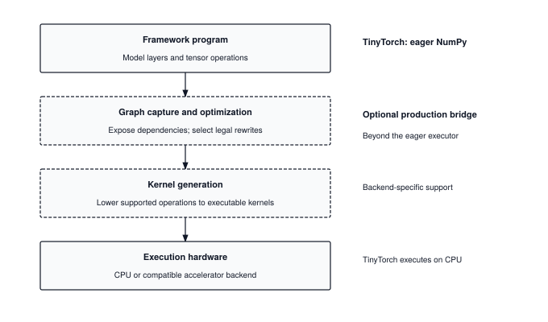
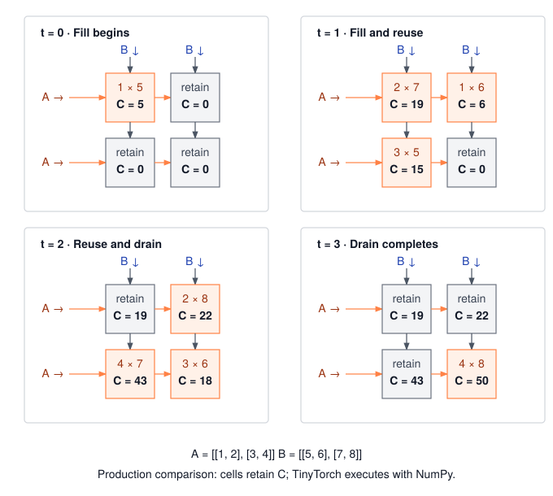

# The Modern Stack: Compilers, Triton, and Custom Silicon {#sec-extensions}

A four-element vector passes through a bias add, GELU, and a scale. The result needs four output values, yet an eager implementation also writes two intermediate vectors. Chapter 17 exposed this gap between the arithmetic and the arrays that execute it. Milestone III established the evidence needed to call an alternative better: compare the actual candidate with a fixed baseline, check quality, count the stated storage format, and measure elapsed time. This chapter carries that discipline beyond TinyTorch. We will follow a small program through a grouping pass and a fused executor, then trace a matrix product through an ideal hardware array.

The production bridge introduces three mechanisms. Graph capture makes operations and their dependencies available to a compiler. Kernel generation turns a supported group of operations into executable code; a kernel is a routine that processes some part of the input. Specialized matrix hardware arranges the movement of operands around the multiply-adds that use them. None changes the intended computation, but each can change its execution costs and floating-point rounding. The task remains the one established by the benchmark chapters: preserve the required result and measure the resulting program.

The four layers in @fig-modern-stack locate these mechanisms. TinyTorch supplies the framework program and executes its NumPy operations on a CPU. Graph capture and kernel generation are optional additions between those endpoints. The Python models below expose their central decisions without adding GPU programming to the prerequisites of the reference framework.

::: {.callout-note title="Source Code Mapping"}
There is no Module 21. TinyTorch stops at Module 20, and this chapter has no NumPy-backed implementation behind it. The listings here are small pure-Python models of a graph compiler and a systolic array, written to show every step, plus one illustrative Triton kernel that needs a compatible GPU to run. Read the eager executor, grouping pass, and fused executor as the core extension. The Triton and hardware sections are optional production bridges, not prerequisites for completing TinyTorch. None of them is TinyTorch code, and the chapter says so wherever a listing could be mistaken for it.
:::

{#fig-modern-stack fig-alt="Framework program above optional graph capture and kernel generation, followed by execution hardware. TinyTorch uses eager NumPy on CPU."}

## The Problem

Chapter 17's compact GELU expression avoids retaining intermediate Tensor wrappers, but NumPy still executes array operations and creates temporary arrays. A compiled fused kernel could instead keep each element's intermediate values local until it writes the result. To see the difference independently of NumPy's implementation, consider three pointwise operations on a four-element vector. A pointwise operation computes output element $i$ using the corresponding input elements, without consulting other positions.

```python
import math

def gelu1(v):
    c = math.sqrt(2 / math.pi)
    return 0.5 * v * (1 + math.tanh(c * (v + 0.044715 * v ** 3)))

def add(x, b):    return [xi + bi for xi, bi in zip(x, b)]
def gelu(z):      return [gelu1(v) for v in z]
def scale(y, s):  return [s * v for v in y]

x = [1.0, -2.0, 0.5, 3.0]
b = [0.1, 0.1, 0.1, 0.1]
z = add(x, b)          # pass 1: read x, b; write z
y = gelu(z)            # pass 2: read z;    write y
out = scale(y, 2.0)    # pass 3: read y;    write out
```

Each function reads a whole list and writes a whole list. The lists `z` and `y` exist only to connect adjacent operations. For a vector of $n$ elements and a chain of $k$ operations, our simplified ledger counts $2kn$ activation values moved: one read and one write per element per operation. A fused chain needs $2n$. Both also read the bias vector, so this ledger omits that common traffic. It also omits Python object overhead and does not measure physical memory transfers. A GPU implementation can additionally pay dispatch and launch overhead for separate kernels; its magnitude depends on the workload and execution environment.

A hand-written fused loop solves this one chain. Adding another activation or changing the order would require another implementation. A compiler makes the chain available as data so that a reusable transformation can identify the same opportunity in many programs. It must also establish that the transformation is legal: an intermediate needed by another consumer cannot simply disappear.

A matrix product offers a different reuse opportunity. For $C = AB$, each element of $A$ contributes to several columns of $C$, and each element of $B$ contributes to several rows. A plain triple loop for square matrices performs $2n^3$ source-level operand accesses for $n^3$ multiply-adds. That count is not a count of reads from main memory: caches, register reuse, and the tiling of Chapter 17 can serve many accesses locally. The hardware model later in this chapter makes another form of local reuse visible by passing operands directly between neighboring cells.

## The Idea

The three mechanisms change different parts of the execution. Graph capture exposes dependencies, fusion removes eligible intermediate arrays, and an array of arithmetic cells reuses operands locally. The roofline model from Chapter 14 helps distinguish cases where less data movement matters from cases limited by arithmetic or overhead.

### Capture the program as a graph

TinyTorch's autograd graph records dependencies during a differentiable forward computation so that `backward()` can traverse them in reverse. A compiler also needs dependencies, but in a representation it can analyze and transform for later execution. The following explicit program is a small **intermediate representation**,[^fn-ir-graph-capture] or IR. Each named value makes a connection between an operation and its consumer visible.

[^fn-ir-graph-capture]: **IR** (intermediate representation): a program written in a form meant for tools rather than people, usually a list of operations on named values. A compiler may use several representations as it lowers operations toward machine instructions; the list in this chapter is a deliberately small example.

```
%z = add(%x, %b)
%y = gelu(%z)
%o = mul(%y, 2.0)
```

This explicit IR is written before its interpreter executes it. TinyTorch's autograd graph, by contrast, is recorded during an eager forward pass; obtaining a reusable compiler representation would require a new capture mechanism. With the graph in hand, the compiler can see that `%z` and `%y` are consumed exactly once, by the next operation, and never leave the chain. They need not be materialized as complete arrays.

{#fig-compiler-lowering-fusion fig-alt="Four-stage compiler pipeline showing Python graph capture, graph optimization, kernel fusion pass, and code generation into Triton or machine code."}

### Fuse what is memory-bound

The activation ledger gives a precise reason to fuse this chain. For a fixed amount of arithmetic, reducing counted activation traffic from $2kn$ to $2n$ increases the arithmetic intensity of that ledger by $k$. Including bias reads reduces this factor, and actual execution includes costs outside the model. Our toy rule groups consecutive pointwise operations and treats every other operation as a boundary. It assumes a single chain with unchanged length and no externally visible intermediate. A production compiler must prove corresponding shape, dependency, and mutation conditions rather than infer them from adjacency alone. For the example, the rewritten representation is one line.

```
%o = fused_add_gelu_mul(%x, %b, 2.0)
```

Generating an element loop for this group is a separate step from identifying the group. The grouping pass below changes only program data; the fused executor is what avoids materializing the internal activation lists.

### Match the hardware to the matrix multiply

The last idea leaves software entirely. A **systolic array** is a grid of small multiply-accumulate cells wired to their neighbors, whose operands move from cell to cell at each clock tick in our ideal model. In the output-stationary form, cell $(i, j)$ holds the running sum for one output $C_{ij}$ and never moves it. Row $i$ of $A$ streams in from the left, one value per cycle; column $j$ of $B$ streams in from the top. When $a_{ik}$ and $b_{kj}$ meet at cell $(i, j)$, the cell multiplies them, adds the product to its sum, and passes both values along to the next cell. At cycle $t$ each cell computes

$$C_{ij} \leftarrow C_{ij} + a_{ik} \, b_{kj}, \qquad k = t - i - j,$$

where the offset $i + j$ is the delay before the first product reaches that cell, and an update occurs only when $0 \leq k < K$. The inputs are staggered so that the matching pair arrives together. Assume the whole $M \times N$ output fits in the array, boundary buffers supply every scheduled input without a stall, and each cell completes a multiply-accumulate per tick. Then each input crosses the array boundary once, for $MK + KN$ input injections. This counts boundary traffic, not all internal transfers or total system memory traffic. The last output finishes after

$$T = M + N + K - 2 \text{ cycles},$$

with the first tick numbered zero in the code. Thus the final tick has index $T-1$. The cells fill and drain at different times; short products may never have every cell active simultaneously. Each output accumulator remains in its cell until completion. Real arrays have fixed dimensions, so larger products require tiling, buffering, and additional transfers. The specialization also has a limit: multiply-accumulate cells do not by themselves compute operations such as exponentiation or softmax.

## The Code

There is no TinyTorch module to walk in this extension. The following pure-Python models implement eager execution, grouping, fused execution, and an ideal array schedule. They run on a CPU and expose state explicitly. The separate Triton listing is an optional GPU comparison; its dependencies are not needed for these models.

### An eager runtime that counts its memory traffic

The first interpreter executes an explicit list of operations. These examples assume nonempty, equal-length input and bias lists and a nonempty program containing supported operations. Each operation receives one activation value, its element index, and an argument. The index lets bias addition read `b[i]`; scaling uses a scalar argument. The interpreter allocates a new activation list after each operation and counts these modeled passes. It records neither elapsed time nor Python memory allocation sizes.

```python
POINTWISE = {
    "add":   lambda v, i, b: v + b[i],
    "gelu":  lambda v, i, _: gelu1(v),
    "scale": lambda v, i, s: s * v,
}

def run_eager(x, program):
    """One kernel per op. Every op reads a whole list and writes a whole list."""
    buf, moves, kernels = x, 0, 0
    for op, arg in program:
        buf = [POINTWISE[op](v, i, arg) for i, v in enumerate(buf)]
        moves += 2 * len(x)      # one read pass plus one write pass
        kernels += 1
    return buf, moves, kernels

program = [("add", b), ("gelu", None), ("scale", 2.0)]
out, moves, kernels = run_eager(x, program)
```

The `program` list is a minimal intermediate representation: operation names and arguments form an implicit chain, with each operation consuming the previous result. `run_eager` starts with the caller's `x`, then rebinds `buf` to a new list at every step. It does not modify `x` or `b`. The returned counters describe three modeled kernels, one per list comprehension, rather than the individual scalar `POINTWISE[op]` calls inside it.

### The fusion pass

Once the program is data, a grouping pass can inspect it without running the arithmetic. Its `run` list accumulates eligible operations. Encountering an unsupported operation flushes that pending group into `groups`, clears `run`, and appends the boundary operation unchanged. The final flush matters when the program ends with pointwise work. No activation values enter this function; its return value is another program representation.

```python
def fuse(program):
    """Group consecutive pointwise ops into one fused node; leave others alone."""
    groups, run = [], []
    for op, arg in program:
        if op in POINTWISE:
            run.append((op, arg))
        else:
            if run:
                groups.append(("fused", run))
                run = []
            groups.append((op, arg))
    if run:
        groups.append(("fused", run))
    return groups

full = [
    ("add", b), ("gelu", None), ("matmul", "W"),
    ("scale", 2.0), ("gelu", None),
]
for op, arg in fuse(full):
    print(op, [o for o, _ in arg] if op == "fused" else arg)
```

On the five-operation example, the pass prints `fused ['add', 'gelu']`, then `matmul W`, then `fused ['scale', 'gelu']`. It proposes three groups instead of five operations. The matrix multiplication is only a boundary marker here; these interpreters do not implement it. No allocation has disappeared yet because no numerical execution has occurred. The pass also does not validate shapes or support branches. Its useful invariant is narrower: flattening the groups reproduces the original operation sequence in the original order.

### The fused executor

A fused group specifies an opportunity; an executor must realize it. Unpacking the group and passing its operations through `run_eager` would still allocate a fresh list per operation. Passing the group marker itself would fail because `POINTWISE` has no `"fused"` operation. The new executor turns the loop inside out: one loop over elements contains the entire operation chain. Its modeled activation ledger records one input read and one output write per element.

```python
def run_fused(x, chain):
    """Model one activation pass for a nonempty pointwise chain."""
    out = []
    for i, v in enumerate(x):
        for op, arg in chain:    # v never leaves this local variable
            v = POINTWISE[op](v, i, arg)
        out.append(v)
    return out, 2 * len(x), 1

out_f, moves_f, kernels_f = run_fused(x, program)
assert out_f == out
```

The two Python runs produce identical values because they apply the same scalar operations in the same order at each position. `run_fused` preserves the input lists and returns a new output list, but no full-length `z` or `y` list. A Python local is not a guarantee of register residency. It models the lifetime a compiled kernel can give an intermediate: the value remains available within one element's computation, then becomes unnecessary.

### The same kernel in Triton

Triton expresses work on blocks of elements and compiles it for a supported GPU backend. Its [vector-addition tutorial](https://triton-lang.org/main/getting-started/tutorials/01-vector-add.html) uses the same block index, offset vector, and masked loads as the example below. Here the block computes bias addition followed by GELU; it omits the final scale in `program`. This hand-written illustration is not captured compiler output and is not TinyTorch code. It requires Triton and a compatible GPU environment; the pure-Python traces remain runnable without either.

```python
import triton
import triton.language as tl

@triton.jit
def fused_bias_gelu_kernel(x_ptr, b_ptr, y_ptr, n_elements,
                           BLOCK_SIZE: tl.constexpr):
    pid = tl.program_id(axis=0)                     # which block am I?
    offsets = pid * BLOCK_SIZE + tl.arange(0, BLOCK_SIZE)
    mask = offsets < n_elements                     # last block may be partial

    x = tl.load(x_ptr + offsets, mask=mask, other=0.0)
    b = tl.load(b_ptr + offsets, mask=mask, other=0.0)

    z = x + b                                       # block-local intermediate
    c = 0.7978845608028654                          # sqrt(2 / pi)
    inner = c * (z + 0.044715 * z * z * z)
    tanh_inner = 2 * tl.sigmoid(2 * inner) - 1      # tanh via sigmoid
    y = 0.5 * z * (1.0 + tanh_inner)

    tl.store(y_ptr + offsets, y, mask=mask)
```

For a block size of four and six inputs, program 0 uses offsets `[0, 1, 2, 3]` and program 1 uses `[4, 5, 6, 7]`. The second mask is `[True, True, False, False]`; it prevents the final two loads and stores from accessing beyond the arrays. `x_ptr + offsets` names locations in a flat buffer. The kernel expects `b` to have one value per input element, as in our Python example; it does not implement the feature-axis broadcasting of a batched Linear layer. The compiler maps this block description to GPU execution. The source alone does not guarantee register allocation or the number of blocks running simultaneously.

### A systolic array in twelve lines

The systolic simulation changes the order in which a matrix product's operands meet. It assumes nonempty rectangular inputs with matching inner dimensions. It has one accumulator per output and uses $k = t - i - j$ to identify the pair arriving at cell $(i,j)$ during tick $t$. When $k$ lies outside the inner dimension, that cell does nothing. This schedule explains the ideal hardware array's behavior; Python executes the nested loops sequentially and repeatedly indexes the input lists.

```python
def systolic_matmul(A, B):
    """Output-stationary systolic array: one multiply-accumulate cell per C[i][j]."""
    M, K, N = len(A), len(A[0]), len(B[0])
    C = [[0] * N for _ in range(M)]
    cycles = M + N + K - 2
    for t in range(cycles):
        for i in range(M):
            for j in range(N):
                k = t - i - j            # the product cell (i, j) sees at cycle t
                if 0 <= k < K:
                    C[i][j] += A[i][k] * B[k][j]
    return C, cycles

C, cycles = systolic_matmul([[1, 2], [3, 4]], [[5, 6], [7, 8]])
assert C == [[19, 22], [43, 50]] and cycles == 4
```

The `C` lists are new state owned by this call; `A` and `B` remain unchanged. After tick $t$, cell $(i,j)$ holds the sum of products whose indices have arrived, from zero through $\min(K-1,t-i-j)$ when that range is nonempty. On return every valid $k$ has arrived exactly once, so `C` equals the ordinary matrix product. Interpreting the inner loops as simultaneous cells gives the hardware schedule. Running the Python function itself gives neither hardware timing nor a measurement of boundary traffic.

## A Worked Trace

Both mechanisms trace by hand in a few lines. Feeding $x = (1.0, -2.0, 0.5, 3.0)$ and a bias of $0.1$ through add, GELU, and a scale of $2$ gives @tbl-extensions-fusion-trace. For the first row, we obtain $z = 1.1$ and the GELU inner term $\sqrt{2/\pi}(1.1 + 0.044715 \times 1.331) \approx 0.92515965$. Its hyperbolic tangent is approximately $0.72832917$, giving $y \approx 0.95058105$. Keeping the unrounded intermediates and rounding only the displayed result gives $2y \approx 1.9012$.

```{=latex}
\newpage
```

| Element | $x$ | $z = x + 0.1$ | $y = \text{GELU}(z)$ | $\text{out} = 2y$ |
| :---: | :---: | :---: | :---: | :---: |
| 0 | $1.0$ | $1.1$ | $0.9506$ | $1.9012$ |
| 1 | $-2.0$ | $-1.9$ | $-0.0545$ | $-0.1091$ |
| 2 | $0.5$ | $0.6$ | $0.4354$ | $0.8708$ |
| 3 | $3.0$ | $3.1$ | $3.0974$ | $6.1947$ |

: **Fusion trace**: The eager interpreter materializes the $z$ and $y$ columns as lists. The fused interpreter computes those values locally and appends only the last column to its output list. {#tbl-extensions-fusion-trace tbl-colwidths="[14,18,22,24,22]"}

The values are identical in both runs. What differs is the count the interpreters kept: `run_eager` (lines 7--14 of the eager runtime) charges `2 * len(x)` per operation in line 12, reporting 24 element moves and 3 kernels (three separate read and write passes over four elements). In contrast, `run_fused` (lines 1--8 of the fused executor) evaluates the entire chain in line 5 inside a single element loop, reporting only 8 moves and 1 kernel in line 8. That is the factor of $k = 3$ memory traffic reduction from The Idea, on a vector small enough to check by hand.

The systolic trace multiplies $A = \begin{pmatrix} 1 & 2 \\ 3 & 4 \end{pmatrix}$ by $B = \begin{pmatrix} 5 & 6 \\ 7 & 8 \end{pmatrix}$ on a $2 \times 2$ array. In `systolic_matmul` (lines 1--12 of the systolic listing), line 4 computes the total propagation latency as $\text{cycles} = M + N + K - 2 = 4$. Line 8 determines cell activation via the diagonal arrival coordinate $k = t - i - j$, accumulating active products in line 10. Applying that schedule cell by cell gives the accumulator contents in @tbl-systolic-trace.

| Cycle | Cell $(0,0)$ | Cell $(0,1)$ | Cell $(1,0)$ | Cell $(1,1)$ |
| :---: | :---: | :---: | :---: | :---: |
| 1 | $0 + 1 \cdot 5 = 5$ | idle | idle | idle |
| 2 | $5 + 2 \cdot 7 = \mathbf{19}$ | $0 + 1 \cdot 6 = 6$ | $0 + 3 \cdot 5 = 15$ | idle |
| 3 | $19$ | $6 + 2 \cdot 8 = \mathbf{22}$ | $15 + 4 \cdot 7 = \mathbf{43}$ | $0 + 3 \cdot 6 = 18$ |
| 4 | $19$ | $22$ | $43$ | $18 + 4 \cdot 8 = \mathbf{50}$ |

: **Accumulator trace**: Each row shows a completed tick of the ideal $2 \times 2$ array. Bold marks the cycle in which each output finishes; cycle 1 corresponds to code index $t=0$. {#tbl-systolic-trace tbl-colwidths="[12,22,22,22,22]"}

The wavefront is visible in the table. Cell $(0,0)$ starts first and finishes at cycle 2; the cells one step away start at cycle 2; the far corner starts at cycle 3 and finishes at cycle 4. In line 14, `systolic_matmul` confirms the final result $\begin{pmatrix} 19 & 22 \\ 43 & 50 \end{pmatrix}$ and `cycles == 4`. Across those ticks, the ideal array injects eight input values at its boundary. The Python simulator performs sixteen indexed operand accesses. These count different boundaries, so their ratio is not a measured CPU traffic reduction.


@fig-systolic-wavefront separates the active products from the accumulated state. An inactive cell may still hold a completed output; no later cell takes ownership of that sum.

{#fig-systolic-wavefront width=5in fig-alt="Four two-by-two arrays show active products and retained accumulators at ticks zero through three, ending with outputs 19, 22, 43, and 50. Horizontal arrows carry A right and vertical arrows carry B down."}

## From TinyTorch to Production

The toy pass begins with an explicit program. A production framework first has to obtain one from ordinary model code. In PyTorch's compilation path, TorchDynamo captures supported operations, AOTAutograd can construct graphs for training, and TorchInductor lowers supported graphs to executable code. These are related to the dependencies recorded by TinyTorch autograd, but they are not its tape read in another direction. Capture needs reusable representations and checks on the assumptions under which execution remains valid. The [PyTorch compiler FAQ](https://docs.pytorch.org/docs/main/user_guide/torch_compiler/torch.compiler_faq.html) describes this separation.

TorchInductor can generate Triton for GPU execution or C++ for CPU execution, with the selected path depending on the backend and operators. It can also use existing operator implementations; not every operation becomes a newly generated kernel. Its decisions include legality, scheduling, and memory use beyond our adjacency rule. The [Dynamo overview](https://docs.pytorch.org/docs/main/user_guide/torch_compiler/torch.compiler_dynamo_overview.html) describes the capture-to-backend boundary.

The hardware comparison is similarly specific. Google's documented TPU designs include matrix units organized as systolic arrays alongside other execution units. Array dimensions differ across generations; a particular grid size is not the definition of a TPU. The [TPU architecture documentation](https://docs.cloud.google.com/tpu/docs/system-architecture-tpu-vm) describes the matrix units and surrounding storage. Our simulation models an ideal arrival schedule, not those devices' complete arithmetic formats, instruction sets, or memory systems.

| Layer | TinyTorch | Production alternative | Constraint that motivates it |
| :--- | :--- | :--- | :--- |
| Program capture | Executes Python operations eagerly | Capture supported regions with validity checks | Expose opportunities across operations |
| Fusion | Compact NumPy expression with temporary arrays | Generate eligible combined kernels | Avoid selected intermediate transfers and launches |
| Kernel source | NumPy numerical operations | Generated code and existing kernel libraries | Map operations to a supported execution backend |
| Matrix multiply | NumPy products and explicit teaching loops | Tiled matrix units and local operand reuse | Supply arithmetic units without unnecessary distant transfers |

: **Execution choices**: Each layer preserves an intended computation while changing how it is represented or executed. The alternatives require additional correctness checks and do not guarantee a speedup. {#tbl-stack-comparison tbl-colwidths="[16,24,32,28]"}

Compilation adds preparation work and assumptions to execution. Captured regions can require guards, checks that the inputs and program state still satisfy those assumptions. Unsupported control flow can split a program into separate captured regions, limiting optimization across the split. A changed input need not always require recompilation, but a failed specialization assumption can. These trade-offs replace the toy pass's deliberately restricted input contract.

A performance investigation should compare cold compilation with repeated execution separately, check outputs within the required numerical tolerance, and inspect what operations actually execute. Fewer kernel launches are evidence that execution changed, not proof of a speedup. A memory-bound chain can benefit from fewer transfers; a larger fused group can also consume more local resources, and a matrix product can remain limited by arithmetic. The measured workload decides. The useful connection back to TinyTorch is the habit of following values, state, and costs through each layer before accepting the result.

## Summary

This chapter extended the framework's execution model without adding a new TinyTorch module. `run_eager` materializes each operation's output, `fuse` groups eligible operations without executing them, and `run_fused` carries each element through a group before writing it. The systolic simulation retains one partial sum per output while operand pairs arrive according to a schedule. These mechanisms preserve different invariants, but the reading method is the same: identify the inputs, follow the state changes, establish the returned result, and separate an analytical count from a measurement. That method carries from a four-element trace to an unfamiliar production profiler report. The completed reference remains small enough to reread whenever one of those boundaries becomes unclear.

## Exercises

1. Add `relu` to `POINTWISE` and group the sequence `add, relu, softmax, scale`, treating softmax as a boundary. Predict the groups before running `fuse`. Implement a separate stable whole-vector softmax and a dispatcher that can execute both fused groups and that boundary operation. Check output agreement with an eager dispatcher. Explain why simply adding a scalar lambda to `POINTWISE` cannot implement softmax.

2. Change the example so that the caller needs both the final output and the intermediate `z`. Predict which activation list must remain materialized. Extend the program representation to mark that output, then compare the resulting traffic ledger with the original 24 and 8 moves. State separately the traffic for the bias input.

3. Record each systolic cell's partial sum after every tick for the $2 \times 2$ example. Then run an $M=2$, $K=3$, $N=2$ product and compare with ordinary matrix multiplication. Count boundary injections by tracking each distinct `A[i][k]` and `B[k][j]` once; count the simulation's list accesses separately. Explain why those are different counts, and why neither measures CPU main-memory traffic.
