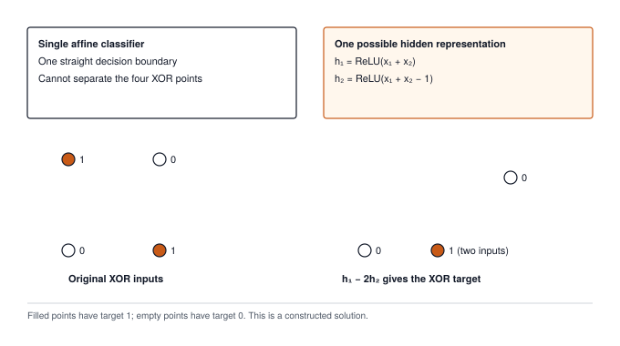

# Milestone I: From Perceptrons to Rumelhart's MLP {#sec-milestone-1 .unnumbered}

Chapter 8 closed the loop. You now own every piece a framework needs in order to learn from data: tensors, activations, layers, losses, a data loader, an autograd tape, optimizers, and the five-step loop that orders them. The earlier chapters checked local rules and small training traces. This milestone checks whether those rules compose across two trainable layers and continue to work over repeated updates.

This milestone asks the question a practitioner asks of any new framework before trusting it. Does it actually train? We answer with two problems that sit far apart in history and close together in code. The first is XOR, a four-row truth table that a single-layer perceptron provably cannot learn, which Minsky and Papert used in 1969 to argue neural networks into their first winter. The second is TinyDigits, a small set of 8 by 8 handwritten digits, the kind of task the 1986 backpropagation paper by Rumelhart, Hinton, and Williams showed a hidden layer could handle. Learning XOR provides an integration check on hidden-layer training; it does not prove every backward rule correct. Learning digits also exercises batching and multiclass loss. The small traces from earlier chapters remain necessary because a training run can improve despite a numerically incorrect gradient.

{#fig-milestone1-history}

## The Problem

Frank Rosenblatt's 1958 perceptron is one `Linear` layer feeding one squashing function. With two inputs it computes $z = w_1 x_1 + w_2 x_2 + b$ and answers 1 when $z \ge 0$, otherwise 0. The set of points where $z = 0$ is a straight line, the model's **decision boundary**, and everything the perceptron can ever do is pick which side of one line each input falls on.

XOR (exclusive or) is the smallest function that defeats this. It outputs 1 when its two inputs differ and 0 when they agree, so the four corners of the unit square carry labels $(0,0) \to 0$, $(0,1) \to 1$, $(1,0) \to 1$, and $(1,1) \to 0$. The two positive corners sit on one diagonal and the two negative corners on the other. Draw any line you like through the square and at least one corner ends up on the wrong side.

The milestone's first script makes you feel this before proving it. It builds the perceptron from the modules you have, sets the three weights by hand, and scores the four rows. The excerpt below keeps the model and the scoring function and drops the terminal decoration.

```python
# milestones/02_1969_xor/01_xor_crisis.py (excerpt)
import numpy as np
from tinytorch import Tensor, Linear, Sigmoid

XOR_INPUTS = np.array([[0.0, 0.0], [0.0, 1.0], [1.0, 0.0], [1.0, 1.0]])
XOR_TARGETS = np.array([[0.0], [1.0], [1.0], [0.0]])

class SingleLayerPerceptron:
    def __init__(self):
        self.linear = Linear(2, 1)
        self.sigmoid = Sigmoid()

    def set_weights(self, w1, w2, b):
        self.linear.weight.data = np.array([[w1], [w2]])   # shape (in, out)
        self.linear.bias.data = np.array([b])

    def __call__(self, x):
        return self.sigmoid(self.linear(x))

def evaluate_on_xor(model):
    predictions = model(Tensor(XOR_INPUTS))
    pred_classes = (predictions.data > 0.5).astype(int)
    return (pred_classes == XOR_TARGETS).mean()

model = SingleLayerPerceptron()
for w1, w2, b in [(1, 1, -0.5), (1, 1, -1.5), (-1, 1, 0), (1, -1, 0)]:
    model.set_weights(w1, w2, b)
    print(f"w=({w1:+}, {w2:+}) b={b:+}: accuracy {evaluate_on_xor(model):.0%}")
```

The four settings score 75%, 25%, 75%, and 75%. The full script tries ten hand-picked lines and one hundred random ones, and the best of the 110 gets three rows out of four. Notice what is absent. There is no optimizer and no loss in this script, and it needs only modules 01 through 03. The failure is not a training failure. There are no weights to find, so no amount of training could find them.

## The Idea

### Why one line cannot do it

The proof fits in four lines. For the perceptron to get every row right, its weights must satisfy all four conditions at once:

$$\begin{aligned}
(0,0) \to 0 &\implies b < 0 \\
(0,1) \to 1 &\implies w_2 + b \ge 0 \\
(1,0) \to 1 &\implies w_1 + b \ge 0 \\
(1,1) \to 0 &\implies w_1 + w_2 + b < 0
\end{aligned}$$

Adding the second and third lines gives $w_1 + w_2 + 2b \ge 0$. Adding the first and fourth gives $w_1 + w_2 + 2b < 0$. No numbers satisfy both, so no perceptron computes XOR. In the vocabulary of the field, XOR is not linearly separable.[^fn-linearly-separable-xor] Minsky and Papert extended this kind of argument to parity and connectedness, and the conclusion the field drew in 1969 was that perceptrons were a dead end.

[^fn-linearly-separable-xor]: **Linearly separable**: a labeled set of points is linearly separable when one straight line (in higher dimensions, one flat plane) puts every positive point on one side and every negative point on the other. AND and OR are linearly separable with two inputs; XOR is the smallest function that is not, which is why it became the test case.

### A hidden layer folds the plane

The escape is to stop classifying the raw inputs and classify a transformed version of them instead. Insert a layer of neurons between input and output, each computing its own `Linear` sum followed by a ReLU, and let the output neuron draw its line in the space of those hidden values. Two hidden units are enough for XOR, and a specific pair makes the mechanism visible. Both read the same sum $s = x_1 + x_2$:

$$h_1 = \text{ReLU}(s - 0.5), \qquad h_2 = \text{ReLU}(s - 1.5), \qquad y = 2h_1 - 6h_2$$

Unit $h_1$ switches on as soon as at least one input is on. Unit $h_2$ switches on only when both are. The output neuron rewards $h_1$ and punishes $h_2$ hard enough that the two cancel exactly when both inputs are on. Follow the four corners into the hidden plane and the fold appears. Corner $(0,0)$ lands at $(0, 0)$, both positive corners land on the same point $(0.5, 0)$, and corner $(1,1)$ lands at $(1.5, 0.5)$. The two positive rows, which no line could isolate in the input square, are now a single point with the negatives on either side of it along the $h_1$ axis, and the line $2h_1 - 6h_2 = 0.5$ separates them. ReLU did the work. A layer without it would compose two linear maps into one linear map, and the plane would stay flat.

### Why it took until 1986

Minsky and Papert knew that a hidden layer could represent XOR. Their objection was that nobody knew how to train one. The output neuron has a target to compare against, but a hidden neuron does not, so which direction should $w_1$ in the hidden layer move? Chapter 6 answered this. The tape records the hidden `Linear`, the ReLU, and the output `Linear` as ordinary operations, and `loss.backward()` pushes the output error through each of them by the chain rule until every hidden weight has a gradient. Rumelhart, Hinton, and Williams published that procedure in 1986 under the name backpropagation, and the winter ended. Everything below is that procedure, run by the modules you built.

## The Code

::: {.callout-note title="Source Code Mapping"}
Milestone I is three scripts: `milestones/02_1969_xor/01_xor_crisis.py`, `milestones/02_1969_xor/02_xor_solved.py`, and `milestones/03_1986_mlp/01_rumelhart_tinydigits.py`. They import the NumPy-backed modules 01 through 08 that students build in the TinyTorch course (`src/01_tensor` through `src/08_training`), so they run only inside a TinyTorch checkout after those modules have been exported into the `tinytorch` package. The listings adapt those scripts into short experiments, omitting terminal decoration and, where stated, simplifying their return values. They require the exported TinyTorch package and should run in order from the `tinytorch/` project directory. The framework classes themselves are the implementations studied in Chapters 1 through 8.
:::

### The XOR network and its data

The first decision is what to train on. The obvious choice is the truth table itself, the same four rows the perceptron script scored, and for training it is a poor dataset. Four points can be fit by carving four tiny islands around four coordinates, and a network that has done that has learned nothing you could check, because there is no fifth point to ask it about. The solved script instead draws twenty-five samples around each corner with a little Gaussian noise, a standard deviation of 0.1 so the clouds do not touch, one hundred points in all, and shuffles them. Now the boundary the network finds has to hold over a region rather than at a point, and the four exact corners become inputs it never trained on, which we can test at the end.

The model is the two-layer shape from The Idea with two changes from what I could build by hand. The hidden layer has four units rather than two. Two suffice when I choose the weights, but gradient descent starts from random weights and needs spare units so that one bad draw is not fatal; the next subsection shows what happens when the slack runs out. The hidden units use ReLU rather than the sigmoid of the 1986 paper, because Chapter 2 showed that a sigmoid passes at most a quarter of the gradient through and ReLU passes all of it. After the output layer comes a sigmoid, and the reason is the loss. Binary cross-entropy, the two-class form of Chapter 4's cross-entropy, scores a probability against a 0 or 1 target, and a `Linear` layer emits any real number, so the sigmoid is what turns the score into something the loss can read.

```python
# milestones/02_1969_xor/02_xor_solved.py (excerpt)
import numpy as np
from tinytorch import Tensor, Linear, ReLU, Sigmoid, BinaryCrossEntropyLoss, SGD

rng = np.random.default_rng(7)

def generate_xor_data(n_samples=100):
    per_corner = n_samples // 4
    xs, ys = [], []
    for (a, b), target in [((0, 0), 0), ((0, 1), 1), ((1, 0), 1), ((1, 1), 0)]:
        xs.append(rng.standard_normal((per_corner, 2)) * 0.1 + np.array([a, b]))
        ys.append(np.full((per_corner, 1), float(target)))
    X, y = np.vstack(xs), np.vstack(ys)
    order = rng.permutation(n_samples)
    return Tensor(X[order]), Tensor(y[order])

class XORNetwork:
    def __init__(self, hidden_size=4):
        self.hidden = Linear(2, hidden_size)
        self.relu = ReLU()
        self.output = Linear(hidden_size, 1)
        self.sigmoid = Sigmoid()

    def __call__(self, x):
        return self.sigmoid(self.output(self.relu(self.hidden(x))))

    def parameters(self):
        return self.hidden.parameters() + self.output.parameters()
```

The model is seventeen numbers: a 2 by 4 weight matrix and 4 biases in the hidden layer, a 4 by 1 weight matrix and 1 bias in the output layer. Notice `parameters()`. `XORNetwork` is a plain Python class, not a Chapter 3 `Layer`, so nothing walks its attributes for it; it has to hand the optimizer the concatenation of the two layers' lists itself. That list is all the optimizer ever learns about the model's structure, and the same is true in PyTorch, where `nn.Module.parameters()` does the walk and returns the same kind of list.

### The loop

The first call inside the loop is `model(X)`, but recording has already been enabled by constructing `SGD(model.parameters(), lr=lr)`. The optimizer holds the four original parameter tensors and marks them `requires_grad=True` before the model runs. Forward, loss, backward, step, and clear then follow the cycle from Chapter 8. The step that is easiest to drop is the clear. Chapter 6's `backward()` adds into `.grad` rather than assigning to it, so if the gradients are not cleared between one backward pass and the next, epoch two trains on the sum of two epochs' gradients, epoch three on three, and the effective learning rate climbs every step. Nothing raises an error. The loss just stops falling, or blows up.

The training function below writes that cycle directly. It returns the model for the next experiment; the full milestone script returns a history dictionary for its display. The XOR class exposes `__call__`, which this loop uses. `Trainer._forward` instead calls a model's `forward` method, so handing this exact class to `Trainer` would require providing that method. The manual loop makes this interface boundary visible.

```python
def train_network(model, X, y, epochs=500, lr=0.5):
    loss_fn = BinaryCrossEntropyLoss()
    optimizer = SGD(model.parameters(), lr=lr)
    for epoch in range(epochs):
        predictions = model(X)                 # forward
        loss = loss_fn(predictions, y)         # loss
        loss.backward()                        # backward, through the hidden layer
        optimizer.step()                       # update
        optimizer.zero_grad()                  # clear, ready for the next epoch
        if (epoch + 1) % 100 == 0:
            accuracy = ((predictions.data > 0.5).astype(int) == y.data).mean()
            print(f"epoch {epoch + 1:3d}  loss {float(loss.data):.4f}  accuracy {accuracy:.0%}")
    return model

import tinytorch.core.layers as layers
layers.rng = np.random.default_rng(1986)       # see below

X, y = generate_xor_data(100)
model = train_network(XORNetwork(hidden_size=4), X, y)
```

The trailing `zero_grad()` is valid here because the freshly constructed parameters begin with `grad=None`, and every iteration clears after its update. Calling this function on a model with existing gradients would require clearing before the first forward pass as well. The printed predictions and loss belong to the forward pass before the update; measuring the updated model would require another forward pass. The script also reseeds the random number generator that `Linear` uses for its initial weights.[^fn-seed-xor-init] This is the slack from the previous subsection running out. With only four hidden units, some random starts put a unit permanently on the dead side of its ReLU, and the network settles at 75% accuracy with one corner stuck near probability 0.5. That is the dying ReLU failure from Chapter 2 showing up in the smallest network that can exhibit it. The seed 1986 is a start I checked; the script tells you to rerun with another if you land on the plateau.

[^fn-seed-xor-init]: **Seed**: the starting value of a pseudo-random number generator. Two runs with the same seed draw the same sequence of "random" numbers, which makes a training run reproducible; two runs with different seeds start from different initial weights and can end in different places.

With that seed, on my machine the script starts at loss 0.7357 and 50% accuracy, reaches 100% accuracy by epoch 100 at loss 0.0755, and ends after 500 epochs at loss 0.0053. Fed the four exact corners, the trained network answers 0.002, 0.998, 0.998, and 0.003. The wall has a door in it.

### Digits

The third script moves from a truth table to images, and three things have to change for the same two-layer shape to cope. TinyDigits ships with the repository as two pickled arrays: 150 training images and 47 test images, each 8 by 8 pixels with values from 0 to 16, labeled 0 through 9. An 8 by 8 image flattens to a 64-vector, the hidden layer has 32 units, and the output has 10, one per digit.

The first change is the output. A digit classifier has ten answers, not two, and the two-class trick of one sigmoid and one probability does not stretch to cover it; ten separate sigmoids would give ten probabilities that need not sum to one and ten losses with nothing tying them together. Chapter 4's `CrossEntropyLoss` takes the ten raw scores and an integer label and does the softmax and the logarithm inside, with the max shift that keeps a score of 100 from overflowing float32. So the model emits ten raw scores, there is no sigmoid, and the prediction is the index of the largest score.

The second change is how the data arrives. XOR fed all one hundred points through the network at once, one gradient step per epoch. Doing the same with 150 images gives twenty steps in twenty epochs, which is not many. The other extreme, one image at a time, is 3,000 steps of 1 by 64 matrix multiplies, each too small to be worth the Python around it, and a gradient from one image is a poor stand-in for the gradient of the dataset. Chapter 5's `DataLoader` splits the difference. Shuffled batches of 32 give five steps per epoch, one hundred in twenty epochs, each on a matrix big enough to be worth the call and averaged over enough images to point the right way.

The third change is what we measure. The network has 2,410 parameters and sees 150 images, sixteen parameters per image, which is more than enough to memorize every one of them. Accuracy on the training set therefore cannot tell a model that learned to read digits from one that learned 150 pictures. The 47 test images never enter the loop, and accuracy on them is the only number in this chapter that means anything.

```python
# milestones/03_1986_mlp/01_rumelhart_tinydigits.py (excerpt)
import pickle
import numpy as np
from tinytorch import Tensor, Linear, ReLU, CrossEntropyLoss, SGD
from tinytorch.core.dataloader import TensorDataset, DataLoader

def load_split(name):                                   # paths relative to the repo root
    with open(f"datasets/tinydigits/{name}.pkl", "rb") as f:
        d = pickle.load(f)                              # {"images": (N, 8, 8), "labels": (N,)}
    return Tensor(d["images"].astype(np.float32)), Tensor(d["labels"].astype(np.int64))

train_images, train_labels = load_split("train")
test_images, test_labels = load_split("test")

class DigitMLP:
    def __init__(self, input_size=64, hidden_size=32, num_classes=10):
        self.fc1 = Linear(input_size, hidden_size)
        self.relu = ReLU()
        self.fc2 = Linear(hidden_size, num_classes)

    def __call__(self, x):
        if len(x.data.shape) > 2:                       # (N, 8, 8) -> (N, 64)
            x = Tensor(x.data.reshape(x.data.shape[0], -1))
        return self.fc2(self.relu(self.fc1(x)))

    def parameters(self):
        return [self.fc1.weight, self.fc1.bias, self.fc2.weight, self.fc2.bias]

def evaluate_accuracy(model, images, labels):
    predictions = np.argmax(model(images).data, axis=1)
    return 100.0 * (predictions == labels.data).mean()

model = DigitMLP()
train_loader = DataLoader(TensorDataset(train_images, train_labels),
                          batch_size=32, shuffle=True)
loss_fn = CrossEntropyLoss()
optimizer = SGD(model.parameters(), lr=0.01)

for epoch in range(20):
    for batch_images, batch_labels in train_loader:
        logits = model(batch_images)
        loss = loss_fn(logits, batch_labels)
        loss.backward()
        optimizer.step()
        optimizer.zero_grad()
    print(f"epoch {epoch + 1:2d}  test accuracy {evaluate_accuracy(model, test_images, test_labels):.1f}%")
```

Two details in the listing are worth a second look. `DigitMLP.__call__` reshapes an (N, 8, 8) batch to (N, 64) before the first `Linear`, and on a contiguous array that reshape is a view, no copy, the same stride bookkeeping as Chapter 1. `parameters()` again returns the four original parameter tensors because the model is a plain class. Flattening through `.data` creates a new Tensor and detaches the image input from any earlier graph. That is acceptable for fixed dataset images here; placing the same reconstruction between trainable layers would cut off gradients to the earlier layer. Tensor.reshape from Chapter 6 is the path that preserves a differentiable connection. In PyTorch the same script is an `nn.Flatten` in front of two `nn.Linear` layers inside an `nn.Sequential`, with an `nn.CrossEntropyLoss` and a `DataLoader` that look exactly like the ones here.

The napkin math says how small this still is. The model's $64 \times 32 + 32 + 32 \times 10 + 10 = 2{,}410$ parameters are about 9.6 KB in float32. The entire training set is $150 \times 64$ floats, about 38 KB. I ran the script four times. The untrained model scored 17% on the test images, training crossed 100% on both the training and test sets by epoch 5, and the loss was near 0.016 at epoch 20. The script's own docstring predicts 75 to 85%, which was written for a harder split; with 47 test images, 100% means the network makes fewer than one error in 47, not that digit recognition is solved. The point is not the number. The point is that every module, from the strided tensor to the shuffled loader to the tape, cooperated on data it had never seen.

## A Worked Trace

The hand-built two-unit network from The Idea is small enough to run in your head, and running it is the fastest way to see the fold. The listing is plain Python with no framework, so it runs anywhere.

```python
corners = [(0, 0), (0, 1), (1, 0), (1, 1)]
targets = [0, 1, 1, 0]

def relu(v):
    return v if v > 0 else 0.0

for (x1, x2), t in zip(corners, targets):
    s = x1 + x2                      # both hidden units read the same sum
    z1, z2 = s - 0.5, s - 1.5        # pre-activations
    h1, h2 = relu(z1), relu(z2)      # the fold
    y = 2 * h1 - 6 * h2              # output neuron
    print(f"x=({x1},{x2})  z=({z1:+.1f},{z2:+.1f})  h=({h1:.1f},{h2:.1f})  y={y:.1f}  target={t}")
```

| Input $(x_1, x_2)$ | Target | Pre-activation $(z_1, z_2)$ | Hidden $(h_1, h_2)$ | Output $y = 2h_1 - 6h_2$ |
| :--- | :--- | :--- | :--- | :--- |
| $(0, 0)$ | 0 | $(-0.5, -1.5)$ | $(0.0, 0.0)$ | $0.0$ |
| $(0, 1)$ | 1 | $(+0.5, -0.5)$ | $(0.5, 0.0)$ | $1.0$ |
| $(1, 0)$ | 1 | $(+0.5, -0.5)$ | $(0.5, 0.0)$ | $1.0$ |
| $(1, 1)$ | 0 | $(+1.5, +0.5)$ | $(1.5, 0.5)$ | $0.0$ |

: The hand-built two-unit network on the four XOR corners. The two positive rows collapse onto the same hidden point. {#tbl-xor-numerical-trace tbl-colwidths="[18,10,26,22,24]"}

Read down the hidden column. Rows two and three are identical after the ReLU, and row four is the only one where $h_2$ is nonzero, so the output neuron only has to subtract it away. Every number is exact, which is what makes this a good first check when your own `Linear` and `ReLU` produce something surprising.

The hand-built fold establishes representational capacity. A separate one-example backward trace establishes how a hidden weight receives credit. Set both hidden activations to one, give their output weights opposite signs, and use the positive XOR input `(1, 0)`. The output score is zero, the sigmoid returns one half, and binary cross-entropy with target one sends a gradient of minus one half to that score.

```python
trace_model = XORNetwork(hidden_size=2)
trace_model.hidden.weight.data[:] = [[1.0, 1.0], [1.0, 1.0]]
trace_model.hidden.bias.data[:] = 0.0
trace_model.output.weight.data[:] = [[1.0], [-1.0]]
trace_model.output.bias.data[:] = 0.0
optimizer = SGD(trace_model.parameters(), lr=0.1)
optimizer.zero_grad()
loss = BinaryCrossEntropyLoss()(trace_model(Tensor([[1.0, 0.0]])), Tensor([[1.0]]))
loss.backward()
print(trace_model.output.weight.grad)      # [[-0.5], [-0.5]]
print(trace_model.hidden.weight.grad)      # [[-0.5, 0.5], [0.0, 0.0]]
optimizer.step()
print(trace_model.hidden.weight.data)      # [[1.05, 0.95], [1.0, 1.0]]
```

The output matmul multiplies the incoming minus one half by its saved weights, producing hidden gradients minus one half and plus one half. Both ReLU inputs were positive, so both gradients pass through. The hidden matmul forms the outer product with the saved input `(1, 0)`: the first row changes and the second row receives zero. The hidden layer needed no target of its own. Its derivative came from the exact route by which it influenced the one supervised output.

The signs also explain the update. Increasing the first hidden activation raises the output through its positive weight; decreasing the second raises the output through its negative weight. SGD makes both changes. This is a check on graph composition and parameter identity, independent of whether a long run happens to reach a high accuracy.

The trained four-unit network finds a fold of its own, and it is worth seeing that gradient descent did not need our hand-picked one. The values below come from my seeded run above, read out by feeding the four exact corners through the trained layers.

| Input | Hidden $(h_1, h_2, h_3, h_4)$ | Output score $z$ | Probability $\sigma(z)$ |
| :--- | :--- | :--- | :--- |
| $(0, 0)$ | $(0.05, 0.75, 0.16, 1.60)$ | $-6.36$ | $0.002$ |
| $(0, 1)$ | $(2.69, 1.96, 0.00, 0.00)$ | $+6.15$ | $0.998$ |
| $(1, 0)$ | $(0.00, 1.82, 2.87, 0.00)$ | $+6.22$ | $0.998$ |
| $(1, 1)$ | $(0.00, 3.03, 0.00, 0.00)$ | $-5.92$ | $0.003$ |

: Hidden activations of the trained four-unit XOR network at the four corners. The output score is $z = \mathbf{w}_2 \cdot \mathbf{h} + b_2$ with learned weights $\mathbf{w}_2 = (3.83, -1.67, 3.52, -3.12)$ and bias $b_2 = -0.85$. {#tbl-xor-learned-fold tbl-colwidths="[14,36,24,26]"}

The learned units have readable jobs. Unit 1 fires only for $(0,1)$ and unit 3 only for $(1,0)$, and both carry large positive output weights. Unit 2 fires for everything, more strongly the more inputs are on, and carries a negative weight, which is how the network cancels the $(1,1)$ row. Unit 4 fires only for $(0,0)$ and is also weighted negative. Nobody told the network to decompose XOR this way. It is one of many folds that work, and a different seed finds a different one.

## From TinyTorch to Production

The same experiment in PyTorch is shorter, because the container, the loss, and the loop are library code, but every line has a counterpart you have now written.

```python
import torch, torch.nn as nn

model = nn.Sequential(nn.Linear(2, 4), nn.ReLU(), nn.Linear(4, 1))
loss_fn = nn.BCEWithLogitsLoss()
optimizer = torch.optim.SGD(model.parameters(), lr=0.5)
for epoch in range(500):
    optimizer.zero_grad()
    loss = loss_fn(model(X), y)
    loss.backward()
    optimizer.step()
```

| Piece | TinyTorch milestone | PyTorch |
| :--- | :--- | :--- |
| Model container | `XORNetwork` class with a hand-written `parameters()` | `nn.Sequential`; `parameters()` walks the module tree |
| Output and loss | `Sigmoid` then `BinaryCrossEntropyLoss` with the probability clipped to $[10^{-7}, 1 - 10^{-7}]$ | `BCEWithLogitsLoss`, sigmoid and loss fused into one numerically stable function |
| Weight init | LeCun-scaled normal, seeded from a module-level generator | Kaiming-uniform by default, seeded by `torch.manual_seed` |
| Loop | Five steps written by hand | Five steps written by hand |
| Batches | `DataLoader` over in-memory arrays, one process | `DataLoader` with worker processes, pinned memory, prefetching |
| Arithmetic | NumPy on the CPU | CPU, or GPU kernels launched per operation |

: The XOR and digits experiments in TinyTorch and in PyTorch. {#tbl-milestone1-production-bridge tbl-colwidths="[18,42,40]"}

The loss is the one place where the production code differs in kind rather than in speed. TinyTorch applies a sigmoid, then takes a logarithm of the result, and has to clip the probability away from 0 and 1 to keep the logarithm finite. `BCEWithLogitsLoss` takes the raw score and computes $\log(1 + e^{-z})$ in a form that never overflows, the same log-sum-exp trick Chapter 4 used for the multi-class case. The clip is a small lie, since past $10^{-7}$ the loss stops changing no matter how wrong the score is; the fused loss tells the truth at every scale. When you reach for a loss function in PyTorch, prefer the version that ends in "WithLogits" for exactly this reason.

Everything else carries over unchanged. A model is a list of parameter tensors. Training is forward, loss, backward, step, clear, in that cycle. Accuracy is an `argmax` compared to a label on data held out from training. A run is reproducible only if its seed is. The reason PyTorch does not look like this on a real workload is scale, not mechanism. When the matrices are large, `x.matmul(W)` becomes a call into cuBLAS and the ReLU is fused into the same kernel so the activations never make a round trip to memory; when the dataset does not fit in RAM, loader workers decode the next batch while the GPU is busy with this one. Nothing in that story changes what `backward()` computes.

The XOR network is also a useful reminder of when the production machinery does not help. Seventeen parameters and one hundred samples are a few thousand floating-point operations per step. On a GPU, each of the roughly ten operations in the forward and backward pass is a separate kernel launch costing several microseconds of fixed overhead, which is more than the arithmetic itself, so this network trains faster on a CPU than on any accelerator. The digits network, at 2,410 parameters, is in the same regime. Accelerators pay off when the work per launch is large; until then the simple path is the fast path.

Two habits from this milestone transfer directly to your own work. When a small network plateaus at a suspiciously round number, 75% on XOR or chance on one class, suspect a dead unit or a symmetric initialization before suspecting the code, and rerun with a different seed before changing anything else. And keep a test split from the first run, even on 197 images; a training accuracy of 100% tells you the model can memorize, and only the held-out number tells you it learned.

## Summary

You put eight modules together and they learned. A one-layer perceptron scored 75% on XOR after 110 attempts because no line separates the diagonal corners, a fact four inequalities prove. A hidden layer with ReLU folds the input plane so that the two positive corners land on the same point, the output layer separates them with a line, and backpropagation through the tape is what lets gradient descent find that fold from a random start. The same two-layer shape, widened to 64 by 32 by 10 and fed shuffled batches through the `DataLoader`, reached 100% on held-out TinyDigits images in a few epochs. The principle to keep is that a network's power comes from the nonlinearity between its layers, and a framework's job is to route the loss gradient back through that nonlinearity to weights that have no target of their own. Chapter 9 takes for granted that a flattened 8 by 8 image trains to high accuracy with a two-layer MLP and asks what the flattening threw away.

## Exercises

1. **The plateau.** Remove the `layers.rng` reseed from the XOR script and run it ten times with `hidden_size=4`, then ten times with `hidden_size=8`. Count the runs that end at 75%. Explain, using the dying ReLU argument from Chapter 2, why the wider network gets stuck less often.

2. **Sigmoid hidden units.** Replace the hidden `ReLU` with `Sigmoid`, as the 1986 paper did, and train XOR again with the same learning rate and epochs. Report the loss at epochs 100 and 500 and account for the difference using the gradient magnitudes Chapter 2 gives for the two activations.

3. **Updates per epoch.** With 150 training images and `batch_size=32`, the digits loop makes five optimizer steps per epoch. Predict how many steps twenty epochs make at batch sizes 16, 64, and 256, then run all three and record the test accuracy at epoch 5 for each. Explain which quantity, steps or samples seen, the accuracy tracks.
