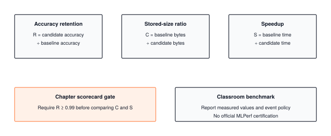

# Milestone III: The Torch Olympics {.unnumbered #sec-milestone-3}

Chapter 20 stacked Part III's optimizations in a cost model and measured a cache transformation against an unchanged reference. Each earlier chapter supplied one part of the evidence. Chapter 15 modeled the storage benefit of packed INT8 codes while executing its rounded weights in float32; Chapter 18 checked that cached attention preserves the reference output while avoiding repeated projections. A complete optimization report must bring these claims together on the artifact that runs. This milestone asks whether one candidate preserves accuracy while reducing measured storage or latency, with every result tied to the same baseline and workload.

This milestone is the book's benchmark. It takes a network from Milestone I, runs it through the profiler, the quantizer, the pruner, and the benchmark harness in one script, and prints a scorecard. A second script checks and times cached execution of the same GPT on fixed token prefixes. The mechanism the chapter teaches is not a new kernel or a new layer. It is the scorecard itself, drawn in @fig-milestone3-olympics, made of three ratios, an accuracy floor, and the discipline of measuring the optimized model rather than describing it.

::: {.callout-note title="Milestone Scope"}
Milestone III integrates Modules 14 through 19 (`tinytorch/src/14_profiling` through `tinytorch/src/19_benchmarking`) with the models of Part I and Part II. The course numbers this milestone 06 and keeps it in `tinytorch/milestones/06_2018_mlperf/`; it has two scripts. `01_optimization_olympics.py` trains the `DigitMLP` of Milestone I on TinyDigits, then profiles, quantizes, prunes, and benchmarks it. `02_generation_speedup.py` checks per-position logits before timing full-prefix and cached GPT execution. Neither script is a line-by-line match for the listings here; the listings are a pure-Python model of the same scorecard, small enough to check by hand.
:::

{#fig-milestone3-olympics}

---

## The Problem

A benchmark that measures one thing rewards whatever is cheapest on that one thing. Here is the model that wins every latency contest ever held without an accuracy rule.

```python
class ZeroModel:
    """Answers every question with the same ten zeros."""
    def forward(self, x):
        return [0.0] * 10

def time_ms(model, x, runs=100):
    import time
    best = float("inf")
    for _ in range(runs):
        t0 = time.perf_counter()
        model.forward(x)
        best = min(best, (time.perf_counter() - t0) * 1000)
    return best

print("ZeroModel latency (ms):", round(time_ms(ZeroModel(), [0.0] * 64), 5))
```

On my machine that prints a latency under a microsecond, and no real model will ever beat it. Its weights occupy zero bytes, so it wins the memory contest too. Its accuracy on ten balanced digit classes is 10%, the same as guessing. The model is absurd, but the failure it exposes is not. Every optimization in Part III moves toward `ZeroModel` by a small step. Quantization discards low-order bits. Pruning discards small weights. A 2-bit quantizer discards almost everything, and it would report a 16× memory reduction with a straight face. Each of those steps is a good trade only up to a point, and a single-axis number cannot tell you where that point is.

The opposite failure is quieter. Chapter 16 showed that zeroing half the entries of a weight matrix leaves the dense multiply doing exactly the same work, since a zero still gets multiplied and added. A student who prunes to 50% sparsity and reports "half the parameters removed" has said something true about the count and nothing about the bytes on disk or the milliseconds per call. Whether that pruning paid off depends on how the weights are stored and how the multiply is run, and neither is visible in the sparsity figure.

So the need is concrete. Take one model, apply the optimizations, and report accuracy, bytes, and latency together, against the unoptimized model, with a rule that disqualifies any candidate whose accuracy falls too far. That rule is the difference between a benchmark and a leaderboard for `ZeroModel`.

---

## The Idea

### Three ratios and a floor

Everything in the scorecard is a ratio of the optimized model against the baseline, so the units cancel and the numbers mean the same thing on any machine. Let $A$ be accuracy on a fixed test set, $M$ the bytes needed to store the parameters, and $t$ the median latency of one forward pass after warmup, with subscripts for the baseline and the candidate. Three numbers summarize a submission:

$$R = \frac{A_{\text{cand}}}{A_{\text{base}}}, \qquad C = \frac{M_{\text{base}}}{M_{\text{cand}}}, \qquad S = \frac{t_{\text{base}}}{t_{\text{cand}}}$$

$R$ is **accuracy retention**, the fraction of the baseline's accuracy the candidate keeps. $C$ is the size ratio, how many times smaller the candidate is. $S$ is the speedup. All three are better when larger, but only $C$ and $S$ are things to maximize. $R$ is a gate. MLPerf Inference, the industry benchmark this milestone is modeled on, requires a submission to reach a fixed fraction of a reference model's accuracy before its latency or throughput is recorded at all, with a target specified for each task. This chapter chooses a relative retention floor of 99%, so its rule reads $R \ge 0.99$. `ZeroModel` has $R = 0.11$ and never reaches the starting line.

### Events

The benchmark module from Chapter 19 turns this into a set of events, each of which fixes floors on two axes and lets submissions compete on the third. A latency sprint requires accuracy of at least 85% and ranks by speed. A memory challenge has the same floor and ranks by bytes. An accuracy contest caps latency at 100 ms and memory at 10 MB and ranks by accuracy. An "extreme push" lowers the accuracy floor to 80% for anyone willing to go further. The floors are absolute here (85% accuracy, not 99% of a baseline), which suits the course's small models, whose baselines vary from run to run; the structure is what matters, and it is the MLPerf structure in miniature.

The set of candidates that cannot improve on one axis without giving something up on another is called the **Pareto frontier**.[^fn-pareto-frontier-scorecard] A benchmark with floors is a way of asking one question about that frontier at a time. Where on the frontier a deployment should sit is a product decision, not an engineering one, and the scorecard's job is to make the frontier visible so that the decision can be made with numbers.

[^fn-pareto-frontier-scorecard]: **Pareto frontier**: in a trade-off between several objectives, the set of options that no other option beats on every objective at once. A candidate off the frontier is simply worse than some other candidate on all axes; moving along the frontier trades one axis for another, and a benchmark cannot say which trade is right, only where the frontier is.

---

## The Code

The code for this milestone lives in two places, the course's own scripts and this chapter's pure-Python model of what they compute, and the honest relationship between the two is worth stating before reading either.

::: {.callout-note title="Source Code Mapping"}
This milestone's scripts (`milestones/06_2018_mlperf/01_optimization_olympics.py` and `02_generation_speedup.py`) drive the NumPy-backed modules students build in the TinyTorch course: `Profiler` from Module 14, `Quantizer` from 15, `Compressor` from 16, `vectorized_matmul` from 17, `KVCache` from 18, and `Benchmark` and `MLPerf` from 19. The excerpts below are taken from those scripts and need the exported `tinytorch` package to run. The scorecard and trace listings are book code, a pure-Python model of the same three-ratio benchmark, small enough to show every step of scoring a submission; they run on their own, and the six-weight trace checks its hand arithmetic against Module 15's `quantize_int8`.
:::

### Script 1: profile, quantize, prune, benchmark

The first script trains `DigitMLP` for ten epochs on TinyDigits, then walks through the optimization steps in order. Each step is a function that takes the model and one of Part III's classes.

Profiling comes first, and it has to. Every ratio on the scorecard compares a candidate against a baseline number, so before we touch a single weight we need the unoptimized model's parameter count, its bytes, its FLOPs, its latency, and its accuracy, written down where nothing later can overwrite them. The tempting shortcut is to skip the ceremony, wrap one forward pass in `time.time()`, and call that the baseline latency. Chapter 14 showed why that one call is the wrong number. The first call of anything pays costs that never recur, and any single call can land on a bad moment, so a cold single reading would inflate every later speedup before any optimization had run. The profiler's answer is the one Chapter 14 built, warm up, repeat, and keep the median.

```python
# Excerpt from milestones/06_2018_mlperf/01_optimization_olympics.py (step_1_profile, trimmed)
profiler = Profiler()
param_count = profiler.count_parameters(model)
param_bytes = param_count * 4                        # FP32 = 4 bytes
flops = profiler.count_flops(model, (1, 64))

sample_input = Tensor(rng.standard_normal((1, 64)).astype(np.float32))
latency_ms = profiler.measure_latency(model, sample_input, warmup=3, iterations=10)

outputs = model(X_test)
predictions = np.argmax(outputs.data, axis=1)
baseline_acc = np.mean(predictions == y_test) * 100
```

Three things to notice. The byte count is derived from the parameter count, not measured, which is fine for FP32 and will matter in a moment. The latency is the median of ten timed calls after three warmup calls, which is Chapter 14's protocol with small counts so the script stays quick, and the same warmup-then-repeat that PyTorch's `torch.utils.benchmark.Timer` performs before it reports a median. And the accuracy is computed over the whole test set in one batch, so it is a real number on real data, unlike anything the profiler returns.

Quantization is next, and it owns the memory axis. A model that ships to a phone or a microcontroller has a byte budget before it has anything else, and INT8 weights are the first thing every deployment toolchain reaches for, because they cut the bytes by 4 without touching the shape of the forward pass. The lazy way to fill in $C$ is to divide the FP32 byte count by 4 and write down $4.0\times$. That takes one line, and it skips the one thing we actually need to know, which is whether the model still works with each weight rounded to one of 256 levels. Chapter 15's quantizer maps a tensor's range onto those levels with a scale and a zero point, and the script's bookkeeping around that call is worth reading slowly, because it takes the lazy way on exactly the half that matters.

```python
# Excerpt from 01_optimization_olympics.py (step_2_quantize, trimmed)
quant_result = Quantizer.quantize_model(model)
quant_size = int(param_bytes / quant_result['compression_ratio'])
```

`Quantizer.quantize_model` returns codes, scales, and zero points without changing `model`. The current script then creates a fresh `DigitMLP`, restores each parameter from those codes, and measures its predictions on the same test set. That second half of `step_2_quantize` is essential: rounding has to reach the forward pass before its effect on accuracy can be measured.

```python
# Continued excerpt from step_2_quantize
quant_model = DigitMLP()
quant_params = [p for layer in quant_model.layers for p in layer.parameters()]
for idx, param in enumerate(quant_params):
    entry = quant_result['quantized_layers'][f'param_{idx}']
    restored = Quantizer.dequantize_tensor(
        entry['quantized'], entry['scale'], entry['zero_point'])
    param.data = restored.data.reshape(entry['original_shape'])
outputs_quant = quant_model(X_test)
quant_acc = np.mean(np.argmax(outputs_quant.data, axis=1) == y_test) * 100
```

Follow one parameter through the loop: its index selects the corresponding quantized entry, its scale and zero point reconstruct rounded weights, and its original shape restores the matrix expected by `Linear`. The baseline remains untouched. The resulting accuracy measures quantization error under floating-point execution; it does not demonstrate an integer kernel or packed storage. The reported 4.0 compression ratio is still an analytical count of one byte per code, excluding scale metadata. TinyTorch stores the code tensors and the reconstructed weights as float32 arrays.

Pruning is the second byte-cutter, and it is the one step in this script that destroys its input. `magnitude_prune` zeroes weights in place, and a zero has no memory of what it replaced. If the script pruned `model` itself, the FP32 baseline would be gone. The accuracy retention $R$ would then be a pruned model divided by a pruned model, which is $1.000$ no matter how much damage was done, and the only way to get the denominator back would be another ten epochs of training. So the script copies first, tensor by tensor, and prunes the copy. Both candidate copies run on the same held-out inputs.

```python
# Excerpt from 01_optimization_olympics.py (step_3_prune, trimmed)
model_copy = DigitMLP()
for i, layer in enumerate(model.layers):
    for j, param in enumerate(layer.parameters()):
        model_copy.layers[i].parameters()[j].data = param.data.copy()

sparsity_before = Compressor.measure_sparsity(model_copy)
Compressor.magnitude_prune(model_copy, sparsity=0.5)
sparsity_after = Compressor.measure_sparsity(model_copy)

outputs_pruned = model_copy(X_test)
pruned_acc = np.mean(np.argmax(outputs_pruned.data, axis=1) == y_test) * 100
```

`magnitude_prune` gathers every weight matrix (biases excluded), ranks their magnitudes globally, and zeroes the smallest half in place. `measure_sparsity` counts the zeros, and the pruned accuracy is measured on the candidate. Its dense array bytes remain unchanged. A sparse representation would also need indices; the worked trace below models those separately. The script preserves the unmodified baseline for all comparisons.

The benchmark step owns the latency axis, and it asks a different question from the profiler's. The profiler wanted a typical number for the baseline. A serving team wants to know how slow the slow calls are, because a user waits on the tail, not the median, and Chapter 14's p99 rule exists for that reason. A single timed call cannot answer either question; it picks one point on the latency distribution at random and reports it as if it were the whole. Chapter 19's `Benchmark` runs the forward pass repeatedly, keeps every timing, and reports a mean, a standard deviation, and a 95th percentile. The default is 100 measurements; the script selects a sorted entry rather than using `BenchmarkResult.percentile`, so its P95 convention differs slightly from Chapter 19's interpolated percentile.

```python
# Excerpt from 01_optimization_olympics.py (step_6_benchmark, trimmed)
benchmark = Benchmark(models=[model], datasets=[(X_test, y_test)])
latency_results = benchmark.run_latency_benchmark(input_shape=(1, 64))
bench_result = list(latency_results.values())[0]

sorted_vals = sorted(bench_result.values)
p95_latency = sorted_vals[min(int(len(sorted_vals) * 0.95), len(sorted_vals) - 1)]
```

The excerpt shows one invocation. The script calls this same helper for the baseline, reconstructed quantized candidate, and pruned candidate, so each row receives its own measured accuracy and latency distribution. The summary distinguishes actual array bytes from the modeled packed-code count. The ratios therefore compare executed candidates; they do not infer speed from sparsity or code width.

### Script 2: generation with and without the cache

The second script measures the one Part III optimization whose speedup comes from doing less arithmetic rather than from storing fewer bytes. A language model generates one token at a time, and every new token attends over every token before it. The naive loop, the one Milestone II ran, reruns the full forward pass over the whole sequence at every step. For 16 tokens that means step $t$ processes $t$ positions and the loop processes $1 + 2 + \dots + 16 = 136$ positions in all. At a 4,096-token context the same sum is over 8 million positions to produce 4,096 tokens, almost all of it recomputing keys and values that have not changed since the previous step. Chapter 18's cache keeps those keys and values, so each step processes one new token and reads the rest back, 16 positions for 16 tokens. The ratio $136 / 16 = 8.5$ counts projection rows removed, not end-to-end speedup or all attention work. A cached query still scores its growing prefix. The script checks equivalent execution paths before comparing their timings.

The script builds the actual two-block `GPT` from Chapter 13 with vocabulary 27, width 32, and two heads. It replays one fixed token sequence through both paths, rather than sampling different inputs for each timing. The core loop is extracted here from the script.

```python
def replay_prefixes(model, tokens, cache=None):
    """Return the next-token logits at every position of one fixed sequence.

    The cache cursor advances once after all layers process a token. Resetting
    at entry makes each replay an independent request, including warmup runs.
    """
    from tinytorch.core.tensor import Tensor

    if cache is not None:
        cache.reset()
    logits = []
    for position in range(tokens.shape[1]):
        if cache is None:
            output = model(Tensor(tokens[:, :position + 1]))
        else:
            output = model(Tensor(tokens[:, position:position + 1]),
                           start_pos=cache.seq_pos)
            cache.advance()
        logits.append(output.data[:, -1, :].copy())
    return np.stack(logits, axis=1)
```

Each uncached call sees the full causal prefix. Each cached call sees one token at its correct position, traverses every transformer block, and advances the shared cursor once afterward. The returned array holds next-token logits at every position, so `compare_cached_replay` checks all of them with `assert_allclose` before reporting a speedup. The timer includes the same complete replay on each path after warmup, with cache reset at the start of every cached replay. A `finally` block removes the wrapper even when a check fails. This is a controlled inference workload on fixed tokens, not a claim about language quality or a guaranteed speedup on every machine.

### The scorecard

The three numbers now come from three different tools, and nothing in the script ties them together. The profiler knows the baseline, the quantizer knows a byte count, the benchmark knows a latency distribution, and the final table prints them side by side and leaves the verdict to the reader. Anyone reading that table wants one verdict, and the naive way to produce one is a weighted sum, so much weight on accuracy, so much on size, so much on speed. I tried it against the FP32 baseline from the trace below, with half the weight on retention and a quarter each on the other two ratios. A careful INT8 candidate that keeps 99.4% of the accuracy, is 3.97× smaller, and runs at the same speed scores 1.7. A reckless one that keeps 68% of the accuracy, is 7.9× smaller, and runs 100× faster scores 27. A sum lets one axis buy another, and the people submitting to a benchmark will find the weighting that lets them buy the most. A floor cannot be bought. Above it, memory and latency compete on their own; below it, nothing else is looked at.

So the rest of the chapter uses a pure-Python scorecard that runs anywhere and refuses to add. It takes a baseline and a candidate, each described by three numbers, and returns the three ratios and the MLPerf-style verdict. A second function checks a candidate against the event floors of Chapter 19's benchmark module.

```python
EVENTS = {
    "latency_sprint":   {"min_accuracy": 0.85},
    "memory_challenge": {"min_accuracy": 0.85},
    "accuracy_contest": {"max_latency_ms": 100.0, "max_bytes": 10 * 2**20},
    "extreme_push":     {"min_accuracy": 0.80},
}

def score(baseline, candidate):
    """Three ratios, each candidate-vs-baseline, plus the MLPerf-style floor."""
    retention = candidate["accuracy"] / baseline["accuracy"]
    return {
        "retention": retention,
        "size_ratio": baseline["bytes"] / candidate["bytes"],
        "speedup": baseline["p50_ms"] / candidate["p50_ms"],
        "mlperf_ok": retention >= 0.99,
    }

def qualifies(candidate, event):
    rules = EVENTS[event]
    return (candidate["accuracy"] >= rules.get("min_accuracy", 0.0)
            and candidate["p50_ms"] <= rules.get("max_latency_ms", float("inf"))
            and candidate["bytes"] <= rules.get("max_bytes", float("inf")))
```

There is deliberately nothing clever here. The three ratios are three divisions, the floor is one comparison, and the event rules are a dictionary. The value of the scorecard is not in the code but in what it refuses to do. It will not combine the ratios into a single number, but the function accepts whatever measurements the caller supplies. It cannot tell a measured value from an estimate; that distinction belongs in the report and the experiment that produced it. MLPerf calls the floor an accuracy target, and the bridge section covers what it builds around one.

---

## A Worked Trace

The trace has two parts. The first pushes one small weight matrix through the two algorithms that change bytes, so that every number can be checked by hand. The second fills in the scorecard for `DigitMLP`.

### One matrix, quantized and pruned

Script 1 measures the rounded model's accuracy, but its $4.0\times$ storage ratio remains an estimate. A small trace separates the arithmetic of rounding from the representation used to store its result. The comfortable assumption is that it does nothing, since the codes decode back into weights. They decode back into nearby weights, each within half a quantization step of where it started, and the only way to see how wide that step is, and which weights pruning would then discard, is to push a few weights through both rules by hand. Take the six weights $w = [-1.0,\ 0.0,\ 2.0,\ 0.5,\ 1.5,\ -0.5]$, the example from Module 15's own docstring. Min-max INT8 quantization first widens the range to include zero (it already does), then sets the scale to the range divided by 255 and the zero point to whatever integer maps the minimum onto $-128$.

```python
def quantize_int8(values):
    """Asymmetric min-max INT8: returns (codes, scale, zero_point)."""
    lo, hi = min(min(values), 0.0), max(max(values), 0.0)
    scale = (hi - lo) / 255
    zero_point = round(-128 - lo / scale)
    codes = [max(-128, min(127, round(v / scale + zero_point))) for v in values]
    return codes, scale, zero_point

def dequantize_int8(codes, scale, zero_point):
    return [(c - zero_point) * scale for c in codes]

w = [-1.0, 0.0, 2.0, 0.5, 1.5, -0.5]
codes, scale, zp = quantize_int8(w)
print(round(scale, 4), zp, codes)
print([round(v, 4) for v in dequantize_int8(codes, scale, zp)])
```

The scale is $3 / 255 = 0.011765$ and the zero point is $\text{round}(-128 + 85) = -43$. For this nonconstant, zero-spanning input, the hand function follows Module 15's rule and the module agrees. It is not a replacement for the implementation: a constant input would divide by zero here, while the module handles constant tensors explicitly.

```python
import numpy as np
from tinytorch.core.tensor import Tensor
from tinytorch.perf.quantization import quantize_int8

codes, scale, zp = quantize_int8(Tensor(np.array(w, dtype=np.float32)))
print(codes.data, round(scale, 6), zp)       # [-128. -43. 127. 0. 84. -86.] 0.011765 -43
```

@tbl-m3-quant-prune-trace lists each weight's code, its reconstruction, and its fate under 50% magnitude pruning, whose threshold is the median magnitude, $0.75$.

| Weight $w$ | Code $\text{round}(w / 0.011765 - 43)$ | Reconstructed | Error | $\lvert w \rvert \ge 0.75$? | After pruning |
| :--- | :--- | :--- | :--- | :--- | :--- |
| $-1.0$ | $-128$ | $-1.0000$ | $0$ | yes | $-1.0$ |
| $0.0$ | $-43$ | $0.0000$ | $0$ | no | $0.0$ |
| $2.0$ | $127$ | $2.0000$ | $0$ | yes | $2.0$ |
| $0.5$ | $0$ | $0.5059$ | $0.0059$ | no | $0.0$ |
| $1.5$ | $84$ | $1.4941$ | $0.0059$ | yes | $1.5$ |
| $-0.5$ | $-86$ | $-0.5059$ | $0.0059$ | no | $0.0$ |

: Six weights through min-max INT8 quantization (scale $0.011765$, zero point $-43$) and through 50% magnitude pruning (threshold $0.75$). {#tbl-m3-quant-prune-trace tbl-colwidths="[12,24,16,12,18,18]"}

The largest reconstruction error is half a quantization step, $0.0059$, which is what rounding guarantees. The three weights that survive pruning are the three largest in magnitude, and the sparsity is exactly $3/6 = 50\%$. Nothing about either operation depends on the size of the matrix; `DigitMLP`'s 2,368 weights go through the same two rules, and PyTorch's name for the first of them is per-tensor affine quantization.

### The scorecard for `DigitMLP`

A benchmark is more useful when you know what it should print, so the prediction comes before the ledger. `DigitMLP` has two linear layers, 64 inputs to 32 hidden units to 10 classes, and its parameter count follows from that shape: $64 \times 32 + 32 + 32 \times 10 + 10 = 2{,}410$. At 4 bytes each that is $9{,}640$ bytes, and one forward pass costs $2 \times (64 \times 32 + 32 \times 10) = 4{,}736$ FLOPs, counting a multiply and an add as two. These are counts, not measurements, and they are exact.

Napkin math for the rest. A hypothetical packed INT8 format keeps 1 byte per parameter plus a scale and a zero point for each of the four parameter tensors, so about $2{,}410 + 20 = 2{,}430$ bytes, a size ratio just under 4. Pruning half the weights to zero and storing them densely changes nothing, and storing them in the compressed sparse row format of Chapter 16 costs an index per surviving weight, which at 50% sparsity roughly cancels the saving. And latency should barely move at all. A multiply of a $1 \times 64$ row against a $64 \times 32$ matrix is a few microseconds of arithmetic under the fixed cost of a Python call, and neither INT8 storage nor zeroed weights changes how many multiplies the dense forward pass performs. If the script reports a large speedup from quantization or pruning on this model, the right reaction is suspicion, not celebration.

Now fill in the ledger. Packed-format bytes are counted from the architecture; accuracies are the values the milestone's README says to expect (88% baseline, about two points lower after pruning), stated here as an illustration and not as a measurement; and the latency column is deliberately the same napkin figure in every row, because the script never times the optimized models and the arithmetic they perform is unchanged.

```python
params = 64 * 32 + 32 + 32 * 10 + 10           # 2,410
weights = 64 * 32 + 32 * 10                     # 2,368, biases excluded
fp32_bytes = params * 4                         # 9,640
int8_bytes = params + 4 * (4 + 1)               # codes + (scale, zero point) x 4 tensors
nnz = weights // 2                              # 1,184 survivors at 50% sparsity
csr50_bytes = nnz * 2 + (33 + 11) * 2 + 42 + 4 * 5   # value+index, row starts, biases, scales

ledger = {
    "fp32":   {"accuracy": 0.880, "bytes": fp32_bytes,  "p50_ms": 0.05},
    "int8":   {"accuracy": 0.880, "bytes": int8_bytes,  "p50_ms": 0.05},
    "pruned": {"accuracy": 0.860, "bytes": csr50_bytes, "p50_ms": 0.05},
}
base = ledger["fp32"]
for name, cand in ledger.items():
    s = score(base, cand)
    print(f"{name:7s} R={s['retention']:.3f} C={s['size_ratio']:.2f}x "
          f"S={s['speedup']:.2f}x floor={s['mlperf_ok']} "
          f"events={[e for e in EVENTS if qualifies(cand, e)]}")
```

The sparse byte count assumes INT8 values with 1-byte column indices (every column index is below 64, so one byte suffices), 2-byte row-start entries for the 33 and 11 row boundaries of the two matrices, 42 bias bytes, and the scales. The loop prints the rows of @tbl-m3-scorecard from those counts.

| Stage | Bytes | Accuracy | $R$ | $C$ | $S$ | $R \ge 0.99$? | Event floors met |
| :--- | :--- | :--- | :--- | :--- | :--- | :--- | :--- |
| FP32 baseline | $9{,}640$ | $88.0\%$ | $1.000$ | $1.00\times$ | $1.00\times$ | yes | all four |
| + INT8 | $2{,}430$ | $88.0\%$ (illustrative) | $1.000$ | $3.97\times$ | $1.00\times$ | yes | all four |
| + prune 50%, CSR | $2{,}518$ | $86.0\%$ | $0.977$ | $3.83\times$ | $1.00\times$ | **no** | all four |

: The scorecard for `DigitMLP`. Bytes are counts for the stated hypothetical storage formats; accuracies are the README's expected values; latency is the same napkin figure throughout because the script does not time the optimized models. {#tbl-m3-scorecard tbl-colwidths="[18,10,18,8,10,10,12,14]"}

Three lessons sit in this small table. The INT8 ratio is $3.97\times$, not the $4.0\times$ the script reports, because the script does not count the scales and zero points; on a model with 2,410 parameters and four tensors the difference is trivial, and on a model quantized per channel with thousands of scales it is not. The pruned row is *larger* than the INT8 row, because at 50% sparsity every surviving weight drags a 1-byte index along with it and the two costs cancel; sparse storage starts paying only when sparsity is well above the index overhead, and at 90% the same arithmetic gives about 624 bytes, a $15\times$ ratio. And the illustrated pruned model fails this chapter's retention floor while passing every event floor in the module, which is not a contradiction. The two floors ask different questions, one relative and strict, one absolute and lenient, and a candidate's standing depends on which question the benchmark asks. The speedup column is $1.00\times$ by assumption. A real results table should mark an unmeasured speedup as unavailable rather than carrying this illustrative value forward.

---

## From TinyTorch to Production

The scorecard borrows the idea of an accuracy gate from MLPerf Inference, the benchmark that hardware and software vendors submit to twice a year. What production adds is everything needed to make the numbers trustworthy when the people producing them have a reason to shade them. The differences are worth walking through, because each one answers a question this chapter raised.

The first difference is who holds the stopwatch. In the milestone script, the script's own code decides when the clock starts and stops, and a careless (or clever) submitter can move those lines. MLPerf routes every query through LoadGen,[^fn-loadgen-mlperf-bridge] a load generator maintained by MLCommons that issues inputs to the submitter's system, times the responses itself, and writes timing logs for validation and review. The submitter's code is a callback; the timing is not theirs to touch.

The second difference is which number is reported. MLPerf defines scenarios rather than a single latency. Single-stream sends one query at a time and reports the 90th-percentile latency. Server sends queries at a Poisson-distributed rate and asks for the highest rate at which the 99th-percentile latency stays under a fixed bound, which is the p99 rule of Chapter 14 turned into a throughput contest. Offline sends everything at once and reports throughput alone. A single model gets a different number in each scenario, and vendors are expected to publish which one they ran.

The third difference is the validation protocol. MLPerf requires accuracy evidence and performance results under task-specific rules. Its closed division constrains the model and permits specified transformations such as calibration for quantization; its open division allows broader model changes. These are submission rules, not properties inferred from a class named `MLPerf`. The classroom class borrows four task names from MLPerf Tiny, but it does not implement official LoadGen execution, datasets, and compliance checks.[^fn-mlperf-tiny-bridge] The [MLCommons submission guide](https://docs.mlcommons.org/inference/submission/) and [inference rules](https://github.com/mlcommons/inference_policies/blob/master/inference_rules.adoc) define those requirements.

What carries over unchanged is the whole shape of the argument. Three axes against a baseline, an accuracy gate before speed counts, warmup before timing, percentiles rather than means, and the insistence on timing the artifact that will actually ship. Per-tensor min-max quantization is the entry-level version of what a production toolchain does; PyTorch's quantization, TensorRT, and llama.cpp's formats use per-channel or per-group scales chosen from calibration data, which is why the scale-and-zero-point overhead that was trivial in the trace becomes a real line item. Magnitude pruning survives in production with one change the trace already motivated. Unstructured zeros do not speed a dense kernel, so NVIDIA's hardware supports the 2:4 pattern of Chapter 16, in which the zeros sit where the multiply unit can skip them, and the size ratio and the speedup finally move together. The two harnesses differ on six points, set side by side in @tbl-m3-tinytorch-vs-mlperf.

| | Milestone III script | MLPerf Inference |
| :--- | :--- | :--- |
| Who times the model | The script itself | LoadGen, an external harness |
| Latency statistic | Profiler median over 10 runs; benchmark P95 over 100 by default | p90 (single-stream) or p99 bound (server) |
| Accuracy check | One pass over the test set | Separate run over the full validation set |
| Accuracy floor | 85% absolute (events) | 99% or 99.9% of a reference model |
| Which model is timed | The FP32 baseline only | The submitted, optimized artifact |
| Results review | None | Peer review by other submitters before publication |

: What the milestone's benchmark leaves out and what MLPerf adds, and why. {#tbl-m3-tinytorch-vs-mlperf tbl-colwidths="[28,36,36]"}

What a practitioner should now look for is the same short list every time a speedup is announced. Which model was timed, and was it the optimized one? What was its accuracy, on what set, and against what reference? Is the number a median after warmup or a single cold run? Is the size ratio counting the scales, the indices, and the biases? And when a pruning result shows memory shrinking but latency flat, that is not a failed experiment. It is the dense kernel telling you that the zeros were never skipped, which is the trace's second lesson exactly.

[^fn-loadgen-mlperf-bridge]: **LoadGen**: the open-source load generator that every MLPerf Inference submission must run under. It generates queries, delivers them to the system under test, records the response times, and validates the log, so that a submitter's own code never touches the stopwatch.

[^fn-mlperf-tiny-bridge]: **MLPerf Tiny** targets microcontroller-class devices. The classroom task names come from its original keyword spotting, visual wake words, anomaly detection, and image classification benchmarks. Official Tiny measurements use single-stream inference and can include energy per inference; these requirements differ from the classroom scorecard's three ratios.

---

## Summary

This milestone built the scorecard that turns Part III's separate optimizations into a verdict. Three ratios, accuracy retention $R$, size ratio $C$, and speedup $S$, each compare the optimized model against the baseline; a floor on $R$ decides whether the other two are looked at; and events fix floors on two axes to rank on the third. The worked trace pushed six weights through min-max INT8 quantization and 50% magnitude pruning by hand, then counted a proposed packed representation of `DigitMLP` to show that its INT8 format would give $3.97\times$, that 50% pruning in sparse storage gives slightly less, and that neither changes how many multiplies the dense forward pass performs. Reading the milestone scripts closely exposed where their printed numbers are measurements and where they are assumptions, which is the skill the scorecard exists to teach. The invariant to carry forward is that an optimization has paid off only when the optimized artifact itself has been measured on all three axes, against the same baseline, with an accuracy floor it cleared. Chapter 21 takes for granted that you can measure an optimization honestly on accuracy, memory, and latency at once, and asks what production compilers and custom silicon do to move those numbers further than pure Python can.

---

## Exercises

1. Trace the current optimization script's reconstruction of the quantized `DigitMLP`. Assert that the baseline parameters remain unchanged, and compare the reconstructed copy's logits with the baseline on the same test set. Report the measured retention $R$, and state whether it clears the $0.99$ floor. Then repeat with a 4-bit scheme (scale over 15 levels instead of 255) and find the smallest bit width at which the floor still holds.

2. Run the script's baseline and pruned-candidate benchmarks and report the measured $S$ with its p95. Before running it, write down your prediction using the napkin argument from the worked trace. Then replace the dense multiply in the pruned model's `Linear` layers with a loop over nonzero entries only, time it again, and explain why a sparse loop in Python is slower than the dense NumPy multiply even at 90% sparsity.

3. Extend the generation experiment to several prefix lengths and layer counts. Keep the same token IDs for both paths, retain the per-position logit check, and verify a repeated request after reset before timing. Compare the measured ratio with the $136 / 16 = 8.5$ projection-row ratio and explain why that ratio is not a bound on the complete program.
