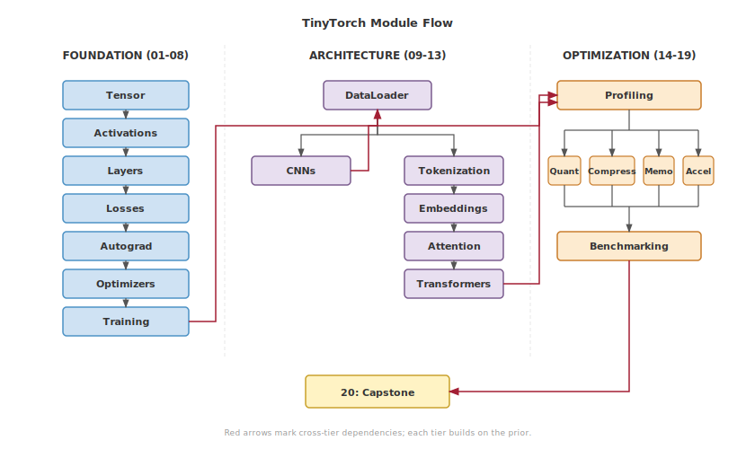

**2-minute orientation before you begin building**

You're about to build a working ML framework, one module at a time. Before diving in, take two minutes to see how the twenty modules connect, what you'll have when you're done, and which path through the book fits your goals.

::: {.content-visible when-format="html"}

<style>
.pdf-viewer-container {
  margin: 1.5rem 0;
  background: #0f172a;
  border-radius: 1.25rem;
  overflow: hidden;
  box-shadow: 0 4px 20px rgba(0,0,0,0.15);
}
.pdf-header {
  display: flex;
  align-items: center;
  justify-content: space-between;
  padding: 0.75rem 1rem;
  background: rgba(255,255,255,0.03);
}
.pdf-title {
  display: flex;
  align-items: center;
  gap: 0.5rem;
  color: #94a3b8;
  font-weight: 500;
  font-size: 0.85rem;
}
.pdf-title-icon {
  font-size: 1rem;
}
.pdf-subtitle {
  color: #64748b;
  font-weight: 400;
  font-size: 0.75rem;
}
.pdf-toolbar {
  display: flex;
  align-items: center;
  gap: 0.375rem;
}
.pdf-toolbar button {
  background: transparent;
  border: none;
  color: #64748b;
  width: 32px;
  height: 32px;
  border-radius: 0.375rem;
  cursor: pointer;
  font-size: 1.1rem;
  font-weight: 400;
  transition: all 0.15s;
  display: flex;
  align-items: center;
  justify-content: center;
}
.pdf-toolbar button:hover {
  background: rgba(249, 115, 22, 0.15);
  color: #f97316;
}
.pdf-toolbar button:active {
  transform: scale(0.92);
}
.pdf-nav-group {
  display: flex;
  align-items: center;
  gap: 0;
}
.pdf-page-info {
  color: #64748b;
  font-size: 0.75rem;
  padding: 0 0.5rem;
  font-weight: 500;
}
.pdf-zoom-group {
  display: flex;
  align-items: center;
  gap: 0;
  margin-left: 0.25rem;
  padding-left: 0.5rem;
  border-left: 1px solid rgba(255,255,255,0.1);
}
.pdf-canvas-wrapper {
  display: flex;
  justify-content: center;
  align-items: center;
  padding: 0.5rem 1rem 1rem 1rem;
  min-height: 480px;
  background: #0f172a;
}
#pdf-canvas {
  max-width: 100%;
  max-height: 450px;
  height: auto;
  border-radius: 0.5rem;
  box-shadow: 0 4px 24px rgba(0,0,0,0.4);
}
.pdf-progress-wrapper {
  padding: 0 1rem 0.5rem 1rem;
  background: #0f172a;
}
.pdf-progress-bar {
  height: 3px;
  background: rgba(255,255,255,0.08);
  border-radius: 1.5px;
  overflow: hidden;
  cursor: pointer;
}
.pdf-progress-fill {
  height: 100%;
  background: #f97316;
  border-radius: 1.5px;
  transition: width 0.2s ease;
}
.pdf-loading {
  color: #f97316;
  font-size: 0.9rem;
  display: flex;
  align-items: center;
  gap: 0.5rem;
}
.pdf-loading::before {
  content: '';
  width: 18px;
  height: 18px;
  border: 2px solid rgba(249, 115, 22, 0.2);
  border-top-color: #f97316;
  border-radius: 50%;
  animation: spin 0.8s linear infinite;
}
@keyframes spin {
  to { transform: rotate(360deg); }
}
.pdf-footer {
  display: flex;
  justify-content: center;
  gap: 0.5rem;
  padding: 0.75rem 1rem;
  background: rgba(255,255,255,0.02);
  border-top: 1px solid rgba(255,255,255,0.05);
}
.pdf-footer a {
  display: inline-flex;
  align-items: center;
  gap: 0.375rem;
  background: #f97316;
  color: white;
  padding: 0.5rem 1rem;
  border-radius: 2rem;
  text-decoration: none;
  font-weight: 500;
  font-size: 0.8rem;
  transition: all 0.15s;
}
.pdf-footer a:hover {
  background: #ea580c;
  transform: translateY(-1px);
  color: white;
}
.pdf-footer a.secondary {
  background: transparent;
  color: #94a3b8;
  border: 1px solid rgba(255,255,255,0.15);
}
.pdf-footer a.secondary:hover {
  background: rgba(255,255,255,0.05);
  color: #f8fafc;
  border-color: rgba(255,255,255,0.25);
}
.pdf-viewer-container:fullscreen,
.pdf-viewer-container:-webkit-full-screen {
  display: flex;
  flex-direction: column;
  background: #0a0a0f;
}
.pdf-viewer-container:fullscreen .pdf-canvas-wrapper,
.pdf-viewer-container:-webkit-full-screen .pdf-canvas-wrapper {
  flex: 1;
  min-height: auto;
  padding: 1rem;
}
.pdf-viewer-container:fullscreen #pdf-canvas,
.pdf-viewer-container:-webkit-full-screen #pdf-canvas {
  max-height: calc(100vh - 140px);
  max-width: 95vw;
}
@media (max-width: 600px) {
  .pdf-header {
    flex-direction: column;
    gap: 0.5rem;
    padding: 0.625rem 0.75rem;
  }
  .pdf-toolbar button {
    width: 28px;
    height: 28px;
    font-size: 1rem;
  }
  .pdf-canvas-wrapper {
    min-height: 300px;
    padding: 0.5rem;
  }
  #pdf-canvas {
    max-height: 260px;
  }
  .pdf-progress-wrapper {
    padding: 0 0.75rem 0.375rem 0.75rem;
  }
  .pdf-footer {
    flex-direction: row;
    padding: 0.625rem 0.75rem;
  }
  .pdf-footer a {
    padding: 0.4rem 0.75rem;
    font-size: 0.75rem;
  }
}
</style>

<div class="pdf-viewer-container">
<div class="pdf-header">
<div class="pdf-title">
<span class="pdf-title-icon">🔥</span>
<span>TinyTorch Overview</span>

<span class="pdf-subtitle">· AI-generated</span>
</div>
<div class="pdf-toolbar">
<div class="pdf-nav-group">
<button id="pdf-prev" onclick="pdfPrevPage()" title="Previous slide">‹</button>
<span class="pdf-page-info"><span id="pdf-page-num">1</span> / <span id="pdf-page-count">-</span></span>
<button id="pdf-next" onclick="pdfNextPage()" title="Next slide">›</button>
</div>
<div class="pdf-zoom-group">
<button onclick="pdfZoomOut()" title="Zoom out">−</button>
<button onclick="pdfZoomIn()" title="Zoom in">+</button>
</div>
</div>
</div>
<div class="pdf-canvas-wrapper">
<div id="pdf-loading" class="pdf-loading">Loading slides...</div>
<canvas id="pdf-canvas" style="display:none;"></canvas>
</div>
<div class="pdf-progress-wrapper">
<div class="pdf-progress-bar" id="pdf-progress-bar" onclick="pdfProgressClick(event)">
<div class="pdf-progress-fill" id="pdf-progress-fill" style="width: 0%;"></div>
</div>
</div>
<div class="pdf-footer">
<a href="assets/downloads/00_tinytorch.pdf" download>
      ⬇️ Download
</a>

<a href="#" onclick="pdfFullscreen(); return false;" class="secondary">
      ⛶ Fullscreen
</a>

</div>
</div>

<script src="https://cdnjs.cloudflare.com/ajax/libs/pdf.js/3.11.174/pdf.min.js"></script>
<script>
(function() {
  const pdfUrl = 'assets/downloads/00_tinytorch.pdf';
  let pdfDoc = null;
  let pageNum = 1;
  let pageRendering = false;
  let pageNumPending = null;
  let scale = 1.5;
  const canvas = document.getElementById('pdf-canvas');
  const ctx = canvas.getContext('2d');

  pdfjsLib.GlobalWorkerOptions.workerSrc = 'https://cdnjs.cloudflare.com/ajax/libs/pdf.js/3.11.174/pdf.worker.min.js';

  function updateProgress() {
    if (pdfDoc) {
      const progress = (pageNum / pdfDoc.numPages) * 100;
      document.getElementById('pdf-progress-fill').style.width = progress + '%';
    }
  }

  function renderPage(num) {
    pageRendering = true;
    pdfDoc.getPage(num).then(function(page) {
      const viewport = page.getViewport({scale: scale});
      canvas.height = viewport.height;
      canvas.width = viewport.width;

      const renderContext = {
        canvasContext: ctx,
        viewport: viewport
      };
      const renderTask = page.render(renderContext);

      renderTask.promise.then(function() {
        pageRendering = false;
        if (pageNumPending !== null) {
          renderPage(pageNumPending);
          pageNumPending = null;
        }
      });
    });
    document.getElementById('pdf-page-num').textContent = num;
    updateProgress();
  }

  function queueRenderPage(num) {
    if (pageRendering) {
      pageNumPending = num;
    } else {
      renderPage(num);
    }
  }

  window.pdfPrevPage = function() {
    if (pageNum <= 1) return;
    pageNum--;
    queueRenderPage(pageNum);
  };

  window.pdfNextPage = function() {
    if (pageNum >= pdfDoc.numPages) return;
    pageNum++;
    queueRenderPage(pageNum);
  };

  window.pdfZoomIn = function() {
    scale = Math.min(scale + 0.25, 3);
    queueRenderPage(pageNum);
  };

  window.pdfZoomOut = function() {
    scale = Math.max(scale - 0.25, 0.5);
    queueRenderPage(pageNum);
  };

  window.pdfFullscreen = function() {
    const container = document.querySelector('.pdf-viewer-container');
    if (container.requestFullscreen) {
      container.requestFullscreen();
    } else if (container.webkitRequestFullscreen) {
      container.webkitRequestFullscreen();
    } else if (container.msRequestFullscreen) {
      container.msRequestFullscreen();
    }
  };

  window.pdfProgressClick = function(event) {
    if (!pdfDoc) return;
    const bar = document.getElementById('pdf-progress-bar');
    const rect = bar.getBoundingClientRect();
    const clickX = event.clientX - rect.left;
    const percentage = clickX / rect.width;
    const targetPage = Math.max(1, Math.min(pdfDoc.numPages, Math.ceil(percentage * pdfDoc.numPages)));
    if (targetPage !== pageNum) {
      pageNum = targetPage;
      queueRenderPage(pageNum);
    }
  };

  // Keyboard navigation
  document.addEventListener('keydown', function(event) {
    // Only handle if not in an input field
    if (event.target.tagName === 'INPUT' || event.target.tagName === 'TEXTAREA') return;

    if (event.key === 'ArrowLeft' || event.key === 'ArrowUp') {
      event.preventDefault();
      pdfPrevPage();
    } else if (event.key === 'ArrowRight' || event.key === 'ArrowDown' || event.key === ' ') {
      event.preventDefault();
      pdfNextPage();
    }
  });

  pdfjsLib.getDocument(pdfUrl).promise.then(function(pdf) {
    pdfDoc = pdf;
    document.getElementById('pdf-page-count').textContent = pdf.numPages;
    document.getElementById('pdf-loading').style.display = 'none';
    canvas.style.display = 'block';
    renderPage(pageNum);
  }).catch(function(error) {
    document.getElementById('pdf-loading').innerHTML =
      'Unable to load PDF viewer. <a href="' + pdfUrl + '" style="color:#f97316;">Download directly</a>';
  });
})();

</script>

:::

## The Journey: Foundation to Production

TinyTorch takes you from a bare tensor to a production-style ML system in twenty modules. They connect like this.

**Three tiers, one system:**

- **Foundation (blue)** — Build the core machinery. Tensors hold data, activations add non-linearity, layers combine them, losses measure error, autograd computes gradients, optimizers update weights, training orchestrates the loop.

- **Architecture (purple)** — Apply the foundation to real problems. The DataLoader feeds data; from there you take one of two paths—convolutions for images, or the transformer stack (Tokenization → Embeddings → Attention → Transformers) for text.

- **Optimization (orange)** — Make it fast. Profile to find bottlenecks, then apply quantization, compression, acceleration, or memoization. Benchmark to prove the gain.

::: {#fig-module-flow}
{fig-alt="Three-tier architecture. Foundation tier (blue) chains Tensor -> Activations -> Layers -> Losses -> Autograd -> Optimizers -> Training. Architecture tier (muted purple) shows DataLoader branching to CNNs and to Tokenization -> Embeddings -> Attention -> Transformers. Optimization tier (orange) shows Profiling fanning out to Quantization, Compression, Memoization, and Acceleration, all converging on Benchmarking. Red cross-tier arrows link Training -> DataLoader, CNNs and Transformers -> Profiling, and Benchmarking -> Capstone."}

**TinyTorch Module Flow.** The 20 modules progress through three tiers: Foundation (blue) builds core ML primitives, Architecture (purple) applies them to vision and language tasks, and Optimization (orange) makes systems production-ready.
:::

</div>


**Flexible paths:**

- **Vision focus** — Foundation → DataLoader → Convolutions → Optimization
- **Language focus** — Foundation → DataLoader → Tokenization → … → Transformers → Optimization
- **Full course** — Both paths → Capstone

## Milestones You'll Unlock

As you build, you unlock historical milestones—moments when your code does something that once made headlines:

1. **1958 Perceptron**: Your first learning algorithm with automatic weight updates (Rosenblatt)
2. **1969 XOR**: Your MLP solves the problem that stumped single-layer networks (Minsky & Papert → Rumelhart)
3. **1986 MLP**: Your network recognizes handwritten digits on real data
4. **1998 CNN**: Your convolutional network classifies images with spatial understanding (LeCun's LeNet-5)
5. **2017 Transformer**: Your attention mechanism generates text (Vaswani et al.)
6. **2018 MLPerf**: Your optimized system benchmarks at production speed

Each milestone activates when you complete the required modules. You're not just learning—you're recreating seventy years of ML evolution, one working implementation at a time.

## What You'll Have at the End

Concrete outcomes at each major checkpoint:

| After Module | You'll Have Built | Historical Context |
|--------------|-------------------|-------------------|
| **01-03** | Working Perceptron classifier (forward pass) | Rosenblatt 1958 |
| **01-08** | MLP solving XOR + complete training pipeline | AI Winter breakthrough 1969→1986 |
| **01-09** | CNN with convolutions and pooling | LeNet-5 (1998) |
| **01-08 + 11-13** | GPT model with autoregressive generation | "Attention Is All You Need" (2017) |
| **01-08 + 14-19** | Optimized, quantized, accelerated system | Production ML today |
| **01-20** | MLPerf-style benchmarking submission | Torch Olympics |

:::{.callout-tip title="The North Star Build"}
By module 13, you'll have a complete GPT model generating text---built from raw Python. By module 20, you'll benchmark your entire framework with MLPerf-style submissions. Every tensor operation, every gradient calculation, every optimization trick: **you wrote it**.
:::

## Choose Your Learning Path

Pick the route that matches your goals and available time.

::: {.content-visible when-format="html"}

```{=html}
<div style="display: grid; grid-template-columns: repeat(auto-fit, minmax(280px, 1fr)); gap: 1.25rem; margin: 1.5rem 0;">

<div style="background: #e3f2fd; padding: 1.25rem; border-radius: 0.5rem; border-left: 4px solid #1976d2;">
<strong>Sequential Builder</strong><br/>

<span style="font-size: 0.9rem; color: #555;">Complete all 20 modules in order</span>
<p style="margin: 0.75rem 0 0 0; font-size: 0.95rem;">
<strong>Best for:</strong> Students, career transitioners, deep understanding<br/>
<strong>Time:</strong> 60-80 hours (8-12 weeks part-time)<br/>
<strong>Outcome:</strong> Complete mental model of ML systems

</p>
</div>

<div style="background: #f3e5f5; padding: 1.25rem; border-radius: 0.5rem; border-left: 4px solid #7b1fa2;">
<strong>Vision Track</strong><br/>

<span style="font-size: 0.9rem; color: #555;">01-09 → 14-19 (CNNs + optimization)</span>
<p style="margin: 0.75rem 0 0 0; font-size: 0.95rem;">
<strong>Best for:</strong> Computer vision focus, MLOps practitioners<br/>
<strong>Time:</strong> 40-50 hours<br/>
<strong>Outcome:</strong> CNN architectures + production optimization

</p>
</div>

<div style="background: #fff3e0; padding: 1.25rem; border-radius: 0.5rem; border-left: 4px solid #f57c00;">
<strong>Language Track</strong><br/>

<span style="font-size: 0.9rem; color: #555;">01-08 → 10-13 (transformers + GPT)</span>
<p style="margin: 0.75rem 0 0 0; font-size: 0.95rem;">
<strong>Best for:</strong> NLP focus, research engineers<br/>
<strong>Time:</strong> 35-45 hours<br/>
<strong>Outcome:</strong> Complete GPT model with text generation

</p>
</div>

<div style="background: #e8f5e9; padding: 1.25rem; border-radius: 0.5rem; border-left: 4px solid #388e3c;">
<strong>Instructor Sampler</strong><br/>

<span style="font-size: 0.9rem; color: #555;">Read: 01, 03, 05, 07, 12 (key concepts)</span>
<p style="margin: 0.75rem 0 0 0; font-size: 0.95rem;">
<strong>Best for:</strong> Evaluating for course adoption<br/>
<strong>Time:</strong> 8-12 hours (reading, not building)<br/>
<strong>Outcome:</strong> Assessment of pedagogical approach

</p>
</div>

</div>
```

:::

::: {.content-visible when-format="pdf"}

**Sequential Builder** — Complete all 20 modules in order. *Best for:* students, career transitioners, deep understanding. *Time:* 60–80 hours (8–12 weeks part-time). *Outcome:* a complete mental model of ML systems.

**Vision Track** — Modules 01–09 then 14–19 (CNNs + optimization). *Best for:* computer vision focus, MLOps practitioners. *Time:* 40–50 hours. *Outcome:* CNN architectures with production optimization.

**Language Track** — Modules 01–08 then 10–13 (transformers + GPT). *Best for:* NLP focus, research engineers. *Time:* 35–45 hours. *Outcome:* a complete GPT model with text generation.

**Instructor Sampler** — Read modules 01, 03, 05, 07, 12 (key concepts). *Best for:* evaluating for course adoption. *Time:* 8–12 hours (reading, not building). *Outcome:* assessment of the pedagogical approach.

:::

:::{.callout-tip title="All paths start at Module 01"}
Module 01 (Tensor) is the foundation everything else builds on. Start there, then switch paths anytime based on what you find interesting.
:::

## Expect to Struggle (That's the Design)

:::{.callout-important title="Getting stuck is not a bug—it's a feature"}
TinyTorch treats productive struggle as a teaching tool. You will debug tensor shape mismatches, trace gradient flow through tangled graphs, and fight for memory inside tight constraints. The friction is intentional. It is your brain rewiring around how ML systems actually work.

**What helps when you're stuck:**

- Run the tests early and often—they're your fastest feedback loop.
- The `if __name__ == "__main__"` blocks show the expected workflow.
- The ML Systems Thinking questions validate that you understood, not just that you typed.
- Production context notes connect your implementation back to PyTorch and TensorFlow.

**When to ask for help:**

- After you've run the tests and read the error message carefully.
- After you've tried explaining the problem out loud to a rubber duck.
- If you've been stuck on a single bug for more than thirty minutes.

The goal isn't to never struggle. It's to struggle *productively*, and to leave each module knowing why the working version works.
:::

## Start Building

You have the map. Module 01 builds the tensor—the data structure every other module depends on. A few hours from now you'll have a working `Tensor` class and a green test suite, and the path to CNNs, transformers, and an MLPerf-style benchmark will be one module shorter.

**Next step.** Follow the [Quick Start Guide](getting-started.qmd) to set up your environment (2 minutes), complete Module 01: Tensor (2–3 hours), and watch your first tests pass.

:::{.callout-note title="Before you start"}
You don't need to be an expert. You need to be curious and willing to struggle through hard problems. If you want to know *why* the book is built this way before you write a line of code, read the [Learning Philosophy](preface.qmd) first.
:::

The journey from tensors to transformers starts with a single `import tinytorch`.
