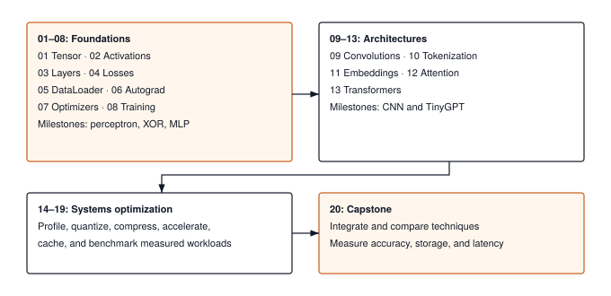

:::{.callout-note title="Prerequisites Check"}
This guide requires **Python programming** (classes, functions, NumPy basics) and **basic linear algebra** (matrix multiplication).
:::

## The Journey

TinyTorch follows a simple pattern: **build modules, unlock milestones, recreate ML history**.

::: {#fig-journey fig-env="figure" fig-pos="htb" fig-cap="**Your TinyTorch Journey**: Install once, then loop through start → complete → milestone for each of the 20 modules — every milestone runs on the code you just wrote." fig-alt="Five-stage horizontal pipeline: Install (install.sh) → Setup (tito setup) → Start (begin module) → Complete (export code) → Milestone (run YOUR code), with a feedback arrow from Milestone back to Start labeled 'next module'."}



:::

As you complete modules, you unlock milestones that recreate landmark moments in ML history---using YOUR code.

## Step 1: Install & Setup (2 Minutes)

:::{.panel-tabset}

## macOS / Linux

```bash
# Install TinyTorch (run from a project folder like ~/projects)
curl -sSL mlsysbook.ai/tinytorch/install.sh | bash

# Activate and verify
cd tinytorch
source .venv/bin/activate
tito setup
```

## Windows

TinyTorch works on Windows using **Git Bash** (included with Git for Windows).

**Step 1: Install Git for Windows** (if you don't have it)
- Download from [git-scm.com/download/win](https://git-scm.com/download/win)
- Run the installer with default options

**Step 2: Open Git Bash**

- Search "Git Bash" in the Start menu and open it

**Step 3: Install TinyTorch**
```bash
# In Git Bash (run from a project folder like ~/projects)
curl -sSL mlsysbook.ai/tinytorch/install.sh | bash

# Activate and verify
cd tinytorch
source .venv/Scripts/activate
tito setup
```

:::

**What this does:**

- Checks your system (Python 3.10+, git)
- Downloads TinyTorch to a `tinytorch/` folder
- Creates an isolated virtual environment
- Installs all dependencies
- Verifies installation

**Check your version:**
```bash
tito --version
```

**Update TinyTorch:**
```bash
tito system update
```

## Step 2: Your First Module (15 Minutes)

Let's build Module 01 (Tensor)---the foundation of all neural networks.

### Start the module

```bash
tito module start 01
```

This opens the module notebook and tracks your progress.

### Work in the notebook

Edit `modules/01_tensor/tensor.ipynb` in Jupyter:

```bash
jupyter lab modules/01_tensor/tensor.ipynb
```

You'll implement:
- N-dimensional array creation
- Mathematical operations (add, multiply, matmul)
- Shape manipulation (reshape, transpose)

### Complete the module

When your implementation is ready, export it to the TinyTorch package:

```bash
tito module complete 01
```

Your code is now importable:

```python
from tinytorch.core.tensor import Tensor  # YOUR implementation!
x = Tensor([1, 2, 3])
```

## Step 3: Your First Milestone

Now for the payoff! After completing the required modules (01-03), run a milestone:

```bash
tito milestone run perceptron
```

The milestone uses YOUR implementations to recreate Rosenblatt's 1958 Perceptron:

```text
Checking prerequisites for Milestone 01...
All required modules completed!

Testing YOUR implementations...
  * Tensor import successful
  * Activations import successful
  * Layers import successful
YOUR TinyTorch is ready!

+----------------------- Milestone 01 (1958) -----------------------+
|  Milestone 01: Perceptron (1958)                                  |
|  Frank Rosenblatt's First Neural Network                          |
|                                                                   |
|  Running: milestones/01_1958_perceptron/01_rosenblatt_forward.py  |
|  All code uses YOUR TinyTorch implementations!                    |
+-------------------------------------------------------------------+

Starting Milestone 01...

Assembling perceptron with YOUR TinyTorch modules...
   * Linear layer: 2 -> 1 (YOUR Module 03!)
   * Activation: Sigmoid (YOUR Module 02!)

+-------------------- Achievement Unlocked --------------------+
|  MILESTONE ACHIEVED!                                         |
|                                                              |
|  You completed Milestone 01: Perceptron (1958)               |
|  Frank Rosenblatt's First Neural Network                     |
|                                                              |
|  What makes this special:                                    |
|  - Every tensor operation: YOUR Tensor class                 |
|  - Every layer: YOUR Linear implementation                   |
|  - Every activation: YOUR Sigmoid function                   |
+--------------------------------------------------------------+
```

You're recreating ML history with your own code. *By Module 19, you'll benchmark against MLPerf---the industry standard for ML performance.*

## The Pattern Continues

As you complete more modules, you unlock more milestones:

@tbl-getting-started-milestone-unlocks shows which milestones unlock as you complete more modules.

| Modules Completed | Milestone | What You Recreate |
|-------------------|-----------|-------------------|
| 01-03 | Perceptron (1958) | First neural network (forward pass) |
| 01-03 | XOR Crisis (1969) | The limitation that triggered AI Winter |
| 01-08 | MLP Revival (1986) | Backprop solves XOR + TinyDigits recognition |
| 01-09 | CNN Revolution (1998) | Convolutions for spatial understanding |
| 01-08 + 11-13 | Transformers (2017) | Structured sequence tasks with attention |
| 01-08 + 14-19 | MLPerf (2018) | Production optimization pipeline |

: **Milestones unlocked as learners complete more modules.** {#tbl-getting-started-milestone-unlocks}

See all milestones and their requirements:

```bash
tito milestone list
```

## Quick Reference

Here are the commands you'll use throughout your journey:

```bash
# Module workflow
tito module start <N>       # Start working on module N
tito module complete <N>    # Export module to package
tito module status          # See your progress across all modules

# Milestones
tito milestone list         # See all milestones & requirements
tito milestone run <name>   # Run a milestone with your code

# Utilities
tito setup                  # First-time setup (safe to re-run)
tito system update                 # Update TinyTorch (your work is preserved)
tito --help                 # Full command reference
```

## Module Progression

TinyTorch has 20 modules organized in progressive tiers:

@tbl-getting-started-module-tiers groups the modules into tiers with scope and time estimates.

| Tier | Modules | Focus | Time Estimate |
|------|---------|-------|---------------|
| **Foundation** | 01-08 | Core ML infrastructure (tensors, dataloader, autograd, training) | ~18-24 hours |
| **Architecture** | 09-13 | Neural architectures (CNNs, transformers) | ~15-20 hours |
| **Optimization** | 14-19 | Production optimization (profiling, quantization) | ~18-24 hours |
| **Capstone** | 20 | TinyTorch Olympics Competition | ~8-10 hours |

: **TinyTorch module tiers with scope and time estimate.** {#tbl-getting-started-module-tiers}

**Total: ~60-80 hours** over 14-18 weeks (4-6 hours/week pace).

See the module descriptions in this guide for detailed prerequisites and learning objectives.

## Join the Community (Optional)

After setup, join the global TinyTorch community:

```bash
tito community login        # Join the community
```

The community features include progress tracking and connecting with other builders.

## For Instructors & TAs

:::{.callout-note title="Classroom & LMS Integration"}
TinyTorch is designed for both self-paced learners and university classrooms (e.g., Harvard CS249r). Instructors and teaching assistants can use the built-in `tito nbgrader` suite to stage assignments, customize implementation scaffolding, generate student releases, and autograde submissions.
:::

### The Tiered Assignment Staging System

Different course formats require different levels of scaffolding. TinyTorch supports three assignment staging tiers via `tito nbgrader generate [module] --tier <tier>`:

| Release Tier | CLI Flag | What Students Implement | Best For |
|:---|:---|:---|:---|
| **Student** *(Default)* | `--tier student` | **41 Core Archetypes** (195 repetitive helper blocks scaffolded) | Standard university courses, 14-week semesters, balanced homework loads |
| **Challenge** | `--tier challenge` | **All 236 Blocks** (full implementation from scratch) | Advanced graduate seminars, systems hackathons, honors tracks |
| **Instructor** | `--tier instructor` | **0 Blocks** (complete reference solutions retained) | Course staff solution keys, grading rubrics, and TA references |

: **TinyTorch assignment release tiers.** {#tbl-release-tiers}

### The "One-Archetype-Per-Concept" Pedagogical Model

In a 14-week course, students should spend their time grappling with fundamental systems mechanisms, not writing boilerplate:

- **What students implement**: Core mathematical and systems invariants—strided memory layout, tensor backward VJPs, numerical log-sum-exp stability, multi-head projection splitting, causal masking, KV cache token retrieval, and INT8 quantization scale/zero-point math.
- **What is scaffolded**: Secondary helper methods, repetitive shape getters, display formatting, and boilerplate glue. Once a student implements the first representative pattern, downstream boilerplate remains scaffolded with `role="scaffold"`.

### Hardware Extensions Track (`tinytorch.extensions`)

Many instructors ask how to transition students from pure-NumPy reference code to real hardware acceleration. TinyTorch includes standalone hardware accelerator bridges under `tinytorch.extensions`:

- **C++ SIMD Vectorization (`simd_ops.py` / `cpp_simd_gemm.cpp`)**: Clang/C++17 AVX2 and ARM NEON auto-compilation via `ctypes`.
- **OpenAI Triton GPU Kernels (`triton_gelu.py`)**: Block-level GPU programming with automatic SRAM tiling (falls back gracefully to NumPy if CUDA is not present).
- **Apple Silicon Metal (`mps_ops.py`)**: Zero-copy unified memory dispatch via Apple Metal Performance Shaders.

*Pedagogical Invariant*: Hardware extensions are strictly optional and completely isolated from the pure-NumPy core curriculum (Modules 01–20). They demonstrate real-world deployment without breaking CPU reproducibility.

### Instructor Command Workflow

```bash
# 1. Initialize grading infrastructure
tito nbgrader init

# 2. Stage student assignment with the 41 core archetypes
tito nbgrader generate 01_tensor --tier student

# 3. Create clean student release notebook (solutions stripped)
tito nbgrader release 01_tensor

# 4. Collect student submissions and autograde
tito nbgrader collect 01_tensor
tito nbgrader autograde 01_tensor

# 5. Review gradebook and export CSV for Canvas/Blackboard
tito nbgrader report
```

**Interested in early adoption?** [Join the discussion](https://github.com/harvard-edge/cs249r_book/discussions/1076) to share your syllabus and use case.

**Ready to start?** Run `tito module start 01` and begin building!
