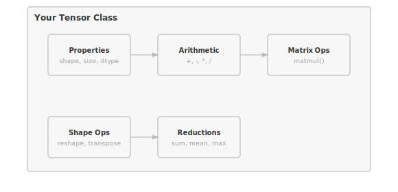
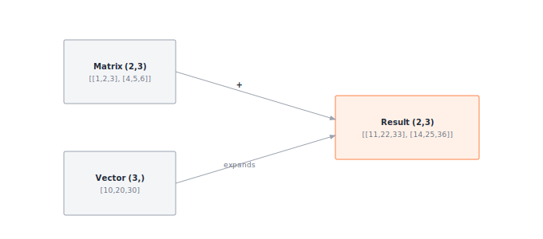
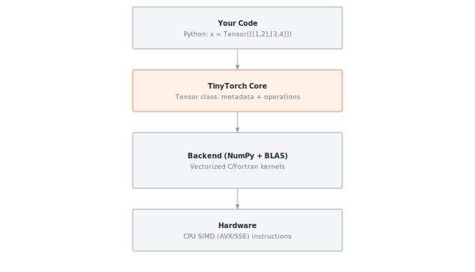

# Module 01: Tensor

:::{.callout-note title="Module Info"}

**FOUNDATION TIER** | Difficulty: ●○○○ | Time: 4-6 hours | Prerequisites: None

**Prerequisites: None** means exactly that. This module assumes:

- Basic Python (lists, classes, methods)
- Basic math (matrix multiplication from linear algebra)
- No machine learning background required

If you can multiply two matrices by hand and write a Python class, you're ready.
:::

```{=html}
<div class="action-cards">
<div class="action-card">
<h4>🎧 Audio Overview</h4>
<p>Listen to an AI-generated overview.</p>
<audio controls style="width: 100%; height: 54px;">
<source src="https://github.com/harvard-edge/cs249r_book/releases/download/tinytorch-audio-v0.1.1/01_tensor.mp3" type="audio/mpeg">
</audio>
</div>
<div class="action-card">
<h4>🚀 Launch Binder</h4>
<p>Run interactively in your browser.</p>
<a href="https://mybinder.org/v2/gh/harvard-edge/cs249r_book/main?labpath=tinytorch%2Fmodules%2F01_tensor%2Ftensor.ipynb" class="action-btn btn-orange">Open in Binder →</a>
</div>
<div class="action-card">
<h4>📄 View Source</h4>
<p>Browse the source code on GitHub.</p>
<a href="https://github.com/harvard-edge/cs249r_book/blob/main/tinytorch/src/01_tensor/01_tensor.py" class="action-btn btn-teal">View on GitHub →</a>
</div>
</div>

<style>
.slide-viewer-container {
  margin: 0.5rem 0 1.5rem 0;
  background: #0f172a;
  border-radius: 1rem;
  overflow: hidden;
  box-shadow: 0 4px 20px rgba(0,0,0,0.15);
}
.slide-header {
  display: flex;
  align-items: center;
  justify-content: space-between;
  padding: 0.6rem 1rem;
  background: rgba(255,255,255,0.03);
}
.slide-title {
  display: flex;
  align-items: center;
  gap: 0.5rem;
  color: #94a3b8;
  font-weight: 500;
  font-size: 0.85rem;
}
.slide-subtitle {
  color: #64748b;
  font-weight: 400;
  font-size: 0.75rem;
}
.slide-toolbar {
  display: flex;
  align-items: center;
  gap: 0.375rem;
}
.slide-toolbar button {
  background: transparent;
  border: none;
  color: #64748b;
  width: 32px;
  height: 32px;
  border-radius: 0.375rem;
  cursor: pointer;
  font-size: 1.1rem;
  transition: all 0.15s;
  display: flex;
  align-items: center;
  justify-content: center;
}
.slide-toolbar button:hover {
  background: rgba(249, 115, 22, 0.15);
  color: #f97316;
}
.slide-nav-group {
  display: flex;
  align-items: center;
}
.slide-page-info {
  color: #64748b;
  font-size: 0.75rem;
  padding: 0 0.5rem;
  font-weight: 500;
}
.slide-zoom-group {
  display: flex;
  align-items: center;
  margin-left: 0.25rem;
  padding-left: 0.5rem;
  border-left: 1px solid rgba(255,255,255,0.1);
}
.slide-canvas-wrapper {
  display: flex;
  justify-content: center;
  align-items: center;
  padding: 0.5rem 1rem 1rem 1rem;
  min-height: 380px;
  background: #0f172a;
}
.slide-canvas {
  max-width: 100%;
  max-height: 350px;
  height: auto;
  border-radius: 0.5rem;
  box-shadow: 0 4px 24px rgba(0,0,0,0.4);
}
.slide-progress-wrapper {
  padding: 0 1rem 0.5rem 1rem;
}
.slide-progress-bar {
  height: 3px;
  background: rgba(255,255,255,0.08);
  border-radius: 1.5px;
  overflow: hidden;
  cursor: pointer;
}
.slide-progress-fill {
  height: 100%;
  background: #f97316;
  border-radius: 1.5px;
  transition: width 0.2s ease;
}
.slide-loading {
  color: #f97316;
  font-size: 0.9rem;
  display: flex;
  align-items: center;
  gap: 0.5rem;
}
.slide-loading::before {
  content: '';
  width: 18px;
  height: 18px;
  border: 2px solid rgba(249, 115, 22, 0.2);
  border-top-color: #f97316;
  border-radius: 50%;
  animation: slide-spin 0.8s linear infinite;
}
@keyframes slide-spin {
  to { transform: rotate(360deg); }
}
.slide-footer {
  display: flex;
  justify-content: center;
  gap: 0.5rem;
  padding: 0.6rem 1rem;
  background: rgba(255,255,255,0.02);
  border-top: 1px solid rgba(255,255,255,0.05);
}
.slide-footer a {
  display: inline-flex;
  align-items: center;
  gap: 0.375rem;
  background: #f97316;
  color: white;
  padding: 0.4rem 0.9rem;
  border-radius: 2rem;
  text-decoration: none;
  font-weight: 500;
  font-size: 0.75rem;
  transition: all 0.15s;
}
.slide-footer a:hover {
  background: #ea580c;
  color: white;
}
.slide-footer a.secondary {
  background: transparent;
  color: #94a3b8;
  border: 1px solid rgba(255,255,255,0.15);
}
.slide-footer a.secondary:hover {
  background: rgba(255,255,255,0.05);
  color: #f8fafc;
}
@media (max-width: 600px) {
  .slide-header { flex-direction: column; gap: 0.5rem; padding: 0.5rem 0.75rem; }
  .slide-toolbar button { width: 28px; height: 28px; }
  .slide-canvas-wrapper { min-height: 260px; padding: 0.5rem; }
  .slide-canvas { max-height: 220px; }
}
</style>

<div class="slide-viewer-container" id="slide-viewer-01_tensor">
<div class="slide-header">
<div class="slide-title">
<span>🔥</span>
<span>Slide Deck</span>

<span class="slide-subtitle">· AI-generated</span>
</div>
<div class="slide-toolbar">
<div class="slide-nav-group">
<button onclick="slideNav('01_tensor', -1)" title="Previous">‹</button>
<span class="slide-page-info"><span id="slide-num-01_tensor">1</span> / <span id="slide-count-01_tensor">-</span></span>
<button onclick="slideNav('01_tensor', 1)" title="Next">›</button>
</div>
<div class="slide-zoom-group">
<button onclick="slideZoom('01_tensor', -0.25)" title="Zoom out">−</button>
<button onclick="slideZoom('01_tensor', 0.25)" title="Zoom in">+</button>
</div>
</div>
</div>
<div class="slide-canvas-wrapper">
<div id="slide-loading-01_tensor" class="slide-loading">Loading slides...</div>
<canvas id="slide-canvas-01_tensor" class="slide-canvas" style="display:none;"></canvas>
</div>
<div class="slide-progress-wrapper">
<div class="slide-progress-bar" onclick="slideProgress('01_tensor', event)">
<div class="slide-progress-fill" id="slide-progress-01_tensor" style="width: 0%;"></div>
</div>
</div>
<div class="slide-footer">
<a href="../assets/slides/01_tensor.pdf" download>⬇ Download</a>
<a href="#" onclick="slideFullscreen('01_tensor'); return false;" class="secondary">⛶ Fullscreen</a>
</div>
</div>

<script src="https://cdnjs.cloudflare.com/ajax/libs/pdf.js/3.11.174/pdf.min.js"></script>
<script>
(function() {
  if (window.slideViewersInitialized) return;
  window.slideViewersInitialized = true;

  pdfjsLib.GlobalWorkerOptions.workerSrc = 'https://cdnjs.cloudflare.com/ajax/libs/pdf.js/3.11.174/pdf.worker.min.js';

  window.slideViewers = {};

  window.initSlideViewer = function(id, pdfUrl) {
    const viewer = { pdf: null, page: 1, scale: 1.3, rendering: false, pending: null };
    window.slideViewers[id] = viewer;

    const canvas = document.getElementById('slide-canvas-' + id);
    const ctx = canvas.getContext('2d');

    function render(num) {
      viewer.rendering = true;
      viewer.pdf.getPage(num).then(function(page) {
        const viewport = page.getViewport({scale: viewer.scale});
        canvas.height = viewport.height;
        canvas.width = viewport.width;
        page.render({canvasContext: ctx, viewport: viewport}).promise.then(function() {
          viewer.rendering = false;
          if (viewer.pending !== null) { render(viewer.pending); viewer.pending = null; }
        });
      });
      document.getElementById('slide-num-' + id).textContent = num;
      document.getElementById('slide-progress-' + id).style.width = (num / viewer.pdf.numPages * 100) + '%';
    }

    function queue(num) { if (viewer.rendering) viewer.pending = num; else render(num); }

    pdfjsLib.getDocument(pdfUrl).promise.then(function(pdf) {
      viewer.pdf = pdf;
      document.getElementById('slide-count-' + id).textContent = pdf.numPages;
      document.getElementById('slide-loading-' + id).style.display = 'none';
      canvas.style.display = 'block';
      render(1);
    }).catch(function() {
      document.getElementById('slide-loading-' + id).innerHTML = 'Unable to load. <a href="' + pdfUrl + '" style="color:#f97316;">Download PDF</a>';
    });

    viewer.queue = queue;
  };

  window.slideNav = function(id, dir) {
    const v = window.slideViewers[id];
    if (!v || !v.pdf) return;
    const newPage = v.page + dir;
    if (newPage >= 1 && newPage <= v.pdf.numPages) { v.page = newPage; v.queue(newPage); }
  };

  window.slideZoom = function(id, delta) {
    const v = window.slideViewers[id];
    if (!v) return;
    v.scale = Math.max(0.5, Math.min(3, v.scale + delta));
    v.queue(v.page);
  };

  window.slideProgress = function(id, event) {
    const v = window.slideViewers[id];
    if (!v || !v.pdf) return;
    const bar = event.currentTarget;
    const pct = (event.clientX - bar.getBoundingClientRect().left) / bar.offsetWidth;
    const newPage = Math.max(1, Math.min(v.pdf.numPages, Math.ceil(pct * v.pdf.numPages)));
    if (newPage !== v.page) { v.page = newPage; v.queue(newPage); }
  };

  window.slideFullscreen = function(id) {
    const el = document.getElementById('slide-viewer-' + id);
    if (el.requestFullscreen) el.requestFullscreen();
    else if (el.webkitRequestFullscreen) el.webkitRequestFullscreen();
  };
})();

initSlideViewer('01_tensor', '../assets/slides/01_tensor.pdf');

</script>

```
## Overview

Every neural network you have ever used — image classifiers, language models, self-driving perception stacks — is, at runtime, a sequence of operations on one data structure: the tensor. Get the tensor right and the rest of the framework practically writes itself. Get it wrong and every layer above leaks confusion.

In this module you build that data structure from scratch. By the end, your `Tensor` supports arithmetic, broadcasting, matrix multiplication, and shape manipulation — the same surface area you would call on `torch.Tensor`, backed by NumPy instead of CUDA.

## Learning Objectives

:::{.callout-tip title="By completing this module, you will:"}

- **Implement** a complete Tensor class with arithmetic, matrix multiplication, shape manipulation, and reductions
- **Master** broadcasting semantics that enable efficient computation without data copying
- **Understand** computational complexity (O(n³) for matmul) and memory trade-offs (views vs copies)
- **Connect** your implementation to production PyTorch patterns and design decisions
:::

## What You'll Build

::: {#fig-01_tensor-diag-1 fig-env="figure" fig-pos="htb" fig-cap="**Tensor Class Architecture**: One class packages data, shape metadata, and every operation the rest of TinyTorch will lean on." fig-alt="Flowchart showing properties, arithmetic, matrix ops, shape ops, and reductions as components of the Tensor class."}



:::

**Implementation roadmap:**

| Part | What You'll Implement | Key Concept |
|------|----------------------|-------------|
| 1 | `__init__`, `shape`, `size`, `dtype` | Tensor as NumPy wrapper |
| 2 | `__add__`, `__sub__`, `__mul__`, `__truediv__` | Operator overloading + broadcasting |
| 3 | `matmul()` | Matrix multiplication with shape validation |
| 4 | `reshape()`, `transpose()` | Shape manipulation, views vs copies |
| 5 | `sum()`, `mean()`, `max()` | Reductions along axes |

: **Five-part implementation roadmap for the Tensor class.** {#tbl-01-tensor-implementation-roadmap}

**The pattern you'll enable:**
```python
# Computing predictions from data
output = x.matmul(W) + b  # Matrix multiplication + bias (used in every neural network)
```

### What You're NOT Building

To keep this module focused, you will **not** implement:

- GPU support (NumPy runs on CPU only)
- Automatic differentiation
- Hundreds of tensor operations (PyTorch has 2000+, you'll build ~15 core ones)
- Memory optimization tricks (PyTorch uses lazy evaluation, memory pools, etc.)

**You are building the conceptual foundation.**

## API Reference

This section provides a quick reference for the Tensor class you'll build. Think of it as your cheat sheet while implementing and debugging. Each method is documented with its signature and expected behavior.

### Constructor

```python
Tensor(data)
```
- `data`: list, numpy array, or scalar

### Properties

Your Tensor wraps a NumPy array and exposes several properties that describe its structure. These properties are read-only and computed from the underlying data.

| Property | Type | Description |
|----------|------|-------------|
| `data` | `np.ndarray` | Underlying NumPy array |
| `shape` | `tuple` | Dimensions, e.g., `(2, 3)` |
| `size` | `int` | Total number of elements |
| `dtype` | `np.dtype` | Data type (float32) |

: **Read-only properties exposed by the Tensor class.** {#tbl-01-tensor-properties}

### Arithmetic Operations

Python lets you override operators like `+` and `*` by implementing special methods. When you write `x + y`, Python calls `x.__add__(y)`. Your implementations should handle both Tensor-Tensor operations and Tensor-scalar operations, letting NumPy's broadcasting do the heavy lifting.

| Operation | Method | Example |
|-----------|--------|---------|
| Addition | `__add__` | `x + y` or `x + 2` |
| Subtraction | `__sub__` | `x - y` |
| Multiplication | `__mul__` | `x * y` |
| Division | `__truediv__` | `x / y` |

: **Arithmetic dunder methods and their Python operator equivalents.** {#tbl-01-tensor-arithmetic-dunders}

### Matrix & Shape Operations

These methods transform tensors without changing their data (for views) or perform mathematical operations that produce new data (for matmul).

| Method | Signature | Description |
|--------|-----------|-------------|
| `matmul` | `matmul(other) -> Tensor` | Matrix multiplication |
| `reshape` | `reshape(*shape) -> Tensor` | Change shape (-1 to infer) |
| `transpose` | `transpose(dim0=None, dim1=None) -> Tensor` | Swap dimensions (defaults to last two) |

: **Matrix and shape manipulation methods on Tensor.** {#tbl-01-tensor-matrix-shape-ops}

### Reductions

Reduction operations collapse one or more dimensions by aggregating values. The `axis` parameter controls which dimension gets collapsed. If `axis=None`, all dimensions collapse to a single scalar.

| Method | Signature | Description |
|--------|-----------|-------------|
| `sum` | `sum(axis=None, keepdims=False) -> Tensor` | Sum elements |
| `mean` | `mean(axis=None, keepdims=False) -> Tensor` | Average elements |
| `max` | `max(axis=None, keepdims=False) -> Tensor` | Maximum element |

: **Reduction methods that collapse tensor dimensions.** {#tbl-01-tensor-reductions}

## Core Concepts

Five ideas drive every line of code in this module: dimensionality, broadcasting, views vs. copies, matrix multiplication, and reduction along an axis. They are not TinyTorch-specific. Internalize them here and you will recognize them in PyTorch, JAX, NumPy, and every framework you touch afterwards.

### Tensor Dimensionality

Tensors generalize the shapes you already know. A scalar is a single number — a temperature reading of 72.5 degrees. Stack scalars into a list and you get a vector — a day's worth of readings. Stack vectors and you get a matrix — a spreadsheet of readings across many days. Keep stacking and you reach 3D and 4D tensors that hold video frames, batches of images, or sequences of token embeddings.

One class handles all of these cases. The same code path that adds two scalars adds two 4D tensors, because broadcasting (next section) makes shape compatibility a runtime concern, not a compile-time one.

| Rank | Name | Shape | Concrete Example |
|------|------|-------|------------------|
| 0D | Scalar | `()` | Temperature reading: `72.5` |
| 1D | Vector | `(768,)` | Audio sample: 768 measurements |
| 2D | Matrix | `(128, 768)` | Spreadsheet: 128 rows × 768 columns |
| 3D | 3D Tensor | `(32, 224, 224)` | Video frames: 32 grayscale images |
| 4D | 4D Tensor | `(32, 3, 224, 224)` | Video frames: 32 color (RGB) images |

: **Tensor ranks from scalar to 4D with concrete examples.** {#tbl-01-tensor-rank-examples}

### Broadcasting

When you add a vector to a matrix, the shapes don't match. Should this fail? In most programming contexts, yes. But many computations need to apply the same operation across rows or columns. For example, if you want to adjust all values in a spreadsheet by adding a different offset to each column, you need to add a vector to a matrix. NumPy and PyTorch implement broadcasting to handle this: automatically expanding smaller tensors to match larger ones without actually copying data.

Consider adding a bias vector `[10, 20, 30]` to every row of a matrix. Without broadcasting, you'd need to manually tile the vector into a matrix first, wasting memory. With broadcasting, the operation just works, and the framework handles alignment internally.

Here is what `__add__` looks like once broadcasting does the work for you:

```python
def __add__(self, other):
    """Add two tensors element-wise with broadcasting support."""
    if isinstance(other, Tensor):
        return Tensor(self.data + other.data)  # NumPy handles broadcasting
    else:
        return Tensor(self.data + other)       # Scalar broadcast
```

There is no shape logic in this method. NumPy aligns the operand shapes from right to left, expands dimensions where one side is 1, and refuses the operation otherwise. You inherit that contract for free.


::: {#fig-01_tensor-diag-2 fig-env="figure" fig-pos="htb" fig-cap="**Broadcasting Mechanics**: How a vector is expanded to match a matrix's shape during arithmetic operations." fig-alt="Diagram showing a (2,3) matrix and a (3,) vector expanding to produce a (2,3) result."}



:::


The rules are simpler than they look. Compare shapes from right to left. At each position, dimensions are compatible if they're equal or if one of them is 1. Missing dimensions on the left are treated as 1. If any position fails this check, broadcasting fails.

| Shape A | Shape B | Result | Valid? |
|---------|---------|--------|--------|
| `(3, 4)` | `(4,)` | `(3, 4)` | ✓ |
| `(3, 4)` | `(3, 1)` | `(3, 4)` | ✓ |
| `(3, 4)` | `(3,)` | Error | ✗ (3 ≠ 4) |
| `(2, 3, 4)` | `(3, 4)` | `(2, 3, 4)` | ✓ |

: **Broadcasting compatibility for representative shape pairs.** {#tbl-01-tensor-broadcasting-rules}

The memory savings are not academic. Adding a `(768,)` vector to a `(32, 512, 768)` tensor would, without broadcasting, require tiling the vector 32×512 times — **48 MB** of redundant data, about **12.6 million** float32 numbers. With broadcasting, you store the original **3 KB** vector and read it through expanded indices.

### Views vs. Copies

When you reshape a tensor, does it allocate new memory or just create a different view of the same data? The answer has huge implications for both performance and correctness.

A view shares memory with its source. Reshaping a 1 GB tensor is instant because you're just changing the metadata that describes how to interpret the bytes, not copying the bytes themselves. But this creates an important gotcha: modifying a view modifies the original.

```python
x = Tensor([1, 2, 3, 4])
y = x.reshape(2, 2)  # y is a VIEW of x
y.data[0, 0] = 99    # This also changes x!
```

Arithmetic operations like addition always create copies because they compute new values. This is safer but uses more memory. Production code carefully manages views to avoid both memory blowup (too many copies) and silent bugs (unexpected mutations through views).

| Operation | Type | Memory | Time |
|-----------|------|--------|------|
| `reshape()` | View* | Shared | O(1) |
| `transpose()` | View* | Shared | O(1) |
| `+ - * /` | Copy | New allocation | O(n) |

: **Memory and time cost of view operations versus copying ops.** {#tbl-01-tensor-view-vs-copy}

*When data is contiguous in memory

### Matrix Multiplication

Matrix multiplication is the computational workhorse of neural networks. Every linear layer, every attention head, every embedding lookup involves matmul. Understanding its mechanics and cost is essential.

The operation is simple in concept: for each output element, compute a dot product of a row from the first matrix with a column from the second. But this simplicity hides cubic complexity. Multiplying two n×n matrices requires n³ multiplications and n³ additions.

Here's how the educational implementation in your module works:

```python
def matmul(self, other):
    """Matrix multiplication of two tensors."""
    if not isinstance(other, Tensor):
        raise TypeError(f"Expected Tensor for matrix multiplication, got {type(other)}")

    # Shape validation: inner dimensions must match
    if len(self.shape) >= 2 and len(other.shape) >= 2:
        if self.shape[-1] != other.shape[-2]:
            raise ValueError(
                f"Cannot perform matrix multiplication: {self.shape} @ {other.shape}. "
                f"Inner dimensions must match: {self.shape[-1]} ≠ {other.shape[-2]}"
            )

    a = self.data
    b = other.data

    # Handle 2D matrices with explicit loops (educational)
    if len(a.shape) == 2 and len(b.shape) == 2:
        M, K = a.shape
        K2, N = b.shape
        result_data = np.zeros((M, N), dtype=a.dtype)

        # Each output element is a dot product
        for i in range(M):
            for j in range(N):
                result_data[i, j] = np.dot(a[i, :], b[:, j])
    else:
        # For batched operations, use np.matmul
        result_data = np.matmul(a, b)

    return Tensor(result_data)
```

The explicit loops in the 2D case are intentionally slower than `np.matmul` because they reveal exactly what matrix multiplication does: each output element requires K operations, and there are M×N outputs, giving O(M×K×N) total operations. For square matrices, this is O(n³).

:::{.callout-note title="Systems Implication: Cache Tiling"}
While element-wise operations like addition are **Memory-Bound** (hardware sits idle waiting for data from RAM), Matrix Multiplication is heavily **Compute-Bound** (O(n³) math for O(n²) bytes). A naive nested `for` loop constantly evicts data from the ultra-fast L1 cache back to slow main memory. Optimized libraries like `np.matmul` (which calls BLAS) use *Cache Tiling*—breaking matrices into tiny blocks that fit perfectly into the L1 cache, keeping the ALUs fed without waiting for RAM.
:::

### Shape Manipulation

Shape manipulation operations change how data is interpreted without changing the values themselves. Understanding when data is copied versus viewed is crucial for both correctness and performance.

The `reshape` method reinterprets the same data with different dimensions:

```python
def reshape(self, *shape):
    """Reshape tensor to new dimensions."""
    if len(shape) == 1 and isinstance(shape[0], (tuple, list)):
        new_shape = tuple(shape[0])
    else:
        new_shape = shape

    # Handle -1 for automatic dimension inference
    if -1 in new_shape:
        known_size = 1
        unknown_idx = new_shape.index(-1)
        for i, dim in enumerate(new_shape):
            if i != unknown_idx:
                known_size *= dim
        unknown_dim = self.size // known_size
        new_shape = list(new_shape)
        new_shape[unknown_idx] = unknown_dim
        new_shape = tuple(new_shape)

    # Validate total elements match
    if np.prod(new_shape) != self.size:
        target_size = int(np.prod(new_shape))
        raise ValueError(
            f"Cannot reshape {self.shape} to {new_shape}\n"
            f"  ❌ Element count mismatch: {self.size} elements vs {target_size} elements\n"
            f"  💡 Reshape preserves data, so total elements must stay the same\n"
            f"  🔧 Use -1 to infer a dimension: reshape(-1, {new_shape[-1] if len(new_shape) > 0 else 1}) lets NumPy calculate"
        )

    reshaped_data = np.reshape(self.data, new_shape)
    return Tensor(reshaped_data, requires_grad=self.requires_grad)
```

The `-1` syntax is particularly useful: it tells NumPy to infer one dimension automatically. When flattening a batch of images, `x.reshape(batch_size, -1)` lets NumPy calculate the feature dimension.

While these mathematical abstractions are powerful, they mask the physical reality of how data is stored and accessed. Understanding the gap between mathematical shape and physical memory layout is what separates a machine learning practitioner from a systems engineer.

:::{.callout-note title="Systems Implication: Contiguous Memory & Strides"}
To the math, `reshape` or `transpose` just change dimensions. To the hardware, they manipulate *strides*. A tensor's data is stored as a flat, 1D contiguous block of bytes in RAM. A `reshape` is an O(1) metadata update—the underlying memory is completely untouched.

However, `transpose` introduces a systems trap. By swapping dimensions, you swap strides. The memory is no longer sequentially aligned with the new shape. If you iterate over a transposed tensor, the processor jumps back and forth across RAM, destroying spatial locality and causing massive **cache misses**. This is why systems engineers call `.contiguous()` after a transpose—trading a one-time O(n) memory copy to restore sequential alignment and keep the cache fed.
:::

### Computational Complexity

As we saw with the explicit loops in our matrix multiplication implementation, not all tensor operations are equal. Element-wise operations like addition visit each element exactly once, resulting in O(n) time complexity where n is the total number of elements. Reductions like `sum` also visit each element once. But matrix multiplication is fundamentally different.

Multiplying two n×n matrices requires n³ operations: for each of the n² output elements, you compute a dot product of n values. This cubic scaling is why a 2000×2000 matmul takes 8x longer than a 1000×1000 matmul, not 4x. In neural networks, matrix multiplications consume over 90% of compute time. This computational density is precisely why GPUs exist for ML: a modern GPU has thousands of cores that can compute thousands of dot products simultaneously, turning an 800ms CPU operation into an 8ms GPU operation.

| Operation | Complexity | Notes |
|-----------|------------|-------|
| Element-wise (`+`, `-`, `*`) | O(n) | Linear in tensor size |
| Reductions (`sum`, `mean`) | O(n) | Must visit every element |
| Matrix multiply (`matmul`) | O(n³) | Dominates training time |

: **Computational complexity of core tensor operations.** {#tbl-01-tensor-operation-complexity}

### Axis Semantics

The `axis` parameter in reductions specifies which dimension to collapse. Think of it as "sum along this axis" or "average out this dimension." The result has one fewer dimension than the input.

For a 2D tensor with shape `(rows, columns)`, summing along axis 0 collapses the rows, giving you column totals. Summing along axis 1 collapses the columns, giving you row totals. Summing with `axis=None` collapses everything to a single scalar.

Your reduction implementations simply pass the axis to NumPy:

```python
def sum(self, axis=None, keepdims=False):
    """Sum tensor along specified axis."""
    result = np.sum(self.data, axis=axis, keepdims=keepdims)
    return Tensor(result)
```

The `keepdims=True` option preserves the reduced dimension as size 1, which is useful for broadcasting the result back.

```
For shape (rows, columns) = (32, 768):

sum(axis=0) → collapse rows    → shape (768,)  - column totals
sum(axis=1) → collapse columns → shape (32,)   - row totals
sum(axis=None) → collapse all  → scalar

Visual:
[[1, 2, 3],      sum(axis=0)     sum(axis=1)
 [4, 5, 6]]  →   [5, 7, 9]   or  [6, 15]
                 (down cols)     (across rows)
```

## Architecture

Your Tensor sits at the top of a stack that reaches down to hardware. When you call `x + y`, Python calls your `__add__` method, which delegates to NumPy, which calls optimized BLAS libraries written in C and Fortran, which use CPU SIMD instructions that process multiple numbers in a single clock cycle.

::: {#fig-01_tensor-diag-3 fig-env="figure" fig-pos="htb" fig-cap="**The Tensor Stack**: From the Python interface down to the hardware CPU instructions." fig-alt="Block diagram showing the layers: Your Code, TinyTorch, Backend (NumPy/BLAS), and Hardware (CPU SIMD)."}



:::

This is the same architecture used by PyTorch and TensorFlow, just with different backends. PyTorch replaces NumPy with a C++ engine and BLAS with CUDA kernels running on GPUs. But the Python interface and the abstractions are identical. When you understand TinyTorch's Tensor, you understand PyTorch's Tensor.

### Module Integration

Your `Tensor` is the only data structure the rest of TinyTorch carries around. Every subsequent module either operates on tensors, returns tensors, or stores tensors as state.

```
Module 01: Tensor          ← you are here
    ├─→ Module 02: Activations    (element-wise functions on tensors)
    ├─→ Module 03: Layers         (parameters stored as tensors)
    ├─→ Module 06: Autograd       (gradients tracked alongside tensors)
    └─→ Module 08: Training       (every step reads and writes tensors)
```

Bugs you ship from this module surface as confusing failures three modules later. The investment in clean shape handling, consistent dtypes, and correct broadcasting pays off through the entire stack.

## Common Errors & Debugging

Five errors account for almost every confused half-hour you will spend in this module. Read them now so you recognize them when they appear, instead of debugging them blind.

### Shape Mismatch in matmul

**Error**: `ValueError: shapes (2,3) and (2,2) not aligned`

Matrix multiplication requires the inner dimensions to match. If you're multiplying `(M, K)` by `(K, N)`, both K values must be equal. The error above happens when trying to multiply a (2,3) matrix by a (2,2) matrix: 3 ≠ 2.

**Fix**: Check your shapes. The rule is `a.shape[-1]` must equal `b.shape[-2]`.

### Broadcasting Failures

**Error**: `ValueError: operands could not be broadcast together`

Broadcasting fails when shapes can't be aligned according to the rules. Remember: compare right to left, and dimensions must be equal or one must be 1.

**Examples**:
- `(2,3) + (3,)` ✓ works - 3 matches 3, and the missing dimension becomes 1
- `(2,3) + (2,)` ✗ fails - comparing right to left: 3 ≠ 2

**Fix**: Reshape to make dimensions compatible: `vector.reshape(-1, 1)` or `vector.reshape(1, -1)`

### Reshape Size Mismatch

**Error**: `ValueError: cannot reshape array of size X into shape Y`

Reshape only rearranges elements; it can't create or destroy them. If you have 12 elements, you can reshape to (3, 4) or (2, 6) or (2, 2, 3), but not to (5, 5).

**Fix**: Ensure `np.prod(old_shape) == np.prod(new_shape)`

### Missing Attributes

**Error**: `AttributeError: 'Tensor' has no attribute 'shape'`

Your `__init__` method needs to set all required attributes. If you forget to set `self.shape`, any code that accesses `tensor.shape` will fail.

**Fix**: Add `self.shape = self.data.shape` in your constructor

### Type Errors in Arithmetic

**Error**: `TypeError: unsupported operand type(s) for +: 'Tensor' and 'int'`

Your arithmetic methods need to handle both Tensor and scalar operands. When someone writes `x + 2`, your `__add__` receives the integer 2, not a Tensor.

**Fix**: Check for scalars: `if isinstance(other, (int, float)): ...`

## Production Context

### Your Implementation vs. PyTorch

Your `Tensor` and PyTorch's `torch.Tensor` share the same conceptual design. The differences are in the engine room: PyTorch swaps NumPy for a C++ runtime, runs on CUDA, Metal, or ROCm, and exposes thousands of specialized kernels. The Python-facing API, the broadcasting rules, and the shape semantics are the same.

| Feature | Your Implementation | PyTorch |
|---------|---------------------|---------|
| **Backend** | NumPy (Python) | C++/CUDA |
| **Speed** | 1x (baseline) | 10-100x faster |
| **GPU** | ✗ CPU only | ✓ CUDA, Metal, ROCm |
| **Operations** | ~15 core ops | 2000+ operations |

: **Feature comparison between TinyTorch Tensor and PyTorch Tensor.** {#tbl-01-tensor-vs-pytorch}

### Code Comparison

The following comparison shows equivalent operations in TinyTorch and PyTorch. Notice how closely the APIs mirror each other. This is intentional: by learning TinyTorch's patterns, you're simultaneously learning PyTorch's patterns.

::: {.panel-tabset}
## Your TinyTorch
```python
from tinytorch.core.tensor import Tensor

x = Tensor([[1, 2], [3, 4]])
y = x + 2
z = x.matmul(w)
loss = z.mean()
```

## PyTorch
```python
import torch

x = torch.tensor([[1, 2], [3, 4]], dtype=torch.float32)
y = x + 2
z = x @ w
loss = z.mean()
```
:::

Let's walk through each line to understand the comparison:

- **Line 1 (Import)**: Both frameworks use a simple import. TinyTorch exposes `Tensor` from `core.tensor`; PyTorch uses `torch.tensor()` as a factory function.
- **Line 3 (Creation)**: TinyTorch infers dtype from input; PyTorch requires explicit `dtype=torch.float32` for floating-point operations. This explicitness matters for performance tuning in production.
- **Line 4 (Broadcasting)**: Both handle `x + 2` identically, broadcasting the scalar across all elements. Same semantics, same result.
- **Line 5 (Matrix multiply)**: TinyTorch uses `.matmul()` method; PyTorch supports both `.matmul()` and the `@` operator. The operation is identical.
- **Line 6 (Reduction)**: Both use `.mean()` to reduce the tensor to a scalar. Reductions like this are fundamental to computing loss values.

:::{.callout-tip title="What's Identical"}

Broadcasting rules, shape semantics, and API design patterns. When you debug PyTorch shape errors, you'll understand exactly what's happening because you built the same abstractions.
:::

### Why Tensors Matter at Scale

The class you are building looks small. The systems built on it do not. Three numbers set the scale:

- **Large language models** — A 175B-parameter model stored in fp16 is **326 GB** of tensor data. That is one model, one copy, before optimizer state.
- **Image batches** — A batch of 128 RGB images at 224×224 in float32 is **73.5 MB**. A training run streams thousands of these per minute.
- **Self-driving perception** — Multi-camera pipelines run tensor ops at **36 FPS**, so each frame's millions of operations have to finish in 28 ms.

A single matrix multiply can absorb 90% of training time. Every micro-optimization in a real framework — contiguous strides, fused kernels, view-vs-copy decisions — exists because the `Tensor` you are about to write multiplies its mistakes by billions.

## Check Your Understanding

:::{.callout-tip title="Check Your Understanding — Tensor"}
Before moving on, verify you can articulate each of the following:

- [ ] Why `reshape` is O(1) metadata update while `transpose` breaks contiguity and triggers cache misses on later iteration.
- [ ] How right-to-left broadcasting lets `(32, 1, 768) + (512, 768)` produce `(32, 512, 768)` without materializing a tiled copy.
- [ ] Why matmul is O(n^3) — and why doubling matrix size multiplies runtime by 8x, not 4x.
- [ ] The memory distinction between views (share bytes with source) and copies (fresh allocation), and why silent mutation through a view is a systems bug.
- [ ] How a scalar logit of 32 × 3 × 224 × 224 image batch lands at ~18.4 MB in float32, and why batch size is the first knob to turn when OOM hits.

If any of these feels fuzzy, revisit Core Concepts (Broadcasting, Views vs. Copies, Matrix Multiplication, Computational Complexity) before moving on.
:::

The collapsible Q&A below works through each of these in depth — skim the ones that still feel fuzzy.

**Q1: Memory Calculation**

A batch of 32 RGB images (224×224 pixels) stored as float32. How much memory?

:::{.callout-tip collapse="true" title="Answer"}

32 × 3 × 224 × 224 × 4 = **19,267,584 bytes ≈ 18.4 MB**

Double the batch, double the memory — which is why batch size is the first knob people turn when training runs out of GPU memory.
:::

**Q2: Broadcasting Savings**

Adding a vector `(768,)` to a 3D tensor `(32, 512, 768)`. How much memory does broadcasting save?

:::{.callout-tip collapse="true" title="Answer"}

Without broadcasting: 32 × 512 × 768 × 4 = **48.0 MB**

With broadcasting: 768 × 4 = **3 KB**

Savings: **~48 MB per operation**. A transformer layer performs hundreds of broadcasts per forward pass; the cost of getting this wrong scales with the model.
:::

**Q3: Matmul Scaling**

If a 1000×1000 matmul takes 100ms, how long will 2000×2000 take?

:::{.callout-tip collapse="true" title="Answer"}

Matmul is O(n³). Doubling n → 2³ = **8x longer** → ~800ms

This is why matrix size matters so much for transformer scaling!
:::

**Q4: Shape Prediction**

What's the output shape of `(32, 1, 768) + (512, 768)`?

:::{.callout-tip collapse="true" title="Answer"}

Broadcasting aligns right-to-left:
- `(32,   1, 768)`
- `(    512, 768)`

Result: **(32, 512, 768)**

The 1 broadcasts to 512, and 32 is prepended.
:::

**Q5: Views vs Copies**

You reshape a 1GB tensor, then modify one element in the reshaped version. What happens to the original tensor? What if you had used `x + 0` instead of reshape?

:::{.callout-tip collapse="true" title="Answer"}

**Reshape (view)**: The original tensor IS modified. Reshape creates a view that shares memory with the original. Changing `y.data[0,0] = 99` also changes `x.data[0]`.

**Addition (copy)**: The original tensor is NOT modified. `x + 0` creates a new tensor with freshly allocated memory. The values are identical but stored in different locations.

This distinction matters enormously for:

- **Memory** — Views use 0 extra bytes; copies use n extra bytes.
- **Performance** — Views are O(1); copies are O(n).
- **Correctness** — Unexpected mutations through views are a common source of bugs.
:::

## Key Takeaways

- **Tensor as universal carrier:** one class holds every value the rest of the framework touches — scalars, vectors, 4-D image batches — because broadcasting makes shape compatibility a runtime concern, not a compile-time one.
- **Broadcasting replaces tiling:** right-to-left alignment lets a `(768,)` bias merge with a `(32, 512, 768)` activation tensor for the cost of the vector, not the expanded 48 MB copy.
- **Views vs. copies is a systems decision:** `reshape` and `transpose` are O(1) metadata edits that share memory; arithmetic ops allocate new buffers. Mixing them up causes either memory blowup or silent mutation.
- **Matmul is the cubic tax:** O(n^3) compute on O(n^2) bytes makes matmul compute-bound and cache-sensitive, which is why every real framework routes it through tiled BLAS kernels.
- **Contiguity is physical, shape is logical:** `transpose` rearranges strides without moving bytes, so iteration order breaks cache locality — hence the `.contiguous()` call after transpose in production code.

**Coming next:** Module 02 adds nonlinearity — ReLU, Sigmoid, Tanh, GELU, Softmax — as element-wise functions that consume and return the `Tensor` you just built.

## Further Reading

The abstractions we rely on today—broadcasting, memory views, and hardware-accelerated matrix multiplication—were not developed overnight. They are the culmination of decades of research bridging mathematics and computer architecture. For students who want to trace the evolution of these ideas from early linear algebra libraries to modern tensor frameworks, the following literature is essential.

### Seminal Papers

- **NumPy: Array Programming** - Harris et al. (2020). The definitive reference for NumPy, which underlies your Tensor implementation. Explains broadcasting, views, and the design philosophy. **Systems Implication:** Standardized memory layouts (strides) and contiguous blocks allowed C-level operations to bypass the slow Python interpreter, maximizing memory bandwidth. [Nature](https://doi.org/10.1038/s41586-020-2649-2)

- **BLAS (Basic Linear Algebra Subprograms)** - Lawson et al. (1979). The foundation of all high-performance matrix operations. Your `np.matmul` ultimately calls BLAS routines optimized over 40+ years. Understanding BLAS levels (1, 2, 3) explains why matmul is special. **Systems Implication:** Defined the memory hierarchy abstractions (registers, L1/L2 cache, RAM) allowing matrix multiplication to be tiled for optimal cache reuse, fundamentally defining modern dense compute limits. [ACM TOMS](https://doi.org/10.1145/355841.355847)

- **Automatic Differentiation in ML** - Baydin et al. (2018). Survey of automatic differentiation techniques. **Systems Implication:** Reverse-mode AD required materializing the intermediate forward pass tensors in memory, making memory capacity a primary bottleneck for deep learning before checkpointing techniques were developed. [JMLR](https://www.jmlr.org/papers/v18/17-468.html)

### Additional Resources

- **Textbook**: ["Deep Learning"](https://www.deeplearningbook.org/) by Goodfellow, Bengio, and Courville - Chapter 2 covers linear algebra foundations including tensor operations
- **Documentation**: [PyTorch Tensor Tutorial](https://pytorch.org/tutorials/beginner/basics/tensorqs_tutorial.html) - See how production frameworks implement similar concepts

## What's Next?

You now have the universal carrier of every value the rest of the framework will ever compute. A `Tensor` holds the data, knows its shape, and supports the arithmetic that linear algebra and eventually backpropagation depend on.

The next module is **Module 02 — Activations**. It answers a single question: *given a tensor of pre-activations, how do you apply a non-linearity element-wise — and why is that the one operation that lets a deep network represent anything beyond a glorified linear regression?* You will implement ReLU, Sigmoid, Tanh, and Softmax on top of the `Tensor` you just built, treating each one as a pure function from tensor to tensor. Everything works because `__add__`, `__mul__`, broadcasting, and shape preservation are already in place. That is the dividend of getting Module 01 right.

## Get Started

:::{.callout-tip title="Interactive Options"}

- **[Launch Binder](https://mybinder.org/v2/gh/harvard-edge/cs249r_book/main?urlpath=lab/tree/tinytorch/modules/01_tensor/tensor.ipynb)** - Run interactively in browser, no setup required
- **[View Source](https://github.com/harvard-edge/cs249r_book/blob/main/tinytorch/src/01_tensor/01_tensor.py)** - Browse the implementation code
:::

:::{.callout-warning title="Save Your Progress"}

Binder sessions are temporary. Download your completed notebook when done, or clone the repository for persistent local work.
:::
