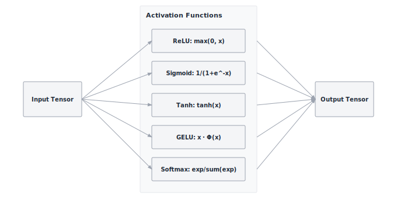

# Module 02: Activations

:::{.callout-note title="Module Info"}

**FOUNDATION TIER** | Difficulty: ●○○○ | Time: 3-5 hours | Prerequisites: 01 (Tensor)

**Prerequisites: Module 01 (Tensor)** means you need:

- Completed Tensor implementation with element-wise operations
- Understanding of tensor shapes and broadcasting
- Familiarity with NumPy mathematical functions

If you can create a Tensor and perform element-wise arithmetic (`x + y`, `x * 2`), you're ready.
:::

```{=html}
<div class="action-cards">
<div class="action-card">
<h4>🎧 Audio Overview</h4>
<p>Listen to an AI-generated overview.</p>
<audio controls style="width: 100%; height: 54px;">
<source src="https://github.com/harvard-edge/cs249r_book/releases/download/tinytorch-audio-v0.1.1/02_activations.mp3" type="audio/mpeg">
</audio>
</div>
<div class="action-card">
<h4>🚀 Launch Binder</h4>
<p>Run interactively in your browser.</p>
<a href="https://mybinder.org/v2/gh/harvard-edge/cs249r_book/main?labpath=tinytorch%2Fmodules%2F02_activations%2Factivations.ipynb" class="action-btn btn-orange">Open in Binder →</a>
</div>
<div class="action-card">
<h4>📄 View Source</h4>
<p>Browse the source code on GitHub.</p>
<a href="https://github.com/harvard-edge/cs249r_book/blob/main/tinytorch/src/02_activations/02_activations.py" class="action-btn btn-teal">View on GitHub →</a>
</div>
</div>

<style>
.slide-viewer-container {
  margin: 0.5rem 0 1.5rem 0;
  background: #0f172a;
  border-radius: 1rem;
  overflow: hidden;
  box-shadow: 0 4px 20px rgba(0,0,0,0.15);
}
.slide-header {
  display: flex;
  align-items: center;
  justify-content: space-between;
  padding: 0.6rem 1rem;
  background: rgba(255,255,255,0.03);
}
.slide-title {
  display: flex;
  align-items: center;
  gap: 0.5rem;
  color: #94a3b8;
  font-weight: 500;
  font-size: 0.85rem;
}
.slide-subtitle {
  color: #64748b;
  font-weight: 400;
  font-size: 0.75rem;
}
.slide-toolbar {
  display: flex;
  align-items: center;
  gap: 0.375rem;
}
.slide-toolbar button {
  background: transparent;
  border: none;
  color: #64748b;
  width: 32px;
  height: 32px;
  border-radius: 0.375rem;
  cursor: pointer;
  font-size: 1.1rem;
  transition: all 0.15s;
  display: flex;
  align-items: center;
  justify-content: center;
}
.slide-toolbar button:hover {
  background: rgba(249, 115, 22, 0.15);
  color: #f97316;
}
.slide-nav-group {
  display: flex;
  align-items: center;
}
.slide-page-info {
  color: #64748b;
  font-size: 0.75rem;
  padding: 0 0.5rem;
  font-weight: 500;
}
.slide-zoom-group {
  display: flex;
  align-items: center;
  margin-left: 0.25rem;
  padding-left: 0.5rem;
  border-left: 1px solid rgba(255,255,255,0.1);
}
.slide-canvas-wrapper {
  display: flex;
  justify-content: center;
  align-items: center;
  padding: 0.5rem 1rem 1rem 1rem;
  min-height: 380px;
  background: #0f172a;
}
.slide-canvas {
  max-width: 100%;
  max-height: 350px;
  height: auto;
  border-radius: 0.5rem;
  box-shadow: 0 4px 24px rgba(0,0,0,0.4);
}
.slide-progress-wrapper {
  padding: 0 1rem 0.5rem 1rem;
}
.slide-progress-bar {
  height: 3px;
  background: rgba(255,255,255,0.08);
  border-radius: 1.5px;
  overflow: hidden;
  cursor: pointer;
}
.slide-progress-fill {
  height: 100%;
  background: #f97316;
  border-radius: 1.5px;
  transition: width 0.2s ease;
}
.slide-loading {
  color: #f97316;
  font-size: 0.9rem;
  display: flex;
  align-items: center;
  gap: 0.5rem;
}
.slide-loading::before {
  content: '';
  width: 18px;
  height: 18px;
  border: 2px solid rgba(249, 115, 22, 0.2);
  border-top-color: #f97316;
  border-radius: 50%;
  animation: slide-spin 0.8s linear infinite;
}
@keyframes slide-spin {
  to { transform: rotate(360deg); }
}
.slide-footer {
  display: flex;
  justify-content: center;
  gap: 0.5rem;
  padding: 0.6rem 1rem;
  background: rgba(255,255,255,0.02);
  border-top: 1px solid rgba(255,255,255,0.05);
}
.slide-footer a {
  display: inline-flex;
  align-items: center;
  gap: 0.375rem;
  background: #f97316;
  color: white;
  padding: 0.4rem 0.9rem;
  border-radius: 2rem;
  text-decoration: none;
  font-weight: 500;
  font-size: 0.75rem;
  transition: all 0.15s;
}
.slide-footer a:hover {
  background: #ea580c;
  color: white;
}
.slide-footer a.secondary {
  background: transparent;
  color: #94a3b8;
  border: 1px solid rgba(255,255,255,0.15);
}
.slide-footer a.secondary:hover {
  background: rgba(255,255,255,0.05);
  color: #f8fafc;
}
@media (max-width: 600px) {
  .slide-header { flex-direction: column; gap: 0.5rem; padding: 0.5rem 0.75rem; }
  .slide-toolbar button { width: 28px; height: 28px; }
  .slide-canvas-wrapper { min-height: 260px; padding: 0.5rem; }
  .slide-canvas { max-height: 220px; }
}
</style>

<div class="slide-viewer-container" id="slide-viewer-02_activations">
<div class="slide-header">
<div class="slide-title">
<span>🔥</span>
<span>Slide Deck</span>

<span class="slide-subtitle">· AI-generated</span>
</div>
<div class="slide-toolbar">
<div class="slide-nav-group">
<button onclick="slideNav('02_activations', -1)" title="Previous">‹</button>
<span class="slide-page-info"><span id="slide-num-02_activations">1</span> / <span id="slide-count-02_activations">-</span></span>
<button onclick="slideNav('02_activations', 1)" title="Next">›</button>
</div>
<div class="slide-zoom-group">
<button onclick="slideZoom('02_activations', -0.25)" title="Zoom out">−</button>
<button onclick="slideZoom('02_activations', 0.25)" title="Zoom in">+</button>
</div>
</div>
</div>
<div class="slide-canvas-wrapper">
<div id="slide-loading-02_activations" class="slide-loading">Loading slides...</div>
<canvas id="slide-canvas-02_activations" class="slide-canvas" style="display:none;"></canvas>
</div>
<div class="slide-progress-wrapper">
<div class="slide-progress-bar" onclick="slideProgress('02_activations', event)">
<div class="slide-progress-fill" id="slide-progress-02_activations" style="width: 0%;"></div>
</div>
</div>
<div class="slide-footer">
<a href="../assets/slides/02_activations.pdf" download>⬇ Download</a>
<a href="#" onclick="slideFullscreen('02_activations'); return false;" class="secondary">⛶ Fullscreen</a>
</div>
</div>

<script src="https://cdnjs.cloudflare.com/ajax/libs/pdf.js/3.11.174/pdf.min.js"></script>
<script>
(function() {
  if (window.slideViewersInitialized) return;
  window.slideViewersInitialized = true;

  pdfjsLib.GlobalWorkerOptions.workerSrc = 'https://cdnjs.cloudflare.com/ajax/libs/pdf.js/3.11.174/pdf.worker.min.js';

  window.slideViewers = {};

  window.initSlideViewer = function(id, pdfUrl) {
    const viewer = { pdf: null, page: 1, scale: 1.3, rendering: false, pending: null };
    window.slideViewers[id] = viewer;

    const canvas = document.getElementById('slide-canvas-' + id);
    const ctx = canvas.getContext('2d');

    function render(num) {
      viewer.rendering = true;
      viewer.pdf.getPage(num).then(function(page) {
        const viewport = page.getViewport({scale: viewer.scale});
        canvas.height = viewport.height;
        canvas.width = viewport.width;
        page.render({canvasContext: ctx, viewport: viewport}).promise.then(function() {
          viewer.rendering = false;
          if (viewer.pending !== null) { render(viewer.pending); viewer.pending = null; }
        });
      });
      document.getElementById('slide-num-' + id).textContent = num;
      document.getElementById('slide-progress-' + id).style.width = (num / viewer.pdf.numPages * 100) + '%';
    }

    function queue(num) { if (viewer.rendering) viewer.pending = num; else render(num); }

    pdfjsLib.getDocument(pdfUrl).promise.then(function(pdf) {
      viewer.pdf = pdf;
      document.getElementById('slide-count-' + id).textContent = pdf.numPages;
      document.getElementById('slide-loading-' + id).style.display = 'none';
      canvas.style.display = 'block';
      render(1);
    }).catch(function() {
      document.getElementById('slide-loading-' + id).innerHTML = 'Unable to load. <a href="' + pdfUrl + '" style="color:#f97316;">Download PDF</a>';
    });

    viewer.queue = queue;
  };

  window.slideNav = function(id, dir) {
    const v = window.slideViewers[id];
    if (!v || !v.pdf) return;
    const newPage = v.page + dir;
    if (newPage >= 1 && newPage <= v.pdf.numPages) { v.page = newPage; v.queue(newPage); }
  };

  window.slideZoom = function(id, delta) {
    const v = window.slideViewers[id];
    if (!v) return;
    v.scale = Math.max(0.5, Math.min(3, v.scale + delta));
    v.queue(v.page);
  };

  window.slideProgress = function(id, event) {
    const v = window.slideViewers[id];
    if (!v || !v.pdf) return;
    const bar = event.currentTarget;
    const pct = (event.clientX - bar.getBoundingClientRect().left) / bar.offsetWidth;
    const newPage = Math.max(1, Math.min(v.pdf.numPages, Math.ceil(pct * v.pdf.numPages)));
    if (newPage !== v.page) { v.page = newPage; v.queue(newPage); }
  };

  window.slideFullscreen = function(id) {
    const el = document.getElementById('slide-viewer-' + id);
    if (el.requestFullscreen) el.requestFullscreen();
    else if (el.webkitRequestFullscreen) el.webkitRequestFullscreen();
  };
})();

initSlideViewer('02_activations', '../assets/slides/02_activations.pdf');

</script>

```
## Overview

A neural network without activation functions isn't a neural network — it's a single matrix multiplication wearing a costume. Stack a hundred linear layers, and the composition collapses to one: $W_2(W_1 x) = (W_2 W_1)x$. Depth buys you nothing until you break the linearity.

Activations are how you break it. ReLU zeros out negatives. Sigmoid squashes any real number into $(0, 1)$. Softmax turns raw scores into a probability distribution. Each is just a few lines of math, but together they're what lets a network learn to distinguish a cat from a dog instead of computing one giant linear regression.

You'll build five of them: ReLU, Sigmoid, Tanh, GELU, and Softmax. Along the way you'll meet the chapter's load-bearing insight — *why every production softmax subtracts the max before exponentiating* — and the dead-neuron problem that explains why ReLU's apparent simplicity hides a real failure mode.

## Learning Objectives

:::{.callout-tip title="By completing this module, you will:"}

- **Implement** five core activation functions (ReLU, Sigmoid, Tanh, GELU, Softmax) with the numerical-stability tricks production frameworks use
- **Explain** why nonlinearity turns a stack of matrix multiplies into a function approximator
- **Quantify** the compute cost of each activation and decide when the extra accuracy of GELU is worth the extra exponentials
- **Map** your implementations onto the corresponding `torch.nn.functional` calls so PyTorch stops feeling like a black box
:::

## What You'll Build


::: {#fig-02_activations-diag-1 fig-env="figure" fig-pos="htb" fig-cap="**Activation functions in TinyTorch**: ReLU, Sigmoid, Tanh, GELU, and Softmax transformations." fig-alt="Diagram showing an input tensor branching into five activation functions, which then converge into an output tensor."}



:::


**Implementation roadmap:**

| Part | What You'll Implement | Key Concept |
|------|----------------------|-------------|
| 1 | `ReLU.forward()` | Sparsity through zeroing negatives |
| 2 | `Sigmoid.forward()` | Mapping to (0,1) for probabilities |
| 3 | `Tanh.forward()` | Zero-centered activation for better gradients |
| 4 | `GELU.forward()` | Smooth nonlinearity for transformers |
| 5 | `Softmax.forward()` | Probability distributions with numerical stability |

: **Implementation roadmap for the core activation functions.** {#tbl-02-activations-implementation-roadmap}

**The pattern you'll enable:**

```python
# Transforming tensors through nonlinear functions
relu = ReLU()
activated = relu(x)  # Zeros negatives, keeps positives

softmax = Softmax()
probabilities = softmax(logits)  # Converts to probability distribution (sums to 1)
```

### What You're NOT Building (Yet)

To keep this module focused, you will **not** implement:

- Gradient computation (`backward()` methods are stubs for now — automatic differentiation is a later module)
- Learnable parameters (activations are fixed mathematical functions)
- Advanced variants (LeakyReLU, ELU, Swish — PyTorch ships dozens; you'll build the core five that cover ~95% of real architectures)
- GPU acceleration (your NumPy implementation runs on CPU)

The forward pass is enough to build intuition. Gradients show up in Module 06.

## API Reference

This section provides a quick reference for the activation classes you'll build. Each activation is a callable object with a `forward()` method that transforms an input tensor element-wise.

### Activation Pattern

All activations follow this structure:

```python
class ActivationName:
    def forward(self, x: Tensor) -> Tensor:
        # Apply mathematical transformation
        pass

    def __call__(self, x: Tensor) -> Tensor:
        return self.forward(x)

    def backward(self, grad: Tensor) -> Tensor:
        # Stub — autograd adds gradient computation later
        pass
```

### Core Activations

| Activation | Mathematical Form | Output Range | Primary Use Case |
|------------|------------------|--------------|------------------|
| `ReLU` | `max(0, x)` | `[0, ∞)` | Hidden layers (CNNs, MLPs) |
| `Sigmoid` | `1/(1 + e^-x)` | `(0, 1)` | Binary classification output |
| `Tanh` | `(e^x - e^-x)/(e^x + e^-x)` | `(-1, 1)` | RNNs, zero-centered needs |
| `GELU` | `x · Φ(x)` | `(-∞, ∞)` | Transformers (GPT, BERT) |
| `Softmax` | `e^xi / Σe^xj` | `(0, 1)`, sum=1 | Multi-class classification |

: **Mathematical form, output range, and use case for each activation.** {#tbl-02-activations-function-summary}

### Method Signatures

**ReLU**
```python
ReLU.forward(x: Tensor) -> Tensor
```
Sets negative values to zero, preserves positive values.

**Sigmoid**
```python
Sigmoid.forward(x: Tensor) -> Tensor
```
Maps any real number to (0, 1) range using logistic function.

**Tanh**
```python
Tanh.forward(x: Tensor) -> Tensor
```
Maps any real number to (-1, 1) range using hyperbolic tangent.

**GELU**
```python
GELU.forward(x: Tensor) -> Tensor
```
Smooth approximation to ReLU using Gaussian error function.

**Softmax**
```python
Softmax.forward(x: Tensor, dim: int = -1) -> Tensor
```
Converts vector to probability distribution along specified dimension.

## Core Concepts

Before you write a single `np.maximum`, settle the four ideas that govern every activation choice you'll make for the rest of the book: why nonlinearity is non-optional, why ReLU dominates in practice, why softmax has to be implemented carefully, and what each activation costs you per element.

### Why Non-linearity Matters

Consider what happens when you stack linear transformations. If you multiply a matrix by a vector, then multiply the result by another matrix, the composition is still just matrix multiplication. Mathematically:

```
f(x) = W₂(W₁x) = (W₂W₁)x = Wx
```

A 100-layer network of pure matrix multiplications is identical to a single matrix multiplication. The depth buys you nothing.

Activation functions break this linearity. When you insert `f(x) = max(0, x)` between layers, the composition becomes nonlinear:

```
f(x) = max(0, W₂ max(0, W₁x))
```

Now you can't simplify the layers away. Each layer learns to detect a different level of structure. Layer 1 finds edges; layer 2 composes edges into shapes; layer 3 composes shapes into objects. This hierarchy of features is *only* possible because the activation between layers is nonlinear — the moment you remove it, the whole stack collapses back into a single matrix and the hierarchy vanishes with it.

That's the entire reason this module exists. Five small functions are what separate a neural network from a linear regression with extra steps.

### ReLU and Its Variants

ReLU (Rectified Linear Unit) is deceptively simple: it zeros out negative values and leaves positive values unchanged. Here's the complete implementation from your module:

```python
class ReLU:
    def forward(self, x: Tensor) -> Tensor:
        """Apply ReLU activation element-wise."""
        result = np.maximum(0, x.data)
        return Tensor(result)
```

This simplicity is ReLU's greatest strength. The operation is a single comparison per element: O(n) with a tiny constant factor. Modern CPUs can execute billions of comparisons per second. Compare this to sigmoid, which requires computing an exponential for every element.

ReLU creates **sparsity**. When half of your activations are exactly zero, computations become faster (multiplying by zero is free) and models generalize better (sparse representations are less prone to overfitting). In a 1000-neuron layer, ReLU typically activates 300-500 neurons, effectively creating a smaller, specialized network for each input.

The discontinuity at zero is both a feature and a bug. ReLU's gradient is exactly 1 for positive inputs and exactly 0 for negative inputs — no decay, no saturation, no vanishing. That single property is what made training 100-layer networks tractable.

The bug is a corollary: **the dying ReLU problem**. The failure chain is short and brutal:

1. A weight update pushes a neuron's pre-activation negative for *every* input in the batch.
2. ReLU outputs zero.
3. The local gradient is zero.
4. Backprop sends zero through it, so its weights never update again.

The neuron is now a permanent zero. It contributes nothing to the forward pass and receives nothing from the backward pass. In practice, 10–40% of ReLU units in a trained network are dead. This is what variants like LeakyReLU, ELU, and GELU were designed to fix — they keep a small nonzero gradient on the negative side so a struggling neuron can claw its way back. Despite this, plain ReLU remains the default in CNNs and MLPs: it's fast, it doesn't vanish, and a few dead neurons in an over-parameterized model are cheaper than the extra exponentials.

### Sigmoid and Tanh

Sigmoid maps any real number to the range (0, 1), making it perfect for representing probabilities:

```python
class Sigmoid:
    def forward(self, x: Tensor) -> Tensor:
        """Apply sigmoid activation element-wise."""
        z = np.clip(x.data, -500, 500)  # Prevent overflow
        result_data = np.zeros_like(z)

        # Positive values: 1 / (1 + exp(-x))
        pos_mask = z >= 0
        result_data[pos_mask] = 1.0 / (1.0 + np.exp(-z[pos_mask]))

        # Negative values: exp(x) / (1 + exp(x))
        neg_mask = z < 0
        exp_z = np.exp(z[neg_mask])
        result_data[neg_mask] = exp_z / (1.0 + exp_z)

        return Tensor(result_data)
```

Notice that there are two formulas, not one. The textbook form `1 / (1 + exp(-x))` blows up for large negative `x` because `exp(-x)` overflows. The algebraically equivalent `exp(x) / (1 + exp(x))` blows up for large positive `x` for the symmetric reason. Neither is "right"; each is right on one side of zero. The implementation picks the safe branch per element and clips at ±500 as a belt-and-suspenders guard. This is the first time in the course you see a recurring pattern: *the math is one expression, the numerically stable code is a piecewise rewrite of it*.

Sigmoid's smooth S-curve makes it natural for binary classification outputs — the value reads directly as a probability. For hidden layers it's a disaster. When $|x|$ grows, the output saturates near 0 or 1 and the gradient collapses toward zero. In a deep network those tiny gradients multiply through the chain rule and vanish exponentially. That's why sigmoid lost the hidden-layer slot to ReLU around 2012 and never got it back.

Tanh is sigmoid's zero-centered cousin, mapping inputs to (-1, 1):

```python
class Tanh:
    def forward(self, x: Tensor) -> Tensor:
        """Apply tanh activation element-wise."""
        result = np.tanh(x.data)
        return Tensor(result)
```

Zero-centering is the only real difference, and it matters more than it sounds. Sigmoid outputs are always positive, which biases the gradient updates of the next layer in one direction; tanh outputs straddle zero, so positive and negative gradients cancel naturally. That's why tanh, not sigmoid, was the activation of choice inside LSTM and GRU cells where the same weights see the same hidden state hundreds of times. Tanh still saturates at the extremes, so deep stacks still vanish — but for bounded, recurrent settings it remains the right pick.

### Softmax and Numerical Stability

Softmax converts any vector into a valid probability distribution. All outputs are positive, and they sum to exactly 1. This makes it essential for multi-class classification:

```python
class Softmax:
    def forward(self, x: Tensor, dim: int = -1) -> Tensor:
        """Apply softmax activation along specified dimension."""
        # Numerical stability: subtract max to prevent overflow
        x_max_data = np.max(x.data, axis=dim, keepdims=True)
        x_max = Tensor(x_max_data, requires_grad=False)
        x_shifted = x - x_max

        # Compute exponentials
        exp_values = Tensor(np.exp(x_shifted.data), requires_grad=x_shifted.requires_grad)

        # Sum along dimension
        exp_sum_data = np.sum(exp_values.data, axis=dim, keepdims=True)
        exp_sum = Tensor(exp_sum_data, requires_grad=exp_values.requires_grad)

        # Normalize to get probabilities
        result = exp_values / exp_sum
        return result
```

**Why the max subtraction matters — the load-bearing trick of this chapter.**

`np.max` looks like a throwaway line. It is not. It is the single line that separates a softmax that works on real model logits from one that returns `nan` and silently corrupts your training run.

Consider what happens without it. A trained transformer can easily produce a logit of 50 for the predicted token. `exp(50)` is about $5.18 \times 10^{21}$ — still inside float32 range, but only barely. Push it to logit 100 and `exp(100) ≈ 2.7 \times 10^{43}` overflows to `+inf`. Now the numerator is `inf`, the denominator is `inf`, and `inf / inf = nan`. Every downstream loss, gradient, and parameter update inherits the `nan`. By the time you notice, your model is ruined and the stack trace points at the loss function, not at the activation that poisoned it three layers earlier.

Subtracting the max fixes this without changing the math. The largest shifted logit is exactly `0`, so the largest exponent we ever take is `exp(0) = 1`. Every other exponent is between 0 and 1. Overflow becomes structurally impossible:

```
softmax(x)_i = exp(x_i - max(x)) / Σ_j exp(x_j - max(x))
             = exp(x_i) / exp(max(x))   ÷   Σ_j exp(x_j) / exp(max(x))
             = exp(x_i) / Σ_j exp(x_j)
```

The `exp(max)` factor cancels in numerator and denominator. Mathematically identical, numerically a different universe. This is the first instance of the **log-sum-exp trick** — you'll meet it again in Module 04 when you implement cross-entropy loss as `log_softmax`, where the same shift prevents the *underflow* that happens when you take the log of a tiny probability. *That* is why every production framework — PyTorch, JAX, TensorFlow — does the same shift in the same place.

Two more properties worth internalizing before you move on.

**Softmax amplifies differences.** Input `[1, 2, 3]` becomes roughly `[0.09, 0.24, 0.67]`. The largest input is only 3× the smallest, but it claims 67% of the probability mass — because exponentials grow superlinearly. Push the inputs apart and the distribution sharpens toward one-hot; pull them together and it flattens toward uniform. This sharpening is what makes a classifier "confident."

**Softmax couples its outputs.** Change one input and *every* output changes, because they all share the same denominator. That coupling is why the softmax gradient is a Jacobian, not an element-wise derivative — a complication you'll inherit in Module 06 (Autograd) and the reason cross-entropy is fused with softmax in practice rather than backpropped through both stages separately.

### Choosing Activations

Here's the decision tree production ML engineers actually use.

**For hidden layers:**

- Default: **ReLU** — fast, no vanishing gradients, creates sparsity
- Transformers: **GELU** — smooth, better gradient flow, the de-facto choice in GPT/BERT
- Recurrent networks: **Tanh** — zero-centered, plays well with repeated weight application
- When ReLU is dying on you: **LeakyReLU**, **ELU**, **Swish**

**For output layers:**

- Binary classification: **Sigmoid** — one probability in $[0, 1]$
- Multi-class classification: **Softmax** — a probability distribution that sums to 1
- Regression: **None** — leave the linear output alone

**Computational cost (relative to ReLU):**

- ReLU: 1× (just a comparison)
- Sigmoid/Tanh: 3–4× (one exponential per element)
- GELU: 4–5× (exponential plus the approximation polynomial)
- Softmax: 5×+ (exponential, sum-reduction, division)

For a billion-parameter model, swapping ReLU for GELU in every hidden layer can add 20–30% to training time. The trade is often worth it: a 1–2 point accuracy bump on a transformer is rarely something you turn down. The point is that you have to *know it's a trade*. Defaults shipped by frameworks are not free.

### Computational Complexity

All activation functions are element-wise operations, meaning they apply independently to each element of the tensor. This gives O(n) time complexity where n is the total number of elements. However, because they perform very little math per element, activation functions are typically **memory-bound** rather than compute-bound. The bottleneck isn't the processor doing the math; it's the time it takes to fetch the tensor from RAM and write the result back.

This physical constraint fundamentally changes how systems engineers implement these seemingly simple mathematical functions. When compute is fast but memory access is slow, every byte moved across the bus is a tax on performance.

:::{.callout-note title="Systems Implication: The Bandwidth Tax & In-place Operations"}
Because element-wise operations like ReLU spend most of their execution time waiting on memory transfers, production frameworks often use **in-place operations** (e.g., `x.relu_()`). By overwriting the input tensor directly rather than allocating a new one, in-place operations save an entire round-trip to RAM, significantly reducing the bandwidth tax.
:::

Even though these operations are memory-bound, the constant mathematical factors still differ dramatically:

| Operation | Complexity | Cost Relative to ReLU |
|-----------|------------|----------------------|
| ReLU (`max(0, x)`) | O(n) comparisons | 1× (baseline) |
| Sigmoid/Tanh | O(n) exponentials | 3-4× |
| GELU | O(n) exponentials + multiplies | 4-5× |
| Softmax | O(n) exponentials + O(n) sum + O(n) divisions | 5×+ |

: **Computational cost of activations relative to ReLU.** {#tbl-02-activations-relative-cost}

Exponentials are expensive. A modern CPU can execute 1 billion comparisons per second but only 250 million exponentials per second. This is why ReLU is so popular: at scale, a 4× speedup in activation computation can mean the difference between training in 1 day versus 4 days.

Memory complexity is O(n) for all activations because they create an output tensor the same size as the input. Softmax requires small temporary buffers for the exponentials and sum, but this overhead is negligible compared to the tensor sizes in production networks.

## Production Context

### Your Implementation vs. PyTorch

Your TinyTorch activations and PyTorch's `torch.nn.functional` activations implement the same mathematical functions with the same numerical stability measures. The differences are in optimization and GPU support:

| Feature | Your Implementation | PyTorch |
|---------|---------------------|---------|
| **Backend** | NumPy (Python/C) | C++/CUDA kernels |
| **Speed** | 1× (CPU baseline) | 10-100× faster (GPU) |
| **Numerical Stability** | ✓ Max subtraction (Softmax), clipping (Sigmoid) | ✓ Same techniques |
| **Autograd** | Stubs (added later) | Full gradient computation |
| **Variants** | 5 core activations | 30+ variants (LeakyReLU, PReLU, Mish, etc.) |

: **Feature comparison between TinyTorch activations and PyTorch equivalents.** {#tbl-02-activations-vs-pytorch}

### Code Comparison

The following comparison shows equivalent activation usage in TinyTorch and PyTorch. Notice how the APIs are nearly identical, differing only in import paths and minor syntax.

::: {.panel-tabset}
## Your TinyTorch
```python
from tinytorch.core.activations import ReLU, Sigmoid, Softmax
from tinytorch.core.tensor import Tensor

# Element-wise activations
x = Tensor([[-1, 0, 1, 2]])
relu = ReLU()
activated = relu(x)  # [0, 0, 1, 2]

# Binary classification output
sigmoid = Sigmoid()
probability = sigmoid(x)  # All values in (0, 1)

# Multi-class classification output
logits = Tensor([[1, 2, 3]])
softmax = Softmax()
probs = softmax(logits)  # [0.09, 0.24, 0.67], sum = 1
```

## PyTorch
```python
import torch
import torch.nn.functional as F

# Element-wise activations
x = torch.tensor([[-1, 0, 1, 2]], dtype=torch.float32)
activated = F.relu(x)  # [0, 0, 1, 2]

# Binary classification output
probability = torch.sigmoid(x)  # All values in (0, 1)

# Multi-class classification output
logits = torch.tensor([[1, 2, 3]], dtype=torch.float32)
probs = F.softmax(logits, dim=-1)  # [0.09, 0.24, 0.67], sum = 1
```
:::

Let's walk through the key similarities and differences:

- **Line 1 (Import)**: TinyTorch imports activation classes; PyTorch uses functional interface `torch.nn.functional`. Both approaches work; PyTorch also supports class-based activations via `torch.nn.ReLU()`.
- **Line 4-6 (ReLU)**: Identical semantics. Both zero out negative values, preserving positive values.
- **Line 9-10 (Sigmoid)**: Identical mathematical function. Both use numerically stable implementations to prevent overflow.
- **Line 13-15 (Softmax)**: Same mathematical operation. Both require specifying the dimension for multidimensional tensors. PyTorch uses `dim` keyword argument; TinyTorch defaults to `dim=-1`.

:::{.callout-tip title="What's Identical"}

Mathematical functions, numerical stability techniques (max subtraction in softmax), and the concept of element-wise transformations. When you debug PyTorch activation issues, you'll understand exactly what's happening because you implemented the same logic.
:::

### Why Activations Matter at Scale

A single activation call is microseconds of work. The reason it adds up to a real engineering trade-off is the multiplier.

- **Large language models**: GPT-3 has 96 transformer layers, each with 2 GELU activations — **192 GELU operations per forward pass**, every one of them over a tensor with billions of elements.
- **Image classification**: ResNet-50 has 49 convolutional layers, each followed by ReLU. A batch of 256 images at 224×224 resolution executes roughly **12 billion ReLU operations** per batch.
- **Production serving**: A model handling 1000 requests per second runs about **86 million activation computations per day**, per layer. A 20% speedup from picking ReLU over GELU translates to hours of saved compute every day.

Activations account for **5–15% of total training time** in a typical conv-heavy network. In transformers — where the per-layer matmuls are smaller and the layer count is larger — that share climbs to **20–30%**. That's the cost side of the GELU-vs-ReLU choice: not negligible, not catastrophic, but absolutely worth measuring before you ship.

## Check Your Understanding

:::{.callout-tip title="Check Your Understanding — Activations"}
Before moving on, verify you can articulate each of the following:

- [ ] Why stacking linear layers without activations collapses to a single matrix multiply — and how ReLU, Sigmoid, or GELU break that collapse.
- [ ] Why softmax subtracts the per-row max before exponentiating, and how that one shift turns an `inf/inf = nan` blowup into a stable `exp(0) = 1`.
- [ ] The dying ReLU failure chain (negative pre-activation → zero output → zero local gradient → frozen weights) and why LeakyReLU/GELU patch it.
- [ ] Why activations are memory-bound (not compute-bound) and how in-place variants like `relu_()` save an entire RAM round-trip.
- [ ] The relative cost ordering ReLU (1x) < Sigmoid/Tanh (3-4x) < GELU (4-5x) < Softmax (5x+), and when that cost is worth paying.

If any of these feels fuzzy, revisit Core Concepts (Why Non-linearity Matters, Softmax and Numerical Stability, Computational Complexity) before moving on.
:::

The collapsible Q&A below works each of these through with numbers.

**Q1: Memory Calculation**

A batch of 32 samples passes through a hidden layer with 4096 neurons and ReLU activation. How much memory is required to store the activation outputs (float32)?

:::{.callout-tip collapse="true" title="Answer"}

32 × 4096 × 4 bytes = **524,288 bytes ≈ 512 KB**.

This is the activation memory for ONE layer. A 100-layer network needs **50 MB** just to store activations for a single forward pass — and during training every one of those layers has to be cached so backprop can use them. That's why activation memory, not parameter memory, is what usually decides your batch size.
:::

**Q2: Computational Cost**

If ReLU takes 1ms to activate 1 million neurons, approximately how long will GELU take on the same input?

:::{.callout-tip collapse="true" title="Answer"}

GELU is approximately **4-5× slower** than ReLU due to exponential computation in the sigmoid approximation.

Expected time: **4-5ms**

At scale, this matters: if you have 100 activation layers in your model, switching from ReLU to GELU adds 300-400ms per forward pass. For training that requires millions of forward passes, this multiplies into hours or days of extra compute time.
:::

**Q3: Numerical Stability**

Why does softmax subtract the maximum value before computing exponentials? What would happen without this step?

:::{.callout-tip collapse="true" title="Answer"}

**Without max subtraction**: Computing `softmax([1000, 1001, 1002])` requires `exp(1000)`, which overflows to infinity in float32/float64, producing NaN.

**With max subtraction**: First compute `x_shifted = x - max(x) = [0, 1, 2]`, then compute `exp([0, 1, 2])` which stays within float range.

**Why this works mathematically**:
```
exp(x - max) / Σ exp(x - max) = [exp(x) / exp(max)] / [Σ exp(x) / exp(max)]
                                = exp(x) / Σ exp(x)
```

The `exp(max)` factor cancels out, so the result is mathematically identical. But numerically, it prevents overflow. This is a classic example of why production ML requires careful numerical engineering, not just correct math.
:::

**Q4: Sparsity Analysis**

A ReLU layer processes input tensor with shape (128, 1024) containing values drawn from a normal distribution N(0, 1). Approximately what percentage of outputs will be exactly zero?

:::{.callout-tip collapse="true" title="Answer"}

For a standard normal distribution N(0, 1), approximately **50% of values are negative**.

ReLU zeros all negative values, so approximately **50% of outputs will be exactly zero**.

Total elements: 128 × 1024 = **131,072**.
Zeros: ≈ **65,536**.

This sparsity has major implications:

- **Speed**: Multiplying by zero is free, so downstream computations can skip ~50% of operations
- **Memory**: Sparse formats can compress the output by 2×
- **Generalization**: Sparse representations often generalize better (less overfitting)

This is why ReLU is so effective: it creates natural sparsity without requiring explicit regularization.
:::

**Q5: Activation Selection**

You're building a sentiment classifier that outputs "positive" or "negative". Which activation should you use for the output layer, and why?

:::{.callout-tip collapse="true" title="Answer"}

**Use Sigmoid** for the output layer.

**Reasoning**:

- Binary classification needs a single probability value in [0, 1]
- Sigmoid maps any real number to (0, 1)
- Output can be interpreted as P(positive) where 0.8 means "80% confident this is positive"
- Decision rule: predict positive if sigmoid(output) > 0.5

**Why NOT other activations**:

- **Softmax**: Overkill for binary classification (designed for multi-class), though technically works with 2 outputs
- **ReLU**: Outputs unbounded positive values, not interpretable as probabilities
- **Tanh**: Outputs in (-1, 1), not directly interpretable as probabilities

**Production pattern**:
```
Input → Linear + ReLU → Linear + ReLU → Linear + Sigmoid → Binary Probability
```

For multi-class sentiment (positive/negative/neutral), you'd use Softmax instead to get a 3-element probability distribution.
:::

## Key Takeaways

- **Nonlinearity is non-optional:** without a pointwise function between layers, any depth of Linear stack collapses to a single `Wx` — activations are what make "deep" mean anything.
- **The log-sum-exp shift is load-bearing:** every production softmax subtracts `max(x)` before exponentiating, turning overflow into algebraically identical safe math. You will see this trick again inside cross-entropy.
- **ReLU trades elegance for dead neurons:** `max(0, x)` is the cheapest possible nonlinearity and gives constant gradient on the positive side, but any weight update that zeros the pre-activation permanently silences that unit.
- **Activations are memory-bound:** per-element compute is trivial; the bottleneck is the RAM round-trip, which is why in-place `x.relu_()` is preferred in production and why the ReLU→GELU swap is a measurable cost.
- **Cost scales with transcendentals:** ReLU is one comparison; Sigmoid/Tanh need one `exp`; Softmax needs an `exp`, a reduction, and a division. That ordering decides when GELU's smoother gradient is worth its 4-5x tax.

**Coming next:** Module 03 adds the learnable transformation between activations — the `Linear` layer and the `Sequential` container that lets you compose `Linear → activation → Linear → ...` into an actual MLP.

## Further Reading

The choice of an activation function is rarely just a mathematical preference; it is a profound architectural decision that dictates how a network learns, sparsifies data, and how efficiently it maps to hardware. To understand how we arrived at today's standard practices—from the memory-efficient sparsity of ReLU to the computationally heavy but smooth gradients of GELU—the following historical foundations are essential reading.

### Seminal Papers

- **Deep Sparse Rectifier Neural Networks** - Glorot, Bordes, Bengio (2011). The paper that established ReLU as the default activation for deep networks, showing how its sparsity and constant gradient enable training of very deep networks. [AISTATS](http://proceedings.mlr.press/v15/glorot11a.html)

- **Gaussian Error Linear Units (GELUs)** - Hendrycks & Gimpel (2016). Introduced the smooth activation that powers modern transformers like GPT and BERT. Explains the probabilistic interpretation and why smoothness helps optimization. [arXiv:1606.08415](https://arxiv.org/abs/1606.08415)

- **Attention Is All You Need** - Vaswani et al. (2017). While primarily about transformers, this paper's use of specific activations (ReLU in position-wise FFN, Softmax in attention) established patterns still used today. **Systems Implication:** Replaced recurrence with self-attention, breaking the sequential compute bottleneck of RNNs and allowing massive parallelization across GPU cores. [NeurIPS](https://arxiv.org/abs/1706.03762)

### Additional Resources

- **Textbook**: ["Deep Learning"](https://www.deeplearningbook.org/) by Goodfellow, Bengio, and Courville - Chapter 6.3 covers activation functions with mathematical rigor
- **Blog**: [Understanding Activation Functions](https://mlu-explain.github.io/relu/) - Amazon's MLU visual explanation of ReLU

## What's Next

You now have nonlinearity. You still don't have anything *to* be nonlinear about. ReLU on a raw input vector accomplishes nothing — the network needs a learnable transformation between activations, something with weights and biases that gradient descent can shape.

That's the next module.

:::{.callout-note title="Coming Up: Module 03 — Layers"}

**The question Module 03 answers:** what is `Linear(x)`, exactly, and how does it compose with the activations you just built into the canonical `Linear → activation → Linear → activation → ...` stack that defines an MLP?

You'll implement the `Linear` layer — weight matrix, bias vector, forward pass — and then chain it with your `ReLU` and `Softmax` to build the first thing in this course that deserves to be called a neural network.
:::

**Preview — how your activations get used in future modules:**

| Module | What It Does | Your Activations In Action |
|--------|--------------|---------------------------|
| **03: Layers** | Neural network building blocks | `Linear(x)` followed by `ReLU()(output)` |
| **04: Losses** | Training objectives | Softmax probabilities feed into cross-entropy loss |
| **06: Autograd** | Automatic gradients | `relu.backward(grad)` computes activation gradients |

: **How activations feed into subsequent TinyTorch modules.** {#tbl-02-activations-downstream-usage}

## Get Started

:::{.callout-tip title="Interactive Options"}

- **[Launch Binder](https://mybinder.org/v2/gh/harvard-edge/cs249r_book/main?urlpath=lab/tree/tinytorch/modules/02_activations/activations.ipynb)** - Run interactively in browser, no setup required
- **[View Source](https://github.com/harvard-edge/cs249r_book/blob/main/tinytorch/src/02_activations/02_activations.py)** - Browse the implementation code
:::

:::{.callout-warning title="Save Your Progress"}

Binder sessions are temporary. Download your completed notebook when done, or clone the repository for persistent local work.
:::
