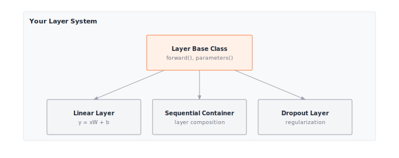

# Module 03: Layers

A layer is a function with weights. Three stacked is an MLP; ninety-six is GPT-3. The interface discipline, every layer exposing the same `forward()` and `parameters()`, is what lets the optimizer find your weights, autograd walk your graph, and a future compiler fuse your kernels.

:::{.callout-note title="Module Info"}

**FOUNDATION TIER** | Difficulty: ●●○○ | Time: 5-7 hours | Prerequisites: 01, 02

**Prerequisites: Modules 01 and 02** means you have built:

- Tensor class with arithmetic, broadcasting, matrix multiplication, and shape manipulation
- Activation functions (ReLU, Sigmoid, Tanh, Softmax) for introducing non-linearity
- Understanding of element-wise operations and reductions

If you can multiply tensors, apply activations, and reason about shape transformations, you're ready.
:::

```{=html}
<div class="action-cards">
<div class="action-card">
<h4>🎧 Audio Overview</h4>
<p>Listen to an AI-generated overview.</p>
<audio controls style="width: 100%; height: 54px;">
<source src="https://github.com/harvard-edge/cs249r_book/releases/download/tinytorch-audio-v0.1.1/03_layers.mp3" type="audio/mpeg">
</audio>
</div>
<div class="action-card">
<h4>🚀 Launch Binder</h4>
<p>Run interactively in your browser.</p>
<a href="https://mybinder.org/v2/gh/harvard-edge/cs249r_book/main?labpath=tinytorch%2Fmodules%2F03_layers%2Flayers.ipynb" class="action-btn btn-orange">Open in Binder →</a>
</div>
<div class="action-card">
<h4>📄 View Source</h4>
<p>Browse the source code on GitHub.</p>
<a href="https://github.com/harvard-edge/cs249r_book/blob/main/tinytorch/src/03_layers/03_layers.py" class="action-btn btn-teal">View on GitHub →</a>
</div>
</div>

<style>
.slide-viewer-container {
  margin: 0.5rem 0 1.5rem 0;
  background: #0f172a;
  border-radius: 1rem;
  overflow: hidden;
  box-shadow: 0 4px 20px rgba(0,0,0,0.15);
}
.slide-header {
  display: flex;
  align-items: center;
  justify-content: space-between;
  padding: 0.6rem 1rem;
  background: rgba(255,255,255,0.03);
}
.slide-title {
  display: flex;
  align-items: center;
  gap: 0.5rem;
  color: #94a3b8;
  font-weight: 500;
  font-size: 0.85rem;
}
.slide-subtitle {
  color: #64748b;
  font-weight: 400;
  font-size: 0.75rem;
}
.slide-toolbar {
  display: flex;
  align-items: center;
  gap: 0.375rem;
}
.slide-toolbar button {
  background: transparent;
  border: none;
  color: #64748b;
  width: 32px;
  height: 32px;
  border-radius: 0.375rem;
  cursor: pointer;
  font-size: 1.1rem;
  transition: all 0.15s;
  display: flex;
  align-items: center;
  justify-content: center;
}
.slide-toolbar button:hover {
  background: rgba(249, 115, 22, 0.15);
  color: #f97316;
}
.slide-nav-group {
  display: flex;
  align-items: center;
}
.slide-page-info {
  color: #64748b;
  font-size: 0.75rem;
  padding: 0 0.5rem;
  font-weight: 500;
}
.slide-zoom-group {
  display: flex;
  align-items: center;
  margin-left: 0.25rem;
  padding-left: 0.5rem;
  border-left: 1px solid rgba(255,255,255,0.1);
}
.slide-canvas-wrapper {
  display: flex;
  justify-content: center;
  align-items: center;
  padding: 0.5rem 1rem 1rem 1rem;
  min-height: 380px;
  background: #0f172a;
}
.slide-canvas {
  max-width: 100%;
  max-height: 350px;
  height: auto;
  border-radius: 0.5rem;
  box-shadow: 0 4px 24px rgba(0,0,0,0.4);
}
.slide-progress-wrapper {
  padding: 0 1rem 0.5rem 1rem;
}
.slide-progress-bar {
  height: 3px;
  background: rgba(255,255,255,0.08);
  border-radius: 1.5px;
  overflow: hidden;
  cursor: pointer;
}
.slide-progress-fill {
  height: 100%;
  background: #f97316;
  border-radius: 1.5px;
  transition: width 0.2s ease;
}
.slide-loading {
  color: #f97316;
  font-size: 0.9rem;
  display: flex;
  align-items: center;
  gap: 0.5rem;
}
.slide-loading::before {
  content: '';
  width: 18px;
  height: 18px;
  border: 2px solid rgba(249, 115, 22, 0.2);
  border-top-color: #f97316;
  border-radius: 50%;
  animation: slide-spin 0.8s linear infinite;
}
@keyframes slide-spin {
  to { transform: rotate(360deg); }
}
.slide-footer {
  display: flex;
  justify-content: center;
  gap: 0.5rem;
  padding: 0.6rem 1rem;
  background: rgba(255,255,255,0.02);
  border-top: 1px solid rgba(255,255,255,0.05);
}
.slide-footer a {
  display: inline-flex;
  align-items: center;
  gap: 0.375rem;
  background: #f97316;
  color: white;
  padding: 0.4rem 0.9rem;
  border-radius: 2rem;
  text-decoration: none;
  font-weight: 500;
  font-size: 0.75rem;
  transition: all 0.15s;
}
.slide-footer a:hover {
  background: #ea580c;
  color: white;
}
.slide-footer a.secondary {
  background: transparent;
  color: #94a3b8;
  border: 1px solid rgba(255,255,255,0.15);
}
.slide-footer a.secondary:hover {
  background: rgba(255,255,255,0.05);
  color: #f8fafc;
}
@media (max-width: 600px) {
  .slide-header { flex-direction: column; gap: 0.5rem; padding: 0.5rem 0.75rem; }
  .slide-toolbar button { width: 28px; height: 28px; }
  .slide-canvas-wrapper { min-height: 260px; padding: 0.5rem; }
  .slide-canvas { max-height: 220px; }
}
</style>

<div class="slide-viewer-container" id="slide-viewer-03_layers">
<div class="slide-header">
<div class="slide-title">
<span>🔥</span>
<span>Slide Deck</span>

<span class="slide-subtitle">· AI-generated</span>
</div>
<div class="slide-toolbar">
<div class="slide-nav-group">
<button onclick="slideNav('03_layers', -1)" title="Previous">‹</button>
<span class="slide-page-info"><span id="slide-num-03_layers">1</span> / <span id="slide-count-03_layers">-</span></span>
<button onclick="slideNav('03_layers', 1)" title="Next">›</button>
</div>
<div class="slide-zoom-group">
<button onclick="slideZoom('03_layers', -0.25)" title="Zoom out">−</button>
<button onclick="slideZoom('03_layers', 0.25)" title="Zoom in">+</button>
</div>
</div>
</div>
<div class="slide-canvas-wrapper">
<div id="slide-loading-03_layers" class="slide-loading">Loading slides...</div>
<canvas id="slide-canvas-03_layers" class="slide-canvas" style="display:none;"></canvas>
</div>
<div class="slide-progress-wrapper">
<div class="slide-progress-bar" onclick="slideProgress('03_layers', event)">
<div class="slide-progress-fill" id="slide-progress-03_layers" style="width: 0%;"></div>
</div>
</div>
<div class="slide-footer">
<a href="../assets/slides/03_layers.pdf" download>⬇ Download</a>
<a href="#" onclick="slideFullscreen('03_layers'); return false;" class="secondary">⛶ Fullscreen</a>
</div>
</div>

<script src="https://cdnjs.cloudflare.com/ajax/libs/pdf.js/3.11.174/pdf.min.js"></script>
<script>
(function() {
  if (window.slideViewersInitialized) return;
  window.slideViewersInitialized = true;

  pdfjsLib.GlobalWorkerOptions.workerSrc = 'https://cdnjs.cloudflare.com/ajax/libs/pdf.js/3.11.174/pdf.worker.min.js';

  window.slideViewers = {};

  window.initSlideViewer = function(id, pdfUrl) {
    const viewer = { pdf: null, page: 1, scale: 1.3, rendering: false, pending: null };
    window.slideViewers[id] = viewer;

    const canvas = document.getElementById('slide-canvas-' + id);
    const ctx = canvas.getContext('2d');

    function render(num) {
      viewer.rendering = true;
      viewer.pdf.getPage(num).then(function(page) {
        const viewport = page.getViewport({scale: viewer.scale});
        canvas.height = viewport.height;
        canvas.width = viewport.width;
        page.render({canvasContext: ctx, viewport: viewport}).promise.then(function() {
          viewer.rendering = false;
          if (viewer.pending !== null) { render(viewer.pending); viewer.pending = null; }
        });
      });
      document.getElementById('slide-num-' + id).textContent = num;
      document.getElementById('slide-progress-' + id).style.width = (num / viewer.pdf.numPages * 100) + '%';
    }

    function queue(num) { if (viewer.rendering) viewer.pending = num; else render(num); }

    pdfjsLib.getDocument(pdfUrl).promise.then(function(pdf) {
      viewer.pdf = pdf;
      document.getElementById('slide-count-' + id).textContent = pdf.numPages;
      document.getElementById('slide-loading-' + id).style.display = 'none';
      canvas.style.display = 'block';
      render(1);
    }).catch(function() {
      document.getElementById('slide-loading-' + id).innerHTML = 'Unable to load. <a href="' + pdfUrl + '" style="color:#f97316;">Download PDF</a>';
    });

    viewer.queue = queue;
  };

  window.slideNav = function(id, dir) {
    const v = window.slideViewers[id];
    if (!v || !v.pdf) return;
    const newPage = v.page + dir;
    if (newPage >= 1 && newPage <= v.pdf.numPages) { v.page = newPage; v.queue(newPage); }
  };

  window.slideZoom = function(id, delta) {
    const v = window.slideViewers[id];
    if (!v) return;
    v.scale = Math.max(0.5, Math.min(3, v.scale + delta));
    v.queue(v.page);
  };

  window.slideProgress = function(id, event) {
    const v = window.slideViewers[id];
    if (!v || !v.pdf) return;
    const bar = event.currentTarget;
    const pct = (event.clientX - bar.getBoundingClientRect().left) / bar.offsetWidth;
    const newPage = Math.max(1, Math.min(v.pdf.numPages, Math.ceil(pct * v.pdf.numPages)));
    if (newPage !== v.page) { v.page = newPage; v.queue(newPage); }
  };

  window.slideFullscreen = function(id) {
    const el = document.getElementById('slide-viewer-' + id);
    if (el.requestFullscreen) el.requestFullscreen();
    else if (el.webkitRequestFullscreen) el.webkitRequestFullscreen();
  };
})();

initSlideViewer('03_layers', '../assets/slides/03_layers.pdf');

</script>

```
## Overview

A layer is a function with weights. Stack three of them and you have a multi-layer perceptron; stack ninety-six and you have GPT-3. The discipline that makes such composition possible — every layer exposing the same `forward()` and `parameters()` interface — is what you build in this module.

You'll implement four pieces: a `Layer` base class that fixes the interface, a `Linear` layer that applies the learned transformation `y = xW + b`, a `Dropout` layer that prevents overfitting by randomly zeroing activations, and a `Sequential` container that chains layers into networks. Together they're the smallest set of abstractions that lets you write `model = Sequential(Linear(784, 256), ReLU(), Linear(256, 10))` and have it just work.

The payoff is `parameters()`. Once every layer hands its weights to a single list, optimizers (Module 07) and autograd (Module 06) can update them without caring what's inside. PyTorch's `nn.Module` follows the exact same contract — you're building the real abstraction, not a toy version of it.

## Learning Objectives

:::{.callout-tip title="By completing this module, you will:"}

- **Implement** Linear layers with proper weight initialization and parameter management for gradient-based training
- **Master** the mathematical operation `y = xW + b` and understand how parameter counts scale with layer dimensions
- **Understand** memory usage patterns (parameter memory vs activation memory) and computational complexity of matrix operations
- **Connect** your implementation to production PyTorch patterns, including `nn.Linear`, `nn.Dropout`, and parameter tracking
:::

## What You'll Build


::: {#fig-03_layers-diag-1 fig-env="figure" fig-pos="htb" fig-cap="**One interface, three subclasses.** Linear, Dropout, and Sequential all inherit `forward()` and `parameters()` from a single `Layer` base — Sequential adds composition by chaining the others into networks." fig-alt="Diagram showing the Layer base class at the top with three subclasses below it: Linear, Sequential, and Dropout."}



:::


**Implementation roadmap:**

| Part | What You'll Implement | Key Concept |
|------|----------------------|-------------|
| 1 | `Layer` base class with `forward()`, `__call__()`, `parameters()` | Consistent interface for all layers |
| 2 | `Linear` layer with proper initialization | Learned transformation `y = xW + b` |
| 3 | `Dropout` with training/inference modes | Regularization through random masking |
| 4 | `Sequential` container for layer composition | Chaining layers together |

: **Implementation roadmap for the Layer, Linear, Dropout, and Sequential classes.** {#tbl-03-layers-implementation-roadmap}

**The pattern you'll enable:**
```python
# Building a multi-layer network
layer1 = Linear(784, 256)
activation = ReLU()
dropout = Dropout(0.5)
layer2 = Linear(256, 10)

# Manual composition for explicit data flow
x = layer1(x)
x = activation(x)
x = dropout(x, training=True)
output = layer2(x)
```

### What You're NOT Building (Yet)

To keep this module focused, you will **not** implement:

- Automatic gradient computation (autograd is a later module)
- Parameter optimization (optimizers are a later module)
- Hundreds of layer types (PyTorch has Conv2d, LSTM, Attention - you'll build Linear and Dropout)
- Automatic training/eval mode switching (PyTorch's `model.train()` - you'll manually pass `training` flag)

**You are building the core building blocks.** Training loops and optimizers come later.

## API Reference

A quick reference for the layer classes you're about to build — keep it open while you implement.

### Layer Base Class

```python
Layer()
```

Base class providing consistent interface for all neural network layers. All layers inherit from this and implement `forward()` and `parameters()`.

| Method | Signature | Description |
|--------|-----------|-------------|
| `forward` | `forward(x) -> Tensor` | Compute layer output (must override) |
| `__call__` | `__call__(x) -> Tensor` | Makes layer callable like a function |
| `parameters` | `parameters() -> List[Tensor]` | Returns list of trainable parameters |

: **Methods defined by the Layer base class.** {#tbl-03-layers-base-class-api}

### Linear Layer

```python
Linear(in_features, out_features, bias=True)
```

Linear (fully connected) layer implementing `y = xW + b`.

**Parameters:**
- `in_features`: Number of input features
- `out_features`: Number of output features
- `bias`: Whether to include bias term (default: True)

**Attributes:**
- `weight`: Tensor of shape `(in_features, out_features)` (gradient tracking enabled later by autograd)
- `bias`: Tensor of shape `(out_features,)` or None (gradient tracking enabled later by autograd)

| Method | Signature | Description |
|--------|-----------|-------------|
| `forward` | `forward(x) -> Tensor` | Applies linear transformation `y = xW + b` |
| `parameters` | `parameters() -> List[Tensor]` | Returns `[weight, bias]` or `[weight]` |

: **Methods on the Linear layer.** {#tbl-03-layers-linear-api}

### Dropout Layer

```python
Dropout(p=0.5)
```

Dropout layer for regularization. During training, randomly zeros elements with probability `p` and scales survivors by `1/(1-p)`. During inference, passes input unchanged.

**Parameters:**
- `p`: Probability of zeroing each element (0.0 = no dropout, 1.0 = zero everything)

| Method | Signature | Description |
|--------|-----------|-------------|
| `forward` | `forward(x, training=True) -> Tensor` | Applies dropout during training, passthrough during inference |
| `parameters` | `parameters() -> List[Tensor]` | Returns empty list (no trainable parameters) |

: **Methods on the Dropout layer.** {#tbl-03-layers-dropout-api}

### Sequential Container

```python
Sequential(*layers)
```

Container that chains layers together sequentially. Provides convenient way to compose multiple layers.

| Method | Signature | Description |
|--------|-----------|-------------|
| `forward` | `forward(x) -> Tensor` | Forward pass through all layers in order |
| `parameters` | `parameters() -> List[Tensor]` | Collects all parameters from all layers |

: **Methods on the Sequential container.** {#tbl-03-layers-sequential-api}

## Core Concepts

Five ideas carry the weight of this module: the linear transformation, weight initialization, parameter tracking, the forward-pass call mechanic, and composition. They apply to every ML framework. TinyTorch is the lab; the concepts are what travel.

### The Linear Transformation

Linear layers implement the mathematical operation `y = xW + b`, where `x` is your input, `W` is a weight matrix you learn, `b` is a bias vector you learn, and `y` is your output. This simple formula is the foundation of neural networks.

Think of the weight matrix as a feature detector. Each column of `W` learns to recognize a particular pattern in the input. When you multiply input `x` by `W`, you're asking: "How much of each learned pattern appears in this input?" The bias `b` shifts the output, providing a baseline independent of the input.

Consider recognizing handwritten digits. A flattened 28×28 image has 784 pixels. A Linear layer transforming 784 features to 10 classes creates a weight matrix of shape `(784, 10)`. Each of the 10 columns learns which combination of those 784 pixels indicates a particular digit. The network discovers these patterns through training.

Here's how your implementation performs this transformation:

```python
def forward(self, x):
    """Forward pass through linear layer."""
    # Linear transformation: y = xW
    output = x.matmul(self.weight)

    # Add bias if present
    if self.bias is not None:
        output = output + self.bias

    return output
```

The elegance is in the simplicity, but beneath that simplicity lies a massive computational engine. This matrix multiplication—formally known as **GEMM** (General Matrix Multiply)—handles all the feature combinations in one operation. Unlike memory-bound activation functions, GEMM has incredibly high **arithmetic intensity** (the ratio of math operations to memory bytes accessed). Because each fetched weight and input is reused multiple times across the multiplication, the processor can spend its time crunching numbers rather than waiting for RAM.

However, realizing this theoretical performance requires moving beyond textbook linear algebra. If we just wrote a naive nested loop for matrix multiplication, the processor would spend most of its time stalling for memory fetches, completely wasting its computational potential. Bridging this gap requires specialized software-hardware co-design.

:::{.callout-note title="Systems Implication: GEMM & Cache Tiling"}
To maximize the benefits of high arithmetic intensity, modern hardware relies on **cache tiling**. Instead of naively multiplying rows and columns (which thrashes the CPU/GPU cache), hardware libraries break the matrices into smaller "tiles" that fit perfectly into ultra-fast L1/L2 caches. The math happens on these tiles at blazing speeds before moving to the next block, ensuring the execution remains compute-bound rather than memory-bound.
:::

After the heavy lifting of GEMM is done, broadcasting efficiently handles adding the bias vector to every sample in the batch. This single `matmul` method essentially powers every linear transformation in modern neural networks.

### Weight Initialization

How you initialize weights determines whether your network can learn at all. Initialize too small and gradients vanish, making learning impossibly slow. Initialize too large and gradients explode, making training unstable. The sweet spot ensures stable gradient flow through the network.

We use LeCun-style initialization, which scales weights by `sqrt(1/in_features)`. This keeps the variance of activations roughly constant as data flows through layers, preventing vanishing or exploding gradients. (True Xavier/Glorot uses `sqrt(2/(fan_in+fan_out))` which also considers output dimensions, but the simpler LeCun formula works well in practice.)

Here's your initialization code:

```python
def __init__(self, in_features, out_features, bias=True):
    """Initialize linear layer with proper weight initialization."""
    self.in_features = in_features
    self.out_features = out_features

    # LeCun-style initialization for stable gradients
    scale = np.sqrt(INIT_SCALE_FACTOR / in_features)
    weight_data = np.random.randn(in_features, out_features) * scale
    self.weight = Tensor(weight_data)

    # Initialize bias to zeros or None
    if bias:
        bias_data = np.zeros(out_features)
        self.bias = Tensor(bias_data)
    else:
        self.bias = None
```

: **Listing 3.1 — Linear layer constructor with LeCun-style weight initialization and zero bias.** {#lst-03-layers-linear-init}

Weights and biases are created as plain Tensors. When autograd is enabled later, it monkey-patches the Tensor class to support `requires_grad`, at which point you can set `layer.weight.requires_grad = True` for parameters that need gradients. Bias starts at zero because the weight initialization already handles the scale, and zero is a neutral starting point for per-class adjustments.

For Linear(1000, 10), the scale is `sqrt(1/1000) ≈ 0.032`. For Linear(10, 1000), the scale is `sqrt(1/10) ≈ 0.316`. Layers with more inputs get smaller initial weights because each input contributes to the output, and you want their combined effect to remain stable.

### Parameter Management

Parameters are tensors that need gradients and optimizer updates. Your Linear layer manages two parameters: weights and biases. The `parameters()` method collects them into a list that optimizers can iterate over.

```python
def parameters(self):
    """Return list of trainable parameters."""
    params = [self.weight]
    if self.bias is not None:
        params.append(self.bias)
    return params
```

This simple method enables powerful workflows. When you build a multi-layer network, you can collect all parameters from all layers and pass them to an optimizer:

```python
layer1 = Linear(784, 256)
layer2 = Linear(256, 10)

all_params = layer1.parameters() + layer2.parameters()
# Pass all_params to optimizer.step() during training
```

Each Linear layer independently manages its own parameters. The Sequential container extends this pattern by collecting parameters from all its contained layers, enabling hierarchical composition.

### Forward Pass Mechanics

The forward pass transforms input data through the layer's computation. Every layer implements `forward()`, and the base class provides `__call__()` to make layers callable like functions. This matches PyTorch's design exactly.

```python
def __call__(self, x, *args, **kwargs):
    """Allow layer to be called like a function."""
    return self.forward(x, *args, **kwargs)
```

This lets you write `output = layer(input)` instead of `output = layer.forward(input)`. The difference looks cosmetic, but `__call__` is the seam where a real framework slips in hooks, logging, profiling, or training/eval mode switching — none of which `forward()` has to know about.

For Dropout, the forward pass depends on whether you're training or performing inference:

```python
def forward(self, x, training=True):
    """Forward pass through dropout layer."""
    if not training or self.p == DROPOUT_MIN_PROB:
        # During inference or no dropout, pass through unchanged
        return x

    if self.p == DROPOUT_MAX_PROB:
        # Drop everything (preserve requires_grad for gradient flow)
        return Tensor(np.zeros_like(x.data), requires_grad=x.requires_grad)

    # During training, apply dropout
    keep_prob = 1.0 - self.p

    # Create random mask: True where we keep elements
    mask = np.random.random(x.data.shape) < keep_prob

    # Apply mask and scale using Tensor operations to preserve gradients
    mask_tensor = Tensor(mask.astype(np.float32), requires_grad=False)
    scale = Tensor(np.array(1.0 / keep_prob), requires_grad=False)

    # Use Tensor operations: x * mask * scale
    output = x * mask_tensor * scale
    return output
```

: **Listing 3.2 — Dropout forward pass with inverted scaling `1/(1-p)` to preserve expected magnitude.** {#lst-03-layers-dropout-forward}

The key insight is the scaling factor `1/(1-p)`. If you drop 50% of neurons, the survivors need to be scaled by 2.0 to maintain the same expected value. This ensures that during inference (when no dropout is applied), the output magnitudes match training expectations.

### Layer Composition

Neural networks are built by chaining layers together. Data flows through each layer in sequence, with each transformation building on the previous one. Your Sequential container captures this pattern:

```python
class Sequential:
    """Container that chains layers together sequentially."""

    def __init__(self, *layers):
        """Initialize with layers to chain together."""
        if len(layers) == 1 and isinstance(layers[0], (list, tuple)):
            self.layers = list(layers[0])
        else:
            self.layers = list(layers)

    def forward(self, x):
        """Forward pass through all layers sequentially."""
        for layer in self.layers:
            x = layer.forward(x)
        return x

    def parameters(self):
        """Collect all parameters from all layers."""
        params = []
        for layer in self.layers:
            params.extend(layer.parameters())
        return params
```

: **Listing 3.3 — Sequential container chaining forward passes and flattening per-layer parameters.** {#lst-03-layers-sequential}

Twelve lines of container code unlock the full vocabulary of network design. A 3-layer classifier is just three Linear layers with activations and dropout between them:

```python
model = Sequential(
    Linear(784, 256), ReLU(), Dropout(0.5),
    Linear(256, 128), ReLU(), Dropout(0.3),
    Linear(128, 10)
)
```

`forward()` chains the computations; `parameters()` flattens the per-layer lists into one. That's the entire mechanism — every model in this book, from a perceptron to a transformer, reduces to those two methods on a container.

### Memory and Computational Complexity

Memory and FLOPs aren't optional reading — they're how you predict whether a model fits in RAM and whether a forward pass takes a millisecond or a minute. Linear layers dominate both for any fully connected architecture.

Parameter memory for a Linear layer is straightforward: `in_features × out_features × 4 bytes` for weights, plus `out_features × 4 bytes` for bias (assuming float32). For `Linear(784, 256)`:

```text
Weights: 784 × 256 × 4 = 802,816 bytes ≈ 784 KB
Bias:    256 × 4       =   1,024 bytes ≈   1 KB
Total:                  ≈ 785 KB
```

Activation memory depends on batch size. For batch size 32 and the same layer:

```text
Input:   32 × 784 × 4 = 100,352 bytes ≈ 98 KB
Output:  32 × 256 × 4 =  32,768 bytes ≈ 32 KB
```

The computational cost of the forward pass is dominated by matrix multiplication. For input shape `(batch, in_features)` and weight shape `(in_features, out_features)`, the operation requires `batch × in_features × out_features` multiplications and the same number of additions. Bias addition is just `batch × out_features` additions, negligible compared to matrix multiplication.

| Operation | Complexity | Memory |
|-----------|------------|--------|
| Linear forward | O(batch × in × out) | O(batch × (in + out)) activations |
| Dropout forward | O(batch × features) | O(batch × features) mask |
| Parameter storage | O(in × out) | O(in × out) weights |

: **Compute and memory cost of Linear and Dropout forward passes.** {#tbl-03-layers-forward-complexity}

For a 3-layer network (784→256→128→10) with batch size 32:

```text
Layer 1: 32 × 784 × 256 = 6,422,528 FLOPs
Layer 2: 32 × 256 × 128 = 1,048,576 FLOPs
Layer 3: 32 × 128 ×  10 =    40,960 FLOPs
Total:                  ≈ 7.5 million FLOPs per forward pass
```

The first layer dominates because it has the largest input dimension. Production networks often shrink dimensions early to save computation in deeper layers.

## Common Errors

These are the errors you'll encounter most often when working with layers. Understanding why they happen will save you hours of debugging, both in this module and throughout your ML career.

### Shape Mismatch in Layer Composition

**Error**: `ValueError: Cannot perform matrix multiplication: (32, 128) @ (256, 10). Inner dimensions must match: 128 ≠ 256`

This happens when you chain layers with incompatible dimensions. If `layer1` outputs 128 features but `layer2` expects 256 input features, the matrix multiplication in `layer2` fails.

**Fix**: Ensure output features of one layer match input features of the next:

```python
layer1 = Linear(784, 128)  # Outputs 128 features
layer2 = Linear(128, 10)   # Expects 128 input features ✓
```

### Dropout in Inference Mode

**Error**: Test accuracy is much lower than training accuracy, but loss curves suggest good learning

**Cause**: You're applying dropout during inference. Dropout should only zero elements during training. During inference, all neurons must be active.

**Fix**: Always pass `training=False` during evaluation:

```python
# Training
output = dropout(x, training=True)

# Evaluation
output = dropout(x, training=False)
```

### Missing Parameters

**Error**: Optimizer has no parameters to update, or parameter count is wrong

**Cause**: Your `parameters()` method doesn't return all trainable tensors, or you forgot to set `requires_grad=True`.

**Fix**: Verify all tensors with `requires_grad=True` are returned:

```python
def parameters(self):
    params = [self.weight]
    if self.bias is not None:
        params.append(self.bias)
    return params  # Must include all trainable tensors
```

### Initialization Scale

**Error**: Loss becomes NaN within a few iterations, or gradients vanish immediately

**Cause**: Weights initialized too large (exploding gradients) or too small (vanishing gradients).

**Fix**: Use proper initialization scaling:

```python
scale = np.sqrt(1.0 / in_features)  # LeCun-style, not just random()!
weight_data = np.random.randn(in_features, out_features) * scale
```

## Production Context

### Your Implementation vs. PyTorch

Your TinyTorch layers and PyTorch's `nn.Linear` and `nn.Dropout` share the same conceptual design. The differences are in implementation details: PyTorch uses C++ for speed, supports GPU acceleration, and provides hundreds of specialized layer types. But the core abstractions are identical.

| Feature | Your Implementation | PyTorch |
|---------|---------------------|---------|
| **Backend** | NumPy (Python) | C++/CUDA |
| **Initialization** | LeCun-style manual | Multiple schemes (`init.xavier_uniform_`, `init.kaiming_normal_`) |
| **Parameter Management** | Manual `parameters()` list | `nn.Module` base class with auto-registration |
| **Training Mode** | Manual `training` flag | `model.train()` / `model.eval()` state |
| **Layer Types** | Linear, Dropout | 100+ layer types (Conv, LSTM, Attention, etc.) |
| **GPU Support** | ✗ CPU only | ✓ CUDA, Metal, ROCm |

: **Feature comparison between TinyTorch layers and PyTorch's nn module.** {#tbl-03-layers-vs-pytorch}

### Code Comparison

The following comparison shows equivalent layer operations in TinyTorch and PyTorch. Notice how closely the APIs mirror each other.

::: {.panel-tabset}
## Your TinyTorch
```python
from tinytorch.core.layers import Linear, Dropout, Sequential
from tinytorch.core.activations import ReLU

# Build layers
layer1 = Linear(784, 256)
activation = ReLU()
dropout = Dropout(0.5)
layer2 = Linear(256, 10)

# Manual composition
x = layer1(x)
x = activation(x)
x = dropout(x, training=True)
output = layer2(x)

# Or use Sequential
model = Sequential(
    Linear(784, 256), ReLU(), Dropout(0.5),
    Linear(256, 10)
)
output = model(x)

# Collect parameters
params = model.parameters()
```

## PyTorch
```python
import torch
import torch.nn as nn

# Build layers
layer1 = nn.Linear(784, 256)
activation = nn.ReLU()
dropout = nn.Dropout(0.5)
layer2 = nn.Linear(256, 10)

# Manual composition
x = layer1(x)
x = activation(x)
x = dropout(x)  # Automatically uses model.training state
output = layer2(x)

# Or use Sequential
model = nn.Sequential(
    nn.Linear(784, 256), nn.ReLU(), nn.Dropout(0.5),
    nn.Linear(256, 10)
)
output = model(x)

# Collect parameters
params = list(model.parameters())
```
:::

Let's walk through each difference:

- **Line 1-2 (Import)**: Both frameworks provide layers in a dedicated module. TinyTorch uses `tinytorch.core.layers`; PyTorch uses `torch.nn`.
- **Line 4-7 (Layer Creation)**: Identical API. Both use `Linear(in_features, out_features)` and `Dropout(p)`.
- **Line 9-13 (Manual Composition)**: TinyTorch requires explicit `training=True` flag for Dropout; PyTorch uses global model state (`model.train()`).
- **Line 15-19 (Sequential)**: Identical pattern for composing layers into a container.
- **Line 22 (Parameters)**: Both use `.parameters()` method to collect all trainable tensors. PyTorch returns a generator; TinyTorch returns a list.

:::{.callout-tip title="What's Identical"}

Layer initialization API, forward pass mechanics, and parameter collection patterns. When you debug PyTorch shape errors or parameter counts, you'll understand exactly what's happening because you built the same abstractions.
:::

### Why Layers Matter at Scale

To appreciate why layer design matters, consider the scale of modern ML systems:

- **GPT-3**: 175 billion parameters across 96 Linear layers (each layer transforming 12,288 features) = **350 GB** of parameter memory
- **ResNet-50**: 25.5 million parameters with 50 convolutional and linear layers = **100 MB** of parameter memory
- **BERT-Base**: 110 million parameters with 12 transformer blocks (each containing multiple Linear layers) = **440 MB** of parameter memory

Every Linear layer in these architectures runs the same `y = xW + b` you just wrote. Parameter counts, memory scaling, and initialization aren't academic concerns — they're the first three things an engineer profiles when a model won't fit, won't converge, or won't run fast enough. When GPT-3 misbehaves, the people fixing it are debugging the same abstractions you built today.

## Check Your Understanding

:::{.callout-tip title="Check Your Understanding — Layers"}
Before moving on, verify you can articulate each of the following:

- [ ] Why parameter count for `Linear(in, out)` is `in*out + out` and how this scales linearly when you double `out_features`.
- [ ] Why all-zero (or any constant) initialization freezes training, and how LeCun-style `sqrt(1/in_features)` scaling breaks symmetry while keeping variance stable.
- [ ] Why Dropout scales surviving activations by `1/(1-p)` during training — and what goes wrong at inference time if you forget the scale.
- [ ] Why Linear's `matmul` is compute-bound (high arithmetic intensity) while Dropout and bias-add are memory-bound, and what that implies for which operation BLAS-style tiling targets.
- [ ] The role of the `parameters()` contract: why a two-method base class (forward + parameters) is enough for optimizers and autograd to treat any layer uniformly.

If any of these feels fuzzy, revisit Core Concepts (The Linear Transformation, Weight Initialization, Parameter Management, Memory and Computational Complexity) before moving on.
:::

The collapsible Q&A below works through each of these quantitatively.

**Q1: Parameter Scaling**

A Linear layer has `in_features=784` and `out_features=256`. How many parameters does it have? If you double `out_features` to 512, how many parameters now?

:::{.callout-tip collapse="true" title="Answer"}

**Original**: 784 × 256 + 256 = 200,960 parameters

**Doubled**: 784 × 512 + 512 = 401,920 parameters

Doubling `out_features` roughly doubles the parameter count because weights dominate (200,704 vs 401,408 for weights alone). Parameter count scales linearly with layer width.

**Memory**: 200,960 × 4 = 803,840 bytes ≈ 785 KB (original) vs 401,920 × 4 = 1,607,680 bytes ≈ 1.53 MB (doubled).
:::

**Q2: Multi-layer Memory**

A 3-layer network has architecture 784→256→128→10. Calculate total parameter count and memory usage (assume float32).

:::{.callout-tip collapse="true" title="Answer"}

**Layer 1**: 784 × 256 + 256 = 200,960 parameters
**Layer 2**: 256 × 128 + 128 = 32,896 parameters
**Layer 3**: 128 × 10 + 10 = 1,290 parameters

**Total**: 235,146 parameters

**Memory**: 235,146 × 4 = 940,584 bytes ≈ 919 KB

That's parameter memory only. Add activation memory for batch processing: at batch size 32, you also hold intermediate tensors at each layer (32×784, 32×256, 32×128, 32×10 ≈ 147 KB more).
:::

**Q3: Dropout Scaling**

Why do we scale surviving values by `1/(1-p)` during training? What happens if we don't scale?

:::{.callout-tip collapse="true" title="Answer"}

**With scaling**: Expected value of output matches input. If `p=0.5`, half the neurons survive and are scaled by 2.0, so `E[output] = 0.5 × 0 + 0.5 × 2x = x`.

**Without scaling**: Expected value is halved. `E[output] = 0.5 × 0 + 0.5 × x = 0.5x`. During inference (no dropout), output would be `x`, creating a mismatch.

**Result**: Network sees different magnitude activations during training vs inference, leading to poor test performance. Scaling ensures consistent magnitudes.
:::

**Q4: Computational Bottleneck**

For a Linear layer's forward pass `y = xW + b`, which operation dominates: matrix multiply or bias addition?

:::{.callout-tip collapse="true" title="Answer"}

**Matrix multiply**: O(batch × in_features × out_features) operations
**Bias addition**: O(batch × out_features) operations

For `Linear(784, 256)` with batch size 32:

- **Matmul**: 32 × 784 × 256 = 6,422,528 operations
- **Bias**: 32 × 256 = 8,192 operations

Matrix multiply dominates by ~784×. That ratio is why every serious framework leans on optimized BLAS kernels (MKL, OpenBLAS) on CPU and cuBLAS on GPU — speeding up matmul speeds up the whole network.
:::

**Q5: Initialization Impact**

What happens if you initialize all weights to zero? To the same non-zero value?

:::{.callout-tip collapse="true" title="Answer"}

**All zeros**: Network can't learn. All neurons compute identical outputs, receive identical gradients, and update identically. Symmetry is never broken. Training is stuck.

**Same non-zero value (e.g., all 1s)**: Same problem - symmetry. All neurons remain identical throughout training. You need randomness to break symmetry.

**Proper initialization**: Random values scaled by `sqrt(1/in_features)` break symmetry AND maintain stable gradient variance. This is why proper initialization is essential for learning.
:::

**Q6: Batch Size vs Throughput**

From your timing analysis, batch size 32 processes 10,000 samples/sec, while batch size 1 processes 800 samples/sec. Why is batching faster?

:::{.callout-tip collapse="true" title="Answer"}

**Overhead amortization**: Setting up matrix operations has fixed cost per call. With batch=1, you pay this cost for every sample. With batch=32, you pay once for 32 samples.

**Vectorization**: Modern CPUs/GPUs process vectors efficiently. Matrix operations on larger matrices utilize SIMD instructions and better cache locality.

**Throughput calculation**:
- Batch=1: 800 samples/sec means each forward pass takes ~1.25ms
- Batch=32: 10,000 samples/sec means each forward pass takes ~3.2ms for 32 samples = 0.1ms per sample

Batching achieves 12.5x better per-sample performance by better utilizing hardware.

**Trade-off**: Larger batches increase latency (time to process one sample) but dramatically improve throughput (samples processed per second).
:::

## Key Takeaways

- **A layer is a function with weights, plus a parameter list:** the minimal contract — `forward(x)` and `parameters()` — is all autograd and optimizers ever need from any layer, from `Linear` to transformer blocks.
- **`y = xW + b` is the workhorse:** Linear layers dominate both parameter count and FLOPs in fully-connected stacks; every scaling law ultimately argues about how many `Linear` multiplies fit on the hardware.
- **Initialization is not a detail:** LeCun-style `sqrt(1/fan_in)` scaling keeps activation variance roughly constant through depth. Zero or uniform init freezes symmetry and blocks learning outright.
- **Dropout's inverted scaling preserves expected magnitude:** dividing survivors by `1-p` keeps train-time and inference-time activation scales aligned — skip the scaling and your model tests far worse than it trains.
- **`Sequential` is twelve lines but unlocks the whole zoo:** chaining `forward()` and flattening per-layer `parameters()` is the entire mechanism behind every model architecture in this book.

**Coming next:** Module 04 adds the loss functions — `MSELoss`, `CrossEntropyLoss`, `BinaryCrossEntropyLoss` — that turn your predictions and targets into the scalar signal autograd will backpropagate into these parameters.

## Further Reading

The design of modern neural network layers represents a delicate balance between mathematical theory and hardware reality. From breaking symmetries during initialization to regularizing massive parameter spaces, the following papers document the critical breakthroughs that made deep learning architectures scalable and stable.

### Seminal Papers

- **Understanding the difficulty of training deep feedforward neural networks** - Glorot and Bengio (2010). Introduces Xavier/Glorot initialization and analyzes why proper weight scaling matters for gradient flow. The foundation for modern initialization schemes. [PMLR](http://proceedings.mlr.press/v9/glorot10a.html)

- **Delving Deep into Rectifiers: Surpassing Human-Level Performance on ImageNet Classification** - He et al. (2015). Introduces He initialization tailored for ReLU activations. Shows how initialization schemes must match activation functions for optimal training. **Systems Implication:** Proper initialization prevented vanishing gradients in very deep networks like ResNet, allowing models to scale to hundreds of layers and fully utilize the compute capacity of modern accelerators. [arXiv:1502.01852](https://arxiv.org/abs/1502.01852)

- **Dropout: A Simple Way to Prevent Neural Networks from Overfitting** - Srivastava et al. (2014). The original dropout paper demonstrating how random neuron dropping prevents overfitting. Includes theoretical analysis and extensive empirical validation. [JMLR](https://jmlr.org/papers/v15/srivastava14a.html)

### Additional Resources

- **Textbook**: ["Deep Learning"](https://www.deeplearningbook.org/) by Goodfellow, Bengio, and Courville - Chapter 6 covers feedforward networks and linear layers in detail
- **Documentation**: [PyTorch nn.Linear](https://pytorch.org/docs/stable/generated/torch.nn.Linear.html) - See how production frameworks implement the same concepts
- **Blog Post**: ["A Recipe for Training Neural Networks"](https://karpathy.github.io/2019/04/25/recipe/) by Andrej Karpathy - Practical advice on initialization, architecture design, and debugging

## What's Next

:::{.callout-note title="Coming Up: Module 04 — Losses"}

Your layers can produce predictions, but you have no way to say *how wrong* a prediction is. Module 04 introduces loss functions — `MSELoss` for regression, `CrossEntropyLoss` for classification — that turn a prediction and a target into a single scalar. That scalar becomes the signal autograd (Module 06) backpropagates, which optimizers (Module 07) then apply to the very `parameters()` you collected here.
:::

**Preview — how your layers plug into the next modules:**

| Module | What It Does | Your Layers In Action |
|--------|--------------|----------------------|
| **04: Losses** | Quantify prediction error | `loss = CrossEntropyLoss()(model(x), y)` |
| **06: Autograd** | Backpropagate through the stack | `loss.backward()` fills `layer.weight.grad` |
| **07: Optimizers** | Update parameters from gradients | `optimizer.step()` consumes `model.parameters()` |

: **How the Layer abstractions feed into later training modules.** {#tbl-03-layers-downstream-usage}

## Get Started

:::{.callout-tip title="Interactive Options"}

- **[Launch Binder](https://mybinder.org/v2/gh/harvard-edge/cs249r_book/main?urlpath=lab/tree/tinytorch/modules/03_layers/layers.ipynb)** - Run interactively in browser, no setup required
- **[View Source](https://github.com/harvard-edge/cs249r_book/blob/main/tinytorch/src/03_layers/03_layers.py)** - Browse the implementation code
:::

:::{.callout-warning title="Save Your Progress"}

Binder sessions are temporary. Download your completed notebook when done, or clone the repository for persistent local work.
:::
