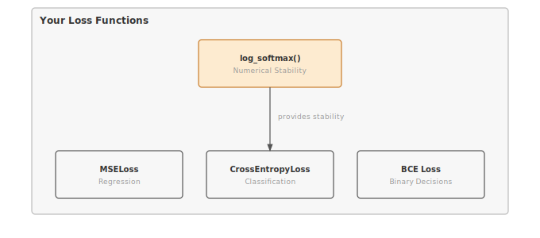

# Module 04: Losses

:::{.callout-note title="Module Info"}

**FOUNDATION TIER** | Difficulty: ●●○○ | Time: 4-6 hours | Prerequisites: 01, 02, 03

**Prerequisites:** Modules 01 (Tensor), 02 (Activations), and 03 (Layers) must be completed. This module assumes you understand:

- Tensor operations and broadcasting (Module 01)
- Activation functions and their role in neural networks (Module 02)
- Layers and how they transform data (Module 03)

If you can build a simple neural network that takes input and produces output, you're ready to learn how to measure its quality.
:::

```{=html}
<div class="action-cards">
<div class="action-card">
<h4>🎧 Audio Overview</h4>
<p>Listen to an AI-generated overview.</p>
<audio controls style="width: 100%; height: 54px;">
<source src="https://github.com/harvard-edge/cs249r_book/releases/download/tinytorch-audio-v0.1.1/04_losses.mp3" type="audio/mpeg">
</audio>
</div>
<div class="action-card">
<h4>🚀 Launch Binder</h4>
<p>Run interactively in your browser.</p>
<a href="https://mybinder.org/v2/gh/harvard-edge/cs249r_book/main?labpath=tinytorch%2Fmodules%2F04_losses%2Flosses.ipynb" class="action-btn btn-orange">Open in Binder →</a>
</div>
<div class="action-card">
<h4>📄 View Source</h4>
<p>Browse the source code on GitHub.</p>
<a href="https://github.com/harvard-edge/cs249r_book/blob/main/tinytorch/src/04_losses/04_losses.py" class="action-btn btn-teal">View on GitHub →</a>
</div>
</div>

<style>
.slide-viewer-container {
  margin: 0.5rem 0 1.5rem 0;
  background: #0f172a;
  border-radius: 1rem;
  overflow: hidden;
  box-shadow: 0 4px 20px rgba(0,0,0,0.15);
}
.slide-header {
  display: flex;
  align-items: center;
  justify-content: space-between;
  padding: 0.6rem 1rem;
  background: rgba(255,255,255,0.03);
}
.slide-title {
  display: flex;
  align-items: center;
  gap: 0.5rem;
  color: #94a3b8;
  font-weight: 500;
  font-size: 0.85rem;
}
.slide-subtitle {
  color: #64748b;
  font-weight: 400;
  font-size: 0.75rem;
}
.slide-toolbar {
  display: flex;
  align-items: center;
  gap: 0.375rem;
}
.slide-toolbar button {
  background: transparent;
  border: none;
  color: #64748b;
  width: 32px;
  height: 32px;
  border-radius: 0.375rem;
  cursor: pointer;
  font-size: 1.1rem;
  transition: all 0.15s;
  display: flex;
  align-items: center;
  justify-content: center;
}
.slide-toolbar button:hover {
  background: rgba(249, 115, 22, 0.15);
  color: #f97316;
}
.slide-nav-group {
  display: flex;
  align-items: center;
}
.slide-page-info {
  color: #64748b;
  font-size: 0.75rem;
  padding: 0 0.5rem;
  font-weight: 500;
}
.slide-zoom-group {
  display: flex;
  align-items: center;
  margin-left: 0.25rem;
  padding-left: 0.5rem;
  border-left: 1px solid rgba(255,255,255,0.1);
}
.slide-canvas-wrapper {
  display: flex;
  justify-content: center;
  align-items: center;
  padding: 0.5rem 1rem 1rem 1rem;
  min-height: 380px;
  background: #0f172a;
}
.slide-canvas {
  max-width: 100%;
  max-height: 350px;
  height: auto;
  border-radius: 0.5rem;
  box-shadow: 0 4px 24px rgba(0,0,0,0.4);
}
.slide-progress-wrapper {
  padding: 0 1rem 0.5rem 1rem;
}
.slide-progress-bar {
  height: 3px;
  background: rgba(255,255,255,0.08);
  border-radius: 1.5px;
  overflow: hidden;
  cursor: pointer;
}
.slide-progress-fill {
  height: 100%;
  background: #f97316;
  border-radius: 1.5px;
  transition: width 0.2s ease;
}
.slide-loading {
  color: #f97316;
  font-size: 0.9rem;
  display: flex;
  align-items: center;
  gap: 0.5rem;
}
.slide-loading::before {
  content: '';
  width: 18px;
  height: 18px;
  border: 2px solid rgba(249, 115, 22, 0.2);
  border-top-color: #f97316;
  border-radius: 50%;
  animation: slide-spin 0.8s linear infinite;
}
@keyframes slide-spin {
  to { transform: rotate(360deg); }
}
.slide-footer {
  display: flex;
  justify-content: center;
  gap: 0.5rem;
  padding: 0.6rem 1rem;
  background: rgba(255,255,255,0.02);
  border-top: 1px solid rgba(255,255,255,0.05);
}
.slide-footer a {
  display: inline-flex;
  align-items: center;
  gap: 0.375rem;
  background: #f97316;
  color: white;
  padding: 0.4rem 0.9rem;
  border-radius: 2rem;
  text-decoration: none;
  font-weight: 500;
  font-size: 0.75rem;
  transition: all 0.15s;
}
.slide-footer a:hover {
  background: #ea580c;
  color: white;
}
.slide-footer a.secondary {
  background: transparent;
  color: #94a3b8;
  border: 1px solid rgba(255,255,255,0.15);
}
.slide-footer a.secondary:hover {
  background: rgba(255,255,255,0.05);
  color: #f8fafc;
}
@media (max-width: 600px) {
  .slide-header { flex-direction: column; gap: 0.5rem; padding: 0.5rem 0.75rem; }
  .slide-toolbar button { width: 28px; height: 28px; }
  .slide-canvas-wrapper { min-height: 260px; padding: 0.5rem; }
  .slide-canvas { max-height: 220px; }
}
</style>

<div class="slide-viewer-container" id="slide-viewer-04_losses">
<div class="slide-header">
<div class="slide-title">
<span>🔥</span>
<span>Slide Deck</span>

<span class="slide-subtitle">· AI-generated</span>
</div>
<div class="slide-toolbar">
<div class="slide-nav-group">
<button onclick="slideNav('04_losses', -1)" title="Previous">‹</button>
<span class="slide-page-info"><span id="slide-num-04_losses">1</span> / <span id="slide-count-04_losses">-</span></span>
<button onclick="slideNav('04_losses', 1)" title="Next">›</button>
</div>
<div class="slide-zoom-group">
<button onclick="slideZoom('04_losses', -0.25)" title="Zoom out">−</button>
<button onclick="slideZoom('04_losses', 0.25)" title="Zoom in">+</button>
</div>
</div>
</div>
<div class="slide-canvas-wrapper">
<div id="slide-loading-04_losses" class="slide-loading">Loading slides...</div>
<canvas id="slide-canvas-04_losses" class="slide-canvas" style="display:none;"></canvas>
</div>
<div class="slide-progress-wrapper">
<div class="slide-progress-bar" onclick="slideProgress('04_losses', event)">
<div class="slide-progress-fill" id="slide-progress-04_losses" style="width: 0%;"></div>
</div>
</div>
<div class="slide-footer">
<a href="../assets/slides/04_losses.pdf" download>⬇ Download</a>
<a href="#" onclick="slideFullscreen('04_losses'); return false;" class="secondary">⛶ Fullscreen</a>
</div>
</div>

<script src="https://cdnjs.cloudflare.com/ajax/libs/pdf.js/3.11.174/pdf.min.js"></script>
<script>
(function() {
  if (window.slideViewersInitialized) return;
  window.slideViewersInitialized = true;

  pdfjsLib.GlobalWorkerOptions.workerSrc = 'https://cdnjs.cloudflare.com/ajax/libs/pdf.js/3.11.174/pdf.worker.min.js';

  window.slideViewers = {};

  window.initSlideViewer = function(id, pdfUrl) {
    const viewer = { pdf: null, page: 1, scale: 1.3, rendering: false, pending: null };
    window.slideViewers[id] = viewer;

    const canvas = document.getElementById('slide-canvas-' + id);
    const ctx = canvas.getContext('2d');

    function render(num) {
      viewer.rendering = true;
      viewer.pdf.getPage(num).then(function(page) {
        const viewport = page.getViewport({scale: viewer.scale});
        canvas.height = viewport.height;
        canvas.width = viewport.width;
        page.render({canvasContext: ctx, viewport: viewport}).promise.then(function() {
          viewer.rendering = false;
          if (viewer.pending !== null) { render(viewer.pending); viewer.pending = null; }
        });
      });
      document.getElementById('slide-num-' + id).textContent = num;
      document.getElementById('slide-progress-' + id).style.width = (num / viewer.pdf.numPages * 100) + '%';
    }

    function queue(num) { if (viewer.rendering) viewer.pending = num; else render(num); }

    pdfjsLib.getDocument(pdfUrl).promise.then(function(pdf) {
      viewer.pdf = pdf;
      document.getElementById('slide-count-' + id).textContent = pdf.numPages;
      document.getElementById('slide-loading-' + id).style.display = 'none';
      canvas.style.display = 'block';
      render(1);
    }).catch(function() {
      document.getElementById('slide-loading-' + id).innerHTML = 'Unable to load. <a href="' + pdfUrl + '" style="color:#f97316;">Download PDF</a>';
    });

    viewer.queue = queue;
  };

  window.slideNav = function(id, dir) {
    const v = window.slideViewers[id];
    if (!v || !v.pdf) return;
    const newPage = v.page + dir;
    if (newPage >= 1 && newPage <= v.pdf.numPages) { v.page = newPage; v.queue(newPage); }
  };

  window.slideZoom = function(id, delta) {
    const v = window.slideViewers[id];
    if (!v) return;
    v.scale = Math.max(0.5, Math.min(3, v.scale + delta));
    v.queue(v.page);
  };

  window.slideProgress = function(id, event) {
    const v = window.slideViewers[id];
    if (!v || !v.pdf) return;
    const bar = event.currentTarget;
    const pct = (event.clientX - bar.getBoundingClientRect().left) / bar.offsetWidth;
    const newPage = Math.max(1, Math.min(v.pdf.numPages, Math.ceil(pct * v.pdf.numPages)));
    if (newPage !== v.page) { v.page = newPage; v.queue(newPage); }
  };

  window.slideFullscreen = function(id) {
    const el = document.getElementById('slide-viewer-' + id);
    if (el.requestFullscreen) el.requestFullscreen();
    else if (el.webkitRequestFullscreen) el.webkitRequestFullscreen();
  };
})();

initSlideViewer('04_losses', '../assets/slides/04_losses.pdf');

</script>

```
## Overview

A neural network without a loss function is a guess machine. The loss is the single scalar that tells optimization which direction to move — turning a forward pass into a learning step. Get it wrong and training stalls, diverges, or silently optimizes the wrong objective.

In this module you'll implement three losses that cover most supervised learning: **Mean Squared Error** for regression, **CrossEntropy** for multi-class classification, and **Binary Cross-Entropy** for multi-label or binary decisions. Along the way you'll implement the log-sum-exp trick — the one numerical safeguard that separates a softmax that trains from one that returns `nan` on the first batch with large logits.

By the end, you'll know not just *how* to compute each loss, but *why* the choice of loss reshapes what your model learns, and where naive implementations break at production scale.

## Learning Objectives

:::{.callout-tip title="By completing this module, you will:"}

- **Implement** MSELoss for regression, CrossEntropyLoss for multi-class classification, and BinaryCrossEntropyLoss for binary decisions
- **Master** the log-sum-exp trick for numerically stable softmax computation
- **Understand** computational complexity (O(B×C) for cross-entropy with large vocabularies) and memory trade-offs
- **Analyze** loss function behavior across different prediction patterns and confidence levels
- **Connect** your implementation to production PyTorch patterns and engineering decisions at scale
:::

## What You'll Build


::: {#fig-04_losses-diag-1 fig-env="figure" fig-pos="htb" fig-cap="**TinyTorch Loss Functions**: MSE for regression, and Cross-Entropy for classification tasks." fig-alt="Diagram showing log_softmax providing stability for CrossEntropyLoss, along with MSE and BCE losses."}



:::


**Implementation roadmap:**

| Step | What You'll Implement | Key Concept |
|------|----------------------|-------------|
| 1 | `log_softmax()` | Log-sum-exp trick for numerical stability |
| 2 | `MSELoss.forward()` | Mean squared error for continuous predictions |
| 3 | `CrossEntropyLoss.forward()` | Negative log-likelihood for multi-class classification |
| 4 | `BinaryCrossEntropyLoss.forward()` | Cross-entropy specialized for binary decisions |

**The pattern you'll enable:**
```python
# Measuring prediction quality
loss = criterion(predictions, targets)  # Scalar feedback signal for learning
```

### What You're NOT Building (Yet)

To keep this module focused, you will **not** implement:

- Gradient computation (automatic differentiation is a later module)
- Advanced loss variants (Focal Loss, Label Smoothing, Huber Loss)
- Hierarchical or sampled softmax for large vocabularies (PyTorch optimization)
- Custom reduction strategies beyond mean

**You are building the core feedback signal.** Gradient-based learning comes next.

## API Reference

This section provides a quick reference for the loss functions you'll build. Use it as your cheat sheet while implementing and debugging.

### Helper Functions

```python
log_softmax(x: Tensor, dim: int = -1) -> Tensor
```

Computes numerically stable log-softmax using the log-sum-exp trick. This is the foundation for cross-entropy loss.

**Parameters:**
- `x` (Tensor): Input tensor containing logits (raw model outputs, unbounded values)
- `dim` (int): Dimension along which to compute log-softmax (default: -1, last dimension)

**Returns:** Tensor with same shape as input, containing log-probabilities

**Note:** Logits are raw, unbounded scores from your model before any activation function. CrossEntropyLoss expects logits, not probabilities.

### Loss Functions

All loss functions follow the same pattern:

| Loss Function | Constructor | Forward Signature | Use Case |
|--------------|-------------|-------------------|----------|
| `MSELoss` | `MSELoss()` | `forward(predictions: Tensor, targets: Tensor) -> Tensor` | Regression |
| `CrossEntropyLoss` | `CrossEntropyLoss()` | `forward(logits: Tensor, targets: Tensor) -> Tensor` | Multi-class classification |
| `BinaryCrossEntropyLoss` | `BinaryCrossEntropyLoss()` | `forward(predictions: Tensor, targets: Tensor) -> Tensor` | Binary classification |

**Common Pattern:**
```python
loss_fn = MSELoss()
loss = loss_fn(predictions, targets)  # __call__ delegates to forward()
```

### Input/Output Shapes

Understanding input shapes is crucial for correct loss computation:

| Loss | Predictions Shape | Targets Shape | Output Shape |
|------|------------------|---------------|--------------|
| MSE | `(N,)` or `(N, D)` | Same as predictions | `()` scalar |
| CrossEntropy | `(N, C)` logits¹ | `(N,)` class indices² | `()` scalar |
| BinaryCrossEntropy | `(N,)` probabilities³ | `(N,)` binary labels (0 or 1) | `()` scalar |

Where N = batch size, D = feature dimension, C = number of classes

**Notes:**
1. **Logits**: Raw unbounded values from your model (e.g., `[2.3, -1.2, 5.1]`). Do NOT apply softmax before passing to CrossEntropyLoss.
2. **Class indices**: Integer values from 0 to C-1 indicating the correct class (e.g., `[0, 2, 1]` for 3 samples).
3. **Probabilities**: Values between 0 and 1 after applying sigmoid activation. Must be in valid probability range.

## Core Concepts

This section covers the fundamental ideas you need to understand loss functions deeply. These concepts apply to every ML framework, not just TinyTorch.

### Loss as a Feedback Signal

A loss function turns "how good is my model?" into a single number that optimization can act on. Predict $250,000 for a house that sold for $245,000 — how wrong is that compared to predicting $150,000? The loss assigns a precise penalty to each, and the gradient of that penalty tells the optimizer which way to move every parameter.

That second part is what matters. A loss must be differentiable: you need not just the current error, but the direction to move to reduce it. This is why MSE squares the error rather than taking the absolute value — the square has a smooth gradient everywhere, while `|x|` has a kink at zero that confuses optimizers.

Every training iteration is the same loop: forward pass produces predictions, loss measures error, backward pass turns that error into parameter updates. The loss value is the scalar summary of model quality for the whole batch — and the only signal the optimizer ever sees.

### Mean Squared Error

MSE is the foundational loss for regression problems. It measures the average squared distance between predictions and targets. The squaring serves three purposes: it makes all errors positive (preventing cancellation), it heavily penalizes large errors, and it creates smooth gradients for optimization.

Here's the complete implementation from your module:

```python
def forward(self, predictions: Tensor, targets: Tensor) -> Tensor:
    """Compute mean squared error between predictions and targets."""
    # Step 1: Compute element-wise difference
    diff = predictions.data - targets.data

    # Step 2: Square the differences
    squared_diff = diff ** 2

    # Step 3: Take mean across all elements
    mse = np.mean(squared_diff)

    return Tensor(mse)
```

Three operations: subtract, square, average. Yet squaring creates a quadratic error landscape: an error of 10 contributes 100 to the loss; an error of 20 contributes 400. The optimizer sees the worst-predicted samples as four times more important than samples half as wrong, so it spends most of its capacity fixing the largest errors first.

Back to house prices. An error of $5,000 squares to 25M. An error of $50,000 squares to 2.5B — one hundred times the penalty for ten times the error. That asymmetry is MSE's defining feature: it aggressively corrects outliers, but it also lets noisy labels dominate the gradient. If your dataset has bad labels, MSE will chase them.

### Cross-Entropy Loss

Cross-entropy measures *surprise*: how unexpected the true label is under the distribution your model predicted. Where MSE measures geometric distance in output space, cross-entropy measures information-theoretic mismatch in probability space — and that distinction is why classifiers train faster with cross-entropy than with MSE on the same logits.

The formula reduces to a single number: the negative log-probability the model assigned to the correct class. Easy to write, easy to break — the implementation lives or dies on numerical stability:

```python
def forward(self, logits: Tensor, targets: Tensor) -> Tensor:
    """Compute cross-entropy loss between logits and target class indices."""
    # Step 1: Compute log-softmax for numerical stability
    log_probs = log_softmax(logits, dim=-1)

    # Step 2: Select log-probabilities for correct classes
    batch_size = logits.shape[0]
    target_indices = targets.data.astype(int)

    # Select correct class log-probabilities using advanced indexing
    selected_log_probs = log_probs.data[np.arange(batch_size), target_indices]

    # Step 3: Return negative mean (cross-entropy is negative log-likelihood)
    cross_entropy = -np.mean(selected_log_probs)

    return Tensor(cross_entropy)
```

The critical detail is calling `log_softmax` directly instead of `log(softmax(...))`. The two are mathematically identical but computationally worlds apart: a logit of 100 makes `exp(100) ≈ 2.7×10^43`, which overflows float32 to `inf`, which becomes `nan` after division. The fused log-softmax never materializes the dangerous exponentials — see the next subsection for the trick.

Cross-entropy's gradient pressure is asymmetric on purpose. Predict 0.99 for the correct class and the loss is `-log(0.99) ≈ 0.01`; predict 0.01 and the loss is `-log(0.01) ≈ 4.6` — 460× larger for the same gap in probability. The further the model is from "confident and right," the harder cross-entropy pulls — which is exactly the dynamic you want for classification.

**Complexity.** Cross-entropy loss is **O(B × C)** in both time and memory, where B is batch size and C is the number of classes. Every logit must be exponentiated (to form softmax) and every log-probability must be read back out to pick the target's score. MSE and BCE are **O(B × D)** where D is the feature dimension — cheaper, because there is no normalizing sum over classes. This is why large-vocabulary language models (C = 50,000+) spend a disproportionate share of training time in the loss, and why hierarchical and sampled softmax variants exist to drop effective C.

### Numerical Stability in Loss Computation

The log-sum-exp trick is the single most important numerical-stability technique in classification. The problem it solves is structural: softmax requires exponentiating every logit, but `exp` overflows float32 at inputs above ~88. Real models routinely produce logits in the hundreds.

Watch what happens without the trick. Naive softmax computes `exp(x) / sum(exp(x))`. With logits `[100, 200, 300]`, the denominator alone needs `exp(300) ≈ 1.97×10^130` — `inf` in float32, and `inf / inf = nan` everywhere downstream. The fix is to subtract the per-row max *before* exponentiating, which leaves the result mathematically unchanged but pulls every exponent into the safe range:

```python
def log_softmax(x: Tensor, dim: int = -1) -> Tensor:
    """Compute log-softmax with numerical stability."""
    # Step 1: Find max along dimension for numerical stability
    x_max = np.max(x.data, axis=dim, keepdims=True)

    # Step 2: Subtract max to prevent overflow
    shifted = x.data - x_max

    # Step 3: Compute log(sum(exp(shifted)))
    log_sum_exp = np.log(np.sum(np.exp(shifted), axis=dim, keepdims=True))

    # Step 4: Return log_softmax = shifted - log_sum_exp
    result = shifted - log_sum_exp

    return Tensor(result)
```

After subtracting the max (300), the shifted logits become `[-200, -100, 0]`. The largest exponent is now `exp(0) = 1.0` — always safe. The smallest, `exp(-200)`, underflows to 0, but those terms were going to round to nothing in the sum anyway, so the loss is exact in the regime we care about.

The trick is algebraically exact, not an approximation: subtracting a constant `m` from every logit multiplies both the numerator and denominator of softmax by `exp(-m)`, which cancels. What changes is the floating-point dynamic range — and that change is the difference between training and `nan`.

### Reduction Strategies

All three loss functions reduce a batch of per-sample errors to a single scalar by taking the mean. Mathematically, this is trivial: just sum the values and divide by the count. However, from a systems perspective, condensing millions of concurrent loss calculations down to a single number presents a massive synchronization bottleneck. When thousands of GPU threads attempt to update a global sum simultaneously, the hardware must meticulously orchestrate the memory access to prevent threads from overwriting each other's work.

:::{.callout-warning title="Systems Implication: Parallel Reductions & Atomic Locks"}
To prevent data races during mean or sum calculations, hardware could use **atomic locks** to ensure only one thread updates the global sum at a time. However, excessive locking bottlenecks performance. Instead, frameworks use **parallel reductions**: threads sum their local chunks independently, and the results are aggregated hierarchically (like a tournament bracket). Furthermore, when summing millions of elements, the running total can become so large that adding small individual losses gets swallowed by **FP32 precision limits**. To prevent precision loss, these reductions are often accumulated in higher precision (FP64) or calculated in blocks.
:::

Mean reduction does two useful things. It normalizes by batch size, so loss values are comparable across batches of 32 and 128 samples — and it makes the per-sample gradient contribution `1/B`, which keeps gradient magnitudes stable as you scale the batch. Sum reduction (`np.sum`) drops the `1/B`, so the gradient grows linearly with batch size; if you switch from `mean` to `sum`, you must shrink the learning rate by the same factor to get equivalent updates. No reduction (`reduction='none'` in PyTorch) returns the per-sample loss vector — useful for weighted sampling, hard-example mining, or per-sample diagnostics.

The reason `mean` is the universal default: it makes learning rates transferable across batch sizes without manual rescaling.

## Common Errors

### Shape Mismatch in Cross-Entropy

**Error**: `IndexError: index 5 is out of bounds for axis 1 with size 3`

This happens when your target class indices exceed the number of classes in your logits. If you have 3 classes (indices 0, 1, 2) but your targets contain index 5, the indexing operation fails.

**Fix**: Verify your target indices match your model's output dimensions. For a 3-class problem, targets should only contain 0, 1, or 2.

```python
# ❌ Wrong - target index 5 doesn't exist for 3 classes
logits = Tensor([[1.0, 2.0, 3.0]])  # 3 classes
targets = Tensor([5])  # Index out of bounds

# ✅ Correct - target indices match number of classes
logits = Tensor([[1.0, 2.0, 3.0]])
targets = Tensor([2])  # Index 2 is valid for 3 classes
```

### NaN Loss from Numerical Instability

**Error**: `RuntimeWarning: invalid value encountered in log` followed by `loss.data = nan`

This occurs when probabilities reach exactly 0.0 or 1.0, causing `log(0) = -∞`. Binary cross-entropy is particularly vulnerable because it computes both `log(prediction)` and `log(1-prediction)`.

**Fix**: Clamp probabilities to a safe range using epsilon:

```python
# Already implemented in your BinaryCrossEntropyLoss:
eps = 1e-7
clamped_preds = np.clip(predictions.data, eps, 1 - eps)
```

This ensures you never compute `log(0)` while keeping values extremely close to the true probabilities.

### Confusing Logits and Probabilities

**Error**: `loss.data = inf` or unreasonably large loss values

Cross-entropy expects raw logits (unbounded values from your model), while binary cross-entropy expects probabilities (0 to 1 range). Mixing these up causes numerical explosions.

**Fix**: Check what your model outputs:

```python
# ✅ CrossEntropyLoss: Use raw logits (no sigmoid/softmax!)
logits = linear_layer(x)  # Raw outputs like [2.3, -1.2, 5.1]
loss = CrossEntropyLoss()(logits, targets)

# ✅ BinaryCrossEntropyLoss: Use probabilities (apply sigmoid!)
logits = linear_layer(x)
probabilities = sigmoid(logits)  # Converts to [0, 1] range
loss = BinaryCrossEntropyLoss()(probabilities, targets)
```

## Production Context

### Your Implementation vs. PyTorch

Mathematically, your TinyTorch losses and PyTorch's are the same function — same formulas, same log-sum-exp safeguard. The gap is engineering: GPU kernels, fused ops, lower-precision arithmetic, and configurable reductions. The table makes the gap concrete:

| Feature | Your Implementation | PyTorch |
|---------|---------------------|---------|
| **Backend** | NumPy (Python) | C++/CUDA |
| **Numerical Stability** | Log-sum-exp trick | Same trick, fused kernels |
| **Speed** | 1x (baseline) | 10-100x faster (GPU) |
| **Reduction Modes** | Mean only | mean, sum, none |
| **Advanced Variants** | ✗ | Label smoothing, weights |
| **Memory Efficiency** | Standard | Fused operations reduce copies |

### Code Comparison

The following comparison shows equivalent loss computations in TinyTorch and PyTorch. Notice how the high-level API is nearly identical - you're learning the same patterns used in production.

::: {.panel-tabset}
## Your TinyTorch
```python
from tinytorch.core.tensor import Tensor
from tinytorch.core.losses import MSELoss, CrossEntropyLoss

# Regression
mse_loss = MSELoss()
predictions = Tensor([200.0, 250.0, 300.0])
targets = Tensor([195.0, 260.0, 290.0])
loss = mse_loss(predictions, targets)

# Classification
ce_loss = CrossEntropyLoss()
logits = Tensor([[2.0, 0.5, 0.1], [0.3, 1.8, 0.2]])
labels = Tensor([0, 1])
loss = ce_loss(logits, labels)
```

## PyTorch
```python
import torch
import torch.nn as nn

# Regression
mse_loss = nn.MSELoss()
predictions = torch.tensor([200.0, 250.0, 300.0])
targets = torch.tensor([195.0, 260.0, 290.0])
loss = mse_loss(predictions, targets)

# Classification
ce_loss = nn.CrossEntropyLoss()
logits = torch.tensor([[2.0, 0.5, 0.1], [0.3, 1.8, 0.2]])
labels = torch.tensor([0, 1])
loss = ce_loss(logits, labels)
```
:::

Let's walk through the key similarities and differences:

- **Line 1 (Imports)**: Both frameworks use modular imports. TinyTorch exposes loss functions from `core.losses`; PyTorch uses `torch.nn`.
- **Line 3 (Construction)**: Both use the same pattern: instantiate the loss function once, then call it multiple times. No parameters needed for basic usage.
- **Line 4-5 (Data)**: TinyTorch wraps Python lists in `Tensor`; PyTorch uses `torch.tensor()`. The data structure concept is identical.
- **Line 6 (Computation)**: Both compute loss by calling the loss function object. Under the hood, this calls the `forward()` method you implemented.
- **Line 9 (Classification)**: Both expect raw logits (not probabilities) for cross-entropy. The `log_softmax` computation happens internally in both frameworks.

:::{.callout-tip title="What's Identical"}

The mathematical formulas, numerical stability techniques (log-sum-exp trick), and high-level API patterns. When you debug PyTorch loss functions, you'll understand exactly what's happening because you built the same abstractions.
:::

### Why Loss Functions Matter at Scale

To appreciate why loss functions matter in production, consider the scale of modern ML systems:

- **Language models**: 50,000-token vocabulary × 128 batch size = **6.4M exponential operations per loss computation**. Sampled softmax cuts this to ~128K (50× speedup).
- **Computer vision**: ImageNet with 1,000 classes runs **256,000 softmax computations per batch**. Fused CUDA kernels drop this from ~15 ms to ~0.5 ms.
- **Recommendation systems**: Billions of items demand specialized losses. YouTube's recommender uses **sampled softmax over 1M+ videos**, making loss computation the primary training bottleneck.

Memory tells the same story. A language-model forward pass might burn 8 GB on activations and 2 GB on parameters, but **another 73.2 MB just for the cross-entropy loss tensors** (B=128, C=50,000, float32 — three copies: logits, softmax, log-softmax). FP16 halves that to 36.6 MB. Hierarchical or sampled softmax avoids materializing the full vocabulary at all.

The loss computation typically accounts for **5-10% of total training time** in well-optimized systems, but can dominate (30-50%) for large vocabularies without optimization. This is why production frameworks invest heavily in fused kernels, specialized data structures, and algorithmic improvements like hierarchical softmax.

## Check Your Understanding

:::{.callout-tip title="Check Your Understanding — Losses"}
Before moving on, verify you can articulate each of the following:

- [ ] Why MSE squares the error (positivity + smooth gradient + outlier amplification) and when that aggressive outlier weighting becomes a liability with noisy labels.
- [ ] Why CrossEntropyLoss expects raw logits, not probabilities — and why calling `log(softmax(...))` materializes the same `inf`/`nan` that `log_softmax(...)` structurally avoids.
- [ ] How the log-sum-exp shift is algebraically exact but numerically transformative: subtracting `max(x)` pulls every exponent into a safe range without changing the answer.
- [ ] Why cross-entropy is O(B × C) in time and memory, and why a 50k-token vocabulary forces hierarchical or sampled softmax in production.
- [ ] When to pick BinaryCrossEntropyLoss (independent binary decisions) vs. CrossEntropyLoss (mutually exclusive classes), and why mixing them up yields silently wrong probability semantics.

If any of these feels fuzzy, revisit Core Concepts (Mean Squared Error, Cross-Entropy Loss, Numerical Stability in Loss Computation) before moving on.
:::

The collapsible Q&A below works each of these through with production-scale numbers.

**Q1: Memory Calculation - Large Vocabulary Language Model**

A language model with 50,000 token vocabulary uses CrossEntropyLoss with batch size 128. Using float32, how much memory does the loss computation require for logits, softmax probabilities, and log-probabilities?

:::{.callout-note collapse="true" title="Answer"}

**Calculation:**

- Logits: 128 × 50,000 × 4 bytes = **24.4 MB**
- Softmax probabilities: 128 × 50,000 × 4 bytes = **24.4 MB**
- Log-softmax: 128 × 50,000 × 4 bytes = **24.4 MB**

**Total: 73.2 MB** just for loss computation (before any model activations).

**Key insight**: Memory scales as B × C. Doubling vocabulary doubles loss memory. This is why large language models can't afford to materialize the full vocabulary on every forward pass — they use sampled or hierarchical softmax instead.

**Production solution**: switch to FP16 (cuts the total to **36.6 MB**), or use hierarchical/sampled softmax (reduces effective C from 50,000 to ~1,000).
:::

**Q2: Complexity Analysis - Softmax Bottleneck**

Your training profile shows: Forward pass 80ms, Loss computation 120ms, Backward pass 150ms. Your model has 1,000 output classes and batch size 64. Why is loss computation so expensive, and what's the fix?

:::{.callout-note collapse="true" title="Answer"}

**Problem**: Loss taking 120 ms (34% of iteration time) is unusually high — the normal range is 5–10%.

**Root cause**: CrossEntropyLoss is O(B × C). With B=64 and C=1,000, that's **64,000** exp/log operations per batch. Implemented naively (Python loops instead of vectorized NumPy), this dominates the iteration.

**Diagnosis steps**:

1. Profile within loss: is `log_softmax` the bottleneck? (Likely yes.)
2. Check vectorization: NumPy broadcasting or Python loops?
3. Check batch size: is B=64 too small to amortize vectorization overhead?

**Fixes**:

- **Immediate**: use vectorized NumPy ops, not loops.
- **Better**: switch to PyTorch on CUDA — 10–50× speedup from GPU acceleration.
- **Advanced**: for C > 10,000, use hierarchical softmax (reduces complexity to O(B × log C)).

**Reality check**: In optimized PyTorch on GPU, loss should be ~5ms for this size, not 120ms. Your implementation in pure Python/NumPy is expected to be slower, but vectorization is crucial.
:::

**Q3: Numerical Stability - Why Log-Sum-Exp Matters**

Your model outputs logits `[50, 100, 150]`. Without the log-sum-exp trick, what happens when you compute softmax? With the trick, what values are actually computed?

:::{.callout-note collapse="true" title="Answer"}

**Without the trick (naive softmax):**
```text
exp_vals = [exp(50), exp(100), exp(150)]
         = [5.2×10²¹, 2.7×10⁴³, 1.4×10⁶⁵]  # Last value overflows to inf!
softmax = exp_vals / sum(exp_vals)  # inf / inf = nan
```
**Result**: NaN loss, training fails.

**With log-sum-exp trick:**
```text
max_val = 150
shifted = [50-150, 100-150, 150-150] = [-100, -50, 0]
exp_shifted = [exp(-100), exp(-50), exp(0)]
            = [3.7×10⁻⁴⁴, 1.9×10⁻²², 1.0]  # All ≤ 1.0, safe!
sum_exp = 1.0 (others negligible)
log_sum_exp = log(1.0) = 0
log_softmax = shifted - log_sum_exp = [-100, -50, 0]
```
**Result**: Valid log-probabilities, stable training.

**Key insight**: Subtracting max makes largest value 0, so `exp(0) = 1.0` is always safe. Smaller values underflow to 0, but that's fine - they contribute negligibly anyway. This is why **you must use log-sum-exp for any softmax computation**.
:::

**Q4: Loss Function Selection - Classification Problem**

You're building a medical diagnosis system with 5 disease categories. Should you use BinaryCrossEntropyLoss or CrossEntropyLoss? What if the categories aren't mutually exclusive (patient can have multiple diseases)?

:::{.callout-note collapse="true" title="Answer"}

**Case 1: Mutually exclusive diseases** (patient has exactly one)

- **Use**: CrossEntropyLoss
- **Model output**: Logits of shape (batch_size, 5)
- **Why**: Categories are mutually exclusive — softmax ensures probabilities sum to 1.0

::: {.content-visible when-format="pdf"}
\vspace{1em}
:::

**Case 2: Multi-label classification** (patient can have multiple diseases)

- **Use**: BinaryCrossEntropyLoss
- **Model output**: Probabilities of shape (batch_size, 5) after sigmoid
- **Why**: Each disease is an independent binary decision. Softmax would incorrectly force them to sum to 1.

**Example**:
```python
# ✅ Mutually exclusive (one disease)
logits = Linear(features, 5)(x)  # Shape: (B, 5)
loss = CrossEntropyLoss()(logits, targets)  # targets: class index 0-4

# ✅ Multi-label (can have multiple)
logits = Linear(features, 5)(x)  # Shape: (B, 5)
probs = sigmoid(logits)  # Independent probabilities
targets = Tensor([[1, 0, 1, 0, 0], ...])  # Binary labels for each disease
loss = BinaryCrossEntropyLoss()(probs, targets)
```

**Critical medical consideration**: Multi-label is more realistic - patients often have comorbidities!
:::

**Q5: Batch Size Impact - Memory and Gradients**

You train with batch size 32, using 4GB GPU memory. You want to increase to batch size 128. Will memory usage be 16GB? What happens to the loss value and gradient quality?

:::{.callout-note collapse="true" title="Answer"}

**Memory usage**: Yes, approximately **16 GB** (4× increase).

- Loss computation scales linearly: 4× batch → 4× memory.
- Activations scale linearly: 4× batch → 4× memory.
- Model parameters: fixed regardless of batch size.

**Problem**: if your GPU only has 12 GB, training crashes with OOM.

**Loss value**: **stays roughly the same** (assuming similar data):

```python
batch_32_loss = mean(losses[:32])
batch_128_loss = mean(losses[:128])
# Both are means over per-sample errors; with similar data they converge to similar values.
```

**Gradient quality**: **improves with larger batch.**

- Batch 32: high variance, noisy gradient estimates.
- Batch 128: lower variance, smoother gradient, steadier convergence.
- Trade-off: more compute per step, fewer steps per epoch.

**Production solution - Gradient Accumulation**:
```python
# Simulate batch_size=128 with only batch_size=32 memory:
for i in range(4):  # 4 micro-batches
    loss = compute_loss(data[i*32:(i+1)*32])
    loss.backward()  # Accumulate gradients
optimizer.step()  # Update once with accumulated gradients (4×32 = 128 effective batch)
```

This gives you the gradient quality of batch 128 with only the memory cost of batch 32!
:::

## Key Takeaways

- **The loss is the only signal optimization sees:** every architectural choice above it — layers, activations, batch size — is wasted if the loss measures the wrong thing.
- **MSE and cross-entropy encode different priors:** MSE penalizes Euclidean distance and loves outliers; cross-entropy penalizes information-theoretic surprise and pulls hardest on confident-and-wrong predictions. Pick by task, not by habit.
- **Log-sum-exp is the safeguard that separates training from `nan`:** subtract `max(x)` before exponentiating, fuse `log` and `softmax` into one op, and never materialize `exp(100)`. Every production framework does this; you just implemented it.
- **Cross-entropy is O(B × C) — and C is the expensive axis:** a 50k-vocab language-model loss can burn 73 MB per batch in float32. Sampled softmax, hierarchical softmax, and FP16 all exist to make that bill payable.
- **Mean reduction is the universal default:** dividing by batch size makes learning rates transferable across batch sizes. Switch to `sum` and you must rescale the LR by the same factor.

**Coming next:** Module 05 builds the DataLoader that feeds batches of `(predictions, targets)` pairs into this loss every step — turning a single-sample error into the mini-batch gradient signal that modern training relies on.

## Further Reading

Loss functions are the steering wheel of machine learning; changing the loss changes what the model learns to prioritize. To understand how the field moved from simple least-squares regression to the nuanced, stability-focused loss landscapes that train today's massive models, the following papers are essential reading.

### Seminal Papers

- **Improving neural networks by preventing co-adaptation of feature detectors** - Hinton et al. (2012). Introduces dropout, but also discusses cross-entropy loss and its role in preventing overfitting. Understanding why cross-entropy works better than MSE for classification is fundamental. [arXiv:1207.0580](https://arxiv.org/abs/1207.0580)

- **Focal Loss for Dense Object Detection** - Lin et al. (2017). Addresses class imbalance by reshaping the loss curve to down-weight easy examples. Shows how loss function design directly impacts model performance on real problems. [arXiv:1708.02002](https://arxiv.org/abs/1708.02002)

- **When Does Label Smoothing Help?** - Müller et al. (2019). Analyzes why adding small noise to target labels (label smoothing) improves generalization. Demonstrates that loss function details matter beyond just basic formulation. [arXiv:1906.02629](https://arxiv.org/abs/1906.02629)

### Additional Resources

- **Tutorial**: [Understanding Cross-Entropy Loss](https://pytorch.org/docs/stable/generated/torch.nn.CrossEntropyLoss.html) - PyTorch documentation with mathematical details
- **Blog post**: ["The Softmax Function and Its Derivative"](https://eli.thegreenplace.net/2016/the-softmax-function-and-its-derivative/) - Excellent explanation of log-sum-exp trick and numerical stability
- **Textbook**: "Deep Learning" by Goodfellow, Bengio, and Courville - Chapter 5 covers loss functions and maximum likelihood

## What's Next

:::{.callout-note title="Coming Up: Module 05 — DataLoader"}

You now have a feedback signal. The next problem is feeding it: a single sample at a time is too slow, an entire dataset at once won't fit in memory, and unshuffled data trains a different model than shuffled data. Module 05 builds the **DataLoader** — batching, shuffling, and iteration — so the loss you just wrote can be averaged over `B` samples per step instead of one.
:::

**Preview — How Your Loss Functions Get Used in Future Modules:**

| Module | What It Does | Your Loss In Action |
|--------|--------------|---------------------|
| **05: DataLoader** | Batching + shuffling | Feeds `(predictions, targets)` pairs into your loss every step |
| **06: Autograd** | Automatic differentiation | `loss.backward()` traces the loss back into parameter gradients |
| **07: Optimizers** | Parameter updates | `optimizer.step()` consumes those gradients to shrink the loss |
| **08: Training** | Complete training loop | `loss = criterion(outputs, targets)` becomes the heartbeat of every epoch |

## Get Started

:::{.callout-tip title="Interactive Options"}

- **[Launch Binder](https://mybinder.org/v2/gh/harvard-edge/cs249r_book/main?urlpath=lab/tree/tinytorch/modules/04_losses/losses.ipynb)** - Run interactively in browser, no setup required
- **[View Source](https://github.com/harvard-edge/cs249r_book/blob/main/tinytorch/src/04_losses/04_losses.py)** - Browse the implementation code
:::

:::{.callout-warning title="Save Your Progress"}

Binder sessions are temporary. Download your completed notebook when done, or clone the repository for persistent local work.
:::
