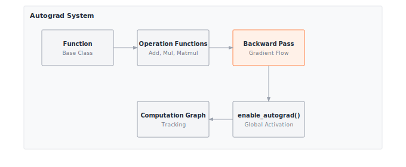

# Module 06: Autograd

:::{.callout-note title="Module Info"}

**FOUNDATION TIER** | Difficulty: ●●●○ | Time: 6-8 hours | Prerequisites: 01-05

You need to be fluent with everything from Modules 01–05:

- Tensor operations (matmul, broadcasting, reductions)
- Activation functions (the source of non-linearity)
- Neural network layers (what gradients will flow through)
- Loss functions (the scalar gradients flow back from)
- DataLoader for batched iteration

If you can hand-compute a forward pass through a small network and explain why we minimize loss, you're ready.
:::

```{=html}
<div class="action-cards">
<div class="action-card">
<h4>🎧 Audio Overview</h4>
<p>Listen to an AI-generated overview.</p>
<audio controls style="width: 100%; height: 54px;">
<source src="https://github.com/harvard-edge/cs249r_book/releases/download/tinytorch-audio-v0.1.1/06_autograd.mp3" type="audio/mpeg">
</audio>
</div>
<div class="action-card">
<h4>🚀 Launch Binder</h4>
<p>Run interactively in your browser.</p>
<a href="https://mybinder.org/v2/gh/harvard-edge/cs249r_book/main?labpath=tinytorch%2Fmodules%2F06_autograd%2Fautograd.ipynb" class="action-btn btn-orange">Open in Binder →</a>
</div>
<div class="action-card">
<h4>📄 View Source</h4>
<p>Browse the source code on GitHub.</p>
<a href="https://github.com/harvard-edge/cs249r_book/blob/main/tinytorch/src/06_autograd/06_autograd.py" class="action-btn btn-teal">View on GitHub →</a>
</div>
</div>

<style>
.slide-viewer-container {
  margin: 0.5rem 0 1.5rem 0;
  background: #0f172a;
  border-radius: 1rem;
  overflow: hidden;
  box-shadow: 0 4px 20px rgba(0,0,0,0.15);
}
.slide-header {
  display: flex;
  align-items: center;
  justify-content: space-between;
  padding: 0.6rem 1rem;
  background: rgba(255,255,255,0.03);
}
.slide-title {
  display: flex;
  align-items: center;
  gap: 0.5rem;
  color: #94a3b8;
  font-weight: 500;
  font-size: 0.85rem;
}
.slide-subtitle {
  color: #64748b;
  font-weight: 400;
  font-size: 0.75rem;
}
.slide-toolbar {
  display: flex;
  align-items: center;
  gap: 0.375rem;
}
.slide-toolbar button {
  background: transparent;
  border: none;
  color: #64748b;
  width: 32px;
  height: 32px;
  border-radius: 0.375rem;
  cursor: pointer;
  font-size: 1.1rem;
  transition: all 0.15s;
  display: flex;
  align-items: center;
  justify-content: center;
}
.slide-toolbar button:hover {
  background: rgba(249, 115, 22, 0.15);
  color: #f97316;
}
.slide-nav-group {
  display: flex;
  align-items: center;
}
.slide-page-info {
  color: #64748b;
  font-size: 0.75rem;
  padding: 0 0.5rem;
  font-weight: 500;
}
.slide-zoom-group {
  display: flex;
  align-items: center;
  margin-left: 0.25rem;
  padding-left: 0.5rem;
  border-left: 1px solid rgba(255,255,255,0.1);
}
.slide-canvas-wrapper {
  display: flex;
  justify-content: center;
  align-items: center;
  padding: 0.5rem 1rem 1rem 1rem;
  min-height: 380px;
  background: #0f172a;
}
.slide-canvas {
  max-width: 100%;
  max-height: 350px;
  height: auto;
  border-radius: 0.5rem;
  box-shadow: 0 4px 24px rgba(0,0,0,0.4);
}
.slide-progress-wrapper {
  padding: 0 1rem 0.5rem 1rem;
}
.slide-progress-bar {
  height: 3px;
  background: rgba(255,255,255,0.08);
  border-radius: 1.5px;
  overflow: hidden;
  cursor: pointer;
}
.slide-progress-fill {
  height: 100%;
  background: #f97316;
  border-radius: 1.5px;
  transition: width 0.2s ease;
}
.slide-loading {
  color: #f97316;
  font-size: 0.9rem;
  display: flex;
  align-items: center;
  gap: 0.5rem;
}
.slide-loading::before {
  content: '';
  width: 18px;
  height: 18px;
  border: 2px solid rgba(249, 115, 22, 0.2);
  border-top-color: #f97316;
  border-radius: 50%;
  animation: slide-spin 0.8s linear infinite;
}
@keyframes slide-spin {
  to { transform: rotate(360deg); }
}
.slide-footer {
  display: flex;
  justify-content: center;
  gap: 0.5rem;
  padding: 0.6rem 1rem;
  background: rgba(255,255,255,0.02);
  border-top: 1px solid rgba(255,255,255,0.05);
}
.slide-footer a {
  display: inline-flex;
  align-items: center;
  gap: 0.375rem;
  background: #f97316;
  color: white;
  padding: 0.4rem 0.9rem;
  border-radius: 2rem;
  text-decoration: none;
  font-weight: 500;
  font-size: 0.75rem;
  transition: all 0.15s;
}
.slide-footer a:hover {
  background: #ea580c;
  color: white;
}
.slide-footer a.secondary {
  background: transparent;
  color: #94a3b8;
  border: 1px solid rgba(255,255,255,0.15);
}
.slide-footer a.secondary:hover {
  background: rgba(255,255,255,0.05);
  color: #f8fafc;
}
@media (max-width: 600px) {
  .slide-header { flex-direction: column; gap: 0.5rem; padding: 0.5rem 0.75rem; }
  .slide-toolbar button { width: 28px; height: 28px; }
  .slide-canvas-wrapper { min-height: 260px; padding: 0.5rem; }
  .slide-canvas { max-height: 220px; }
}
</style>

<div class="slide-viewer-container" id="slide-viewer-06_autograd">
<div class="slide-header">
<div class="slide-title">
<span>🔥</span>
<span>Slide Deck</span>

<span class="slide-subtitle">· AI-generated</span>
</div>
<div class="slide-toolbar">
<div class="slide-nav-group">
<button onclick="slideNav('06_autograd', -1)" title="Previous">‹</button>
<span class="slide-page-info"><span id="slide-num-06_autograd">1</span> / <span id="slide-count-06_autograd">-</span></span>
<button onclick="slideNav('06_autograd', 1)" title="Next">›</button>
</div>
<div class="slide-zoom-group">
<button onclick="slideZoom('06_autograd', -0.25)" title="Zoom out">−</button>
<button onclick="slideZoom('06_autograd', 0.25)" title="Zoom in">+</button>
</div>
</div>
</div>
<div class="slide-canvas-wrapper">
<div id="slide-loading-06_autograd" class="slide-loading">Loading slides...</div>
<canvas id="slide-canvas-06_autograd" class="slide-canvas" style="display:none;"></canvas>
</div>
<div class="slide-progress-wrapper">
<div class="slide-progress-bar" onclick="slideProgress('06_autograd', event)">
<div class="slide-progress-fill" id="slide-progress-06_autograd" style="width: 0%;"></div>
</div>
</div>
<div class="slide-footer">
<a href="../assets/slides/06_autograd.pdf" download>⬇ Download</a>
<a href="#" onclick="slideFullscreen('06_autograd'); return false;" class="secondary">⛶ Fullscreen</a>
</div>
</div>

<script src="https://cdnjs.cloudflare.com/ajax/libs/pdf.js/3.11.174/pdf.min.js"></script>
<script>
(function() {
  if (window.slideViewersInitialized) return;
  window.slideViewersInitialized = true;

  pdfjsLib.GlobalWorkerOptions.workerSrc = 'https://cdnjs.cloudflare.com/ajax/libs/pdf.js/3.11.174/pdf.worker.min.js';

  window.slideViewers = {};

  window.initSlideViewer = function(id, pdfUrl) {
    const viewer = { pdf: null, page: 1, scale: 1.3, rendering: false, pending: null };
    window.slideViewers[id] = viewer;

    const canvas = document.getElementById('slide-canvas-' + id);
    const ctx = canvas.getContext('2d');

    function render(num) {
      viewer.rendering = true;
      viewer.pdf.getPage(num).then(function(page) {
        const viewport = page.getViewport({scale: viewer.scale});
        canvas.height = viewport.height;
        canvas.width = viewport.width;
        page.render({canvasContext: ctx, viewport: viewport}).promise.then(function() {
          viewer.rendering = false;
          if (viewer.pending !== null) { render(viewer.pending); viewer.pending = null; }
        });
      });
      document.getElementById('slide-num-' + id).textContent = num;
      document.getElementById('slide-progress-' + id).style.width = (num / viewer.pdf.numPages * 100) + '%';
    }

    function queue(num) { if (viewer.rendering) viewer.pending = num; else render(num); }

    pdfjsLib.getDocument(pdfUrl).promise.then(function(pdf) {
      viewer.pdf = pdf;
      document.getElementById('slide-count-' + id).textContent = pdf.numPages;
      document.getElementById('slide-loading-' + id).style.display = 'none';
      canvas.style.display = 'block';
      render(1);
    }).catch(function() {
      document.getElementById('slide-loading-' + id).innerHTML = 'Unable to load. <a href="' + pdfUrl + '" style="color:#f97316;">Download PDF</a>';
    });

    viewer.queue = queue;
  };

  window.slideNav = function(id, dir) {
    const v = window.slideViewers[id];
    if (!v || !v.pdf) return;
    const newPage = v.page + dir;
    if (newPage >= 1 && newPage <= v.pdf.numPages) { v.page = newPage; v.queue(newPage); }
  };

  window.slideZoom = function(id, delta) {
    const v = window.slideViewers[id];
    if (!v) return;
    v.scale = Math.max(0.5, Math.min(3, v.scale + delta));
    v.queue(v.page);
  };

  window.slideProgress = function(id, event) {
    const v = window.slideViewers[id];
    if (!v || !v.pdf) return;
    const bar = event.currentTarget;
    const pct = (event.clientX - bar.getBoundingClientRect().left) / bar.offsetWidth;
    const newPage = Math.max(1, Math.min(v.pdf.numPages, Math.ceil(pct * v.pdf.numPages)));
    if (newPage !== v.page) { v.page = newPage; v.queue(newPage); }
  };

  window.slideFullscreen = function(id) {
    const el = document.getElementById('slide-viewer-' + id);
    if (el.requestFullscreen) el.requestFullscreen();
    else if (el.webkitRequestFullscreen) el.webkitRequestFullscreen();
  };
})();

initSlideViewer('06_autograd', '../assets/slides/06_autograd.pdf');

</script>

```
## Overview

A neural network learns by nudging every parameter in the direction that lowers the loss. To find that direction you need a gradient — one number per parameter. A modern model has billions of parameters, so deriving those gradients by hand is not just tedious, it is impossible. Every framework you have ever used — PyTorch, TensorFlow, JAX — solves this with the same trick: automatic differentiation.

In this module you build reverse-mode autograd from scratch. The forward pass records each operation into a small graph; `loss.backward()` walks that graph in reverse, applying the chain rule one operation at a time. When you finish, calling `loss.backward()` on your tensors does the same thing it does in PyTorch — and you will know exactly why.

This is the conceptually hardest module in the Foundation tier. It is also the one that unlocks everything that follows: optimizers, training loops, and any model that learns from data.

## Learning Objectives

:::{.callout-tip title="By completing this module, you will:"}

- **Implement** the Function base class that enables gradient computation for all operations
- **Build** computation graphs that track dependencies between tensors during forward pass
- **Master** the chain rule by implementing backward passes for arithmetic, matrix multiplication, and reductions
- **Understand** memory trade-offs between storing intermediate values and recomputing forward passes
- **Connect** your autograd implementation to PyTorch's design patterns and production optimizations
:::

## What You'll Build


::: {#fig-06_autograd-diag-1 fig-env="figure" fig-pos="htb" fig-cap="**TinyTorch Autograd Engine**: Reverse-mode automatic differentiation infrastructure." fig-alt="Diagram showing the Function base class, Operation functions, Backward pass flow, Computation Graph tracking, and enable_autograd() activation."}



:::


**Implementation roadmap:**

| Part | What You'll Implement | Key Concept |
|------|----------------------|-------------|
| 1 | `Function` base class | Storing inputs for backward pass |
| 2 | `AddBackward`, `MulBackward`, `MatmulBackward` | Operation-specific gradient rules |
| 3 | `backward()` method on Tensor | Reverse-mode differentiation |
| 4 | `enable_autograd()` enhancement | Monkey-patching operations for gradient tracking |
| 5 | Integration tests | Multi-layer gradient flow |

**The pattern you'll enable:**
```python
# Automatic gradient computation
x = Tensor([2.0], requires_grad=True)
y = x * 3 + 1  # y = 3x + 1
y.backward()   # Computes dy/dx = 3 automatically
print(x.grad)  # [3.0]
```

### What You're NOT Building (Yet)

To keep this module focused, you will **not** implement:

- Higher-order derivatives (gradients of gradients)—PyTorch supports this with `create_graph=True`
- Dynamic computation graphs—your graphs are built during forward pass only
- GPU kernel fusion—PyTorch's JIT compiler optimizes backward pass operations
- Checkpointing for memory efficiency—that's an advanced optimization technique

**You are building the core gradient engine.** Advanced optimizations come in production frameworks.

## API Reference

This section documents the autograd components you'll build. These integrate with the existing Tensor class from Module 01.

### Function Base Class

```python
Function(*tensors)
```

Base class for all differentiable operations. Every operation (addition, multiplication, etc.) inherits from Function and implements gradient computation rules.

### Core Function Classes

| Class | Purpose | Gradient Rule |
|-------|---------|---------------|
| `AddBackward` | Addition gradients | ∂(a+b)/∂a = 1, ∂(a+b)/∂b = 1 |
| `SubBackward` | Subtraction gradients | ∂(a-b)/∂a = 1, ∂(a-b)/∂b = -1 |
| `MulBackward` | Multiplication gradients | ∂(a*b)/∂a = b, ∂(a*b)/∂b = a |
| `DivBackward` | Division gradients | ∂(a/b)/∂a = 1/b, ∂(a/b)/∂b = -a/b² |
| `MatmulBackward` | Matrix multiplication gradients | ∂(A@B)/∂A = grad@B.T, ∂(A@B)/∂B = A.T@grad |
| `SumBackward` | Reduction gradients | ∂sum(a)/∂a[i] = 1 for all i |
| `ReshapeBackward` | Shape manipulation | ∂(X.reshape(...))/∂X = grad.reshape(X.shape) |
| `TransposeBackward` | Transpose gradients | ∂(X.T)/∂X = grad.T |

**Additional Backward Classes:** The implementation includes backward functions for activations (`ReLUBackward`, `SigmoidBackward`, `SoftmaxBackward`, `GELUBackward`), losses (`MSEBackward`, `BCEBackward`, `CrossEntropyBackward`), and other operations (`PermuteBackward`, `SliceBackward`). These follow the same pattern as the core classes above.

### Enhanced Tensor Methods

Your implementation adds these methods to the Tensor class:

| Method | Signature | Description |
|--------|-----------|-------------|
| `backward` | `backward(gradient=None) -> None` | Compute gradients via backpropagation |
| `zero_grad` | `zero_grad() -> None` | Reset gradients to None |

### Global Activation

| Function | Signature | Description |
|----------|-----------|-------------|
| `enable_autograd` | `enable_autograd(quiet=False) -> None` | Activate gradient tracking globally |

## Core Concepts

This section covers the fundamental ideas behind automatic differentiation. Understanding these concepts deeply will help you debug gradient issues in any framework, not just TinyTorch.

### Computation Graphs

A computation graph is a directed acyclic graph (DAG): nodes are tensors, edges are the operations that produced them. When you write `y = x * 3 + 1`, you build a graph with three tensor nodes (`x`, `temp`, `y`) and two operation edges (multiply, add). You don't see this graph because autograd builds it for you, silently, as a side effect of running the forward pass.

The construction trick is small but powerful: every tensor produced by an operation stores a reference to the operation that produced it. That reference — `_grad_fn` in your implementation, `grad_fn` in PyTorch — is the entire graph. To traverse the graph backward you just follow `_grad_fn` pointers until you reach the leaves.

```
Forward Pass:  x → [Mul(*3)] → temp → [Add(+1)] → y
Backward Pass: grad_x ← [MulBackward] ← grad_temp ← [AddBackward] ← grad_y
```

Each backward node also has to remember the *values* it will need later. For `z = a * b`, the gradient with respect to `a` is `grad_z * b` — so the multiply operation must hold on to `b` from the forward pass. This is the central memory trade-off of autograd: every saved tensor is bytes you cannot reclaim until backward runs, but those saved tensors are exactly what makes the backward pass cheap.

Your implementation tracks graphs with the `_grad_fn` attribute:

```python
class AddBackward(Function):
    """Gradient computation for addition."""

    def __init__(self, a, b):
        """Store inputs needed for backward pass."""
        self.saved_tensors = (a, b)

    def apply(self, grad_output):
        """Compute gradients for both inputs."""
        return grad_output, grad_output  # Addition distributes gradients equally
```

When you compute `z = x + y`, your enhanced Tensor class automatically creates an AddBackward instance and attaches it to `z`:

```python
result = x.data + y.data
result_tensor = Tensor(result)
result_tensor._grad_fn = AddBackward(x, y)  # Track operation
```

This simple pattern enables arbitrarily complex computation graphs.

### The Chain Rule

Backpropagation is the chain rule, applied one node at a time. For a composite function `z = f(g(x))`, the chain rule says `dz/dx = (dz/dg) * (dg/dx)`. Reverse-mode autograd flips this on its head: instead of multiplying derivatives left-to-right, you walk the graph backward and multiply right-to-left, so every intermediate gradient is computed exactly once and reused everywhere it is needed downstream.

When the graph has multiple paths from a parameter to the loss, the gradients along each path **add**. This is why a shared embedding table — used a hundred times in a transformer — ends up with the sum of contributions from all hundred uses. You get this for free; the recursion described below visits every path naturally.

Consider this computation: `loss = (x * W + b)²`

```
Forward:  x → [Mul(W)] → z1 → [Add(b)] → z2 → [Square] → loss

Backward chain rule:
  ∂loss/∂z2 = 2*z2              (square backward)
  ∂loss/∂z1 = ∂loss/∂z2 * 1     (addition backward)
  ∂loss/∂x  = ∂loss/∂z1 * W     (multiplication backward)
```

Each backward function does exactly one thing: multiply the incoming gradient by its own local derivative. It knows nothing about the rest of the graph — and it doesn't need to. Here's how `MulBackward` implements this:

```python
class MulBackward(Function):
    """Gradient computation for element-wise multiplication."""

    def apply(self, grad_output):
        """
        For z = a * b:
        ∂z/∂a = b → grad_a = grad_output * b
        ∂z/∂b = a → grad_b = grad_output * a

        Uses vectorized element-wise multiplication (NumPy broadcasting).
        """
        a, b = self.saved_tensors
        grad_a = grad_b = None

        if a.requires_grad:
            grad_a = grad_output * b.data  # Vectorized element-wise multiplication

        if b.requires_grad:
            grad_b = grad_output * a.data  # NumPy handles broadcasting automatically

        return grad_a, grad_b
```

Each operation knows only its own derivative; the chain rule does the connecting. NumPy handles the element-wise math in optimized C, so no explicit loops are needed.

### Backward Pass Implementation

The backward pass walks the computation graph in reverse, computing gradients for every tensor it visits. Your `backward()` method does this as a recursive tree walk — short enough to read in one sitting, but enough to support arbitrarily deep networks:

```python
def backward(self, gradient=None):
    """Compute gradients via backpropagation."""
    if not self.requires_grad:
        return

    # Initialize gradient for scalar outputs
    if gradient is None:
        if self.data.size == 1:
            gradient = np.ones_like(self.data)
        else:
            raise ValueError("backward() requires gradient for non-scalar tensors")

    # Accumulate gradient (vectorized NumPy operation)
    if self.grad is None:
        self.grad = np.zeros_like(self.data)
    self.grad += gradient

    # Propagate to parent tensors
    if hasattr(self, '_grad_fn') and self._grad_fn is not None:
        grads = self._grad_fn.apply(gradient)  # Compute input gradients using vectorized ops

        for tensor, grad in zip(self._grad_fn.saved_tensors, grads):
            if isinstance(tensor, Tensor) and tensor.requires_grad and grad is not None:
                tensor.backward(grad)  # Recursive call
```

For a 100-layer network, `loss.backward()` triggers 100 recursive calls — one per layer — flowing gradients from output to input. The traversal is recursive Python; the math inside each `apply()` is vectorized NumPy. That split is why the system stays both readable and fast.

The `gradient` argument deserves a closer look. For scalar losses (the typical case) you call `loss.backward()` with no arguments and the method seeds the gradient to 1.0 — because `∂loss/∂loss = 1`. For non-scalar outputs you must pass the upstream gradient explicitly; there is no canonical scalar to seed from, and silently picking one would hide bugs.

### Gradient Accumulation

Gradient accumulation is the same feature seen from two sides. Call `backward()` twice on the same tensor and the gradients add — by design. That's what lets you split a batch that doesn't fit in memory into chunks, run them sequentially, and end up with the same gradient as if you'd processed them all at once:

```python
# Large batch (doesn't fit in memory)
for mini_batch in split_batch(large_batch, chunks=4):
    loss = model(mini_batch)
    loss.backward()  # Gradients accumulate in model parameters

# Now gradients equal the sum over the entire large batch
optimizer.step()
model.zero_grad()  # Reset for next iteration
```

Without this behavior you'd have to store every mini-batch gradient and sum them yourself. With it, the autograd system does the bookkeeping.

The flip side: accumulation becomes a silent bug the moment you forget to call `zero_grad()` between iterations.

```python
# WRONG: Gradients accumulate across iterations
for batch in dataloader:
    loss = model(batch)
    loss.backward()  # Gradients keep adding!
    optimizer.step()  # Updates use accumulated gradients from all previous batches

# CORRECT: Zero gradients after each update
for batch in dataloader:
    model.zero_grad()  # Reset gradients
    loss = model(batch)
    loss.backward()
    optimizer.step()
```

Your `zero_grad()` implementation is simple but crucial:

```python
def zero_grad(self):
    """Reset gradients to None."""
    self.grad = None
```

Setting to None instead of zeros saves memory: NumPy doesn't allocate arrays until you accumulate the first gradient.

### Memory Management in Autograd

Autograd's memory footprint comes from two sources: stored intermediate tensors and gradient storage. For a forward pass through an N-layer network, you store roughly N intermediate activations. During backward pass, you store gradients for every parameter.

Consider a simple linear layer: `y = x @ W + b`

**Forward pass stores:**
- x (needed for computing grad_W = x.T @ grad_y)
- W (needed for computing grad_x = grad_y @ W.T)

**Backward pass allocates:**
- grad_x (same shape as x)
- grad_W (same shape as W)
- grad_b (same shape as b)

For a batch of 32 samples through a (512, 768) linear layer, the memory breakdown is:

```text
Forward storage:
  x:       32 × 512 × 4 bytes =     64 KB
  W:      512 × 768 × 4 bytes =  1,536 KB

Backward storage:
  grad_x:  32 × 512 × 4 bytes =     64 KB
  grad_W: 512 × 768 × 4 bytes =  1,536 KB
  grad_b:       768 × 4 bytes =      3 KB

Total: ~3.1 MB for one layer (2× parameter size + activation size)
```

Multiply by network depth and you see why memory limits batch size. A 100-layer transformer stores 100× the activations, which can easily exceed GPU memory.

Production frameworks mitigate this with gradient checkpointing: they discard intermediate activations during forward pass and recompute them during backward pass. This trades compute (recomputing activations) for memory (not storing them). Your implementation doesn't do this—it's an advanced optimization—but understanding the trade-off is essential.

The implementation shows this memory overhead clearly in the MatmulBackward class:

```python
class MatmulBackward(Function):
    """
    Gradient computation for matrix multiplication.

    For Z = A @ B:
    - Must store A and B during forward pass
    - Backward computes: grad_A = grad_Z @ B.T and grad_B = A.T @ grad_Z
    - Uses vectorized NumPy operations (np.matmul, np.swapaxes)
    """

    def apply(self, grad_output):
        a, b = self.saved_tensors  # Retrieved from memory
        grad_a = grad_b = None

        if a.requires_grad:
            # Vectorized transpose and matmul (no explicit loops)
            b_T = np.swapaxes(b.data, -2, -1)
            grad_a = np.matmul(grad_output, b_T)

        if b.requires_grad:
            # Vectorized operations for efficiency
            a_T = np.swapaxes(a.data, -2, -1)
            grad_b = np.matmul(a_T, grad_output)

        return grad_a, grad_b
```

Notice that both `a` and `b` must be saved during forward pass. For large matrices, this storage cost dominates memory usage. All gradient computations use vectorized NumPy operations, which are implemented in optimized C/Fortran code under the hood—no explicit Python loops are needed.

## Production Context

### Your Implementation vs. PyTorch

Your autograd system and PyTorch's share the same design: computation graphs built during forward pass, reverse-mode differentiation during backward pass, and gradient accumulation in parameter tensors. The differences are in scale and optimization.

| Feature | Your Implementation | PyTorch |
|---------|---------------------|---------|
| **Graph Building** | Python objects, `_grad_fn` attribute | C++ objects, compiled graph |
| **Memory** | Stores all intermediates | Gradient checkpointing, memory pools |
| **Speed** | Pure Python, NumPy backend | C++/CUDA, fused kernels |
| **Operations** | 10 backward functions | 2000+ optimized backward functions |
| **Debugging** | Direct Python inspection | `torch.autograd.profiler`, graph visualization |

### Code Comparison

The following comparison shows identical conceptual patterns in TinyTorch and PyTorch. The APIs mirror each other because both implement the same autograd algorithm.

::: {.panel-tabset}
## Your TinyTorch
```python
from tinytorch import Tensor

# Create tensors with gradient tracking
x = Tensor([[1.0, 2.0]], requires_grad=True)
W = Tensor([[3.0], [4.0]], requires_grad=True)

# Forward pass builds computation graph
y = x.matmul(W)  # y = x @ W
loss = (y * y).sum()  # loss = sum(y²)

# Backward pass computes gradients
loss.backward()

# Access gradients
print(f"x.grad: {x.grad}")  # ∂loss/∂x
print(f"W.grad: {W.grad}")  # ∂loss/∂W
```

## PyTorch
```python
import torch

# Create tensors with gradient tracking
x = torch.tensor([[1.0, 2.0]], requires_grad=True)
W = torch.tensor([[3.0], [4.0]], requires_grad=True)

# Forward pass builds computation graph
y = x @ W  # PyTorch uses @ operator
loss = (y * y).sum()

# Backward pass computes gradients
loss.backward()

# Access gradients
print(f"x.grad: {x.grad}")
print(f"W.grad: {W.grad}")
```
:::

Let's walk through the comparison line by line:

- **Line 3-4 (Tensor creation)**: Both frameworks use `requires_grad=True` to enable gradient tracking. This is an opt-in design: most tensors (data, labels) don't need gradients, only parameters do.
- **Line 7-8 (Forward pass)**: Operations automatically build computation graphs. TinyTorch uses `.matmul()` method; PyTorch supports both `.matmul()` and the `@` operator.
- **Line 11 (Backward pass)**: Single method call triggers reverse-mode differentiation through the entire graph.
- **Line 14-15 (Gradient access)**: Both store gradients in the `.grad` attribute. Gradients have the same shape as the original tensor.

:::{.callout-tip title="What's Identical"}

Computation graph construction, chain rule implementation, and gradient accumulation semantics. When you debug PyTorch autograd issues, you're debugging the same algorithm you implemented here.
:::

### Why Autograd Matters at Scale

The case for automating differentiation is overwhelming the moment you look at the numbers:

- **GPT-3**: 175 billion parameters — that's 175,000,000,000 gradients per training step.
- **Training cost**: each backward pass takes roughly 2× the forward pass time (two matmuls instead of one per linear layer).
- **Memory**: storing the computation graph for a transformer can require ~10× the model's parameter footprint.

Hand-deriving gradients does not scale to any of this. Even a 3-layer MLP with a million parameters would take weeks to differentiate manually and would still contain bugs at the end. Autograd makes training tractable by automating the most error-prone part of deep learning — and it's the single biggest reason the field moves as fast as it does.

## Check Your Understanding

Test yourself with these systems thinking questions. They're designed to build intuition for autograd's performance characteristics and design decisions.

**Q1: Computation Graph Memory**

A 5-layer MLP processes a batch of 64 samples. Each layer stores its input activation for backward pass. Layer dimensions are: 784 → 512 → 256 → 128 → 10. How much memory (in MB) is used to store activations for one batch?

:::{.callout-note collapse="true" title="Answer"}

```text
Layer 1 input: 64 × 784 × 4 bytes = 196 KB
Layer 2 input: 64 × 512 × 4 bytes = 128 KB
Layer 3 input: 64 × 256 × 4 bytes =  64 KB
Layer 4 input: 64 × 128 × 4 bytes =  32 KB
Layer 5 input: 64 ×  10 × 4 bytes = 2.5 KB
```

**Total: ~422 KB ≈ 0.41 MB**

That is per forward pass through a tiny MLP. A 100-layer transformer stores roughly 100× this — and with much wider layers — which is why gradient checkpointing trades compute for memory by recomputing activations during backward pass.
:::

**Q2: Backward Pass Complexity**

A forward pass through a linear layer `y = x @ W` (where x is 32×512 and W is 512×256) takes 8ms. How long will the backward pass take?

:::{.callout-note collapse="true" title="Answer"}

Forward: 1 matmul (x @ W)

Backward: 2 matmuls
  - grad_x = grad_y @ W.T (32×256 @ 256×512)
  - grad_W = x.T @ grad_y (512×32 @ 32×256)

**Backward takes ~2× forward time ≈ 16ms**

This is why training (forward + backward) takes roughly 3× inference time. GPU parallelism and kernel fusion can reduce this, but the fundamental 2:1 ratio remains.
:::

**Q3: Gradient Accumulation Memory**

You have 16GB GPU memory and a model with 1B parameters (float32). How much memory is available for activations and gradients during training?

:::{.callout-note collapse="true" title="Answer"}

```text
Model parameters:        1B × 4 bytes =  4 GB
Gradients:               1B × 4 bytes =  4 GB
Optimizer state (Adam):  1B × 8 bytes =  8 GB   (momentum + variance)
```

**Total framework overhead: 16 GB**

**Available for activations: 0 GB** — you've already exceeded memory before storing a single activation.

This is why large models reach for gradient accumulation across multiple forward passes before updating parameters, or gradient checkpointing to shrink activation memory. The "2× parameter size" rule (params + grads) is a floor, not a ceiling — optimizers like Adam add more on top.
:::

**Q4: requires_grad Performance**

A typical training batch has: 32 images (input), 10M parameter tensors (weights), 50 intermediate activation tensors. If requires_grad defaults to True for all tensors, how many tensors unnecessarily track gradients?

:::{.callout-note collapse="true" title="Answer"}

Tensors that **need** gradients:

- Parameters: 10M tensors

Tensors that **don't** need gradients:

- Input images: 32 tensors (data is not learned)
- Intermediate activations: 50 tensors (needed for backward, but not updated)

**32 input tensors would unnecessarily track gradients** if `requires_grad` defaulted to True.

This is why PyTorch defaults `requires_grad=False` for new tensors and forces an explicit opt-in for parameters. For a batch of 32 images of shape 3×224×224, accidentally tracking gradients on the inputs wastes 4.8M float32 values × 4 bytes = ~18.4 MB per batch — for nothing.
:::

**Q5: Graph Retention**

You forget to call `zero_grad()` before each training iteration. After 10 iterations, how do the gradients compare to correct training?

:::{.callout-note collapse="true" title="Answer"}

**Gradients accumulate across all 10 iterations.**

If correct gradient for iteration i is `g_i`, your accumulated gradient is:
`grad = g_1 + g_2 + g_3 + ... + g_10`

**Effects:**
1. **Magnitude**: Gradients are ~10× larger than they should be
2. **Direction**: The sum of 10 different gradients, which may not point toward the loss minimum
3. **Learning**: Parameter updates use the wrong direction and wrong magnitude
4. **Result**: Training diverges or oscillates instead of converging

**Bottom line**: Always call `zero_grad()` at the start of each iteration (or after `optimizer.step()`).
:::

## Further Reading

For students who want to understand the academic foundations and mathematical underpinnings of automatic differentiation:

### Seminal Papers

- **Automatic Differentiation in Machine Learning: a Survey** - Baydin et al. (2018). Comprehensive survey of AD techniques, covering forward-mode, reverse-mode, and mixed-mode differentiation. Essential reading for understanding autograd theory. [arXiv:1502.05767](https://arxiv.org/abs/1502.05767)

- **Automatic Differentiation of Algorithms** - Griewank (1989). The foundational work on reverse-mode AD that underlies all modern deep learning frameworks. Introduces the mathematical formalism for gradient computation via the chain rule. [Computational Optimization and Applications](https://doi.org/10.1007/BF00139316)

- **PyTorch: An Imperative Style, High-Performance Deep Learning Library** - Paszke et al. (2019). Describes PyTorch's autograd implementation and design philosophy. Shows how imperative programming (define-by-run) enables dynamic computation graphs. [NeurIPS 2019](https://arxiv.org/abs/1912.01703)

### Additional Resources

- **Textbook**: "Deep Learning" by Goodfellow, Bengio, and Courville - Chapter 6 covers backpropagation and computational graphs with excellent visualizations
- **Tutorial**: [CS231n: Backpropagation, Intuitions](https://cs231n.github.io/optimization-2/) - Stanford's visual explanation of gradient flow through computation graphs
- **Documentation**: [PyTorch Autograd Mechanics](https://pytorch.org/docs/stable/notes/autograd.html) - Official guide to PyTorch's autograd implementation details

## What's Next

You can now compute a gradient for every parameter in any network you build. That gradient tells you which way is downhill — but it does not tell you how big a step to take, or how to dampen oscillations, or how to adapt the step size per-parameter. That is the optimizer's job.

:::{.callout-note title="Coming Up: Module 07 — Optimizers"}

You'll implement SGD, momentum, and Adam: the rules that turn the `param.grad` tensors produced by `backward()` into actual parameter updates. With autograd plus an optimizer, you have the entire machinery a training loop needs.
:::

**Preview — how your autograd gets used in the modules that follow:**

| Module | What It Does | Your Autograd In Action |
|--------|--------------|------------------------|
| **07: Optimizers** | Update parameters using gradients | `optimizer.step()` uses `param.grad` computed by backward() |
| **08: Training** | Complete training loops | `loss.backward()` → `optimizer.step()` → repeat |
| **12: Attention** | Multi-head self-attention | Gradients flow through Q, K, V projections automatically |

## Get Started

:::{.callout-tip title="Interactive Options"}

- **[Launch Binder](https://mybinder.org/v2/gh/harvard-edge/cs249r_book/main?urlpath=lab/tree/tinytorch/modules/06_autograd/autograd.ipynb)** - Run interactively in browser, no setup required
- **[View Source](https://github.com/harvard-edge/cs249r_book/blob/main/tinytorch/src/06_autograd/06_autograd.py)** - Browse the implementation code
:::

:::{.callout-warning title="Save Your Progress"}

Binder sessions are temporary. Download your completed notebook when done, or clone the repository for persistent local work.
:::
