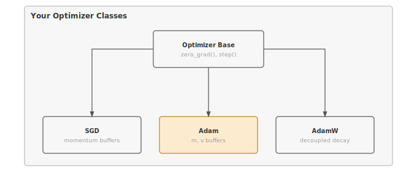

# Module 07: Optimizers

:::{.callout-note title="Module Info"}

**FOUNDATION TIER** | Difficulty: ●●○○ | Time: 3-5 hours | Prerequisites: 01-06

**Prerequisites: Modules 01-06** means you need:

- Tensor operations and parameter storage
- DataLoader for efficient batch processing
- Understanding of forward/backward passes (autograd)
- Why gradients point toward higher loss

If you understand how `loss.backward()` computes gradients and why we need to update parameters to minimize loss, you're ready.
:::

```{=html}
<div class="action-cards">
<div class="action-card">
<h4>🎧 Audio Overview</h4>
<p>Listen to an AI-generated overview.</p>
<audio controls style="width: 100%; height: 54px;">
<source src="https://github.com/harvard-edge/cs249r_book/releases/download/tinytorch-audio-v0.1.1/07_optimizers.mp3" type="audio/mpeg">
</audio>
</div>
<div class="action-card">
<h4>🚀 Launch Binder</h4>
<p>Run interactively in your browser.</p>
<a href="https://mybinder.org/v2/gh/harvard-edge/cs249r_book/main?labpath=tinytorch%2Fmodules%2F07_optimizers%2Foptimizers.ipynb" class="action-btn btn-orange">Open in Binder →</a>
</div>
<div class="action-card">
<h4>📄 View Source</h4>
<p>Browse the source code on GitHub.</p>
<a href="https://github.com/harvard-edge/cs249r_book/blob/main/tinytorch/src/07_optimizers/07_optimizers.py" class="action-btn btn-teal">View on GitHub →</a>
</div>
</div>

<style>
.slide-viewer-container {
  margin: 0.5rem 0 1.5rem 0;
  background: #0f172a;
  border-radius: 1rem;
  overflow: hidden;
  box-shadow: 0 4px 20px rgba(0,0,0,0.15);
}
.slide-header {
  display: flex;
  align-items: center;
  justify-content: space-between;
  padding: 0.6rem 1rem;
  background: rgba(255,255,255,0.03);
}
.slide-title {
  display: flex;
  align-items: center;
  gap: 0.5rem;
  color: #94a3b8;
  font-weight: 500;
  font-size: 0.85rem;
}
.slide-subtitle {
  color: #64748b;
  font-weight: 400;
  font-size: 0.75rem;
}
.slide-toolbar {
  display: flex;
  align-items: center;
  gap: 0.375rem;
}
.slide-toolbar button {
  background: transparent;
  border: none;
  color: #64748b;
  width: 32px;
  height: 32px;
  border-radius: 0.375rem;
  cursor: pointer;
  font-size: 1.1rem;
  transition: all 0.15s;
  display: flex;
  align-items: center;
  justify-content: center;
}
.slide-toolbar button:hover {
  background: rgba(249, 115, 22, 0.15);
  color: #f97316;
}
.slide-nav-group {
  display: flex;
  align-items: center;
}
.slide-page-info {
  color: #64748b;
  font-size: 0.75rem;
  padding: 0 0.5rem;
  font-weight: 500;
}
.slide-zoom-group {
  display: flex;
  align-items: center;
  margin-left: 0.25rem;
  padding-left: 0.5rem;
  border-left: 1px solid rgba(255,255,255,0.1);
}
.slide-canvas-wrapper {
  display: flex;
  justify-content: center;
  align-items: center;
  padding: 0.5rem 1rem 1rem 1rem;
  min-height: 380px;
  background: #0f172a;
}
.slide-canvas {
  max-width: 100%;
  max-height: 350px;
  height: auto;
  border-radius: 0.5rem;
  box-shadow: 0 4px 24px rgba(0,0,0,0.4);
}
.slide-progress-wrapper {
  padding: 0 1rem 0.5rem 1rem;
}
.slide-progress-bar {
  height: 3px;
  background: rgba(255,255,255,0.08);
  border-radius: 1.5px;
  overflow: hidden;
  cursor: pointer;
}
.slide-progress-fill {
  height: 100%;
  background: #f97316;
  border-radius: 1.5px;
  transition: width 0.2s ease;
}
.slide-loading {
  color: #f97316;
  font-size: 0.9rem;
  display: flex;
  align-items: center;
  gap: 0.5rem;
}
.slide-loading::before {
  content: '';
  width: 18px;
  height: 18px;
  border: 2px solid rgba(249, 115, 22, 0.2);
  border-top-color: #f97316;
  border-radius: 50%;
  animation: slide-spin 0.8s linear infinite;
}
@keyframes slide-spin {
  to { transform: rotate(360deg); }
}
.slide-footer {
  display: flex;
  justify-content: center;
  gap: 0.5rem;
  padding: 0.6rem 1rem;
  background: rgba(255,255,255,0.02);
  border-top: 1px solid rgba(255,255,255,0.05);
}
.slide-footer a {
  display: inline-flex;
  align-items: center;
  gap: 0.375rem;
  background: #f97316;
  color: white;
  padding: 0.4rem 0.9rem;
  border-radius: 2rem;
  text-decoration: none;
  font-weight: 500;
  font-size: 0.75rem;
  transition: all 0.15s;
}
.slide-footer a:hover {
  background: #ea580c;
  color: white;
}
.slide-footer a.secondary {
  background: transparent;
  color: #94a3b8;
  border: 1px solid rgba(255,255,255,0.15);
}
.slide-footer a.secondary:hover {
  background: rgba(255,255,255,0.05);
  color: #f8fafc;
}
@media (max-width: 600px) {
  .slide-header { flex-direction: column; gap: 0.5rem; padding: 0.5rem 0.75rem; }
  .slide-toolbar button { width: 28px; height: 28px; }
  .slide-canvas-wrapper { min-height: 260px; padding: 0.5rem; }
  .slide-canvas { max-height: 220px; }
}
</style>

<div class="slide-viewer-container" id="slide-viewer-07_optimizers">
<div class="slide-header">
<div class="slide-title">
<span>🔥</span>
<span>Slide Deck</span>

<span class="slide-subtitle">· AI-generated</span>
</div>
<div class="slide-toolbar">
<div class="slide-nav-group">
<button onclick="slideNav('07_optimizers', -1)" title="Previous">‹</button>
<span class="slide-page-info"><span id="slide-num-07_optimizers">1</span> / <span id="slide-count-07_optimizers">-</span></span>
<button onclick="slideNav('07_optimizers', 1)" title="Next">›</button>
</div>
<div class="slide-zoom-group">
<button onclick="slideZoom('07_optimizers', -0.25)" title="Zoom out">−</button>
<button onclick="slideZoom('07_optimizers', 0.25)" title="Zoom in">+</button>
</div>
</div>
</div>
<div class="slide-canvas-wrapper">
<div id="slide-loading-07_optimizers" class="slide-loading">Loading slides...</div>
<canvas id="slide-canvas-07_optimizers" class="slide-canvas" style="display:none;"></canvas>
</div>
<div class="slide-progress-wrapper">
<div class="slide-progress-bar" onclick="slideProgress('07_optimizers', event)">
<div class="slide-progress-fill" id="slide-progress-07_optimizers" style="width: 0%;"></div>
</div>
</div>
<div class="slide-footer">
<a href="../assets/slides/07_optimizers.pdf" download>⬇ Download</a>
<a href="#" onclick="slideFullscreen('07_optimizers'); return false;" class="secondary">⛶ Fullscreen</a>
</div>
</div>

<script src="https://cdnjs.cloudflare.com/ajax/libs/pdf.js/3.11.174/pdf.min.js"></script>
<script>
(function() {
  if (window.slideViewersInitialized) return;
  window.slideViewersInitialized = true;

  pdfjsLib.GlobalWorkerOptions.workerSrc = 'https://cdnjs.cloudflare.com/ajax/libs/pdf.js/3.11.174/pdf.worker.min.js';

  window.slideViewers = {};

  window.initSlideViewer = function(id, pdfUrl) {
    const viewer = { pdf: null, page: 1, scale: 1.3, rendering: false, pending: null };
    window.slideViewers[id] = viewer;

    const canvas = document.getElementById('slide-canvas-' + id);
    const ctx = canvas.getContext('2d');

    function render(num) {
      viewer.rendering = true;
      viewer.pdf.getPage(num).then(function(page) {
        const viewport = page.getViewport({scale: viewer.scale});
        canvas.height = viewport.height;
        canvas.width = viewport.width;
        page.render({canvasContext: ctx, viewport: viewport}).promise.then(function() {
          viewer.rendering = false;
          if (viewer.pending !== null) { render(viewer.pending); viewer.pending = null; }
        });
      });
      document.getElementById('slide-num-' + id).textContent = num;
      document.getElementById('slide-progress-' + id).style.width = (num / viewer.pdf.numPages * 100) + '%';
    }

    function queue(num) { if (viewer.rendering) viewer.pending = num; else render(num); }

    pdfjsLib.getDocument(pdfUrl).promise.then(function(pdf) {
      viewer.pdf = pdf;
      document.getElementById('slide-count-' + id).textContent = pdf.numPages;
      document.getElementById('slide-loading-' + id).style.display = 'none';
      canvas.style.display = 'block';
      render(1);
    }).catch(function() {
      document.getElementById('slide-loading-' + id).innerHTML = 'Unable to load. <a href="' + pdfUrl + '" style="color:#f97316;">Download PDF</a>';
    });

    viewer.queue = queue;
  };

  window.slideNav = function(id, dir) {
    const v = window.slideViewers[id];
    if (!v || !v.pdf) return;
    const newPage = v.page + dir;
    if (newPage >= 1 && newPage <= v.pdf.numPages) { v.page = newPage; v.queue(newPage); }
  };

  window.slideZoom = function(id, delta) {
    const v = window.slideViewers[id];
    if (!v) return;
    v.scale = Math.max(0.5, Math.min(3, v.scale + delta));
    v.queue(v.page);
  };

  window.slideProgress = function(id, event) {
    const v = window.slideViewers[id];
    if (!v || !v.pdf) return;
    const bar = event.currentTarget;
    const pct = (event.clientX - bar.getBoundingClientRect().left) / bar.offsetWidth;
    const newPage = Math.max(1, Math.min(v.pdf.numPages, Math.ceil(pct * v.pdf.numPages)));
    if (newPage !== v.page) { v.page = newPage; v.queue(newPage); }
  };

  window.slideFullscreen = function(id) {
    const el = document.getElementById('slide-viewer-' + id);
    if (el.requestFullscreen) el.requestFullscreen();
    else if (el.webkitRequestFullscreen) el.webkitRequestFullscreen();
  };
})();

initSlideViewer('07_optimizers', '../assets/slides/07_optimizers.pdf');

</script>

```
## Overview

You have gradients. Now what? An optimizer is the rule that turns a gradient into a parameter update — the difference between a model that converges in an afternoon and one that diverges on the first batch. Picture optimization as hiking in fog: you can feel the slope under your feet but cannot see the valley. Each optimizer is a different strategy for choosing your next step.

You'll build three: SGD with momentum (the foundation), Adam with adaptive per-parameter learning rates (the modern workhorse), and AdamW with decoupled weight decay (the default for transformers). They differ in memory cost, convergence speed, and how forgiving they are when you guess the learning rate wrong — and that last point matters more than most practitioners admit.

## Learning Objectives

:::{.callout-tip title="By completing this module, you will:"}

- **Implement** SGD with momentum to reduce oscillations and accelerate convergence in narrow valleys
- **Master** Adam's adaptive learning rate mechanism with first and second moment estimation
- **Understand** memory trade-offs (SGD: 2x memory vs Adam: 3x memory) and computational complexity per step
- **Connect** optimizer state management to checkpointing and distributed training considerations
:::

## What You'll Build


::: {#fig-07_optimizers-diag-1 fig-env="figure" fig-pos="htb" fig-cap="**TinyTorch Optimizer Hierarchy**: From basic SGD to advanced adaptive algorithms." fig-alt="Diagram showing the Optimizer base class and its descendants: SGD, Adam, and AdamW."}



:::


**Implementation roadmap:**

| Step | What You'll Implement | Key Concept |
|------|----------------------|-------------|
| 1 | `Optimizer` base class | Common interface: zero_grad(), step() |
| 2 | `SGD` with momentum | Velocity buffers to reduce oscillations |
| 3 | `Adam` optimizer | First and second moment estimation with bias correction |
| 4 | `AdamW` optimizer | Decoupled weight decay for proper regularization |

: **Implementation roadmap for the SGD and Adam optimizers.** {#tbl-07-optimizers-implementation-roadmap}

**The pattern you'll enable:**
```python
# Training loop with optimizer
optimizer = Adam(model.parameters(), lr=0.001)
loss.backward()  # Compute gradients (Module 06)
optimizer.step()  # Update parameters using gradients
optimizer.zero_grad()  # Clear gradients for next iteration
```

### What You're NOT Building (Yet)

To keep this module focused, you will **not** implement:

- Learning rate schedules (that's Module 08: Training)
- Gradient clipping (PyTorch provides this via `torch.nn.utils.clip_grad_norm_`)
- Second-order optimizers like L-BFGS (rarely used in deep learning due to memory cost)
- Distributed optimizer sharding (production frameworks use techniques like ZeRO)

**You are building the core optimization algorithms.** Advanced training techniques come in Module 08.

## API Reference

The signatures your implementations must satisfy. Keep this open while you build.

### Optimizer Base Class

```python
Optimizer(params: List[Tensor])
```

Base class defining the optimizer interface. All optimizers inherit from this.

| Method | Signature | Description |
|--------|-----------|-------------|
| `zero_grad` | `zero_grad() -> None` | Clear gradients from all parameters |
| `step` | `step() -> None` | Update parameters (implemented by subclasses) |

: **Methods defined by the Optimizer base class.** {#tbl-07-optimizers-base-api}

### SGD Optimizer

```python
SGD(params, lr=0.01, momentum=0.0, weight_decay=0.0)
```

Stochastic Gradient Descent with optional momentum and weight decay.

**Parameters:**
- `params`: List of Tensor parameters to optimize
- `lr`: Learning rate (step size, default: 0.01)
- `momentum`: Momentum factor (0.0-1.0, typically 0.9, default: 0.0)
- `weight_decay`: L2 penalty coefficient (default: 0.0)

**Update rule:**
- Without momentum: `param = param - lr * grad`
- With momentum: `v = momentum * v + grad; param = param - lr * v`

**State management methods:**

| Method | Signature | Description |
|--------|-----------|-------------|
| `has_momentum` | `has_momentum() -> bool` | Check if optimizer uses momentum (momentum > 0) |
| `get_momentum_state` | `get_momentum_state() -> Optional[List]` | Get momentum buffers for checkpointing |
| `set_momentum_state` | `set_momentum_state(state: Optional[List]) -> None` | Restore momentum buffers from checkpoint |

: **State-management methods on the SGD optimizer.** {#tbl-07-optimizers-state-methods}

### Adam Optimizer

```python
Adam(params, lr=0.001, betas=(0.9, 0.999), eps=1e-8, weight_decay=0.0)
```

Adaptive Moment Estimation with per-parameter learning rates.

**Parameters:**
- `params`: List of Tensor parameters to optimize
- `lr`: Learning rate (default: 0.001)
- `betas`: Tuple of coefficients (β₁, β₂) for computing running averages (default: (0.9, 0.999))
- `eps`: Small constant for numerical stability (default: 1e-8)
- `weight_decay`: L2 penalty coefficient (default: 0.0)

**State:**
- `m_buffers`: First moment estimates (momentum of gradients)
- `v_buffers`: Second moment estimates (momentum of squared gradients)

### AdamW Optimizer

```python
AdamW(params, lr=0.001, betas=(0.9, 0.999), eps=1e-8, weight_decay=0.01)
```

Adam with decoupled weight decay regularization.

**Parameters:**
- `params`: List of Tensor parameters to optimize
- `lr`: Learning rate (default: 0.001)
- `betas`: Tuple of coefficients (β₁, β₂) for computing running averages (default: (0.9, 0.999))
- `eps`: Small constant for numerical stability (default: 1e-8)
- `weight_decay`: L2 penalty coefficient (default: 0.01, higher than Adam)

**Key difference from Adam:** Weight decay is applied directly to parameters after gradient update, not mixed into the gradient.

## Core Concepts

Four ideas carry the rest of this chapter: the descent rule itself, why momentum exists, why Adam adapts per-parameter, and why the learning rate dwarfs every other knob.

### Gradient Descent Fundamentals

Gradient descent is conceptually simple: gradients point uphill toward higher loss, so we step downhill by moving in the opposite direction. The gradient ∇L tells us the direction of steepest ascent, so -∇L points toward steepest descent.

The basic update rule is: **θ_new = θ_old - α * ∇L**, where θ represents parameters and α is the learning rate (step size). This simple formula hides important challenges. How large should steps be? What if different parameters need different step sizes? What about noisy gradients or narrow valleys that cause oscillation?

Here's how your SGD implementation handles the basic case without momentum:

```python
def step(self):
    """Perform SGD update step with momentum."""
    for i, param in enumerate(self.params):
        if param.grad is None:
            continue

        # Get gradient data
        grad = param.grad
        if isinstance(grad, Tensor):
            grad_data = grad.data
        else:
            grad_data = grad

        # Apply weight decay if specified
        if self.weight_decay != 0:
            grad_data = grad_data + self.weight_decay * param.data

        # Update parameter: param = param - lr * grad
        param.data = param.data - self.lr * grad_data

    self.step_count += 1
```

The code reveals the simplicity of basic SGD: subtract learning rate times gradient from each parameter. But this simplicity comes with a cost: plain SGD can oscillate wildly in narrow valleys of the loss landscape.

**Complexity:** SGD's update is O(P) compute and O(P) memory per step, where P is the parameter count; adding momentum costs an additional O(P) memory for the velocity buffer. Adam is also O(P) compute per step but pays O(2P) extra memory for the first and second moment buffers (`m` and `v`). The asymptotic cost of every optimizer in this chapter scales *linearly* with parameter count — what differs is the constant factor in memory.

### Momentum and Acceleration

Momentum solves the oscillation problem by remembering previous update directions. Think of a ball rolling down a hill: it doesn't immediately change direction when it hits a small bump because it has momentum carrying it forward. In optimization, momentum accumulates velocity in directions that gradients consistently agree on, while oscillations in perpendicular directions cancel out.

The momentum update maintains a velocity buffer v for each parameter: **v = β * v_prev + grad** and then **param = param - lr * v**. The momentum coefficient β (typically 0.9) controls how much previous direction we remember. With β=0.9, we keep 90% of the old velocity and add 10% of the current gradient.

Here's how your SGD implementation adds momentum:

```python
# Update momentum buffer
if self.momentum != 0:
    if self.momentum_buffers[i] is None:
        # Initialize momentum buffer on first use
        self.momentum_buffers[i] = np.zeros_like(param.data)

    # Update momentum: v = momentum * v_prev + grad
    self.momentum_buffers[i] = self.momentum * self.momentum_buffers[i] + grad_data
    grad_data = self.momentum_buffers[i]

# Update parameter: param = param - lr * grad
param.data = param.data - self.lr * grad_data
```

The momentum buffer is initialized lazily (only when first needed) to save memory for optimizers without momentum. Once initialized, each step accumulates 90% of the previous velocity plus the current gradient, creating a smoothed update direction that's less susceptible to noise and oscillation.

### Adam and Adaptive Learning Rates

Different parameters want different learning rates. An embedding weight that lives in [-0.01, 0.01] and an output weight that lives in [-10, 10] cannot share a step size — one rate is too small for the embedding, too large for the output. SGD ignores this. Adam fixes it.

Adam keeps two running averages per parameter: a first moment `m` (mean of gradients) and a second moment `v` (mean of squared gradients). Updating with `m / √v` gives an automatic per-parameter step size — parameters with consistently large gradients take smaller steps; parameters with small or noisy gradients take larger ones.

The algorithm tracks: **m = β₁ * m_prev + (1-β₁) * grad** and **v = β₂ * v_prev + (1-β₂) * grad²**. Then it corrects for initialization bias (m and v start at zero) and updates: **param = param - lr * m̂ / (√v̂ + ε)**, where m̂ and v̂ are bias-corrected moments.

Here's the complete Adam update from your implementation:

```python
def step(self):
    """Perform Adam update step."""
    self.step_count += 1

    for i, param in enumerate(self.params):
        if param.grad is None:
            continue

        grad = param.grad
        if isinstance(grad, Tensor):
            grad_data = grad.data
        else:
            grad_data = grad

        # Initialize buffers if needed
        if self.m_buffers[i] is None:
            self.m_buffers[i] = np.zeros_like(param.data)
            self.v_buffers[i] = np.zeros_like(param.data)

        # Update biased first moment estimate
        self.m_buffers[i] = self.beta1 * self.m_buffers[i] + (1 - self.beta1) * grad_data

        # Update biased second moment estimate
        self.v_buffers[i] = self.beta2 * self.v_buffers[i] + (1 - self.beta2) * (grad_data ** 2)

        # Compute bias correction
        bias_correction1 = 1 - self.beta1 ** self.step_count
        bias_correction2 = 1 - self.beta2 ** self.step_count

        # Compute bias-corrected moments
        m_hat = self.m_buffers[i] / bias_correction1
        v_hat = self.v_buffers[i] / bias_correction2

        # Update parameter
        param.data = param.data - self.lr * m_hat / (np.sqrt(v_hat) + self.eps)
```

The bias correction terms (1 - β^t) are crucial in the first few steps. Without correction, m and v start at zero and take many steps to reach reasonable values, causing the optimizer to take tiny steps initially. The correction divides by increasingly large values: at step 1, divide by 0.1; at step 2, divide by 0.19; eventually the correction approaches 1.0 and has no effect.

While Adam's adaptive step sizes dramatically accelerate convergence, this mathematical elegance imposes a severe, often debilitating, hardware penalty on large-scale training systems.

:::{.callout-note title="Systems Implication: Optimizer State Memory"}
Because Adam maintains both a first moment (`m_buffers`) and a second moment (`v_buffers`) for every individual parameter, its memory footprint is enormous. Training a 1GB model requires 1GB for parameters, 1GB for gradients, and an additional **2GB solely for Adam's state**—meaning the optimizer demands 3× the model's footprint in VRAM. Furthermore, continuously fetching these massive buffers from GPU memory to compute each update makes the optimizer step heavily **memory-bound**, bottlenecked fundamentally by VRAM memory bandwidth rather than streaming multiprocessor compute cores.
:::

### AdamW and Decoupled Weight Decay

AdamW fixes a real bug in Adam. Standard Adam folds weight decay into the gradient — `grad = grad + λ * param` — and then runs the adaptive update. The decay term then gets divided by `√v` along with everything else, so parameters with large gradients receive *less* regularization and parameters with small gradients receive *more*. That is the opposite of what you want.

AdamW decouples the two: take the normal Adam step using the raw gradient, then separately shrink each parameter by a fixed fraction `lr * weight_decay`. Regularization strength is now constant across the network, independent of gradient magnitude. This is why every modern transformer trains with AdamW, not Adam.

Here's how your AdamW implementation achieves decoupling:

```python
# Update moments using pure gradients (NO weight decay mixed in)
self.m_buffers[i] = self.beta1 * self.m_buffers[i] + (1 - self.beta1) * grad_data
self.v_buffers[i] = self.beta2 * self.v_buffers[i] + (1 - self.beta2) * (grad_data ** 2)

# Compute bias correction and bias-corrected moments
bias_correction1 = 1 - self.beta1 ** self.step_count
bias_correction2 = 1 - self.beta2 ** self.step_count
m_hat = self.m_buffers[i] / bias_correction1
v_hat = self.v_buffers[i] / bias_correction2

# Apply gradient-based update
param.data = param.data - self.lr * m_hat / (np.sqrt(v_hat) + self.eps)

# Apply decoupled weight decay (separate from gradient update)
if self.weight_decay != 0:
    param.data = param.data * (1 - self.lr * self.weight_decay)
```

Notice that weight decay appears only at the end, multiplying parameters by (1 - lr * weight_decay) to shrink them slightly. This shrinkage happens after the gradient update and is completely independent of gradient magnitudes or adaptive scaling.

### Learning Rate Selection

The learning rate is the most important hyperparameter you will ever set. Too large and parameters oscillate or diverge; too small and training stalls or settles into a bad minimum. No optimizer choice — not Adam, not AdamW — rescues a badly chosen learning rate.

SGD typically lives in `0.001` to `0.1` and is unforgiving: get it wrong by 10x and training breaks. Momentum smooths the ride but does not change the sensitivity. Adam and AdamW default to `0.001` and tolerate roughly an order of magnitude in either direction, which is a large part of why they are popular. Transformers are the exception — they want `1e-4` to `3e-4` with a warmup that ramps the rate from zero over the first few thousand steps.

Batch size couples to learning rate. Larger batches produce less noisy gradients and can absorb larger steps. The standard heuristic — scale the learning rate linearly with batch size — works up to a few thousand samples per batch and breaks beyond that, which is why large-scale training has its own literature.

## Production Context

### Your Implementation vs. PyTorch

Your TinyTorch optimizers and PyTorch's `torch.optim` share the same algorithmic foundations and API patterns. The differences lie in implementation details: PyTorch uses optimized C++/CUDA kernels, supports mixed precision training, and includes specialized optimizers for specific domains.

| Feature | Your Implementation | PyTorch |
|---------|---------------------|---------|
| **Backend** | NumPy (Python) | C++/CUDA kernels |
| **Speed** | 1x (baseline) | 10-50x faster |
| **Memory** | Same asymptotic cost | Same (3x for Adam) |
| **State management** | Manual buffers | Automatic state_dict() |
| **Optimizers** | SGD, Adam, AdamW | 10+ algorithms (RMSprop, Adagrad, etc.) |

: **Feature comparison between TinyTorch optimizers and torch.optim.** {#tbl-07-optimizers-vs-pytorch}

### Code Comparison

Optimizer usage in TinyTorch and PyTorch is nearly identical — by design. The patterns you learn here are the patterns you use in production.

::: {.panel-tabset}
## Your TinyTorch
```python
from tinytorch.core.optimizers import Adam

# Create optimizer for model parameters
optimizer = Adam(model.parameters(), lr=0.001)

# Training step
loss = criterion(predictions, targets)
loss.backward()  # Compute gradients
optimizer.step()  # Update parameters
optimizer.zero_grad()  # Clear gradients
```

## PyTorch
```python
import torch.optim as optim

# Create optimizer for model parameters
optimizer = optim.Adam(model.parameters(), lr=0.001)

# Training step
loss = criterion(predictions, targets)
loss.backward()  # Compute gradients
optimizer.step()  # Update parameters
optimizer.zero_grad()  # Clear gradients
```
:::

Let's walk through each line to understand the comparison:

- **Line 1 (Import)**: TinyTorch exposes optimizers from `tinytorch.core.optimizers`; PyTorch uses `torch.optim`. The namespace structure mirrors production frameworks.
- **Line 4 (Creation)**: Both use identical syntax: `Adam(model.parameters(), lr=0.001)`. The `model.parameters()` method returns an iterable of tensors with `requires_grad=True`.
- **Line 7-8 (Training)**: The loss computation and backward pass are identical. Your autograd system from Module 06 computes gradients just like PyTorch.
- **Line 9 (Update)**: Both call `optimizer.step()` to update parameters using computed gradients. The update rules are mathematically identical.
- **Line 10 (Clear)**: Both call `optimizer.zero_grad()` to clear gradients before the next iteration. Without this, gradients would accumulate across batches.

:::{.callout-tip title="What's Identical"}

The optimizer API, update algorithms, and memory patterns are identical. When you debug Adam's learning rate or analyze optimizer memory usage in production, you'll understand exactly what's happening because you built these mechanisms yourself.
:::

### Why Optimizers Matter at Scale

Optimizer choice is a memory decision before it is a math decision. Three concrete data points:

- **Large language models (175B parameters)**: Adam's optimizer state alone consumes **1.27 TB** (3x the 651.9 GB of parameters), forcing multi-GPU state sharding (e.g., DeepSpeed ZeRO).
- **Transformer training**: AdamW with `weight_decay=0.01` is the default, typically improving generalization over plain Adam by 2-5% accuracy.
- **Convergence speed**: Adam reaches target loss in roughly 30-50% fewer steps than SGD on vision and language tasks, paying back its higher per-step cost in wall-clock time.

When a model barely fits in memory with SGD, switching to Adam (1.5x more state) can be the line between "trains on one GPU" and "needs sharding."

## Check Your Understanding

:::{.callout-tip title="Check Your Understanding — Optimizers"}
Before moving on, verify you can articulate each of the following:

- [ ] Why Adam carries 2× the parameter memory compared to plain SGD (separate `m` and `v` buffers) and when that trade-off pays off in wall-clock time.
- [ ] Why the optimizer step is memory-bound on modern GPUs — streaming `m`, `v`, params, and grads through VRAM saturates bandwidth long before compute is the bottleneck.
- [ ] What bias correction actually fixes (zero-initialized moments in early steps) and why it silently vanishes after a few hundred iterations.
- [ ] Why AdamW decouples weight decay from the adaptive scaling step — and why applying `λ` inside the gradient (as plain Adam does) under-regularizes parameters with large gradients.

If any of these feels fuzzy, revisit the Adam and AdamW sections before moving on.
:::

Five questions. Try each one yourself before opening the answer — the math is small but the intuitions are the ones you will use in production.

**Q1: Memory Calculation**

A language model has 10 billion float32 parameters. Using Adam optimizer, how much total memory does optimizer state require? How does this compare to SGD with momentum?

:::{.callout-tip collapse="true" title="Answer"}

**Parameters:** 10B × 4 bytes = **37.25 GB**

**Adam state:** 2 buffers (m, v) = 2 × 37.25 GB = **74.51 GB**
**Total with Adam:** 37.25 GB (params) + 74.51 GB (state) = **111.76 GB**

**SGD with momentum:** 1 buffer (velocity) = **37.25 GB**
**Total with SGD:** 37.25 GB (params) + 37.25 GB (state) = **74.51 GB**

**Difference:** Adam uses **37.25 GB more** than SGD (50% increase). On 80 GB H100s that is the difference between fitting on one GPU and needing two — or implementing optimizer state sharding.
:::

**Q2: Convergence Trade-off**

If Adam converges in 100,000 steps and SGD needs 200,000 steps, but Adam's per-step time is 1.2x slower due to additional computations, which optimizer finishes training faster?

:::{.callout-tip collapse="true" title="Answer"}

**Adam:** 100,000 steps × 1.2 = **120,000 time units**
**SGD:** 200,000 steps × 1.0 = **200,000 time units**

**Adam finishes 1.67x faster** despite the slower per-step cost. The 2x reduction in steps outweighs the 1.2x per-step overhead.

This is why Adam wins in practice: wall-clock time to convergence is what users pay for, not per-step efficiency.
:::

**Q3: Bias Correction Impact**

In Adam, bias correction divides the first moment by `(1 - β₁^t)`. At step 1 with `β₁=0.9`, the correction factor is `0.1`. At step 10, it is `0.651`. How does this affect early vs late training?

:::{.callout-tip collapse="true" title="Answer"}

**Step 1:** divide by `0.1` = multiply by **10x** (huge correction)
**Step 10:** divide by `0.651` = multiply by **1.54x** (moderate correction)
**Step 100:** divide by `0.99997` ≈ multiply by **1.0x** (negligible correction)

**Early training:** Large corrections inflate the still-tiny moment estimates up to a sensible magnitude, so the optimizer can take meaningful steps from the very first iteration.

**Late training:** Corrections converge to 1.0 and silently disappear; Adam runs on raw moments.

**Without correction:** `m` starts at zero, so the first updates are roughly 10x smaller than intended — training crawls until the running averages catch up.
:::

**Q4: Weight Decay Comparison**

Adam adds weight decay to gradients before adaptive scaling. AdamW applies it after. For a parameter with grad=0.001 and param=1.0, which experiences stronger regularization with weight_decay=0.01 and lr=0.1?

:::{.callout-tip collapse="true" title="Answer"}

**Adam approach:**
- Modified grad = 0.001 + 0.01 × 1.0 = 0.011
- This gradient gets adaptively scaled (divided by √v, which is small for small gradients)
- Effective decay is amplified by adaptive scaling

**AdamW approach:**
- Pure gradient update uses grad=0.001 (small adaptive step)
- Then param = param × (1 - 0.1 × 0.01) = param × 0.999 (fixed 0.1% shrinkage)

**AdamW has consistent 0.1% weight decay** regardless of gradient magnitude. Adam's decay strength varies with adaptive learning rate scaling, making it inconsistent across parameters. AdamW's consistency leads to better regularization behavior.
:::

**Q5: Optimizer State Checkpointing**

You're training with Adam and checkpoint every 1000 steps. The checkpoint saves parameters and optimizer state (m, v buffers). If you resume from step 5000 but change learning rate from 0.001 to 0.0001, should you restore old optimizer state or reset it?

:::{.callout-tip collapse="true" title="Answer"}

**Restore state (recommended):** The m and v buffers contain valuable information about gradient statistics accumulated over 5000 steps. Resetting loses this and causes the optimizer to "forget" learned gradient scales.

**Impact of restoring:**
- Keeps adaptive learning rates calibrated to parameter-specific gradient magnitudes
- Prevents slow re-convergence that happens when resetting
- Learning rate change affects step size but not the adaptive scaling

**When to reset:**
- If switching optimizer types (SGD → Adam)
- If gradient distribution has fundamentally changed (switching datasets)
- If debugging and suspecting corrupted state

**Production practice:** Always restore optimizer state when resuming training unless you have specific reasons to reset. The state is part of what makes Adam effective.
:::

## Key Takeaways

- **Optimizer choice is a memory decision:** SGD adds 1× parameter memory (velocity); Adam adds 2× (moments). For a 175B-parameter model, that is the difference between 652 GB and 1.27 TB of optimizer state alone.
- **The step is memory-bound, not compute-bound:** Adam's update is element-wise arithmetic over massive buffers; VRAM bandwidth, not FLOPs, sets the floor on step latency.
- **Bias correction matters only in early training:** The `1 - β^t` term inflates still-tiny moments so Adam takes meaningful steps from iteration 1; it converges to 1.0 and disappears after a few hundred steps.
- **AdamW is the default for a reason:** Decoupling weight decay from the adaptive divisor gives every parameter the same regularization strength, independent of gradient magnitude — which is why every modern transformer trains with it.

**Coming next:** An optimizer that takes one step is not a training system. Module 08 wraps the inner loop in epochs, schedules, clipping, evaluation, and checkpointing — the orchestration that turns one `step()` into a million without human babysitting.

## Further Reading

For students who want to understand the academic foundations and mathematical underpinnings of optimization algorithms:

### Seminal Papers

- **Adam: A Method for Stochastic Optimization** - Kingma & Ba (2015). The original Adam paper introducing adaptive moment estimation with bias correction. Explains the motivation and derivation.
  - **Systems Implication:** Introduced the dual-moment state buffers that profoundly shifted the memory footprint of deep learning. By trading VRAM capacity for convergence speed, Adam forced systems engineers to invent techniques like ZeRO (Zero Redundancy Optimizer) to shard optimizer states across GPU clusters. [arXiv:1412.6980](https://arxiv.org/abs/1412.6980)

- **Decoupled Weight Decay Regularization (AdamW)** - Loshchilov & Hutter (2019). Identifies the weight decay bug in Adam and proposes the decoupled fix. Shows significant improvements on image classification and language modeling.
  - **Systems Implication:** Demonstrated that the mathematical formulation of regularization heavily impacts parameter update dynamics. Decoupling weight decay standardized the L2 penalty application, cementing AdamW as the default optimizer for modern transformer training architectures. [arXiv:1711.05101](https://arxiv.org/abs/1711.05101)

- **On the Importance of Initialization and Momentum in Deep Learning** - Sutskever et al. (2013). Classic paper explaining why momentum works and how it accelerates convergence in deep networks.
  - **Systems Implication:** Established that retaining historical gradient trajectory (velocity) is essential for escaping pathological curvature. This introduced the first major optimizer state buffer, setting the precedent for stateful gradient descent algorithms. [ICML 2013](http://proceedings.mlr.press/v28/sutskever13.pdf)

### Additional Resources

- **Tutorial**: ["An overview of gradient descent optimization algorithms"](https://ruder.io/optimizing-gradient-descent/) by Sebastian Ruder - Comprehensive survey covering SGD variants, momentum methods, and adaptive learning rate algorithms
- **Documentation**: [PyTorch Optimization Documentation](https://pytorch.org/docs/stable/optim.html) - See how production frameworks organize and document optimization algorithms

## What's Next

:::{.callout-note title="Coming Up: Module 08 - Training"}

You have an optimizer that takes one step. Module 08 wraps it in the loop that takes a million: epochs, validation, checkpointing, learning rate schedules, and early stopping. The question it answers is the one this chapter raised but did not solve — *how do you actually drive a model to convergence without babysitting it?*
:::

**Preview - How Your Optimizers Get Used in Future Modules:**

| Module | What It Does | Your Optimizers In Action |
|--------|--------------|---------------------------|
| **08: Training** | Complete training loops | `for epoch in range(10): loss.backward(); optimizer.step()` |
| **09: Convolutions** | Convolutional networks | `AdamW` optimizes millions of CNN parameters efficiently |
| **13: Transformers** | Attention mechanisms | Large models require careful optimizer selection |

: **How optimizers feed into subsequent training modules.** {#tbl-07-optimizers-downstream-usage}

## Get Started

:::{.callout-tip title="Interactive Options"}

- **[Launch Binder](https://mybinder.org/v2/gh/harvard-edge/cs249r_book/main?urlpath=lab/tree/tinytorch/modules/07_optimizers/optimizers.ipynb)** - Run interactively in browser, no setup required
- **[View Source](https://github.com/harvard-edge/cs249r_book/blob/main/tinytorch/src/07_optimizers/07_optimizers.py)** - Browse the implementation code
:::

:::{.callout-warning title="Save Your Progress"}

Binder sessions are temporary. Download your completed notebook when done, or clone the repository for persistent local work.
:::
