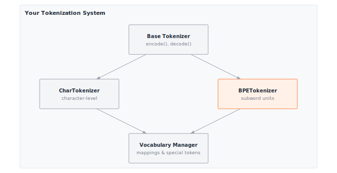

# Module 10: Tokenization

:::{.callout-note title="Module Info"}

**ARCHITECTURE TIER** | Difficulty: ●●○○ | Time: 4-6 hours | Prerequisites: 01-08

You should have completed the Foundation tier:

- Tensor operations (Module 01)
- Basic neural network components (Modules 02-04)
- Training fundamentals (Modules 05-07)

Tokenization stands largely on its own — it works with strings and dictionaries, not gradients. If you can manipulate Python strings, you're ready.
:::

```{=html}
<div class="action-cards">
<div class="action-card">
<h4>🎧 Audio Overview</h4>
<p>Listen to an AI-generated overview.</p>
<audio controls style="width: 100%; height: 54px;">
<source src="https://github.com/harvard-edge/cs249r_book/releases/download/tinytorch-audio-v0.1.1/10_tokenization.mp3" type="audio/mpeg">
</audio>
</div>
<div class="action-card">
<h4>🚀 Launch Binder</h4>
<p>Run interactively in your browser.</p>
<a href="https://mybinder.org/v2/gh/harvard-edge/cs249r_book/main?labpath=tinytorch%2Fmodules%2F10_tokenization%2Ftokenization.ipynb" class="action-btn btn-orange">Open in Binder →</a>
</div>
<div class="action-card">
<h4>📄 View Source</h4>
<p>Browse the source code on GitHub.</p>
<a href="https://github.com/harvard-edge/cs249r_book/blob/main/tinytorch/src/10_tokenization/10_tokenization.py" class="action-btn btn-teal">View on GitHub →</a>
</div>
</div>

<style>
.slide-viewer-container {
  margin: 0.5rem 0 1.5rem 0;
  background: #0f172a;
  border-radius: 1rem;
  overflow: hidden;
  box-shadow: 0 4px 20px rgba(0,0,0,0.15);
}
.slide-header {
  display: flex;
  align-items: center;
  justify-content: space-between;
  padding: 0.6rem 1rem;
  background: rgba(255,255,255,0.03);
}
.slide-title {
  display: flex;
  align-items: center;
  gap: 0.5rem;
  color: #94a3b8;
  font-weight: 500;
  font-size: 0.85rem;
}
.slide-subtitle {
  color: #64748b;
  font-weight: 400;
  font-size: 0.75rem;
}
.slide-toolbar {
  display: flex;
  align-items: center;
  gap: 0.375rem;
}
.slide-toolbar button {
  background: transparent;
  border: none;
  color: #64748b;
  width: 32px;
  height: 32px;
  border-radius: 0.375rem;
  cursor: pointer;
  font-size: 1.1rem;
  transition: all 0.15s;
  display: flex;
  align-items: center;
  justify-content: center;
}
.slide-toolbar button:hover {
  background: rgba(249, 115, 22, 0.15);
  color: #f97316;
}
.slide-nav-group {
  display: flex;
  align-items: center;
}
.slide-page-info {
  color: #64748b;
  font-size: 0.75rem;
  padding: 0 0.5rem;
  font-weight: 500;
}
.slide-zoom-group {
  display: flex;
  align-items: center;
  margin-left: 0.25rem;
  padding-left: 0.5rem;
  border-left: 1px solid rgba(255,255,255,0.1);
}
.slide-canvas-wrapper {
  display: flex;
  justify-content: center;
  align-items: center;
  padding: 0.5rem 1rem 1rem 1rem;
  min-height: 380px;
  background: #0f172a;
}
.slide-canvas {
  max-width: 100%;
  max-height: 350px;
  height: auto;
  border-radius: 0.5rem;
  box-shadow: 0 4px 24px rgba(0,0,0,0.4);
}
.slide-progress-wrapper {
  padding: 0 1rem 0.5rem 1rem;
}
.slide-progress-bar {
  height: 3px;
  background: rgba(255,255,255,0.08);
  border-radius: 1.5px;
  overflow: hidden;
  cursor: pointer;
}
.slide-progress-fill {
  height: 100%;
  background: #f97316;
  border-radius: 1.5px;
  transition: width 0.2s ease;
}
.slide-loading {
  color: #f97316;
  font-size: 0.9rem;
  display: flex;
  align-items: center;
  gap: 0.5rem;
}
.slide-loading::before {
  content: '';
  width: 18px;
  height: 18px;
  border: 2px solid rgba(249, 115, 22, 0.2);
  border-top-color: #f97316;
  border-radius: 50%;
  animation: slide-spin 0.8s linear infinite;
}
@keyframes slide-spin {
  to { transform: rotate(360deg); }
}
.slide-footer {
  display: flex;
  justify-content: center;
  gap: 0.5rem;
  padding: 0.6rem 1rem;
  background: rgba(255,255,255,0.02);
  border-top: 1px solid rgba(255,255,255,0.05);
}
.slide-footer a {
  display: inline-flex;
  align-items: center;
  gap: 0.375rem;
  background: #f97316;
  color: white;
  padding: 0.4rem 0.9rem;
  border-radius: 2rem;
  text-decoration: none;
  font-weight: 500;
  font-size: 0.75rem;
  transition: all 0.15s;
}
.slide-footer a:hover {
  background: #ea580c;
  color: white;
}
.slide-footer a.secondary {
  background: transparent;
  color: #94a3b8;
  border: 1px solid rgba(255,255,255,0.15);
}
.slide-footer a.secondary:hover {
  background: rgba(255,255,255,0.05);
  color: #f8fafc;
}
@media (max-width: 600px) {
  .slide-header { flex-direction: column; gap: 0.5rem; padding: 0.5rem 0.75rem; }
  .slide-toolbar button { width: 28px; height: 28px; }
  .slide-canvas-wrapper { min-height: 260px; padding: 0.5rem; }
  .slide-canvas { max-height: 220px; }
}
</style>

<div class="slide-viewer-container" id="slide-viewer-10_tokenization">
<div class="slide-header">
<div class="slide-title">
<span>🔥</span>
<span>Slide Deck</span>

<span class="slide-subtitle">· AI-generated</span>
</div>
<div class="slide-toolbar">
<div class="slide-nav-group">
<button onclick="slideNav('10_tokenization', -1)" title="Previous">‹</button>
<span class="slide-page-info"><span id="slide-num-10_tokenization">1</span> / <span id="slide-count-10_tokenization">-</span></span>
<button onclick="slideNav('10_tokenization', 1)" title="Next">›</button>
</div>
<div class="slide-zoom-group">
<button onclick="slideZoom('10_tokenization', -0.25)" title="Zoom out">−</button>
<button onclick="slideZoom('10_tokenization', 0.25)" title="Zoom in">+</button>
</div>
</div>
</div>
<div class="slide-canvas-wrapper">
<div id="slide-loading-10_tokenization" class="slide-loading">Loading slides...</div>
<canvas id="slide-canvas-10_tokenization" class="slide-canvas" style="display:none;"></canvas>
</div>
<div class="slide-progress-wrapper">
<div class="slide-progress-bar" onclick="slideProgress('10_tokenization', event)">
<div class="slide-progress-fill" id="slide-progress-10_tokenization" style="width: 0%;"></div>
</div>
</div>
<div class="slide-footer">
<a href="../assets/slides/10_tokenization.pdf" download>⬇ Download</a>
<a href="#" onclick="slideFullscreen('10_tokenization'); return false;" class="secondary">⛶ Fullscreen</a>
</div>
</div>

<script src="https://cdnjs.cloudflare.com/ajax/libs/pdf.js/3.11.174/pdf.min.js"></script>
<script>
(function() {
  if (window.slideViewersInitialized) return;
  window.slideViewersInitialized = true;

  pdfjsLib.GlobalWorkerOptions.workerSrc = 'https://cdnjs.cloudflare.com/ajax/libs/pdf.js/3.11.174/pdf.worker.min.js';

  window.slideViewers = {};

  window.initSlideViewer = function(id, pdfUrl) {
    const viewer = { pdf: null, page: 1, scale: 1.3, rendering: false, pending: null };
    window.slideViewers[id] = viewer;

    const canvas = document.getElementById('slide-canvas-' + id);
    const ctx = canvas.getContext('2d');

    function render(num) {
      viewer.rendering = true;
      viewer.pdf.getPage(num).then(function(page) {
        const viewport = page.getViewport({scale: viewer.scale});
        canvas.height = viewport.height;
        canvas.width = viewport.width;
        page.render({canvasContext: ctx, viewport: viewport}).promise.then(function() {
          viewer.rendering = false;
          if (viewer.pending !== null) { render(viewer.pending); viewer.pending = null; }
        });
      });
      document.getElementById('slide-num-' + id).textContent = num;
      document.getElementById('slide-progress-' + id).style.width = (num / viewer.pdf.numPages * 100) + '%';
    }

    function queue(num) { if (viewer.rendering) viewer.pending = num; else render(num); }

    pdfjsLib.getDocument(pdfUrl).promise.then(function(pdf) {
      viewer.pdf = pdf;
      document.getElementById('slide-count-' + id).textContent = pdf.numPages;
      document.getElementById('slide-loading-' + id).style.display = 'none';
      canvas.style.display = 'block';
      render(1);
    }).catch(function() {
      document.getElementById('slide-loading-' + id).innerHTML = 'Unable to load. <a href="' + pdfUrl + '" style="color:#f97316;">Download PDF</a>';
    });

    viewer.queue = queue;
  };

  window.slideNav = function(id, dir) {
    const v = window.slideViewers[id];
    if (!v || !v.pdf) return;
    const newPage = v.page + dir;
    if (newPage >= 1 && newPage <= v.pdf.numPages) { v.page = newPage; v.queue(newPage); }
  };

  window.slideZoom = function(id, delta) {
    const v = window.slideViewers[id];
    if (!v) return;
    v.scale = Math.max(0.5, Math.min(3, v.scale + delta));
    v.queue(v.page);
  };

  window.slideProgress = function(id, event) {
    const v = window.slideViewers[id];
    if (!v || !v.pdf) return;
    const bar = event.currentTarget;
    const pct = (event.clientX - bar.getBoundingClientRect().left) / bar.offsetWidth;
    const newPage = Math.max(1, Math.min(v.pdf.numPages, Math.ceil(pct * v.pdf.numPages)));
    if (newPage !== v.page) { v.page = newPage; v.queue(newPage); }
  };

  window.slideFullscreen = function(id) {
    const el = document.getElementById('slide-viewer-' + id);
    if (el.requestFullscreen) el.requestFullscreen();
    else if (el.webkitRequestFullscreen) el.webkitRequestFullscreen();
  };
})();

initSlideViewer('10_tokenization', '../assets/slides/10_tokenization.pdf');

</script>

```
## Overview

Text isn't the input to a language model. *Tokens* are. Before a single matrix multiply happens inside GPT, every character of your prompt has already been chopped, merged, and looked up in a fixed vocabulary — and that one upstream choice silently decides how long your sequences are, how big your embedding table is, and how much an inference call costs.

In this module you build two tokenizers from scratch: a character-level tokenizer (one character, one token) and a Byte Pair Encoding (BPE) tokenizer that learns subword units from data. Doing both surfaces the central trade-off: small vocabularies yield long sequences and tiny embedding tables; large vocabularies yield short sequences but multi-megabyte embeddings. Attention cost scales quadratically with sequence length, so this trade is rarely close.

By the end you can explain why GPT uses ~50,000 tokens, how tokenizers degrade gracefully on unknown words, and how the vocabulary you pick today caps the throughput of every model you train tomorrow.

## Learning Objectives

:::{.callout-tip title="By completing this module, you will:"}

- **Implement** character-level tokenization for robust text coverage and BPE tokenization for efficient subword representation
- **Understand** the vocabulary size versus sequence length trade-off and its impact on memory and computation
- **Master** encoding and decoding operations that convert between text and numerical token IDs
- **Connect** your implementation to production tokenizers used in GPT, BERT, and modern language models
:::

## What You'll Build


::: {#fig-10_tokenization-diag-1 fig-env="figure" fig-pos="htb" fig-cap="**TinyTorch Tokenization Infrastructure**: Converting raw text into model-ready numerical sequences." fig-alt="Diagram showing the Tokenizer interface and its implementations (CharTokenizer, BPETokenizer) feeding into vocabulary management."}



:::


**Implementation roadmap:**

| Part | What You'll Implement | Key Concept |
|------|----------------------|-------------|
| 1 | `Tokenizer` base class | Interface contract: encode/decode |
| 2 | `CharTokenizer` | Character-level vocabulary, perfect coverage |
| 3 | `BPETokenizer` | Byte Pair Encoding, learning merges |
| 4 | Vocabulary building | Unique character extraction, frequency analysis |
| 5 | Utility functions | Dataset processing, analysis tools |

**The pattern you'll enable:**
```python
# Converting text to numbers for neural networks
tokenizer = BPETokenizer(vocab_size=1000)
tokenizer.train(corpus)
token_ids = tokenizer.encode("Hello world")  # [142, 1847, 2341]
```

### What You're NOT Building (Yet)

To keep this module focused, you will **not** implement:

- GPU-accelerated tokenization (production tokenizers use Rust/C++)
- Advanced segmentation algorithms (SentencePiece, Unigram models)
- Language-specific preprocessing (Unicode normalization, byte-level fallback)
- Tokenizer serialization and loading (PyTorch handles this with `save_pretrained()`)

**You are building the conceptual foundation.** Production optimizations come later.

## API Reference

This section provides a quick reference for the tokenization classes you'll build. Think of it as your cheat sheet while implementing and debugging.

### Base Tokenizer Interface

```python
Tokenizer()
```
- Abstract base class defining the tokenizer contract
- All tokenizers must implement `encode()` and `decode()`

### CharTokenizer

```python
CharTokenizer(vocab: Optional[List[str]] = None)
```
- Character-level tokenizer treating each character as a token
- `vocab`: Optional list of characters to include in vocabulary

| Method | Signature | Description |
|--------|-----------|-------------|
| `build_vocab` | `build_vocab(corpus: List[str]) -> None` | Extract unique characters from corpus |
| `encode` | `encode(text: str) -> List[int]` | Convert text to character IDs |
| `decode` | `decode(tokens: List[int]) -> str` | Convert character IDs back to text |

**Properties:**
- `vocab`: List of characters in vocabulary
- `vocab_size`: Total number of unique characters + special tokens
- `char_to_id`: Mapping from characters to IDs
- `id_to_char`: Mapping from IDs to characters
- `unk_id`: ID for unknown characters (always 0)

### BPETokenizer

```python
BPETokenizer(vocab_size: int = 1000)
```
- Byte Pair Encoding tokenizer learning subword units
- `vocab_size`: Target vocabulary size after training

| Method | Signature | Description |
|--------|-----------|-------------|
| `train` | `train(corpus: List[str], vocab_size: int = None) -> None` | Learn BPE merges from corpus |
| `encode` | `encode(text: str) -> List[int]` | Convert text to subword token IDs |
| `decode` | `decode(tokens: List[int]) -> str` | Convert token IDs back to text |

**Helper Methods:**
| Method | Signature | Description |
|--------|-----------|-------------|
| `_get_word_tokens` | `_get_word_tokens(word: str) -> List[str]` | Convert word to character list with end-of-word marker |
| `_get_pairs` | `_get_pairs(word_tokens: List[str]) -> Set[Tuple[str, str]]` | Extract all adjacent character pairs |
| `_apply_merges` | `_apply_merges(tokens: List[str]) -> List[str]` | Apply learned merge rules to token sequence |
| `_build_mappings` | `_build_mappings() -> None` | Build token-to-ID and ID-to-token dictionaries |

**Properties:**
- `vocab`: List of tokens (characters + learned merges)
- `vocab_size`: Total vocabulary size
- `merges`: List of learned merge rules (pair tuples)
- `token_to_id`: Mapping from tokens to IDs
- `id_to_token`: Mapping from IDs to tokens

### Utility Functions

| Function | Signature | Description |
|----------|-----------|-------------|
| `create_tokenizer` | `create_tokenizer(strategy: str, vocab_size: int, corpus: List[str]) -> Tokenizer` | Factory for creating tokenizers |
| `tokenize_dataset` | `tokenize_dataset(texts: List[str], tokenizer: Tokenizer, max_length: int) -> List[List[int]]` | Batch tokenization with length limits |
| `analyze_tokenization` | `analyze_tokenization(texts: List[str], tokenizer: Tokenizer) -> Dict[str, float]` | Compute statistics and metrics |

## Core Concepts

This section covers the fundamental ideas you need to understand tokenization deeply. These concepts apply to every NLP system, from simple chatbots to large language models.

### Text to Numbers

Neural networks process numbers, not text. When you pass the string "Hello" to a model, it must first become a sequence of integers. This transformation happens in four steps: split text into tokens (units of meaning), build a vocabulary mapping each unique token to an integer ID, encode text by looking up each token's ID, and enable decoding to reconstruct the original text from IDs.

The simplest approach treats each character as a token. Consider the word "hello": split into characters `['h', 'e', 'l', 'l', 'o']`, build a vocabulary with IDs `{'h': 1, 'e': 2, 'l': 3, 'o': 4}`, encode to `[1, 2, 3, 3, 4]`, and decode back by reversing the lookup. This implementation is beautifully simple:

```python
def encode(self, text: str) -> List[int]:
    """Encode text to list of character IDs."""
    tokens = []
    for char in text:
        tokens.append(self.char_to_id.get(char, self.unk_id))
    return tokens
```

The elegance is in the simplicity: iterate through each character, look up its ID in the vocabulary dictionary, and use the unknown token ID for unseen characters. This gives perfect coverage: any text can be encoded without errors, though the sequences can be long.

### Vocabulary Building

Before encoding text, you need a vocabulary: the complete set of tokens your tokenizer recognizes. For character-level tokenization, this means extracting all unique characters from a training corpus.

To construct this vocabulary systematically, we extract every unique character observed in the training corpus and sort them to ensure a consistent mapping:

```python
def build_vocab(self, corpus: List[str]) -> None:
    """Build vocabulary from a corpus of text."""
    # Collect all unique characters
    all_chars = set()
    for text in corpus:
        all_chars.update(text)

    # Sort for consistent ordering
    unique_chars = sorted(list(all_chars))

    # Rebuild vocabulary with <UNK> token first
    self.vocab = ['<UNK>'] + unique_chars
    self.vocab_size = len(self.vocab)

    # Rebuild mappings
    self.char_to_id = {char: idx for idx, char in enumerate(self.vocab)}
    self.id_to_char = {idx: char for idx, char in enumerate(self.vocab)}
```

The special `<UNK>` token at position 0 handles characters not in the vocabulary. When encoding text with unknown characters, they all map to ID 0. This graceful degradation prevents crashes while signaling that information was lost.

Character vocabularies are tiny: typically 50-200 tokens depending on language, which means small embedding tables. A 100-character vocabulary with 512-dimensional embeddings requires only **51,200 parameters**, about **200 KB** of memory — dramatically smaller than word-level vocabularies with 100,000+ entries.

### Byte Pair Encoding (BPE)

Character tokenization has one fatal flaw: the sequences are too long. A 50-word sentence becomes ~250 tokens, attention costs scale with the *square* of that length, and the model has to learn from scratch that `'h','e','l','l','o'` is the same thing as `'h','e','l','p'` plus one swap.

BPE fixes this by learning subword units from the data itself. The algorithm is four lines: start with a character-level vocabulary, count all adjacent character pairs in the corpus, merge the most frequent pair into a new token, and repeat until you hit the target vocabulary size.

Consider training BPE on the corpus `["hello", "hello", "help"]`. Each word starts with end-of-word markers: `['h','e','l','l','o</w>']`, `['h','e','l','l','o</w>']`, `['h','e','l','p</w>']`. Count all pairs: `('h','e')` appears 3 times, `('e','l')` appears 3 times, `('l','l')` appears 2 times. The most frequent is `('h','e')`, so merge it:

```text
# Merge operation: ('h', 'e') → 'he'
# Before:
['h','e','l','l','o</w>']  →  ['he','l','l','o</w>']
['h','e','l','l','o</w>']  →  ['he','l','l','o</w>']
['h','e','l','p</w>']      →  ['he','l','p</w>']
```

The vocabulary grows from `['h','e','l','o','p','</w>']` to `['h','e','l','o','p','</w>','he']`. Continue merging: next most frequent is `('l','l')`, so merge to get `'ll'`. The vocabulary becomes `['h','e','l','o','p','</w>','he','ll']`. After sufficient merges, "hello" encodes as `['he','ll','o</w>']` (3 tokens instead of 5 characters).

Here's how the training loop works:

```python
while len(self.vocab) < self.vocab_size:
    # Count all pairs across all words
    pair_counts = Counter()
    for word, freq in word_freq.items():
        tokens = word_tokens[word]
        pairs = self._get_pairs(tokens)
        for pair in pairs:
            pair_counts[pair] += freq

    if not pair_counts:
        break

    # Get most frequent pair
    best_pair = pair_counts.most_common(1)[0][0]

    # Merge this pair in all words
    for word in word_tokens:
        tokens = word_tokens[word]
        new_tokens = []
        i = 0
        while i < len(tokens):
            if (i < len(tokens) - 1 and
                tokens[i] == best_pair[0] and
                tokens[i + 1] == best_pair[1]):
                # Merge pair
                new_tokens.append(best_pair[0] + best_pair[1])
                i += 2
            else:
                new_tokens.append(tokens[i])
                i += 1
        word_tokens[word] = new_tokens

    # Add merged token to vocabulary
    merged_token = best_pair[0] + best_pair[1]
    self.vocab.append(merged_token)
    self.merges.append(best_pair)
```

This iterative merging automatically discovers linguistic patterns: common prefixes ("un", "re"), suffixes ("ing", "ed"), and frequent words become single tokens. The algorithm requires no linguistic knowledge, learning purely from statistics.

### Special Tokens

Production tokenizers include special tokens beyond `<UNK>`. Common ones include `<PAD>` for padding sequences to equal length, `<BOS>` (beginning of sequence) and `<EOS>` (end of sequence) for marking boundaries, and `<SEP>` for separating multiple text segments. GPT-style models often use `<|endoftext|>` to mark document boundaries.

The choice of special tokens affects the embedding table size. If you reserve 10 special tokens and have a 50,000 token vocabulary, your embedding table has 50,010 rows. Each special token needs learned parameters just like regular tokens.

### Encoding and Decoding

Encoding converts text to token IDs; decoding reverses the process. For BPE, encoding requires applying learned merge rules in order:

```python
def encode(self, text: str) -> List[int]:
    """Encode text using BPE."""
    # Split text into words
    words = text.split()
    all_tokens = []

    for word in words:
        # Get character-level tokens
        word_tokens = self._get_word_tokens(word)

        # Apply BPE merges
        merged_tokens = self._apply_merges(word_tokens)

        all_tokens.extend(merged_tokens)

    # Convert to IDs
    token_ids = []
    for token in all_tokens:
        token_ids.append(self.token_to_id.get(token, 0))  # 0 = <UNK>

    return token_ids
```

Decoding is simpler: look up each ID, join the tokens, and clean up markers:

```python
def decode(self, tokens: List[int]) -> str:
    """Decode token IDs back to text."""
    # Convert IDs to tokens
    token_strings = []
    for token_id in tokens:
        token = self.id_to_token.get(token_id, '<UNK>')
        token_strings.append(token)

    # Join and clean up
    text = ''.join(token_strings)

    # Replace end-of-word markers with spaces
    text = text.replace('</w>', ' ')

    # Clean up extra spaces
    text = ' '.join(text.split())

    return text
```

The round-trip text → IDs → text should be lossless for known vocabulary. Unknown tokens degrade gracefully, mapping to `<UNK>` in both directions.

### Computational Complexity

Character tokenization is fast: encoding is O(n) where n is the string length (one dictionary lookup per character), and decoding is also O(n) (one reverse lookup per ID). The operations are embarrassingly parallel since each character processes independently.

BPE is slower due to merge rule application. Training BPE scales approximately O(n² × m) where n is corpus size and m is the number of merges. Each merge iteration requires counting all pairs across the entire corpus, then updating token sequences. For a 10,000-word corpus learning 5,000 merges, this can take seconds to minutes depending on implementation.

Encoding with trained BPE is O(n × m) where n is text length and m is the number of merge rules. Each merge rule must scan the token sequence looking for applicable pairs. Production tokenizers optimize this with trie data structures and caching, achieving near-linear time.

| Operation | Character | BPE Training | BPE Encoding |
|-----------|-----------|--------------|--------------|
| **Complexity** | O(n) | O(n² × m) | O(n × m) |
| **Typical Speed** | 1-5 ms/1K chars | 100-1000 ms/10K corpus | 5-20 ms/1K chars |
| **Bottleneck** | Dictionary lookup | Pair frequency counting | Merge rule application |

### Vocabulary Size Versus Sequence Length

The fundamental trade-off in tokenization creates a spectrum of choices. Small vocabularies (100-500 tokens) produce long sequences because each token represents little information (individual characters or very common subwords). Large vocabularies (50,000+ tokens) produce short sequences because each token represents more information (whole words or meaningful subword units).

Memory and computation scale in opposite directions:

**Embedding table memory** = vocabulary size × embedding dimension × bytes per parameter
**Sequence processing cost** = sequence length² × embedding dimension (for attention)

A character tokenizer (vocab 100, dim 512) needs 100 × 512 × 4 = **200 KB** for embeddings. But a 50-word sentence produces roughly 250 character tokens, requiring 250² = **62,500** attention computations *per layer*.

A BPE tokenizer (vocab 50,000, dim 512) needs 50,000 × 512 × 4 = **97.7 MB** for embeddings. But the same 50-word sentence collapses to about 75 BPE tokens, requiring 75² = **5,625** attention computations per layer.

```{python}
#| echo: false

# Character tokenizer: vocab 100, dim 512, float32
char_embed_bytes = 100 * 512 * 4
char_seq_len = 250
char_attn = char_seq_len ** 2
tradeoff_char_embed = f"{char_embed_bytes / 1024:.0f} KB"
tradeoff_char_attn = f"{char_attn:,}"

# BPE tokenizer: vocab 50,000, dim 512, float32
bpe_embed_bytes = 50_000 * 512 * 4
bpe_seq_len = 75
bpe_attn = bpe_seq_len ** 2
tradeoff_bpe_embed = f"{bpe_embed_bytes / 1024**2:.1f} MB"
tradeoff_bpe_attn = f"{bpe_attn:,}"
```

A character tokenizer with a vocabulary of 100 and an embedding dimension of 512 requires a negligible `{python} tradeoff_char_embed` for its embedding table. However, a standard 50-word sentence explodes into roughly 250 individual character tokens. Because self-attention complexity scales quadratically with sequence length, this requires 250² = `{python} tradeoff_char_attn` attention computations *per layer*.

Conversely, a BPE tokenizer expands the vocabulary to 50,000, driving the embedding table footprint up to `{python} tradeoff_bpe_embed`. Yet, that exact same 50-word sentence compresses into a mere 75 BPE subword tokens, slashing the computational burden to just 75² = `{python} tradeoff_bpe_attn` attention operations per layer.

:::{.callout-note title="⚡ Systems Implication: The Attention Bottleneck"}
The monumental O(N²) computational savings in attention (`{python} tradeoff_char_attn` vs. `{python} tradeoff_bpe_attn` ops) absolutely dwarf the static VRAM penalty of hosting a massive embedding table (`{python} tradeoff_char_embed` vs. `{python} tradeoff_bpe_embed`). By condensing text into information-dense subwords, BPE tokenization explicitly trades static GPU memory capacity to aggressively alleviate the catastrophic sequence-length bottleneck in the Transformer's attention mechanism.
:::

This fundamental trade-off dictates the architecture of every production language model: large, static embedding tables are enthusiastically absorbed by VRAM precisely because the resulting abbreviated sequence lengths dramatically accelerate end-to-end training and real-time inference.

Modern language models balance these factors:

| Model | Vocabulary | Strategy | Sequence Length (typical) |
|-------|-----------|----------|---------------------------|
| **GPT-2/3** | 50,257 | BPE | ~50-200 tokens per sentence |
| **BERT** | 30,522 | WordPiece | ~40-150 tokens per sentence |
| **T5** | 32,128 | SentencePiece | ~40-180 tokens per sentence |
| **Character** | ~100 | Character | ~250-1000 tokens per sentence |

## Production Context

### Your Implementation vs. Production Tokenizers

Your TinyTorch tokenizers demonstrate the core algorithms, but production tokenizers optimize for speed and scale. The conceptual differences are minimal: the same BPE algorithm, the same vocabulary mappings, the same encode/decode operations. The implementation differences are dramatic.

| Feature | Your Implementation | Hugging Face Tokenizers |
|---------|---------------------|-------------------------|
| **Language** | Pure Python | Rust (compiled to native code) |
| **Speed** | 1-10 ms/sentence | 0.01-0.1 ms/sentence (100× faster) |
| **Parallelization** | Single-threaded | Multi-threaded with Rayon |
| **Vocabulary storage** | Python dict | Trie data structure |
| **Special features** | Basic encode/decode | Padding, truncation, attention masks |
| **Pretrained models** | Train from scratch | Load from Hugging Face Hub |

### Code Comparison

The following comparison shows equivalent tokenization in TinyTorch and Hugging Face. Notice how the high-level API mirrors production tools, making your learning transferable.

::: {.panel-tabset}
## Your TinyTorch
```python
from tinytorch.core.tokenization import BPETokenizer

# Train tokenizer on corpus
corpus = ["hello world", "machine learning"]
tokenizer = BPETokenizer(vocab_size=1000)
tokenizer.train(corpus)

# Encode text
text = "hello machine"
token_ids = tokenizer.encode(text)

# Decode back to text
decoded = tokenizer.decode(token_ids)
```

## Hugging Face
```python
from tokenizers import Tokenizer, models, trainers

# Train tokenizer on corpus (same algorithm!)
corpus = ["hello world", "machine learning"]
tokenizer = Tokenizer(models.BPE())
trainer = trainers.BpeTrainer(vocab_size=1000)
tokenizer.train_from_iterator(corpus, trainer)

# Encode text
text = "hello machine"
output = tokenizer.encode(text)
token_ids = output.ids

# Decode back to text
decoded = tokenizer.decode(token_ids)
```
:::

Let's walk through each section to understand the comparison:

- **Lines 1-3 (Imports)**: TinyTorch exposes `BPETokenizer` directly from the tokenization module. Hugging Face uses a more modular design with separate `models` and `trainers` for flexibility across algorithms (BPE, WordPiece, Unigram).

- **Lines 5-8 (Training)**: Both train on the same corpus using the same BPE algorithm. TinyTorch uses a simpler API with `train()` method. Hugging Face separates model definition from training for composability, but the underlying algorithm is identical.

- **Lines 10-12 (Encoding)**: TinyTorch returns a list of integers directly. Hugging Face returns an `Encoding` object with additional metadata (attention masks, offsets, etc.), and you extract the IDs with `.ids` attribute. Same numerical result.

- **Lines 14-15 (Decoding)**: Both use `decode()` with the token ID list. Output is identical. The core operation is the same: look up each ID in the vocabulary and join the tokens.

:::{.callout-tip title="What's Identical"}

The BPE algorithm, merge rule learning, vocabulary structure, and encode/decode logic. When you debug tokenization issues in production, you'll understand exactly what's happening because you built the same system.
:::

### Why Tokenization Matters at Scale

The cost of a tokenization choice is invisible on a single example and catastrophic at scale:

- **GPT-3 training**: Processing 300 billion tokens required careful vocabulary selection. Switching to character tokenization would have inflated sequence lengths by 3-4×, multiplying attention cost by 9-16× — adding millions of dollars to a single training run.

- **Embedding table memory**: A 50,000-token vocabulary with 12,288-dimensional embeddings (GPT-3) is 50,000 × 12,288 × 4 bytes = **2.29 GB** for the embedding layer alone. That is only **~0.35%** of GPT-3's 175 B parameters, yet it is the layer that touches every input on every forward pass.

- **Real-time inference**: Chatbots must tokenize user input in milliseconds. Python tokenizers take 5-20 ms per sentence; Rust tokenizers take 0.05-0.2 ms. At 1 million requests per day, the difference is roughly 5 hours of CPU time — every day.

## Check Your Understanding

Test yourself with these systems thinking questions. They're designed to build intuition for the performance characteristics you'll encounter in production NLP systems.

**Q1: Vocabulary Memory Calculation**

You train a BPE tokenizer with `vocab_size=30,000` for a production model. If using 768-dimensional embeddings with float32 precision, how much memory does the embedding table require?

:::{.callout-note collapse="true" title="Answer"}

30,000 × 768 × 4 bytes = **92,160,000 bytes ≈ 87.89 MB**

Breakdown:

- Vocabulary size: 30,000 tokens
- Embedding dimension: 768 (BERT-base size)
- Float32: 4 bytes per parameter
- Total parameters: 30,000 × 768 = 23,040,000
- Memory: 23.04M × 4 = 87.89 MB

This is why vocabulary size matters. Doubling to 60K vocab doubles embedding memory to ~176 MB — and you pay it once at load time, every time, on every device.
:::

**Q2: Sequence Length Trade-offs**

A sentence contains 200 characters. With character tokenization it produces 200 tokens. With BPE it produces 50 tokens (4:1 compression). If processing batch size 32 with attention:

- How many attention computations for character tokenization per batch?
- How many for BPE tokenization per batch?

:::{.callout-note collapse="true" title="Answer"}

**Character tokenization:**

- Sequence length: 200 tokens
- Attention per sequence: 200² = 40,000 operations
- Batch size: 32
- Total: 32 × 40,000 = **1,280,000 attention operations**

**BPE tokenization:**

- Sequence length: 50 tokens (200 chars ÷ 4)
- Attention per sequence: 50² = 2,500 operations
- Batch size: 32
- Total: 32 × 2,500 = **80,000 attention operations**

BPE is **16× faster** at attention. This is why modern models use subword tokenization despite the larger embedding table.
:::

**Q3: Unknown Token Handling**

Your BPE tokenizer encounters the word "supercalifragilistic" (not in training corpus). Character tokenizer maps it to 20 known tokens. BPE tokenizer decomposes it into subwords like `['super', 'cal', 'ifr', 'ag', 'il', 'istic']` (6 tokens). Which is better?

:::{.callout-note collapse="true" title="Answer"}

**BPE is better for production:**

- **Efficiency**: 6 tokens vs 20 tokens — a 3.3× shorter sequence
- **Semantics**: Subwords like "super" and "istic" carry meaning; individual characters don't
- **Generalization**: Model learns that the "super" prefix modifies meaning (superman, supermarket)
- **Compute**: 36 attention computations vs 400 (~11× fewer)

**Character tokenization advantages:**

- **Perfect coverage**: Never emits `<UNK>`, always reconstructs the original text
- **Simplicity**: No merge rules, no training step

For rare or out-of-vocabulary words, BPE's subword decomposition wins on both efficiency and semantics, which is why GPT, BERT, and T5 all use variants of subword tokenization.
:::

**Q4: Compression Ratio Analysis**

You analyze two tokenizers on a 10,000 character corpus:

- Character tokenizer: 10,000 tokens
- BPE tokenizer: 2,500 tokens

What's the compression ratio, and what does it tell you about efficiency?

:::{.callout-note collapse="true" title="Answer"}

**Compression ratio: 10,000 ÷ 2,500 = 4.0**

Each BPE token represents an average of 4 characters.

**Efficiency implications:**

- **Sequence processing**: 4.0× shorter sequences → 16× faster attention (quadratic scaling)
- **Context window**: With max length 512, the character tokenizer fits 512 chars (~100 words); BPE fits 2,048 chars (~400 words)
- **Information density**: Each BPE token carries more semantic information (subword vs character)

**Trade-off**: BPE vocabulary is ~100× larger (10K tokens vs 100), pushing embedding memory from ~200 KB to ~20 MB. The trade favors BPE heavily once you stack multiple transformer layers and attention dominates the cost.
:::

**Q5: Training Corpus Size Impact**

Training BPE on 1,000 words takes 100ms. How long will 10,000 words take? What about 100,000 words?

:::{.callout-note collapse="true" title="Answer"}

BPE training scales approximately **O(n²)** where n is corpus size (each merge re-counts every pair across the corpus).

- **1,000 words**: 100 ms (baseline)
- **10,000 words**: ~10,000 ms = 10 seconds (100× longer, from 10² scaling)
- **100,000 words**: ~1,000,000 ms = 1,000 seconds ≈ **16.7 minutes** (10,000× longer)

**Production strategies to handle this:**

- Sample a representative subset (~50K-100K sentences is usually enough)
- Use incremental/online BPE that doesn't recount all pairs each iteration
- Parallelize pair counting across corpus chunks
- Cache frequent pair statistics
- Use optimized implementations (Rust, C++) that are 100-1000× faster

Note: encoding with a *trained* BPE tokenizer is fast (near-linear). Only the training phase is expensive.
:::

## Further Reading

For students who want to understand the academic foundations and production implementations of tokenization:

### Seminal Papers

- **Neural Machine Translation of Rare Words with Subword Units** - Sennrich et al. (2016). The original BPE paper that introduced subword tokenization for neural machine translation. Shows how BPE handles rare words through intelligent subword decomposition, achieving superior translation quality.
  - **Systems Implication:** By mathematically compressing raw text into information-dense subword tokens, this algorithm radically reduced average sequence lengths. This directly mitigated the crippling O(N²) memory and compute bottlenecks inherent to sequence-processing attention layers, enabling the modern LLM era. [arXiv:1508.07909](https://arxiv.org/abs/1508.07909)

- **SentencePiece: A simple and language independent approach to subword tokenization** - Kudo & Richardson (2018). Extends BPE with a language-agnostic, raw-text-to-token pipeline that elegantly sidesteps brittle regex pre-tokenization rules. Used extensively in T5, ALBERT, and LLaMA.
  - **Systems Implication:** SentencePiece cleanly eliminated complex, language-specific text pre-processing heuristics from the dataloader. By absorbing the entire pipeline into a unified, heavily optimized C++ binary, it prevented host CPUs from bottlenecking the GPU during massive-scale text ingestion. [arXiv:1808.06226](https://arxiv.org/abs/1808.06226)

- **BERT: Pre-training of Deep Bidirectional Transformers** - Devlin et al. (2018). While primarily focused on bidirectional transformer encoders, this paper formally introduced WordPiece tokenization to the mass-market NLP ecosystem.
  - **Systems Implication:** By aggressively fixing the vocabulary size at 30,522 tokens, BERT strictly constrained the memory footprint of the final, massive softmax projection layer. This calculated engineering decision ensured the enormous output embedding matrix remained tightly bounded within the strict VRAM limits of 2018-era datacenter GPUs. [arXiv:1810.04805](https://arxiv.org/abs/1810.04805)

### Additional Resources

- **Library**: [Hugging Face Tokenizers](https://github.com/huggingface/tokenizers) - Production Rust implementation with Python bindings. Explore the source to see optimized BPE.
- **Tutorial**: "Byte Pair Encoding Tokenization" - [Hugging Face Course](https://huggingface.co/learn/nlp-course/chapter6/5) - Interactive tutorial showing BPE in action with visualizations
- **Textbook**: "Speech and Language Processing" by Jurafsky & Martin - Chapter 2 covers tokenization, including Unicode handling and language-specific issues

## What's Next

:::{.callout-note title="Coming Up: Module 11 — Embeddings"}

You now have integer token IDs. Integers, however, are *opaque*: ID 142 and ID 143 are no more related than ID 142 and ID 9,001. The next module turns those IDs into **learnable dense vectors** so that "king" and "queen" can sit close together in space, and so that gradients can actually flow through your model. The vocabulary you fixed in this module sets the number of rows in that embedding table — and therefore the bulk of the parameters at the input of every transformer you'll build.
:::

**Preview — how your tokenizer feeds the rest of the stack:**

| Module | What It Does | Your Tokenization In Action |
|--------|--------------|----------------------------|
| **11: Embeddings** | Learnable lookup tables | `embedding = Embedding(vocab_size=1000, dim=128)` |
| **12: Attention** | Sequence-to-sequence processing | Token sequences attend to each other |
| **13: Transformers** | Complete language models | Full pipeline: tokenize → embed → attend → predict |

## Get Started

:::{.callout-tip title="Interactive Options"}

- **[Launch Binder](https://mybinder.org/v2/gh/harvard-edge/cs249r_book/main?urlpath=lab/tree/tinytorch/modules/10_tokenization/tokenization.ipynb)** - Run interactively in browser, no setup required
- **[View Source](https://github.com/harvard-edge/cs249r_book/blob/main/tinytorch/src/10_tokenization/10_tokenization.py)** - Browse the implementation code
:::

:::{.callout-warning title="Save Your Progress"}

Binder sessions are temporary. Download your completed notebook when done, or clone the repository for persistent local work.
:::
 Transformers** | Complete language models | Full pipeline: tokenize → embed → attend → predict |

## Get Started

:::{.callout-tip title="Interactive Options"}

- **[Launch Binder](https://mybinder.org/v2/gh/harvard-edge/cs249r_book/main?urlpath=lab/tree/tinytorch/modules/10_tokenization/tokenization.ipynb)** - Run interactively in browser, no setup required
- **[View Source](https://github.com/harvard-edge/cs249r_book/blob/main/tinytorch/src/10_tokenization/10_tokenization.py)** - Browse the implementation code
:::

:::{.callout-warning title="Save Your Progress"}

Binder sessions are temporary. Download your completed notebook when done, or clone the repository for persistent local work.
:::
