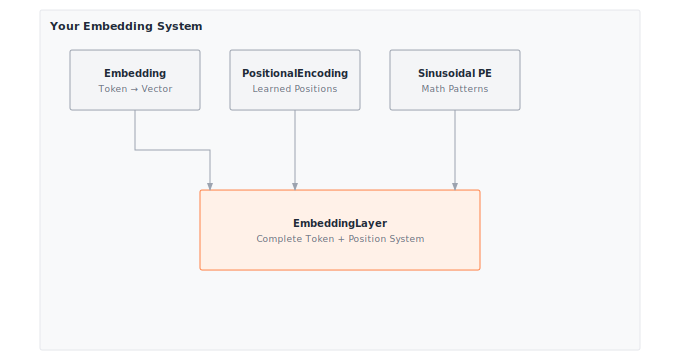

# Module 11: Embeddings

:::{.callout-note title="Module Info"}

**ARCHITECTURE TIER** | Difficulty: ●●○○ | Time: 3-5 hours | Prerequisites: 01-08, 10

**Prerequisites: Modules 01-08 and 10** means you should understand:

- Tensor operations (shape manipulation, matrix operations, broadcasting)
- Training fundamentals (forward/backward, optimization)
- Tokenization (converting text to token IDs, vocabularies)

If you can explain how a tokenizer converts "hello" to token IDs and how to multiply matrices, you're ready.
:::

```{=html}
<div class="action-cards">
<div class="action-card">
<h4>🎧 Audio Overview</h4>
<p>Listen to an AI-generated overview.</p>
<audio controls style="width: 100%; height: 54px;">
<source src="https://github.com/harvard-edge/cs249r_book/releases/download/tinytorch-audio-v0.1.1/11_embeddings.mp3" type="audio/mpeg">
</audio>
</div>
<div class="action-card">
<h4>🚀 Launch Binder</h4>
<p>Run interactively in your browser.</p>
<a href="https://mybinder.org/v2/gh/harvard-edge/cs249r_book/main?labpath=tinytorch%2Fmodules%2F11_embeddings%2Fembeddings.ipynb" class="action-btn btn-orange">Open in Binder →</a>
</div>
<div class="action-card">
<h4>📄 View Source</h4>
<p>Browse the source code on GitHub.</p>
<a href="https://github.com/harvard-edge/cs249r_book/blob/main/tinytorch/src/11_embeddings/11_embeddings.py" class="action-btn btn-teal">View on GitHub →</a>
</div>
</div>

<style>
.slide-viewer-container {
  margin: 0.5rem 0 1.5rem 0;
  background: #0f172a;
  border-radius: 1rem;
  overflow: hidden;
  box-shadow: 0 4px 20px rgba(0,0,0,0.15);
}
.slide-header {
  display: flex;
  align-items: center;
  justify-content: space-between;
  padding: 0.6rem 1rem;
  background: rgba(255,255,255,0.03);
}
.slide-title {
  display: flex;
  align-items: center;
  gap: 0.5rem;
  color: #94a3b8;
  font-weight: 500;
  font-size: 0.85rem;
}
.slide-subtitle {
  color: #64748b;
  font-weight: 400;
  font-size: 0.75rem;
}
.slide-toolbar {
  display: flex;
  align-items: center;
  gap: 0.375rem;
}
.slide-toolbar button {
  background: transparent;
  border: none;
  color: #64748b;
  width: 32px;
  height: 32px;
  border-radius: 0.375rem;
  cursor: pointer;
  font-size: 1.1rem;
  transition: all 0.15s;
  display: flex;
  align-items: center;
  justify-content: center;
}
.slide-toolbar button:hover {
  background: rgba(249, 115, 22, 0.15);
  color: #f97316;
}
.slide-nav-group {
  display: flex;
  align-items: center;
}
.slide-page-info {
  color: #64748b;
  font-size: 0.75rem;
  padding: 0 0.5rem;
  font-weight: 500;
}
.slide-zoom-group {
  display: flex;
  align-items: center;
  margin-left: 0.25rem;
  padding-left: 0.5rem;
  border-left: 1px solid rgba(255,255,255,0.1);
}
.slide-canvas-wrapper {
  display: flex;
  justify-content: center;
  align-items: center;
  padding: 0.5rem 1rem 1rem 1rem;
  min-height: 380px;
  background: #0f172a;
}
.slide-canvas {
  max-width: 100%;
  max-height: 350px;
  height: auto;
  border-radius: 0.5rem;
  box-shadow: 0 4px 24px rgba(0,0,0,0.4);
}
.slide-progress-wrapper {
  padding: 0 1rem 0.5rem 1rem;
}
.slide-progress-bar {
  height: 3px;
  background: rgba(255,255,255,0.08);
  border-radius: 1.5px;
  overflow: hidden;
  cursor: pointer;
}
.slide-progress-fill {
  height: 100%;
  background: #f97316;
  border-radius: 1.5px;
  transition: width 0.2s ease;
}
.slide-loading {
  color: #f97316;
  font-size: 0.9rem;
  display: flex;
  align-items: center;
  gap: 0.5rem;
}
.slide-loading::before {
  content: '';
  width: 18px;
  height: 18px;
  border: 2px solid rgba(249, 115, 22, 0.2);
  border-top-color: #f97316;
  border-radius: 50%;
  animation: slide-spin 0.8s linear infinite;
}
@keyframes slide-spin {
  to { transform: rotate(360deg); }
}
.slide-footer {
  display: flex;
  justify-content: center;
  gap: 0.5rem;
  padding: 0.6rem 1rem;
  background: rgba(255,255,255,0.02);
  border-top: 1px solid rgba(255,255,255,0.05);
}
.slide-footer a {
  display: inline-flex;
  align-items: center;
  gap: 0.375rem;
  background: #f97316;
  color: white;
  padding: 0.4rem 0.9rem;
  border-radius: 2rem;
  text-decoration: none;
  font-weight: 500;
  font-size: 0.75rem;
  transition: all 0.15s;
}
.slide-footer a:hover {
  background: #ea580c;
  color: white;
}
.slide-footer a.secondary {
  background: transparent;
  color: #94a3b8;
  border: 1px solid rgba(255,255,255,0.15);
}
.slide-footer a.secondary:hover {
  background: rgba(255,255,255,0.05);
  color: #f8fafc;
}
@media (max-width: 600px) {
  .slide-header { flex-direction: column; gap: 0.5rem; padding: 0.5rem 0.75rem; }
  .slide-toolbar button { width: 28px; height: 28px; }
  .slide-canvas-wrapper { min-height: 260px; padding: 0.5rem; }
  .slide-canvas { max-height: 220px; }
}
</style>

<div class="slide-viewer-container" id="slide-viewer-11_embeddings">
<div class="slide-header">
<div class="slide-title">
<span>🔥</span>
<span>Slide Deck</span>

<span class="slide-subtitle">· AI-generated</span>
</div>
<div class="slide-toolbar">
<div class="slide-nav-group">
<button onclick="slideNav('11_embeddings', -1)" title="Previous">‹</button>
<span class="slide-page-info"><span id="slide-num-11_embeddings">1</span> / <span id="slide-count-11_embeddings">-</span></span>
<button onclick="slideNav('11_embeddings', 1)" title="Next">›</button>
</div>
<div class="slide-zoom-group">
<button onclick="slideZoom('11_embeddings', -0.25)" title="Zoom out">−</button>
<button onclick="slideZoom('11_embeddings', 0.25)" title="Zoom in">+</button>
</div>
</div>
</div>
<div class="slide-canvas-wrapper">
<div id="slide-loading-11_embeddings" class="slide-loading">Loading slides...</div>
<canvas id="slide-canvas-11_embeddings" class="slide-canvas" style="display:none;"></canvas>
</div>
<div class="slide-progress-wrapper">
<div class="slide-progress-bar" onclick="slideProgress('11_embeddings', event)">
<div class="slide-progress-fill" id="slide-progress-11_embeddings" style="width: 0%;"></div>
</div>
</div>
<div class="slide-footer">
<a href="../assets/slides/11_embeddings.pdf" download>⬇ Download</a>
<a href="#" onclick="slideFullscreen('11_embeddings'); return false;" class="secondary">⛶ Fullscreen</a>
</div>
</div>

<script src="https://cdnjs.cloudflare.com/ajax/libs/pdf.js/3.11.174/pdf.min.js"></script>
<script>
(function() {
  if (window.slideViewersInitialized) return;
  window.slideViewersInitialized = true;

  pdfjsLib.GlobalWorkerOptions.workerSrc = 'https://cdnjs.cloudflare.com/ajax/libs/pdf.js/3.11.174/pdf.worker.min.js';

  window.slideViewers = {};

  window.initSlideViewer = function(id, pdfUrl) {
    const viewer = { pdf: null, page: 1, scale: 1.3, rendering: false, pending: null };
    window.slideViewers[id] = viewer;

    const canvas = document.getElementById('slide-canvas-' + id);
    const ctx = canvas.getContext('2d');

    function render(num) {
      viewer.rendering = true;
      viewer.pdf.getPage(num).then(function(page) {
        const viewport = page.getViewport({scale: viewer.scale});
        canvas.height = viewport.height;
        canvas.width = viewport.width;
        page.render({canvasContext: ctx, viewport: viewport}).promise.then(function() {
          viewer.rendering = false;
          if (viewer.pending !== null) { render(viewer.pending); viewer.pending = null; }
        });
      });
      document.getElementById('slide-num-' + id).textContent = num;
      document.getElementById('slide-progress-' + id).style.width = (num / viewer.pdf.numPages * 100) + '%';
    }

    function queue(num) { if (viewer.rendering) viewer.pending = num; else render(num); }

    pdfjsLib.getDocument(pdfUrl).promise.then(function(pdf) {
      viewer.pdf = pdf;
      document.getElementById('slide-count-' + id).textContent = pdf.numPages;
      document.getElementById('slide-loading-' + id).style.display = 'none';
      canvas.style.display = 'block';
      render(1);
    }).catch(function() {
      document.getElementById('slide-loading-' + id).innerHTML = 'Unable to load. <a href="' + pdfUrl + '" style="color:#f97316;">Download PDF</a>';
    });

    viewer.queue = queue;
  };

  window.slideNav = function(id, dir) {
    const v = window.slideViewers[id];
    if (!v || !v.pdf) return;
    const newPage = v.page + dir;
    if (newPage >= 1 && newPage <= v.pdf.numPages) { v.page = newPage; v.queue(newPage); }
  };

  window.slideZoom = function(id, delta) {
    const v = window.slideViewers[id];
    if (!v) return;
    v.scale = Math.max(0.5, Math.min(3, v.scale + delta));
    v.queue(v.page);
  };

  window.slideProgress = function(id, event) {
    const v = window.slideViewers[id];
    if (!v || !v.pdf) return;
    const bar = event.currentTarget;
    const pct = (event.clientX - bar.getBoundingClientRect().left) / bar.offsetWidth;
    const newPage = Math.max(1, Math.min(v.pdf.numPages, Math.ceil(pct * v.pdf.numPages)));
    if (newPage !== v.page) { v.page = newPage; v.queue(newPage); }
  };

  window.slideFullscreen = function(id) {
    const el = document.getElementById('slide-viewer-' + id);
    if (el.requestFullscreen) el.requestFullscreen();
    else if (el.webkitRequestFullscreen) el.webkitRequestFullscreen();
  };
})();

initSlideViewer('11_embeddings', '../assets/slides/11_embeddings.pdf');

</script>

```
## Overview

Neural networks operate on vectors. Language is made of tokens. Embeddings are how the two meet: a learnable lookup table that turns each integer token ID into a dense vector, so the rest of the network can do calculus on it.

Your tokenizer from Module 10 produces IDs like `[42, 7, 15]`. By the end of this module you have built the layer that turns those IDs into geometry — the same layer sitting at the input of every transformer from BERT to GPT-4 — and the positional encodings that tell the network *where* in the sequence each token lives.

## Learning Objectives

:::{.callout-tip title="By completing this module, you will:"}

- **Implement** embedding layers that convert token IDs to dense vectors through efficient table lookup
- **Master** positional encoding strategies including learned and sinusoidal approaches
- **Understand** memory scaling for embedding tables and the trade-offs between vocabulary size and embedding dimension
- **Connect** your implementation to production transformer architectures used in GPT and BERT
:::

## What You'll Build


::: {#fig-11_embeddings-diag-1 fig-env="figure" fig-pos="htb" fig-cap="**TinyTorch Embedding System**: Mapping tokens and positions to learned continuous representations." fig-alt="Diagram showing Embedding, learned PositionalEncoding, and mathematical Sinusoidal PE components combining into a complete EmbeddingLayer."}



:::


**Implementation roadmap:**

| Part | What You'll Implement | Key Concept |
|------|----------------------|-------------|
| 1 | `Embedding` class | Token ID to vector lookup via indexing |
| 2 | `PositionalEncoding` class | Learnable position embeddings |
| 3 | `create_sinusoidal_embeddings()` | Mathematical position encoding |
| 4 | `EmbeddingLayer` class | Complete token + position system |

**The pattern you'll enable:**
```python
# Converting tokens to position-aware dense vectors
embed_layer = EmbeddingLayer(vocab_size=50000, embed_dim=512)
tokens = Tensor([[1, 42, 7]])  # Token IDs from tokenizer
embeddings = embed_layer(tokens)  # (1, 3, 512) dense vectors ready for attention
```

### What You're NOT Building (Yet)

To keep this module focused, you will **not** implement:

- Attention mechanisms (that's Module 12: Attention)
- Full transformer architectures (that's Module 13: Transformers)
- Word2Vec or GloVe pretrained embeddings (you're building learnable embeddings)
- Subword embedding composition (PyTorch handles this at the tokenization level)

**You are building the foundation for sequence models.** Context-aware representations come next.

## API Reference

This section documents the embedding components you'll build. Use this as your reference while implementing and debugging.

### Embedding Class

```python
Embedding(vocab_size, embed_dim)
```

Learnable embedding layer that maps token indices to dense vectors through table lookup.

**Constructor Parameters:**
- `vocab_size` (int): Size of vocabulary (number of unique tokens)
- `embed_dim` (int): Dimension of embedding vectors

**Core Methods:**

| Method | Signature | Description |
|--------|-----------|-------------|
| `forward` | `forward(indices: Tensor) -> Tensor` | Lookup embeddings for token indices |
| `parameters` | `parameters() -> List[Tensor]` | Return weight matrix for optimization |

**Properties:**
- `weight`: Tensor of shape `(vocab_size, embed_dim)` containing learnable embeddings

### PositionalEncoding Class

```python
PositionalEncoding(max_seq_len, embed_dim)
```

Learnable positional encoding that adds trainable position-specific vectors to embeddings.

**Constructor Parameters:**
- `max_seq_len` (int): Maximum sequence length to support
- `embed_dim` (int): Embedding dimension (must match token embeddings)

**Core Methods:**

| Method | Signature | Description |
|--------|-----------|-------------|
| `forward` | `forward(x: Tensor) -> Tensor` | Add positional encodings to input embeddings |
| `parameters` | `parameters() -> List[Tensor]` | Return position embedding matrix |

### Sinusoidal Embeddings Function

```python
create_sinusoidal_embeddings(max_seq_len, embed_dim) -> Tensor
```

Creates fixed sinusoidal positional encodings using trigonometric functions. No parameters to learn.

**Mathematical Formula:**
```
PE(pos, 2i)   = sin(pos / 10000^(2i/embed_dim))
PE(pos, 2i+1) = cos(pos / 10000^(2i/embed_dim))
```

### EmbeddingLayer Class

```python
EmbeddingLayer(vocab_size, embed_dim, max_seq_len=512,
               pos_encoding='learned', scale_embeddings=False)
```

Complete embedding system combining token embeddings and positional encoding.

**Constructor Parameters:**
- `vocab_size` (int): Size of vocabulary
- `embed_dim` (int): Embedding dimension
- `max_seq_len` (int): Maximum sequence length for positional encoding
- `pos_encoding` (str): Type of positional encoding ('learned', 'sinusoidal', or None)
- `scale_embeddings` (bool): Whether to scale by sqrt(embed_dim) (transformer convention)

**Core Methods:**

| Method | Signature | Description |
|--------|-----------|-------------|
| `forward` | `forward(tokens: Tensor) -> Tensor` | Complete embedding pipeline |
| `parameters` | `parameters() -> List[Tensor]` | All trainable parameters |

## Core Concepts

Four ideas carry the rest of this chapter: lookup-as-matmul, sparse gradient updates, the learned-vs-fixed positional tradeoff, and the memory cost of embedding dimension. Every modern language model is built from them.

### From Indices to Vectors

Neural networks consume continuous vectors; language arrives as discrete IDs. After the tokenizer turns "the cat sat" into `[1, 42, 7]`, you need a way to give those integers geometry.

The embedding layer is that bridge: a learnable matrix where row `i` is the vector for token `i`. For a 50,000-token vocabulary with 512-dimensional embeddings, the table is shape `(50000, 512)`, initialized small. Training nudges similar words toward similar rows — semantic relationships emerge as geometric proximity.

The implementation is one line of NumPy:

```python
def forward(self, indices: Tensor) -> Tensor:
    """Forward pass: lookup embeddings for given indices."""
    # Validate indices are in range
    if np.any(indices.data >= self.vocab_size) or np.any(indices.data < 0):
        raise ValueError(
            f"Index out of range. Expected 0 <= indices < {self.vocab_size}, "
            f"got min={np.min(indices.data)}, max={np.max(indices.data)}"
        )

    # Perform embedding lookup using advanced indexing
    # This is equivalent to one-hot multiplication but much more efficient
    embedded = self.weight.data[indices.data.astype(int)]

    # Create result tensor with gradient tracking
    result = Tensor(embedded, requires_grad=self.weight.requires_grad)

    if result.requires_grad:
        result._grad_fn = EmbeddingBackward(self.weight, indices)

    return result
```

The work happens in `self.weight.data[indices.data.astype(int)]`. NumPy's fancy indexing pulls rows 1, 42, and 7 in a single operation, broadcasting cleanly over batched inputs of any shape. It is mathematically equivalent to multiplying a one-hot matrix against the weight table — but it is orders of magnitude faster and allocates no intermediate tensor.

### Embedding Table Mechanics

The embedding table is a learnable parameter matrix initialized with small random values. For vocabulary size V and embedding dimension D, the table has shape `(V, D)`. Each row represents one token's learned representation.

Initialization matters for training stability. The implementation uses Xavier initialization:

```python
# Xavier initialization for better gradient flow
limit = math.sqrt(6.0 / (vocab_size + embed_dim))
self.weight = Tensor(
    np.random.uniform(-limit, limit, (vocab_size, embed_dim)),
    requires_grad=True
)
```

This initialization scale ensures gradients neither explode nor vanish at the start of training. The limit is computed from both vocabulary size and embedding dimension, balancing the fan-in and fan-out of the embedding layer.

During training, gradients flow back through the lookup operation to update only the embeddings that were accessed. If your batch contains tokens `[5, 10, 10, 5]`, only rows 5 and 10 of the embedding table receive gradient updates. This sparse gradient pattern is handled by the `EmbeddingBackward` gradient function, making embedding updates extremely efficient even for vocabularies with millions of tokens.

:::{.callout-note title="Systems Implication: Sparse Gradient Updates and Embedding Memory Layout"}
The embedding table is the largest *single* tensor in most language models — GPT-3's token embeddings alone consume 2.3 GB — yet a forward pass only touches the handful of rows corresponding to tokens in the current batch. Treating the embedding step as a **row-sparse scatter/gather** (rather than a dense matmul against a one-hot matrix) is what keeps training tractable: you never materialize the `(batch × seq, vocab)` one-hot tensor, you never multiply by it, and the backward pass only writes gradients into the rows that were read. Production frameworks go further — they store the embedding matrix in row-major layout so each lookup is one contiguous HBM transaction per token, use sparse gradient tensors in the optimizer (Adam state for only the accessed rows), and in distributed training shard the table across devices so no single GPU has to hold all 2.3 GB. Every one of these optimizations is a direct consequence of the lookup-as-sparse-scatter pattern you just implemented.
:::

### Learned vs Fixed Embeddings

Positional information can be added to token embeddings in two fundamentally different ways: learned position embeddings and fixed sinusoidal encodings.

**Learned positional encoding** treats each sequence position as a unique, trainable parameter, just like token embeddings. For a maximum sequence length M and embedding dimension D, you construct an auxiliary embedding table of shape `(M, D)`:

```python
# Initialize position embedding matrix
# Smaller initialization than token embeddings since these are additive
limit = math.sqrt(2.0 / embed_dim)
self.position_embeddings = Tensor(
    np.random.uniform(-limit, limit, (max_seq_len, embed_dim)),
    requires_grad=True
)
```

During forward pass, you slice position embeddings and add them to token embeddings:

```python
def forward(self, x: Tensor) -> Tensor:
    """Add positional encodings to input embeddings."""
    batch_size, seq_len, embed_dim = x.shape

    # Slice position embeddings for this sequence length
    # Tensor slicing preserves gradient flow (from Module 01's __getitem__)
    pos_embeddings = self.position_embeddings[:seq_len]

    # Reshape to add batch dimension: (1, seq_len, embed_dim)
    pos_data = pos_embeddings.data[np.newaxis, :, :]
    pos_embeddings_batched = Tensor(pos_data, requires_grad=pos_embeddings.requires_grad)

    # Copy gradient function to preserve backward connection
    if hasattr(pos_embeddings, '_grad_fn') and pos_embeddings._grad_fn is not None:
        pos_embeddings_batched._grad_fn = pos_embeddings._grad_fn

    # Add positional information - gradients flow through both x and pos_embeddings!
    result = x + pos_embeddings_batched
    return result
```

The slicing operation `self.position_embeddings[:seq_len]` preserves gradient tracking because TinyTorch's Tensor `__getitem__` (from Module 01) maintains the connection to the original parameter. This allows backpropagation to update only the position embeddings actually used in the forward pass.

The advantage is flexibility: the model can learn task-specific positional patterns. The disadvantage is memory cost and a hard maximum sequence length.

**Fixed sinusoidal encoding** uses mathematical patterns requiring no parameters. The formula creates unique position signatures using sine and cosine at different frequencies:

```python
# Create position indices [0, 1, 2, ..., max_seq_len-1]
position = np.arange(max_seq_len, dtype=np.float32)[:, np.newaxis]

# Create dimension indices for calculating frequencies
div_term = np.exp(
    np.arange(0, embed_dim, 2, dtype=np.float32) *
    -(math.log(10000.0) / embed_dim)
)

# Initialize the positional encoding matrix
pe = np.zeros((max_seq_len, embed_dim), dtype=np.float32)

# Apply sine to even indices, cosine to odd indices
pe[:, 0::2] = np.sin(position * div_term)
pe[:, 1::2] = np.cos(position * div_term)
```

This creates a unique vector for each position where low-index dimensions oscillate rapidly (high frequency) and high-index dimensions change slowly (low frequency). The pattern allows the model to learn relative positions through dot products, and crucially, can extrapolate to sequences longer than seen during training.

### Positional Encodings

Token embeddings are a bag of vectors — they carry no notion of order. Without positional information, "cat sat on mat" and "mat on sat cat" produce the same set of vectors and a downstream attention layer cannot tell them apart.

Positional encodings fix this by adding a position-specific vector to each token's embedding. Token 42 at position 0 lands somewhere different in space than token 42 at position 5, and the network finally has access to *where*, not just *what*.

The Transformer paper introduced sinusoidal positional encoding with a clever mathematical structure. For position `pos` and dimension `i`:

```
PE(pos, 2i)   = sin(pos / 10000^(2i/embed_dim))  # Even dimensions
PE(pos, 2i+1) = cos(pos / 10000^(2i/embed_dim))  # Odd dimensions
```

The `10000` base creates different wavelengths across dimensions. Dimension 0 oscillates rapidly (frequency ≈ 1), while dimension 510 changes extremely slowly (frequency ≈ 1/10000). This multiscale structure gives each position a unique "fingerprint" and enables the model to learn relative position through simple vector arithmetic.

At position 0, all sine terms equal 0 and all cosine terms equal 1: `[0, 1, 0, 1, 0, 1, ...]`. At position 1, the pattern shifts based on each dimension's frequency. The combination of many frequencies creates distinct encodings where nearby positions have similar (but not identical) vectors, providing smooth positional gradients.

The trigonometric identity enables learning relative positions: `PE(pos+k)` can be expressed as a linear function of `PE(pos)` using sine and cosine addition formulas. This allows attention mechanisms to implicitly learn positional offsets (like "the token 3 positions ahead") through learned weights on the position encodings, without the model needing separate relative position parameters.

### Embedding Dimension Trade-offs

The embedding dimension D controls the capacity of your learned representations. Larger D provides more expressiveness but costs memory and compute. The choice involves several interacting factors.

**Memory scaling**: Embedding tables scale as `vocab_size × embed_dim × 4 bytes` (float32). A 50,000-token vocabulary with 512-dimensional embeddings costs **98 MB**. Double the dimension to 1024 and the cost doubles to **195 MB**. For large vocabularies, the embedding table often dominates total model memory — GPT-3's 50,257-token vocabulary with 12,288-dimensional embeddings consumes **2.3 GB** for token embeddings alone.

**Semantic capacity**: Higher dimensions allow finer-grained semantic distinctions. With 64 dimensions, you might capture basic categories (animals, actions, objects). With 512 dimensions, you can encode subtle relationships (synonyms, antonyms, part-of-speech, contextual variations). With 1024+ dimensions, you have capacity for highly nuanced semantic features discovered through training.

**Computational cost**: Every attention head in transformers performs operations over the embedding dimension. Memory bandwidth becomes the bottleneck: transferring embedding vectors from RAM to cache dominates the time to process them. Larger embeddings mean more memory traffic per token, reducing throughput.

**Typical scales in production**:

| Model | Vocabulary | Embed Dim | Embedding Memory |
|-------|-----------|-----------|------------------|
| Small BERT | 30,000 | 768 | 88 MB |
| GPT-2 | 50,257 | 1,024 | 196 MB |
| GPT-3 | 50,257 | 12,288 | 2,356 MB |
| Large Transformer | 100,000 | 1,024 | 391 MB |

The embedding dimension typically matches the model's hidden dimension since embeddings feed directly into the first transformer layer. You rarely see models with embedding dimension different from hidden dimension (though it's technically possible with a projection layer).

## Common Errors

These are the errors you'll encounter most often when working with embeddings. Understanding why they happen will save you hours of debugging.

### Index Out of Range

**Error**: `ValueError: Index out of range. Expected 0 <= indices < 50000, got max=50001`

Embedding lookup expects token IDs in the range `[0, vocab_size-1]`. If your tokenizer produces an ID of 50001 but your embedding layer has `vocab_size=50000`, the lookup fails.

**Cause**: Mismatch between tokenizer vocabulary size and embedding layer vocabulary size. This often happens when you train a tokenizer separately and forget to sync the vocabulary size when creating the embedding layer.

**Fix**: Ensure `embed_layer.vocab_size` matches your tokenizer's vocabulary size exactly:

```python
tokenizer = Tokenizer(vocab_size=50000)
embed = Embedding(vocab_size=tokenizer.vocab_size, embed_dim=512)
```

### Sequence Length Exceeds Maximum

**Error**: `ValueError: Sequence length 1024 exceeds maximum 512`

Learned positional encodings have a fixed maximum sequence length set during initialization. If you try to process a sequence longer than this maximum, the forward pass fails because there are no position embeddings for those positions.

**Cause**: Input sequences longer than `max_seq_len` parameter used when creating the positional encoding layer.

**Fix**: Either increase `max_seq_len` during initialization, truncate your sequences, or use sinusoidal positional encoding which can handle arbitrary lengths:

```python
# Option 1: Increase max_seq_len
pos_enc = PositionalEncoding(max_seq_len=2048, embed_dim=512)

# Option 2: Use sinusoidal (no length limit)
embed_layer = EmbeddingLayer(vocab_size=50000, embed_dim=512,
                             pos_encoding='sinusoidal')
```

### Embedding Dimension Mismatch

**Error**: `ValueError: Embedding dimension mismatch: expected 512, got 768`

When adding positional encodings to token embeddings, the dimensions must match exactly. If your token embeddings are 512-dimensional but your positional encoding expects 768-dimensional inputs, element-wise addition fails.

**Cause**: Creating embedding components with inconsistent `embed_dim` values.

**Fix**: Use the same `embed_dim` for all embedding components:

```python
embed_dim = 512
token_embed = Embedding(vocab_size=50000, embed_dim=embed_dim)
pos_enc = PositionalEncoding(max_seq_len=512, embed_dim=embed_dim)
```

### Shape Errors with Batching

**Error**: `ValueError: Expected 3D input (batch, seq, embed), got shape (128, 512)`

Positional encoding expects 3D tensors with batch dimension. If you pass a 2D tensor (sequence, embedding), the forward pass fails.

**Cause**: Forgetting to add batch dimension when processing single sequences, or using raw embedding output without reshaping.

**Fix**: Ensure inputs have batch dimension, even for single sequences:

```python
# Wrong: 2D input
tokens = Tensor([1, 2, 3])
embeddings = embed(tokens)  # Shape: (3, 512) - missing batch dim

# Right: 3D input
tokens = Tensor([[1, 2, 3]])  # Added batch dimension
embeddings = embed(tokens)  # Shape: (1, 3, 512) - correct
```

## Production Context

### Your Implementation vs. PyTorch

Your TinyTorch embedding system and PyTorch's `torch.nn.Embedding` share the same conceptual design and API patterns. The differences are in scale, optimization, and device support.

| Feature | Your Implementation | PyTorch |
|---------|---------------------|---------|
| **Backend** | NumPy (CPU only) | C++/CUDA (CPU/GPU) |
| **Lookup Speed** | 1x (baseline) | 10-100x faster on GPU |
| **Max Vocabulary** | Limited by RAM | Billions (with techniques) |
| **Positional Encoding** | Learned + sinusoidal | Must implement yourself* |
| **Sparse Gradients** | Via custom backward | Native sparse gradient support |
| **Memory Optimization** | Standard | Quantization, pruning, sharing |

*PyTorch provides building blocks but you implement positional encoding patterns yourself (as you did here)

### Code Comparison

The following comparison shows equivalent embedding operations in TinyTorch and PyTorch. Notice how the APIs mirror each other closely.

::: {.panel-tabset}
## Your TinyTorch
```python
from tinytorch.core.embeddings import Embedding, EmbeddingLayer

# Create embedding layer
embed = Embedding(vocab_size=50000, embed_dim=512)

# Token lookup
tokens = Tensor([[1, 42, 7, 99]])
embeddings = embed(tokens)  # (1, 4, 512)

# Complete system with position encoding
embed_layer = EmbeddingLayer(
    vocab_size=50000,
    embed_dim=512,
    max_seq_len=2048,
    pos_encoding='learned'
)
position_aware = embed_layer(tokens)
```

## PyTorch
```python
import torch
import torch.nn as nn

# Create embedding layer
embed = nn.Embedding(num_embeddings=50000, embedding_dim=512)

# Token lookup
tokens = torch.tensor([[1, 42, 7, 99]])
embeddings = embed(tokens)  # (1, 4, 512)

# Complete system (you implement positional encoding yourself)
class EmbeddingWithPosition(nn.Module):
    def __init__(self, vocab_size, embed_dim, max_seq_len):
        super().__init__()
        self.token_embed = nn.Embedding(vocab_size, embed_dim)
        self.pos_embed = nn.Embedding(max_seq_len, embed_dim)

    def forward(self, tokens):
        seq_len = tokens.shape[1]
        positions = torch.arange(seq_len).unsqueeze(0)
        return self.token_embed(tokens) + self.pos_embed(positions)

embed_layer = EmbeddingWithPosition(50000, 512, 2048)
position_aware = embed_layer(tokens)
```
:::

Let's walk through each section to understand the comparison:

- **Line 1-2 (Import)**: Both frameworks provide dedicated embedding modules. TinyTorch packages everything in `embeddings`; PyTorch uses `nn.Embedding` as the base class.
- **Line 4-5 (Embedding Creation)**: Your `Embedding` class closely mirrors PyTorch's `nn.Embedding`. The parameter names differ (`vocab_size` vs `num_embeddings`) but the concept is identical.
- **Line 7-9 (Token Lookup)**: Both use identical calling patterns. The embedding layer acts as a function, taking token IDs and returning dense vectors. Shape semantics are identical.
- **Line 11-20 (Complete System)**: Your `EmbeddingLayer` provides a complete system in one class. In PyTorch, you implement this pattern yourself by composing `nn.Embedding` layers for tokens and positions. The HuggingFace Transformers library implements this exact pattern for BERT, GPT, and other models.
- **Line 22-24 (Forward Pass)**: Both systems add token and position embeddings element-wise. Your implementation handles this internally; PyTorch requires you to manage position indices explicitly.

:::{.callout-tip title="What's Identical"}

Embedding lookup semantics, gradient flow patterns, and the addition of positional information. When you debug PyTorch transformer models, you'll recognize these exact patterns because you built them yourself.
:::

### Why Embeddings Matter at Scale

The numbers behind a modern language model make the design pressures concrete:

- **GPT-3 embeddings**: 50,257 tokens × 12,288 dimensions = **618 million parameters** = **2.3 GB** for token embeddings alone (positional encodings extra).
- **Lookup throughput**: A batch of 32 sequences × 2048 tokens demands **65,536 embedding lookups** per step. At 1,000 steps/sec, that is roughly 65 million lookups per second.
- **Memory bandwidth**: Each lookup pulls 2–4 KB from RAM to cache (512–1024 floats × 4 bytes). At scale, bandwidth — not arithmetic — is the bottleneck.
- **Gradient sparsity**: A batch touches only a tiny slice of the 50,257-row table. Efficient trainers exploit this and update gradients only for the rows that were accessed.

Embeddings take only **10–15% of training time** but consume **30–40% of model memory** at large vocabularies. They are cheap to *run* and expensive to *store* — exactly the opposite profile of attention.

:::{.callout-tip title="Check Your Understanding — Embeddings"}
Before moving on, verify you can articulate each of the following:

- [ ] Why the embedding table is a **lookup** (sparse row scatter/gather), not a matmul against a one-hot matrix, and how this reshapes training memory: only the touched rows receive gradient updates.
- [ ] How memory scales: embedding storage is `vocab × dim × bytes` (linear in both), while attention cost downstream is quadratic in *sequence length* — two independent budgets that fight for the same VRAM.
- [ ] The learned-vs-sinusoidal positional encoding trade: learned PE is flexible but has a hard `max_seq_len` ceiling; sinusoidal PE is parameter-free and extrapolates, enabling variable-length inference.
- [ ] Why GPT-3's 2.3 GB embedding table is only ~0.35% of its parameters but sits on the **critical path of every forward pass**, making embedding lookup a memory-bandwidth problem rather than a FLOP problem.

If any of these feels fuzzy, revisit the *Core Concepts* section (especially *Embedding Table Mechanics* and *Embedding Dimension Trade-offs*) before moving on.
:::

## Self-Check Questions

Test yourself with these systems thinking questions. They're designed to build intuition for the performance and memory characteristics you'll encounter in production.

**Q1: Memory Calculation**

An embedding layer has `vocab_size=50000` and `embed_dim=512`. How much memory does the embedding table use (in MB)?

:::{.callout-tip collapse="true" title="Answer"}

50,000 × 512 × 4 bytes = **102,400,000 bytes = 97.7 MB**

Calculation breakdown:

- Parameters: 50,000 × 512 = 25,600,000
- Memory: 25,600,000 × 4 bytes (float32) = 102,400,000 bytes
- In MB: 102,400,000 / (1024 × 1024) = 97.7 MB

This is why vocabulary size dominates the deployment budget for small-model, large-vocab systems.
:::

**Q2: Positional Encoding Memory**

Compare memory requirements for learned vs sinusoidal positional encoding with `max_seq_len=2048` and `embed_dim=512`.

:::{.callout-tip collapse="true" title="Answer"}

**Learned PE**: 2,048 × 512 × 4 = **4,194,304 bytes = 4.0 MB** (1,048,576 parameters)

**Sinusoidal PE**: **0 bytes** (0 parameters — computed from a closed-form formula)

For large models, learned PE adds real memory. GPT-3's learned PE costs an additional 96 MB (2048 × 12288 × 4 bytes). Models that need cheaper or longer-context PE often switch to sinusoidal or rotary variants.
:::

**Q3: Lookup Complexity**

What is the time complexity of looking up embeddings for a batch of 32 sequences, each with 128 tokens?

:::{.callout-tip collapse="true" title="Answer"}

**O(1) per token**, or **O(batch_size × seq_len)** = O(32 × 128) = O(4,096) total.

Lookup is constant time per token because it is direct array indexing: `weight[token_id]`. For 4,096 tokens you do 4,096 constant-time loads.

Vocabulary size does **not** affect lookup time. Looking up from a 1,000-word table is the same speed as from a 100,000-word table (modulo cache effects). It is indexing, not search.
:::

**Q4: Embedding Dimension Scaling**

You have an embedding layer with `vocab_size=50000, embed_dim=512` using 98 MB. If you double `embed_dim` to 1024, what happens to memory?

:::{.callout-tip collapse="true" title="Answer"}

Memory **doubles to 195 MB**.

Embedding memory scales linearly with embedding dimension:

- Original: 50,000 × 512 × 4 = 98 MB
- Doubled: 50,000 × 1,024 × 4 = 195 MB

Each doubling of `embed_dim` doubles both storage and memory bandwidth — the reason production models balance dimension against available memory rather than maxing it out.
:::

**Q5: Sinusoidal Extrapolation**

You trained a model with sinusoidal positional encoding and `max_seq_len=512`. Can you process sequences of length 1024 at inference time? What about with learned positional encoding?

:::{.callout-tip collapse="true" title="Answer"}

**Sinusoidal PE: Yes** - can extrapolate to length 1024 (or any length)

The mathematical formula creates unique encodings for any position. You simply compute:
```python
pe_1024 = create_sinusoidal_embeddings(max_seq_len=1024, embed_dim=512)
```

**Learned PE: No** - cannot handle sequences longer than training maximum

Learned PE creates a fixed embedding table of shape `(max_seq_len, embed_dim)`. For positions beyond 512, there are no learned embeddings. You must either:
- Retrain with larger `max_seq_len`
- Interpolate position embeddings (advanced technique)
- Truncate sequences to 512 tokens

This is why many production models use sinusoidal or relative positional encodings that can handle variable lengths.
:::

## Key Takeaways

- **Embedding lookup is sparse, not dense:** rows are indexed directly (O(1) per token), only accessed rows receive gradients, and no one-hot tensor is ever materialized.
- **Positional encoding is additive geometry, not metadata:** learned PE is flexible but length-capped; sinusoidal PE extrapolates but is fixed — same shape, very different deployment behavior.
- **Memory scales linearly with `vocab × dim`:** doubling either component doubles both storage and memory-bandwidth traffic, which is why dimension choices are always weighed against HBM budget.
- **Embeddings are cheap to *compute* and expensive to *store*:** they take ~10–15% of training time but 30–40% of model memory in large-vocab models — the opposite profile of attention.

**Coming next:** Module 12 builds scaled dot-product attention, the mechanism that turns the static `(B, S, D)` embedding tensor from this module into a context-aware representation where every position has been shaped by every other.

## Further Reading

While embedding tables may seem like simple lookup dictionaries, their architectural design profoundly impacts system-level performance, memory bandwidth constraints, and distributed training topologies. For students seeking to understand the mathematical underpinnings and the hardware-software co-design of these continuous representations, the following milestones are critical:

### Seminal Papers

- **Word2Vec** - Mikolov et al. (2013). Introduced efficient learned word embeddings through context prediction. Though your implementation learns embeddings end-to-end, Word2Vec established the paradigm that semantic similarity should be encoded spatially. **Systems Implication:** By replacing massive, infinitely sparse one-hot encoded vectors with dense, low-dimensional continuous arrays, this shift dramatically compressed the memory footprint. It transformed textual analysis from cache-thrashing sparse lookups into dense matrix multiplications, fundamentally pushing the operations toward the compute-bound ceiling of the Roofline model. [arXiv:1301.3781](https://arxiv.org/abs/1301.3781)

- **Attention Is All You Need** - Vaswani et al. (2017). Introduced sinusoidal positional encoding and demonstrated that learned embeddings combined with positional information enable powerful, highly parallel sequence models. **Systems Implication:** Replaced recursive token-by-token processing with self-attention over continuous embeddings, entirely breaking the sequential compute bottleneck of RNNs and allowing massive, unhindered data-parallelization across modern GPU streaming multiprocessors. [arXiv:1706.03762](https://arxiv.org/abs/1706.03762)

- **BERT: Pre-training of Deep Bidirectional Transformers** - Devlin et al. (2018). Demonstrated how token embeddings perfectly fuse with positional and segment encodings for deep language understanding. **Systems Implication:** Proved the empirical value of scaling parameter counts to hundreds of millions, thereby exposing the limits of single-chip High Bandwidth Memory (HBM) and necessitating multi-GPU tensor parallel paradigms just to host the vast embedding tables and model states. [arXiv:1810.04805](https://arxiv.org/abs/1810.04805)

### Additional Resources

- **Blog Post**: "The Illustrated Word2Vec" by Jay Alammar - Visual explanation of learned word embeddings and semantic relationships
- **Documentation**: [PyTorch nn.Embedding](https://pytorch.org/docs/stable/generated/torch.nn.Embedding.html) - See production embedding implementation
- **Paper**: "GloVe: Global Vectors for Word Representation" - Pennington et al. (2014) - Alternative embedding approach based on co-occurrence statistics

## What's Next

You now have static geometry: every token ID maps to a fixed vector in space, with positional information layered on top. But the embedding for "bank" is the same whether the next word is "river" or "loan" — the representation has no context. That is the question Module 12 answers.

:::{.callout-note title="Coming Up: Module 12 — Attention"}

You'll build scaled dot-product attention: the mechanism that lets every embedding look at every other embedding in the sequence and re-weight itself accordingly. Your static `(B, S, D)` embedding tensor becomes a *context-aware* `(B, S, D)` tensor where each position has been shaped by the rest of the sentence.
:::

**Where these embeddings show up downstream:**

| Module | What It Does | Your Embeddings In Action |
|--------|--------------|--------------------------|
| **12: Attention** | Context-aware representations | `attention(embed_layer(tokens))` produces query, key, value |
| **13: Transformers** | Full sequence-to-sequence stack | `transformer(embed_layer(src), embed_layer(tgt))` |

## Get Started

:::{.callout-tip title="Interactive Options"}

- **[Launch Binder](https://mybinder.org/v2/gh/harvard-edge/cs249r_book/main?urlpath=lab/tree/tinytorch/modules/11_embeddings/embeddings.ipynb)** - Run interactively in browser, no setup required
- **[View Source](https://github.com/harvard-edge/cs249r_book/blob/main/tinytorch/src/11_embeddings/11_embeddings.py)** - Browse the implementation code
:::

:::{.callout-warning title="Save Your Progress"}

Binder sessions are temporary. Download your completed notebook when done, or clone the repository for persistent local work.
:::
----------------------|
| **12: Attention** | Context-aware representations | `attention(embed_layer(tokens))` creates query, key, value |
| **13: Transformers** | Complete sequence-to-sequence | `transformer(embed_layer(src), embed_layer(tgt))` |
