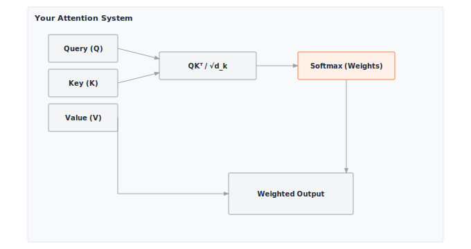

# Module 12: Attention

:::{.callout-note title="Module Info"}

**ARCHITECTURE TIER** | Difficulty: ●●●○ | Time: 5-7 hours | Prerequisites: 01-08, 10-11

**Prerequisites: Modules 01-08 and 10-11** means you should understand:

- Tensor operations and shape manipulation (Module 01)
- Activations, particularly softmax (Module 02)
- Linear layers and weight projections (Module 03)
- Autograd for gradient computation (Module 06)
- Tokenization and embeddings (Modules 10-11)

If you can explain why `softmax(x).sum(axis=-1)` equals 1.0 and how embeddings convert token IDs to dense vectors, you're ready.
:::

```{=html}
<div class="action-cards">
<div class="action-card">
<h4>🎧 Audio Overview</h4>
<p>Listen to an AI-generated overview.</p>
<audio controls style="width: 100%; height: 54px;">
<source src="https://github.com/harvard-edge/cs249r_book/releases/download/tinytorch-audio-v0.1.1/12_attention.mp3" type="audio/mpeg">
</audio>
</div>
<div class="action-card">
<h4>🚀 Launch Binder</h4>
<p>Run interactively in your browser.</p>
<a href="https://mybinder.org/v2/gh/harvard-edge/cs249r_book/main?labpath=tinytorch%2Fmodules%2F12_attention%2Fattention.ipynb" class="action-btn btn-orange">Open in Binder →</a>
</div>
<div class="action-card">
<h4>📄 View Source</h4>
<p>Browse the source code on GitHub.</p>
<a href="https://github.com/harvard-edge/cs249r_book/blob/main/tinytorch/src/12_attention/12_attention.py" class="action-btn btn-teal">View on GitHub →</a>
</div>
</div>

<style>
.slide-viewer-container {
  margin: 0.5rem 0 1.5rem 0;
  background: #0f172a;
  border-radius: 1rem;
  overflow: hidden;
  box-shadow: 0 4px 20px rgba(0,0,0,0.15);
}
.slide-header {
  display: flex;
  align-items: center;
  justify-content: space-between;
  padding: 0.6rem 1rem;
  background: rgba(255,255,255,0.03);
}
.slide-title {
  display: flex;
  align-items: center;
  gap: 0.5rem;
  color: #94a3b8;
  font-weight: 500;
  font-size: 0.85rem;
}
.slide-subtitle {
  color: #64748b;
  font-weight: 400;
  font-size: 0.75rem;
}
.slide-toolbar {
  display: flex;
  align-items: center;
  gap: 0.375rem;
}
.slide-toolbar button {
  background: transparent;
  border: none;
  color: #64748b;
  width: 32px;
  height: 32px;
  border-radius: 0.375rem;
  cursor: pointer;
  font-size: 1.1rem;
  transition: all 0.15s;
  display: flex;
  align-items: center;
  justify-content: center;
}
.slide-toolbar button:hover {
  background: rgba(249, 115, 22, 0.15);
  color: #f97316;
}
.slide-nav-group {
  display: flex;
  align-items: center;
}
.slide-page-info {
  color: #64748b;
  font-size: 0.75rem;
  padding: 0 0.5rem;
  font-weight: 500;
}
.slide-zoom-group {
  display: flex;
  align-items: center;
  margin-left: 0.25rem;
  padding-left: 0.5rem;
  border-left: 1px solid rgba(255,255,255,0.1);
}
.slide-canvas-wrapper {
  display: flex;
  justify-content: center;
  align-items: center;
  padding: 0.5rem 1rem 1rem 1rem;
  min-height: 380px;
  background: #0f172a;
}
.slide-canvas {
  max-width: 100%;
  max-height: 350px;
  height: auto;
  border-radius: 0.5rem;
  box-shadow: 0 4px 24px rgba(0,0,0,0.4);
}
.slide-progress-wrapper {
  padding: 0 1rem 0.5rem 1rem;
}
.slide-progress-bar {
  height: 3px;
  background: rgba(255,255,255,0.08);
  border-radius: 1.5px;
  overflow: hidden;
  cursor: pointer;
}
.slide-progress-fill {
  height: 100%;
  background: #f97316;
  border-radius: 1.5px;
  transition: width 0.2s ease;
}
.slide-loading {
  color: #f97316;
  font-size: 0.9rem;
  display: flex;
  align-items: center;
  gap: 0.5rem;
}
.slide-loading::before {
  content: '';
  width: 18px;
  height: 18px;
  border: 2px solid rgba(249, 115, 22, 0.2);
  border-top-color: #f97316;
  border-radius: 50%;
  animation: slide-spin 0.8s linear infinite;
}
@keyframes slide-spin {
  to { transform: rotate(360deg); }
}
.slide-footer {
  display: flex;
  justify-content: center;
  gap: 0.5rem;
  padding: 0.6rem 1rem;
  background: rgba(255,255,255,0.02);
  border-top: 1px solid rgba(255,255,255,0.05);
}
.slide-footer a {
  display: inline-flex;
  align-items: center;
  gap: 0.375rem;
  background: #f97316;
  color: white;
  padding: 0.4rem 0.9rem;
  border-radius: 2rem;
  text-decoration: none;
  font-weight: 500;
  font-size: 0.75rem;
  transition: all 0.15s;
}
.slide-footer a:hover {
  background: #ea580c;
  color: white;
}
.slide-footer a.secondary {
  background: transparent;
  color: #94a3b8;
  border: 1px solid rgba(255,255,255,0.15);
}
.slide-footer a.secondary:hover {
  background: rgba(255,255,255,0.05);
  color: #f8fafc;
}
@media (max-width: 600px) {
  .slide-header { flex-direction: column; gap: 0.5rem; padding: 0.5rem 0.75rem; }
  .slide-toolbar button { width: 28px; height: 28px; }
  .slide-canvas-wrapper { min-height: 260px; padding: 0.5rem; }
  .slide-canvas { max-height: 220px; }
}
</style>

<div class="slide-viewer-container" id="slide-viewer-12_attention">
<div class="slide-header">
<div class="slide-title">
<span>🔥</span>
<span>Slide Deck</span>

<span class="slide-subtitle">· AI-generated</span>
</div>
<div class="slide-toolbar">
<div class="slide-nav-group">
<button onclick="slideNav('12_attention', -1)" title="Previous">‹</button>
<span class="slide-page-info"><span id="slide-num-12_attention">1</span> / <span id="slide-count-12_attention">-</span></span>
<button onclick="slideNav('12_attention', 1)" title="Next">›</button>
</div>
<div class="slide-zoom-group">
<button onclick="slideZoom('12_attention', -0.25)" title="Zoom out">−</button>
<button onclick="slideZoom('12_attention', 0.25)" title="Zoom in">+</button>
</div>
</div>
</div>
<div class="slide-canvas-wrapper">
<div id="slide-loading-12_attention" class="slide-loading">Loading slides...</div>
<canvas id="slide-canvas-12_attention" class="slide-canvas" style="display:none;"></canvas>
</div>
<div class="slide-progress-wrapper">
<div class="slide-progress-bar" onclick="slideProgress('12_attention', event)">
<div class="slide-progress-fill" id="slide-progress-12_attention" style="width: 0%;"></div>
</div>
</div>
<div class="slide-footer">
<a href="../assets/slides/12_attention.pdf" download>⬇ Download</a>
<a href="#" onclick="slideFullscreen('12_attention'); return false;" class="secondary">⛶ Fullscreen</a>
</div>
</div>

<script src="https://cdnjs.cloudflare.com/ajax/libs/pdf.js/3.11.174/pdf.min.js"></script>
<script>
(function() {
  if (window.slideViewersInitialized) return;
  window.slideViewersInitialized = true;

  pdfjsLib.GlobalWorkerOptions.workerSrc = 'https://cdnjs.cloudflare.com/ajax/libs/pdf.js/3.11.174/pdf.worker.min.js';

  window.slideViewers = {};

  window.initSlideViewer = function(id, pdfUrl) {
    const viewer = { pdf: null, page: 1, scale: 1.3, rendering: false, pending: null };
    window.slideViewers[id] = viewer;

    const canvas = document.getElementById('slide-canvas-' + id);
    const ctx = canvas.getContext('2d');

    function render(num) {
      viewer.rendering = true;
      viewer.pdf.getPage(num).then(function(page) {
        const viewport = page.getViewport({scale: viewer.scale});
        canvas.height = viewport.height;
        canvas.width = viewport.width;
        page.render({canvasContext: ctx, viewport: viewport}).promise.then(function() {
          viewer.rendering = false;
          if (viewer.pending !== null) { render(viewer.pending); viewer.pending = null; }
        });
      });
      document.getElementById('slide-num-' + id).textContent = num;
      document.getElementById('slide-progress-' + id).style.width = (num / viewer.pdf.numPages * 100) + '%';
    }

    function queue(num) { if (viewer.rendering) viewer.pending = num; else render(num); }

    pdfjsLib.getDocument(pdfUrl).promise.then(function(pdf) {
      viewer.pdf = pdf;
      document.getElementById('slide-count-' + id).textContent = pdf.numPages;
      document.getElementById('slide-loading-' + id).style.display = 'none';
      canvas.style.display = 'block';
      render(1);
    }).catch(function() {
      document.getElementById('slide-loading-' + id).innerHTML = 'Unable to load. <a href="' + pdfUrl + '" style="color:#f97316;">Download PDF</a>';
    });

    viewer.queue = queue;
  };

  window.slideNav = function(id, dir) {
    const v = window.slideViewers[id];
    if (!v || !v.pdf) return;
    const newPage = v.page + dir;
    if (newPage >= 1 && newPage <= v.pdf.numPages) { v.page = newPage; v.queue(newPage); }
  };

  window.slideZoom = function(id, delta) {
    const v = window.slideViewers[id];
    if (!v) return;
    v.scale = Math.max(0.5, Math.min(3, v.scale + delta));
    v.queue(v.page);
  };

  window.slideProgress = function(id, event) {
    const v = window.slideViewers[id];
    if (!v || !v.pdf) return;
    const bar = event.currentTarget;
    const pct = (event.clientX - bar.getBoundingClientRect().left) / bar.offsetWidth;
    const newPage = Math.max(1, Math.min(v.pdf.numPages, Math.ceil(pct * v.pdf.numPages)));
    if (newPage !== v.page) { v.page = newPage; v.queue(newPage); }
  };

  window.slideFullscreen = function(id) {
    const el = document.getElementById('slide-viewer-' + id);
    if (el.requestFullscreen) el.requestFullscreen();
    else if (el.webkitRequestFullscreen) el.webkitRequestFullscreen();
  };
})();

initSlideViewer('12_attention', '../assets/slides/12_attention.pdf');

</script>

```
## Overview

Attention is the mechanism behind GPT, BERT, and every modern LLM. In this module you build it from scratch — scaled dot-product attention and multi-head attention — the same math that runs in production transformers, written in NumPy so you can read every line.

The shift attention introduced is simple to state. RNNs squeeze a whole sequence into one fixed-size hidden state and hope nothing important falls out. Attention lets every position read directly from every other position, weighted by relevance computed on the fly. That's it. The cost of that freedom is the equation you'll implement: `Attention(Q, K, V) = softmax(QK^T / √d_k) V`. The `QK^T` term creates an `n × n` matrix — quadratic in sequence length. By the end of this module you'll have written that matrix, watched it dominate memory at long context, and understood exactly why FlashAttention and friends exist.

## Learning Objectives

:::{.callout-tip title="By completing this module, you will:"}

- **Implement** scaled dot-product attention with vectorized operations that reveal O(n²) memory complexity
- **Build** multi-head attention for parallel processing of different relationship types across representation subspaces
- **Master** attention weight computation, normalization, and the query-key-value paradigm
- **Understand** quadratic memory scaling and why attention becomes the bottleneck in long-context transformers
- **Connect** your implementation to production frameworks and understand why efficient attention research matters at scale
:::

## What You'll Build


::: {#fig-12_attention-diag-1 fig-env="figure" fig-pos="htb" fig-cap="**Attention Mechanism**: Information retrieval paradigm where similarity scores between Queries and Keys determine how much of each Value is retrieved." fig-alt="Diagram showing Query, Key, and Value inputs being processed through dot-product similarity, softmax normalization, and weighted combination."}



:::


**Implementation roadmap:**

| Part | What You'll Implement | Key Concept |
|------|----------------------|-------------|
| 1 | `scaled_dot_product_attention()` | Core attention mechanism with QK^T similarity |
| 2 | Attention weight normalization | Softmax converts scores to probability distribution |
| 3 | Causal masking support | Preventing attention to future positions |
| 4 | `MultiHeadAttention.__init__()` | Linear projections and head configuration |
| 5 | `MultiHeadAttention.forward()` | Split, attend, concatenate pattern |

**The pattern you'll enable:**
```python
# Multi-head attention for sequence processing
mha = MultiHeadAttention(embed_dim=512, num_heads=8)
output = mha(embeddings, mask)  # Learn different relationship types in parallel
```

### What You're NOT Building (Yet)

To keep this module focused, you will **not** implement:

- Full transformer blocks (that's Module 13: Transformers)
- Positional encoding (you built this in Module 11: Embeddings)
- Efficient attention variants like FlashAttention (production optimization beyond scope)
- Cross-attention for encoder-decoder models (PyTorch does this with separate Q vs K/V inputs)

**You are building the core attention mechanism.** Complete transformer architectures come next.

## API Reference

This section provides a quick reference for the attention functions and classes you'll build. Use this as your implementation guide and debugging reference.

### Scaled Dot-Product Attention Function

```python
scaled_dot_product_attention(Q, K, V, mask=None) -> (output, attention_weights)
```

Computes the fundamental attention operation that powers all transformers.

**Parameters:**

- `Q`: Query tensor `(batch_size, seq_len, d_model)` — what each position is looking for
- `K`: Key tensor `(batch_size, seq_len, d_model)` — what's available at each position
- `V`: Value tensor `(batch_size, seq_len, d_model)` — actual content to retrieve
- `mask`: Optional `(batch_size, seq_len, seq_len)` — 1.0 for allowed positions, 0.0 for masked

**Returns:**

- `output`: Attended values `(batch_size, seq_len, d_model)`
- `attention_weights`: Attention matrix `(batch_size, seq_len, seq_len)` showing focus patterns

### MultiHeadAttention Class

Multi-head attention runs multiple attention mechanisms in parallel, each learning to focus on different types of relationships.

**Constructor:**
```python
MultiHeadAttention(embed_dim, num_heads) -> MultiHeadAttention
```

Creates multi-head attention with `embed_dim // num_heads` dimensions per head.

**Core Methods:**

| Method | Signature | Description |
|--------|-----------|-------------|
| `forward` | `forward(x, mask=None) -> Tensor` | Apply multi-head attention to input |
| `parameters` | `parameters() -> List[Tensor]` | Return all trainable parameters |

**Attributes:**

- `embed_dim`: Total embedding dimension
- `num_heads`: Number of parallel attention heads
- `head_dim`: Dimension per head (embed_dim // num_heads)
- `q_proj`, `k_proj`, `v_proj`: Linear projections for queries, keys, values
- `out_proj`: Output linear layer to mix information across heads

## Core Concepts

This section covers the fundamental ideas you need to understand attention deeply. These concepts apply to every transformer-based model in production today.

### Query, Key, Value: The Information Retrieval Paradigm

Attention treats sequence processing as a soft database lookup. Three roles, all learned:

- **Query** — what this position is looking for.
- **Key** — what each other position advertises about itself.
- **Value** — what each position actually hands over if attended to.

To translate this into code, your implementation creates these three components using dedicated linear projections, mapping the input sequence into distinct representations for querying, indexing, and retrieving:

```python
# From MultiHeadAttention.__init__
self.q_proj = Linear(embed_dim, embed_dim)  # Learn what to search for
self.k_proj = Linear(embed_dim, embed_dim)  # Learn what to index by
self.v_proj = Linear(embed_dim, embed_dim)  # Learn what to retrieve

# From MultiHeadAttention.forward
Q = self.q_proj.forward(x)  # Transform input to queries
K = self.k_proj.forward(x)  # Transform input to keys
V = self.v_proj.forward(x)  # Transform input to values
```

Three projections, three roles, one input. The same embedding plays all three parts at every position — and what those parts mean is whatever the optimizer settles on.

### Scaled Dot-Product Attention: Similarity as Relevance

The core computation asks one question: how similar is each query to each key? A dot product is the cheapest reasonable answer — large positive values mean the vectors point the same way, near-zero means orthogonal, large negative means opposite. For positions `i` and `j`, the score `Q[i] · K[j]` is exactly that.

The `1/√d_k` factor exists for a specific, fixable failure. If the components of Q and K are roughly unit-variance, then `Q[i] · K[j]` is a sum of `d_k` independent products — its variance grows linearly with `d_k`, so its standard deviation grows like `√d_k`. At `d_k = 64` the typical score is around 8; at `d_k = 512` it's around 23. Feed that to softmax and one entry takes essentially all the probability mass, while every other entry sits in the flat tail of `exp` where the gradient is nearly zero. Training stalls. Dividing by `√d_k` cancels exactly that growth, holding score variance at roughly 1 regardless of head dimension.

Your implementation computes this using vectorized matrix operations:

```python
# From scaled_dot_product_attention (lines 303-319)
d_model = Q.shape[-1]

# Compute all query-key similarities at once using matmul
# This is mathematically equivalent to nested loops computing Q[i] · K[j]
# for all i,j pairs, but vectorized for efficiency
K_t = K.transpose(-2, -1)  # Transpose to align dimensions
scores = Q.matmul(K_t)     # (batch, seq_len, seq_len) - the O(n²) matrix

# Scale by 1/√d_k for numerical stability
scale_factor = 1.0 / math.sqrt(d_model)
scores = scores * scale_factor
```

The resulting `scores` tensor is the attention matrix before normalization. Element `[i,j]` represents how much position i should attend to position j. The vectorized `matmul` operation computes all n² query-key pairs simultaneously—while much faster than Python loops, it still creates the full O(n²) attention matrix that dominates memory usage at scale.

### Attention Weights and Softmax Normalization

Raw similarity scores need to become a probability distribution. Softmax transforms scores into positive values that sum to 1.0 along each row, creating a proper weighted average. This ensures that for each query position, the attention weights over all key positions form valid mixing coefficients.

The softmax operation `exp(scores[i,j]) / Σ_k exp(scores[i,k])` has important properties. It's differentiable, allowing gradients to flow during training. It amplifies differences: a score of 2.0 becomes much more prominent than 1.0 after exponentiation. And it's translation-invariant: adding the same constant to all scores doesn't change the output (exploited for numerical stability).

Here's the complete attention weight computation with masking support:

```python
# From scaled_dot_product_attention

# Apply causal mask if provided (set masked positions to large negative)
if mask is not None:
    mask_data = mask.data
    adder_mask = (1.0 - mask_data) * MASK_VALUE  # MASK_VALUE = -1e9
    adder_mask_tensor = Tensor(adder_mask, requires_grad=False)
    scores = scores + adder_mask_tensor

# Softmax converts scores to probability distribution
softmax = Softmax()
attention_weights = softmax(scores, dim=-1)  # Normalize along last dimension

# Apply to values: weighted combination
output = attention_weights.matmul(V)
```

The mask trick is worth pausing on. Masked positions get `-1e9` added to their score; after `exp`, that's a number indistinguishable from zero, so they receive no attention weight at all. Allowed positions get `+0` and pass through unchanged. The whole operation stays differentiable — there is no `if` in the gradient path — and the constraint is enforced exactly.

### Multi-Head Attention: Parallel Relationship Learning

A single attention head learns one similarity function — one notion of "what counts as relevant". Real sequences have several at once: local syntactic agreement, long-range coreference, positional offsets, semantic similarity. Multi-head attention runs several attention mechanisms side by side, each with its own learned Q/K/V projections, so each head can specialize.

The crucial design choice is to *split* the embedding dimension across heads, not duplicate it. With `embed_dim=512` and `num_heads=8`, each head operates on `512/8 = 64` dimensions. Parameter count stays the same as a single 512-dim head, but you get 8 narrower attention mechanisms running in parallel instead of one wide one. In practice, heads specialize on their own — visualizations of trained models show one head tracking adjacent tokens, another tracking subject–verb pairs across long distances, others doing things no one has named.

Your implementation handles this through reshape and transpose operations:

```python
# From MultiHeadAttention.forward

# Project to Q, K, V (each is batch, seq, embed_dim)
Q = self.q_proj.forward(x)
K = self.k_proj.forward(x)
V = self.v_proj.forward(x)

# Reshape to separate heads: (batch, seq, num_heads, head_dim)
Q = Q.reshape(batch_size, seq_len, self.num_heads, self.head_dim)
K = K.reshape(batch_size, seq_len, self.num_heads, self.head_dim)
V = V.reshape(batch_size, seq_len, self.num_heads, self.head_dim)

# Transpose to (batch, num_heads, seq, head_dim) for parallel processing
Q = Q.transpose(1, 2)
K = K.transpose(1, 2)
V = V.transpose(1, 2)

# Apply attention to all heads at once
attended, _ = scaled_dot_product_attention(Q, K, V, mask=mask_reshaped)

# Transpose back and concatenate heads
attended = attended.transpose(1, 2)  # (batch, seq, num_heads, head_dim)
concat_output = attended.reshape(batch_size, seq_len, self.embed_dim)

# Mix information across heads with output projection
output = self.out_proj.forward(concat_output)
```

The reshape-transpose-attend-transpose-reshape dance separates heads for independent processing, then recombines their outputs. The final output projection learns how to mix information discovered by different heads, creating a rich representation that captures multiple relationship types simultaneously.

### Causal Masking: Preventing Information Leakage

GPT generates one token at a time, left to right. To train it, we feed in a whole sentence at once and ask it to predict the next token at *every* position in parallel — but only if each position is forbidden from peeking at the tokens that come after it. Otherwise the task is trivial: position 5 just copies token 6 and reports a perfect prediction. Causal masking is what makes the parallel training match the sequential generation: position `i` may attend only to positions `0..i`.

The mask itself is a lower-triangular matrix — ones on and below the diagonal, zeros above:

```
[[1, 0, 0, 0],   # Position 0 can only see itself
 [1, 1, 0, 0],   # Position 1 sees 0 and 1
 [1, 1, 1, 0],   # Position 2 sees 0, 1, 2
 [1, 1, 1, 1]]   # Position 3 sees the whole prefix
```

Combined with the `-1e9` trick from the previous section, exactly the upper triangle of every attention matrix is zeroed out before the weighted sum. The reader should pause on this: the mask is the *only* thing that turns a bidirectional encoder (like BERT) into an autoregressive decoder (like GPT). Same code, same parameters, one extra triangular tensor.

### Computational Complexity: The O(n²) Reality

Attention's power comes from all-to-all connectivity: every position can attend to every other position. But this creates quadratic scaling in both computation and memory. For sequence length n, the attention matrix has n² elements. The vectorized `Q @ K^T` operation computes all n² similarity scores in one matrix multiplication, softmax normalizes n² values, and applying attention to values multiplies n² weights by the value vectors.

The memory cost is the part that bites first. For GPT-3 with 2048-token context, a single attention matrix stores `2048² = 4,194,304` float32 values — 16 MB. With 96 layers stacked, attention matrices alone consume 1.5 GB before you account for activations, gradients, Q/K/V projections, or anything else. That is the quadratic wall, and it is the reason every long-context system you've heard of has a paper attached to it.

| Operation | Time Complexity | Memory Complexity | Dominates When |
|-----------|----------------|-------------------|----------------|
| QK^T | O(n² × d) | O(n²) | Long sequences |
| Softmax | O(n²) | O(n²) | Always stores full matrix |
| Weights @ V | O(n² × d) | O(n × d) | Output reuses attention weights |
| **Total** | **O(n² × d)** | **O(n²)** | n > d (long sequences) |

For comparison, feed-forward networks in transformers have O(n × d²) complexity. When sequence length n exceeds embedding dimension d (common in modern models), attention's O(n²) term dominates, making it the primary bottleneck. This explains why research into efficient attention variants like sparse attention, linear attention, and FlashAttention is crucial for production systems.

:::{.callout-warning title="Systems Implication: The Memory Wall (FlashAttention)"}
The $O(n^2)$ memory requirement of attention is the single biggest bottleneck in modern generative AI. It dictates the "context window" limit of every LLM. To calculate attention, standard implementations must write the massive $N \times N$ similarity matrix to the GPU's slow High Bandwidth Memory (HBM) and then read it back for the softmax operation. Systems engineers bypass this wall using **FlashAttention**. This algorithm doesn't just compute attention in small "blocks" that fit entirely inside the GPU's ultra-fast, but tiny, SRAM; crucially, it **fuses** the operations to avoid the costly **HBM read/write round-trips** entirely.
:::

## Common Errors

These are the errors you'll encounter most often when implementing attention. Understanding them will save hours of debugging.

### Shape Mismatch in Attention

**Error**: `ValueError: Cannot perform matrix multiplication: (2, 4, 64) @ (2, 4, 64). Inner dimensions must match`

When computing `Q @ K^T`, the key tensor needs transposing. The matrix multiplication `Q @ K` has shape `(batch, seq_len, d_model) @ (batch, seq_len, d_model)`, which fails because the inner dimensions are both `d_model`. You need `Q @ K.transpose()` to get `(batch, seq_len, d_model) @ (batch, d_model, seq_len)`, producing the correct `(batch, seq_len, seq_len)` attention matrix.

**Fix**: Always transpose K before the matmul: `scores = Q.matmul(K.transpose(-2, -1))`

### Attention Weights Don't Sum to 1

**Error**: `AssertionError: Attention weights don't sum to 1`

This happens when softmax is applied to the wrong axis. Attention weights must form a probability distribution over key positions for each query position. If you apply softmax along the wrong dimension, you'll get values that don't sum to 1.0 per row.

**Fix**: Use `softmax(scores, dim=-1)` to normalize along the last dimension (across keys for each query)

### Multi-Head Dimension Mismatch

**Error**: `ValueError: embed_dim (512) must be divisible by num_heads (7)`

Multi-head attention splits the embedding dimension across heads. If `embed_dim=512` and `num_heads=7`, you'd get `512/7=73.14` dimensions per head, which doesn't work with integer tensor shapes. The architecture requires exact divisibility.

**Fix**: Choose num_heads that evenly divides embed_dim. Common pairs: (512, 8), (768, 12), (1024, 16)

### Mask Broadcasting Errors

**Error**: `ValueError: operands could not be broadcast together with shapes (2,1,4,4) (2,4,4)`

Multi-head attention expects masks with a head dimension. If you pass a 3D mask `(batch, seq, seq)` but the implementation expects 4D `(batch, heads, seq, seq)`, broadcasting fails. The mask needs reshaping to add a dimension that broadcasts across all heads.

**Fix**: Reshape mask: `mask.reshape(batch, 1, seq_len, seq_len)` to broadcast over heads

### Gradient Flow Issues

**Error**: Loss doesn't decrease during training despite correct forward pass

This can happen if you create new Tensor objects incorrectly, breaking the autograd graph. When applying masks or performing intermediate computations, ensure tensors maintain `requires_grad` appropriately.

**Fix**: Check that operations preserve gradient flow: `Tensor(result, requires_grad=True)` when needed

## Production Context

### Your Implementation vs. PyTorch

Your TinyTorch attention and PyTorch's `nn.MultiheadAttention` implement the same mathematical operations. The differences are in implementation efficiency, features, and flexibility. PyTorch uses highly optimized C++ kernels, supports additional attention variants, and integrates with production training systems.

| Feature | Your Implementation | PyTorch |
|---------|---------------------|---------|
| **Core Algorithm** | Scaled dot-product attention | Same mathematical operation |
| **Multi-Head** | Split-attend-concat pattern | Identical architecture |
| **Backend** | NumPy (Python loops) | C++ CUDA kernels |
| **Speed** | 1x (baseline) | 50-100x faster on GPU |
| **Memory Optimization** | Stores full attention matrix | Optional FlashAttention integration |
| **Batch First** | `(batch, seq, embed)` | Configurable via `batch_first=True` |
| **Cross-Attention** | Self-attention only | Separate Q vs K/V inputs supported |
| **Key Padding Mask** | Manual mask creation | Built-in mask utilities |

### Code Comparison

The following comparison shows equivalent attention operations in TinyTorch and PyTorch. Notice how the high-level API and shape conventions match almost exactly.

::: {.panel-tabset}
## Your TinyTorch
```python
from tinytorch.core.attention import MultiHeadAttention
from tinytorch.core.tensor import Tensor
import numpy as np

# Create multi-head attention
mha = MultiHeadAttention(embed_dim=512, num_heads=8)

# Input embeddings (batch=2, seq=10, dim=512)
x = Tensor(np.random.randn(2, 10, 512))

# Apply attention
output = mha.forward(x)  # (2, 10, 512)

# With causal masking
mask = Tensor(np.tril(np.ones((2, 10, 10))))
output_masked = mha.forward(x, mask)
```

## PyTorch
```python
import torch
import torch.nn as nn

# Create multi-head attention
mha = nn.MultiheadAttention(embed_dim=512, num_heads=8,
                             batch_first=True)

# Input embeddings (batch=2, seq=10, dim=512)
x = torch.randn(2, 10, 512)

# Apply attention (PyTorch returns output + weights)
output, weights = mha(x, x, x)  # Self-attention: Q=K=V=x

# With causal masking (upper triangle = -inf)
mask = torch.triu(torch.ones(10, 10) * float('-inf'), diagonal=1)
output_masked, _ = mha(x, x, x, attn_mask=mask)
```
:::

Let's walk through the key differences:

- **Line 1-2 (Imports)**: TinyTorch separates attention into its own module; PyTorch includes it in `torch.nn`. Both follow modular design patterns.
- **Line 4-5 (Construction)**: API is nearly identical. PyTorch adds `batch_first=True` for compatibility with older code that expected `(seq, batch, embed)` order.
- **Line 8 (Input)**: Shape conventions match exactly: `(batch, seq, embed)`. This is the modern standard.
- **Line 11 (Forward Pass)**: TinyTorch uses `mha.forward(x)` with x as both Q, K, V (self-attention). PyTorch makes this explicit with `mha(x, x, x)`, allowing cross-attention where Q differs from K/V.
- **Line 14-15 (Masking)**: TinyTorch uses 0/1 masks (0=masked). PyTorch uses additive masks (-inf=masked). Both work, but PyTorch's convention integrates better with certain optimizations.

:::{.callout-tip title="What's Identical"}

The mathematical operations, architectural patterns, and shape conventions are identical. Multi-head attention works the same way in production. Understanding your implementation means understanding PyTorch's attention.
:::

### Why Attention Matters at Scale

To appreciate why attention research is crucial, consider the scaling characteristics of modern language models:

- **GPT-3** (96 layers, 2048 context): ~1.5 GB just for attention matrices during the forward pass, ~7.5 GB once gradients and optimizer state are added during training
- **GPT-4** (estimated 120 layers, 32K context): would require ~480 GB for attention alone without optimization, far exceeding any single-GPU memory budget
- **Long-context models** (100K+ tokens): attention becomes computationally prohibitive without algorithmic improvements

These constraints drive modern attention research:

- **FlashAttention**: Reformulates computation to reduce memory from O(n²) to O(n) without approximation, enabling 8x longer contexts
- **Sparse Attention**: Only compute attention for specific patterns (local windows, strided access), reducing complexity to O(n log n) or O(n√n)
- **Linear Attention**: Approximate attention with linear complexity O(n), trading accuracy for scale
- **State Space Models**: Alternative architectures (Mamba, RWKV) that avoid attention's quadratic cost entirely

The attention mechanism you built is mathematically identical to production systems, but the O(n²) wall explains why so much research focuses on making it tractable at scale.

## Check Your Understanding

Test yourself with these systems thinking questions. They're designed to build intuition for the performance characteristics you'll encounter in production ML.

**Q1: Memory Calculation**

For sequence length 1024, how much memory does a single attention matrix require (float32)? What about sequence length 2048?

:::{.callout-note collapse="true" title="Answer"}

**Sequence length 1024:**

- Attention matrix: 1024 × 1024 = 1,048,576 elements
- Memory: 1,048,576 × 4 bytes = **4.0 MB**

**Sequence length 2048:**

- Attention matrix: 2048 × 2048 = 4,194,304 elements
- Memory: 4,194,304 × 4 bytes = **16.0 MB**

**Scaling factor:** Doubling sequence length quadruples memory (2² = 4×)

For GPT-3 (96 layers, 2048 context):

- 96 layers × 16.0 MB = **1.5 GB** just for attention matrices.
- This excludes Q/K/V projections, gradients, and every other tensor.
:::

**Q2: Attention Bottleneck**

A transformer layer has attention (O(n² × d)) and feed-forward network (O(n × d²)). For embed_dim=512, at what sequence length does attention dominate?

:::{.callout-note collapse="true" title="Answer"}

**Complexity comparison:**

- Attention: O(n² × d) = O(n² × 512)
- FFN: O(n × d²) = O(n × 512²) = O(n × 262,144)

**Crossover point:** n² × 512 > n × 262,144

- Simplify: n > 262,144 / 512 = **512**

**When n > 512**, attention becomes the memory bottleneck.

**Real-world implications:**

- Short sequences (n=128): FFN dominates, 262K vs 8K operations
- Medium sequences (n=512): break-even point
- Long sequences (n=2048): attention dominates, 2M vs 262K operations
- **This is why GPT-3 (2048 context) needed attention optimization.**
:::

**Q3: Multi-Head Efficiency**

Why use 8 heads of 64 dimensions instead of 1 head of 512 dimensions? Parameters are the same—what's the systems difference?

:::{.callout-note collapse="true" title="Answer"}

**Parameter count (both are identical):**

- 8 heads × 64 dims: Linear(512→512) for Q, K, V, Out = 4 × (512×512 + 512) weights+biases
- 1 head × 512 dims: same projection parameters

**Key differences:**

**1. Parallelization:**

- 8 heads can process in parallel on modern GPUs (separate CUDA streams)
- Each head's smaller matmul operations utilize GPU cores more efficiently

**2. Representation diversity:**

- 8 heads learn 8 different similarity functions (syntax, semantics, position, etc.)
- 1 head learns a single monolithic similarity function
- Training discovers specialization automatically

**3. Cache efficiency:**

- Smaller head_dim (64) fits better in GPU cache and shared memory
- A single 512-dim head causes more cache misses

**4. Gradient flow:**

- Multiple heads provide diverse gradient signals during backpropagation
- A single head has one gradient path, slower learning

**Empirical result:** 8 heads consistently outperform 1 head at equal parameter count. Diversity is the whole point.
:::

**Q4: Causal Masking Computation**

Causal masking zeros out the upper triangle (roughly half the attention matrix). Do we save computation, or just ensure correctness?

:::{.callout-note collapse="true" title="Answer"}

**In your implementation: NO computation saved**

Your code computes the full attention matrix, then adds -1e9 to masked positions:
```python
scores = Q.matmul(K_t)  # Full n² computation
scores = scores + adder_mask_tensor  # Masking happens after
```

**Why no savings:**

- `Q.matmul(K_t)` computes all n² scores
- Masking only affects softmax, not the initial computation
- We still store and normalize the full matrix

**To actually save computation, you'd need:**

1. Sparse matrix multiplication (skip masked positions in matmul)
2. Computing only the lower triangle of scores
3. Specialized CUDA kernels that exploit sparsity

**Production optimizations:**

- PyTorch's standard attention also computes the full matrix (same as yours)
- FlashAttention uses tiling to avoid materializing the full matrix but doesn't exploit sparsity
- Sparse attention (BigBird, Longformer) actually skips computation for sparse patterns

**Memory could be saved** by storing only the lower triangle (n²/2 elements), but it requires custom indexing.
:::

**Q5: Gradient Memory**

Training attention requires storing activations for backpropagation. How much memory does training need compared to inference?

:::{.callout-note collapse="true" title="Answer"}

**Forward pass (inference):**

- Attention matrix: n² values

**Backward pass (training) additional memory:**

- Gradient of attention weights: n² values
- Gradient of Q, K, V: 3 × (n × d) values
- Intermediate gradients from softmax: n² values

**With Adam optimizer (standard for transformers):**

- First moment (momentum): n² values
- Second moment (velocity): n² values

**Total multiplier for attention matrix alone:**

- Forward: 1× (attention weights)
- Backward: +2× (gradients)
- Optimizer: +2× (Adam state)
- **Total: 5× inference memory**

**For GPT-3 scale (96 layers, 2048 context):**

- Inference: 96 × 16 MB = 1.5 GB
- Training: 96 × 16 MB × 5 = **7.5 GB** just for attention gradients and optimizer state.

This excludes Q/K/V matrices, feed-forward networks, embeddings, and activations from other layers. Full GPT-3 training requires 350+ GB.
:::

## Further Reading

The theoretical brilliance of attention is matched only by the engineering challenges required to deploy it at scale. For students who want to understand the architectural turning points and hardware-software co-design that conquered the $O(n^2)$ memory wall:

### Seminal Papers

- **Attention Is All You Need** - Vaswani et al. (2017). The paper that introduced transformers and the multi-head attention mechanism you just built. Shows how attention alone, without recurrence, achieves state-of-the-art results. **Systems Implication:** By completely discarding recurrence, it shattered the sequential compute bottleneck of RNNs, allowing entire sequences to be ingested in parallel, perfectly saturating the massive SIMD grids of modern GPUs. [arXiv:1706.03762](https://arxiv.org/abs/1706.03762)

- **BERT: Pre-training of Deep Bidirectional Transformers** - Devlin et al. (2018). Demonstrates how bidirectional attention (no causal mask) enables powerful language understanding. **Systems Implication:** Deep bidirectional attention required retaining massive $N \times N$ activation checkpoints during the forward pass for backpropagation. This aggressively pushed the boundaries of GPU HBM, driving the industry-wide adoption of activation recomputation (gradient checkpointing) to trade compute for memory. [arXiv:1810.04805](https://arxiv.org/abs/1810.04805)

- **Language Models are Unsupervised Multitask Learners (GPT-2)** - Radford et al. (2019). Shows how causal attention with the masking pattern you implemented enables autoregressive language modeling at unprecedented scale. **Systems Implication:** As model footprints exploded beyond the capacity of a single GPU, autoregressive generation became heavily latency-bound. This architecture popularized large-scale tensor parallelism, splitting the attention heads across distinct hardware accelerators to preserve inference speed. [OpenAI](https://d4mucfpksywv.cloudfront.net/better-language-models/language_models_are_unsupervised_multitask_learners.pdf)

- **FlashAttention: Fast and Memory-Efficient Exact Attention** - Dao et al. (2022). Directly addresses the $O(n^2)$ memory bottleneck you experienced, achieving 2-4× speedups without mathematical approximation. **Systems Implication:** By leveraging precise hardware-aware SRAM tiling, it entirely eliminated the need to materialize the massive attention matrix in slow HBM. This masterclass in systems engineering single-handedly rescued self-attention from the memory bandwidth ceiling, dragging it back to a compute-bound operation. [arXiv:2205.14135](https://arxiv.org/abs/2205.14135)

### Additional Resources

- **Blog post**: "The Illustrated Transformer" by Jay Alammar - Visual explanations of attention mechanics that complement your implementation
- **Interactive tool**: BertViz - Visualize attention patterns in trained models to see the specialization you enabled with multi-head attention
- **Textbook**: "Speech and Language Processing" (Jurafsky & Martin, Chapter 9) - Formal treatment of attention in sequence-to-sequence models

## What's Next

:::{.callout-note title="Coming Up: Module 13 — Transformers"}

You have built the engine. Module 13 builds the chassis around it. The question Module 13 answers is: *what do you wrap attention in to actually train it?* Bare attention has two problems — its outputs collapse to similar values across positions (no per-token computation), and stacking it deeply makes gradients vanish. The transformer block fixes both, with feed-forward networks for per-position transformation, layer normalization to keep activations well-scaled, and residual connections to keep gradients flowing through arbitrarily many layers. Stack the result and you have GPT.
:::

**Preview — how your attention gets used in future modules:**

| Module | What It Does | Your Attention In Action |
|--------|--------------|--------------------------|
| **13: Transformers** | Complete transformer blocks | `TransformerLayer(attention + FFN + LayerNorm)` |
| **13: Transformers** | Residual connections | `x + attention(x)` keeps gradients flowing |
| **13: Transformers** | Stacked layers | `attention → FFN → attention → FFN…` |

## Get Started

:::{.callout-tip title="Interactive Options"}

- **[Launch Binder](https://mybinder.org/v2/gh/harvard-edge/cs249r_book/main?urlpath=lab/tree/tinytorch/modules/12_attention/attention.ipynb)** - Run interactively in browser, no setup required
- **[View Source](https://github.com/harvard-edge/cs249r_book/blob/main/tinytorch/src/12_attention/12_attention.py)** - Browse the implementation code
:::

:::{.callout-warning title="Save Your Progress"}

Binder sessions are temporary. Download your completed notebook when done, or clone the repository for persistent local work.
:::
