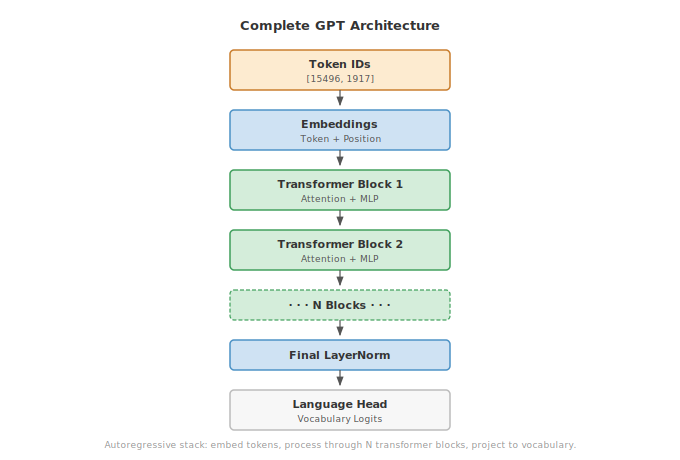

# Module 13: Transformers

:::{.callout-note title="Module Info"}

**ARCHITECTURE TIER** | Difficulty: ●●●● | Time: 8-10 hours | Prerequisites: 01-08, 10-12

You need tensors, layers, training loops, tokenization, embeddings, and attention already in place. If you can explain how multi-head attention turns queries, keys, and values into a weighted representation, you are ready for this chapter.
:::

```{=html}
<div class="action-cards">
<div class="action-card">
<h4>🎧 Audio Overview</h4>
<p>Listen to an AI-generated overview.</p>
<audio controls style="width: 100%; height: 54px;">
<source src="https://github.com/harvard-edge/cs249r_book/releases/download/tinytorch-audio-v0.1.1/13_transformers.mp3" type="audio/mpeg">
</audio>
</div>
<div class="action-card">
<h4>🚀 Launch Binder</h4>
<p>Run interactively in your browser.</p>
<a href="https://mybinder.org/v2/gh/harvard-edge/cs249r_book/main?labpath=tinytorch%2Fmodules%2F13_transformers%2Ftransformers.ipynb" class="action-btn btn-orange">Open in Binder →</a>
</div>
<div class="action-card">
<h4>📄 View Source</h4>
<p>Browse the source code on GitHub.</p>
<a href="https://github.com/harvard-edge/cs249r_book/blob/main/tinytorch/src/13_transformers/13_transformers.py" class="action-btn btn-teal">View on GitHub →</a>
</div>
</div>

<style>
.slide-viewer-container {
  margin: 0.5rem 0 1.5rem 0;
  background: #0f172a;
  border-radius: 1rem;
  overflow: hidden;
  box-shadow: 0 4px 20px rgba(0,0,0,0.15);
}
.slide-header {
  display: flex;
  align-items: center;
  justify-content: space-between;
  padding: 0.6rem 1rem;
  background: rgba(255,255,255,0.03);
}
.slide-title {
  display: flex;
  align-items: center;
  gap: 0.5rem;
  color: #94a3b8;
  font-weight: 500;
  font-size: 0.85rem;
}
.slide-subtitle {
  color: #64748b;
  font-weight: 400;
  font-size: 0.75rem;
}
.slide-toolbar {
  display: flex;
  align-items: center;
  gap: 0.375rem;
}
.slide-toolbar button {
  background: transparent;
  border: none;
  color: #64748b;
  width: 32px;
  height: 32px;
  border-radius: 0.375rem;
  cursor: pointer;
  font-size: 1.1rem;
  transition: all 0.15s;
  display: flex;
  align-items: center;
  justify-content: center;
}
.slide-toolbar button:hover {
  background: rgba(249, 115, 22, 0.15);
  color: #f97316;
}
.slide-nav-group {
  display: flex;
  align-items: center;
}
.slide-page-info {
  color: #64748b;
  font-size: 0.75rem;
  padding: 0 0.5rem;
  font-weight: 500;
}
.slide-zoom-group {
  display: flex;
  align-items: center;
  margin-left: 0.25rem;
  padding-left: 0.5rem;
  border-left: 1px solid rgba(255,255,255,0.1);
}
.slide-canvas-wrapper {
  display: flex;
  justify-content: center;
  align-items: center;
  padding: 0.5rem 1rem 1rem 1rem;
  min-height: 380px;
  background: #0f172a;
}
.slide-canvas {
  max-width: 100%;
  max-height: 350px;
  height: auto;
  border-radius: 0.5rem;
  box-shadow: 0 4px 24px rgba(0,0,0,0.4);
}
.slide-progress-wrapper {
  padding: 0 1rem 0.5rem 1rem;
}
.slide-progress-bar {
  height: 3px;
  background: rgba(255,255,255,0.08);
  border-radius: 1.5px;
  overflow: hidden;
  cursor: pointer;
}
.slide-progress-fill {
  height: 100%;
  background: #f97316;
  border-radius: 1.5px;
  transition: width 0.2s ease;
}
.slide-loading {
  color: #f97316;
  font-size: 0.9rem;
  display: flex;
  align-items: center;
  gap: 0.5rem;
}
.slide-loading::before {
  content: '';
  width: 18px;
  height: 18px;
  border: 2px solid rgba(249, 115, 22, 0.2);
  border-top-color: #f97316;
  border-radius: 50%;
  animation: slide-spin 0.8s linear infinite;
}
@keyframes slide-spin {
  to { transform: rotate(360deg); }
}
.slide-footer {
  display: flex;
  justify-content: center;
  gap: 0.5rem;
  padding: 0.6rem 1rem;
  background: rgba(255,255,255,0.02);
  border-top: 1px solid rgba(255,255,255,0.05);
}
.slide-footer a {
  display: inline-flex;
  align-items: center;
  gap: 0.375rem;
  background: #f97316;
  color: white;
  padding: 0.4rem 0.9rem;
  border-radius: 2rem;
  text-decoration: none;
  font-weight: 500;
  font-size: 0.75rem;
  transition: all 0.15s;
}
.slide-footer a:hover {
  background: #ea580c;
  color: white;
}
.slide-footer a.secondary {
  background: transparent;
  color: #94a3b8;
  border: 1px solid rgba(255,255,255,0.15);
}
.slide-footer a.secondary:hover {
  background: rgba(255,255,255,0.05);
  color: #f8fafc;
}
@media (max-width: 600px) {
  .slide-header { flex-direction: column; gap: 0.5rem; padding: 0.5rem 0.75rem; }
  .slide-toolbar button { width: 28px; height: 28px; }
  .slide-canvas-wrapper { min-height: 260px; padding: 0.5rem; }
  .slide-canvas { max-height: 220px; }
}
</style>

<div class="slide-viewer-container" id="slide-viewer-13_transformers">
<div class="slide-header">
<div class="slide-title">
<span>🔥</span>
<span>Slide Deck</span>

<span class="slide-subtitle">· AI-generated</span>
</div>
<div class="slide-toolbar">
<div class="slide-nav-group">
<button onclick="slideNav('13_transformers', -1)" title="Previous">‹</button>
<span class="slide-page-info"><span id="slide-num-13_transformers">1</span> / <span id="slide-count-13_transformers">-</span></span>
<button onclick="slideNav('13_transformers', 1)" title="Next">›</button>
</div>
<div class="slide-zoom-group">
<button onclick="slideZoom('13_transformers', -0.25)" title="Zoom out">−</button>
<button onclick="slideZoom('13_transformers', 0.25)" title="Zoom in">+</button>
</div>
</div>
</div>
<div class="slide-canvas-wrapper">
<div id="slide-loading-13_transformers" class="slide-loading">Loading slides...</div>
<canvas id="slide-canvas-13_transformers" class="slide-canvas" style="display:none;"></canvas>
</div>
<div class="slide-progress-wrapper">
<div class="slide-progress-bar" onclick="slideProgress('13_transformers', event)">
<div class="slide-progress-fill" id="slide-progress-13_transformers" style="width: 0%;"></div>
</div>
</div>
<div class="slide-footer">
<a href="../assets/slides/13_transformers.pdf" download>⬇ Download</a>
<a href="#" onclick="slideFullscreen('13_transformers'); return false;" class="secondary">⛶ Fullscreen</a>
</div>
</div>

<script src="https://cdnjs.cloudflare.com/ajax/libs/pdf.js/3.11.174/pdf.min.js"></script>
<script>
(function() {
  if (window.slideViewersInitialized) return;
  window.slideViewersInitialized = true;

  pdfjsLib.GlobalWorkerOptions.workerSrc = 'https://cdnjs.cloudflare.com/ajax/libs/pdf.js/3.11.174/pdf.worker.min.js';

  window.slideViewers = {};

  window.initSlideViewer = function(id, pdfUrl) {
    const viewer = { pdf: null, page: 1, scale: 1.3, rendering: false, pending: null };
    window.slideViewers[id] = viewer;

    const canvas = document.getElementById('slide-canvas-' + id);
    const ctx = canvas.getContext('2d');

    function render(num) {
      viewer.rendering = true;
      viewer.pdf.getPage(num).then(function(page) {
        const viewport = page.getViewport({scale: viewer.scale});
        canvas.height = viewport.height;
        canvas.width = viewport.width;
        page.render({canvasContext: ctx, viewport: viewport}).promise.then(function() {
          viewer.rendering = false;
          if (viewer.pending !== null) { render(viewer.pending); viewer.pending = null; }
        });
      });
      document.getElementById('slide-num-' + id).textContent = num;
      document.getElementById('slide-progress-' + id).style.width = (num / viewer.pdf.numPages * 100) + '%';
    }

    function queue(num) { if (viewer.rendering) viewer.pending = num; else render(num); }

    pdfjsLib.getDocument(pdfUrl).promise.then(function(pdf) {
      viewer.pdf = pdf;
      document.getElementById('slide-count-' + id).textContent = pdf.numPages;
      document.getElementById('slide-loading-' + id).style.display = 'none';
      canvas.style.display = 'block';
      render(1);
    }).catch(function() {
      document.getElementById('slide-loading-' + id).innerHTML = 'Unable to load. <a href="' + pdfUrl + '" style="color:#f97316;">Download PDF</a>';
    });

    viewer.queue = queue;
  };

  window.slideNav = function(id, dir) {
    const v = window.slideViewers[id];
    if (!v || !v.pdf) return;
    const newPage = v.page + dir;
    if (newPage >= 1 && newPage <= v.pdf.numPages) { v.page = newPage; v.queue(newPage); }
  };

  window.slideZoom = function(id, delta) {
    const v = window.slideViewers[id];
    if (!v) return;
    v.scale = Math.max(0.5, Math.min(3, v.scale + delta));
    v.queue(v.page);
  };

  window.slideProgress = function(id, event) {
    const v = window.slideViewers[id];
    if (!v || !v.pdf) return;
    const bar = event.currentTarget;
    const pct = (event.clientX - bar.getBoundingClientRect().left) / bar.offsetWidth;
    const newPage = Math.max(1, Math.min(v.pdf.numPages, Math.ceil(pct * v.pdf.numPages)));
    if (newPage !== v.page) { v.page = newPage; v.queue(newPage); }
  };

  window.slideFullscreen = function(id) {
    const el = document.getElementById('slide-viewer-' + id);
    if (el.requestFullscreen) el.requestFullscreen();
    else if (el.webkitRequestFullscreen) el.webkitRequestFullscreen();
  };
})();

initSlideViewer('13_transformers', '../assets/slides/13_transformers.pdf');

</script>

```
## Overview

This is the chapter where everything snaps together. You have tensors, autograd, layers, a training loop, embeddings, and attention. In this module you wire them into a transformer block, stack the blocks, and end up with a working GPT — the same architecture that powers GPT, Claude, and LLaMA. By the end you can run `model.generate(prompt)` on something you wrote yourself.

A transformer block is a small recipe: layer-normalize, run multi-head attention, add a residual; layer-normalize, run an MLP, add a residual. That is it. Stack twelve of those between an embedding table and a language head, train on next-token prediction, and you have a 60M-parameter language model that produces coherent text.

The patterns you implement here — pre-norm, residual streams, causal masking, 4× MLPs — are exactly what runs in production at billion-token scale. The optimizations differ; the architecture does not.

## Learning Objectives

:::{.callout-tip title="By completing this module, you will:"}

- **Implement** layer normalization to stabilize training across deep networks with learnable scale and shift parameters
- **Design** complete transformer blocks combining self-attention, feed-forward networks, and residual connections using pre-norm architecture
- **Build** a full GPT model with token embeddings, positional encoding, stacked transformer blocks, and autoregressive generation
- **Analyze** parameter scaling and memory requirements, understanding why attention memory grows quadratically with sequence length
- **Master** causal masking to enable autoregressive generation while preventing information leakage from future tokens
:::

## What You'll Build

::: {#fig-gpt-architecture}
{fig-alt="Complete GPT architecture as a vertical stack. Token IDs (orange entry) -> Embeddings (token + position, blue processing) -> Transformer Block 1 (green) -> Transformer Block 2 (green) -> N Blocks (green, dashed border signaling repetition) -> Final LayerNorm (blue) -> Language Head (grey neutral exit)."}
:::

**Implementation roadmap:**

| Step | What You'll Implement | Key Concept |
|------|----------------------|-------------|
| 1 | `LayerNorm` with learnable gamma/beta | Stabilizes training by normalizing activations |
| 2 | `MLP` with 4x expansion and GELU | Provides non-linear transformation capacity |
| 3 | `TransformerBlock` with pre-norm architecture | Combines attention and MLP with residual connections |
| 4 | `GPT` model with embeddings and blocks | Complete autoregressive language model |
| 5 | Autoregressive generation with temperature | Text generation with controllable randomness |

**The pattern you'll enable:**
```python
# Building and using a complete language model
model = GPT(vocab_size=50000, embed_dim=768, num_layers=12, num_heads=12)
logits = model.forward(tokens)  # Process input sequence
generated = model.generate(prompt, max_new_tokens=50)  # Generate text
```

### What You're NOT Building (Yet)

To keep this module focused, you will **not** implement:

- KV caching for efficient generation (production systems cache keys/values to avoid recomputation)
- FlashAttention or other memory-efficient attention (PyTorch uses specialized CUDA kernels)
- Mixture of Experts or sparse transformers (advanced scaling techniques)
- Multi-query or grouped-query attention (used in modern LLMs for efficiency)

**You are building the canonical transformer architecture.** Optimizations come later.

## API Reference

This section documents the transformer components you'll implement. Each class builds on the previous, culminating in a complete language model.

### Helper Functions

#### create_causal_mask

```python
create_causal_mask(seq_len: int) -> Tensor
```

Creates a causal (autoregressive) attention mask that prevents positions from attending to future positions. Returns a lower triangular matrix where position `i` can only attend to positions `j ≤ i`.

**Returns**: Tensor of shape `(1, seq_len, seq_len)` with 1.0 for allowed positions, 0.0 for masked positions.

### LayerNorm

```python
LayerNorm(normalized_shape: int, eps: float = 1e-5) -> LayerNorm
```

Normalizes activations across features for each sample independently. Essential for stable training of deep transformer networks.

**Core Methods:**

| Method | Signature | Description |
|--------|-----------|-------------|
| `forward` | `forward(x: Tensor) -> Tensor` | Normalize across last dimension with learnable scale/shift |
| `parameters` | `parameters() -> List[Tensor]` | Returns `[gamma, beta]` learnable parameters |

### MLP (Multi-Layer Perceptron)

```python
MLP(embed_dim: int, hidden_dim: int = None, dropout_prob: float = 0.1) -> MLP
```

Feed-forward network with 4x expansion, GELU activation, and projection back to original dimension.

**Core Methods:**

| Method | Signature | Description |
|--------|-----------|-------------|
| `forward` | `forward(x: Tensor) -> Tensor` | Apply Linear → GELU → Linear transformation |
| `parameters` | `parameters() -> List[Tensor]` | Returns weights and biases from both layers |

### TransformerBlock

```python
TransformerBlock(embed_dim: int, num_heads: int, mlp_ratio: int = 4, ff_dim: int = None, dropout_prob: float = 0.1) -> TransformerBlock
```

Complete transformer block with self-attention, MLP, layer normalization, and residual connections using pre-norm architecture.

**Core Methods:**

| Method | Signature | Description |
|--------|-----------|-------------|
| `forward` | `forward(x: Tensor, mask: Tensor = None) -> Tensor` | Process sequence through attention and MLP sub-layers |
| `parameters` | `parameters() -> List[Tensor]` | Returns all parameters from attention, norms, and MLP |

### GPT

```python
GPT(vocab_size: int, embed_dim: int, num_layers: int, num_heads: int, max_seq_len: int = 1024) -> GPT
```

Complete GPT model for autoregressive language modeling with token embeddings, positional encoding, stacked transformer blocks, and generation capability. The architecture combines token and positional embeddings, processes through multiple transformer blocks with causal masking, applies final layer normalization, and projects to vocabulary logits.

**Core Methods:**

| Method | Signature | Description |
|--------|-----------|-------------|
| `forward` | `forward(tokens: Tensor) -> Tensor` | Compute vocabulary logits for each position with causal masking |
| `generate` | `generate(prompt_tokens: Tensor, max_new_tokens: int = 50, temperature: float = 1.0) -> Tensor` | Autoregressively generate text using temperature-controlled sampling |
| `parameters` | `parameters() -> List[Tensor]` | Returns all model parameters from embeddings, blocks, and output head |
| `_create_causal_mask` | `_create_causal_mask(seq_len: int) -> Tensor` | Internal method creating upper triangular mask for autoregressive attention |

## Core Concepts

This section explores the architectural innovations that make transformers the dominant deep learning architecture. Understanding these concepts deeply will prepare you for both implementing transformers and designing novel architectures.

### Layer Normalization: The Stability Foundation

Without normalization, training a network with dozens of layers becomes nearly impossible: activation distributions drift between layers and gradients explode or vanish. Layer norm pins the distribution back to zero mean and unit variance at every step.

Unlike batch normalization, which mixes statistics across the batch dimension, layer norm normalizes each sample independently across its features. That independence is what makes it work for variable-length sequences: a batch containing a 10-token tweet and a 500-token paragraph would give batch norm meaningless mixed statistics, but layer norm treats each position on its own.

Here's the complete implementation, showing how a few targeted statistical operations keep the network's forward and backward passes perfectly scaled:

```python
class LayerNorm:
    def __init__(self, normalized_shape, eps=1e-5):
        self.normalized_shape = normalized_shape
        self.eps = eps

        # Learnable parameters initialized to identity transform
        self.gamma = Tensor(np.ones(normalized_shape), requires_grad=True)
        self.beta = Tensor(np.zeros(normalized_shape), requires_grad=True)

    def forward(self, x):
        # Compute statistics across last dimension (features)
        mean = x.mean(axis=-1, keepdims=True)
        diff = x - mean
        variance = (diff * diff).mean(axis=-1, keepdims=True)

        # Normalize to zero mean, unit variance
        std = Tensor(np.sqrt(variance.data + self.eps))
        normalized = (x - mean) / std

        # Apply learnable transformation
        return normalized * self.gamma + self.beta
```

The formula is small: `output = (x - μ) / σ * γ + β`. The effect is large. Forcing every activation back to a consistent scale keeps gradients in a sane range, which is the difference between a 12-layer model that trains and a 12-layer model that diverges in the first 100 steps. The learnable `gamma` and `beta` let the model recover any distribution it needs, so the normalization step costs you no expressiveness.

The `eps = 1e-5` guards against the rare case where every feature in a row is identical and variance hits zero. Without it, you divide by zero on the first batch.

### Pre-Norm Architecture and Residual Connections

The original transformer (Vaswani et al., 2017) put layer norm *after* each sub-layer. Modern transformers put it *before*. The fix sounds trivial — swap the order — but it is what lets you train 24, 48, or 100 layers without warmup tricks. The pattern is: normalize, transform, add residual.

Residual connections are the gradient highways. When you write `x + f(x)`, backpropagation gets two paths home: through the transformation `f`, and straight through the `+ x` shortcut. Even if `∂f/∂x` is tiny, the shortcut contributes a clean `1` to the gradient, so signal still reaches the early layers in a 100-layer stack.

Here's how the transformer block implements pre-norm with residuals:

```python
def forward(self, x, mask=None):
    # First sub-layer: attention with pre-norm
    normed1 = self.ln1.forward(x)
    attention_out = self.attention.forward(normed1, mask)
    x = x + attention_out  # Residual connection

    # Second sub-layer: MLP with pre-norm
    normed2 = self.ln2.forward(x)
    mlp_out = self.mlp.forward(normed2)
    output = x + mlp_out  # Residual connection

    return output
```

Notice the asymmetry: each sub-layer *reads* a normalized copy of the input but *writes* its contribution back into the unnormalized residual stream. The normalized path keeps the sub-layer well-behaved; the residual path keeps information flowing intact across the depth of the network.

### The MLP: Computational Capacity Through Expansion

Attention handles relationships *between* tokens. The MLP handles transformation *within* each token, position by position, independently. Together they cover both axes of the sequence.

The standard recipe is wide-then-narrow: expand the embedding to 4× its width, apply GELU, project back. The expansion gives the model a high-dimensional scratch space to disentangle features; the projection forces it to compress what matters back into the residual stream. The 4× ratio is empirical, not principled — it is what worked in the original paper and has stuck ever since.

```python
class MLP:
    def __init__(self, embed_dim, hidden_dim=None):
        if hidden_dim is None:
            hidden_dim = 4 * embed_dim  # Standard 4x expansion

        self.linear1 = Linear(embed_dim, hidden_dim)
        self.gelu = GELU()
        self.linear2 = Linear(hidden_dim, embed_dim)

    def forward(self, x):
        hidden = self.linear1.forward(x)
        hidden = self.gelu.forward(hidden)
        output = self.linear2.forward(hidden)
        return output
```

GELU replaced ReLU in transformer models because it gates smoothly instead of with a hard cutoff at zero, which gives cleaner gradients for language modeling. The choice matters less than the width: most modern variants (GELU, SwiGLU, GeGLU) train to similar loss curves at this scale.

The MLP dominates the parameter count. For `embed_dim = 512`, the first projection has `512 × 2048 + 2048 = 1,050,624` (~1.05M) parameters, the second has `2048 × 512 + 512 = 1,049,088` (~1.05M), for ~2.1M per block. In a 12-layer model that is ~25.2M parameters from MLPs alone — more than attention and embeddings combined.

### Causal Masking for Autoregressive Generation

GPT is an autoregressive model: it predicts each token based only on previous tokens. During training, the model sees the entire sequence, but causal masking ensures position `i` cannot attend to positions `j > i`. This prevents information leakage from the future.

The causal mask is an upper triangular matrix filled with negative infinity:

```python
def create_causal_mask(seq_len: int) -> Tensor:
    # Lower triangle = 1 (can attend), upper triangle = 0 (cannot attend)
    mask = np.tril(np.ones((seq_len, seq_len), dtype=np.float32))
    return Tensor(mask[np.newaxis, :, :])
```

For a 4-token sequence, this creates:
```
[[1, 0, 0, 0],   # Position 0 only sees itself
 [1, 1, 0, 0],   # Position 1 sees 0, 1
 [1, 1, 1, 0],   # Position 2 sees 0, 1, 2
 [1, 1, 1, 1]]   # Position 3 sees everything
```

Inside attention, these zeros become `-inf` in the logits before softmax. After softmax, `-inf` collapses to exactly 0 probability, so future positions contribute nothing to the weighted sum. The mask is what lets you train on a 2048-token sequence in a single parallel pass while still computing every prediction as if you only knew the past.

### Complete Transformer Block Architecture

The transformer block is where all components unite into a coherent processing unit. Each block transforms the input sequence through two sub-layers: multi-head self-attention and MLP, each wrapped with layer normalization and residual connections.

```python
class TransformerBlock:
    def __init__(self, embed_dim, num_heads, mlp_ratio=4):
        self.attention = MultiHeadAttention(embed_dim, num_heads)
        self.ln1 = LayerNorm(embed_dim)  # Before attention
        self.ln2 = LayerNorm(embed_dim)  # Before MLP
        hidden_dim = int(embed_dim * mlp_ratio)
        self.mlp = MLP(embed_dim, hidden_dim)

    def forward(self, x, mask=None):
        # First sub-layer: attention with residual
        normed1 = self.ln1.forward(x)
        attention_out = self.attention.forward(normed1, mask)
        x = x + attention_out  # Residual connection

        # Second sub-layer: MLP with residual
        normed2 = self.ln2.forward(x)
        mlp_out = self.mlp.forward(normed2)
        output = x + mlp_out  # Residual connection

        return output
```

Think of the data flow as a *residual stream*: the input embeddings enter, and every sub-layer adds its contribution on top without overwriting what came before. By the final block, the stream is the original embeddings plus contributions from every attention and MLP sub-layer in the stack — like a stack of transparencies, each adding detail to the same underlying image.

This is why transformers scale to hundreds of layers while plain MLPs choke at ten. Each layer's job is to *adjust* the stream, not replace it. Backprop pushes gradients through these small additive corrections, and the residual shortcuts keep them from decaying as they travel.

### Parameter Scaling and Memory Requirements

Two scaling laws govern transformer cost. Parameters scale roughly with `embed_dim²` (because attention and MLP weights are square-ish matrices in that dimension). Attention activations scale with `seq_len²` (every token attends to every other). Either one can dominate your hardware budget; both will, eventually.

For a single transformer block with `embed_dim = 512` and `num_heads = 8`:

| Component | Parameters | Calculation |
|-----------|------------|-------------|
| Multi-Head Attention | ~1.05M | 4 × (512 × 512) for Q, K, V, O projections |
| Layer Norm 1 | 1K | 2 × 512 for gamma, beta |
| MLP | ~2.1M | (512 × 2048 + 2048) + (2048 × 512 + 512) |
| Layer Norm 2 | 1K | 2 × 512 for gamma, beta |
| **Total per block** | **~3.2M** | Dominated by MLP, then attention |

For a complete GPT model, add embeddings and output projection:

- **Token embeddings**: `vocab_size × embed_dim` = 50000 × 512 = 25.6M
- **Position embeddings**: `max_seq_len × embed_dim` = 2048 × 512 = 1.0M
- **Transformer blocks**: 12 × 3.2M = 37.8M
- **Output projection**: `embed_dim × vocab_size` (typically tied to token embeddings, so 0 extra)

Grand total: **~64M parameters** for this configuration. GPT-2 small was ~117M; GPT-3 is 175B. The arithmetic does not change — you just multiply the same blocks by larger dimensions and more layers.

Memory at training time has three components:

1. **Parameter memory** — linear with model size, stored once
2. **Activation memory** — needed for backprop, grows with batch size and sequence length
3. **Attention memory** — quadratic in sequence length, the bottleneck that bites first

The attention bottleneck is why long context is expensive. For a batch of 4 sequences with 8 heads in float32:

| Sequence Length | Attention Matrix Size | Memory (MB) |
|-----------------|----------------------|-------------|
| 512 | 4 × 8 × 512 × 512 | 32.0 |
| 1024 | 4 × 8 × 1024 × 1024 | 128.0 |
| 2048 | 4 × 8 × 2048 × 2048 | 512.0 |
| 4096 | 4 × 8 × 4096 × 4096 | 2048.0 |

Double the sequence length, quadruple the memory — *per layer*. A 12-layer model at 4K context burns 24 GB just on attention matrices. This is the wall that drove FlashAttention, sparse attention, and linear attention into existence.

Per transformer block, the cost profile decomposes cleanly into two regimes:

- **Attention:** compute is **O(N² · d)**, memory is **O(N²)** — quadratic in sequence length `N`.
- **MLP:** compute is **O(N · d²)**, memory is **O(N · d)** — linear in `N` but quadratic in the hidden width `d`.

Attention overtakes the MLP the moment `N > d`, which for every production LLM (where `N` is thousands of tokens and `d` is a few hundred to a few thousand) is always. That crossover is why the attention matrix — not the weight matrices — is the first thing that blows up your HBM budget.

:::{.callout-note title="Systems Implication: KV-Cache Memory Growth During Autoregressive Decoding"}
The O(N²) scaling story above is about *training*. Autoregressive *inference* has a different — and equally brutal — memory problem: the **KV cache**. When generating tokens one at a time, naive attention would recompute the keys and values for every previous token at every step (the 66× overhead shown in the generation efficiency question below). Production inference instead caches `K` and `V` for every token ever seen, trading compute for memory.

The cache size per request is `2 × num_layers × num_heads × head_dim × seq_len × bytes` — two copies (K and V), one per layer, per head. For a 70 B Llama-style model at 32K context in FP16, that is roughly **20 GB per request**, often larger than the model's own weight footprint. At scale this is the dominant cost: inference servers are memory-bound on the KV cache, not FLOP-bound on the matmuls. This is why recent architectures use **multi-query attention** (MQA) and **grouped-query attention** (GQA) — they share keys and values across heads to shrink the cache by 4–8×, trading a small amount of model quality for a huge cut in serving memory. Every optimization in modern LLM inference stacks — paged attention, prefix caching, speculative decoding — is ultimately a strategy for managing the KV cache.
:::

## Production Context

### Your Implementation vs. PyTorch

Your transformer implementation and PyTorch's production transformers share the same architectural principles. The differences lie in optimization: PyTorch uses fused CUDA kernels, memory-efficient attention, and various tricks for speed and scale.

| Feature | Your Implementation | PyTorch |
|---------|---------------------|---------|
| **Architecture** | Pre-norm transformer blocks | Pre-norm (modern) or post-norm (legacy) |
| **Attention** | Standard scaled dot-product | FlashAttention, sparse attention |
| **Memory** | Full attention matrices | KV caching, memory-efficient attention |
| **Precision** | Float32 | Mixed precision (FP16/BF16) |
| **Parallelism** | Single device | Model parallel, pipeline parallel |
| **Efficiency** | Educational clarity | Production optimization |

### Code Comparison

The following comparison shows equivalent transformer usage in TinyTorch and PyTorch. The API patterns are nearly identical because your implementation follows production design principles.

::: {.panel-tabset}
## Your TinyTorch
```python
from tinytorch.core.transformers import TransformerBlock, GPT

# Create transformer block
block = TransformerBlock(embed_dim=512, num_heads=8)
output = block.forward(x)

# Create complete GPT model
model = GPT(vocab_size=50000, embed_dim=768, num_layers=12, num_heads=12)
logits = model.forward(tokens)
generated = model.generate(prompt, max_new_tokens=50, temperature=0.8)
```

## PyTorch
```python
import torch.nn as nn

# PyTorch transformer block (using nn.TransformerEncoderLayer)
block = nn.TransformerEncoderLayer(d_model=512, nhead=8, dim_feedforward=2048)
output = block(x)

# Complete model (using HuggingFace transformers)
from transformers import GPT2LMHeadModel, GPT2Tokenizer
model = GPT2LMHeadModel.from_pretrained("gpt2")
outputs = model.generate(input_ids, max_new_tokens=50, temperature=0.8)
```
:::

Let's walk through the key similarities and differences:

- **Line 1-2 (Block creation)**: Both create transformer blocks with identical parameters. PyTorch uses `TransformerEncoderLayer` while you built `TransformerBlock` from scratch.
- **Line 3 (Forward pass)**: Both process sequences with identical semantics. Your implementation explicitly shows attention and MLP; PyTorch's is identical internally.
- **Line 5-6 (Model creation)**: Both create complete language models. PyTorch typically uses pre-trained models via HuggingFace; you build from scratch.
- **Line 7 (Generation)**: Both support autoregressive generation with temperature control. PyTorch adds beam search, top-k/top-p sampling, and other advanced techniques.

:::{.callout-tip title="What's Identical"}

The core architecture, pre-norm pattern, residual connections, and causal masking are identical. When you debug transformer models in PyTorch, you'll understand exactly what's happening because you built it yourself.
:::

### Why Transformers Matter at Scale

The architecture you just built is the same one that runs at the frontier. The difference is the dimensions.

- **GPT-3 (175B parameters)** — 350 GB just to store weights in float16, 700 GB for mixed-precision training state.
- **Training cost** — roughly $4.6M in compute, ~10,000 GPUs for weeks.
- **Inference latency** — 100–200 ms to process 2048 tokens on optimized hardware.
- **Context scaling** — going from 2K to 32K context costs 256× more attention memory *per layer*.

Those numbers exist because the architecture you built has no free lunch baked in: every doubling of context squares the attention cost, every doubling of width squares the parameter count. The next chapter is where you start measuring those costs in your own model — and the chapters after that are where you start beating them down.

:::{.callout-tip title="Check Your Understanding — Transformers"}
Before moving on, verify you can articulate each of the following:

- [ ] Why the residual connection around attention+FFN (`x + f(x)`) is critical for gradient flow through deep stacks — the `+1` in `∂y/∂x = 1 + ∂f/∂x` is a shortcut that lets signal reach early layers even when the sub-layer Jacobian is tiny.
- [ ] How **pre-norm** (LayerNorm *before* each sub-layer) differs from the original *post-norm* transformer, and why it's what lets modern models train 24, 48, or 100+ layers without learning-rate warmup tricks.
- [ ] Why the attention block's O(N²) memory cost dominates over the MLP's O(N · d²) the moment `N > d` — and what that means for context-window choices in every production LLM.
- [ ] How the **KV cache** turns autoregressive decoding from O(N²) recomputation into O(N) per step, why the cache itself can exceed the model's weight footprint, and why MQA/GQA/paged attention exist to shrink it.

If any of these feels fuzzy, revisit the *Core Concepts* section (especially *Pre-Norm Architecture and Residual Connections* and *Parameter Scaling and Memory Requirements*) before moving on.
:::

## Self-Check Questions

Test your understanding of transformer architecture and scaling with these systems thinking questions.

**Q1: Attention Memory Calculation**

A transformer with `batch_size=8`, `num_heads=16`, `seq_len=2048` computes attention matrices at each layer. How much memory does one layer's attention matrices consume? How does this scale if you double the sequence length to 4096?

:::{.callout-tip collapse="true" title="Answer"}

Attention matrix size: `batch_size × num_heads × seq_len × seq_len`
= `8 × 16 × 2048 × 2048` = 536,870,912 elements

Memory: `536,870,912 × 4 bytes (float32)` = 2,147,483,648 bytes = **2.0 GB**

Doubling sequence length to 4096:
= `8 × 16 × 4096 × 4096` = 2,147,483,648 elements = **8.0 GB**

**Scaling**: doubling sequence length quadruples memory (4× increase). This quadratic scaling is why long context is expensive — and why sparse attention, FlashAttention, and linear-attention variants exist.
:::

**Q2: Parameter Distribution Analysis**

For a GPT model with `vocab_size=50000`, `embed_dim=768`, `num_layers=12`, `num_heads=12`, calculate approximate total parameters. Which component dominates the parameter count: embeddings or transformer blocks?

:::{.callout-tip collapse="true" title="Answer"}

**Token Embeddings**: `50000 × 768` = 38.4M

**Position Embeddings**: `2048 × 768` = 1.6M (assuming max_seq_len=2048)

**Transformer Blocks**: each block has ~7.1M parameters with embed_dim=768

- Attention: `4 × (768 × 768)` = ~2.4M
- MLP: `(768 × 3072 + 3072) + (3072 × 768 + 768)` = ~4.7M
- Layer norms: negligible
- **Per block**: ~7.1M
- **Total blocks**: `12 × 7.1M` = 85M

**Output Projection**: usually tied to embeddings (0 additional)

**Total**: `38.4M + 1.6M + 85M` ≈ **125M parameters** — close to GPT-2 small.

**Dominant component**: transformer blocks (85M) outweigh embeddings (40M). As models scale, blocks pull further ahead because they grow with `embed_dim²` while embeddings grow only linearly with vocab size.
:::

**Q3: Residual Connection Benefits**

Why do transformers use residual connections (`x + f(x)`) rather than just `f(x)`? How do residual connections affect gradient flow during backpropagation in a 24-layer transformer?

:::{.callout-tip collapse="true" title="Answer"}

**Without residual connections** (`y = f(x)`):

- Gradients must flow through every transformation layer.
- Each layer's Jacobian can shrink gradients (vanishing) or amplify them (exploding).
- Across 24 layers, gradients can collapse to ~0 or blow up to ~∞.

**With residual connections** (`y = x + f(x)`):

- Backprop gives `∂y/∂x = 1 + ∂f/∂x`.
- The `+1` is a direct gradient path that does not depend on the sub-layer's weights.
- Even if `∂f/∂x` is small, the `+1` keeps the signal alive.
- The result is a stack of "gradient highways" running the depth of the network.

**24-layer impact**: without residuals, a 0.9 per-layer attenuation compounds to `0.9²⁴ ≈ 0.08`. With residuals, the `+1` shortcut delivers gradients to early layers at full strength. This is why transformers scale to 100+ layers while plain feed-forward nets struggle past 10.
:::

**Q4: Autoregressive Generation Efficiency**

Your `generate()` method processes the entire sequence for each new token. For generating 100 tokens with prompt length 50, how many total forward passes occur? Why is this inefficient?

:::{.callout-tip collapse="true" title="Answer"}

**Current implementation**: for each of 100 new tokens, reprocess the entire sequence.

- Token 1: process 50 tokens (prompt)
- Token 2: process 51 tokens (prompt + 1)
- Token 3: process 52 tokens
- ...
- Token 100: process 149 tokens

**Total forward passes**: `50 + 51 + 52 + ... + 149` = **9,950 token processings**

**Why inefficient**: attention recomputes key/value projections for every previous token at every step, even though those projections do not change. The key/value for position 50 is recomputed 100 times.

**KV Caching optimization**: store computed key/value projections for previous tokens.

- Each new token only computes its own key/value.
- Attention uses cached keys/values from previous tokens.
- Total computation: `50 (prompt) + 100 (new tokens)` = **150 token processings**.

**Speedup**: `9950 / 150` ≈ **66× faster** for this example. The ratio grows with generation length, which is why KV caching is non-negotiable in production inference stacks.
:::

**Q5: Layer Normalization vs Batch Normalization**

Why do transformers use layer normalization instead of batch normalization? Consider a batch with sequences of varying lengths: [10 tokens, 50 tokens, 100 tokens].

:::{.callout-tip collapse="true" title="Answer"}

**Batch Normalization** normalizes across the batch dimension:

- For position 5, statistics would mix all three sequences.
- But sequence 1 has no position 50, sequence 2 has no position 100.
- With padding, statistics get contaminated by pad tokens.
- Depends on batch composition: different batches give different statistics.

**Layer Normalization** normalizes across features for each sample:

- Each position is normalized independently: `(x - mean(x)) / std(x)`.
- Position 5 of sequence 1 has no influence on position 50 of sequence 2.
- No dependency on batch composition.
- Works naturally with variable-length sequences.

**Example**: for a tensor of shape `(batch=3, seq=10, features=768)`:

- Batch norm computes `10 × 768` statistics across the batch dimension (problematic).
- Layer norm computes `3 × 10` statistics across the feature dimension (independent).

**Why it matters**: transformers process variable-length sequences. Layer norm treats each position on its own, which makes it robust to length variation and batch composition. Batch norm depends on its batch; layer norm does not.
:::

## Key Takeaways

- **A transformer block is a recipe, not a mystery:** pre-norm → attention → residual, pre-norm → MLP → residual. Stack twelve of those between embeddings and a language head and you have GPT.
- **Residuals are the gradient highway:** `x + f(x)` gives backprop a `+1` shortcut that keeps signal alive through arbitrarily deep stacks — without them, a 24-layer network's gradients decay to zero.
- **Attention's O(N²) memory is the first wall you hit:** doubling sequence length quadruples attention memory per layer; long context is expensive because of geometry, not implementation.
- **The KV cache dominates inference memory:** at serving time, `2 × layers × heads × head_dim × seq_len × bytes` often eclipses the model weights themselves, which is why MQA, GQA, and paged attention now ship in every production LLM stack.

**Coming next:** Module 14 opens the Optimization Tier with measurement — profiling your transformer's forward pass to see exactly where time and memory are spent before you try to cut either.

## Further Reading

The transition from a theoretical transformer diagram to a planet-scale language model is governed by ruthless hardware constraints and brilliant systems engineering. For students seeking to understand the architectural turning points and the hardware-software co-design that made massive models possible, study these foundational texts.

### Seminal Papers

- **Attention Is All You Need** - Vaswani et al. (2017). The paper that introduced the transformer architecture, revolutionizing sequence modeling. Describes multi-head attention, positional encoding, and the encoder-decoder structure. **Systems Implication:** Eradicated the sequential compute bottleneck inherent to RNNs. By processing entire sequences simultaneously, the transformer perfectly aligns with the SIMD architecture of modern GPUs, enabling massive parallelization and achieving near-peak hardware utilization. [arXiv:1706.03762](https://arxiv.org/abs/1706.03762)

- **Language Models are Few-Shot Learners (GPT-3)** - Brown et al. (2020). Demonstrates scaling laws and emergent capabilities of large language models. Shows how transformer performance improves predictably with immense scale. **Systems Implication:** At 175 billion parameters, the model shattered the memory capacity of a single GPU. This forced the systems engineering community to rapidly mature and deploy complex 3D parallelism strategies (data, tensor, and pipeline parallelism) across clusters of thousands of distinct compute nodes. [arXiv:2005.14165](https://arxiv.org/abs/2005.14165)

- **FlashAttention: Fast and Memory-Efficient Exact Attention** - Dao et al. (2022). Overcomes the O(n²) memory scaling limit of attention using IO-aware algorithms, enabling practical long-context processing. **Systems Implication:** Leveraged precise, hardware-aware SRAM tiling to completely bypass the materialization of the gigantic quadratic attention matrix in HBM. This critical optimization shifted attention from being a catastrophic memory-bound operation back to a highly efficient compute-bound workload. [arXiv:2205.14135](https://arxiv.org/abs/2205.14135)

- **On Layer Normalization in the Transformer Architecture** - Xiong et al. (2020). Mathematically analyzes pre-norm versus post-norm architectures, revealing why pre-norm enables the training of much deeper networks. **Systems Implication:** Pre-norm architectures prevent catastrophic gradient vanishing or exploding during backpropagation across hundreds of layers. By guaranteeing gradient stability, these architectures ensure that massive, distributed training runs remain convergent, saving millions of dollars in idle or wasted GPU compute. [arXiv:2002.04745](https://arxiv.org/abs/2002.04745)

### Additional Resources

- **Blog post**: "The Illustrated Transformer" by Jay Alammar - Visual walkthrough of transformer architecture with clear diagrams
- **Paper**: "Scaling Laws for Neural Language Models" - Kaplan et al. (2020) - Mathematical analysis of how performance scales with parameters, data, and compute
- **Implementation**: HuggingFace Transformers library - Production transformer implementations to compare with your code

## What's Next

You finished the Architecture Tier. You have a transformer that trains, generates text, and matches the structural blueprint of GPT. Everything from here is about making it *fast, small, and deployable*.

:::{.callout-note title="Coming Up: Module 14 — Profiling"}

The Optimization Tier opens with the only honest place to start: measurement. Before you optimize anything, you need to know *where the time goes*. In Module 14 you instrument your transformer's forward pass and answer concrete questions — how much of a step is spent in attention versus the MLP, how memory grows with sequence length on your machine, and which layer is the actual bottleneck. Every optimization in the chapters that follow (quantization, kernel fusion, KV caching) targets a number you measured in Module 14.
:::

**Where your transformer goes from here:**

| Module | What It Does | Your Transformer In Action |
|--------|--------------|---------------------------|
| **14: Profiling** | Measure performance bottlenecks | `profiler.analyze(model.forward(x))` reveals where time and memory go |
| **15: Quantization** | Reduce precision to 8-bit / 4-bit | Shrink the 64M model to a fraction of its size with minimal accuracy loss |
| **20: Capstone** | Production deployment | Serve your transformer end-to-end with the systems you built |

## Get Started

:::{.callout-tip title="Interactive Options"}

- **[Launch Binder](https://mybinder.org/v2/gh/harvard-edge/cs249r_book/main?urlpath=lab/tree/tinytorch/modules/13_transformers/transformers.ipynb)** - Run interactively in browser, no setup required
- **[View Source](https://github.com/harvard-edge/cs249r_book/blob/main/tinytorch/src/13_transformers/13_transformers.py)** - Browse the implementation code
:::

:::{.callout-warning title="Save Your Progress"}

Binder sessions are temporary. Download your completed notebook when done, or clone the repository for persistent local work.
:::
 clone the repository for persistent local work.
:::
44B parameters |
| **20: Capstone** | Complete production system | Deploy transformer for real-time inference |
