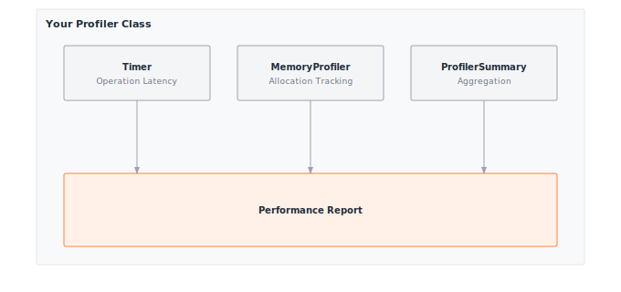

# Module 14: Profiling

:::{.callout-note title="Module Info"}

**OPTIMIZATION TIER** | Difficulty: ●●○○ | Time: 3-5 hours | Prerequisites: 01-13

**Prerequisites: Modules 01-13** means you should have:
- Built the complete ML stack (Modules 01-08)
- Implemented CNN architectures (Module 09) or Transformers (Modules 10-13)
- Models to profile and optimize

**Why these prerequisites**: You'll profile models built in Modules 1-13. Understanding the implementations helps you interpret profiling results (e.g., why attention is memory-bound).
:::

```{=html}
<div class="action-cards">
<div class="action-card">
<h4>🎧 Audio Overview</h4>
<p>Listen to an AI-generated overview.</p>
<audio controls style="width: 100%; height: 54px;">
<source src="https://github.com/harvard-edge/cs249r_book/releases/download/tinytorch-audio-v0.1.1/14_profiling.mp3" type="audio/mpeg">
</audio>
</div>
<div class="action-card">
<h4>🚀 Launch Binder</h4>
<p>Run interactively in your browser.</p>
<a href="https://mybinder.org/v2/gh/harvard-edge/cs249r_book/main?labpath=tinytorch%2Fmodules%2F14_profiling%2Fprofiling.ipynb" class="action-btn btn-orange">Open in Binder →</a>
</div>
<div class="action-card">
<h4>📄 View Source</h4>
<p>Browse the source code on GitHub.</p>
<a href="https://github.com/harvard-edge/cs249r_book/blob/main/tinytorch/src/14_profiling/14_profiling.py" class="action-btn btn-teal">View on GitHub →</a>
</div>
</div>

<style>
.slide-viewer-container {
  margin: 0.5rem 0 1.5rem 0;
  background: #0f172a;
  border-radius: 1rem;
  overflow: hidden;
  box-shadow: 0 4px 20px rgba(0,0,0,0.15);
}
.slide-header {
  display: flex;
  align-items: center;
  justify-content: space-between;
  padding: 0.6rem 1rem;
  background: rgba(255,255,255,0.03);
}
.slide-title {
  display: flex;
  align-items: center;
  gap: 0.5rem;
  color: #94a3b8;
  font-weight: 500;
  font-size: 0.85rem;
}
.slide-subtitle {
  color: #64748b;
  font-weight: 400;
  font-size: 0.75rem;
}
.slide-toolbar {
  display: flex;
  align-items: center;
  gap: 0.375rem;
}
.slide-toolbar button {
  background: transparent;
  border: none;
  color: #64748b;
  width: 32px;
  height: 32px;
  border-radius: 0.375rem;
  cursor: pointer;
  font-size: 1.1rem;
  transition: all 0.15s;
  display: flex;
  align-items: center;
  justify-content: center;
}
.slide-toolbar button:hover {
  background: rgba(249, 115, 22, 0.15);
  color: #f97316;
}
.slide-nav-group {
  display: flex;
  align-items: center;
}
.slide-page-info {
  color: #64748b;
  font-size: 0.75rem;
  padding: 0 0.5rem;
  font-weight: 500;
}
.slide-zoom-group {
  display: flex;
  align-items: center;
  margin-left: 0.25rem;
  padding-left: 0.5rem;
  border-left: 1px solid rgba(255,255,255,0.1);
}
.slide-canvas-wrapper {
  display: flex;
  justify-content: center;
  align-items: center;
  padding: 0.5rem 1rem 1rem 1rem;
  min-height: 380px;
  background: #0f172a;
}
.slide-canvas {
  max-width: 100%;
  max-height: 350px;
  height: auto;
  border-radius: 0.5rem;
  box-shadow: 0 4px 24px rgba(0,0,0,0.4);
}
.slide-progress-wrapper {
  padding: 0 1rem 0.5rem 1rem;
}
.slide-progress-bar {
  height: 3px;
  background: rgba(255,255,255,0.08);
  border-radius: 1.5px;
  overflow: hidden;
  cursor: pointer;
}
.slide-progress-fill {
  height: 100%;
  background: #f97316;
  border-radius: 1.5px;
  transition: width 0.2s ease;
}
.slide-loading {
  color: #f97316;
  font-size: 0.9rem;
  display: flex;
  align-items: center;
  gap: 0.5rem;
}
.slide-loading::before {
  content: '';
  width: 18px;
  height: 18px;
  border: 2px solid rgba(249, 115, 22, 0.2);
  border-top-color: #f97316;
  border-radius: 50%;
  animation: slide-spin 0.8s linear infinite;
}
@keyframes slide-spin {
  to { transform: rotate(360deg); }
}
.slide-footer {
  display: flex;
  justify-content: center;
  gap: 0.5rem;
  padding: 0.6rem 1rem;
  background: rgba(255,255,255,0.02);
  border-top: 1px solid rgba(255,255,255,0.05);
}
.slide-footer a {
  display: inline-flex;
  align-items: center;
  gap: 0.375rem;
  background: #f97316;
  color: white;
  padding: 0.4rem 0.9rem;
  border-radius: 2rem;
  text-decoration: none;
  font-weight: 500;
  font-size: 0.75rem;
  transition: all 0.15s;
}
.slide-footer a:hover {
  background: #ea580c;
  color: white;
}
.slide-footer a.secondary {
  background: transparent;
  color: #94a3b8;
  border: 1px solid rgba(255,255,255,0.15);
}
.slide-footer a.secondary:hover {
  background: rgba(255,255,255,0.05);
  color: #f8fafc;
}
@media (max-width: 600px) {
  .slide-header { flex-direction: column; gap: 0.5rem; padding: 0.5rem 0.75rem; }
  .slide-toolbar button { width: 28px; height: 28px; }
  .slide-canvas-wrapper { min-height: 260px; padding: 0.5rem; }
  .slide-canvas { max-height: 220px; }
}
</style>

<div class="slide-viewer-container" id="slide-viewer-14_profiling">
<div class="slide-header">
<div class="slide-title">
<span>🔥</span>
<span>Slide Deck</span>

<span class="slide-subtitle">· AI-generated</span>
</div>
<div class="slide-toolbar">
<div class="slide-nav-group">
<button onclick="slideNav('14_profiling', -1)" title="Previous">‹</button>
<span class="slide-page-info"><span id="slide-num-14_profiling">1</span> / <span id="slide-count-14_profiling">-</span></span>
<button onclick="slideNav('14_profiling', 1)" title="Next">›</button>
</div>
<div class="slide-zoom-group">
<button onclick="slideZoom('14_profiling', -0.25)" title="Zoom out">−</button>
<button onclick="slideZoom('14_profiling', 0.25)" title="Zoom in">+</button>
</div>
</div>
</div>
<div class="slide-canvas-wrapper">
<div id="slide-loading-14_profiling" class="slide-loading">Loading slides...</div>
<canvas id="slide-canvas-14_profiling" class="slide-canvas" style="display:none;"></canvas>
</div>
<div class="slide-progress-wrapper">
<div class="slide-progress-bar" onclick="slideProgress('14_profiling', event)">
<div class="slide-progress-fill" id="slide-progress-14_profiling" style="width: 0%;"></div>
</div>
</div>
<div class="slide-footer">
<a href="../assets/slides/14_profiling.pdf" download>⬇ Download</a>
<a href="#" onclick="slideFullscreen('14_profiling'); return false;" class="secondary">⛶ Fullscreen</a>
</div>
</div>

<script src="https://cdnjs.cloudflare.com/ajax/libs/pdf.js/3.11.174/pdf.min.js"></script>
<script>
(function() {
  if (window.slideViewersInitialized) return;
  window.slideViewersInitialized = true;

  pdfjsLib.GlobalWorkerOptions.workerSrc = 'https://cdnjs.cloudflare.com/ajax/libs/pdf.js/3.11.174/pdf.worker.min.js';

  window.slideViewers = {};

  window.initSlideViewer = function(id, pdfUrl) {
    const viewer = { pdf: null, page: 1, scale: 1.3, rendering: false, pending: null };
    window.slideViewers[id] = viewer;

    const canvas = document.getElementById('slide-canvas-' + id);
    const ctx = canvas.getContext('2d');

    function render(num) {
      viewer.rendering = true;
      viewer.pdf.getPage(num).then(function(page) {
        const viewport = page.getViewport({scale: viewer.scale});
        canvas.height = viewport.height;
        canvas.width = viewport.width;
        page.render({canvasContext: ctx, viewport: viewport}).promise.then(function() {
          viewer.rendering = false;
          if (viewer.pending !== null) { render(viewer.pending); viewer.pending = null; }
        });
      });
      document.getElementById('slide-num-' + id).textContent = num;
      document.getElementById('slide-progress-' + id).style.width = (num / viewer.pdf.numPages * 100) + '%';
    }

    function queue(num) { if (viewer.rendering) viewer.pending = num; else render(num); }

    pdfjsLib.getDocument(pdfUrl).promise.then(function(pdf) {
      viewer.pdf = pdf;
      document.getElementById('slide-count-' + id).textContent = pdf.numPages;
      document.getElementById('slide-loading-' + id).style.display = 'none';
      canvas.style.display = 'block';
      render(1);
    }).catch(function() {
      document.getElementById('slide-loading-' + id).innerHTML = 'Unable to load. <a href="' + pdfUrl + '" style="color:#f97316;">Download PDF</a>';
    });

    viewer.queue = queue;
  };

  window.slideNav = function(id, dir) {
    const v = window.slideViewers[id];
    if (!v || !v.pdf) return;
    const newPage = v.page + dir;
    if (newPage >= 1 && newPage <= v.pdf.numPages) { v.page = newPage; v.queue(newPage); }
  };

  window.slideZoom = function(id, delta) {
    const v = window.slideViewers[id];
    if (!v) return;
    v.scale = Math.max(0.5, Math.min(3, v.scale + delta));
    v.queue(v.page);
  };

  window.slideProgress = function(id, event) {
    const v = window.slideViewers[id];
    if (!v || !v.pdf) return;
    const bar = event.currentTarget;
    const pct = (event.clientX - bar.getBoundingClientRect().left) / bar.offsetWidth;
    const newPage = Math.max(1, Math.min(v.pdf.numPages, Math.ceil(pct * v.pdf.numPages)));
    if (newPage !== v.page) { v.page = newPage; v.queue(newPage); }
  };

  window.slideFullscreen = function(id) {
    const el = document.getElementById('slide-viewer-' + id);
    if (el.requestFullscreen) el.requestFullscreen();
    else if (el.webkitRequestFullscreen) el.webkitRequestFullscreen();
  };
})();

initSlideViewer('14_profiling', '../assets/slides/14_profiling.pdf');

</script>

```
## Overview

Profiling is the foundation of performance optimization. Before making a model faster or smaller, you need to measure where time and memory go. In this module, you'll build professional profiling tools that measure parameters, FLOPs, memory usage, and latency with statistical rigor.

Every optimization decision starts with measurement. Is your model memory-bound or compute-bound? Which layers consume the most resources? How does batch size affect throughput? Your profiler will answer these questions with data, not guesses, enabling the targeted optimizations in later modules.

By the end, you'll have built the same measurement infrastructure used by production ML teams to make data-driven optimization decisions.

## The Optimization Tier Flow

Profiling (Module 14) is the gateway to the Optimization tier, which follows **Measure → Transform → Validate**:

```
Profiling (14) → Model-Level (15-16) → Runtime (17-18) → Benchmarking (19)
     ↓                  ↓                    ↓                  ↓
 "What's slow?"   "Shrink the model"   "Speed up execution"  "Did it work?"
```

```{python}
#| echo: false
#| output: false


# Quantization compression ratio: FP32 (32 bits) -> INT8 (8 bits)
quant_compression = 32 // 8
tier_quant_compression = f"{quant_compression}"
```

**Model-Level Optimizations (15-16)**: Change the model itself
- Quantization: FP32 → INT8 for `{python} tier_quant_compression`× compression
- Compression: Prune unnecessary weights

**Runtime Optimizations (17-18)**: Change how execution happens
- Acceleration: Vectorization, kernel fusion (general-purpose)
- Memoization: KV-cache for transformers (domain-specific)

You can't optimize what you can't measure. That's why profiling comes first.

## Learning Objectives

:::{.callout-tip title="By completing this module, you will:"}

- **Implement** a comprehensive Profiler class that measures parameters, FLOPs, memory, and latency
- **Analyze** performance characteristics to identify compute-bound vs memory-bound workloads
- **Master** statistical measurement techniques with warmup runs and outlier handling
- **Connect** profiling insights to optimization opportunities in quantization, compression, and caching
:::

## What You'll Build


::: {#fig-14_profiling-diag-1 fig-env="figure" fig-pos="htb" fig-cap="**TinyTorch Profiling System**: Tools for measuring execution time and memory allocation." fig-alt="Diagram showing Timer, MemoryProfiler, and summary report generation."}



:::


**Implementation roadmap:**

| Step | What You'll Implement | Key Concept |
|------|----------------------|-------------|
| 1 | `count_parameters()` | Model size and memory footprint |
| 2 | `count_flops()` | Computational cost estimation |
| 3 | `measure_memory()` | Activation and gradient memory tracking |
| 4 | `measure_latency()` | Statistical timing with warmup |
| 5 | `profile_forward_pass()` | Comprehensive performance analysis |
| 6 | `profile_backward_pass()` | Training cost estimation |

**The pattern you'll enable:**
```python
# Comprehensive model analysis for optimization decisions
profiler = Profiler()
profile = profiler.profile_forward_pass(model, input_data)
print(f"Bottleneck: {profile['bottleneck']}")  # "memory" or "compute"
```

### What You're NOT Building (Yet)

To keep this module focused, you will **not** implement:

- GPU profiling (we measure CPU performance with NumPy)
- Distributed profiling (that's for multi-GPU setups)
- CUDA kernel profilers (PyTorch uses `torch.profiler` for GPU analysis)
- Layer-by-layer visualization dashboards (TensorBoard provides this)

**You are building the measurement foundation.** Visualization and GPU profiling come with production frameworks.

## API Reference

This section provides a quick reference for the Profiler class you'll build. Use it while implementing and debugging.

### Constructor

```python
Profiler()
```
Initializes profiler with measurement tracking structures.

### Core Methods

| Method | Signature | Description |
|--------|-----------|-------------|
| `count_parameters` | `count_parameters(model) -> int` | Count total trainable parameters |
| `count_flops` | `count_flops(model, input_shape) -> int` | Count FLOPs per sample (batch-size independent) |
| `measure_memory` | `measure_memory(model, input_shape) -> Dict` | Measure memory usage components |
| `measure_latency` | `measure_latency(model, input_tensor, warmup, iterations) -> float` | Measure inference latency in milliseconds |

### Analysis Methods

| Method | Signature | Description |
|--------|-----------|-------------|
| `profile_layer` | `profile_layer(layer, input_shape) -> Dict` | Comprehensive single-layer profile |
| `profile_forward_pass` | `profile_forward_pass(model, input_tensor) -> Dict` | Complete forward pass analysis |
| `profile_backward_pass` | `profile_backward_pass(model, input_tensor) -> Dict` | Training iteration analysis |

### Utility Functions

| Function | Signature | Description |
|----------|-----------|-------------|
| `quick_profile` | `quick_profile(model, input_tensor, profiler=None) -> Dict` | One-call convenience profiling |
| `analyze_weight_distribution` | `analyze_weight_distribution(model, percentiles) -> Dict` | Statistical analysis of model weight distributions |

## Core Concepts

This section covers the fundamental ideas you need to understand profiling deeply. Measurement is the foundation of optimization, and understanding what you're measuring matters as much as how you measure it.

### Why Profile First

Optimization without measurement is guessing. You might spend days optimizing the wrong bottleneck, achieving minimal speedup while the real problem goes untouched. Profiling reveals ground truth: where time and memory actually go, not where you think they go.

Consider a transformer model running slowly. Is it the attention mechanism? The feed-forward layers? Matrix multiplications? Memory transfers? Without profiling, you're guessing. With profiling, you know. If 80% of time is in attention and it's memory-bound, you know exactly what to optimize and how.

The profiling workflow follows a systematic process. You measure first to establish a baseline. Then you analyze the measurements to identify bottlenecks. Next you optimize the critical path, not every operation. Finally you measure again to verify improvement. This cycle repeats until you hit performance targets.

Your profiler implements the measurement and analysis steps, providing the data needed for optimization decisions in later modules.

### Timing Operations

Accurate timing is harder than it looks in modern systems due to OS variance, cache warmup effects, and measurement overhead. To counteract these hidden variables, your `measure_latency` method implements a rigorous statistical approach, ensuring the hardware reaches a steady state before any measurements are recorded:

```python
def measure_latency(self, model, input_tensor, warmup: int = 10, iterations: int = 100) -> float:
    """Measure model inference latency with statistical rigor."""
    # Warmup runs to stabilize performance
    for _ in range(warmup):
        _ = model.forward(input_tensor)

    # Measurement runs
    times = []
    for _ in range(iterations):
        start_time = time.perf_counter()
        _ = model.forward(input_tensor)
        end_time = time.perf_counter()
        times.append((end_time - start_time) * 1000)  # Convert to milliseconds

    # Calculate statistics - use median for robustness
    times = np.array(times)
    median_latency = np.median(times)

    return float(median_latency)
```

The warmup phase is critical. The first few runs are artificially slow due to cold CPU caches, Python interpreter overhead, and NumPy initialization. Running 10+ warmup iterations forces the system into a steady state, yielding reliable baseline measurements.

Using median instead of mean makes the measurement robust against outliers. If the operating system interrupts your process once during measurement, that outlier won't skew the result. The median captures typical performance, not worst-case spikes.

### Memory Profiling

Memory profiling reveals three distinct components: parameter memory (model weights), activation memory (forward pass intermediate values), and gradient memory (backward pass derivatives). Each has different characteristics and optimization strategies.

Here's how your profiler tracks memory usage:

```python
def measure_memory(self, model, input_shape: Tuple[int, ...]) -> Dict[str, float]:
    """Measure memory usage during forward pass."""
    # Start memory tracking
    tracemalloc.start()

    # Calculate parameter memory
    param_count = self.count_parameters(model)
    parameter_memory_bytes = param_count * BYTES_PER_FLOAT32
    parameter_memory_mb = parameter_memory_bytes / MB_TO_BYTES

    # Create input and measure activation memory
    dummy_input = Tensor(np.random.randn(*input_shape))
    input_memory_bytes = dummy_input.data.nbytes

    # Estimate activation memory (simplified)
    activation_memory_bytes = input_memory_bytes * 2  # Rough estimate
    activation_memory_mb = activation_memory_bytes / MB_TO_BYTES

    # Run forward pass to measure peak memory usage
    _ = model.forward(dummy_input)

    # Get peak memory
    _current_memory, peak_memory = tracemalloc.get_traced_memory()
    peak_memory_mb = (peak_memory - _baseline_memory) / MB_TO_BYTES

    tracemalloc.stop()

    # Calculate efficiency metrics
    useful_memory = parameter_memory_mb + activation_memory_mb
    memory_efficiency = useful_memory / max(peak_memory_mb, 0.001)  # Avoid division by zero

    return {
        'parameter_memory_mb': parameter_memory_mb,
        'activation_memory_mb': activation_memory_mb,
        'peak_memory_mb': max(peak_memory_mb, useful_memory),
        'memory_efficiency': min(memory_efficiency, 1.0)
    }
```

```{python}
#| echo: false
#| output: false


# 125M parameter model memory: 125,000,000 params * 4 bytes/float32
mem_125m_params = 125_000_000
mem_125m_bytes = mem_125m_params * 4
mem_125m_mb = mem_125m_bytes / (1024 ** 2)
mem_125m_params = f"{mem_125m_params // 1_000_000}"
mem_125m_mb = f"{round(mem_125m_mb)}"
```

Parameter memory is persistent and constant regardless of batch size. A model with `{python} mem_125m_params` million parameters uses `{python} mem_125m_mb` MB (`{python} mem_125m_params`M × 4 bytes per float32) whether you're processing one sample or a thousand.

Activation memory scales with batch size. Doubling the batch doubles activation memory. This is why large batch training requires more GPU memory than inference.

Gradient memory matches parameter memory exactly. Every parameter needs a gradient during training, adding another `{python} mem_125m_mb` MB for a `{python} mem_125m_params`M parameter model.

### Bottleneck Identification and The Roofline Model

The single most critical insight a profiler yields is whether a workload is **compute-bound** or **memory-bound**. This classification dictates your entire optimization trajectory. Engineers formalize this relationship using the **Roofline Model**, a visual performance framework that plots a system's peak compute throughput (the horizontal "roof") against its memory bandwidth (the sloped "attic").

A workload's placement under the roof is determined by its **arithmetic intensity**—the ratio of FLOPs executed per byte of memory accessed.

**Compute-bound** workloads possess high arithmetic intensity. They reside under the flat roof of the model, limited entirely by the arithmetic logic units (e.g., Tensor Cores or SIMD registers). The hardware has ample data but cannot crunch the numbers fast enough. Optimizations here require dense vectorization, kernel fusion, and lower-precision math (like INT8 or FP8).

**Memory-bound** workloads have low arithmetic intensity, trapped under the sloping memory bandwidth line. The processor's arithmetic units sit idle, starved of data because the hardware cannot fetch information from High Bandwidth Memory (HBM) fast enough. Embedding lookups (sparse gathers) and autoregressive generation (token-by-token processing) notoriously fall here. Optimizations must ruthlessly target data movement: improving cache locality, exploiting SRAM tiling, and reducing the precision footprint.

Your profiler calculates this exact dynamic: if you register a meager GFLOP/s despite running on hardware with massive theoretical throughput, your arithmetic intensity is too low—you have hit the memory wall.

### Profiling Tools

Your implementation uses Python's built-in profiling tools: `time.perf_counter()` for high-precision timing and `tracemalloc` for memory tracking. These provide the foundation for accurate measurement.

`time.perf_counter()` uses the system's highest-resolution timer, typically nanosecond precision. It measures wall-clock time, which includes all system effects (cache misses, context switches) that affect real-world performance.

`tracemalloc` tracks Python memory allocations with byte-level precision. It records both current and peak memory usage, letting you identify memory spikes during execution.

Production profilers add GPU support (CUDA events, NVTX markers), distributed tracing (for multi-GPU setups), and kernel-level analysis. But the core concepts remain the same: measure, analyze, identify bottlenecks, optimize.

## Production Context

### Your Implementation vs. PyTorch

Your TinyTorch Profiler and PyTorch's profiling tools share the same conceptual foundation. The differences are in implementation detail: PyTorch adds GPU support, kernel-level profiling, and distributed tracing. But the core metrics (parameters, FLOPs, memory, latency) are identical.

| Feature | Your Implementation | PyTorch |
|---------|---------------------|---------|
| **Parameter counting** | Direct tensor size | `model.parameters()` |
| **FLOP counting** | Per-layer formulas | FlopCountAnalysis (fvcore) |
| **Memory tracking** | tracemalloc | torch.profiler, CUDA events |
| **Latency measurement** | time.perf_counter() | torch.profiler, NVTX |
| **GPU profiling** | ✗ CPU only | ✓ CUDA kernels, memory |
| **Distributed** | ✗ Single process | ✓ Multi-GPU, NCCL |

### Code Comparison

The following comparison shows equivalent profiling operations in TinyTorch and PyTorch. Notice how the concepts transfer directly, even though PyTorch provides more sophisticated tooling.

::: {.panel-tabset}
## Your TinyTorch
```python
from tinytorch.perf.profiling import Profiler

# Create profiler
profiler = Profiler()

# Profile model
params = profiler.count_parameters(model)
flops = profiler.count_flops(model, input_shape)
memory = profiler.measure_memory(model, input_shape)
latency = profiler.measure_latency(model, input_tensor)

# Comprehensive analysis
profile = profiler.profile_forward_pass(model, input_tensor)
print(f"Bottleneck: {profile['bottleneck']}")
print(f"GFLOP/s: {profile['gflops_per_second']:.2f}")
```

## ⚡ PyTorch
```python
import torch
from torch.profiler import profile, ProfilerActivity

# Count parameters
params = sum(p.numel() for p in model.parameters())

# Profile with PyTorch profiler
with profile(activities=[ProfilerActivity.CPU, ProfilerActivity.CUDA]) as prof:
    output = model(input_tensor)

# Analyze results
print(prof.key_averages().table(sort_by="cpu_time_total"))

# FLOPs (requires fvcore)
from fvcore.nn import FlopCountAnalysis
flops = FlopCountAnalysis(model, input_tensor)
print(f"FLOPs: {flops.total()}")
```
:::

Let's walk through the comparison:

- **Parameter counting**: Both frameworks count total trainable parameters. TinyTorch uses `count_parameters()`, PyTorch uses `sum(p.numel() for p in model.parameters())`.
- **FLOP counting**: TinyTorch implements per-layer formulas. PyTorch uses the `fvcore` library's `FlopCountAnalysis` for more sophisticated analysis.
- **Memory tracking**: TinyTorch uses `tracemalloc`. PyTorch profiler tracks CUDA memory events for GPU memory analysis.
- **Latency measurement**: TinyTorch uses `time.perf_counter()` with warmup. PyTorch profiler uses CUDA events for precise GPU timing.
- **Analysis output**: Both provide bottleneck identification and throughput metrics. PyTorch adds kernel-level detail and distributed profiling.

:::{.callout-tip title="What's Identical"}

The profiling workflow: measure parameters, FLOPs, memory, and latency to identify bottlenecks. Production frameworks add GPU support and more sophisticated analysis, but the core measurement principles you're learning here transfer directly.
:::

### Why Profiling Matters at Scale

```{python}
#| echo: false
#| output: false


# GPT-3: 175B parameters at FP32 (4 bytes each)
gpt3_params_b = 175
gpt3_bytes = gpt3_params_b * 1_000_000_000 * 4
gpt3_gb = gpt3_bytes / (1024 ** 3)
scale_gpt3_params = f"{gpt3_params_b}"
scale_gpt3_gb = f"{round(gpt3_gb)}"
```

To appreciate profiling's importance, consider production ML systems:

- **GPT-3 (`{python} scale_gpt3_params`B parameters)**: `{python} scale_gpt3_gb` GB model size at FP32. Profiling reveals which layers to quantize for deployment.
- **BERT training**: 80% of time in self-attention. Profiling identifies FlashAttention as the optimization to implement.
- **Image classification**: Batch size 256 uses 12 GB GPU memory. Profiling shows 10 GB is activations, suggesting gradient checkpointing.

A single profiling session can reveal optimization opportunities worth 10× speedups or 4× memory reduction. Understanding profiling isn't just academic; it's essential for deploying real ML systems.

## Check Your Understanding

Test yourself with these systems thinking questions about profiling and performance measurement.

**Q1: Parameter Memory Calculation**

A transformer model has 12 layers, each with a feed-forward network containing two Linear layers: Linear(768, 3072) and Linear(3072, 768). How much memory do the feed-forward network parameters consume across all layers?

```{python}
#| echo: false
#| output: false


# Q1: Feed-forward network parameter memory calculation
q1_first_weights = 768 * 3072
q1_first_bias = 3072
q1_first_total = q1_first_weights + q1_first_bias

q1_second_weights = 3072 * 768
q1_second_bias = 768
q1_second_total = q1_second_weights + q1_second_bias

q1_per_layer = q1_first_total + q1_second_total
q1_num_layers = 12
q1_all_layers = q1_num_layers * q1_per_layer

q1_bytes = q1_all_layers * 4
q1_mb = round(q1_bytes / (1024 ** 2))

q1_first_weights = f"{q1_first_weights:,}"
q1_first_bias = f"{q1_first_bias:,}"
q1_first_total = f"{q1_first_total:,}"
q1_second_weights = f"{q1_second_weights:,}"
q1_second_bias = f"{q1_second_bias:,}"
q1_second_total = f"{q1_second_total:,}"
q1_per_layer = f"{q1_per_layer:,}"
q1_all_layers = f"{q1_all_layers:,}"
q1_bytes = f"{q1_bytes:,}"
q1_mb = f"{q1_mb}"
```

:::{.callout-note collapse="true" title="Answer"}

Each feed-forward network:
- First layer: (768 × 3072) + 3072 = `{python} q1_first_total` parameters
- Second layer: (3072 × 768) + 768 = `{python} q1_second_total` parameters
- Total per layer: `{python} q1_per_layer` parameters

Across 12 layers: 12 × `{python} q1_per_layer` = `{python} q1_all_layers` parameters

Memory: `{python} q1_all_layers` × 4 bytes = `{python} q1_bytes` bytes ≈ **`{python} q1_mb` MB**

This is just the feed-forward networks. Attention adds more parameters.
:::

**Q2: FLOP Counting and Computational Cost**

A Linear(512, 512) layer processes a batch of 64 samples. Your profiler's `count_flops()` method returns FLOPs per sample (batch-size independent). How many FLOPs are required for one sample? For the whole batch, if each sample is processed independently?

```{python}
#| echo: false
#| output: false


# Q2: FLOP counting for Linear(512, 512)
q2_in_features = 512
q2_out_features = 512
q2_per_sample = q2_in_features * q2_out_features * 2
q2_batch_size = 64
q2_batch_total = q2_batch_size * q2_per_sample

# Latency at 50 GFLOP/s
q2_gflops = 50
q2_latency_s = q2_batch_total / (q2_gflops * 1e9)
q2_latency_ms = q2_latency_s * 1000

q2_per_sample = f"{q2_per_sample:,}"
q2_batch_total = f"{q2_batch_total:,}"
q2_latency_ms = f"{q2_latency_ms:.2f}"
```

:::{.callout-note collapse="true" title="Answer"}

Per-sample FLOPs (what `count_flops()` returns): 512 × 512 × 2 = **`{python} q2_per_sample` FLOPs**

Note: The `count_flops()` method is batch-size independent. It returns per-sample FLOPs whether you pass input_shape=(1, 512) or (64, 512).

If processing a batch of 64 samples: 64 × `{python} q2_per_sample` = `{python} q2_batch_total` total FLOPs

Minimum latency at 50 GFLOP/s: `{python} q2_batch_total` FLOPs ÷ 50 GFLOP/s = **`{python} q2_latency_ms` ms** for the full batch

This assumes perfect computational efficiency (100%). Real latency is higher due to memory bandwidth and overhead.
:::

**Q3: Memory Bottleneck Analysis**

A model achieves 5 GFLOP/s on hardware with 100 GFLOP/s peak compute. The memory bandwidth is 50 GB/s. Is this workload compute-bound or memory-bound?

```{python}
#| echo: false
#| output: false


# Q3: Computational efficiency
q3_achieved = 5
q3_peak = 100
q3_efficiency_pct = (q3_achieved / q3_peak) * 100

q3_efficiency_pct = f"{q3_efficiency_pct:.0f}"
```

:::{.callout-note collapse="true" title="Answer"}

Computational efficiency: 5 GFLOP/s ÷ 100 GFLOP/s = **`{python} q3_efficiency_pct`% efficiency**

This extremely low efficiency suggests the workload is **memory-bound**. The hardware can compute 100 GFLOP/s but only achieves 5 GFLOP/s because it spends most of the time waiting for data transfers.

Optimization strategy: Focus on reducing memory transfers, improving cache locality, and data layout optimization. Improving the algorithm's FLOPs won't help because compute isn't the bottleneck.
:::

**Q4: Training Memory Estimation**

```{python}
#| echo: false
#| output: false


# Q4: Training memory with Adam optimizer
# 125M params at FP32 = 500 MB for parameters
q4_param_mb = 500
q4_grad_mb = q4_param_mb        # gradients match parameters
q4_adam_m_mb = q4_param_mb      # first moment (momentum)
q4_adam_v_mb = q4_param_mb      # second moment (velocity)
q4_total_mb = q4_param_mb + q4_grad_mb + q4_adam_m_mb + q4_adam_v_mb
q4_total_gb = q4_total_mb / 1000

q4_param_mb = f"{q4_param_mb}"
q4_grad_mb = f"{q4_grad_mb}"
q4_adam_m_mb = f"{q4_adam_m_mb}"
q4_adam_v_mb = f"{q4_adam_v_mb}"
q4_total_mb = f"{q4_total_mb:,}"
q4_total_gb = f"{q4_total_gb:.0f}"
```

A model has 125M parameters (`{python} q4_param_mb` MB). You're training with Adam optimizer. What's the total memory requirement during training, including gradients and optimizer state?

:::{.callout-note collapse="true" title="Answer"}

- Parameters: `{python} q4_param_mb` MB
- Gradients: `{python} q4_grad_mb` MB (same as parameters)
- Adam momentum: `{python} q4_adam_m_mb` MB (first moment estimates)
- Adam velocity: `{python} q4_adam_v_mb` MB (second moment estimates)

Total: `{python} q4_param_mb` + `{python} q4_grad_mb` + `{python} q4_adam_m_mb` + `{python} q4_adam_v_mb` = **`{python} q4_total_mb` MB (`{python} q4_total_gb` GB)**

This is just model state. Activations add more memory that scales with batch size. A typical training run might use 4-8 GB total including activations.
:::

**Q5: Latency Measurement Statistics**

You measure latency 100 times and get: median = 10.5 ms, mean = 12.3 ms, min = 10.1 ms, max = 45.2 ms. Which statistic should you report and why?

:::{.callout-note collapse="true" title="Answer"}

Report the **median (10.5 ms)** as the typical latency.

The mean (12.3 ms) is skewed by the outlier (45.2 ms), likely caused by OS interruption or garbage collection. The median is robust to outliers and represents typical performance.

For production SLA planning, you might also report p95 or p99 latency (95th or 99th percentile) to capture worst-case behavior without being skewed by extreme outliers.
:::

## Further Reading

For students who want to understand the academic foundations and professional practices of ML profiling:

### Seminal Papers

- **Roofline: An Insightful Visual Performance Model** - Williams et al. (2009). Introduces the roofline model for understanding compute vs memory bottlenecks. Essential framework for performance analysis. [ACM CACM](https://doi.org/10.1145/1498765.1498785)

- **PyTorch Profiler: Performance Analysis Tool** - Ansel et al. (2024). Describes PyTorch's production profiling infrastructure. Shows how profiling scales to distributed GPU systems. [arXiv](https://arxiv.org/abs/2404.05033)

- **MLPerf Inference Benchmark** - Reddi et al. (2020). Industry-standard benchmarking methodology for ML systems. Defines rigorous profiling protocols. [arXiv](https://arxiv.org/abs/1911.02549)

### Additional Resources

- **Tool**: [PyTorch Profiler](https://pytorch.org/tutorials/intermediate/tensorboard_profiler_tutorial.html) - Production profiling with GPU support
- **Tool**: [TensorFlow Profiler](https://www.tensorflow.org/guide/profiler) - Alternative framework's profiling approach
- **Book**: "Computer Architecture: A Quantitative Approach" - Hennessy & Patterson - Chapter 4 covers memory hierarchy and performance measurement

## What's Next

:::{.callout-note title="Coming Up: Module 15 - Quantization"}

Implement quantization to reduce model size and accelerate inference. You'll use profiling insights to identify which layers benefit most from reduced precision, achieving 4× memory reduction with minimal accuracy loss.
:::

**Preview - How Your Profiler Gets Used in Future Modules:**

| Module | What It Does | Your Profiler In Action |
|--------|--------------|------------------------|
| **15: Quantization** | Reduce precision to INT8 | `profile_layer()` identifies quantization candidates |
| **16: Compression** | Prune and compress weights | `count_parameters()` measures compression ratio |
| **17: Acceleration** | Vectorize computations | `measure_latency()` validates speedup |

## Get Started

:::{.callout-tip title="Interactive Options"}

- **[Launch Binder](https://mybinder.org/v2/gh/harvard-edge/cs249r_book/main?urlpath=lab/tree/tinytorch/modules/14_profiling/profiling.ipynb)** - Run interactively in browser, no setup required
- **[View Source](https://github.com/harvard-edge/cs249r_book/blob/main/tinytorch/src/14_profiling/14_profiling.py)** - Browse the implementation code
:::

:::{.callout-warning title="Save Your Progress"}

Binder sessions are temporary. Download your completed notebook when done, or clone the repository for persistent local work.
:::
e_latency()` validates speedup |

## Get Started

:::{.callout-tip title="Interactive Options"}

- **[Launch Binder](https://mybinder.org/v2/gh/harvard-edge/cs249r_book/main?urlpath=lab/tree/tinytorch/modules/14_profiling/profiling.ipynb)** - Run interactively in browser, no setup required
- **[View Source](https://github.com/harvard-edge/cs249r_book/blob/main/tinytorch/src/14_profiling/14_profiling.py)** - Browse the implementation code
:::

:::{.callout-warning title="Save Your Progress"}

Binder sessions are temporary. Download your completed notebook when done, or clone the repository for persistent local work.
:::
