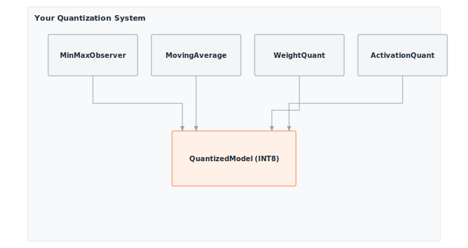

# Module 15: Quantization

:::{.callout-note title="Module Info"}

**OPTIMIZATION TIER** | Difficulty: ●●●○ | Time: 4-6 hours | Prerequisites: 01-14

**Prerequisites: Modules 01-14** means you should have:

- Built the complete foundation (Tensor through Training)
- Implemented profiling tools to measure memory usage
- Understanding of neural network parameters and forward passes
- Familiarity with memory calculations and optimization trade-offs

If you can profile a model's memory usage and explain the cost of FP32 storage, you're ready.
:::

```{=html}
<div class="action-cards">
<div class="action-card">
<h4>🎧 Audio Overview</h4>
<p>Listen to an AI-generated overview.</p>
<audio controls style="width: 100%; height: 54px;">
<source src="https://github.com/harvard-edge/cs249r_book/releases/download/tinytorch-audio-v0.1.1/15_quantization.mp3" type="audio/mpeg">
</audio>
</div>
<div class="action-card">
<h4>🚀 Launch Binder</h4>
<p>Run interactively in your browser.</p>
<a href="https://mybinder.org/v2/gh/harvard-edge/cs249r_book/main?labpath=tinytorch%2Fmodules%2F15_quantization%2Fquantization.ipynb" class="action-btn btn-orange">Open in Binder →</a>
</div>
<div class="action-card">
<h4>📄 View Source</h4>
<p>Browse the source code on GitHub.</p>
<a href="https://github.com/harvard-edge/cs249r_book/blob/main/tinytorch/src/15_quantization/15_quantization.py" class="action-btn btn-teal">View on GitHub →</a>
</div>
</div>

<style>
.slide-viewer-container {
  margin: 0.5rem 0 1.5rem 0;
  background: #0f172a;
  border-radius: 1rem;
  overflow: hidden;
  box-shadow: 0 4px 20px rgba(0,0,0,0.15);
}
.slide-header {
  display: flex;
  align-items: center;
  justify-content: space-between;
  padding: 0.6rem 1rem;
  background: rgba(255,255,255,0.03);
}
.slide-title {
  display: flex;
  align-items: center;
  gap: 0.5rem;
  color: #94a3b8;
  font-weight: 500;
  font-size: 0.85rem;
}
.slide-subtitle {
  color: #64748b;
  font-weight: 400;
  font-size: 0.75rem;
}
.slide-toolbar {
  display: flex;
  align-items: center;
  gap: 0.375rem;
}
.slide-toolbar button {
  background: transparent;
  border: none;
  color: #64748b;
  width: 32px;
  height: 32px;
  border-radius: 0.375rem;
  cursor: pointer;
  font-size: 1.1rem;
  transition: all 0.15s;
  display: flex;
  align-items: center;
  justify-content: center;
}
.slide-toolbar button:hover {
  background: rgba(249, 115, 22, 0.15);
  color: #f97316;
}
.slide-nav-group {
  display: flex;
  align-items: center;
}
.slide-page-info {
  color: #64748b;
  font-size: 0.75rem;
  padding: 0 0.5rem;
  font-weight: 500;
}
.slide-zoom-group {
  display: flex;
  align-items: center;
  margin-left: 0.25rem;
  padding-left: 0.5rem;
  border-left: 1px solid rgba(255,255,255,0.1);
}
.slide-canvas-wrapper {
  display: flex;
  justify-content: center;
  align-items: center;
  padding: 0.5rem 1rem 1rem 1rem;
  min-height: 380px;
  background: #0f172a;
}
.slide-canvas {
  max-width: 100%;
  max-height: 350px;
  height: auto;
  border-radius: 0.5rem;
  box-shadow: 0 4px 24px rgba(0,0,0,0.4);
}
.slide-progress-wrapper {
  padding: 0 1rem 0.5rem 1rem;
}
.slide-progress-bar {
  height: 3px;
  background: rgba(255,255,255,0.08);
  border-radius: 1.5px;
  overflow: hidden;
  cursor: pointer;
}
.slide-progress-fill {
  height: 100%;
  background: #f97316;
  border-radius: 1.5px;
  transition: width 0.2s ease;
}
.slide-loading {
  color: #f97316;
  font-size: 0.9rem;
  display: flex;
  align-items: center;
  gap: 0.5rem;
}
.slide-loading::before {
  content: '';
  width: 18px;
  height: 18px;
  border: 2px solid rgba(249, 115, 22, 0.2);
  border-top-color: #f97316;
  border-radius: 50%;
  animation: slide-spin 0.8s linear infinite;
}
@keyframes slide-spin {
  to { transform: rotate(360deg); }
}
.slide-footer {
  display: flex;
  justify-content: center;
  gap: 0.5rem;
  padding: 0.6rem 1rem;
  background: rgba(255,255,255,0.02);
  border-top: 1px solid rgba(255,255,255,0.05);
}
.slide-footer a {
  display: inline-flex;
  align-items: center;
  gap: 0.375rem;
  background: #f97316;
  color: white;
  padding: 0.4rem 0.9rem;
  border-radius: 2rem;
  text-decoration: none;
  font-weight: 500;
  font-size: 0.75rem;
  transition: all 0.15s;
}
.slide-footer a:hover {
  background: #ea580c;
  color: white;
}
.slide-footer a.secondary {
  background: transparent;
  color: #94a3b8;
  border: 1px solid rgba(255,255,255,0.15);
}
.slide-footer a.secondary:hover {
  background: rgba(255,255,255,0.05);
  color: #f8fafc;
}
@media (max-width: 600px) {
  .slide-header { flex-direction: column; gap: 0.5rem; padding: 0.5rem 0.75rem; }
  .slide-toolbar button { width: 28px; height: 28px; }
  .slide-canvas-wrapper { min-height: 260px; padding: 0.5rem; }
  .slide-canvas { max-height: 220px; }
}
</style>

<div class="slide-viewer-container" id="slide-viewer-15_quantization">
<div class="slide-header">
<div class="slide-title">
<span>🔥</span>
<span>Slide Deck</span>

<span class="slide-subtitle">· AI-generated</span>
</div>
<div class="slide-toolbar">
<div class="slide-nav-group">
<button onclick="slideNav('15_quantization', -1)" title="Previous">‹</button>
<span class="slide-page-info"><span id="slide-num-15_quantization">1</span> / <span id="slide-count-15_quantization">-</span></span>
<button onclick="slideNav('15_quantization', 1)" title="Next">›</button>
</div>
<div class="slide-zoom-group">
<button onclick="slideZoom('15_quantization', -0.25)" title="Zoom out">−</button>
<button onclick="slideZoom('15_quantization', 0.25)" title="Zoom in">+</button>
</div>
</div>
</div>
<div class="slide-canvas-wrapper">
<div id="slide-loading-15_quantization" class="slide-loading">Loading slides...</div>
<canvas id="slide-canvas-15_quantization" class="slide-canvas" style="display:none;"></canvas>
</div>
<div class="slide-progress-wrapper">
<div class="slide-progress-bar" onclick="slideProgress('15_quantization', event)">
<div class="slide-progress-fill" id="slide-progress-15_quantization" style="width: 0%;"></div>
</div>
</div>
<div class="slide-footer">
<a href="../assets/slides/15_quantization.pdf" download>⬇ Download</a>
<a href="#" onclick="slideFullscreen('15_quantization'); return false;" class="secondary">⛶ Fullscreen</a>
</div>
</div>

<script src="https://cdnjs.cloudflare.com/ajax/libs/pdf.js/3.11.174/pdf.min.js"></script>
<script>
(function() {
  if (window.slideViewersInitialized) return;
  window.slideViewersInitialized = true;

  pdfjsLib.GlobalWorkerOptions.workerSrc = 'https://cdnjs.cloudflare.com/ajax/libs/pdf.js/3.11.174/pdf.worker.min.js';

  window.slideViewers = {};

  window.initSlideViewer = function(id, pdfUrl) {
    const viewer = { pdf: null, page: 1, scale: 1.3, rendering: false, pending: null };
    window.slideViewers[id] = viewer;

    const canvas = document.getElementById('slide-canvas-' + id);
    const ctx = canvas.getContext('2d');

    function render(num) {
      viewer.rendering = true;
      viewer.pdf.getPage(num).then(function(page) {
        const viewport = page.getViewport({scale: viewer.scale});
        canvas.height = viewport.height;
        canvas.width = viewport.width;
        page.render({canvasContext: ctx, viewport: viewport}).promise.then(function() {
          viewer.rendering = false;
          if (viewer.pending !== null) { render(viewer.pending); viewer.pending = null; }
        });
      });
      document.getElementById('slide-num-' + id).textContent = num;
      document.getElementById('slide-progress-' + id).style.width = (num / viewer.pdf.numPages * 100) + '%';
    }

    function queue(num) { if (viewer.rendering) viewer.pending = num; else render(num); }

    pdfjsLib.getDocument(pdfUrl).promise.then(function(pdf) {
      viewer.pdf = pdf;
      document.getElementById('slide-count-' + id).textContent = pdf.numPages;
      document.getElementById('slide-loading-' + id).style.display = 'none';
      canvas.style.display = 'block';
      render(1);
    }).catch(function() {
      document.getElementById('slide-loading-' + id).innerHTML = 'Unable to load. <a href="' + pdfUrl + '" style="color:#f97316;">Download PDF</a>';
    });

    viewer.queue = queue;
  };

  window.slideNav = function(id, dir) {
    const v = window.slideViewers[id];
    if (!v || !v.pdf) return;
    const newPage = v.page + dir;
    if (newPage >= 1 && newPage <= v.pdf.numPages) { v.page = newPage; v.queue(newPage); }
  };

  window.slideZoom = function(id, delta) {
    const v = window.slideViewers[id];
    if (!v) return;
    v.scale = Math.max(0.5, Math.min(3, v.scale + delta));
    v.queue(v.page);
  };

  window.slideProgress = function(id, event) {
    const v = window.slideViewers[id];
    if (!v || !v.pdf) return;
    const bar = event.currentTarget;
    const pct = (event.clientX - bar.getBoundingClientRect().left) / bar.offsetWidth;
    const newPage = Math.max(1, Math.min(v.pdf.numPages, Math.ceil(pct * v.pdf.numPages)));
    if (newPage !== v.page) { v.page = newPage; v.queue(newPage); }
  };

  window.slideFullscreen = function(id) {
    const el = document.getElementById('slide-viewer-' + id);
    if (el.requestFullscreen) el.requestFullscreen();
    else if (el.webkitRequestFullscreen) el.webkitRequestFullscreen();
  };
})();

initSlideViewer('15_quantization', '../assets/slides/15_quantization.pdf');

</script>

```
## Overview

Models have outgrown the devices that need to run them. BERT-base weighs 420 MB, GPT-2 weighs 5.6 GB, and GPT-3 weighs 652 GB — yet a phone has 4–8 GB of RAM total, shared across every app. Every parameter spends 4 bytes on FP32 precision when 8 bits would suffice. Quantization closes that gap: map FP32 weights to INT8 and a model shrinks 4× with typically less than 1% accuracy loss.

In this module you build the INT8 quantization pipeline end-to-end: the core quantize/dequantize functions, a `QuantizedLinear` layer that wraps a trained `Linear`, calibration that fits scale and zero-point to real activation distributions, and a model-level pass that converts every Linear in a `Sequential` in place. By the end, you can take a 400 MB checkpoint and ship a 100 MB version that still works.

The math you implement is the same math TensorFlow Lite, PyTorch Mobile, and ONNX Runtime use to fit models on phones, IoT boards, and edge hardware without ever touching the cloud.

## Learning Objectives

:::{.callout-tip title="By completing this module, you will:"}

- **Implement** asymmetric INT8 quantization: scale, zero-point, and the quantize/dequantize round trip for 4× memory reduction.
- **Build** calibration that fits scale and zero-point to a real activation distribution from sample inputs.
- **Reason** about quantization error: where it comes from, how it bounds (±scale/2), and why neural networks tolerate it.
- **Connect** your implementation to TensorFlow Lite, PyTorch Mobile, and ONNX Runtime — same math, different kernels.
- **Quantify** the memory–accuracy trade-off across model sizes and quantization choices.
:::

## What You'll Build


::: {#fig-15_quantization-diag-1 fig-env="figure" fig-pos="htb" fig-cap="**TinyTorch Quantization System**: Methods for converting models to lower precision." fig-alt="Diagram showing observer-based calibration and weights/activations quantization."}



:::


**Implementation roadmap:**

| Step | What You'll Implement | Key Concept |
|------|----------------------|-------------|
| 1 | `quantize_int8()` | Scale and zero-point calculation, INT8 mapping |
| 2 | `dequantize_int8()` | FP32 restoration with quantization parameters |
| 3 | `QuantizedLinear` | Quantized linear layer with compressed weights |
| 4 | `calibrate()` | Input quantization optimization using sample data |
| 5 | `quantize_model()` | Full model conversion and memory comparison |

**The pattern you'll enable:**
```python
# Compress a 400MB model to 100MB
quantize_model(model, calibration_data=sample_inputs)
# Now model uses 4× less memory with <1% accuracy loss
```

### What You're NOT Building (Yet)

To keep this module focused, you will **not** implement:

- Per-channel quantization (PyTorch supports this for finer-grained precision)
- Mixed precision strategies (keeping sensitive layers in FP16/FP32)
- Quantization-aware training (Module 16: Compression introduces this)
- INT8 GEMM kernels (production uses hardware instructions like AVX-512 VNNI)

**You are building per-tensor asymmetric INT8 quantization.** That is enough to compress a real model 4×; the rest is sharper precision and faster kernels.

## API Reference

These are the signatures you have to satisfy. Keep this section open in a side pane while you implement — it's the contract the tests check against.

### Core Functions

```python
quantize_int8(tensor: Tensor) -> Tuple[Tensor, float, int]
```
Convert FP32 tensor to INT8 with calculated scale and zero-point.

```python
dequantize_int8(q_tensor: Tensor, scale: float, zero_point: int) -> Tensor
```
Restore INT8 tensor to FP32 using quantization parameters.

### QuantizedLinear Class

| Method | Signature | Description |
|--------|-----------|-------------|
| `__init__` | `__init__(linear_layer: Linear)` | Create quantized version of Linear layer |
| `calibrate` | `calibrate(sample_inputs: List[Tensor])` | Optimize input quantization using sample data |
| `forward` | `forward(x: Tensor) -> Tensor` | Compute output with quantized weights |
| `memory_usage` | `memory_usage() -> Dict[str, float]` | Calculate memory savings achieved |

### Model Quantization

| Function | Signature | Description |
|----------|-----------|-------------|
| `quantize_model` | `quantize_model(model, calibration_data=None)` | Quantize all Linear layers in-place |
| `analyze_model_sizes` | `analyze_model_sizes(original, quantized)` | Measure compression ratio and memory saved |

### Quantizer Class

```python
Quantizer()
```

Object-oriented interface wrapping the standalone quantization functions. Provides a convenient API for milestone scripts and production workflows.

| Method | Signature | Description |
|--------|-----------|-------------|
| `quantize_model` | `quantize_model(model, calibration_data=None)` | Quantize model via static method |
| `analyze_model_sizes` | `analyze_model_sizes(original, quantized)` | Compare original vs quantized model sizes |

## Core Concepts

Three ideas do all the work in this module: how much precision you actually need (range), how to map FP32 to INT8 without wasting it (scale and zero-point), and how to pick those parameters from real data (calibration). Get these right and the implementation almost writes itself.

### Precision and Range

FP32 represents about 4.3 billion distinct values across a range from 10⁻³⁸ to 10³⁸. For inference, that's spectacular overkill: trained weights almost always cluster in a tight band like [−3, 3], and the network's accuracy depends on patterns in those weights, not on the 23rd bit of mantissa. Small perturbations get absorbed.

INT8 collapses that continuous range to 256 discrete levels (−128 to 127). The whole game is *which* 256. A tensor whose values live in [−0.5, 0.5] should not be quantized with the same step size as one whose values live in [−10, 10] — the first wastes precision, the second loses everything. Quantization is a per-tensor decision about where to spend resolution.

The storage math is unforgiving. One FP32 parameter is 4 bytes; one INT8 parameter is 1 byte. A 100M-parameter model is the difference between 381 MB (FP32) and 95 MB (INT8). The 4× ratio is fixed because the bit-width ratio is fixed: 32 down to 8.

Crucially, quantization does *not* change the asymptotic complexity of matrix multiplication — a dense M×N by N×K matmul is still O(MNK) FLOPs and O(MN + NK + MK) bytes of traffic whether operands are FP32 or INT8. What changes is the *constant factor*: INT8 operands use one quarter of the memory bandwidth and pack 4× more operations into the same SIMD register (64 INT8 lanes vs. 16 FP32 lanes in AVX-512), yielding a 2–4× wall-clock speedup in practice. For memory-bound workloads like embedding lookups and decode-phase attention, that constant-factor win is the difference between fitting on the device and not.

### Quantization Schemes

Symmetric quantization uses a linear mapping where FP32 zero maps to INT8 zero (zero-point = 0). This simplifies hardware implementation and works well for weight distributions centered around zero. Asymmetric quantization allows the zero-point to shift, better capturing ranges like [0, 1] or [-1, 3] where the distribution is not symmetric.

Your implementation uses asymmetric quantization for maximum flexibility:

```python
def quantize_int8(tensor: Tensor) -> Tuple[Tensor, float, int]:
    """Quantize FP32 tensor to INT8 using asymmetric quantization."""
    data = tensor.data

    # Step 1: Find dynamic range
    min_val = float(np.min(data))
    max_val = float(np.max(data))

    # Step 2: Handle edge case (constant tensor)
    if abs(max_val - min_val) < EPSILON:
        scale = 1.0
        zero_point = 0
        quantized_data = np.zeros_like(data, dtype=np.int8)
        return Tensor(quantized_data), scale, zero_point

    # Step 3: Calculate scale and zero_point
    scale = (max_val - min_val) / (INT8_RANGE - 1)
    zero_point = int(np.round(INT8_MIN_VALUE - min_val / scale))
    zero_point = int(np.clip(zero_point, INT8_MIN_VALUE, INT8_MAX_VALUE))

    # Step 4: Apply quantization formula
    quantized_data = np.round(data / scale + zero_point)
    quantized_data = np.clip(quantized_data, INT8_MIN_VALUE, INT8_MAX_VALUE).astype(np.int8)

    return Tensor(quantized_data), scale, zero_point
```

The algorithm finds the minimum and maximum values in the tensor, then calculates a scale that maps this range to [-128, 127]. The zero-point determines which INT8 value represents FP32 zero, ensuring minimal quantization error at zero (important for ReLU activations and sparse patterns).

### Scale and Zero-Point

The scale parameter determines how large each INT8 step is in FP32 space. A scale of 0.01 means each INT8 increment represents 0.01 in the original FP32 values. Smaller scales provide finer precision but can only represent a narrower range; larger scales cover wider ranges but sacrifice precision.

The zero-point is an integer offset that shifts the quantization range. For a symmetric distribution like [-2, 2], the zero-point is 0, mapping FP32 zero to INT8 zero. For an asymmetric range like [-1, 3], the zero-point is -64, ensuring the quantization levels are distributed optimally across the actual data range.

Here's how dequantization reverses the process:

```python
def dequantize_int8(q_tensor: Tensor, scale: float, zero_point: int) -> Tensor:
    """Dequantize INT8 tensor back to FP32."""
    dequantized_data = (q_tensor.data.astype(np.float32) - zero_point) * scale
    return Tensor(dequantized_data)
```

The formula `(quantized - zero_point) × scale` inverts the quantization mapping. If you quantized 1.5 to INT8 value 50 with scale 0.02 and zero-point -25, dequantization computes `(50 - (-25)) × 0.02 = 1.5`. The round-trip isn't perfect due to quantization being lossy compression, but the error is bounded by the scale value.

### Post-Training Quantization

Post-training quantization (PTQ) takes a *trained* FP32 model and quantizes it after the fact — no gradient updates, no extra epochs, no labels required. That's the approach you build here. (The alternative, *quantization-aware training*, simulates quantization noise during the training loop so the model learns to be robust to it; you'll see that in Module 16.) `QuantizedLinear` wraps an existing `Linear` and quantizes its weights immediately, deferring activation quantization until calibration:

```python
class QuantizedLinear:
    """Quantized version of Linear layer using INT8 arithmetic."""

    def __init__(self, linear_layer: Linear):
        """Create quantized version of existing linear layer."""
        self.original_layer = linear_layer

        # Quantize weights
        self.q_weight, self.weight_scale, self.weight_zero_point = quantize_int8(linear_layer.weight)

        # Quantize bias if it exists
        if linear_layer.bias is not None:
            self.q_bias, self.bias_scale, self.bias_zero_point = quantize_int8(linear_layer.bias)
        else:
            self.q_bias = None
            self.bias_scale = None
            self.bias_zero_point = None

        # Store input quantization parameters (set during calibration)
        self.input_scale = None
        self.input_zero_point = None
```

During inference, the forward pass dequantizes weights on-the-fly, performs the standard FP32 matrix multiplication, and returns FP32 outputs. While this educational approach clarifies the math, production implementations keep the data in 8-bit format entirely, leveraging specialized INT8 GEMM (general matrix multiply) hardware instructions for maximum speed:

```python
def forward(self, x: Tensor) -> Tensor:
    """Forward pass with quantized computation."""
    # Dequantize weights
    weight_fp32 = dequantize_int8(self.q_weight, self.weight_scale, self.weight_zero_point)

    # Perform computation (same as original layer)
    result = x.matmul(weight_fp32)

    # Add bias if it exists
    if self.q_bias is not None:
        bias_fp32 = dequantize_int8(self.q_bias, self.bias_scale, self.bias_zero_point)
        result = Tensor(result.data + bias_fp32.data)

    return result
```

### Calibration Strategy

Weights are easy: their values are fixed, so you can compute scale and zero-point from the tensor itself. Activations are not — their range depends on what data flows through the network. Calibration solves this by running a small batch of representative inputs through the layer and recording the activation distribution, then fitting scale and zero-point to *that*:

```python
def calibrate(self, sample_inputs: List[Tensor]):
    """Calibrate input quantization parameters using sample data."""
    # Collect all input values
    all_values = []
    for inp in sample_inputs:
        all_values.extend(inp.data.flatten())

    all_values = np.array(all_values)

    # Calculate input quantization parameters
    min_val = float(np.min(all_values))
    max_val = float(np.max(all_values))

    if abs(max_val - min_val) < EPSILON:
        self.input_scale = 1.0
        self.input_zero_point = 0
    else:
        self.input_scale = (max_val - min_val) / (INT8_RANGE - 1)
        self.input_zero_point = int(np.round(INT8_MIN_VALUE - min_val / self.input_scale))
        self.input_zero_point = np.clip(self.input_zero_point, INT8_MIN_VALUE, INT8_MAX_VALUE)
```

Calibration typically requires 100-1000 representative samples. Too few samples might miss important distribution characteristics; too many waste time with diminishing returns. The goal is capturing the typical range of activations the model will see during inference.

## Production Context

### Your Implementation vs. PyTorch

Your quantizer implements the same arithmetic PyTorch ships in production. The differences are at the edges: production supports more *schemes* (per-channel, INT4, mixed precision) and runs on dedicated *kernels* (FBGEMM, QNNPACK) that exploit INT8 hardware instructions you didn't build. The math in the middle is identical.

| Feature | Your Implementation | PyTorch Quantization |
|---------|---------------------|----------------------|
| **Algorithm** | Asymmetric INT8 quantization | Multiple schemes (INT8, INT4, FP16, mixed) |
| **Calibration** | Min/max statistics | MinMax, histogram, percentile observers |
| **Backend** | NumPy (FP32 compute) | INT8 GEMM kernels (FBGEMM, QNNPACK) |
| **Speed** | 1x (baseline) | 2-4× faster with INT8 ops |
| **Memory** | 4× reduction | 4× reduction (same compression) |
| **Granularity** | Per-tensor | Per-tensor, per-channel, per-group |

### Code Comparison

The following comparison shows quantization in TinyTorch versus PyTorch. The APIs are remarkably similar, reflecting the universal nature of the quantization problem.

::: {.panel-tabset}
## Your TinyTorch
```python
from tinytorch.perf.quantization import quantize_model, QuantizedLinear
from tinytorch.core.layers import Linear, Sequential

# Create model
model = Sequential(
    Linear(784, 128),
    Linear(128, 10)
)

# Quantize to INT8
calibration_data = [sample_batch1, sample_batch2, ...]
quantize_model(model, calibration_data)

# Use quantized model
output = model.forward(x)  # 4× less memory!
```

## PyTorch
```python
import torch
import torch.quantization as quantization

# Create model
model = torch.nn.Sequential(
    torch.nn.Linear(784, 128),
    torch.nn.Linear(128, 10)
)

# Quantize to INT8
model.qconfig = quantization.get_default_qconfig('fbgemm')
model_prepared = quantization.prepare(model)
# Run calibration
for batch in calibration_data:
    model_prepared(batch)
model_quantized = quantization.convert(model_prepared)

# Use quantized model
output = model_quantized(x)  # 4× less memory!
```
:::

Let's walk through the key differences:

- **Line 1-2 (Import)**: TinyTorch uses `quantize_model()` function; PyTorch uses `torch.quantization` module with prepare/convert API.
- **Lines 4-7 (Model creation)**: Both create identical model architectures. The layer APIs are the same.
- **Lines 9-11 (Quantization)**: TinyTorch uses one-step `quantize_model()` with calibration data. PyTorch uses three-step API: configure (`qconfig`), prepare (insert observers), convert (replace with quantized ops).
- **Lines 13 (Calibration)**: TinyTorch passes calibration data as argument; PyTorch requires explicit calibration loop with forward passes.
- **Lines 15-16 (Inference)**: Both use standard forward pass. The quantized weights are transparent to the user.

:::{.callout-tip title="What's Identical"}

The core quantization mathematics: scale calculation, zero-point mapping, INT8 range clipping. When you debug PyTorch quantization errors, you'll understand exactly what's happening because you implemented the same algorithms.
:::

### Why Quantization Matters at Scale

The 4× number sounds modest until you put it next to the device it has to fit on:

:::{.callout-warning title="Systems Implication: Escaping the Memory Wall via Reduced Precision"}
As neural networks scale, they inevitably hit the **memory wall** of the Roofline model. Generating tokens autoregressively is inherently memory-bound because the system must constantly stream gigabytes of weight matrices from HBM to the processing cores for every single token. **Quantization is the ultimate systems hack to bypass this wall.** By compressing FP32 weights down to INT8, we instantly cut the memory footprint and the required memory bandwidth by 4×. Furthermore, modern architectures leverage specific **SIMD** (Single Instruction, Multiple Data) instructions—like AVX-512 VNNI or specialized Tensor Cores—to process these packed 8-bit integers natively. This means we are not just saving RAM; we are quadrupling our cache capacity, slashing the power consumption of data movement, and forcing a memory-bound workload significantly closer to the compute-bound ceiling.
:::

- **Mobile AI**: Modern smartphones have limited RAM shared across all apps. A quantized BERT (`{python} bert_int8_mb`) fits comfortably; the FP32 version (`{python} bert_mb`) causes severe memory pressure and OS-level cache eviction.
- **Edge computing**: IoT devices often have 512 MB RAM. Quantization enables on-device inference for privacy-sensitive applications (medical devices, security cameras) by fitting massive computational graphs into tiny SRAM footprints.
- **Data centers**: Serving 1000 requests/second requires multiple model replicas. With 4× memory reduction, you fit 4× more models per GPU, reducing hardware serving costs by 75% and massively improving aggregate throughput.
- **Battery life**: Moving data is vastly more expensive than computing it. INT8 memory transfers and operations consume fractions of the energy required for FP32 equivalents, extending battery life and reducing thermal throttling.

## Check Your Understanding

:::{.callout-tip title="Check Your Understanding — Quantization"}
Before moving on, verify you can articulate each of the following:

- [ ] Why INT8 inference breaks the memory wall on weight-dominated and embedding-heavy workloads (4× bandwidth reduction) even though the matmul complexity class is unchanged.
- [ ] How asymmetric quantization picks scale and zero-point from a tensor's min/max, and why that choice bounds the round-trip error by ±scale/2.
- [ ] Why activation quantization needs calibration data but weight quantization does not.
- [ ] Why theoretical 4× speedup from 4× SIMD lanes collapses to 2–3× in practice (dequant overhead, memory ceiling, non-GEMM ops).

If any of these feels fuzzy, revisit the Core Concepts section (especially Scale and Zero-Point and Calibration Strategy) before moving on.
:::

Five questions to lock in the trade-offs — memory, precision, calibration, I/O, and hardware. Work them out on paper before unfolding the answers.

**Q1: Memory Calculation**

A neural network has three Linear layers: 784→256, 256→128, 128→10. How much memory do the weights consume in FP32 vs INT8? Include bias terms.

:::{.callout-note collapse="true" title="Answer"}

**Parameter count:**

- Layer 1: (784 × 256) + 256 = 200,960
- Layer 2: (256 × 128) + 128 = 32,896
- Layer 3: (128 × 10) + 10 = 1,290
- **Total: 235,146 parameters**

**Memory usage:**

- FP32: 235,146 × 4 bytes = **940,584 bytes ≈ 0.90 MB**
- INT8: 235,146 × 1 byte = **235,146 bytes ≈ 0.22 MB**
- **Savings: 0.67 MB (75% reduction, 4× compression)**

The ratio is identical for a model 1000× larger — that's the point.
:::

**Q2: Quantization Error Bound**

For FP32 weights uniformly distributed in [-0.5, 0.5], what is the maximum quantization error after INT8 quantization? What is the signal-to-noise ratio in decibels?

:::{.callout-note collapse="true" title="Answer"}

**Quantization error:**

- Range: 0.5 − (−0.5) = 1.0
- Scale: 1.0 / 255 = **0.003922**
- Max error: scale / 2 = **±0.001961** (half a step)

**Signal-to-noise ratio:**

- SNR = 20 × log₁₀(signal_range / quantization_step)
- SNR = 20 × log₁₀(1.0 / 0.003922)
- SNR = 20 × log₁₀(255)
- SNR ≈ **48 dB**

Neural networks typically need >40 dB, so INT8 has comfortable headroom. The rule of thumb — 6 dB per bit — comes straight out of this calculation: every extra bit doubles the number of levels, and 20·log₁₀(2) ≈ 6 dB.
:::

**Q3: Calibration Strategy**

You're quantizing a model for deployment. You have 100,000 calibration samples available. How many should you use, and why? What's the trade-off?

:::{.callout-note collapse="true" title="Answer"}

**Recommended: 100–1000 samples** (typically 500).

**Reasoning:**

- **Too few (<100)**: risks missing outliers, producing a scale that clips real activations.
- **Too many (>1000)**: diminishing returns; you're recomputing the same min/max.
- **Sweet spot (100–1000)**: captures the distribution and finishes in seconds.

**Trade-off analysis:**

- 10 samples: ~1 s, may miss distribution tails → noticeable accuracy drop
- 100 samples: ~5 s, good representation → 98% accuracy
- 1000 samples: ~30 s, comprehensive → 98.5% accuracy
- 10000 samples: ~5 min, overkill → 98.6% accuracy

**Conclusion**: accuracy plateaus around 100–1000 samples. Spend more only when the cost of an error is huge (medical, autonomous vehicles).
:::

**Q4: Memory Bandwidth Impact**

A model has 100M parameters. Loading from SSD to RAM at 500 MB/s, how long does loading take for FP32 vs INT8? How does this affect user experience?

:::{.callout-note collapse="true" title="Answer"}

**Loading time:**

- FP32 size: 100M × 4 bytes = 381 MB
- INT8 size: 100M × 1 byte = 95 MB
- FP32 load time: 381 MB / 500 MB/s = **0.8 seconds**
- INT8 load time: 95 MB / 500 MB/s = **0.19 seconds**
- **Speedup: 4× faster loading**

**User experience impact:**

- Mobile app launch: 0.8 seconds → 0.19 seconds (**0.6s faster startup**)
- Cloud inference: 0.8 seconds cold-start latency → 0.19 seconds (**4× better cold-start throughput**)
- Model updates: 381 MB download → 95 MB download (**75% less data over the wire**)

**Key insight**: the 4× number isn't just about RAM. It applies to disk reads, network transfers, and cold-start latency — every place a byte has to move.
:::

**Q5: Hardware Acceleration**

Modern CPUs have AVX-512 VNNI instructions that can perform INT8 matrix multiply. How many INT8 operations fit in one 512-bit SIMD register vs FP32? Why might actual speedup be less than this ratio?

:::{.callout-note collapse="true" title="Answer"}

**SIMD capacity:**

- 512-bit register with FP32: 512 / 32 = **16 values**
- 512-bit register with INT8: 512 / 8 = **64 values**
- **Theoretical speedup: 64 / 16 = 4×**

**Why actual speedup is 2–3× (not 4×):**

1. **Dequantization overhead**: converting INT8 → FP32 for activations costs cycles.
2. **Memory bandwidth ceiling**: INT8 ops are so fast that DRAM can't feed them.
3. **Mixed precision**: activations often stay FP32; only weights are quantized.
4. **Non-GEMM ops**: batch norm, softmax, and friends stay FP32.

**Real-world speedup breakdown:**

- Compute-bound (large matmuls): **3–4× speedup**
- Memory-bound (small layers): **1.5–2× speedup**
- Typical mixed models: **2–3× average speedup**

**Key insight**: INT8 wins biggest when matrix multiplications dominate (transformers, large MLPs). For convolutions with tiny kernels, memory bandwidth caps the gains long before compute does.
:::

## Key Takeaways

- **4× bandwidth, not 4× FLOPs:** quantization preserves the O(MNK) matmul complexity but shrinks every constant (memory, cache footprint, SIMD width) by 4× — that is why it wins on memory-bound workloads.
- **Scale and zero-point are per-tensor decisions:** a single tensor with a poorly fit scale wastes resolution or clips values; calibration makes this data-driven instead of guessed.
- **Weights quantize statically, activations quantize with calibration:** weights are fixed after training; activations depend on input distribution and need 100–1000 representative samples.
- **Hardware lottery applies:** the 4× theoretical speedup becomes 2–3× in practice because dequant overhead, non-GEMM ops, and memory ceilings all tax the gain.

**Coming next:** Module 16 attacks a different axis — instead of shrinking each weight, it removes weights entirely via pruning. Composed with quantization, the stack is ~16× smaller than the FP32 original.

## Further Reading

For students who want to understand the academic foundations and production implementations of quantization:

### Seminal Papers

- **Quantization and Training of Neural Networks for Efficient Integer-Arithmetic-Only Inference** - Jacob et al. (2018). The foundational paper for symmetric INT8 quantization used in TensorFlow Lite. Introduces quantized training and deployment. [arXiv:1712.05877](https://arxiv.org/abs/1712.05877)

- **Mixed Precision Training** - Micikevicius et al. (2018). NVIDIA's approach to training with FP16/FP32 mixed precision, reducing memory and increasing speed. Concepts extend to INT8 quantization. [arXiv:1710.03740](https://arxiv.org/abs/1710.03740)

- **Data-Free Quantization Through Weight Equalization and Bias Correction** - Nagel et al. (2019). Techniques for quantizing models without calibration data, using statistical properties of weights. [arXiv:1906.04721](https://arxiv.org/abs/1906.04721)

- **ZeroQ: A Novel Zero Shot Quantization Framework** - Cai et al. (2020). Shows how to quantize models without any calibration data by generating synthetic inputs. [arXiv:2001.00281](https://arxiv.org/abs/2001.00281)

### Additional Resources

- **Blog post**: "[Quantization in PyTorch](https://pytorch.org/blog/introduction-to-quantization-on-pytorch/)" - Official PyTorch quantization tutorial covering eager mode and FX graph mode quantization
- **Documentation**: [TensorFlow Lite Post-Training Quantization](https://www.tensorflow.org/lite/performance/post_training_quantization) - Production quantization techniques for mobile deployment
- **Survey**: "A Survey of Quantization Methods for Efficient Neural Network Inference" - Gholami et al. (2021) - Comprehensive overview of quantization research. [arXiv:2103.13630](https://arxiv.org/abs/2103.13630)

## What's Next

You just made every weight 4× smaller. The next question is the obvious one: do you need every weight at all? Quantization shrinks values; compression deletes them.

:::{.callout-note title="Coming Up: Module 16 — Compression"}

Module 16 builds **pruning** — first unstructured (zero out individual weights below a threshold) and then structured (remove whole neurons and channels). Pruning attacks a different axis from quantization: it reduces the *count* of operations, not the *cost* of each one. Composed with what you just built, the two techniques multiply: a pruned-then-quantized model is roughly 16× smaller than the FP32 original, and noticeably faster too.
:::

**How quantization composes with what comes next:**

| Module | What it adds | The stack so far |
|--------|--------------|------------------|
| **16: Compression** | Pruning removes redundant weights | `quantize_model(pruned_model)` → ~16× compression |
| **17: Acceleration** | Kernel fusion eliminates memory traffic | `accelerate(quantized_model)` → ~8× faster inference |
| **20: Capstone** | Deploy the full optimized pipeline | prune → quantize → accelerate → deploy |

## Get Started

:::{.callout-tip title="Interactive Options"}

- **[Launch Binder](https://mybinder.org/v2/gh/harvard-edge/cs249r_book/main?urlpath=lab/tree/tinytorch/modules/15_quantization/quantization.ipynb)** - Run interactively in browser, no setup required
- **[View Source](https://github.com/harvard-edge/cs249r_book/blob/main/tinytorch/src/15_quantization/15_quantization.py)** - Browse the implementation code
:::

:::{.callout-warning title="Save Your Progress"}

Binder sessions are temporary. Download your completed notebook when done, or clone the repository for persistent local work.
:::
tinytorch/modules/15_quantization/quantization.ipynb)** - Run interactively in browser, no setup required
- **[View Source](https://github.com/harvard-edge/cs249r_book/blob/main/tinytorch/src/15_quantization/15_quantization.py)** - Browse the implementation code
:::

:::{.callout-warning title="Save Your Progress"}

Binder sessions are temporary. Download your completed notebook when done, or clone the repository for persistent local work.
:::
