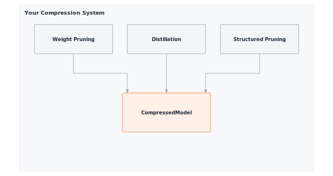

# Module 16: Compression

:::{.callout-note title="Module Info"}

**OPTIMIZATION TIER** | Difficulty: ●●●○ | Time: 5-7 hours | Prerequisites: 01-14

**Prerequisites: Modules 01-14** means you should have:

- Built tensors, layers, and the complete training pipeline (Modules 01-08)
- Implemented profiling tools to measure model characteristics (Module 14)
- Comfort with weight distributions, parameter counting, and memory analysis

If you can profile a model's parameters and understand weight distributions, you're ready.
:::

```{=html}
<div class="action-cards">
<div class="action-card">
<h4>🎧 Audio Overview</h4>
<p>Listen to an AI-generated overview.</p>
<audio controls style="width: 100%; height: 54px;">
<source src="https://github.com/harvard-edge/cs249r_book/releases/download/tinytorch-audio-v0.1.1/16_compression.mp3" type="audio/mpeg">
</audio>
</div>
<div class="action-card">
<h4>🚀 Launch Binder</h4>
<p>Run interactively in your browser.</p>
<a href="https://mybinder.org/v2/gh/harvard-edge/cs249r_book/main?labpath=tinytorch%2Fmodules%2F16_compression%2Fcompression.ipynb" class="action-btn btn-orange">Open in Binder →</a>
</div>
<div class="action-card">
<h4>📄 View Source</h4>
<p>Browse the source code on GitHub.</p>
<a href="https://github.com/harvard-edge/cs249r_book/blob/main/tinytorch/src/16_compression/16_compression.py" class="action-btn btn-teal">View on GitHub →</a>
</div>
</div>

<style>
.slide-viewer-container {
  margin: 0.5rem 0 1.5rem 0;
  background: #0f172a;
  border-radius: 1rem;
  overflow: hidden;
  box-shadow: 0 4px 20px rgba(0,0,0,0.15);
}
.slide-header {
  display: flex;
  align-items: center;
  justify-content: space-between;
  padding: 0.6rem 1rem;
  background: rgba(255,255,255,0.03);
}
.slide-title {
  display: flex;
  align-items: center;
  gap: 0.5rem;
  color: #94a3b8;
  font-weight: 500;
  font-size: 0.85rem;
}
.slide-subtitle {
  color: #64748b;
  font-weight: 400;
  font-size: 0.75rem;
}
.slide-toolbar {
  display: flex;
  align-items: center;
  gap: 0.375rem;
}
.slide-toolbar button {
  background: transparent;
  border: none;
  color: #64748b;
  width: 32px;
  height: 32px;
  border-radius: 0.375rem;
  cursor: pointer;
  font-size: 1.1rem;
  transition: all 0.15s;
  display: flex;
  align-items: center;
  justify-content: center;
}
.slide-toolbar button:hover {
  background: rgba(249, 115, 22, 0.15);
  color: #f97316;
}
.slide-nav-group {
  display: flex;
  align-items: center;
}
.slide-page-info {
  color: #64748b;
  font-size: 0.75rem;
  padding: 0 0.5rem;
  font-weight: 500;
}
.slide-zoom-group {
  display: flex;
  align-items: center;
  margin-left: 0.25rem;
  padding-left: 0.5rem;
  border-left: 1px solid rgba(255,255,255,0.1);
}
.slide-canvas-wrapper {
  display: flex;
  justify-content: center;
  align-items: center;
  padding: 0.5rem 1rem 1rem 1rem;
  min-height: 380px;
  background: #0f172a;
}
.slide-canvas {
  max-width: 100%;
  max-height: 350px;
  height: auto;
  border-radius: 0.5rem;
  box-shadow: 0 4px 24px rgba(0,0,0,0.4);
}
.slide-progress-wrapper {
  padding: 0 1rem 0.5rem 1rem;
}
.slide-progress-bar {
  height: 3px;
  background: rgba(255,255,255,0.08);
  border-radius: 1.5px;
  overflow: hidden;
  cursor: pointer;
}
.slide-progress-fill {
  height: 100%;
  background: #f97316;
  border-radius: 1.5px;
  transition: width 0.2s ease;
}
.slide-loading {
  color: #f97316;
  font-size: 0.9rem;
  display: flex;
  align-items: center;
  gap: 0.5rem;
}
.slide-loading::before {
  content: '';
  width: 18px;
  height: 18px;
  border: 2px solid rgba(249, 115, 22, 0.2);
  border-top-color: #f97316;
  border-radius: 50%;
  animation: slide-spin 0.8s linear infinite;
}
@keyframes slide-spin {
  to { transform: rotate(360deg); }
}
.slide-footer {
  display: flex;
  justify-content: center;
  gap: 0.5rem;
  padding: 0.6rem 1rem;
  background: rgba(255,255,255,0.02);
  border-top: 1px solid rgba(255,255,255,0.05);
}
.slide-footer a {
  display: inline-flex;
  align-items: center;
  gap: 0.375rem;
  background: #f97316;
  color: white;
  padding: 0.4rem 0.9rem;
  border-radius: 2rem;
  text-decoration: none;
  font-weight: 500;
  font-size: 0.75rem;
  transition: all 0.15s;
}
.slide-footer a:hover {
  background: #ea580c;
  color: white;
}
.slide-footer a.secondary {
  background: transparent;
  color: #94a3b8;
  border: 1px solid rgba(255,255,255,0.15);
}
.slide-footer a.secondary:hover {
  background: rgba(255,255,255,0.05);
  color: #f8fafc;
}
@media (max-width: 600px) {
  .slide-header { flex-direction: column; gap: 0.5rem; padding: 0.5rem 0.75rem; }
  .slide-toolbar button { width: 28px; height: 28px; }
  .slide-canvas-wrapper { min-height: 260px; padding: 0.5rem; }
  .slide-canvas { max-height: 220px; }
}
</style>

<div class="slide-viewer-container" id="slide-viewer-16_compression">
<div class="slide-header">
<div class="slide-title">
<span>🔥</span>
<span>Slide Deck</span>

<span class="slide-subtitle">· AI-generated</span>
</div>
<div class="slide-toolbar">
<div class="slide-nav-group">
<button onclick="slideNav('16_compression', -1)" title="Previous">‹</button>
<span class="slide-page-info"><span id="slide-num-16_compression">1</span> / <span id="slide-count-16_compression">-</span></span>
<button onclick="slideNav('16_compression', 1)" title="Next">›</button>
</div>
<div class="slide-zoom-group">
<button onclick="slideZoom('16_compression', -0.25)" title="Zoom out">−</button>
<button onclick="slideZoom('16_compression', 0.25)" title="Zoom in">+</button>
</div>
</div>
</div>
<div class="slide-canvas-wrapper">
<div id="slide-loading-16_compression" class="slide-loading">Loading slides...</div>
<canvas id="slide-canvas-16_compression" class="slide-canvas" style="display:none;"></canvas>
</div>
<div class="slide-progress-wrapper">
<div class="slide-progress-bar" onclick="slideProgress('16_compression', event)">
<div class="slide-progress-fill" id="slide-progress-16_compression" style="width: 0%;"></div>
</div>
</div>
<div class="slide-footer">
<a href="../assets/slides/16_compression.pdf" download>⬇ Download</a>
<a href="#" onclick="slideFullscreen('16_compression'); return false;" class="secondary">⛶ Fullscreen</a>
</div>
</div>

<script src="https://cdnjs.cloudflare.com/ajax/libs/pdf.js/3.11.174/pdf.min.js"></script>
<script>
(function() {
  if (window.slideViewersInitialized) return;
  window.slideViewersInitialized = true;

  pdfjsLib.GlobalWorkerOptions.workerSrc = 'https://cdnjs.cloudflare.com/ajax/libs/pdf.js/3.11.174/pdf.worker.min.js';

  window.slideViewers = {};

  window.initSlideViewer = function(id, pdfUrl) {
    const viewer = { pdf: null, page: 1, scale: 1.3, rendering: false, pending: null };
    window.slideViewers[id] = viewer;

    const canvas = document.getElementById('slide-canvas-' + id);
    const ctx = canvas.getContext('2d');

    function render(num) {
      viewer.rendering = true;
      viewer.pdf.getPage(num).then(function(page) {
        const viewport = page.getViewport({scale: viewer.scale});
        canvas.height = viewport.height;
        canvas.width = viewport.width;
        page.render({canvasContext: ctx, viewport: viewport}).promise.then(function() {
          viewer.rendering = false;
          if (viewer.pending !== null) { render(viewer.pending); viewer.pending = null; }
        });
      });
      document.getElementById('slide-num-' + id).textContent = num;
      document.getElementById('slide-progress-' + id).style.width = (num / viewer.pdf.numPages * 100) + '%';
    }

    function queue(num) { if (viewer.rendering) viewer.pending = num; else render(num); }

    pdfjsLib.getDocument(pdfUrl).promise.then(function(pdf) {
      viewer.pdf = pdf;
      document.getElementById('slide-count-' + id).textContent = pdf.numPages;
      document.getElementById('slide-loading-' + id).style.display = 'none';
      canvas.style.display = 'block';
      render(1);
    }).catch(function() {
      document.getElementById('slide-loading-' + id).innerHTML = 'Unable to load. <a href="' + pdfUrl + '" style="color:#f97316;">Download PDF</a>';
    });

    viewer.queue = queue;
  };

  window.slideNav = function(id, dir) {
    const v = window.slideViewers[id];
    if (!v || !v.pdf) return;
    const newPage = v.page + dir;
    if (newPage >= 1 && newPage <= v.pdf.numPages) { v.page = newPage; v.queue(newPage); }
  };

  window.slideZoom = function(id, delta) {
    const v = window.slideViewers[id];
    if (!v) return;
    v.scale = Math.max(0.5, Math.min(3, v.scale + delta));
    v.queue(v.page);
  };

  window.slideProgress = function(id, event) {
    const v = window.slideViewers[id];
    if (!v || !v.pdf) return;
    const bar = event.currentTarget;
    const pct = (event.clientX - bar.getBoundingClientRect().left) / bar.offsetWidth;
    const newPage = Math.max(1, Math.min(v.pdf.numPages, Math.ceil(pct * v.pdf.numPages)));
    if (newPage !== v.page) { v.page = newPage; v.queue(newPage); }
  };

  window.slideFullscreen = function(id) {
    const el = document.getElementById('slide-viewer-' + id);
    if (el.requestFullscreen) el.requestFullscreen();
    else if (el.webkitRequestFullscreen) el.webkitRequestFullscreen();
  };
})();

initSlideViewer('16_compression', '../assets/slides/16_compression.pdf');

</script>

```
## Overview

A modern language model takes 100GB of storage. A phone gives you less than 1GB. A microcontroller gives you under 100KB. The model that wins the benchmark and the model that ships are not the same artifact — and the gap between them is what compression closes.

The trick is that trained networks are mostly dead weight. Studies routinely find that 80–90% of a model's parameters can be removed or approximated with negligible loss in accuracy. In this module you implement four techniques that exploit that redundancy: magnitude pruning zeroes the smallest weights, structured pruning drops entire channels so the hardware can actually skip them, knowledge distillation trains a small student to mimic a large teacher, and low-rank approximation factors weight matrices through SVD. By the end you can take a working model and produce a smaller one, while reasoning about where the accuracy went.

## Learning Objectives

:::{.callout-tip title="By completing this module, you will:"}

- **Implement** magnitude-based pruning to remove 80-90% of small weights while preserving accuracy
- **Master** structured pruning that creates hardware-friendly sparsity patterns by removing entire channels
- **Build** knowledge distillation systems that compress models 10x through teacher-student training
- **Understand** compression trade-offs between sparsity ratio, inference speed, memory footprint, and accuracy preservation
- **Analyze** when to apply different compression techniques based on deployment constraints and performance requirements
:::

## What You'll Build


::: {#fig-16_compression-diag-1 fig-env="figure" fig-pos="htb" fig-cap="**TinyTorch Compression System**: Reducing model size via pruning and distillation." fig-alt="Diagram showing pruning strategies and the teacher-student distillation process."}



:::


**Implementation roadmap:**

| Step | What You'll Implement | Key Concept |
|------|----------------------|-------------|
| 1 | `measure_sparsity()` | Calculate percentage of zero weights |
| 2 | `magnitude_prune()` | Remove weights below threshold |
| 3 | `structured_prune()` | Remove entire channels by importance |
| 4 | `KnowledgeDistillation` | Train small model from large teacher |
| 5 | `low_rank_approximate()` | Compress matrices via SVD |

**The pattern you'll enable:**
```python
# Compress a model by removing 80% of smallest weights
magnitude_prune(model, sparsity=0.8)
sparsity = measure_sparsity(model)  # Returns ~80%
```

### What You're NOT Building

To keep the module focused, you will **not** implement:

- Sparse storage formats like CSR (production frameworks delegate to `scipy.sparse`)
- Iterative prune-and-fine-tune schedules
- Dynamic pruning during training via hooks and callbacks
- Joint quantization + pruning pipelines

You are building the **algorithms** that decide which weights to remove and how. Squeezing real wall-clock speedup out of the resulting sparsity is the job of the kernels in the next module.

## API Reference

This section provides a quick reference for the compression functions and classes you'll build. Use it as your guide while implementing and debugging.

### Sparsity Measurement

```python
measure_sparsity(model) -> float
```

Calculate the percentage of zero weights in a model. Essential for tracking compression effectiveness.

### Pruning Methods

| Function | Signature | Description |
|----------|-----------|-------------|
| `magnitude_prune` | `magnitude_prune(model, sparsity=0.9)` | Remove smallest weights to achieve target sparsity |
| `structured_prune` | `structured_prune(model, prune_ratio=0.5)` | Remove entire channels based on L2 norm importance |

### Knowledge Distillation

```python
KnowledgeDistillation(teacher_model, student_model, temperature=3.0, alpha=0.7)
```

**Constructor Parameters:**
- `teacher_model`: Large pre-trained model with high accuracy
- `student_model`: Smaller model to train via distillation
- `temperature`: Softening parameter for probability distributions (typical: 3-5)
- `alpha`: Weight for soft targets (0.7 = 70% teacher, 30% hard labels)

**Key Methods:**

| Method | Signature | Description |
|--------|-----------|-------------|
| `distillation_loss` | `distillation_loss(student_logits, teacher_logits, true_labels) -> float` | Combined soft and hard target loss |

### Low-Rank Approximation

```python
low_rank_approximate(weight_matrix, rank_ratio=0.5) -> Tuple[ndarray, ndarray, ndarray]
```

**Parameters:**
- `weight_matrix`: Weight matrix to compress (e.g., (512, 256) Linear layer weights)
- `rank_ratio`: Fraction of original rank to keep (0.5 = keep 50% of singular values)

**Returns:**
- `U`: Left singular vectors (shape: m × k)
- `S`: Singular values (shape: k)
- `V`: Right singular vectors (shape: k × n)

Where k = rank_ratio × min(m, n). Reconstruct approximation with `U @ diag(S) @ V`.

## Core Concepts

This section covers the fundamental ideas you need to understand model compression deeply. These concepts apply across all ML frameworks and deployment scenarios.

### Pruning Fundamentals

Trained networks are over-parameterized: 50–90% of their weights contribute almost nothing to predictions. Pruning exploits that slack by zeroing the deadweight, leaving a sparse network that computes nearly the same function with a fraction of the parameters.

The signal you key off is magnitude. When you compute `y = W @ x`, a weight of 0.001 barely moves the output compared to one of magnitude 2.0 or 3.0. Find the small ones, zero them, and most of the network's behavior survives.

Here's how your magnitude pruning implementation works:

```python
def magnitude_prune(model, sparsity=0.9):
    """Remove weights with smallest magnitudes to achieve target sparsity."""
    # Collect all weights from model (excluding biases)
    all_weights = []
    weight_params = []

    for param in model.parameters():
        if len(param.shape) > 1:  # Only weight matrices, not bias vectors
            all_weights.extend(param.data.flatten())
            weight_params.append(param)

    # Calculate magnitude threshold at desired percentile
    magnitudes = np.abs(all_weights)
    threshold = np.percentile(magnitudes, sparsity * 100)

    # Apply pruning mask: zero out weights below threshold
    for param in weight_params:
        mask = np.abs(param.data) >= threshold
        param.data = param.data * mask  # In-place zeroing

    return model
```

The elegance is in the percentile-based threshold. Setting `sparsity=0.9` means "remove the bottom 90% of weights by magnitude." NumPy's `percentile` function finds the exact value that splits the distribution, and then a binary mask zeros out everything below that threshold.

To understand why this works, consider a typical weight distribution after training:

```
Weight Magnitudes (sorted):
[0.001, 0.002, 0.003, ..., 0.085, 0.087, ..., 0.95, 1.2, 2.3, 3.1]
 └──────────────── 90% ────────────────┘  └────── 10% ──────┘
        Small, removable                    Large, important

90th percentile = 0.087
Threshold mask: magnitude >= 0.087
Result: Keep only weights >= 0.087 (top 10%)
```

The critical insight is that weight distributions in trained networks are heavily skewed toward zero. Most weights contribute minimally, so removing them preserves the essential computation while dramatically reducing storage and compute.

The memory impact is immediate. A model with 10 million parameters at 90% sparsity has only 1 million active weights. With sparse storage formats (like scipy's CSR matrix), that translates to a 90% memory reduction. The compute savings come from skipping zero multiplications, but cashing them in requires sparse-computation libraries — which is exactly why structured pruning exists.

**Complexity of pruning itself:** finding the global magnitude threshold is O(N log N) for a sort (or O(N) with quickselect / `np.partition`) across N total weights — a one-shot cost that dominates nothing. The *compression ratio* as a function of sparsity level s (fraction removed) is simply 1/(1-s): at s=0.5 you halve the storage, at s=0.9 you get 10× compression, at s=0.99 you get 100×. But the *compute* ratio only tracks this if the sparse kernel can actually skip the zeros — and on dense accelerators it cannot, which motivates the structured/unstructured distinction below.

### Structured vs Unstructured Pruning

Magnitude pruning creates unstructured sparsity: zeros scattered randomly throughout weight matrices. This achieves high compression ratios but creates irregular memory access patterns that modern hardware struggles to accelerate. Structured pruning solves this by removing entire computational units like channels, neurons, or attention heads.

Think of the difference like editing text. Unstructured pruning removes random letters from words, making them hard to read quickly. Structured pruning removes entire words or sentences, preserving readability while reducing length.

```
Unstructured Sparsity (Magnitude Pruning):
┌─────────────────────────────────────────┐
│ Channel 0: [2.1, 0.0, 1.8, 0.0, 3.2]    │ ← Scattered zeros
│ Channel 1: [0.0, 2.8, 0.0, 2.1, 0.0]    │ ← Irregular pattern
│ Channel 2: [1.5, 0.0, 2.4, 0.0, 1.9]    │ ← Hard to optimize
└─────────────────────────────────────────┘

Structured Sparsity (Channel Pruning):
┌─────────────────────────────────────────┐
│ Channel 0: [2.1, 1.3, 1.8, 0.9, 3.2]    │ ← Fully dense
│ Channel 1: [0.0, 0.0, 0.0, 0.0, 0.0]    │ ← Fully removed
│ Channel 2: [1.5, 2.2, 2.4, 1.1, 1.9]    │ ← Fully dense
└─────────────────────────────────────────┘
```

Structured pruning requires deciding which channels to remove. Your implementation uses L2 norm as an importance metric:

```python
def structured_prune(model, prune_ratio=0.5):
    """Remove entire channels based on L2 norm importance."""
    for layer in model.layers:
        if isinstance(layer, Linear):
            weight = layer.weight.data

            # Calculate L2 norm for each output channel (column)
            channel_norms = np.linalg.norm(weight, axis=0)

            # Find channels to prune (lowest importance)
            num_channels = weight.shape[1]
            num_to_prune = int(num_channels * prune_ratio)

            if num_to_prune > 0:
                # Get indices of smallest channels
                prune_indices = np.argpartition(channel_norms, num_to_prune)[:num_to_prune]

                # Zero out entire channels
                weight[:, prune_indices] = 0

                # Also zero corresponding bias elements
                if layer.bias is not None:
                    layer.bias.data[prune_indices] = 0

    return model
```

The L2 norm `||W[:,i]||_2 = sqrt(sum(w_j^2))` measures the total magnitude of a channel. Channels with small norms contribute less to the output, so dropping them costs the least. Removing whole channels also creates *block* sparsity, which hardware can vectorize over the channels that remain.

The key insight in structured pruning is that you remove entire computational units, not scattered weights. When you zero out channel `i` in layer `l`, you're eliminating:
- All connections from that channel to the next layer (forward propagation)
- All gradient computation for that channel (backward propagation)
- The entire channel's activation storage (memory footprint reduction)

At first glance, structured pruning might seem inferior because it achieves lower overall compression than magnitude pruning. However, the theoretical parameter reduction of unstructured sparsity rarely translates to actual inference speedups on modern hardware.

:::{.callout-note title="Systems Implication: The Hardware Lottery"}
Why accept lower sparsity ratios with structured pruning? It comes down to the "Hardware Lottery." Modern AI accelerators—whether NVIDIA GPUs, Google TPUs, or edge NPUs—are fundamentally designed for dense matrix multiplication. They rely on contiguous memory accesses and highly parallel vector engines. These architectures cannot efficiently skip scattered zeros without incurring complex, slow indexing overhead that destroys performance. Structured pruning, by removing entire channels, creates smaller but perfectly dense matrices. Instead of forcing the hardware to adapt to an irregular algorithm, you are adapting the algorithm to win the hardware lottery, ensuring the underlying silicon executes the remaining work at peak efficiency.
:::

Because structured pruning preserves dense computation, it directly enables:
1. **Memory Coalescing**: Hardware can fetch the remaining dense channels sequentially, maximizing memory bandwidth utilization.
2. **SIMD Vectorization**: CPUs and GPUs can process multiple channels in perfect parallel lockstep.
3. **Zero Indexing Overhead**: Execution does not require specialized sparse matrix formats (like CSR) to track non-zero locations.
4. **Cache Spatial Locality**: Sequential memory access perfectly aligns with L1/L2 cache line prefetching.

The ultimate trade-off is clear: structured pruning achieves lower sparsity (typically 30-50%) than magnitude pruning (80-90%), but the block sparsity it yields translates directly to proportional hardware acceleration. On dense accelerators, structured sparsity routinely provides 2-3x end-to-end speedups, whereas unstructured sparsity often results in zero acceleration—or even slowdowns—without bespoke sparse computational kernels.

### Knowledge Distillation

Pruning and SVD shrink an existing model in place. Distillation does something stranger: it builds a brand-new, smaller model and trains it to imitate the bigger one. The large "teacher" never ships — it only exists to supervise the compact "student" that does.

The trick is the *kind* of supervision. Standard training uses one-hot labels — for a cat image, `[0, 0, 1, 0]` (100% cat). The teacher's predictions are softer: `[0.02, 0.05, 0.85, 0.08]` (85% cat, with some mass on visually similar classes). Those off-diagonal probabilities are the teacher's tacit knowledge about class similarity, and they teach the student more per gradient step than a hard label ever could.

Temperature scaling controls how soft the distributions become:

```python
def _softmax(self, logits):
    """Compute softmax with numerical stability."""
    exp_logits = np.exp(logits - np.max(logits, axis=-1, keepdims=True))
    return exp_logits / np.sum(exp_logits, axis=-1, keepdims=True)

def distillation_loss(self, student_logits, teacher_logits, true_labels):
    """Calculate combined distillation loss."""
    # Soften distributions with temperature
    student_soft = self._softmax(student_logits / self.temperature)
    teacher_soft = self._softmax(teacher_logits / self.temperature)

    # Soft target loss (KL divergence)
    soft_loss = self._kl_divergence(student_soft, teacher_soft)

    # Hard target loss (cross-entropy)
    student_hard = self._softmax(student_logits)
    hard_loss = self._cross_entropy(student_hard, true_labels)

    # Combined loss
    total_loss = self.alpha * soft_loss + (1 - self.alpha) * hard_loss

    return total_loss
```

Dividing logits by temperature before softmax spreads probability mass across classes. At `temperature=1` you get the usual peaked softmax. At `temperature=3` the distribution flattens, exposing the teacher's relative uncertainty between classes. The student learns both what the teacher picks *and* what it almost picked.

The combined loss balances two pressures. The soft loss (weighted `alpha=0.7`) pushes the student to imitate the teacher's reasoning. The hard loss (weighted `1-alpha=0.3`) keeps it anchored to the ground truth. With this recipe, students routinely match teachers at 10x compression with 2–5% accuracy loss.

### Low-Rank Approximation Theory

Weight matrices in trained networks are usually closer to low-rank than they look. Singular Value Decomposition (SVD) gives you the mathematically optimal way to approximate any matrix with fewer parameters, ranked by how much variance each direction explains.

The mechanism is matrix factorization. Instead of storing a full (512, 256) weight matrix with 131,072 parameters, you decompose it into two thinner matrices that capture the essential structure:

```python
def low_rank_approximate(weight_matrix, rank_ratio=0.5):
    """Approximate weight matrix using SVD-based low-rank decomposition."""
    m, n = weight_matrix.shape

    # Perform SVD: W = U @ diag(S) @ V
    U, S, V = np.linalg.svd(weight_matrix, full_matrices=False)

    # Keep only top-k singular values
    max_rank = min(m, n)
    target_rank = max(1, int(rank_ratio * max_rank))

    # Truncate to target rank
    U_truncated = U[:, :target_rank]     # (m, k)
    S_truncated = S[:target_rank]         # (k,)
    V_truncated = V[:target_rank, :]      # (k, n)

    return U_truncated, S_truncated, V_truncated
```

SVD identifies the principal "directions" in the weight matrix through singular values. Larger singular values capture more variance, so keeping the top k preserves most of the matrix's information at a fraction of the parameter cost.

For a (512, 256) matrix with `rank_ratio=0.5`:

- Original: 512 × 256 = 131,072 parameters
- Compressed: (512 × 128) + 128 + (128 × 256) = 98,432 parameters
- Compression ratio: 1.33x (25% reduction)

The win compounds with larger matrices. For a (1024, 1024) matrix at `rank_ratio=0.1`:

- Original: 1,048,576 parameters
- Compressed: (1024 × 102) + 102 + (102 × 1024) = 208,998 parameters
- Compression ratio: 5.0x (80% reduction)

The pattern: SVD pays off most where the matrix is wide and the intrinsic rank is low. The reconstruction error you absorb is exactly the sum of squares of the singular values you threw away — pick `rank_ratio` by looking at the singular value spectrum, not by guessing.

### Compression Trade-offs

Every compression technique trades accuracy for efficiency, but different techniques make different trade-offs. Understanding these helps you choose the right approach for your deployment constraints.

| Technique | Compression Ratio | Accuracy Loss | Hardware Speedup | Training Required |
|-----------|-------------------|---------------|------------------|-------------------|
| **Magnitude Pruning** | 5-10x | 1-3% | Minimal (needs sparse libs) | No (prune pretrained) |
| **Structured Pruning** | 2-3x | 2-5% | 2-3x (hardware-friendly) | No (prune pretrained) |
| **Knowledge Distillation** | 10-50x | 5-10% | Proportional to size | Yes (train student) |
| **Low-Rank Approximation** | 2-5x | 3-7% | Minimal (depends on impl) | No (SVD decomposition) |

The systems insight is that compression ratio alone does not determine deployment success. A 10x compressed model from magnitude pruning can run *slower* than a 3x compressed model from structured pruning, because the hardware cannot accelerate scattered zeros. Distillation buys the best size-for-accuracy ratio, but only if you have the training budget to retrain a student. Pick the technique that matches the bottleneck — memory, latency, or training time — not the one with the prettiest sparsity number.

## Production Context

### Your Implementation vs. PyTorch

Your TinyTorch compression functions and PyTorch's pruning utilities share the same core algorithms. The differences are in integration depth: PyTorch provides hooks for pruning during training, automatic mask management, and integration with quantization-aware training. But the fundamental magnitude-based and structured pruning logic is identical.

| Feature | Your Implementation | PyTorch |
|---------|---------------------|---------|
| **Magnitude Pruning** | Global threshold via percentile | `torch.nn.utils.prune.l1_unstructured` |
| **Structured Pruning** | L2 norm channel removal | `torch.nn.utils.prune.ln_structured` |
| **Knowledge Distillation** | Manual loss calculation | User-implemented (same approach) |
| **Sparse Execution** | ✗ Dense NumPy arrays | ✓ Sparse tensors + kernels |
| **Pruning Schedules** | One-shot pruning | Iterative + fine-tuning |

### Code Comparison

The following comparison shows equivalent compression operations in TinyTorch and PyTorch. Notice how the core concepts translate directly while PyTorch provides additional automation for production workflows.

::: {.panel-tabset}
## Your TinyTorch
```python
from tinytorch.perf.compression import magnitude_prune, measure_sparsity

# Create model
model = Sequential(Linear(100, 50), ReLU(), Linear(50, 10))

# Apply magnitude pruning
magnitude_prune(model, sparsity=0.8)

# Measure results
sparsity = measure_sparsity(model)  # Returns 80.0 (percentage)
print(f"Sparsity: {sparsity:.1f}%")
```

## PyTorch
```python
import torch
import torch.nn as nn
import torch.nn.utils.prune as prune

# Create model
model = nn.Sequential(
    nn.Linear(100, 50),
    nn.ReLU(),
    nn.Linear(50, 10)
)

# Apply magnitude pruning
for module in model.modules():
    if isinstance(module, nn.Linear):
        prune.l1_unstructured(module, name='weight', amount=0.8)
        prune.remove(module, 'weight')  # Make pruning permanent

# Measure results
total_params = sum(p.numel() for p in model.parameters())
zero_params = sum((p == 0).sum().item() for p in model.parameters())
sparsity = zero_params / total_params
print(f"Sparsity: {sparsity:.1%}")
```
:::

Let's walk through the key differences:

- **Line 1 (Import)**: TinyTorch provides compression in a dedicated `perf.compression` module. PyTorch's `torch.nn.utils.prune` offers similar functionality with additional hooks.
- **Line 4-5 (Model)**: Both create identical model architectures. PyTorch's `nn.Sequential` matches TinyTorch's explicit layer composition.
- **Line 8 (Pruning)**: TinyTorch uses a simple function call that operates on the entire model. PyTorch requires iterating over modules and applying pruning individually, offering finer control.
- **Line 13 (Permanence)**: TinyTorch immediately zeros weights. PyTorch uses masks that can be removed or made permanent, enabling experimentation with different sparsity levels.
- **Line 16-19 (Measurement)**: TinyTorch provides a dedicated `measure_sparsity()` function. PyTorch requires manual counting, giving you full control over what counts as "sparse."

:::{.callout-tip title="What's Identical"}

The core algorithms for magnitude thresholding, L2 norm channel ranking, and knowledge distillation loss are identical. When you understand TinyTorch compression, you understand PyTorch compression. The production differences are in automation, not algorithms.
:::

### Why Compression Matters at Scale

The deployment constraints make the case for compression more bluntly than any benchmark:

- **Mobile apps** — models must fit under ~10MB for download and ~50MB for runtime memory
- **Edge devices** — a Raspberry Pi 4 has 4GB total RAM, shared with the OS and every other process
- **Cloud cost** — GPT-class inference costs millions per month at scale; 10x compression is 10x cheaper
- **Latency targets** — self-driving stacks need <100ms end-to-end; compression buys most of that budget
- **Energy** — phone batteries are ~3000mAh, and bigger models drain them faster

A 100 MB model pruned to 90% sparsity becomes 10 MB with sparse storage, which fits the mobile budget. Distilled down to a 1 MB student, it also runs 10x faster, which fits the latency budget. These aren't projections — they're the entry conditions for shipping at all.

## Check Your Understanding

:::{.callout-tip title="Check Your Understanding — Compression"}
Before moving on, verify you can articulate each of the following:

- [ ] The Hardware Lottery: why structured sparsity beats unstructured for real-world speedups on dense accelerators, even at lower compression ratios.
- [ ] How magnitude pruning picks a threshold from the global weight distribution, and why compression ratio = 1/(1 - sparsity).
- [ ] Why knowledge distillation's soft targets (teacher logits under temperature) teach more than one-hot labels per gradient step.
- [ ] When low-rank approximation pays off (wide matrices, low intrinsic rank) and when SVD is wasted effort.

If any of these feels fuzzy, revisit the Core Concepts section (especially Structured vs Unstructured Pruning and Compression Trade-offs) before moving on.
:::

Test yourself with these systems-thinking questions. They're built to sharpen the intuition you'll need every time you compress a model in production.

**Q1: Sparsity Calculation**

A Linear layer with shape (512, 256) undergoes 80% magnitude pruning. How many weights remain active?

:::{.callout-tip collapse="true" title="Answer"}

Total parameters: 512 × 256 = **131,072**

After 80% pruning: 20% remain active = 131,072 × 0.2 = **26,214 active weights**

Zeroed weights: 131,072 × 0.8 = **104,857 zeros**

This is why sparsity creates memory savings — 80% of the parameters are literally zero.
:::

**Q2: Compression Ratio Analysis**

You apply magnitude pruning (90% sparsity) and structured pruning (50% channels) sequentially. What's the final sparsity?

:::{.callout-tip collapse="true" title="Answer"}

**Trick question!** Structured pruning zeros entire channels, which may already be partially sparse from magnitude pruning.

Approximation:
- After magnitude: 90% sparse → 10% active weights
- Structured removes 50% of channels → removes 50% of rows/columns
- Final active weights ≈ 10% × 50% = **5% active → 95% sparse**

Actual result depends on which channels structured pruning removes. If it removes already-sparse channels, sparsity increases less.
:::

**Q3: Knowledge Distillation Efficiency**

Teacher model: 100M parameters, 95% accuracy, 500ms inference
Student model: 10M parameters, 92% accuracy, 50ms inference

What's the compression ratio and speedup?

:::{.callout-tip collapse="true" title="Answer"}

**Compression ratio**: 100M / 10M = **10x smaller**

**Speedup**: 500ms / 50ms = **10x faster**

**Accuracy loss**: 95% − 92% = **3% degradation**

Why speedup matches compression: the student has 10x fewer parameters, so roughly 10x fewer ops. Linear scaling.

Is this a good trade? **Yes** — 10x compression for 3% accuracy loss is the sweet spot for mobile deployment.
:::

**Q4: Low-Rank Decomposition Math**

A (1000, 1000) weight matrix gets low-rank approximation with rank=100. Calculate parameter reduction.

:::{.callout-tip collapse="true" title="Answer"}

Original: 1000 × 1000 = **1,000,000 parameters**

SVD decomposition: W ≈ U @ diag(S) @ V

- U: (1000, 100) = 100,000 parameters
- S: (100,) = 100 parameters (diagonal)
- V: (100, 1000) = 100,000 parameters

Compressed: 100,000 + 100 + 100,000 = **200,100 parameters**

Compression ratio: 1,000,000 / 200,100 = **~5x reduction**

Memory savings: (1,000,000 − 200,100) × 4 bytes = **3.1 MB saved** (float32)
:::

**Q5: Structured vs Unstructured Trade-offs**

For mobile deployment with tight latency constraints, would you choose magnitude pruning (90% sparsity) or structured pruning (30% sparsity)? Why?

:::{.callout-tip collapse="true" title="Answer"}

**Choose structured pruning (30% sparsity)** despite lower compression.

Reasoning:
1. **Hardware acceleration**: Mobile CPUs/GPUs can execute dense channels 2-3x faster than sparse patterns
2. **Latency guarantee**: Structured sparsity gives predictable speedup; magnitude sparsity needs sparse libraries (often unavailable on mobile)
3. **Real speedup**: 30% structured = ~1.5x actual speedup; 90% magnitude = no speedup without custom kernels
4. **Memory**: Both save memory, but latency requirement dominates

**Production insight**: High sparsity ≠ high speedup. Hardware capabilities matter more than compression ratio for latency-critical applications.
:::

## Key Takeaways

- **Compression ratio is 1/(1 − sparsity):** the arithmetic is trivial; the engineering question is whether the underlying kernel can actually skip zeros.
- **Structured > unstructured on dense hardware:** 30–50% structured sparsity beats 90% unstructured sparsity in wall-clock time, because modern accelerators execute dense tiles and pay indexing overhead for scattered zeros.
- **Distillation compresses by transferring knowledge, not zeroing weights:** the student is a new, smaller network trained on the teacher's soft outputs — worth the extra training budget when size-for-accuracy is the goal.
- **SVD pays off for wide, low-rank matrices:** pick the rank ratio from the singular-value spectrum, not by guessing.

**Coming next:** Module 17 answers the question every pruning pass begs — why isn't the model 10× faster? — by building the vectorized kernels, cache-aware tiling, and kernel fusion that turn structured sparsity into measurable wall-clock speedup.

## Further Reading

For students who want to understand the academic foundations and explore compression techniques further:

### Seminal Papers

- **Learning both Weights and Connections for Efficient Neural Networks** - Han et al. (2015). Introduced magnitude-based pruning and demonstrated 90% sparsity with minimal accuracy loss. Foundation for modern pruning research. [arXiv:1506.02626](https://arxiv.org/abs/1506.02626)

- **The Lottery Ticket Hypothesis** - Frankle & Carlin (2019). Showed that dense networks contain sparse subnetworks trainable to full accuracy from initialization. Changed how we think about pruning and network over-parameterization. [arXiv:1803.03635](https://arxiv.org/abs/1803.03635)

- **Distilling the Knowledge in a Neural Network** - Hinton et al. (2015). Introduced knowledge distillation with temperature scaling. Enables training compact models that match large model accuracy. [arXiv:1503.02531](https://arxiv.org/abs/1503.02531)

- **Pruning Filters for Efficient ConvNets** - Li et al. (2017). Demonstrated structured pruning by removing entire convolutional filters. Showed that L1-norm ranking identifies unimportant channels effectively. [arXiv:1608.08710](https://arxiv.org/abs/1608.08710)

### Additional Resources

- **Survey**: "Model Compression and Hardware Acceleration for Neural Networks" by Deng et al. (2020) - Comprehensive overview of compression techniques and hardware implications
- **Tutorial**: [PyTorch Pruning Tutorial](https://pytorch.org/tutorials/intermediate/pruning_tutorial.html) - See how production frameworks implement these concepts
- **Blog**: "The State of Sparsity in Deep Neural Networks" by Uber Engineering - Practical experiences deploying sparse models at scale

## What's Next

You now have a model that is 10x smaller on paper. Module 17 answers the question that follows immediately: *why isn't it 10x faster?* Sparsity and low rank only show up in wall-clock time when the underlying kernels know how to skip zeros and reuse memory. Without that, your pruned weights are still being multiplied — by zero, but multiplied.

:::{.callout-note title="Coming Up: Module 17 — Acceleration"}

Implement hardware-aware optimizations: vectorized matrix kernels, operator fusion, and cache-friendly tiling. You'll fuse multiple ops into single passes to cut memory-bandwidth pressure and turn the structured sparsity from this module into measurable speedup.
:::

**Preview — how your compression gets used in future modules:**

| Module | What It Does | Your Compression In Action |
|--------|--------------|---------------------------|
| **17: Acceleration** | Optimize computation kernels | Structured sparsity enables vectorized operations |
| **18: Memoization** | Cache repeated computations | `compress_model()` before caching for memory efficiency |
| **19: Benchmarking** | Measure end-to-end performance | Compare dense vs sparse model throughput |

## Get Started

:::{.callout-tip title="Interactive Options"}

- **[Launch Binder](https://mybinder.org/v2/gh/harvard-edge/cs249r_book/main?urlpath=lab/tree/tinytorch/modules/16_compression/compression.ipynb)** - Run interactively in browser, no setup required
- **[View Source](https://github.com/harvard-edge/cs249r_book/blob/main/tinytorch/src/16_compression/16_compression.py)** - Browse the implementation code
:::

:::{.callout-warning title="Save Your Progress"}

Binder sessions are temporary. Download your completed notebook when done, or clone the repository for persistent local work.
:::
