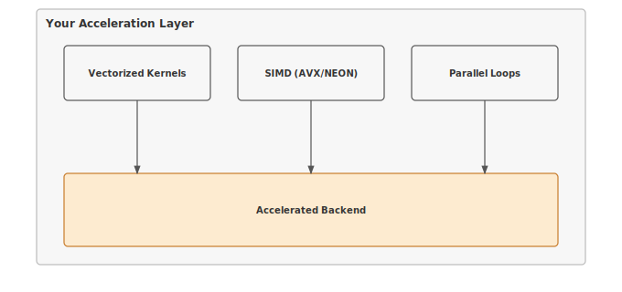

# Module 17: Acceleration

:::{.callout-note title="Module Info"}

**OPTIMIZATION TIER** | Difficulty: ●●●○ | Time: 5-7 hours | Prerequisites: 01-14

**Prerequisites: Modules 01-14** means you need:

- Tensor operations (Module 01) for understanding data structures
- Neural network layers (Module 03) for knowing what to accelerate
- Training loops (Module 08) for understanding the performance context
- Profiling tools (Module 14) for measuring acceleration gains

If you can multiply matrices and understand why matrix multiplication is expensive, you're ready.
:::

```{=html}
<div class="action-cards">
<div class="action-card">
<h4>🎧 Audio Overview</h4>
<p>Listen to an AI-generated overview.</p>
<audio controls style="width: 100%; height: 54px;">
<source src="https://github.com/harvard-edge/cs249r_book/releases/download/tinytorch-audio-v0.1.1/17_acceleration.mp3" type="audio/mpeg">
</audio>
</div>
<div class="action-card">
<h4>🚀 Launch Binder</h4>
<p>Run interactively in your browser.</p>
<a href="https://mybinder.org/v2/gh/harvard-edge/cs249r_book/main?labpath=tinytorch%2Fmodules%2F17_acceleration%2Facceleration.ipynb" class="action-btn btn-orange">Open in Binder →</a>
</div>
<div class="action-card">
<h4>📄 View Source</h4>
<p>Browse the source code on GitHub.</p>
<a href="https://github.com/harvard-edge/cs249r_book/blob/main/tinytorch/src/17_acceleration/17_acceleration.py" class="action-btn btn-teal">View on GitHub →</a>
</div>
</div>

<style>
.slide-viewer-container {
  margin: 0.5rem 0 1.5rem 0;
  background: #0f172a;
  border-radius: 1rem;
  overflow: hidden;
  box-shadow: 0 4px 20px rgba(0,0,0,0.15);
}
.slide-header {
  display: flex;
  align-items: center;
  justify-content: space-between;
  padding: 0.6rem 1rem;
  background: rgba(255,255,255,0.03);
}
.slide-title {
  display: flex;
  align-items: center;
  gap: 0.5rem;
  color: #94a3b8;
  font-weight: 500;
  font-size: 0.85rem;
}
.slide-subtitle {
  color: #64748b;
  font-weight: 400;
  font-size: 0.75rem;
}
.slide-toolbar {
  display: flex;
  align-items: center;
  gap: 0.375rem;
}
.slide-toolbar button {
  background: transparent;
  border: none;
  color: #64748b;
  width: 32px;
  height: 32px;
  border-radius: 0.375rem;
  cursor: pointer;
  font-size: 1.1rem;
  transition: all 0.15s;
  display: flex;
  align-items: center;
  justify-content: center;
}
.slide-toolbar button:hover {
  background: rgba(249, 115, 22, 0.15);
  color: #f97316;
}
.slide-nav-group {
  display: flex;
  align-items: center;
}
.slide-page-info {
  color: #64748b;
  font-size: 0.75rem;
  padding: 0 0.5rem;
  font-weight: 500;
}
.slide-zoom-group {
  display: flex;
  align-items: center;
  margin-left: 0.25rem;
  padding-left: 0.5rem;
  border-left: 1px solid rgba(255,255,255,0.1);
}
.slide-canvas-wrapper {
  display: flex;
  justify-content: center;
  align-items: center;
  padding: 0.5rem 1rem 1rem 1rem;
  min-height: 380px;
  background: #0f172a;
}
.slide-canvas {
  max-width: 100%;
  max-height: 350px;
  height: auto;
  border-radius: 0.5rem;
  box-shadow: 0 4px 24px rgba(0,0,0,0.4);
}
.slide-progress-wrapper {
  padding: 0 1rem 0.5rem 1rem;
}
.slide-progress-bar {
  height: 3px;
  background: rgba(255,255,255,0.08);
  border-radius: 1.5px;
  overflow: hidden;
  cursor: pointer;
}
.slide-progress-fill {
  height: 100%;
  background: #f97316;
  border-radius: 1.5px;
  transition: width 0.2s ease;
}
.slide-loading {
  color: #f97316;
  font-size: 0.9rem;
  display: flex;
  align-items: center;
  gap: 0.5rem;
}
.slide-loading::before {
  content: '';
  width: 18px;
  height: 18px;
  border: 2px solid rgba(249, 115, 22, 0.2);
  border-top-color: #f97316;
  border-radius: 50%;
  animation: slide-spin 0.8s linear infinite;
}
@keyframes slide-spin {
  to { transform: rotate(360deg); }
}
.slide-footer {
  display: flex;
  justify-content: center;
  gap: 0.5rem;
  padding: 0.6rem 1rem;
  background: rgba(255,255,255,0.02);
  border-top: 1px solid rgba(255,255,255,0.05);
}
.slide-footer a {
  display: inline-flex;
  align-items: center;
  gap: 0.375rem;
  background: #f97316;
  color: white;
  padding: 0.4rem 0.9rem;
  border-radius: 2rem;
  text-decoration: none;
  font-weight: 500;
  font-size: 0.75rem;
  transition: all 0.15s;
}
.slide-footer a:hover {
  background: #ea580c;
  color: white;
}
.slide-footer a.secondary {
  background: transparent;
  color: #94a3b8;
  border: 1px solid rgba(255,255,255,0.15);
}
.slide-footer a.secondary:hover {
  background: rgba(255,255,255,0.05);
  color: #f8fafc;
}
@media (max-width: 600px) {
  .slide-header { flex-direction: column; gap: 0.5rem; padding: 0.5rem 0.75rem; }
  .slide-toolbar button { width: 28px; height: 28px; }
  .slide-canvas-wrapper { min-height: 260px; padding: 0.5rem; }
  .slide-canvas { max-height: 220px; }
}
</style>

<div class="slide-viewer-container" id="slide-viewer-17_acceleration">
<div class="slide-header">
<div class="slide-title">
<span>🔥</span>
<span>Slide Deck</span>

<span class="slide-subtitle">· AI-generated</span>
</div>
<div class="slide-toolbar">
<div class="slide-nav-group">
<button onclick="slideNav('17_acceleration', -1)" title="Previous">‹</button>
<span class="slide-page-info"><span id="slide-num-17_acceleration">1</span> / <span id="slide-count-17_acceleration">-</span></span>
<button onclick="slideNav('17_acceleration', 1)" title="Next">›</button>
</div>
<div class="slide-zoom-group">
<button onclick="slideZoom('17_acceleration', -0.25)" title="Zoom out">−</button>
<button onclick="slideZoom('17_acceleration', 0.25)" title="Zoom in">+</button>
</div>
</div>
</div>
<div class="slide-canvas-wrapper">
<div id="slide-loading-17_acceleration" class="slide-loading">Loading slides...</div>
<canvas id="slide-canvas-17_acceleration" class="slide-canvas" style="display:none;"></canvas>
</div>
<div class="slide-progress-wrapper">
<div class="slide-progress-bar" onclick="slideProgress('17_acceleration', event)">
<div class="slide-progress-fill" id="slide-progress-17_acceleration" style="width: 0%;"></div>
</div>
</div>
<div class="slide-footer">
<a href="../assets/slides/17_acceleration.pdf" download>⬇ Download</a>
<a href="#" onclick="slideFullscreen('17_acceleration'); return false;" class="secondary">⛶ Fullscreen</a>
</div>
</div>

<script src="https://cdnjs.cloudflare.com/ajax/libs/pdf.js/3.11.174/pdf.min.js"></script>
<script>
(function() {
  if (window.slideViewersInitialized) return;
  window.slideViewersInitialized = true;

  pdfjsLib.GlobalWorkerOptions.workerSrc = 'https://cdnjs.cloudflare.com/ajax/libs/pdf.js/3.11.174/pdf.worker.min.js';

  window.slideViewers = {};

  window.initSlideViewer = function(id, pdfUrl) {
    const viewer = { pdf: null, page: 1, scale: 1.3, rendering: false, pending: null };
    window.slideViewers[id] = viewer;

    const canvas = document.getElementById('slide-canvas-' + id);
    const ctx = canvas.getContext('2d');

    function render(num) {
      viewer.rendering = true;
      viewer.pdf.getPage(num).then(function(page) {
        const viewport = page.getViewport({scale: viewer.scale});
        canvas.height = viewport.height;
        canvas.width = viewport.width;
        page.render({canvasContext: ctx, viewport: viewport}).promise.then(function() {
          viewer.rendering = false;
          if (viewer.pending !== null) { render(viewer.pending); viewer.pending = null; }
        });
      });
      document.getElementById('slide-num-' + id).textContent = num;
      document.getElementById('slide-progress-' + id).style.width = (num / viewer.pdf.numPages * 100) + '%';
    }

    function queue(num) { if (viewer.rendering) viewer.pending = num; else render(num); }

    pdfjsLib.getDocument(pdfUrl).promise.then(function(pdf) {
      viewer.pdf = pdf;
      document.getElementById('slide-count-' + id).textContent = pdf.numPages;
      document.getElementById('slide-loading-' + id).style.display = 'none';
      canvas.style.display = 'block';
      render(1);
    }).catch(function() {
      document.getElementById('slide-loading-' + id).innerHTML = 'Unable to load. <a href="' + pdfUrl + '" style="color:#f97316;">Download PDF</a>';
    });

    viewer.queue = queue;
  };

  window.slideNav = function(id, dir) {
    const v = window.slideViewers[id];
    if (!v || !v.pdf) return;
    const newPage = v.page + dir;
    if (newPage >= 1 && newPage <= v.pdf.numPages) { v.page = newPage; v.queue(newPage); }
  };

  window.slideZoom = function(id, delta) {
    const v = window.slideViewers[id];
    if (!v) return;
    v.scale = Math.max(0.5, Math.min(3, v.scale + delta));
    v.queue(v.page);
  };

  window.slideProgress = function(id, event) {
    const v = window.slideViewers[id];
    if (!v || !v.pdf) return;
    const bar = event.currentTarget;
    const pct = (event.clientX - bar.getBoundingClientRect().left) / bar.offsetWidth;
    const newPage = Math.max(1, Math.min(v.pdf.numPages, Math.ceil(pct * v.pdf.numPages)));
    if (newPage !== v.page) { v.page = newPage; v.queue(newPage); }
  };

  window.slideFullscreen = function(id) {
    const el = document.getElementById('slide-viewer-' + id);
    if (el.requestFullscreen) el.requestFullscreen();
    else if (el.webkitRequestFullscreen) el.webkitRequestFullscreen();
  };
})();

initSlideViewer('17_acceleration', '../assets/slides/17_acceleration.pdf');

</script>

```
## Overview

Neural networks spend 90% of their time multiplying matrices. The same workload that trains in three hours on optimized kernels takes a week of naive Python loops — same math, same hardware, two orders of magnitude apart. The gap is paid for entirely in how the code talks to the processor.

This module teaches hardware-aware optimization through vectorization and kernel fusion. You'll exploit SIMD lanes, fix memory access patterns, and eliminate the intermediate arrays that quietly burn most of your bandwidth. By the end you'll know why a naive matmul is 100x slower than an optimized one, and you'll have shipped 2–5x speedups against your own baseline.

Acceleration isn't clever algorithms. It's understanding how processors actually work, then writing code that doesn't fight them.

## Why Acceleration Before Memoization?

The Optimization tier splits into **model-level** (15–16) and **runtime** (17–18) work:

- **Model-level** (Quantization, Compression): change the model itself.
- **Runtime** (Acceleration, Memoization): change how execution happens.

Acceleration comes first because it is general — vectorization and kernel fusion apply to every numerical operation a network runs: matmuls, convolutions, attention, activations. Memoization is the opposite: a domain-specific trick that pays off mostly for transformer autoregressive generation. Build the general tools first, then specialize.

## Learning Objectives

:::{.callout-tip title="By completing this module, you will:"}

- **Implement** vectorized matrix multiplication using optimized BLAS libraries for maximum throughput
- **Master** kernel fusion techniques that eliminate memory bandwidth bottlenecks by combining operations
- **Understand** the roofline model and arithmetic intensity to predict performance bottlenecks
- **Analyze** production acceleration strategies for different deployment scenarios (edge, cloud, GPU)
:::

## What You'll Build


::: {#fig-17_acceleration-diag-1 fig-env="figure" fig-pos="htb" fig-cap="**TinyTorch Acceleration System**: Vectorized kernels and SIMD optimization." fig-alt="Diagram showing SIMD operations, vectorized kernels, and thread management."}



:::


**Implementation roadmap:**

| Part | What You'll Implement | Key Concept |
|------|----------------------|-------------|
| 1 | `vectorized_matmul()` | SIMD and BLAS optimization |
| 2 | `fused_gelu()` | Memory bandwidth reduction |
| 3 | `unfused_gelu()` | Comparison baseline |
| 4 | `tiled_matmul()` | Cache-aware computation |
| 5 | Performance analysis | Roofline and arithmetic intensity |

**The pattern you'll enable:**
```python
# Fast matrix operations using BLAS
output = vectorized_matmul(x, weights)  # 10-100x faster than naive loops

# Memory-efficient activations
activated = fused_gelu(output)  # 60% less memory bandwidth
```

### What You're NOT Building (Yet)

To keep this module focused, you will **not** implement:

- GPU kernels (that requires CUDA programming, covered in production frameworks)
- Custom CPU assembly (BLAS libraries already provide this)
- Automatic kernel fusion (compilers like XLA do this automatically)
- Multi-threading control (NumPy handles this via OpenBLAS/MKL)

**You are building the understanding.** Hardware-specific implementations come later.

## API Reference

This section provides a quick reference for the acceleration functions you'll build. These functions demonstrate optimization techniques that apply to any ML framework.

### Vectorized Operations

```python
vectorized_matmul(a: Tensor, b: Tensor) -> Tensor
```

High-performance matrix multiplication using optimized BLAS libraries that leverage SIMD instructions and cache blocking.

### Kernel Fusion

| Function | Signature | Description |
|----------|-----------|-------------|
| `fused_gelu` | `fused_gelu(x: Tensor) -> Tensor` | GELU activation with all operations in single kernel |
| `unfused_gelu` | `unfused_gelu(x: Tensor) -> Tensor` | Baseline implementation for comparison |

### Cache-Aware Operations

| Function | Signature | Description |
|----------|-----------|-------------|
| `tiled_matmul` | `tiled_matmul(a: Tensor, b: Tensor, tile_size: int) -> Tensor` | Cache-optimized matrix multiplication |

## Core Concepts

This section covers the fundamental acceleration techniques that apply to any hardware platform. Understanding these concepts will help you optimize neural networks whether you're targeting CPUs, GPUs, or specialized accelerators.

### Vectorization with NumPy

Modern processors can execute the same operation on multiple data elements simultaneously through SIMD (Single Instruction, Multiple Data) instructions. A traditional loop processes one element per clock cycle, but SIMD can process 4, 8, or even 16 elements in the same time.

Consider a simple element-wise addition. A naive Python loop visits each element sequentially:

```python
# Slow: one element per iteration
for i in range(len(x)):
    result[i] = x[i] + y[i]
```

NumPy's vectorized operations automatically use SIMD when you write `x + y`. The processor loads multiple elements into special vector registers and adds them in parallel. This is why vectorized NumPy code can be 10-100x faster than explicit loops.

Here's how vectorized matrix multiplication works in your implementation:

```python
def vectorized_matmul(a: Tensor, b: Tensor) -> Tensor:
    """Matrix multiplication using optimized BLAS libraries."""
    # Validate shapes - inner dimensions must match
    if a.shape[-1] != b.shape[-2]:
        raise ValueError(
            f"Matrix multiplication shape mismatch: {a.shape} @ {b.shape}. "
            f"Inner dimensions must match: a.shape[-1]={a.shape[-1]} != b.shape[-2]={b.shape[-2]}"
        )

    # NumPy calls BLAS GEMM which uses:
    # - SIMD vectorization for parallel arithmetic
    # - Cache blocking for memory efficiency
    # - Multi-threading on multi-core systems
    result_data = np.matmul(a.data, b.data)

    return Tensor(result_data)
```

The magic happens inside `np.matmul`. NumPy delegates to BLAS (Basic Linear Algebra Subprograms) libraries like OpenBLAS or Intel MKL. These libraries have been optimized over decades to exploit every hardware feature: SIMD instructions, cache hierarchies, and multiple cores. The same Python code that takes 800ms with naive loops completes in 8ms with BLAS.

### BLAS and LAPACK

BLAS provides three levels of operations, each with different performance characteristics:

- **Level 1**: Vector operations (AXPY: y = αx + y). Memory-bound, low arithmetic intensity.
- **Level 2**: Matrix-vector operations (GEMV: y = αAx + βy). Better arithmetic intensity, still memory-limited.
- **Level 3**: Matrix-matrix operations (GEMM: C = αAB + βC). High arithmetic intensity, compute-bound.

Matrix multiplication (GEMM) dominates neural network training: every linear layer, every attention head, every convolution ultimately reduces to it. GEMM performs 2N³ floating-point operations while reading only 3N² elements. For a 1024×1024 matrix that's 2.1 billion operations on just 12 MB of data — an arithmetic intensity of ~171 FLOPs/byte. That ratio is why GEMM is the operation hardware designers tune for first.

### Memory Layout Optimization

When a processor needs data from main memory, it doesn't fetch individual bytes. It fetches entire cache lines (typically 64 bytes). If your data is laid out sequentially in memory, you get spatial locality: one cache line brings in many useful values. If your data is scattered randomly, every access causes a cache miss and a 100-cycle stall.

Matrix multiplication has interesting memory access patterns. Computing one output element requires reading an entire row from the first matrix and an entire column from the second matrix. Rows are stored sequentially in memory (good), but columns are strided by the matrix width (potentially bad). This is why cache-aware tiling helps:

```python
# Cache-aware tiling breaks large matrices into blocks
# Each block fits in cache for maximum reuse
for i_tile in range(0, M, tile_size):
    for j_tile in range(0, N, tile_size):
        for k_tile in range(0, K, tile_size):
            # Multiply tile blocks that fit in L1/L2 cache
            C[i_tile:i_tile+tile_size, j_tile:j_tile+tile_size] +=
                A[i_tile:i_tile+tile_size, k_tile:k_tile+tile_size] @
                B[k_tile:k_tile+tile_size, j_tile:j_tile+tile_size]
```

Your `tiled_matmul` implementation demonstrates this concept, though in practice NumPy's BLAS backend already implements optimal tiling:

```python
def tiled_matmul(a: Tensor, b: Tensor, tile_size: int = 64) -> Tensor:
    """Cache-aware matrix multiplication using tiling."""
    # Validate shapes
    if a.shape[-1] != b.shape[-2]:
        raise ValueError(f"Shape mismatch: {a.shape} @ {b.shape}")

    # BLAS libraries automatically implement cache-aware tiling
    # tile_size would control block size in explicit implementation
    result_data = np.matmul(a.data, b.data)
    return Tensor(result_data)
```

### Kernel Fusion

Element-wise operations like GELU are memory-bound: they spend more time moving data than computing on it. Consider the GELU formula:

```text
GELU(x) = 0.5 * x * (1 + tanh(√(2/π) * (x + 0.044715 * x³)))
```

A naive implementation creates seven intermediate arrays:

```python
def unfused_gelu(x: Tensor) -> Tensor:
    """Unfused GELU - creates many temporary arrays."""
    sqrt_2_over_pi = np.sqrt(2.0 / np.pi)

    temp1 = Tensor(x.data**3)                        # x³
    temp2 = Tensor(0.044715 * temp1.data)           # 0.044715 * x³
    temp3 = Tensor(x.data + temp2.data)             # x + 0.044715 * x³
    temp4 = Tensor(sqrt_2_over_pi * temp3.data)     # √(2/π) * (...)
    temp5 = Tensor(np.tanh(temp4.data))             # tanh(...)
    temp6 = Tensor(1.0 + temp5.data)                # 1 + tanh(...)
    temp7 = Tensor(x.data * temp6.data)             # x * (1 + tanh(...))
    result = Tensor(0.5 * temp7.data)               # 0.5 * x * (...)

    return result
```

Every temporary writes to memory and the next operation reads it back. For a 4,000,000-element tensor, the unfused version issues 56 million memory operations (7 reads + 7 writes per element). At 50 GB/s — typical desktop CPU bandwidth — moving 214 MB takes 4.48 ms. That's just the memory traffic, before any actual arithmetic.

Kernel fusion combines all operations into a single expression:

```python
def fused_gelu(x: Tensor) -> Tensor:
    """Fused GELU - all operations in single kernel."""
    sqrt_2_over_pi = np.sqrt(2.0 / np.pi)

    # Single expression - no intermediate arrays
    result_data = 0.5 * x.data * (
        1.0 + np.tanh(sqrt_2_over_pi * (x.data + 0.044715 * x.data**3))
    )

    return Tensor(result_data)
```

Now there are only two memory operations: read the input, write the output. For the same `{python} fusion_tensor_elements` element tensor, that's just `{python} fusion_fused_traffic_mb` MB of memory traffic, completing in `{python} fusion_fused_time_ms` milliseconds. The fused version is `{python} fusion_speedup`x faster purely from memory bandwidth reduction, even though both versions perform the exact same arithmetic. But bandwidth is only half the story when deploying on parallel hardware.

:::{.callout-warning title="💾 Systems Implication: Kernel Fusion and Warp Divergence"}
On modern GPUs, kernel fusion does more than just save memory bandwidth—it preserves computational harmony. GPUs execute threads in lockstep groups called "warps" (typically 32 threads in NVIDIA architectures). If an unfused series of operations introduces complex branching logic (e.g., the `if x > 0` condition in a ReLU activation), threads within the same warp might evaluate the condition differently, taking divergent execution paths. This causes "warp divergence." When a warp diverges, the GPU cannot execute the branches simultaneously; it must serialize the execution of each branch while masking out inactive threads, severely degrading hardware utilization. Expertly authored fused kernels are designed to minimize divergent branches and keep data continuously in registers, ensuring the entire warp executes the math in perfect, high-throughput unison without stalling for memory or serialized branches.
:::

### Parallel Processing

Modern CPUs have multiple cores that can execute operations simultaneously. BLAS libraries automatically spawn threads to parallelize matrix multiplication across cores. A 4-core system can theoretically achieve 4x speedup on compute-bound operations.

However, parallel processing has overhead. Creating threads, synchronizing results, and merging data takes time. For small matrices, this overhead exceeds the benefit. BLAS libraries use heuristics to decide when to parallelize: large matrices get multiple threads, small matrices run on a single core.

This is why real speedups are sublinear. A 4-core system typically lands at 3x rather than 4x:

- Thread creation and destruction overhead
- Cache-coherence traffic between cores
- Memory-bandwidth saturation (all cores share one memory bus)
- Load imbalance (some threads finish before others)

### Hardware Acceleration

This module uses NumPy and BLAS for CPU acceleration. Production frameworks go further with specialized hardware:

**GPUs** have thousands of simple cores optimized for data parallelism. A matrix multiplication that takes 100ms on a CPU can complete in 1ms on a GPU - a 100x speedup. But GPUs require explicit data transfer between CPU and GPU memory, and this transfer can dominate small operations.

**TPUs** (Tensor Processing Units) are Google's custom accelerators with systolic array architectures designed specifically for matrix multiplication. A TPU can sustain 100+ TFLOPS on matrix operations.

The acceleration techniques you implement in this module - vectorization, fusion, and cache awareness - apply to all these platforms. The specific implementations differ, but the principles remain constant.

### Arithmetic Intensity and the Roofline Model

Not all operations are created equal. The roofline model predicts whether an operation will be limited by memory bandwidth or by raw compute. Its driving number is *arithmetic intensity* — floating-point operations per byte transferred:

```text
Arithmetic Intensity (AI) = FLOPs / Bytes
```

Element-wise addition of two N-element float32 arrays:

- FLOPs: N (one add per element)
- Bytes: 3N × 4 = 12N (read A, read B, write C)
- AI = 1/12 ≈ 0.083 FLOPs/byte

Matrix multiplication of two N×N float32 matrices:

- FLOPs: 2N³ (N³ multiplies + N³ adds)
- Bytes: 3N² × 4 = 12N² (read A, read B, write C)
- AI = N/6 FLOPs/byte

For N=1024 that's 171 FLOPs/byte — about 2048x more arithmetic per byte than element-wise addition. That gap is the whole reason GPUs and tensor cores are spectacular at matmul and uninspiring at element-wise ops.

| Operation | Arithmetic Intensity | Bottleneck | Optimization Strategy |
|-----------|---------------------|------------|----------------------|
| Element-wise add | ~0.08 FLOPs/byte | Memory bandwidth | Kernel fusion |
| Element-wise multiply | ~0.08 FLOPs/byte | Memory bandwidth | Kernel fusion |
| GELU activation | ~1.0 FLOPs/byte | Memory bandwidth | Kernel fusion |
| Matrix multiply (1024×1024) | ~171 FLOPs/byte | Compute throughput | Vectorization, tiling |

The roofline model plots achievable performance against arithmetic intensity. Your hardware has a peak memory bandwidth (horizontal line) and peak computational throughput (diagonal line). The minimum of these two lines is your performance ceiling.

## Common Errors

These are the errors you'll encounter when optimizing neural networks. Understanding them will save you from subtle performance bugs.

### Shape Mismatches in Vectorized Code

**Error**: `ValueError: shapes (128, 256) and (128, 512) not aligned`

Matrix multiplication requires inner dimensions to match. For A @ B, `A.shape[-1]` must equal `B.shape[-2]`. This error occurs when you try to multiply incompatible shapes.

**Fix**: Always validate shapes before matrix operations:

```python
assert a.shape[-1] == b.shape[-2], f"Shape mismatch: {a.shape} @ {b.shape}"
```

### Memory Bandwidth Bottlenecks

**Symptom**: GPU shows 20% utilization but code is still slow

This indicates a memory-bound operation. The GPU cores are idle, waiting for data from memory. Element-wise operations often hit this bottleneck.

**Fix**: Use kernel fusion to reduce memory traffic. Combine multiple element-wise operations into a single fused kernel.

### Cache Thrashing

**Symptom**: Performance degrades dramatically for matrices larger than 1024×1024

When your working set exceeds cache size, the CPU spends most of its time loading data from main memory rather than computing.

**Fix**: Use tiling/blocking to keep working sets in cache. Break large matrices into smaller tiles that fit in L2 or L3 cache.

### False Dependencies

**Symptom**: Parallel code runs slower than sequential code

Creating temporary arrays in a loop can prevent parallelization because each iteration depends on the previous one's memory allocation.

**Fix**: Preallocate output arrays and reuse them:

```python
# Bad: creates new array each iteration
for i in range(1000):
    result = x + y

# Good: reuses same output array
result = np.zeros_like(x)
for i in range(1000):
    np.add(x, y, out=result)
```

## Production Context

### Your Implementation vs. PyTorch

Your acceleration techniques demonstrate the same principles PyTorch uses internally. The difference is scale: PyTorch supports GPUs, automatic kernel fusion through compilers, and thousands of optimized operations.

| Feature | Your Implementation | PyTorch |
|---------|---------------------|---------|
| **Vectorization** | NumPy BLAS | CUDA/cuBLAS for GPU |
| **Kernel Fusion** | Manual fusion | Automatic via TorchScript/JIT |
| **Backend** | CPU only | CPU, CUDA, Metal, ROCm |
| **Multi-threading** | Automatic (OpenBLAS) | Configurable thread pools |
| **Operations** | ~5 accelerated ops | 2000+ optimized ops |

### Code Comparison

The following comparison shows how acceleration appears in TinyTorch versus PyTorch. The API patterns are similar, but PyTorch adds GPU support and automatic optimization.

::: {.panel-tabset}
## Your TinyTorch
```python
from tinytorch.perf.acceleration import vectorized_matmul, fused_gelu

# CPU-based acceleration
x = Tensor(np.random.randn(128, 512))
w = Tensor(np.random.randn(512, 256))

# Vectorized matrix multiplication
h = vectorized_matmul(x, w)

# Fused activation
output = fused_gelu(h)
```

## PyTorch
```python
import torch

# GPU acceleration with same concepts
x = torch.randn(128, 512, device='cuda')
w = torch.randn(512, 256, device='cuda')

# Vectorized (cuBLAS on GPU)
h = x @ w

# Fused via JIT compilation
@torch.jit.script
def fused_gelu(x):
    return 0.5 * x * (1 + torch.tanh(0.797885 * (x + 0.044715 * x**3)))

output = fused_gelu(h)
```
:::

Let's walk through the key differences:

- **Line 1 (Import)**: TinyTorch provides explicit acceleration functions; PyTorch integrates acceleration into the core tensor operations.
- **Line 4-5 (Device)**: TinyTorch runs on CPU via NumPy; PyTorch supports `device='cuda'` for GPU acceleration.
- **Line 8 (Matrix multiply)**: Both use optimized BLAS, but PyTorch uses cuBLAS on GPU for 10-100x additional speedup.
- **Line 11-13 (Fusion)**: TinyTorch requires manual fusion; PyTorch's JIT compiler can automatically fuse operations.
- **Performance**: For this example, TinyTorch might take 5ms on CPU; PyTorch takes 0.05ms on GPU - a 100x speedup.

:::{.callout-tip title="What's Identical"}

The acceleration principles: vectorization reduces instruction count, fusion reduces memory traffic, and hardware awareness guides optimization choices. These concepts apply everywhere.
:::

### Why Acceleration Matters at Scale

Three numbers explain why every framework team obsesses over kernel performance:

- **GPT-3 training**: 175B parameters × 300B tokens ≈ **10²³ FLOPs**. Naive code: centuries. Optimized TPUs: weeks.
- **Real-time inference**: 1000 requests/second forces **sub-millisecond latency** per request. Every 2x speedup doubles throughput at the same dollar cost.
- **Cost efficiency**: cloud GPU time runs $2–10/hour. A 2x speedup saves **$1000–5000/week** on a single production model.

At this scale, the percent improvements you ship in this module compound into millions in savings — and into capabilities that simply weren't reachable on the slow path.

## Check Your Understanding

Test your understanding of acceleration techniques with these quantitative questions.

**Q1: Arithmetic Intensity**

Matrix multiplication of two 1024×1024 float32 matrices performs 2,147,483,648 FLOPs. It reads 4 MB (A) + 4 MB (B) and writes 4 MB (C), so 12 MB of memory traffic total. What is the arithmetic intensity?

:::{.callout-note collapse="true" title="Answer"}

Arithmetic Intensity = 2,147,483,648 FLOPs / 12,582,912 bytes = **~171 FLOPs/byte**

This high arithmetic intensity — compared to ~0.08 for element-wise ops — is why matrix multiplication is ideal for GPUs and why it dominates neural network training time.
:::

**Q2: Memory Bandwidth Savings**

Your fused GELU processes a tensor with 1,000,000 elements (~4 MB as float32). The unfused version creates 7 intermediate arrays. How much memory bandwidth does fusion save?

:::{.callout-note collapse="true" title="Answer"}

**Unfused**: 7 reads + 7 writes + 1 input read + 1 output write = 16 ops × ~4 MB ≈ **61 MB**

**Fused**: 1 input read + 1 output write = 2 ops × ~4 MB ≈ **8 MB**

**Savings**: 61 − 8 ≈ **53 MB saved (~87.5% reduction)**

At ~50 GB/s CPU bandwidth that's roughly 1 ms saved per GELU call. A transformer with 96 GELU activations per forward pass recovers ~96 ms — a 10–20% throughput win on inference for free.
:::

**Q3: Cache Tiling**

A CPU has 256 KB L2 cache. You're multiplying two 2048×2048 float32 matrices (16 MB each). What tile size keeps the working set in L2 cache?

:::{.callout-note collapse="true" title="Answer"}

Tiled multiplication needs three tiles resident at once:

- Tile from A: `tile_size × tile_size × 4` bytes
- Tile from B: `tile_size × tile_size × 4` bytes
- Output tile: `tile_size × tile_size × 4` bytes

Constraint: 3 × tile_size² × 4 ≤ 256 KB

Solving: tile_size² ≤ 262,144 / 12 ≈ 21,845, so **tile_size ≈ 147**.

In practice, snap to a power of two: **128 works well** (3 × 128² × 4 = 192 KB, leaving headroom for other data).
:::

**Q4: BLAS Performance**

Your vectorized matmul completes a 1024×1024 multiplication in 10 ms. The operation requires 2.15 billion FLOPs. What is your achieved performance in GFLOPS?

:::{.callout-note collapse="true" title="Answer"}

GFLOPS = 2,150,000,000 FLOPs / (0.01 s × 1,000,000,000) = **215 GFLOPS**

For reference:

- Modern CPU peak: 500–1000 GFLOPS (AVX-512)
- Your efficiency: 215 / 500 = **~43% of peak** (typical for real code)
- GPU equivalent: ~50 TFLOPS (about 230x faster than a single CPU core)
:::

**Q5: Speedup from Fusion**

Unfused GELU takes 8 ms on a 2000×2000 tensor. Fused GELU takes 2.5 ms. What percentage of the unfused time was memory overhead?

:::{.callout-note collapse="true" title="Answer"}

Speedup = 8 ms / 2.5 ms = **3.2x faster**

Both versions perform the same arithmetic, so the gap is memory bandwidth:

- Memory overhead = (8 − 2.5) / 8 = **68.75%**

Nearly **69% of the unfused version's runtime was spent waiting for memory.** That's typical for element-wise operations with low arithmetic intensity.
:::

## Further Reading

For students who want to understand the academic foundations and implementation details of neural network acceleration:

### Seminal Papers

- **Roofline Model** - Williams et al. (2009). The foundational framework for understanding performance bottlenecks based on arithmetic intensity. Essential for diagnosing whether your code is compute-bound or memory-bound. [IEEE](https://doi.org/10.1145/1498765.1498785)

- **BLAS: The Basic Linear Algebra Subprograms** - Lawson et al. (1979). The specification that defines standard matrix operations. Every ML framework ultimately calls BLAS for performance-critical operations. **Systems Implication:** Defined the memory hierarchy abstractions (registers, L1/L2 cache, RAM) allowing matrix multiplication to be tiled for optimal cache reuse, fundamentally defining modern dense compute limits. [ACM TOMS](https://doi.org/10.1145/355841.355847)

- **Optimizing Matrix Multiplication** - Goto & Geijn (2008). Detailed explanation of cache blocking, register tiling, and microkernel design for high-performance GEMM. This is how BLAS libraries achieve near-peak performance. [ACM TOMS](https://doi.org/10.1145/1356052.1356053)

- **TVM: An Automated End-to-End Optimizing Compiler** - Chen et al. (2018). Demonstrates automatic optimization including kernel fusion and memory planning for deep learning. Shows how compilers can automatically apply the techniques you learned manually. [OSDI](https://www.usenix.org/conference/osdi18/presentation/chen)

### Additional Resources

- **Tutorial**: "What Every Programmer Should Know About Memory" by Ulrich Drepper - Deep dive into cache hierarchies and their performance implications
- **Documentation**: [Intel MKL Developer Reference](https://www.intel.com/content/www/us/en/develop/documentation/onemkl-developer-reference-c/top.html) - See how production BLAS libraries implement vectorization and threading

## What's Next

You just made each operation as cheap as the hardware allows. The next move is to skip operations entirely.

:::{.callout-note title="Coming Up: Module 18 - Memoization"}

Acceleration shrinks the cost of every call. **Memoization eliminates the call.** Module 18 builds KV-caching for transformer generation, caches repeated forward passes, and reuses attention patterns so the model never recomputes what it already knows. The two techniques compose: a fused kernel that gets called zero times is the cheapest kernel of all.
:::

**Preview - How Acceleration Gets Used in Future Modules:**

| Module | What It Does | Your Acceleration In Action |
|--------|--------------|---------------------------|
| **18: Memoization** | Cache repeated computations | Fused kernels + KV cache minimize memory traffic |
| **19: Benchmarking** | Systematic performance measurement | `benchmark(vectorized_matmul, sizes=[128, 256, 512])` |
| **20: Capstone** | Complete optimized model | Acceleration throughout model pipeline |

## Get Started

:::{.callout-tip title="Interactive Options"}

- **[Launch Binder](https://mybinder.org/v2/gh/harvard-edge/cs249r_book/main?urlpath=lab/tree/tinytorch/modules/17_acceleration/acceleration.ipynb)** - Run interactively in browser, no setup required
- **[View Source](https://github.com/harvard-edge/cs249r_book/blob/main/tinytorch/src/17_acceleration/17_acceleration.py)** - Browse the implementation code
:::

:::{.callout-warning title="Save Your Progress"}

Binder sessions are temporary. Download your completed notebook when done, or clone the repository for persistent local work.
:::

:::{.callout-warning title="Performance Note"}

Acceleration techniques depend on hardware. Results will vary between CPUs. Use Module 14's profiler to measure your specific hardware's characteristics.
:::
