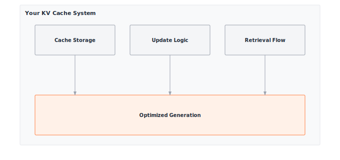

# Module 18: Memoization

:::{.callout-note title="Module Info"}

**OPTIMIZATION TIER** | Difficulty: ●●○○ | Time: 3-5 hours | Prerequisites: 01-14

**Prerequisites: Modules 01-14** means you should be comfortable with:

- Tensor operations, matrix multiplication, and shape manipulation (Module 01)
- Transformer architectures and attention (Modules 12-13)
- Profiling tools (Module 14) to measure speedup

If you understand how transformers compute attention and why it's expensive, you're ready to learn how to make inference dramatically faster.
:::

```{=html}
<div class="action-cards">
<div class="action-card">
<h4>🎧 Audio Overview</h4>
<p>Listen to an AI-generated overview.</p>
<audio controls style="width: 100%; height: 54px;">
<source src="https://github.com/harvard-edge/cs249r_book/releases/download/tinytorch-audio-v0.1.1/18_memoization.mp3" type="audio/mpeg">
</audio>
</div>
<div class="action-card">
<h4>🚀 Launch Binder</h4>
<p>Run interactively in your browser.</p>
<a href="https://mybinder.org/v2/gh/harvard-edge/cs249r_book/main?labpath=tinytorch%2Fmodules%2F18_memoization%2Fmemoization.ipynb" class="action-btn btn-orange">Open in Binder →</a>
</div>
<div class="action-card">
<h4>📄 View Source</h4>
<p>Browse the source code on GitHub.</p>
<a href="https://github.com/harvard-edge/cs249r_book/blob/main/tinytorch/src/18_memoization/18_memoization.py" class="action-btn btn-teal">View on GitHub →</a>
</div>
</div>

<style>
.slide-viewer-container {
  margin: 0.5rem 0 1.5rem 0;
  background: #0f172a;
  border-radius: 1rem;
  overflow: hidden;
  box-shadow: 0 4px 20px rgba(0,0,0,0.15);
}
.slide-header {
  display: flex;
  align-items: center;
  justify-content: space-between;
  padding: 0.6rem 1rem;
  background: rgba(255,255,255,0.03);
}
.slide-title {
  display: flex;
  align-items: center;
  gap: 0.5rem;
  color: #94a3b8;
  font-weight: 500;
  font-size: 0.85rem;
}
.slide-subtitle {
  color: #64748b;
  font-weight: 400;
  font-size: 0.75rem;
}
.slide-toolbar {
  display: flex;
  align-items: center;
  gap: 0.375rem;
}
.slide-toolbar button {
  background: transparent;
  border: none;
  color: #64748b;
  width: 32px;
  height: 32px;
  border-radius: 0.375rem;
  cursor: pointer;
  font-size: 1.1rem;
  transition: all 0.15s;
  display: flex;
  align-items: center;
  justify-content: center;
}
.slide-toolbar button:hover {
  background: rgba(249, 115, 22, 0.15);
  color: #f97316;
}
.slide-nav-group {
  display: flex;
  align-items: center;
}
.slide-page-info {
  color: #64748b;
  font-size: 0.75rem;
  padding: 0 0.5rem;
  font-weight: 500;
}
.slide-zoom-group {
  display: flex;
  align-items: center;
  margin-left: 0.25rem;
  padding-left: 0.5rem;
  border-left: 1px solid rgba(255,255,255,0.1);
}
.slide-canvas-wrapper {
  display: flex;
  justify-content: center;
  align-items: center;
  padding: 0.5rem 1rem 1rem 1rem;
  min-height: 380px;
  background: #0f172a;
}
.slide-canvas {
  max-width: 100%;
  max-height: 350px;
  height: auto;
  border-radius: 0.5rem;
  box-shadow: 0 4px 24px rgba(0,0,0,0.4);
}
.slide-progress-wrapper {
  padding: 0 1rem 0.5rem 1rem;
}
.slide-progress-bar {
  height: 3px;
  background: rgba(255,255,255,0.08);
  border-radius: 1.5px;
  overflow: hidden;
  cursor: pointer;
}
.slide-progress-fill {
  height: 100%;
  background: #f97316;
  border-radius: 1.5px;
  transition: width 0.2s ease;
}
.slide-loading {
  color: #f97316;
  font-size: 0.9rem;
  display: flex;
  align-items: center;
  gap: 0.5rem;
}
.slide-loading::before {
  content: '';
  width: 18px;
  height: 18px;
  border: 2px solid rgba(249, 115, 22, 0.2);
  border-top-color: #f97316;
  border-radius: 50%;
  animation: slide-spin 0.8s linear infinite;
}
@keyframes slide-spin {
  to { transform: rotate(360deg); }
}
.slide-footer {
  display: flex;
  justify-content: center;
  gap: 0.5rem;
  padding: 0.6rem 1rem;
  background: rgba(255,255,255,0.02);
  border-top: 1px solid rgba(255,255,255,0.05);
}
.slide-footer a {
  display: inline-flex;
  align-items: center;
  gap: 0.375rem;
  background: #f97316;
  color: white;
  padding: 0.4rem 0.9rem;
  border-radius: 2rem;
  text-decoration: none;
  font-weight: 500;
  font-size: 0.75rem;
  transition: all 0.15s;
}
.slide-footer a:hover {
  background: #ea580c;
  color: white;
}
.slide-footer a.secondary {
  background: transparent;
  color: #94a3b8;
  border: 1px solid rgba(255,255,255,0.15);
}
.slide-footer a.secondary:hover {
  background: rgba(255,255,255,0.05);
  color: #f8fafc;
}
@media (max-width: 600px) {
  .slide-header { flex-direction: column; gap: 0.5rem; padding: 0.5rem 0.75rem; }
  .slide-toolbar button { width: 28px; height: 28px; }
  .slide-canvas-wrapper { min-height: 260px; padding: 0.5rem; }
  .slide-canvas { max-height: 220px; }
}
</style>

<div class="slide-viewer-container" id="slide-viewer-18_memoization">
<div class="slide-header">
<div class="slide-title">
<span>🔥</span>
<span>Slide Deck</span>

<span class="slide-subtitle">· AI-generated</span>
</div>
<div class="slide-toolbar">
<div class="slide-nav-group">
<button onclick="slideNav('18_memoization', -1)" title="Previous">‹</button>
<span class="slide-page-info"><span id="slide-num-18_memoization">1</span> / <span id="slide-count-18_memoization">-</span></span>
<button onclick="slideNav('18_memoization', 1)" title="Next">›</button>
</div>
<div class="slide-zoom-group">
<button onclick="slideZoom('18_memoization', -0.25)" title="Zoom out">−</button>
<button onclick="slideZoom('18_memoization', 0.25)" title="Zoom in">+</button>
</div>
</div>
</div>
<div class="slide-canvas-wrapper">
<div id="slide-loading-18_memoization" class="slide-loading">Loading slides...</div>
<canvas id="slide-canvas-18_memoization" class="slide-canvas" style="display:none;"></canvas>
</div>
<div class="slide-progress-wrapper">
<div class="slide-progress-bar" onclick="slideProgress('18_memoization', event)">
<div class="slide-progress-fill" id="slide-progress-18_memoization" style="width: 0%;"></div>
</div>
</div>
<div class="slide-footer">
<a href="../assets/slides/18_kvcache.pdf" download>⬇ Download</a>
<a href="#" onclick="slideFullscreen('18_memoization'); return false;" class="secondary">⛶ Fullscreen</a>
</div>
</div>

<script src="https://cdnjs.cloudflare.com/ajax/libs/pdf.js/3.11.174/pdf.min.js"></script>
<script>
(function() {
  if (window.slideViewersInitialized) return;
  window.slideViewersInitialized = true;

  pdfjsLib.GlobalWorkerOptions.workerSrc = 'https://cdnjs.cloudflare.com/ajax/libs/pdf.js/3.11.174/pdf.worker.min.js';

  window.slideViewers = {};

  window.initSlideViewer = function(id, pdfUrl) {
    const viewer = { pdf: null, page: 1, scale: 1.3, rendering: false, pending: null };
    window.slideViewers[id] = viewer;

    const canvas = document.getElementById('slide-canvas-' + id);
    const ctx = canvas.getContext('2d');

    function render(num) {
      viewer.rendering = true;
      viewer.pdf.getPage(num).then(function(page) {
        const viewport = page.getViewport({scale: viewer.scale});
        canvas.height = viewport.height;
        canvas.width = viewport.width;
        page.render({canvasContext: ctx, viewport: viewport}).promise.then(function() {
          viewer.rendering = false;
          if (viewer.pending !== null) { render(viewer.pending); viewer.pending = null; }
        });
      });
      document.getElementById('slide-num-' + id).textContent = num;
      document.getElementById('slide-progress-' + id).style.width = (num / viewer.pdf.numPages * 100) + '%';
    }

    function queue(num) { if (viewer.rendering) viewer.pending = num; else render(num); }

    pdfjsLib.getDocument(pdfUrl).promise.then(function(pdf) {
      viewer.pdf = pdf;
      document.getElementById('slide-count-' + id).textContent = pdf.numPages;
      document.getElementById('slide-loading-' + id).style.display = 'none';
      canvas.style.display = 'block';
      render(1);
    }).catch(function() {
      document.getElementById('slide-loading-' + id).innerHTML = 'Unable to load. <a href="' + pdfUrl + '" style="color:#f97316;">Download PDF</a>';
    });

    viewer.queue = queue;
  };

  window.slideNav = function(id, dir) {
    const v = window.slideViewers[id];
    if (!v || !v.pdf) return;
    const newPage = v.page + dir;
    if (newPage >= 1 && newPage <= v.pdf.numPages) { v.page = newPage; v.queue(newPage); }
  };

  window.slideZoom = function(id, delta) {
    const v = window.slideViewers[id];
    if (!v) return;
    v.scale = Math.max(0.5, Math.min(3, v.scale + delta));
    v.queue(v.page);
  };

  window.slideProgress = function(id, event) {
    const v = window.slideViewers[id];
    if (!v || !v.pdf) return;
    const bar = event.currentTarget;
    const pct = (event.clientX - bar.getBoundingClientRect().left) / bar.offsetWidth;
    const newPage = Math.max(1, Math.min(v.pdf.numPages, Math.ceil(pct * v.pdf.numPages)));
    if (newPage !== v.page) { v.page = newPage; v.queue(newPage); }
  };

  window.slideFullscreen = function(id) {
    const el = document.getElementById('slide-viewer-' + id);
    if (el.requestFullscreen) el.requestFullscreen();
    else if (el.webkitRequestFullscreen) el.webkitRequestFullscreen();
  };
})();

initSlideViewer('18_memoization', '../assets/slides/18_kvcache.pdf');

</script>

```
## Overview

When ChatGPT writes a 100-word response, the naive transformer would recompute the keys and values for every previous token at every step, doing 5,050 K,V projections to produce 100 tokens. Almost all of that work is duplicate. Memoize it once and the cost collapses to 100.

That single change is what makes real-time chat affordable. KV caching stores the key and value matrices from past tokens so each new token only computes its own — turning generation from O(n²) into O(n) and unlocking the 10–15x speedup every deployed LLM relies on.

In this module you build that cache. By the end you will have a `KVCache` class with O(1) updates, a non-invasive hook that retrofits caching onto an existing transformer, and a quantitative grasp of the memory-versus-compute trade you just bought.

## Where Memoization Fits

Acceleration (Module 17) made *any* computation faster — vectorization, cache locality, kernel fusion. Those tricks apply to matmul, convolution, attention, everything.

Memoization is the opposite move: a single, narrow optimization that targets one structural property of autoregressive generation — that past keys and values never change. You spend O(n) memory to skip O(n²) work. It only helps decoder transformers, but on those it is the difference between economically viable and not.

## Learning Objectives

:::{.callout-tip title="By completing this module, you will:"}

- **Implement** a KVCache class with efficient memory management and O(1) update operations
- **Master** the memory-compute trade-off: accepting O(n) memory overhead for O(n²) to O(n) speedup
- **Understand** why memoization transforms generation complexity from quadratic to linear
- **Connect** your implementation to production systems like ChatGPT and Claude that rely on KV caching
:::

## What You'll Build


::: {#fig-18_memoization-diag-1 fig-env="figure" fig-pos="htb" fig-cap="**TinyTorch KV Caching**: Reusing previous computations to speed up text generation." fig-alt="Diagram showing cache storage and retrieval logic for keys and values."}



:::


**Implementation roadmap:**

| Step | What You'll Implement | Key Concept |
|------|----------------------|-------------|
| 1 | `KVCache.__init__()` | Pre-allocated cache storage per layer |
| 2 | `KVCache.update()` | O(1) cache append without copying |
| 3 | `KVCache.get()` | O(1) retrieval of cached values |
| 4 | `enable_kv_cache()` | Non-invasive model enhancement |
| 5 | Performance analysis | Measure speedup and memory usage |

**The pattern you'll enable:**
```python
# Enable caching for dramatic speedup
cache = enable_kv_cache(model)
# Generate with 10-15x faster inference
output = model.generate(prompt, max_length=100)
```

### What You're NOT Building (Yet)

To keep this module focused, you will **not** implement:

- Multi-batch cache management (production systems handle thousands of concurrent sequences)
- Cache eviction strategies (handling sequences longer than max_seq_len)
- GPU memory optimization (production uses memory pools and paging)
- Speculative decoding (advanced technique that builds on KV caching)

**You are building the core memoization mechanism.** Advanced cache management comes in production deployment.

## API Reference

This section provides a quick reference for the KVCache class you'll build. Use this as your guide while implementing and debugging.

### KVCache Constructor

```python
KVCache(batch_size: int, max_seq_len: int, num_layers: int,
        num_heads: int, head_dim: int) -> KVCache
```

Pre-allocates cache storage for all transformer layers. Each layer gets two tensors (keys and values) sized to hold the maximum sequence length.

**Parameters:**
- `batch_size`: Number of sequences to cache simultaneously
- `max_seq_len`: Maximum sequence length to support
- `num_layers`: Number of transformer layers in the model
- `num_heads`: Number of attention heads per layer
- `head_dim`: Dimension of each attention head

### Core Methods

| Method | Signature | Description |
|--------|-----------|-------------|
| `update` | `update(layer_idx: int, key: Tensor, value: Tensor) -> None` | Append new K,V to cache for given layer |
| `get` | `get(layer_idx: int) -> Tuple[Tensor, Tensor]` | Retrieve cached K,V for attention computation |
| `advance` | `advance() -> None` | Move sequence position forward after processing token |
| `reset` | `reset() -> None` | Clear cache for new generation sequence |
| `get_memory_usage` | `get_memory_usage() -> Dict[str, float]` | Calculate cache memory consumption |

### Helper Functions

| Function | Signature | Description |
|----------|-----------|-------------|
| `enable_kv_cache` | `enable_kv_cache(model) -> KVCache` | Non-invasively add caching to transformer |
| `disable_kv_cache` | `disable_kv_cache(model) -> None` | Restore original attention behavior |

## Core Concepts

This section covers the fundamental ideas you need to understand memoization in transformers. These concepts explain why KV caching is the optimization that makes production language models economically viable.

### Caching Computation

Memoization trades memory for speed by storing computation results for reuse. When a function is called with the same inputs repeatedly, computing the result once and caching it eliminates redundant work. This trade-off makes sense when memory is cheaper than computation, which is almost always true for inference.

In transformers, attention is the perfect target for memoization. During autoregressive generation, each new token requires attention over all previous tokens. The naive approach recomputes key and value projections for every previous token at every step, leading to quadratic complexity. But these projections never change once computed, making them ideal candidates for caching.

Here's the core insight in your implementation:

```python
def update(self, layer_idx: int, key: Tensor, value: Tensor) -> None:
    """Update cache with new key-value pairs for given layer."""
    if layer_idx >= self.num_layers:
        raise ValueError(f"Layer index {layer_idx} >= num_layers {self.num_layers}")

    if self.seq_pos >= self.max_seq_len:
        raise ValueError(f"Sequence position {self.seq_pos} >= max_seq_len {self.max_seq_len}")

    # Get cache for this layer
    key_cache, value_cache = self.caches[layer_idx]

    # Update cache at current position (efficient O(1) write)
    key_cache.data[:, :, self.seq_pos:self.seq_pos+1, :] = key.data
    value_cache.data[:, :, self.seq_pos:self.seq_pos+1, :] = value.data
```

This O(1) update operation writes directly to a pre-allocated position in the cache. No array resizing, no data copying, just an indexed assignment. The use of `.data` accesses the underlying NumPy array directly, avoiding gradient tracking overhead since caching is inference-only.

The computational savings compound across generation steps. For a 100-token sequence:

- Without caching: 1 + 2 + 3 + ... + 100 = 5,050 K,V computations
- With caching: 100 K,V computations (one per token)
- Speedup: 50x reduction in K,V computation alone

### KV Cache in Transformers

Transformer attention computes three projections from the input: query (Q), key (K), and value (V). The attention output is computed as softmax(Q @ K^T / sqrt(d_k)) @ V. During generation, each new token produces a new query, but the keys and values from previous tokens remain constant.

Consider generating the sequence "Hello world!":

```text
Step 1: Input = ["Hello"]
  Compute: Q₁, K₁, V₁
  Attention: Q₁ @ [K₁] @ [V₁]

Step 2: Input = ["Hello", "world"]
  Compute: Q₂, K₂, V₂
  Attention: Q₂ @ [K₁, K₂] @ [V₁, V₂]
  Problem: K₁ and V₁ are recomputed unnecessarily!

Step 3: Input = ["Hello", "world", "!"]
  Compute: Q₃, K₃, V₃
  Attention: Q₃ @ [K₁, K₂, K₃] @ [V₁, V₂, V₃]
  Problem: K₁, V₁, K₂, V₂ are all recomputed!
```

The cache eliminates this redundancy:

```text
Step 1: Compute K₁, V₁ → Cache them
Step 2: Compute K₂, V₂ → Append to cache
  Attention: Q₂ @ cached[K₁, K₂] @ cached[V₁, V₂]
Step 3: Compute K₃, V₃ → Append to cache
  Attention: Q₃ @ cached[K₁, K₂, K₃] @ cached[V₁, V₂, V₃]
```

Each step now computes only one new K,V pair instead of recomputing all previous pairs. This algorithmic optimization dramatically accelerates single-batch inference, but scaling this to thousands of concurrent users introduces a formidable systems engineering challenge.

:::{.callout-note title="Systems Implication: KV-Cache Memory Fragmentation and PagedAttention"}
While KV caching transforms computational time complexity from O(n²) to O(n), it creates a severe systems bottleneck: memory fragmentation. Because the final length of an autoregressively generated sequence is unknown ahead of time, naive inference engines must statically pre-allocate maximum-length, contiguous memory blocks for every request's cache. If a request finishes early, the remaining allocated memory is wasted, leading to massive internal fragmentation. Modern production engines like vLLM solve this with **PagedAttention**. Inspired by operating system virtual memory, PagedAttention divides the KV-cache into fixed-size, non-contiguous "pages." By dynamically allocating pages on demand and mapping them to a virtual sequence space, this approach nearly eliminates internal fragmentation, allowing a single GPU to serve exponentially larger batch sizes and drastically reducing the cost per token.
:::

### Gradient Checkpointing

While KV caching optimizes inference, gradient checkpointing addresses the opposite problem: memory consumption during training. Training requires storing intermediate activations for backpropagation, but for very deep networks, this can exceed available memory. Gradient checkpointing trades compute for memory by not storing all activations.

The technique works by discarding some intermediate activations during the forward pass and recomputing them during backpropagation when needed. Instead of storing activations for all layers (requiring O(n) memory where n is the number of layers), checkpointing only stores activations at regular intervals (checkpoints). Between checkpoints, activations are recomputed from the last checkpoint during the backward pass.

For a transformer with 96 layers:

- Without checkpointing: Store 96 sets of activations
- With checkpointing every 12 layers: Store 8 sets, recompute 11 sets during backward
- Memory reduction: 12x decrease
- Compute increase: ~33% slower training (recomputation overhead)

This is the inverse trade-off from KV caching. KV caching spends memory to save compute during inference. Gradient checkpointing spends compute to save memory during training. Both techniques recognize that memory and compute are fungible resources with different costs in different contexts.

### Cache Invalidation

Cache invalidation is famously hard. Autoregressive generation makes it easy: each cached K,V pair is valid for the entire sequence being generated, and the entire cache is thrown away the moment a new sequence starts.

That simplicity falls out of the autoregressive property — every token depends only on tokens that came before it, and once those dependencies are computed they never change.

Here's how your implementation handles cache lifecycle:

```python
def reset(self) -> None:
    """Reset cache for new generation sequence."""
    self.seq_pos = 0

    # Zero out caches for clean state (helps with debugging)
    for layer_idx in range(self.num_layers):
        key_cache, value_cache = self.caches[layer_idx]
        key_cache.data.fill(0.0)
        value_cache.data.fill(0.0)
```

The reset operation returns the sequence position to zero and clears the cache data. This is called when starting to generate a new sequence, ensuring no stale data from previous generations affects the current one.

Production systems handle more complex invalidation scenarios:

- **Max length reached**: When the sequence fills the cache, either error out or implement a sliding window
- **Batch inference**: Each sequence in a batch has independent cache state
- **Multi-turn conversation**: Some systems maintain cache across turns, others reset per turn

### Memory-Compute Trade-offs

Every optimization involves trade-offs. KV caching trades memory for speed, and understanding this exchange quantitatively reveals when the technique makes sense.

For a transformer with L layers, H heads per layer, dimension D per head, and maximum sequence length S, the cache requires:

```text
Memory = 2 × L × H × S × D × 4 bytes

Example (GPT-2 Small):
  L = 12 layers, H = 12 heads, S = 1024 tokens, D = 64 dims
  Memory = 2 × 12 × 12 × 1024 × 64 × 4 = 75,497,472 bytes ≈ 72 MB
```

For a 125M-parameter model (500 MB of weights), that cache adds 14% memory overhead — modest, until you weigh it against the compute it saves.

Without caching, generating a sequence of length N requires computing K,V for:

- Step 1: 1 token
- Step 2: 2 tokens
- Step 3: 3 tokens
- Step N: N tokens
- Total: 1 + 2 + 3 + ... + N = N(N+1)/2 ≈ N²/2 computations

With caching:

- Step 1: 1 token (compute and cache)
- Step 2: 1 token (compute and append)
- Step 3: 1 token (compute and append)
- Step N: 1 token (compute and append)
- Total: N computations

For N = 100 tokens, caching gives a 50x reduction in K,V computation. At N = 1000, the reduction is 500x. The savings grow with sequence length, which is exactly why long-context models depend on this trick.

| Sequence Length | Cache Memory | Compute Reduction | Effective Speedup |
|-----------------|--------------|-------------------|-------------------|
| 10 tokens | 72 MB | 5.5x | 3-5x |
| 50 tokens | 72 MB | 25.5x | 8-12x |
| 100 tokens | 72 MB | 50.5x | 10-15x |
| 500 tokens | 72 MB | 250.5x | 12-20x |

The effective speedup is lower than the theoretical compute reduction because attention includes other operations beyond K,V projection, but the benefit is still dramatic.

## Common Errors

These are the errors you'll encounter most often when implementing KV caching. Understanding why they happen will save hours of debugging.

### Cache Position Out of Bounds

**Error**: `ValueError: Sequence position 128 >= max_seq_len 128`

This happens when you try to append to a full cache. The cache is pre-allocated with a maximum sequence length, and attempting to write beyond that length raises an error.

**Cause**: Generation exceeded the maximum sequence length specified when creating the cache.

**Fix**: Either increase `max_seq_len` when creating the cache, or implement cache eviction logic to handle sequences longer than the maximum.

```python
# Create cache with sufficient capacity
cache = KVCache(batch_size=1, max_seq_len=2048,  # Increased from 128
                num_layers=12, num_heads=12, head_dim=64)
```

### Forgetting to Advance Position

**Error**: Cache retrieval returns the same K,V repeatedly, or update overwrites previous values

**Symptom**: Generated text repeats, or cache doesn't grow as expected

**Cause**: Forgetting to call `cache.advance()` after updating all layers for a token.

**Fix**: Always advance the cache position after processing a complete token through all layers:

```python
for layer_idx in range(num_layers):
    cache.update(layer_idx, new_key, new_value)

cache.advance()  # Move to next position for next token
```

### Shape Mismatches

**Error**: Broadcasting error or shape mismatch when updating cache

**Symptom**: `ValueError: could not broadcast input array from shape (1,8,64,64) into shape (1,8,1,64)`

**Cause**: The key and value tensors passed to `update()` must have shape `(batch, heads, 1, head_dim)` with sequence dimension equal to 1 (single new token).

**Fix**: Ensure new K,V tensors represent a single token:

```python
# Correct: Single token (seq_len = 1)
new_key = Tensor(np.random.randn(batch_size, num_heads, 1, head_dim))
cache.update(layer_idx, new_key, new_value)

# Wrong: Multiple tokens (seq_len = 64)
wrong_key = Tensor(np.random.randn(batch_size, num_heads, 64, head_dim))
cache.update(layer_idx, wrong_key, wrong_value)  # This will fail!
```

### Cache Not Reset Between Sequences

**Error**: Second generation includes tokens from first generation

**Symptom**: Model generates text that seems to continue from a previous unrelated sequence

**Cause**: Forgetting to reset the cache when starting a new generation sequence.

**Fix**: Always reset the cache before generating a new sequence:

```python
# Generate first sequence
output1 = model.generate(prompt1)

# Reset cache before second sequence
model._kv_cache.reset()

# Generate second sequence (independent of first)
output2 = model.generate(prompt2)
```

## Production Context

### Your Implementation vs. PyTorch

Your KVCache implementation uses the same conceptual design as production frameworks. The differences lie in scale, optimization level, and integration depth. PyTorch's KV cache implementation is written in C++ and CUDA for speed, supports dynamic batching for serving multiple users, and includes sophisticated memory management with paging and eviction.

| Feature | Your Implementation | PyTorch (Transformers library) |
|---------|---------------------|--------------------------------|
| **Backend** | NumPy (CPU) | C++/CUDA (GPU) |
| **Pre-allocation** | Fixed max_seq_len | Dynamic growth + paging |
| **Batch support** | Single batch size | Dynamic batching |
| **Memory management** | Simple reset | LRU eviction, memory pools |
| **Update complexity** | O(1) | O(1) with optimized kernels |

### Code Comparison

The following comparison shows how KV caching is used in TinyTorch versus production PyTorch. The API patterns are similar because the underlying concept is identical.

::: {.panel-tabset}
## Your TinyTorch
```python
from tinytorch.perf.memoization import enable_kv_cache

# Enable caching
cache = enable_kv_cache(model)

# Generate with caching (10-15x faster)
for _ in range(100):
    logits = model.forward(input_token)
    next_token = sample(logits)
    # Cache automatically used and updated
    input_token = next_token

# Reset for new sequence
cache.reset()
```

## PyTorch
```python
from transformers import AutoModelForCausalLM

model = AutoModelForCausalLM.from_pretrained("gpt2")

# KV cache enabled automatically during generate()
outputs = model.generate(
    input_ids,
    max_length=100,
    use_cache=True  # KV caching enabled
)

# Cache managed internally by HuggingFace
# Automatically reset between generate() calls
```
:::

Let's examine each approach to understand the similarities and differences:

- **Line 1-2 (Imports)**: TinyTorch uses an explicit `enable_kv_cache()` function to opt in to caching. PyTorch's Transformers library integrates caching directly into the model architecture.
- **Line 4-5 (Setup)**: TinyTorch requires manually enabling the cache and storing the reference. PyTorch handles this transparently when you call `generate()`.
- **Line 7-12 (Generation)**: TinyTorch's loop explicitly manages token generation with the cache working behind the scenes. PyTorch's `generate()` method encapsulates the entire loop and automatically uses caching when `use_cache=True`.
- **Line 14-15 (Reset)**: TinyTorch requires manual cache reset between sequences. PyTorch automatically resets the cache at the start of each `generate()` call.

The core difference is abstraction level. TinyTorch exposes the cache as an explicit object you control, making the optimization visible for learning. PyTorch hides caching inside `generate()` for ease of use in production. Both implementations use the same O(1) append pattern you built.

:::{.callout-tip title="What's Identical"}

The fundamental algorithm: compute K,V once, append to cache, retrieve for attention. Production systems add memory management and batching, but the core optimization is exactly what you implemented.
:::

### Why Memoization Matters at Scale

To appreciate the production impact of KV caching, consider the economics of language model serving:

- **ChatGPT** serves millions of requests per day. Without KV caching, serving costs would be roughly 10x higher — enough to break the pricing model.
- **GitHub Copilot** generates completions in real time. Without caching, latency would jump from ~100 ms to 1–2 seconds, killing the inline-completion experience.
- **API serving**: a single V100 hosting GPT-2 handles 50–100 concurrent users with caching, but only 5–10 without it. That 10x gap is what determines whether a deployment is profitable.

The memory cost is modest compared to the benefit. For a GPT-2 model:

- Model parameters: 500 MB (loaded once, shared across all users)
- KV cache per user: 75 MB
- 10 concurrent users: 750 MB cache + 500 MB model = 1.25 GB total
- Fits comfortably on a 16 GB GPU while delivering 10x throughput

## Check Your Understanding

Test yourself with these systems thinking questions. They're designed to build intuition for the performance characteristics and trade-offs you'll encounter in production ML systems.

**Q1: Cache Memory Calculation**

A 12-layer transformer has 8 attention heads per layer, each head has 64 dimensions, maximum sequence length is 1024, and batch size is 4. Calculate the KV cache memory requirement.

:::{.callout-note collapse="true" title="Answer"}

Shape per cache tensor: (batch=4, heads=8, seq=1024, dim=64)

Elements per tensor: 4 × 8 × 1024 × 64 = 2,097,152

Each layer has 2 tensors (K and V): 2 × 2,097,152 = 4,194,304 elements per layer

Total across 12 layers: 12 × 4,194,304 = 50,331,648 elements

Memory: 50,331,648 × 4 bytes = 201,326,592 bytes ≈ **192 MB**

This is why production systems carefully tune batch size and sequence length.
:::

**Q2: Complexity Reduction**

Without caching, generating 200 tokens requires how many K,V computations? With caching?

:::{.callout-note collapse="true" title="Answer"}

**Without caching**: 1 + 2 + 3 + ... + 200 = 200 × 201 / 2 = **20,100 computations**

**With caching**: 200 computations (one per token)

**Reduction**: 20,100 / 200 = **100.5x fewer K,V computations**

This is why the speedup grows with sequence length.
:::

**Q3: Memory-Compute Trade-off**

A model uses 2 GB for parameters. Adding KV cache uses 300 MB. Is this trade-off worthwhile if it provides 12x speedup?

:::{.callout-note collapse="true" title="Answer"}

**Memory overhead**: 300 MB / 2000 MB = 15% increase

**Speedup**: 12x faster generation

**Analysis**:

- Cost: 15% more memory
- Benefit: 12x more throughput (or 12x lower latency)
- Result: You can serve 12x more users with 1.15x the memory

**Verdict**: Absolutely worthwhile. Memory is cheap; compute is expensive.

In production, this enables serving 120 users per GPU instead of 10, dramatically reducing infrastructure costs.
:::

**Q4: Cache Hit Rate**

During generation, what percentage of K,V retrievals come from cache vs. fresh computation after 50 tokens?

:::{.callout-note collapse="true" title="Answer"}

At token position 50:

- Fresh computation: 1 new K,V pair
- Cache retrievals: 49 previous K,V pairs
- Total: 50 K,V pairs needed

**Cache hit rate**: 49/50 = **98%**

As generation continues:

- Token 100: 99/100 = 99% hit rate
- Token 500: 499/500 = 99.8% hit rate

The cache hit rate approaches 100% for long sequences, explaining why speedup increases with length.
:::

**Q5: Batch Inference Scaling**

Cache memory for batch_size=1 is 75 MB. What is cache memory for batch_size=8?

:::{.callout-note collapse="true" title="Answer"}

Cache memory scales linearly with batch size:

**batch_size=8**: 75 MB × 8 = **600 MB**

This is why production systems carefully manage batch size:

- Larger batches → higher throughput (more sequences per second)
- Larger batches → more memory (may hit GPU limits)

Trade-off example on 16 GB GPU:

- Model: 2 GB
- Available for cache: 14 GB
- Max batch size: 14 GB / 75 MB ≈ 186 sequences

Production systems balance batch size against latency requirements and memory constraints.
:::

## Further Reading

For students who want to understand the academic foundations and production implementation of memoization in transformers:

### Seminal Papers

- **Attention Is All You Need** - Vaswani et al. (2017). The original transformer paper that introduced the architecture requiring KV caching for efficient generation. Section 3.2 describes the attention mechanism that benefits from memoization. **Systems Implication:** The parallelization advantage over RNNs breaks the sequential compute bottleneck during training, but causes autoregressive inference to be heavily memory-bandwidth bound without caching. [arXiv:1706.03762](https://arxiv.org/abs/1706.03762)

- **Generating Sequences With Recurrent Neural Networks** - Graves (2013). Early work on autoregressive generation patterns, establishing the sequential token generation that creates the redundant computation KV caching eliminates. **Systems Implication:** RNN inference natively maintains a hidden state vector in memory (O(1) memory), making it highly efficient for single-batch generation on memory-constrained hardware. [arXiv:1308.0850](https://arxiv.org/abs/1308.0850)

- **Training Compute-Optimal Large Language Models** - Hoffmann et al. (2022). Analyzes the computational costs of training and inference, quantifying the importance of inference optimizations like KV caching at scale. **Systems Implication:** Established that optimal scaling requires massive datasets, turning training into a massive I/O problem where storage bandwidth and network interconnects dictate overall cluster efficiency. [arXiv:2203.15556](https://arxiv.org/abs/2203.15556)

- **FlashAttention: Fast and Memory-Efficient Exact Attention** - Dao et al. (2022). Modern attention optimization that combines with KV caching in production systems, demonstrating complementary optimization strategies. **Systems Implication:** Overcame GPU HBM bandwidth limits via SRAM tiling, fusing the attention computation into a single kernel to avoid costly memory reads and writes. [arXiv:2205.14135](https://arxiv.org/abs/2205.14135)

### Additional Resources

- **System**: [vLLM documentation](https://vllm.readthedocs.io/) - Production serving system that uses advanced KV cache management with paging
- **Tutorial**: [Hugging Face Text Generation Guide](https://huggingface.co/docs/transformers/main_classes/text_generation) - See `use_cache` parameter in production API
- **Blog**: "The Illustrated Transformer" by Jay Alammar - Visual explanation of attention mechanisms that benefit from caching

## What's Next

You've claimed a 10–15x speedup. The honest question is: how do you know? "Generation feels faster" is not an answer a systems engineer can defend. To put a real number on what you just built — and to compare it against the other optimizations in this tier — you need disciplined measurement.

:::{.callout-note title="Coming Up: Module 19 - Benchmarking"}

Module 19 builds the measurement infrastructure that lets you say "this optimization gave us 12.4x speedup with 95% confidence" instead of "it seems faster". You'll implement statistical timing, warm-up handling, and Pareto-frontier analysis — the same tools production teams use to validate every optimization in this book, including the KV cache you just wrote.
:::

**How memoization combines with the other optimizations in this tier:**

| Module | What It Does | Works with Memoization |
|--------|--------------|------------------------|
| **15: Quantization** | Reduce precision to save memory | `KVCache with int8 keys/values → 4x memory reduction` |
| **17: Acceleration** | Optimize computation kernels | `Fused attention + KV cache → minimal memory traffic` |
| **19: Benchmarking** | Measure end-to-end performance | `Profile cache hit rates and speedup gains` |

## Get Started

:::{.callout-tip title="Interactive Options"}

- **[Launch Binder](https://mybinder.org/v2/gh/harvard-edge/cs249r_book/main?urlpath=lab/tree/tinytorch/modules/18_memoization/memoization.ipynb)** - Run interactively in browser, no setup required
- **[View Source](https://github.com/harvard-edge/cs249r_book/blob/main/tinytorch/src/18_memoization/18_memoization.py)** - Browse the implementation code
:::

:::{.callout-warning title="Save Your Progress"}

Binder sessions are temporary. Download your completed notebook when done, or clone the repository for persistent local work.
:::
