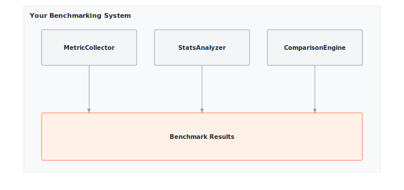

# Module 19: Benchmarking

:::{.callout-note title="Module Info"}

**OPTIMIZATION TIER** | Difficulty: ●●●○ | Time: 5-7 hours | Prerequisites: 01-18

This module assumes familiarity with the complete TinyTorch stack (Modules 01-13), profiling (Module 14), and optimization techniques (Modules 15-18). You should understand how to build, profile, and optimize models before tackling systematic benchmarking and statistical comparison of optimizations.
:::

```{=html}
<div class="action-cards">
<div class="action-card">
<h4>🎧 Audio Overview</h4>
<p>Listen to an AI-generated overview.</p>
<audio controls style="width: 100%; height: 54px;">
<source src="https://github.com/harvard-edge/cs249r_book/releases/download/tinytorch-audio-v0.1.1/19_benchmarking.mp3" type="audio/mpeg">
</audio>
</div>
<div class="action-card">
<h4>🚀 Launch Binder</h4>
<p>Run interactively in your browser.</p>
<a href="https://mybinder.org/v2/gh/harvard-edge/cs249r_book/main?labpath=tinytorch%2Fmodules%2F19_benchmarking%2Fbenchmarking.ipynb" class="action-btn btn-orange">Open in Binder →</a>
</div>
<div class="action-card">
<h4>📄 View Source</h4>
<p>Browse the source code on GitHub.</p>
<a href="https://github.com/harvard-edge/cs249r_book/blob/main/tinytorch/src/19_benchmarking/19_benchmarking.py" class="action-btn btn-teal">View on GitHub →</a>
</div>
</div>

<style>
.slide-viewer-container {
  margin: 0.5rem 0 1.5rem 0;
  background: #0f172a;
  border-radius: 1rem;
  overflow: hidden;
  box-shadow: 0 4px 20px rgba(0,0,0,0.15);
}
.slide-header {
  display: flex;
  align-items: center;
  justify-content: space-between;
  padding: 0.6rem 1rem;
  background: rgba(255,255,255,0.03);
}
.slide-title {
  display: flex;
  align-items: center;
  gap: 0.5rem;
  color: #94a3b8;
  font-weight: 500;
  font-size: 0.85rem;
}
.slide-subtitle {
  color: #64748b;
  font-weight: 400;
  font-size: 0.75rem;
}
.slide-toolbar {
  display: flex;
  align-items: center;
  gap: 0.375rem;
}
.slide-toolbar button {
  background: transparent;
  border: none;
  color: #64748b;
  width: 32px;
  height: 32px;
  border-radius: 0.375rem;
  cursor: pointer;
  font-size: 1.1rem;
  transition: all 0.15s;
  display: flex;
  align-items: center;
  justify-content: center;
}
.slide-toolbar button:hover {
  background: rgba(249, 115, 22, 0.15);
  color: #f97316;
}
.slide-nav-group {
  display: flex;
  align-items: center;
}
.slide-page-info {
  color: #64748b;
  font-size: 0.75rem;
  padding: 0 0.5rem;
  font-weight: 500;
}
.slide-zoom-group {
  display: flex;
  align-items: center;
  margin-left: 0.25rem;
  padding-left: 0.5rem;
  border-left: 1px solid rgba(255,255,255,0.1);
}
.slide-canvas-wrapper {
  display: flex;
  justify-content: center;
  align-items: center;
  padding: 0.5rem 1rem 1rem 1rem;
  min-height: 380px;
  background: #0f172a;
}
.slide-canvas {
  max-width: 100%;
  max-height: 350px;
  height: auto;
  border-radius: 0.5rem;
  box-shadow: 0 4px 24px rgba(0,0,0,0.4);
}
.slide-progress-wrapper {
  padding: 0 1rem 0.5rem 1rem;
}
.slide-progress-bar {
  height: 3px;
  background: rgba(255,255,255,0.08);
  border-radius: 1.5px;
  overflow: hidden;
  cursor: pointer;
}
.slide-progress-fill {
  height: 100%;
  background: #f97316;
  border-radius: 1.5px;
  transition: width 0.2s ease;
}
.slide-loading {
  color: #f97316;
  font-size: 0.9rem;
  display: flex;
  align-items: center;
  gap: 0.5rem;
}
.slide-loading::before {
  content: '';
  width: 18px;
  height: 18px;
  border: 2px solid rgba(249, 115, 22, 0.2);
  border-top-color: #f97316;
  border-radius: 50%;
  animation: slide-spin 0.8s linear infinite;
}
@keyframes slide-spin {
  to { transform: rotate(360deg); }
}
.slide-footer {
  display: flex;
  justify-content: center;
  gap: 0.5rem;
  padding: 0.6rem 1rem;
  background: rgba(255,255,255,0.02);
  border-top: 1px solid rgba(255,255,255,0.05);
}
.slide-footer a {
  display: inline-flex;
  align-items: center;
  gap: 0.375rem;
  background: #f97316;
  color: white;
  padding: 0.4rem 0.9rem;
  border-radius: 2rem;
  text-decoration: none;
  font-weight: 500;
  font-size: 0.75rem;
  transition: all 0.15s;
}
.slide-footer a:hover {
  background: #ea580c;
  color: white;
}
.slide-footer a.secondary {
  background: transparent;
  color: #94a3b8;
  border: 1px solid rgba(255,255,255,0.15);
}
.slide-footer a.secondary:hover {
  background: rgba(255,255,255,0.05);
  color: #f8fafc;
}
@media (max-width: 600px) {
  .slide-header { flex-direction: column; gap: 0.5rem; padding: 0.5rem 0.75rem; }
  .slide-toolbar button { width: 28px; height: 28px; }
  .slide-canvas-wrapper { min-height: 260px; padding: 0.5rem; }
  .slide-canvas { max-height: 220px; }
}
</style>

<div class="slide-viewer-container" id="slide-viewer-19_benchmarking">
<div class="slide-header">
<div class="slide-title">
<span>🔥</span>
<span>Slide Deck</span>

<span class="slide-subtitle">· AI-generated</span>
</div>
<div class="slide-toolbar">
<div class="slide-nav-group">
<button onclick="slideNav('19_benchmarking', -1)" title="Previous">‹</button>
<span class="slide-page-info"><span id="slide-num-19_benchmarking">1</span> / <span id="slide-count-19_benchmarking">-</span></span>
<button onclick="slideNav('19_benchmarking', 1)" title="Next">›</button>
</div>
<div class="slide-zoom-group">
<button onclick="slideZoom('19_benchmarking', -0.25)" title="Zoom out">−</button>
<button onclick="slideZoom('19_benchmarking', 0.25)" title="Zoom in">+</button>
</div>
</div>
</div>
<div class="slide-canvas-wrapper">
<div id="slide-loading-19_benchmarking" class="slide-loading">Loading slides...</div>
<canvas id="slide-canvas-19_benchmarking" class="slide-canvas" style="display:none;"></canvas>
</div>
<div class="slide-progress-wrapper">
<div class="slide-progress-bar" onclick="slideProgress('19_benchmarking', event)">
<div class="slide-progress-fill" id="slide-progress-19_benchmarking" style="width: 0%;"></div>
</div>
</div>
<div class="slide-footer">
<a href="../assets/slides/19_benchmarking.pdf" download>⬇ Download</a>
<a href="#" onclick="slideFullscreen('19_benchmarking'); return false;" class="secondary">⛶ Fullscreen</a>
</div>
</div>

<script src="https://cdnjs.cloudflare.com/ajax/libs/pdf.js/3.11.174/pdf.min.js"></script>
<script>
(function() {
  if (window.slideViewersInitialized) return;
  window.slideViewersInitialized = true;

  pdfjsLib.GlobalWorkerOptions.workerSrc = 'https://cdnjs.cloudflare.com/ajax/libs/pdf.js/3.11.174/pdf.worker.min.js';

  window.slideViewers = {};

  window.initSlideViewer = function(id, pdfUrl) {
    const viewer = { pdf: null, page: 1, scale: 1.3, rendering: false, pending: null };
    window.slideViewers[id] = viewer;

    const canvas = document.getElementById('slide-canvas-' + id);
    const ctx = canvas.getContext('2d');

    function render(num) {
      viewer.rendering = true;
      viewer.pdf.getPage(num).then(function(page) {
        const viewport = page.getViewport({scale: viewer.scale});
        canvas.height = viewport.height;
        canvas.width = viewport.width;
        page.render({canvasContext: ctx, viewport: viewport}).promise.then(function() {
          viewer.rendering = false;
          if (viewer.pending !== null) { render(viewer.pending); viewer.pending = null; }
        });
      });
      document.getElementById('slide-num-' + id).textContent = num;
      document.getElementById('slide-progress-' + id).style.width = (num / viewer.pdf.numPages * 100) + '%';
    }

    function queue(num) { if (viewer.rendering) viewer.pending = num; else render(num); }

    pdfjsLib.getDocument(pdfUrl).promise.then(function(pdf) {
      viewer.pdf = pdf;
      document.getElementById('slide-count-' + id).textContent = pdf.numPages;
      document.getElementById('slide-loading-' + id).style.display = 'none';
      canvas.style.display = 'block';
      render(1);
    }).catch(function() {
      document.getElementById('slide-loading-' + id).innerHTML = 'Unable to load. <a href="' + pdfUrl + '" style="color:#f97316;">Download PDF</a>';
    });

    viewer.queue = queue;
  };

  window.slideNav = function(id, dir) {
    const v = window.slideViewers[id];
    if (!v || !v.pdf) return;
    const newPage = v.page + dir;
    if (newPage >= 1 && newPage <= v.pdf.numPages) { v.page = newPage; v.queue(newPage); }
  };

  window.slideZoom = function(id, delta) {
    const v = window.slideViewers[id];
    if (!v) return;
    v.scale = Math.max(0.5, Math.min(3, v.scale + delta));
    v.queue(v.page);
  };

  window.slideProgress = function(id, event) {
    const v = window.slideViewers[id];
    if (!v || !v.pdf) return;
    const bar = event.currentTarget;
    const pct = (event.clientX - bar.getBoundingClientRect().left) / bar.offsetWidth;
    const newPage = Math.max(1, Math.min(v.pdf.numPages, Math.ceil(pct * v.pdf.numPages)));
    if (newPage !== v.page) { v.page = newPage; v.queue(newPage); }
  };

  window.slideFullscreen = function(id) {
    const el = document.getElementById('slide-viewer-' + id);
    if (el.requestFullscreen) el.requestFullscreen();
    else if (el.webkitRequestFullscreen) el.webkitRequestFullscreen();
  };
})();

initSlideViewer('19_benchmarking', '../assets/slides/19_benchmarking.pdf');

</script>

```
## Overview

"My model is 3x faster!" Faster than what? Measured how? At what input size, on what hardware, after how many warmup runs? Most "speedup" claims dissolve under those four questions — and yours will too if you don't measure with care.

Modules 14-18 gave you optimizations. This module gives you the one tool that tells you which of them actually worked: a benchmarking harness that controls for noise, runs proper warmup, and produces confidence intervals you can defend. It is the same statistical machinery MLPerf uses, written in a few hundred lines you build yourself.

By the end, you will have the evaluation framework that drives the TorchPerf Olympics capstone — and the discipline to never publish a number you cannot justify.

## Learning Objectives

:::{.callout-tip title="By completing this module, you will:"}

- **Implement** a benchmarking harness with confidence intervals, warmup protocols, and variance control
- **Quantify** trade-offs between accuracy, latency, and memory using Pareto frontiers
- **Diagnose** measurement noise — coefficient of variation, outliers, cold-start effects — before reporting numbers
- **Connect** optimizations from Modules 14-18 into a single comparison workflow for the TorchPerf Olympics capstone
:::

## What You'll Build


::: {#fig-19_benchmarking-diag-1 fig-env="figure" fig-pos="htb" fig-cap="**TinyTorch Benchmarking System**: Statistical measurement of performance and accuracy." fig-alt="Diagram showing test cases, metrics collection, and comparison engine."}



:::


**Implementation roadmap:**

| Part | What You'll Implement | Key Concept |
|------|----------------------|-------------|
| 1 | `BenchmarkResult` dataclass | Statistical analysis with confidence intervals |
| 2 | `precise_timer()` context manager | High-precision timing for microsecond measurements |
| 3 | `Benchmark.run_latency_benchmark()` | Warmup protocols and latency measurement |
| 4 | `Benchmark.run_accuracy_benchmark()` | Model quality evaluation across datasets |
| 5 | `Benchmark.run_memory_benchmark()` | Peak memory tracking during inference |
| 6 | `BenchmarkSuite` for multi-metric analysis | Pareto frontier generation and trade-off visualization |

**The pattern you'll enable:**

```python
# Compare baseline vs optimized model with statistical rigor
benchmark = Benchmark([baseline_model, optimized_model])
latency_results = benchmark.run_latency_benchmark()
# Output: baseline: 12.3ms ± 0.8ms, optimized: 4.1ms ± 0.3ms (67% reduction, p < 0.01)
```

### What You're NOT Building (Yet)

To keep this module focused, you will **not** implement:

- Hardware-specific benchmarks (GPU profiling requires CUDA, covered in production frameworks)
- Energy measurement (requires specialized hardware like power meters)
- Distributed benchmarking (multi-node coordination is beyond scope)
- Automated hyperparameter tuning for optimization (that is Module 20: Capstone)

**You are building the statistical foundation for fair comparison.** The hardware-specific extensions are mechanical once the methodology is right.

## API Reference

This section documents the benchmarking API you will implement. Use it as your reference while building the statistical analysis and measurement infrastructure.

### BenchmarkResult Dataclass

```python
BenchmarkResult(metric_name: str, values: List[float], metadata: Dict[str, Any] = {})
```

Statistical container for benchmark measurements with automatic computation of mean, standard deviation, median, and 95% confidence intervals.

**Properties computed in `__post_init__`:**

| Property | Type | Description |
|----------|------|-------------|
| `mean` | `float` | Average of all measurements |
| `std` | `float` | Standard deviation (0 if single measurement) |
| `median` | `float` | Middle value, less sensitive to outliers |
| `min_val` | `float` | Minimum observed value |
| `max_val` | `float` | Maximum observed value |
| `count` | `int` | Number of measurements |
| `ci_lower` | `float` | Lower bound of 95% confidence interval |
| `ci_upper` | `float` | Upper bound of 95% confidence interval |

**Methods:**

| Method | Signature | Description |
|--------|-----------|-------------|
| `to_dict` | `to_dict() -> Dict[str, Any]` | Serialize to dictionary for JSON export |
| `__str__` | Returns formatted summary | `"metric: mean ± std (n=count)"` |

### Timing Context Manager

```python
with precise_timer() as timer:
    # Your code to measure
    ...
# Access elapsed time
elapsed_seconds = timer.elapsed
```

High-precision timing context manager using `time.perf_counter()` for monotonic, nanosecond-resolution measurements.

### Benchmark Class

```python
Benchmark(models: List[Any], datasets: List[Any],
          warmup_runs: int = 5, measurement_runs: int = 10)
```

Core benchmarking engine for single-metric evaluation across multiple models.

**Parameters:**
- `models`: List of models to benchmark (supports any object with forward/predict/__call__)
- `datasets`: List of datasets for accuracy benchmarking (required)
- `warmup_runs`: Number of warmup iterations before measurement (default: 5)
- `measurement_runs`: Number of measurement iterations for statistical analysis (default: 10)

**Core Methods:**

| Method | Signature | Description |
|--------|-----------|-------------|
| `run_latency_benchmark` | `run_latency_benchmark(input_shape=(1,28,28)) -> Dict[str, BenchmarkResult]` | Measure inference time per model |
| `run_accuracy_benchmark` | `run_accuracy_benchmark() -> Dict[str, BenchmarkResult]` | Measure prediction accuracy on datasets |
| `run_memory_benchmark` | `run_memory_benchmark(input_shape=(1,28,28)) -> Dict[str, BenchmarkResult]` | Track peak memory usage during inference |
| `compare_models` | `compare_models(metric: str = "latency") -> List[Dict]` | Compare models across a specific metric |

### BenchmarkSuite Class

```python
BenchmarkSuite(models: List[Any], datasets: List[Any], output_dir: str = "benchmark_results")
```

Comprehensive multi-metric evaluation suite for generating Pareto frontiers and optimization trade-off analysis.

| Method | Signature | Description |
|--------|-----------|-------------|
| `run_full_benchmark` | `run_full_benchmark() -> Dict[str, Dict[str, BenchmarkResult]]` | Run all benchmark types and aggregate results |
| `plot_pareto_frontier` | `plot_pareto_frontier(x_metric='latency', y_metric='accuracy')` | Plot Pareto frontier for two competing objectives |
| `plot_results` | `plot_results(save_plots=True)` | Generate visualization plots for benchmark results |
| `generate_report` | `generate_report() -> str` | Generate comprehensive benchmark report |

## Core Concepts

This section covers the fundamental principles that make benchmarking scientifically valid. Understanding these concepts separates professional performance engineering from naive timing measurements.

### Benchmarking Methodology

A single measurement tells you nothing. Time one inference and you might see 1.2ms; time it again and you might see 3.1ms because a background process woke up. Neither number is the model's performance — they are samples from a noisy distribution.

Your job is to estimate that distribution's mean with quantified confidence. That requires controlling the inputs you can (warmup, input shape, iteration count) and reporting the noise you cannot.

The methodology follows a structured protocol:

**Warmup Phase**: Modern systems adapt to workloads. JIT compilers optimize hot code paths after several executions. CPU frequency scales up under sustained load. Caches fill with frequently accessed data. Without warmup, your first measurements capture cold-start behavior, not steady-state performance.

```python
# Warmup protocol in action
for _ in range(warmup_runs):
    _ = model(input_data)  # Run but discard measurements
```

**Measurement Phase**: After warmup, run the operation multiple times and collect timing data. The Central Limit Theorem tells us that with enough samples, the sample mean approaches the true mean, and we can compute confidence intervals.

Here is how the Benchmark class implements the complete protocol:

```python
def run_latency_benchmark(self, input_shape: Tuple[int, ...] = (1, 28, 28)) -> Dict[str, BenchmarkResult]:
    """Benchmark model inference latency using Profiler."""
    results = {}

    for i, model in enumerate(self.models):
        model_name = getattr(model, 'name', f'model_{i}')
        latencies = []

        # Create input tensor for this benchmark
        input_data = Tensor(np.random.randn(*input_shape).astype(np.float32))

        # Warmup runs (discard results)
        for _ in range(self.warmup_runs):
            if hasattr(model, 'forward'):
                _ = model.forward(input_data)
            elif callable(model):
                _ = model(input_data)

        # Measurement runs (collect statistics)
        for _ in range(self.measurement_runs):
            with precise_timer() as timer:
                if hasattr(model, 'forward'):
                    _ = model.forward(input_data)
                elif callable(model):
                    _ = model(input_data)
            latencies.append(timer.elapsed)

        results[model_name] = BenchmarkResult(
            metric_name=f"{model_name}_latency",
            values=latencies,
            metadata={'input_shape': input_shape, **self.system_info}
        )

    return results
```

Notice the clear separation between warmup (discarded) and measurement (collected) phases. This ensures measurements reflect steady-state performance.

**Statistical Analysis**: Raw measurements get transformed into confidence intervals that quantify uncertainty. The 95% confidence interval tells you: "If we ran this benchmark 100 times, 95 of those runs would produce a mean within this range."

### Metrics Selection

Different optimization goals require different metrics. Choosing the wrong metric leads to optimizing for the wrong objective.

**Latency (Time per Inference)**: Measures how fast a model processes a single input. Critical for real-time systems like autonomous vehicles where a prediction must complete in 30ms before the next camera frame arrives. Measured in milliseconds or microseconds.

**Throughput (Inputs per Second)**: Measures total processing capacity. Critical for batch processing systems like translating millions of documents. Higher throughput means more efficient hardware utilization. Measured in samples per second or frames per second. While throughput and latency both measure performance, maximizing one often severely degrades the other.

The tension between them is formalized by **Little's Law**: for any stable queueing system,

$$L = \lambda W$$

where L is the average number of in-flight requests, λ is throughput (requests per second), and W is the average latency (seconds per request). The law is deceptively simple but fully general — it holds for any arrival process, any service-time distribution, and any scheduling policy. Its operational complexity is O(1): you measure any two of the three, and the third follows. The consequence for ML serving is unavoidable: if you want to double throughput without doubling hardware, you must either halve latency (hard) or double the number of concurrent requests (which inflates latency unless the accelerator has spare parallelism). Benchmarking that reports only one of the three tells you nothing about where you actually sit on this curve.

:::{.callout-note title="Systems Implication: Throughput vs. Latency and Little's Law"}
It is a common misconception that optimizing for latency automatically improves throughput. In modern hardware accelerators, these two metrics are fundamentally in tension. Processing inputs one-by-one minimizes per-request latency but leaves massive parallel vector units (ALUs) starved for data, resulting in abysmal GPU utilization. Conversely, batching inputs together drastically increases throughput and hardware utilization, but it artificially inflates latency because the first input must wait for the entire batch to finish processing. This trade-off is formalized in queueing theory by **Little's Law** ($L = \lambda W$): to increase throughput ($\lambda$) while keeping latency ($W$) fixed, you must increase the number of requests processed concurrently ($L$). Professional benchmarking is essential precisely because it maps where your system currently sits on this unforgiving mathematical curve.
:::

**Accuracy (Prediction Quality)**: Measures how often the model makes correct predictions. The fundamental quality metric. No point having a 1ms model if it is wrong 50% of the time. Measured as percentage of correct predictions on a held-out test set.

**Memory Footprint**: Measures peak RAM usage during inference. Critical for edge devices with limited memory. A 100MB model cannot run on a device with 64MB RAM. Measured in megabytes.

**Model Size**: Measures storage size of model parameters. Critical for over-the-air updates and storage-constrained devices. A 500MB model takes minutes to download on slow networks. Measured in megabytes.

The key insight: **these metrics trade off against each other**. Quantization reduces memory but may reduce accuracy. Pruning reduces latency but may require retraining. Professional benchmarking reveals these trade-offs quantitatively.

### Statistical Validity

Without statistics, you cannot tell a real performance gap from noise — and shipping a "speedup" that is actually noise is how performance work loses credibility.

**Why Variance Matters**: Consider two models. Model A runs in 10.2ms, 10.3ms, 10.1ms (low variance). Model B runs in 9.5ms, 12.1ms, 8.9ms (high variance). Their means are identical, but B is unpredictable — a deal-breaker for any latency SLO. The mean alone hides this; the standard deviation surfaces it.

The BenchmarkResult class computes statistical properties automatically:

```python
@dataclass
class BenchmarkResult:
    metric_name: str
    values: List[float]
    metadata: Dict[str, Any] = field(default_factory=dict)

    def __post_init__(self):
        """Compute statistics after initialization."""
        if not self.values:
            raise ValueError("BenchmarkResult requires at least one measurement.")

        self.mean = statistics.mean(self.values)
        self.std = statistics.stdev(self.values) if len(self.values) > 1 else 0.0
        self.median = statistics.median(self.values)
        self.min_val = min(self.values)
        self.max_val = max(self.values)
        self.count = len(self.values)

        # 95% confidence interval for the mean
        if len(self.values) > 1:
            t_score = 1.96  # Approximate for large samples
            margin_error = t_score * (self.std / np.sqrt(self.count))
            self.ci_lower = self.mean - margin_error
            self.ci_upper = self.mean + margin_error
        else:
            self.ci_lower = self.ci_upper = self.mean
```

The confidence interval calculation uses the standard error of the mean (std / sqrt(n)) scaled by the t-score. For large samples, a t-score of 1.96 corresponds to 95% confidence. This means: "We are 95% confident the true mean latency lies between ci_lower and ci_upper."

**Coefficient of Variation**: The ratio std / mean measures relative noise. A CV of 0.05 means standard deviation is 5% of the mean, indicating stable measurements. A CV of 0.30 means 30% relative noise, indicating unstable or noisy measurements that need more samples.

**Outlier Detection**: Extreme values can skew the mean. The median is robust to outliers. If mean and median differ significantly, investigate outliers. They might indicate thermal throttling, background processes, or measurement errors.

### Reproducibility

A benchmark that only you can reproduce is a benchmark nobody trusts. The minimum bar: a colleague pulls your code, runs it on equivalent hardware, and lands within your confidence interval.

**System Metadata**: Recording system configuration ensures results are interpreted correctly. A benchmark on a 2020 laptop will differ from a 2024 server, not because the model changed, but because the hardware did.

```python
def __init__(self, models: List[Any], datasets: List[Any] = None,
             warmup_runs: int = DEFAULT_WARMUP_RUNS,
             measurement_runs: int = DEFAULT_MEASUREMENT_RUNS):
    self.models = models
    self.datasets = datasets or []
    self.warmup_runs = warmup_runs
    self.measurement_runs = measurement_runs

    # Capture system information for reproducibility
    self.system_info = {
        'platform': platform.platform(),
        'python_version': platform.python_version(),
        'cpu_count': os.cpu_count() or 1,
    }
```

This metadata gets embedded in every BenchmarkResult, allowing you to understand why a benchmark run produced specific numbers.

**Controlled Environment**: Background processes, thermal state, and power settings all affect measurements. Professional benchmarking controls these factors:

- Close unnecessary applications before benchmarking
- Let the system reach thermal equilibrium (run warmup)
- Use the same hardware configuration across runs
- Document any anomalies or environmental changes

**Versioning**: Record the versions of all dependencies. A NumPy update might change BLAS library behavior, affecting performance. Recording versions ensures results remain interpretable months later.

### Reporting Results

A benchmark that nobody can act on is wasted compute. Reports must do two jobs: surface the trade-off, and be defensible under questioning.

**Comparison Tables**: Show mean, standard deviation, and confidence intervals for each model on each metric. This lets stakeholders quickly identify winners and understand uncertainty.

**Pareto Frontiers**: When metrics trade off, visualize the Pareto frontier to show which models are optimal for different constraints. A model is Pareto-optimal if no other model is better on all metrics simultaneously.

Consider three models:
- Model A: 10ms latency, 90% accuracy
- Model B: 15ms latency, 95% accuracy
- Model C: 12ms latency, 91% accuracy

Model C is dominated by Model A (faster and only 1% less accurate). It is not Pareto-optimal. Models A and B are both Pareto-optimal: if you want maximum accuracy, choose B; if you want minimum latency, choose A.

**Visualization**: Scatter plots reveal relationships between metrics. Plot latency vs accuracy and you immediately see the trade-off frontier. Add annotations showing model names and you have an actionable decision tool.

**Statistical Significance**: Report not just means but confidence intervals. Saying "Model A is 2ms faster" is incomplete. Saying "Model A is 2ms faster with 95% confidence interval [1.5ms, 2.5ms], p < 0.01" provides the statistical rigor needed for engineering decisions.

## Common Errors

Four mistakes account for almost every misleading benchmark you will encounter — in classrooms, in blog posts, and in production. Spot them in your own code first.

### Insufficient Measurement Runs

**Error**: Running a benchmark only 3 times produces unreliable statistics.

**Symptom**: Results change dramatically between benchmark runs. Confidence intervals are extremely wide.

**Cause**: The Central Limit Theorem requires sufficient samples. With only 3 measurements, the sample mean is a poor estimator of the true mean.

**Fix**: Use at least 10 measurement runs (the default in this module). For high-variance operations, increase to 30+ runs.

```python
# BAD: Only 3 measurements
benchmark = Benchmark(models, measurement_runs=3)  # Unreliable!

# GOOD: 10+ measurements
benchmark = Benchmark(models, measurement_runs=10)  # Statistical confidence
```

### Skipping Warmup

**Error**: Measuring performance without warmup captures cold-start behavior, not steady-state performance.

**Symptom**: First measurement is much slower than subsequent ones. Results do not reflect production performance.

**Cause**: JIT compilation, cache warming, and CPU frequency scaling all require several iterations to stabilize.

**Fix**: Always run warmup iterations before measurement.

```python
# Already handled in Benchmark class
for _ in range(self.warmup_runs):
    _ = model(input_data)  # Warmup (discarded)

for _ in range(self.measurement_runs):
    # Now measure steady-state performance
```

### Comparing Different Input Shapes

**Error**: Benchmarking Model A on 28x28 images and Model B on 224x224 images, then comparing latency.

**Symptom**: Misleading conclusions about which model is faster.

**Cause**: Larger inputs require more computation. You are measuring input size effects, not model efficiency.

**Fix**: Use identical input shapes across all models in a benchmark.

```python
# Ensure all models use same input shape
results = benchmark.run_latency_benchmark(input_shape=(1, 28, 28))
```

### Ignoring Variance

**Error**: Reporting only the mean, ignoring standard deviation and confidence intervals.

**Symptom**: Cannot determine if performance differences are statistically significant or just noise.

**Cause**: Treating measurements as deterministic when they are actually stochastic.

**Fix**: Always report confidence intervals, not just means.

```python
# BenchmarkResult automatically computes confidence intervals
result = BenchmarkResult("latency", measurements)
print(f"{result.mean:.3f}ms ± {result.std:.3f}ms, 95% CI: [{result.ci_lower:.3f}, {result.ci_upper:.3f}]")
```

## Production Context

### Your Implementation vs. Industry Benchmarks

Your TinyTorch benchmarking infrastructure implements the same statistical principles used in production ML benchmarking frameworks. The difference is scale and automation.

| Feature | Your Implementation | MLPerf / Industry |
|---------|---------------------|-------------------|
| **Statistical Analysis** | Mean, std, 95% CI | Same + hypothesis testing, ANOVA |
| **Metrics** | Latency, accuracy, memory | Same + energy, throughput, tail latency |
| **Warmup Protocol** | Fixed warmup runs | Same + adaptive warmup until convergence |
| **Reproducibility** | System metadata | Same + hardware specs, thermal state |
| **Automation** | Manual benchmark runs | CI/CD integration, regression detection |
| **Scale** | Single machine | Distributed benchmarks across clusters |

### Code Comparison

The following shows equivalent benchmarking patterns in TinyTorch and production frameworks like MLPerf.

::: {.panel-tabset}
## Your TinyTorch
```python
from tinytorch.perf.benchmarking import Benchmark

# Setup models and benchmark
benchmark = Benchmark(
    models=[baseline_model, optimized_model],
    warmup_runs=5,
    measurement_runs=10
)

# Run latency benchmark
results = benchmark.run_latency_benchmark(input_shape=(1, 28, 28))

# Analyze results
for model_name, result in results.items():
    print(f"{model_name}: {result.mean*1000:.2f}ms ± {result.std*1000:.2f}ms")
```

## MLPerf (Industry Standard)
```python
import mlperf_loadgen as lg

# Configure benchmark scenario
settings = lg.TestSettings()
settings.scenario = lg.TestScenario.SingleStream
settings.mode = lg.TestMode.PerformanceOnly

# Run standardized benchmark
sut = SystemUnderTest(model)
lg.StartTest(sut, qsl, settings)

# Results include latency percentiles, throughput, accuracy
```
:::

Let's understand the comparison:

- **Line 1-3 (Setup)**: TinyTorch uses a simple class-based API. MLPerf uses a loadgen library with standardized scenarios (SingleStream, Server, MultiStream, Offline). Both ensure fair comparison.
- **Line 6-8 (Configuration)**: TinyTorch exposes warmup_runs and measurement_runs directly. MLPerf abstracts this into TestSettings with scenario-specific defaults. Same concept, different abstraction level.
- **Line 11-13 (Execution)**: TinyTorch returns BenchmarkResult objects with statistics. MLPerf logs results to standardized formats that compare across hardware vendors. Both provide statistical analysis.
- **Statistical Rigor**: Both use repeated measurements, warmup, and confidence intervals. TinyTorch teaches the foundations; MLPerf adds industry-specific requirements.

:::{.callout-tip title="What's Identical"}

The statistical methodology, warmup protocols, and reproducibility requirements are identical. Production frameworks add automation, standardization across organizations, and hardware-specific optimizations. Understanding TinyTorch benchmarking gives you the foundation to work with any industry benchmarking framework.
:::

### Why Benchmarking Matters at Scale

At production scale, small performance differences compound into massive resource consumption — which is exactly why honest measurement is non-negotiable:

- **Cost**: A data center running 10,000 GPUs 24/7 consumes roughly $50 million in electricity annually. A real 10% latency reduction saves $5 million per year. A *fake* 10% — one that does not survive a careful benchmark — wastes the engineering budget that chased it.
- **User Experience**: Search engines must return results in under 200ms. A 50ms latency reduction is the difference between keeping or losing users.
- **Sustainability**: Training GPT-3 consumed 1,287 MWh, equivalent to the annual energy use of 120 US homes. Optimization reduces carbon footprint — but only if the "optimization" is real.

This is why fair benchmarking is a discipline, not a courtesy. The next chapter — the capstone — puts that discipline to the test on a public leaderboard.

## Check Your Understanding

:::{.callout-tip title="Check Your Understanding — Benchmarking"}
Before moving on, verify you can articulate each of the following:

- [ ] Little's Law (L = λW) applied to throughput vs latency trade-offs under fixed parallelism, and why you cannot improve both without adding concurrency.
- [ ] Why a single measurement is worthless: warmup, variance, and 95% confidence intervals turn a sample into a defensible claim.
- [ ] How to read a Pareto frontier across (latency, accuracy, memory) and identify which models are dominated vs optimal.
- [ ] The four measurement traps (wrong thing, system noise, cold start, batch-size confusion) and the specific protocol that defuses each.

If any of these feels fuzzy, revisit the Core Concepts section (especially Benchmarking Methodology and Statistical Validity) before moving on.
:::

Test your understanding of benchmarking statistics and methodology with these quantitative questions. Work each one with a calculator before opening the answer.

**Q1: Statistical Significance**

You benchmark a baseline model and an optimized model 10 times each. Baseline: mean=12.5ms, std=1.2ms. Optimized: mean=11.8ms, std=1.5ms. Is the optimized model statistically significantly faster?

:::{.callout-tip collapse="true" title="Answer"}

**Calculate 95% confidence intervals:**

Baseline: CI = mean ± 1.96 * (std / sqrt(n)) = 12.5 ± 1.96 * (1.2 / sqrt(10)) = 12.5 ± 0.74 = [11.76, 13.24]

Optimized: CI = 11.8 ± 1.96 * (1.5 / sqrt(10)) = 11.8 ± 0.93 = [10.87, 12.73]

**Result**: The confidence intervals OVERLAP (baseline goes as low as 11.76, optimized goes as high as 12.73). The difference is **NOT statistically significant** at the 95% confidence level. You cannot claim the optimized model is faster.

**Lesson**: Always compute confidence intervals. A 0.7ms difference in means looks meaningful, but with these variances and sample sizes it could be random noise.
:::

**Q2: Sample Size Calculation**

You measure latency with standard deviation of 2.0ms. How many measurements do you need to achieve a 95% confidence interval width of ±0.5ms?

:::{.callout-tip collapse="true" title="Answer"}

**Confidence interval formula**: margin = 1.96 * (std / sqrt(n))

**Solve for n**: 0.5 = 1.96 * (2.0 / sqrt(n))

sqrt(n) = 1.96 * 2.0 / 0.5 = 7.84

n = 7.84² = **61.5 ≈ 62 measurements**

**Lesson**: Achieving tight confidence intervals requires many measurements. Quadrupling precision (from ±1.0ms to ±0.5ms) requires 4x more samples (15 to 60). This is why professional benchmarks run hundreds of iterations.
:::

**Q3: Warmup Impact**

Without warmup, your measurements are: [15.2, 12.1, 10.8, 10.5, 10.6, 10.4] ms. With 3 warmup runs discarded, your measurements are: [10.5, 10.6, 10.4, 10.7, 10.5, 10.6] ms. How much does warmup reduce measured latency and variance?

:::{.callout-tip collapse="true" title="Answer"}

**Without warmup:**

- Mean = (15.2 + 12.1 + 10.8 + 10.5 + 10.6 + 10.4) / 6 = **11.6ms**
- Std = 1.8ms (high variance from warmup effects)

**With warmup:**

- Mean = (10.5 + 10.6 + 10.4 + 10.7 + 10.5 + 10.6) / 6 = **10.55ms**
- Std = 0.1ms (low variance, stable measurements)

**Impact:**

- Latency reduced: 11.6ms − 10.55ms = **1.05ms (9% reduction)**
- Variance reduced: 1.8 → 0.1ms = **94% reduction in noise**

**Lesson**: Warmup eliminates cold-start effects and dramatically reduces measurement variance. Without warmup, you are measuring system startup behavior, not steady-state performance.
:::

**Q4: Pareto Frontier**

You have three models with (latency, accuracy): A=(5ms, 88%), B=(8ms, 92%), C=(6ms, 89%). Which are Pareto-optimal?

:::{.callout-tip collapse="true" title="Answer"}

**Pareto-optimal definition**: A model is Pareto-optimal if no other model is better on ALL metrics simultaneously.

**Analysis:**
- Model A vs B: A is faster (5ms < 8ms) but less accurate (88% < 92%). Neither dominates. Both Pareto-optimal.
- Model A vs C: A is faster (5ms < 6ms) but less accurate (88% < 89%). Neither dominates. Both Pareto-optimal.
- Model B vs C: B is slower (8ms > 6ms) but more accurate (92% > 89%). Neither dominates. Both Pareto-optimal.

**Result**: **All three models are Pareto-optimal**. None is strictly dominated by another.

**Lesson**: The Pareto frontier shows trade-off options. If you need minimum latency, choose A. If you need maximum accuracy, choose B. If you want balanced performance, choose C.
:::

**Q5: Measurement Overhead**

Your timer has 1μs overhead per measurement. You measure a 50μs operation 1000 times. What percentage of measured time is overhead?

:::{.callout-tip collapse="true" title="Answer"}

**Total true operation time**: 50μs × 1000 = 50,000μs = 50ms

**Total timer overhead**: 1μs × 1000 = 1,000μs = 1ms

**Total measured time**: 50ms + 1ms = 51ms

**Overhead percentage**: (1ms / 51ms) × 100% = **1.96%**

**Lesson**: Timer overhead is negligible for operations longer than ~50μs but dominates for microsecond-scale operations. That is why we use `time.perf_counter()` (nanosecond resolution, minimal overhead). For operations under 10μs, time a batch and divide.
:::

## Key Takeaways

- **L = λW is the serving-curve law:** pick any two of (concurrency, throughput, latency) and the third follows — optimizing one in isolation is meaningless.
- **Variance is the signal, not the noise:** a "faster" mean inside an overlapping confidence interval is not faster; reporting std and 95% CI is the floor, not extra credit.
- **Warmup is mandatory:** JIT compilation, cache warming, and CPU frequency scaling all skew the first measurements — discard them, or you are benchmarking initialization, not steady state.
- **Pareto frontiers beat single-axis wins:** a 2× speedup that costs 5% accuracy may not be a win; only the frontier view reveals which optimizations dominate the others.

**Coming next:** Module 20 puts the harness to work — the TorchPerf Olympics capstone asks you to stack every optimization you built and defend the resulting numbers against the same statistical scrutiny.

## Further Reading

For students who want to understand the academic and industry foundations of ML benchmarking:

### Seminal Papers

- **MLPerf: An Industry Standard Benchmark Suite for Machine Learning Performance** - Mattson et al. (2020). The definitive industry benchmark framework that establishes fair comparison methodology across hardware vendors. Your benchmarking infrastructure follows the same statistical principles MLPerf uses for standardized evaluation. **Systems Implication:** Standardized rules around hardware-specific optimizations (like mixed precision and custom kernels), enforcing strict timing boundaries to measure true system-level end-to-end throughput. [arXiv:1910.01500](https://arxiv.org/abs/1910.01500)

- **How to Benchmark Code Execution Times on Intel IA-32 and IA-64 Instruction Set Architectures** - Paoloni (2010). White paper explaining low-level timing mechanisms, measurement overhead, and sources of timing variance. Essential reading for understanding what happens when you call `time.perf_counter()`. **Systems Implication:** Highlighted the impact of CPU clock scaling, thread migration, and caching effects, requiring developers to flush caches and pin threads to get stable nanosecond-level measurements. [Intel](https://www.intel.com/content/dam/www/public/us/en/documents/white-papers/ia-32-ia-64-benchmark-code-execution-paper.pdf)

- **Statistical Tests for Comparing Performance** - Georges et al. (2007). Academic treatment of statistical methodology for benchmarking, including hypothesis testing, sample size calculation, and handling measurement noise. **Systems Implication:** Demonstrated that garbage collection pauses, JIT compilation, and OS interrupts introduce non-deterministic latency, necessitating multi-trial warmups to measure steady-state hardware performance. [ACM OOPSLA](https://doi.org/10.1145/1297027.1297033)

- **Benchmarking Deep Learning Inference on Mobile Devices** - Ignatov et al. (2018). Comprehensive study of mobile ML benchmarking challenges including thermal throttling, battery constraints, and heterogeneous hardware. Shows how benchmarking methodology changes for resource-constrained devices. **Systems Implication:** Mobile deployment is constrained by thermal dissipation and battery limits, meaning sustained compute power drops significantly over time, heavily favoring integer quantization over floating-point operations. [arXiv:1812.01328](https://arxiv.org/abs/1812.01328)

### Additional Resources

- **Industry Standard**: [MLCommons MLPerf](https://mlcommons.org/en/inference-edge-11/) - Browse actual benchmark results across hardware vendors to see professional benchmarking in practice
- **Textbook**: "The Art of Computer Systems Performance Analysis" by Raj Jain - Comprehensive treatment of experimental design, statistical analysis, and benchmarking methodology for systems engineering

## What's Next

You now have a tool that separates real speedups from noise. Module 20 — the **Capstone: TorchPerf Olympics** — is where that tool earns its keep. You will combine the optimizations from Modules 14-18 (quantization, pruning, fusion, caching), submit results to a public leaderboard, and defend every number against the same statistical scrutiny you just built.

The capstone has no "easy" mode. Every entry is judged by the harness from this chapter — overlapping confidence intervals are not a win, and a faster mean without proper warmup is a disqualification. The discipline you practiced here is the price of admission.

:::{.callout-note title="Coming Up: Module 20 — Capstone"}

Combine everything from Modules 01-19 to compete in the TorchPerf Olympics: stack optimizations, benchmark them honestly, and chase the fastest, smallest, or most accurate model on the leaderboard.
:::

**Preview — How Your Benchmarking Gets Used in the Capstone:**

| Competition Event | Metric Optimized | Your Benchmark In Action |
|-------------------|------------------|--------------------------|
| **Latency Sprint** | Minimize inference time | `benchmark.run_latency_benchmark()` determines winners |
| **Memory Challenge** | Minimize model size | `benchmark.run_memory_benchmark()` tracks footprint |
| **Accuracy Contest** | Maximize accuracy under constraints | `benchmark.run_accuracy_benchmark()` validates quality |
| **All-Around** | Balanced Pareto frontier | `suite.plot_pareto_frontier()` finds optimal trade-offs |

## Get Started

:::{.callout-tip title="Interactive Options"}

- **[Launch Binder](https://mybinder.org/v2/gh/harvard-edge/cs249r_book/main?urlpath=lab/tree/tinytorch/modules/19_benchmarking/benchmarking.ipynb)** - Run interactively in browser, no setup required
- **[View Source](https://github.com/harvard-edge/cs249r_book/blob/main/tinytorch/src/19_benchmarking/19_benchmarking.py)** - Browse the implementation code
:::

:::{.callout-warning title="Save Your Progress"}

Binder sessions are temporary. Download your completed notebook when done, or clone the repository for persistent local work.
:::
