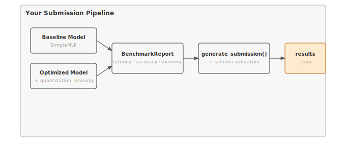

# Module 20: Capstone

:::{.callout-note title="Module Info"}

**OPTIMIZATION TIER** | Difficulty: ●●●● | Time: 6-8 hours | Prerequisites: All modules (01-19)

This capstone assumes you've built a complete framework end-to-end:

- Core framework (Modules 01-13) — **required**
- Optimization techniques (Modules 14-18) — **recommended**
- Benchmarking methodology (Module 19) — **required**

Parts 1-4 run on Modules 01-13 + 19 alone. Part 4b layers in Modules 14-18 to drive the full baseline-to-optimized workflow; without them, the pipeline degrades to baseline benchmarking only.
:::

```{=html}
<div class="action-cards">
<div class="action-card">
<h4>🎧 Audio Overview</h4>
<p>Listen to an AI-generated overview.</p>
<audio controls style="width: 100%; height: 54px;">
<source src="https://github.com/harvard-edge/cs249r_book/releases/download/tinytorch-audio-v0.1.1/20_capstone.mp3" type="audio/mpeg">
</audio>
</div>
<div class="action-card">
<h4>🚀 Launch Binder</h4>
<p>Run interactively in your browser.</p>
<a href="https://mybinder.org/v2/gh/harvard-edge/cs249r_book/main?labpath=tinytorch%2Fmodules%2F20_capstone%2Fcapstone.ipynb" class="action-btn btn-orange">Open in Binder →</a>
</div>
<div class="action-card">
<h4>📄 View Source</h4>
<p>Browse the source code on GitHub.</p>
<a href="https://github.com/harvard-edge/cs249r_book/blob/main/tinytorch/src/20_capstone/20_capstone.py" class="action-btn btn-teal">View on GitHub →</a>
</div>
</div>

<style>
.slide-viewer-container {
  margin: 0.5rem 0 1.5rem 0;
  background: #0f172a;
  border-radius: 1rem;
  overflow: hidden;
  box-shadow: 0 4px 20px rgba(0,0,0,0.15);
}
.slide-header {
  display: flex;
  align-items: center;
  justify-content: space-between;
  padding: 0.6rem 1rem;
  background: rgba(255,255,255,0.03);
}
.slide-title {
  display: flex;
  align-items: center;
  gap: 0.5rem;
  color: #94a3b8;
  font-weight: 500;
  font-size: 0.85rem;
}
.slide-subtitle {
  color: #64748b;
  font-weight: 400;
  font-size: 0.75rem;
}
.slide-toolbar {
  display: flex;
  align-items: center;
  gap: 0.375rem;
}
.slide-toolbar button {
  background: transparent;
  border: none;
  color: #64748b;
  width: 32px;
  height: 32px;
  border-radius: 0.375rem;
  cursor: pointer;
  font-size: 1.1rem;
  transition: all 0.15s;
  display: flex;
  align-items: center;
  justify-content: center;
}
.slide-toolbar button:hover {
  background: rgba(249, 115, 22, 0.15);
  color: #f97316;
}
.slide-nav-group {
  display: flex;
  align-items: center;
}
.slide-page-info {
  color: #64748b;
  font-size: 0.75rem;
  padding: 0 0.5rem;
  font-weight: 500;
}
.slide-zoom-group {
  display: flex;
  align-items: center;
  margin-left: 0.25rem;
  padding-left: 0.5rem;
  border-left: 1px solid rgba(255,255,255,0.1);
}
.slide-canvas-wrapper {
  display: flex;
  justify-content: center;
  align-items: center;
  padding: 0.5rem 1rem 1rem 1rem;
  min-height: 380px;
  background: #0f172a;
}
.slide-canvas {
  max-width: 100%;
  max-height: 350px;
  height: auto;
  border-radius: 0.5rem;
  box-shadow: 0 4px 24px rgba(0,0,0,0.4);
}
.slide-progress-wrapper {
  padding: 0 1rem 0.5rem 1rem;
}
.slide-progress-bar {
  height: 3px;
  background: rgba(255,255,255,0.08);
  border-radius: 1.5px;
  overflow: hidden;
  cursor: pointer;
}
.slide-progress-fill {
  height: 100%;
  background: #f97316;
  border-radius: 1.5px;
  transition: width 0.2s ease;
}
.slide-loading {
  color: #f97316;
  font-size: 0.9rem;
  display: flex;
  align-items: center;
  gap: 0.5rem;
}
.slide-loading::before {
  content: '';
  width: 18px;
  height: 18px;
  border: 2px solid rgba(249, 115, 22, 0.2);
  border-top-color: #f97316;
  border-radius: 50%;
  animation: slide-spin 0.8s linear infinite;
}
@keyframes slide-spin {
  to { transform: rotate(360deg); }
}
.slide-footer {
  display: flex;
  justify-content: center;
  gap: 0.5rem;
  padding: 0.6rem 1rem;
  background: rgba(255,255,255,0.02);
  border-top: 1px solid rgba(255,255,255,0.05);
}
.slide-footer a {
  display: inline-flex;
  align-items: center;
  gap: 0.375rem;
  background: #f97316;
  color: white;
  padding: 0.4rem 0.9rem;
  border-radius: 2rem;
  text-decoration: none;
  font-weight: 500;
  font-size: 0.75rem;
  transition: all 0.15s;
}
.slide-footer a:hover {
  background: #ea580c;
  color: white;
}
.slide-footer a.secondary {
  background: transparent;
  color: #94a3b8;
  border: 1px solid rgba(255,255,255,0.15);
}
.slide-footer a.secondary:hover {
  background: rgba(255,255,255,0.05);
  color: #f8fafc;
}
@media (max-width: 600px) {
  .slide-header { flex-direction: column; gap: 0.5rem; padding: 0.5rem 0.75rem; }
  .slide-toolbar button { width: 28px; height: 28px; }
  .slide-canvas-wrapper { min-height: 260px; padding: 0.5rem; }
  .slide-canvas { max-height: 220px; }
}
</style>

<div class="slide-viewer-container" id="slide-viewer-20_capstone">
<div class="slide-header">
<div class="slide-title">
<span>🔥</span>
<span>Slide Deck</span>

<span class="slide-subtitle">· AI-generated</span>
</div>
<div class="slide-toolbar">
<div class="slide-nav-group">
<button onclick="slideNav('20_capstone', -1)" title="Previous">‹</button>
<span class="slide-page-info"><span id="slide-num-20_capstone">1</span> / <span id="slide-count-20_capstone">-</span></span>
<button onclick="slideNav('20_capstone', 1)" title="Next">›</button>
</div>
<div class="slide-zoom-group">
<button onclick="slideZoom('20_capstone', -0.25)" title="Zoom out">−</button>
<button onclick="slideZoom('20_capstone', 0.25)" title="Zoom in">+</button>
</div>
</div>
</div>
<div class="slide-canvas-wrapper">
<div id="slide-loading-20_capstone" class="slide-loading">Loading slides...</div>
<canvas id="slide-canvas-20_capstone" class="slide-canvas" style="display:none;"></canvas>
</div>
<div class="slide-progress-wrapper">
<div class="slide-progress-bar" onclick="slideProgress('20_capstone', event)">
<div class="slide-progress-fill" id="slide-progress-20_capstone" style="width: 0%;"></div>
</div>
</div>
<div class="slide-footer">
<a href="../assets/slides/20_capstone.pdf" download>⬇ Download</a>
<a href="#" onclick="slideFullscreen('20_capstone'); return false;" class="secondary">⛶ Fullscreen</a>
</div>
</div>

<script src="https://cdnjs.cloudflare.com/ajax/libs/pdf.js/3.11.174/pdf.min.js"></script>
<script>
(function() {
  if (window.slideViewersInitialized) return;
  window.slideViewersInitialized = true;

  pdfjsLib.GlobalWorkerOptions.workerSrc = 'https://cdnjs.cloudflare.com/ajax/libs/pdf.js/3.11.174/pdf.worker.min.js';

  window.slideViewers = {};

  window.initSlideViewer = function(id, pdfUrl) {
    const viewer = { pdf: null, page: 1, scale: 1.3, rendering: false, pending: null };
    window.slideViewers[id] = viewer;

    const canvas = document.getElementById('slide-canvas-' + id);
    const ctx = canvas.getContext('2d');

    function render(num) {
      viewer.rendering = true;
      viewer.pdf.getPage(num).then(function(page) {
        const viewport = page.getViewport({scale: viewer.scale});
        canvas.height = viewport.height;
        canvas.width = viewport.width;
        page.render({canvasContext: ctx, viewport: viewport}).promise.then(function() {
          viewer.rendering = false;
          if (viewer.pending !== null) { render(viewer.pending); viewer.pending = null; }
        });
      });
      document.getElementById('slide-num-' + id).textContent = num;
      document.getElementById('slide-progress-' + id).style.width = (num / viewer.pdf.numPages * 100) + '%';
    }

    function queue(num) { if (viewer.rendering) viewer.pending = num; else render(num); }

    pdfjsLib.getDocument(pdfUrl).promise.then(function(pdf) {
      viewer.pdf = pdf;
      document.getElementById('slide-count-' + id).textContent = pdf.numPages;
      document.getElementById('slide-loading-' + id).style.display = 'none';
      canvas.style.display = 'block';
      render(1);
    }).catch(function() {
      document.getElementById('slide-loading-' + id).innerHTML = 'Unable to load. <a href="' + pdfUrl + '" style="color:#f97316;">Download PDF</a>';
    });

    viewer.queue = queue;
  };

  window.slideNav = function(id, dir) {
    const v = window.slideViewers[id];
    if (!v || !v.pdf) return;
    const newPage = v.page + dir;
    if (newPage >= 1 && newPage <= v.pdf.numPages) { v.page = newPage; v.queue(newPage); }
  };

  window.slideZoom = function(id, delta) {
    const v = window.slideViewers[id];
    if (!v) return;
    v.scale = Math.max(0.5, Math.min(3, v.scale + delta));
    v.queue(v.page);
  };

  window.slideProgress = function(id, event) {
    const v = window.slideViewers[id];
    if (!v || !v.pdf) return;
    const bar = event.currentTarget;
    const pct = (event.clientX - bar.getBoundingClientRect().left) / bar.offsetWidth;
    const newPage = Math.max(1, Math.min(v.pdf.numPages, Math.ceil(pct * v.pdf.numPages)));
    if (newPage !== v.page) { v.page = newPage; v.queue(newPage); }
  };

  window.slideFullscreen = function(id) {
    const el = document.getElementById('slide-viewer-' + id);
    if (el.requestFullscreen) el.requestFullscreen();
    else if (el.webkitRequestFullscreen) el.webkitRequestFullscreen();
  };
})();

initSlideViewer('20_capstone', '../assets/slides/20_capstone.pdf');

</script>

```
## Overview

Nineteen modules in, you have a working ML framework. Tensors, autograd, transformers, quantization, pruning, profiling — every line written by you. The Olympics is where you put it on the scale.

In production ML, an unmeasured claim is no claim at all. This capstone gives your framework the same treatment MLPerf and Papers with Code give a real submission: a baseline measurement, an optimization pass, an apples-to-apples comparison, and a schema-validated artifact someone else can verify. You'll write the benchmarking harness, run it against your own code, and ship a `results.json` that stands on its own.

When you finish, you won't just have a framework. You'll have evidence.

## Learning Objectives

:::{.callout-tip title="By completing this module, you will:"}

- **Implement** comprehensive benchmarking infrastructure measuring accuracy, latency, throughput, and memory
- **Master** the three pillars of reliable benchmarking: repeatability, comparability, and completeness
- **Understand** performance measurement traps (variance, cold starts, batch effects) and how to avoid them
- **Connect** your TinyTorch implementation to production ML workflows (experiment tracking, A/B testing, regression detection)
- **Generate** schema-validated JSON submissions that enable reproducible comparisons and community sharing
:::

## What You'll Build


::: {#fig-20_capstone-diag-1 fig-env="figure" fig-pos="htb" fig-cap="**TinyTorch Submission Pipeline**: Baseline and optimized models flow through `BenchmarkReport` and `generate_submission()` to produce a schema-validated `results.json`." fig-alt="Diagram showing baseline and optimized models flowing through BenchmarkReport and generate_submission() to produce results.json."}



:::


**Implementation roadmap:**

| Part | What You'll Implement | Key Concept |
|------|----------------------|-------------|
| 1 | `SimpleMLP` | Baseline model for benchmarking demonstrations |
| 2 | `BenchmarkReport` | Comprehensive performance measurement with statistical rigor |
| 3 | `generate_submission()` | Standardized JSON generation with schema compliance |
| 4 | `validate_submission_schema()` | Automated validation ensuring data quality |
| 5 | Complete workflows | Baseline, optimization, comparison, submission pipeline |

**The pattern you'll enable:**
```python
# Professional ML workflow
report = BenchmarkReport(model_name="my_model")
report.benchmark_model(model, X_test, y_test, num_runs=100)

submission = generate_submission(
    baseline_report=baseline_report,
    optimized_report=optimized_report,
    techniques_applied=["quantization", "pruning"]
)
save_submission(submission, "results.json")
```

### What You're NOT Building (Yet)

Out of scope for this capstone:

- CI/CD pipelines that benchmark on every commit
- Multi-hardware comparison across CPU/GPU/TPU
- Plotting dashboards for accuracy-vs-latency curves
- Leaderboard aggregation across community submissions

You are building the measurement and reporting foundation everything else stands on. Automation and visualization layer on top — but only if the numbers underneath are trustworthy.

## API Reference

This section provides a quick reference for the benchmarking classes and functions you'll build. Use this while implementing and debugging.

### BenchmarkReport Constructor

```python
BenchmarkReport(model_name: str = "model") -> BenchmarkReport
```

Creates a benchmark report instance that measures and stores model performance metrics along with system context for reproducibility.

### BenchmarkReport Properties

| Property | Type | Description |
|----------|------|-------------|
| `model_name` | `str` | Identifier for the model being benchmarked |
| `metrics` | `dict` | Performance measurements (accuracy, latency, etc.) |
| `system_info` | `dict` | Platform, Python version, NumPy version |
| `timestamp` | `str` | When benchmark was run (ISO format) |

### Core Methods

| Method | Signature | Description |
|--------|-----------|-------------|
| `benchmark_model` | `benchmark_model(model, X_test, y_test, num_runs=100) -> dict` | Measures accuracy, latency (mean ± std), throughput, memory |
| `generate_submission` | `generate_submission(baseline_report, optimized_report=None, ...) -> dict` | Creates standardized JSON with baseline, optimized, improvements |
| `save_submission` | `save_submission(submission, filepath="submission.json") -> str` | Writes JSON to file with validation |
| `validate_submission_schema` | `validate_submission_schema(submission) -> bool` | Validates structure and value ranges |

### Module Dependencies and Imports

This capstone integrates components from across TinyTorch:

**Core dependencies (required):**
```python
from tinytorch.core.tensor import Tensor
from tinytorch.core.layers import Linear
from tinytorch.core.activations import ReLU
from tinytorch.core.losses import CrossEntropyLoss
```

**Optimization modules (optional):**
```python
# These imports use try/except blocks for graceful degradation
try:
    from tinytorch.perf.profiling import Profiler, quick_profile
    from tinytorch.perf.compression import magnitude_prune, structured_prune
    from tinytorch.perf.benchmarking import Benchmark, BenchmarkResult
except ImportError:
    # Core benchmarking still works without optimization modules
    pass
```

The advanced optimization workflow (Part 4b) demonstrates these optional integrations, but the core benchmarking system (Parts 1-4) works with just the foundation modules (01-13) and basic benchmarking (19).

## Core Concepts

This section covers the fundamental principles of professional ML benchmarking. These concepts apply to every ML system, from research papers to production deployments.

### The Reproducibility Crisis in ML

ML has a credibility problem. A paper claims "92% accuracy with 10ms latency" — and you can't reproduce it, because the paper never said which hardware, which software versions, which batch size, or how the measurement was taken. Without those facts the number is folklore.

MLPerf and Papers with Code emerged to fix this, and they did it by requiring four things from every submission:

- **Standardized tasks** on fixed datasets
- **Hardware specifications** documented in full
- **Measurement protocols** pinned down precisely
- **Code submissions** that anyone can re-run

Your benchmarking system enforces the same contract. Every submission you generate carries the context another person needs to reproduce — or refute — your claim.

### The Three Pillars of Reliable Benchmarking

Professional benchmarking rests on three foundational principles: repeatability, comparability, and completeness.

**Repeatability** means running the same experiment multiple times produces the same result. This requires fixed random seeds, consistent test datasets, and measuring variance across runs. A single measurement of "10.3ms" is worthless because you don't know if that's typical or an outlier. Measuring 100 times and reporting "10.0ms ± 0.5ms" tells you the true performance and its variability.

Here's how your implementation ensures repeatability:

```python
# Measure latency with statistical rigor
latencies = []
for _ in range(num_runs):
    start = time.time()
    _ = model.forward(X_test[:1])  # Single sample inference
    latencies.append((time.time() - start) * 1000)  # Convert to ms

avg_latency = np.mean(latencies)
std_latency = np.std(latencies)
```

The loop runs inference 100 times (by default) to capture variance. The first few runs may be slower due to cold caches, and occasional runs may hit garbage collection pauses. By aggregating many measurements, you get a statistically valid estimate.

**Comparability** means different people can fairly compare results. This requires documenting the environment completely:

```python
def _get_system_info(self):
    """Collect system information for reproducibility."""
    return {
        'platform': platform.platform(),
        'python_version': sys.version.split()[0],
        'numpy_version': np.__version__
    }
```

When someone sees your submission claiming 10ms latency, they need to know if that was measured on a MacBook or a server with 32 CPU cores. Platform differences can cause 10x performance variations, making cross-platform comparisons meaningless without context.

**Completeness** means capturing all relevant metrics, not cherry-picking favorable ones. Your `benchmark_model` method measures six distinct metrics:

```python
self.metrics = {
    'parameter_count': int(param_count),
    'model_size_mb': float(model_size_mb),
    'accuracy': float(accuracy),
    'latency_ms_mean': float(avg_latency),
    'latency_ms_std': float(std_latency),
    'throughput_samples_per_sec': float(1000 / avg_latency)
}
```

Each metric answers a different question. Parameter count indicates model capacity. Model size determines deployment cost. Accuracy measures task performance. Latency affects user experience. Throughput determines batch processing capacity. Optimizations create trade-offs between these dimensions, so measuring all of them prevents hiding downsides.

### Latency vs Throughput: A Critical Distinction

Many beginners confuse latency and throughput because both relate to speed. They measure fundamentally different things.

**Latency** measures per-sample speed: how long does it take to process one input? This matters for real-time applications where users wait for results. Your implementation measures latency by timing single-sample inference:

```python
# Latency: time for ONE sample
start = time.time()
_ = model.forward(X_test[:1])  # Shape: (1, features)
latency_ms = (time.time() - start) * 1000
```

A model with 10ms latency processes one input in 10 milliseconds. The user submits a query and waits 10ms. That number lives or dies on user experience.

**Throughput** measures batch capacity: how many inputs can you process per second? This is the metric for offline jobs grinding through millions of examples. Your implementation derives it from latency:

```python
throughput_samples_per_sec = 1000 / avg_latency
```

At 10ms per sample, throughput is 1000 / 10 = 100 samples/second — but only if you process one sample at a time. Batching changes the math. A batch of 32 samples might take 50ms total, which is 640 samples/second of throughput at the cost of 50ms per-request latency.

The trade-off: **Batching increases throughput but hurts latency.** A production API serving individual user requests optimizes for latency to maintain a snappy user experience. A background batch processing pipeline optimizes for throughput to minimize total compute costs. Choosing between them is a fundamental architectural decision.

:::{.callout-warning title="💾 Systems Implication: Hardware Utilization and Little's Law"}
To truly master this engineering trade-off, you must look beyond timing metrics and analyze Hardware Utilization. A GPU processing a single token (batch size 1) might only utilize 5% of its available ALUs, wasting 95% of the silicon you are paying for. As you increase the batch size, you saturate the computation engines and memory buses, pushing utilization toward 100%. However, **Little's Law** ($L = \lambda W$) mathematically dictates that the number of concurrent items in the system ($L$) equals the throughput ($\lambda$) multiplied by the latency ($W$). In a capstone setting—and in production—you must intentionally target a specific operating point on this curve. You cannot cheat the physical limits of the underlying hardware.
:::

### Statistical Rigor: Why Variance Matters

Single measurements lie. Variance tells the truth about performance consistency.

Consider two models, both with mean latency of 10.0ms. Model A has standard deviation of 0.5ms. Model B has standard deviation of 4.2ms. Which would you deploy?

Model A's predictable performance (9.5-10.5ms range) provides consistent user experience. Model B's erratic performance (sometimes 6ms, sometimes 15ms) creates frustration. Users prefer reliable slowness over unpredictable speed.

Your implementation captures this variance:

```python
latencies = []
for _ in range(num_runs):
    start = time.time()
    _ = model.forward(X_test[:1])
    latencies.append((time.time() - start) * 1000)

avg_latency = np.mean(latencies)
std_latency = np.std(latencies)  # Captures variance
```

Running 100 iterations isn't just for accuracy of the mean. It also characterizes the distribution. High standard deviation indicates performance varies significantly run-to-run, perhaps due to garbage collection pauses, cache effects, or OS scheduling.

In production systems, engineers track percentiles (p50, p90, p99) to understand tail latency. The p99 latency tells you "99% of requests complete within this time," which matters more for user experience than mean latency. One user experiencing a 100ms delay (because they hit p99) has a worse experience than if all users consistently saw 20ms.

### The Optimization Trade-off Triangle

Every optimization involves trade-offs between three competing objectives: speed (latency), size (memory), and accuracy. You can optimize for any two, but achieving all three simultaneously is impossible with current techniques.

**Fast + Small** means aggressive optimization. Quantizing to INT8 reduces model size 4x and speeds up inference 2x, but typically costs 1-2% accuracy. Pruning 50% of weights halves memory and adds another speedup, but may lose another 1-2% accuracy. You've traded accuracy for efficiency.

**Fast + Accurate** means careful optimization. You might quantize only certain layers, or use INT16 instead of INT8. You preserve accuracy but achieve less compression. The model is faster but not dramatically smaller.

**Small + Accurate** means conservative techniques. Knowledge distillation transfers accuracy from a large teacher to a small student. The student is smaller and maintains accuracy, but may be slower than aggressive quantization because it still operates in FP32.

Your submission captures these trade-offs automatically:

```python
submission['improvements'] = {
    'speedup': float(baseline_latency / optimized_latency),
    'compression_ratio': float(baseline_size / optimized_size),
    'accuracy_delta': float(
        optimized_report.metrics['accuracy'] - baseline_report.metrics['accuracy']
    )
}
```

A speedup of 2.3x with compression of 4.1x but accuracy delta of -0.01 (-1%) shows you chose the "fast + small" corner of the triangle. A speedup of 1.2x with compression of 1.5x but accuracy delta of 0.00 shows you chose "accurate + moderately fast."

### Schema Validation: Enabling Automation

Your submission format uses a structured JSON schema that enforces completeness and type safety. This isn't bureaucracy—it enables powerful automation.

Without schema validation, submissions become inconsistent. One person reports accuracy as a percentage string ("92%"), another as a float (0.92), another as an integer (92). Aggregating these results requires manual cleaning. With schema validation, every submission uses the same format:

```python
# Schema-enforced format
'accuracy': float(accuracy)  # Always 0.0-1.0 float

# Validation catches errors
assert 0 <= metrics['accuracy'] <= 1, "Accuracy must be in [0, 1]"
```

This enables automated processing:

```python
# Aggregate community results automatically
all_submissions = [load_json(f) for f in submission_files]
avg_accuracy = np.mean([s['baseline']['metrics']['accuracy']
                        for s in all_submissions])

# Build leaderboards
sorted_by_speedup = sorted(all_submissions,
                           key=lambda s: s['improvements']['speedup'],
                           reverse=True)

# Detect regressions in CI/CD
if new_latency > baseline_latency * 1.1:
    raise Exception("Performance regression: 10% slower!")
```

The schema also enables forward compatibility. When you add new optional fields, old submissions remain valid. When you require new fields, the version number increments, and validation enforces the migration.

### Performance Measurement Traps

Real-world benchmarking is full of subtle traps that invalidate measurements. Understanding these pitfalls is crucial for accurate results.

**Trap 1: Measuring the Wrong Thing.** If you time model creation instead of just inference, you're measuring initialization overhead, not runtime performance. If you include data loading in the timing loop, you're measuring I/O speed, not model speed. The fix is isolating exactly what you want to measure:

```python
# Prepare data BEFORE timing
X = create_test_input()

# Time ONLY the operation you care about
start = time.time()
output = model.forward(X)  # Only this is timed
latency = time.time() - start

# Process output AFTER timing
predictions = postprocess(output)
```

**Trap 2: Ignoring System Noise.** Operating systems multitask. Your benchmark might get interrupted by background processes, garbage collection, or CPU thermal throttling. Single measurements capture noise. Multiple measurements average it out. Your implementation runs 100 iterations by default to handle this.

**Trap 3: Cold Start Effects.** The first inference is often slower because caches are cold and JIT compilers haven't optimized yet. Production benchmarks typically discard the first N runs as "warm-up." Your implementation includes warm-up inherently by averaging all runs—the few slow cold starts get averaged with many fast warm runs.

**Trap 4: Batch Size Confusion.** Measuring latency on batch_size=32 then dividing by 32 doesn't give per-sample latency. Batching amortizes overhead, so batch latency / batch_size underestimates per-sample latency. Always measure with the same batch size as production deployment.

### System Integration: The Complete ML Lifecycle

This capstone represents the final stage of the ML systems lifecycle, but it's also the beginning of the next iteration. Production ML systems operate in a never-ending loop:

1. **Research & Development** - Build models (Modules 01-13)
2. **Baseline Measurement** - Benchmark unoptimized performance (Module 19)
3. **Optimization** - Apply techniques like quantization and pruning (Modules 14-18)
4. **Validation** - Benchmark optimized version (Module 19)
5. **Decision** - Keep optimization if improvements outweigh costs (Module 20)
6. **Deployment** - Serve model in production
7. **Monitoring** - Track performance over time, detect regressions
8. **Iteration** - When performance degrades or requirements change, loop back to step 3

Your submission captures a snapshot of this cycle. The baseline metrics document performance before optimization. The optimized metrics show results after applying techniques. The improvements section quantifies the delta. The techniques_applied list enables reproducibility.

In production, engineers maintain this documentation across hundreds of experiments. When a deployment's latency increases from 10ms to 30ms three months later, they consult the original benchmark to understand what changed. Without system_info and reproducible measurements, debugging becomes guesswork.

## Production Context

### Your Implementation vs. Industry Standards

Your TinyTorch benchmarking system implements the same principles used by production ML frameworks and research competitions, just at educational scale.

| Feature | Your Implementation | Production Systems |
|---------|---------------------|-------------------|
| **Metrics** | 6 core metrics (accuracy, latency, etc.) | 20+ metrics including p99 latency, memory bandwidth |
| **Runs** | 100 iterations for variance | 1000+ runs, discard outliers |
| **Validation** | Python assertions | JSON Schema, automated CI checks |
| **Format** | Simple JSON | Protobuf, versioned schemas |
| **Scale** | Single model benchmarks | Automated pipelines tracking 1000s of experiments |

### Code Comparison

The following comparison shows how your educational implementation translates to production tools.

::: {.panel-tabset}
## Your TinyTorch
```python
from tinytorch.olympics import BenchmarkReport, generate_submission

# Benchmark baseline
baseline_report = BenchmarkReport(model_name="my_model")
baseline_report.benchmark_model(model, X_test, y_test, num_runs=100)

# Benchmark optimized
optimized_report = BenchmarkReport(model_name="optimized_model")
optimized_report.benchmark_model(opt_model, X_test, y_test, num_runs=100)

# Generate submission
submission = generate_submission(
    baseline_report=baseline_report,
    optimized_report=optimized_report,
    techniques_applied=["quantization", "pruning"]
)

save_submission(submission, "results.json")
```

## Production MLflow
```python
import mlflow

# Track baseline experiment
with mlflow.start_run(run_name="baseline"):
    mlflow.log_params({"model": "my_model"})
    metrics = benchmark_model(model, X_test, y_test)
    mlflow.log_metrics(metrics)
    mlflow.log_artifact("model.pkl")

# Track optimized experiment
with mlflow.start_run(run_name="optimized"):
    mlflow.log_params({"model": "optimized_model",
                       "techniques": ["quantization", "pruning"]})
    metrics = benchmark_model(opt_model, X_test, y_test)
    mlflow.log_metrics(metrics)
    mlflow.log_artifact("optimized_model.pkl")

# Compare experiments in MLflow UI
```
:::

Let's walk through the comparison line by line:

- **Line 1 (Import)**: TinyTorch uses a simple module import. MLflow provides enterprise-grade experiment tracking with databases and web UIs.
- **Line 4 (Benchmark baseline)**: TinyTorch's `BenchmarkReport` mirrors MLflow's experiment runs. Both capture metrics and system context.
- **Line 8 (Benchmark optimized)**: Same API in both—create report, benchmark model. This consistency makes transitioning to production tools natural.
- **Line 12 (Generate submission)**: TinyTorch generates JSON. MLflow logs to a database that supports querying, visualization, and comparison.
- **Line 18 (Save)**: TinyTorch saves to file. MLflow persists to SQL database with version control and artifact storage.

:::{.callout-tip title="What's Identical"}

The workflow pattern: baseline → optimize → benchmark → compare → decide. Whether you use TinyTorch or MLflow, this cycle is fundamental to production ML. The tools scale, but the methodology remains the same.
:::

### Why Benchmarking Matters at Scale

Benchmarking earns its keep when the numbers get large:

- **Model serving.** A recommendation system handles 10M requests/day. Cutting latency from 20ms to 10ms saves 100,000 seconds of compute every day — 1.16 days of CPU time daily, a 50% serving-cost reduction. That's a budget line, not a metric.
- **Training efficiency.** A $1M LLM training run is 60% bottlenecked on data loading. Fixing the input pipeline frees $600,000 of GPU time. You only know to look because the profiler said so.
- **Deployment constraints.** A mobile app must fit a 50MB model budget. Quantization shrinks a 200MB checkpoint to 50MB at the cost of 1% accuracy. The app ships — and the only reason anyone signed off on the trade is because the trade was measured.

Reproducible benchmarking isn't academic. It's how engineers defend a decision in a design review and prove an optimization paid off in a postmortem.

## Check Your Understanding

Test yourself with these systems thinking questions about benchmarking and performance measurement.

**Q1: Memory Calculation**

A model has 5 million parameters stored as FP32. After INT8 quantization, how much memory is saved?

:::{.callout-note collapse="true" title="Answer"}

FP32: 5,000,000 params × 4 bytes = 20,000,000 bytes = **19.07 MB**

INT8: 5,000,000 params × 1 byte = 5,000,000 bytes = **4.77 MB**

Savings: 19.07 MB − 4.77 MB = **14.30 MB** (75% reduction).

Compression ratio: 19.07 / 4.77 = **4.0×**.

This is why quantization is standard for mobile deployment — the model has to fit the budget.
:::

**Q2: Latency Variance Analysis**

Model A: 10.0ms ± 0.3ms latency. Model B: 10.0ms ± 3.0ms latency. Same accuracy. Which do you deploy and why?

:::{.callout-note collapse="true" title="Answer"}

**Deploy Model A.**

Same mean (10.0ms), but Model A has 10× lower variance (0.3ms vs 3.0ms std).

- Model A's 95% range (±2σ): ~9.4–10.6ms
- Model B's 95% range (±2σ): ~4.0–16.0ms

**Why consistency wins:**

- Users tolerate predictable slowness; they don't tolerate jitter.
- High variance is usually GC pauses, cache misses, or resource contention — three problems you don't want in your hot path.
- Production SLAs are written against p99, not mean. Model B's p99 could land near 16ms while Model A's stays under 11ms.

In production, **reliability beats average speed**. A consistently decent experience trumps an unreliably fast one.
:::

**Q3: Batch Size Trade-off**

Measuring latency with batch_size=32 gives 100ms total. Can you claim 100 / 32 = 3.1ms per-sample latency?

:::{.callout-note collapse="true" title="Answer"}

**No.** Amortized latency is not real latency.

Batching amortizes fixed overhead (data transfer, kernel launch). Per-sample latency at batch=1 is higher than the batch-32 number divided by 32.

What's actually going on:

- Batch=32: 100ms total → 3.1ms/sample (amortized)
- Batch=1: 8ms total → 8ms/sample (actual)

The cost decomposes as:

- Fixed overhead: ~5.0ms (data transfer, kernel launch)
- Variable cost: ~95.0ms / 32 = ~3.0ms per sample
- At batch=1: 5.0ms + 3.0ms ≈ 8.0ms ✓

**Always benchmark at the deployment batch size.** If production serves single requests, measure with batch=1.
:::

**Q4: Speedup Calculation**

Baseline: 20ms latency. Optimized: 5ms latency. What is the speedup and what does it mean?

:::{.callout-note collapse="true" title="Answer"}

Speedup = baseline / optimized = 20ms / 5ms = **4.0×**.

What that buys you:

- Same input processed in one-quarter the time.
- Same hardware now serves 4× the traffic.

What it means in dollars and SLA:

- 100 req/sec baseline → 400 req/sec optimized.
- $1,000/month compute → $250/month for the same load.
- 60% utilization at SLA → 85% headroom before you have to scale.

**Caveat:** speedup is one number. Always read it alongside `accuracy_delta` and `compression_ratio` — a 4× speedup that costs 5% accuracy is not the same product.
:::

**Q5: Schema Validation Value**

Why does the submission schema require `accuracy` as float in [0, 1] instead of allowing any format?

:::{.callout-note collapse="true" title="Answer"}

**Type safety enables automation.**

Without schema:
```python
# Different submissions, different formats (breaks aggregation)
{"accuracy": "92%"}      # String
{"accuracy": 92}         # Integer (out of 100)
{"accuracy": 0.92}       # Float
{"accuracy": "good"}     # Non-numeric
```

Aggregating these requires manual parsing and error handling.

With schema:
```python
# All submissions use same format (aggregation works)
{"accuracy": 0.92}  # Always float in [0.0, 1.0]
```

**Benefits:**
1. **Automated validation** - Reject invalid submissions immediately
2. **Aggregation** - `np.mean([s['accuracy'] for s in submissions])` just works
3. **Comparison** - Sort by accuracy without parsing different formats
4. **APIs** - Other tools can consume submissions without custom parsers

**Real example:** Papers with Code leaderboards require strict schemas. Thousands of submissions from different teams aggregate automatically because everyone follows the same format.
:::

## Further Reading

For students who want to understand the academic foundations and industry standards for ML benchmarking:

### Seminal Papers

- **MLPerf: An Industry Standard Benchmark Suite for Machine Learning Performance** - Mattson et al. (2020). Defines standardized ML benchmarks for hardware comparison. The gold standard for fair performance comparisons. **Systems Implication:** Forced hardware vendors to transparently report power consumption and system topology alongside raw FLOPS, cementing the reality that interconnects and power walls dictate cluster-scale ML. [arXiv:1910.01500](https://arxiv.org/abs/1910.01500)

- **A Step Toward Quantifying Independently Reproducible Machine Learning Research** - Pineau et al. (2021). Analyzes reproducibility crisis in ML and proposes requirements for verifiable claims. Introduces reproducibility checklist adopted by NeurIPS. **Systems Implication:** Emphasized that identical code can yield divergent results across different hardware architectures (e.g., due to floating-point non-determinism in parallel reductions), making hardware logging a strict requirement for reproducibility. [arXiv:2104.05563](https://arxiv.org/abs/2104.05563)

- **Hidden Technical Debt in Machine Learning Systems** - Sculley et al. (2015). Identifies systems challenges in production ML, including monitoring, versioning, and reproducibility. Required reading for ML systems engineers. **Systems Implication:** Revealed that the underlying compute infrastructure, data pipelines, and serving systems dwarf the actual ML code, showing that scaling ML is fundamentally a distributed systems engineering problem. [NeurIPS 2015](https://papers.nips.cc/paper/2015/hash/86df7dcfd896fcaf2674f757a2463eba-Abstract.html)

### Additional Resources

- **MLflow Documentation**: [https://mlflow.org/](https://mlflow.org/) - Production experiment tracking system implementing patterns from this module
- **Papers with Code**: [https://paperswithcode.com/](https://paperswithcode.com/) - See how research papers submit benchmarks with reproducible code
- **Weights & Biases Best Practices**: [https://wandb.ai/site/experiment-tracking](https://wandb.ai/site/experiment-tracking) - Industry standard for ML experiment management

## What's Next

:::{.callout-note title="The framework is finished. The learning isn't."}

Twenty modules ago, `Tensor` was an empty class. Now it has autograd behind it, a transformer on top of it, a quantizer that compresses it, and a benchmark report that proves what it can do. You didn't read about how PyTorch is built. You built it.

The `results.json` you ship from this module is the first artifact in a long career of them. Every system you'll deploy from here forward gets the same treatment: baseline, optimize, measure, justify.
:::

Where to take the framework next:

| Direction | What to build | What it teaches |
|-----------|---------------|-----------------|
| **Push the optimizers** | Benchmark milestone models (MNIST CNN, Transformer) end-to-end through Modules 14-18 | How real optimizations interact under measurement |
| **Scale to a team** | Wire MLflow or Weights & Biases into the same `BenchmarkReport` flow | How professional experiment tracking grows from this same skeleton |
| **Publish results** | Convert your schema into a Papers with Code submission | How reproducibility becomes a community contract |
| **Automate regression detection** | Run the benchmark on every commit in CI | How performance is defended, not just achieved |

The next chapter — the **Conclusion** — steps back from the code. It looks at what you actually learned by writing all of it: which abstractions paid off, which trade-offs you'll keep meeting, and how this framework you built compares to the production systems that inspired it. Read it with your `results.json` open.

## Get Started

:::{.callout-tip title="Interactive Options"}

- **[Launch Binder](https://mybinder.org/v2/gh/harvard-edge/cs249r_book/main?urlpath=lab/tree/tinytorch/modules/20_capstone/capstone.ipynb)** - Run interactively in browser, no setup required
- **[View Source](https://github.com/harvard-edge/cs249r_book/blob/main/tinytorch/src/20_capstone/20_capstone.py)** - Browse the implementation code
:::

:::{.callout-warning title="Save Your Progress"}

Binder sessions are temporary. Download your completed notebook when done, or clone the repository for persistent local work.
:::
