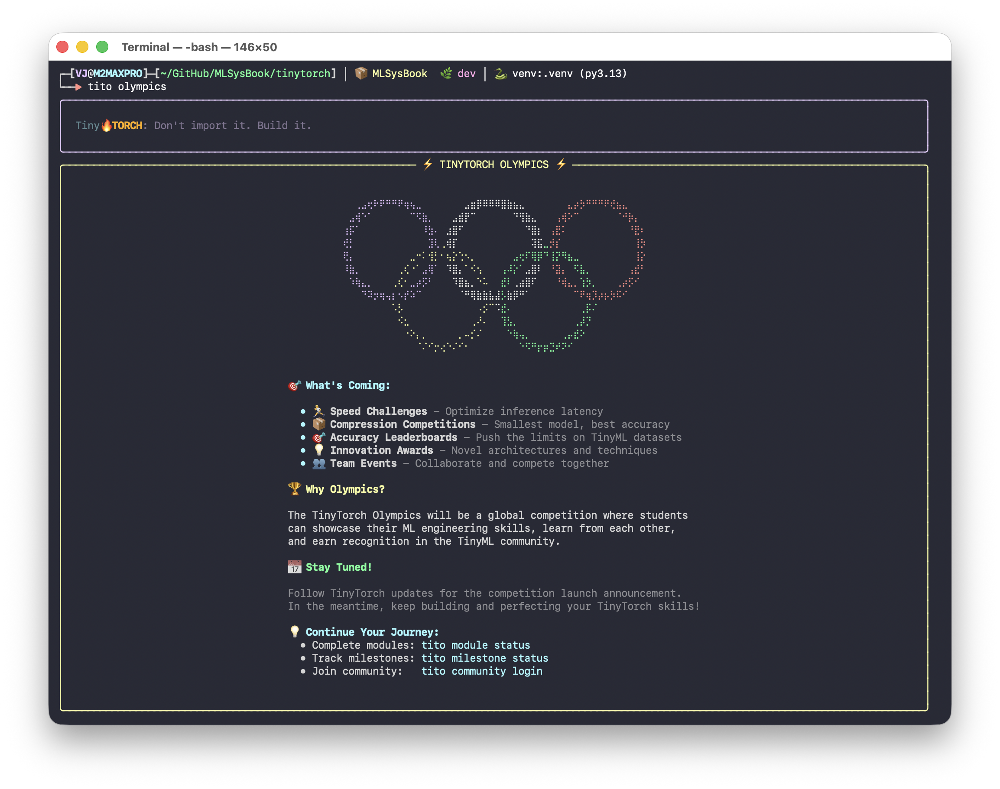

{fig-alt="TinyTorch Olympics" fig-align="center" width="600px"}

## Coming Soon

The Torch Olympics is TinyTorch's **capstone experience**. You've built an ML framework from scratch. Soon, you'll put it to the test.

We're designing a systems engineering competition where your design choices, optimization strategies, and implementation quality will be measured against other students on a public leaderboard.

## What We're Thinking

| Track | The Challenge |
|-------|---------------|
| **Vision** | Highest accuracy on image classification using your Conv2d |
| **Language** | Best text generation quality using your transformer |
| **Speed** | Fastest inference throughput using your optimizations |
| **Compression** | Smallest model that still performs well |

Details are still being finalized. But the core idea: compete using the framework *you* built, not someone else's.

## Stay in the Loop

Want to know when the Olympics launches? **[Join the community →](https://mlsysbook.ai/tinytorch/community/?action=join)**

We'll announce competition details, share early access, and answer questions there.

## In the Meantime

Make sure you're ready by completing all 19 modules:

- **[Foundation Tier](foundation.qmd)** — Modules 01-08
- **[Architecture Tier](architecture.qmd)** — Modules 09-13
- **[Optimization Tier](optimization.qmd)** — Modules 14-19

**[← Back to Home](../index.qmd)**
