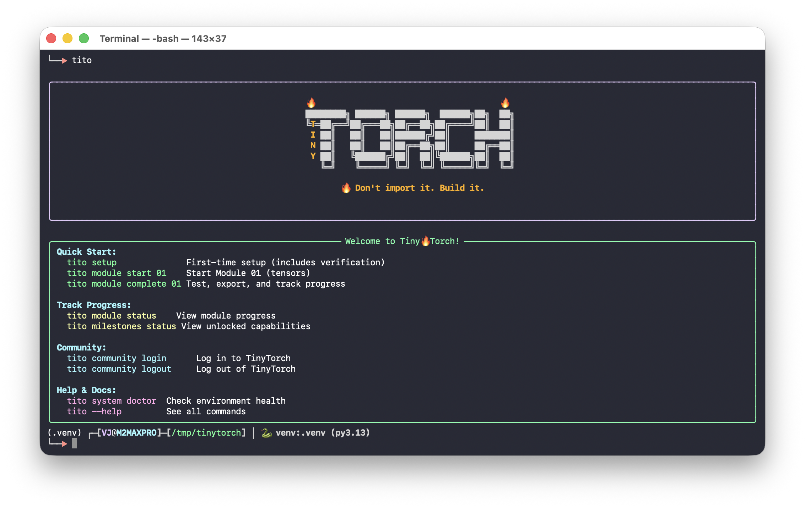

# Welcome

<div style="text-align: center; margin: 1rem 0 2rem 0;">

</div>

`````{only} html
Everyone wants to be an astronaut 🧑‍🚀. Very few want to be the rocket scientist 🚀.
`````

`````{only} latex
Everyone wants to be an astronaut. Very few want to be the rocket scientist.
`````

In machine learning, we see the same pattern. Everyone wants to train models, run inference, deploy AI. Very few want to understand how the frameworks actually work. Even fewer want to build one.

The world is full of users. We do not have enough builders—people who can debug, optimize, and adapt systems when the black box breaks down.

This is the gap TinyTorch exists to fill.

## The Problem

Most people can use PyTorch or TensorFlow. They can import libraries, call functions, train models. But very few understand how these frameworks work: how memory is managed for tensors, how autograd builds computation graphs, how optimizers update parameters. And almost no one has a guided, structured way to learn that from the ground up.

<div style="background: #f8f9fa; padding: 1.5rem; border-radius: 0.5rem; margin: 1.5rem 0;">

**Why does this matter?** Because users hit walls that builders do not:

- When your model runs out of memory, you need to understand **tensor allocation**
- When gradients explode, you need to understand the **computation graph**
- When training is slow, you need to understand where the **bottlenecks** are
- When deploying on a microcontroller, you need to know what can be **stripped away**

The framework becomes a black box you cannot debug, optimize, or adapt. You are stuck waiting for someone else to solve your problem.

</div>

Students cannot learn this from production code. PyTorch is too large, too complex, too optimized. Fifty thousand lines of C++ across hundreds of files. No one learns to build rockets by studying the Saturn V.

They also cannot learn it from toy scripts. A hundred-line neural network does not reveal the architecture of a framework. It hides it.

## The Solution: AI Bricks

TinyTorch teaches you the **AI bricks**—the stable engineering foundations you can use to build any AI system. Small enough to learn from: bite-sized code that runs even on a Raspberry Pi. Big enough to matter: showing the real architecture of how frameworks are built.

<div style="display: grid; grid-template-columns: 1fr 1fr; gap: 1.5rem; margin: 2rem 0;">
<div style="background: #e3f2fd; padding: 1.5rem; border-radius: 0.5rem; border-left: 4px solid #1976d2;">
<strong style="color: #1565c0;">📖 MLSysBook</strong>
<p style="margin: 0.5rem 0 0 0;">The <a href="https://mlsysbook.ai">Machine Learning Systems</a> textbook teaches you the <em>concepts</em> of the rocket ship: propulsion, guidance, life support.</p>
</div>
<div style="background: #fff3e0; padding: 1.5rem; border-radius: 0.5rem; border-left: 4px solid #ff8247;">
<strong style="color: #e65100;">TinyTorch</strong>
<p style="margin: 0.5rem 0 0 0;">TinyTorch is where you actually <em>build</em> a small rocket with your own hands. Not a toy—a real framework.</p>
</div>
</div>

This is how people move from *using* machine learning to *engineering* machine learning systems. This is how someone becomes an AI systems engineer rather than someone who only knows how to run code in a notebook.

## Who This Is For

<div style="display: grid; grid-template-columns: 1fr 1fr; gap: 1rem; margin: 1.5rem 0;">

<div style="background: #fafafa; padding: 1.25rem; border-radius: 0.5rem; border-left: 4px solid #9c27b0;">
<strong>🎓 Students & Researchers</strong>
<p style="margin: 0.5rem 0 0 0; font-size: 0.95rem;">Want to understand ML systems deeply, not just use them superficially. If you've wondered "how does that actually work?", this is for you.</p>
</div>

<div style="background: #fafafa; padding: 1.25rem; border-radius: 0.5rem; border-left: 4px solid #4caf50;">
<strong>⚙ ML Engineers</strong>
<p style="margin: 0.5rem 0 0 0; font-size: 0.95rem;">Need to debug, optimize, and deploy models in production. Understanding the systems underneath makes you more effective.</p>
</div>

<div style="background: #fafafa; padding: 1.25rem; border-radius: 0.5rem; border-left: 4px solid #2196f3;">
<strong>💻 Systems Programmers</strong>
<p style="margin: 0.5rem 0 0 0; font-size: 0.95rem;">You understand memory hierarchies, computational complexity, performance optimization. You want to apply it to ML.</p>
</div>

<div style="background: #fafafa; padding: 1.25rem; border-radius: 0.5rem; border-left: 4px solid #ffc107;">
<strong>🛠 Self-taught Engineers</strong>
<p style="margin: 0.5rem 0 0 0; font-size: 0.95rem;">Can use frameworks but want to know how they work. Preparing for ML infrastructure roles and need systems-level understanding.</p>
</div>

</div>

What you need is not another API tutorial. You need to build.[^pin]

[^pin]: My own background was in compilers, specifically just-in-time (JIT) compilation. But I did not become a systems engineer by reading papers alone. I became one by building [Pin](https://software.intel.com/content/www/us/en/develop/articles/pin-a-dynamic-binary-instrumentation-tool.html), a dynamic binary instrumentation engine that uses JIT technology. The lesson stayed with me: reading teaches concepts, but building deepens understanding.

## What You Will Build

By the end of TinyTorch, you will have implemented:

- A tensor library with broadcasting, reshaping, and matrix operations
- Activation functions with numerical stability considerations
- Neural network layers: linear, convolutional, normalization
- An autograd engine that builds computation graphs and computes gradients
- Optimizers that update parameters using those gradients
- Data loaders that handle batching, shuffling, and preprocessing
- A complete training loop that ties everything together
- Tokenizers, embeddings, attention, and transformer architectures
- Profiling, quantization, and optimization techniques

This is not a simulation. This is the actual architecture of modern ML frameworks, implemented at a scale you can fully understand.

## How to Learn

Each module follows a **Build-Use-Reflect** cycle: implement from scratch, apply to real problems, then connect what you built to production systems and understand the tradeoffs. Work through Foundation first, then choose your path based on your interests.

<div style="display: grid; grid-template-columns: 1fr 1fr; gap: 1rem; margin: 1.5rem 0;">

<div style="border: 1px solid #e0e0e0; padding: 1rem; border-radius: 0.5rem;">
<strong>Type every line yourself</strong>
<p style="margin: 0.5rem 0 0 0; font-size: 0.9rem; color: #666;">Do not copy-paste. The learning happens in the struggle of implementation.</p>
</div>

<div style="border: 1px solid #e0e0e0; padding: 1rem; border-radius: 0.5rem;">
<strong>Profile your code</strong>
<p style="margin: 0.5rem 0 0 0; font-size: 0.9rem; color: #666;">Use built-in profiling tools. Measure first, optimize second.</p>
</div>

<div style="border: 1px solid #e0e0e0; padding: 1rem; border-radius: 0.5rem;">
<strong>Run the tests</strong>
<p style="margin: 0.5rem 0 0 0; font-size: 0.9rem; color: #666;">Every module includes comprehensive tests. When they pass, you have built something real.</p>
</div>

<div style="border: 1px solid #e0e0e0; padding: 1rem; border-radius: 0.5rem;">
<strong>Compare with PyTorch</strong>
<p style="margin: 0.5rem 0 0 0; font-size: 0.9rem; color: #666;">Once your implementation works, compare with PyTorch's equivalent.</p>
</div>

</div>

Take your time. The goal is not to finish fast. The goal is to understand deeply.

<div style="background: linear-gradient(135deg, #1e293b 0%, #0f172a 100%); padding: 1.5rem 2rem; border-radius: 0.5rem; margin: 2rem 0; text-align: center;">
<p style="color: #f8fafc; font-size: 1.2rem; font-style: italic; margin: 0; font-weight: 500;">
"Building systems creates irreversible understanding."
</p>
</div>

## The Bigger Picture

TinyTorch is part of a larger effort to educate a million learners at the edge of AI. The [Machine Learning Systems](https://mlsysbook.ai) textbook provides the conceptual foundation. TinyTorch provides the hands-on implementation experience. Together, they form a complete path into ML systems engineering.

This approach follows a long tradition in systems education: from SICP's "build to understand" philosophy, to xv6's transparent operating system, to Nachos and Pintos. The pedagogical principles behind TinyTorch are detailed in our [research paper](https://github.com/harvard-edge/TinyTorch/blob/main/paper/paper.pdf), which positions this work within decades of CS education research.

The next generation of engineers cannot rely on magic. They need to see how everything fits together, from tensors all the way to systems. They need to feel that the world of ML systems is not an unreachable tower but something they can open, shape, and build.

That is what TinyTorch offers: the confidence that comes from building something real.

*Prof. Vijay Janapa Reddi*</br>
*(Harvard University)*</br>
*2025*


## What's Next?

**[See the Big Picture →](big-picture.md)** — How all 20 modules connect, what you'll build, and which path to take.
